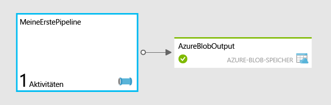

<properties
	pageTitle="Erste Schritte mit Azure Data Factory"
	description="Dieses Tutorial zeigt, wie Sie eine Beispieldatenpipeline erstellen, die Daten mithilfe von Azure HDInsight transformiert."
	services="data-factory"
	documentationCenter=""
	authors="spelluru"
	manager="jhubbard"
	editor="monicar"/>

<tags
	ms.service="data-factory"
	ms.workload="data-services"
	ms.tgt_pltfrm="na"
	ms.devlang="na"
	ms.topic="hero-article" 
	ms.date="11/02/2015"
	ms.author="spelluru"/>

# Erste Schritte mit Azure Data Factory
> [AZURE.SELECTOR]
- [Tutorial Overview](data-factory-build-your-first-pipeline.md)
- [Using Data Factory Editor](data-factory-build-your-first-pipeline-using-editor.md)
- [Using PowerShell](data-factory-build-your-first-pipeline-using-powershell.md)
- [Using Visual Studio](data-factory-build-your-first-pipeline-using-vs.md)

Dieser Artikel hilft Ihnen beim Einstieg in die Erstellung Ihrer ersten Azure Data Factory.

> [AZURE.NOTE]Dieser Artikel bietet keine grundlegende Übersicht über den Azure Data Factory-Dienst. Eine ausführliche Übersicht über den Dienst finden Sie im Artikel [Einführung in Azure Data Factory](data-factory-introduction.md).

## Übersicht über das Tutorial
Dieses Tutorial führt Sie durch die Schritte zum Erstellen Ihrer ersten Data Factory mit einer Pipeline. Sie erstellen eine Pipeline von Grund auf neu und geben dabei alle erforderlichen Ressourcen an.

Wenn Sie die verschiedenen Funktionen der Data Factory schnell kennenlernen möchten, ohne eine Pipeline von Grund auf zu erstellen, können Sie die Beispiele verwenden, die wir im Azure-Portal bereitstellen. Unter [Azure Data Factory-Update: Vereinfachte Beispielbereitstellung](http://azure.microsoft.com/blog/2015/04/24/azure-data-factory-update-simplified-sample-deployment/) erfahren Sie, wie Sie mithilfe des Azure-Portals einen auf einem Beispiel basierenden Anwendungsfall bereitstellen.

## Voraussetzungen
Bevor Sie mit diesem Tutorial beginnen, benötigten Sie Folgendes:

1.	**Azure-Abonnement** – Wenn Sie über kein Azure-Abonnement verfügen, können Sie in wenigen Minuten ein kostenloses Testversionskonto einrichten. Im Artikel [Kostenlose Testversion](http://azure.microsoft.com/pricing/free-trial/) erfahren Sie, wie Sie ein kostenloses Testkonto erhalten.

2.	**Azure-Speicher** – Sie benötigen ein Azure-Speicherkonto zum Speichern der Daten in diesem Tutorial. Falls Sie noch kein Azure-Speicherkonto haben, lesen Sie den Artikel [Erstellen eines Speicherkontos](../storage-create-storage-account/#create-a-storage-account). Nachdem Sie das Speicherkonto erstellt haben, müssen Sie den Kontoschlüssel für den Zugriff auf den Speicher abrufen. Siehe [Anzeigen, Kopieren und erneutes Generieren von Speicherzugriffsschlüsseln](../storage-create-storage-account/#view-copy-and-regenerate-storage-access-keys).

## Inhalt dieses Tutorials	
Azure Data Factory ermöglicht Ihnen das Zusammesetzen von Datenverschiebungs- und Datenverarbeitungsaufgaben zu einem datengesteuerten Workflow. Sie erfahren, wie Sie Ihre erste Pipeline erstellen, die HDInsight verwendet, um Webprotokolle monatlich zu transformieren und zu analysieren.

In diesem Tutorial führen Sie die folgenden Schritte aus:

1.	Erstellen einer Data Factory.
2.	Erstellen der folgenden verknüpften Dienste:
	1.	**Azure Storage-Konto** – Das Azure-Speicherkonto wird zum Speichern von Dateien verwendet, die vom bedarfsgesteuerten HDInsight-Cluster verwendet werden.
	2.	**Bedarfsgesteuerter HDInsight-Cluster** – Ein HDInsight-Cluster wird bei Bedarf gestartet, um die Daten zu transformieren und zu analysieren.
3.	Erstellen des Ausgabedatasets 
4.	Erstellen der Pipeline, die ein Hive-Skript ausführt und das Ergebnis im Ausgabedataset speichert. Das Hive-Skript erstellt zuerst eine externe Tabelle mit einem Verweis auf die unformatierten Webprotokolldaten im Azure-Blobspeicher. Im nächsten Schritt im Hive-Skript werden die Rohdaten dann nach Jahr und Monat partitioniert.

Ihre erste Pipeline mit dem Namen **MyFirstPipeline** verwendet eine Hive-Aktivität zum Transformieren und Analysieren von Webprotokollen, die als Teil des HDInsight-Clusters bereitgestellt und in **/HdiSamples/WebsiteLogSampleData/SampleLog/** gespeichert werden.

Nachdem das Hive-Skript ausgeführt wurde, werden die Ergebnisse im Azure-Blobspeichercontainer **data/partitioneddata** gespeichert.

Die für das Dataset **AzureBlobOutput** definierte Verfügbarkeit bestimmt, wie oft die Hive-Aktivität ausgeführt wird. In diesem Tutorial erfolgt sie monatlich.

## Vorbereiten des Azure-Speichers für das Tutorial
Bevor Sie mit dem Tutorial beginnen, müssen Sie den Azure-Speicher mit Dateien vorbereiten, die für das Tutorial benötigt werden.

1. Starten Sie **Editor**, und fügen Sie das folgende HQL-Skript ein. Mit diesem Hive-Skript werden zwei externe Tabellen erstellt: **WebLogsRaw** und **WebLogsPartitioned**. Klicken Sie im Menü auf **Datei**, und wählen Sie **Speichern unter** aus. Wechseln Sie zum Ordner **C:\\adfgettingstarted** auf Ihrer Festplatte. Wählen Sie **Alle Dateien (*.*)** im Feld **Dateityp** aus. Geben Sie **partitionweblogs.hql** als **Dateinamen** ein. Überprüfen Sie, ob im Feld **Codierung** unten im Dialogfeld **ANSI** festgelegt ist. Falls nicht, legen Sie es auf **ANSI** fest.  
	
		set hive.exec.dynamic.partition.mode=nonstrict;
		
		DROP TABLE IF EXISTS WebLogsRaw; 
		CREATE TABLE WebLogsRaw (
		  date  date,
		  time  string,
		  ssitename string,
		  csmethod  string,
		  csuristem  string,
		  csuriquery string,
		  sport int,
		  susername string,
		  cipcsUserAgent string,
		  csCookie string,
		  csReferer string,
		  cshost  string,
		  scstatus  int,
		  scsubstatus  int,
		  scwin32status  int,
		  scbytes int,
		  csbytes int,
		  timetaken int
		)
		ROW FORMAT DELIMITED FIELDS TERMINATED BY ' '
		LINES TERMINATED BY '\n' 
		tblproperties ("skip.header.line.count"="2");
		
		LOAD DATA INPATH '/HdiSamples/WebsiteLogSampleData/SampleLog/909f2b.log' OVERWRITE INTO TABLE WebLogsRaw;
		
		DROP TABLE IF EXISTS WebLogsPartitioned ; 
		create external table WebLogsPartitioned (  
		  date  date,
		  time  string,
		  ssitename string,
		  csmethod  string,
		  csuristem  string,
		  csuriquery string,
		  sport int,
		  susername string,
		  cipcsUserAgent string,
		  csCookie string,
		  csReferer string,
		  cshost  string,
		  scstatus  int,
		  scsubstatus  int,
		  scwin32status  int,
		  scbytes int,
		  csbytes int,
		  timetaken int
		)
		partitioned by ( year int, month int)
		ROW FORMAT DELIMITED FIELDS TERMINATED BY ',' 
		STORED AS TEXTFILE 
		LOCATION '${hiveconf:partitionedtable}';
		
		INSERT INTO TABLE WebLogsPartitioned  PARTITION( year , month) 
		SELECT
		  date,
		  time,
		  ssitename,
		  csmethod,
		  csuristem,
		  csuriquery,
		  sport,
		  susername,
		  cipcsUserAgent,
		  csCookie,
		  csReferer,
		  cshost,
		  scstatus,
		  scsubstatus,
		  scwin32status,
		  scbytes,
		  csbytes,
		  timetaken,
		  year(date),
		  month(date)
		FROM WebLogsRaw
	 
2. So bereiten Sie den Azure-Speicher für das Tutorial vor:
	1. Laden Sie die [neueste Version von **AzCopy**](http://aka.ms/downloadazcopy) oder die [neueste Vorschauversion](http://aka.ms/downloadazcopypr) herunter. Im Artikel [Verwenden von AzCopy ](../storage/storage-use-azcopy.md) finden Sie eine Anleitung zur Verwendung des Hilfsprogramms.
	2. Nach der Installation von AzCopy können Sie das Tool dem Systempfad hinzufügen, indem Sie den folgenden Befehl an der Eingabeaufforderung ausführen. 
	
			set path=%path%;C:\Program Files (x86)\Microsoft SDKs\Azure\AzCopy			 

	3. Navigieren Sie zum Ordner "c:\\adfgettingstarted", und führen Sie den folgenden Befehl zum Hochladen der HQL-Datei von Hive in das Speicherkonto aus. Ersetzen Sie **StorageAccountName** durch den Namen Ihres Speicherkontos und **Storage Key** durch den Speicherkontoschlüssel.

			AzCopy /Source:. /Dest:https://<StorageAccountName>.blob.core.windows.net/script /DestKey:<Storage Key>

		> [AZURE.NOTE]Der obige Befehl erstellt einen Container mit dem Namen **Skript** in Ihrem Azure-Blobspeicher und kopiert die Datei **partitionweblogs.hql** aus Ihrem lokalen Laufwerk in den Container.
	>
	5. Nachdem die Datei erfolgreich hochgeladen wurde, sehen Sie die folgende Ausgabe von AzCopy.
	
			Finished 1 of total 1 file(s).
			[2015/06/15 15:47:13] Transfer summary:
			-----------------
			Total files transferred: 1
			Transfer successfully:   1
			Transfer skipped:        0
			Transfer failed:         0
			Elapsed time:            00.00:00:01

Gehen Sie wie folgt vor:

- Klicken Sie oben auf den Link [Data Factory-Editor verwenden](data-factory-build-your-first-pipeline-using-editor.md), um das Tutorial mithilfe des Data Factory-Editors auszuführen, der Teil des klassischen Azure-Portals ist.
- Klicken Sie oben auf den Link [PowerShell verwenden](data-factory-build-your-first-pipeline-using-powershell.md), um das Lernprogramm mit Azure PowerShell auszuführen.
- Klicken Sie oben auf den Link [Mit Visual Studio](data-factory-build-your-first-pipeline-using-vs.md), um das Tutorial mit Visual Studio auszuführen. 

<!---HONumber=AcomDC_1203_2015-->