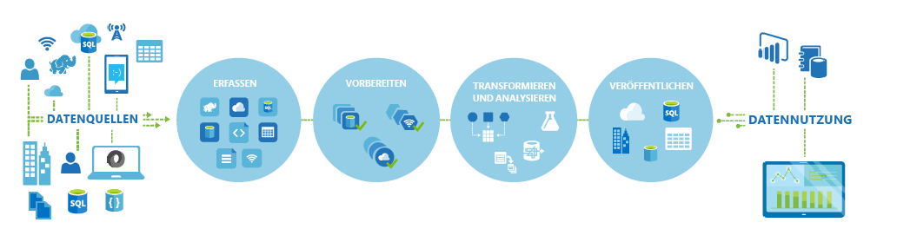
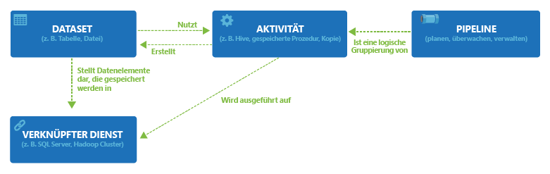

<properties 
	pageTitle="Einführung in Azure Data Factory" 
	description="Erfahren Sie, wie Sie mithilfe des Azure Data Factory-Diensts Verarbeitungs-, Speicher- und Verschiebungsdienste für Daten entwickeln können, um Pipelines zu erstellen, die vertrauenswürdige Informationen erzeugen." 
	services="data-factory" 
	documentationCenter="" 
	authors="spelluru" 
	manager="jhubbard" 
	editor="monicar"/>

<tags 
	ms.service="data-factory" 
	ms.workload="data-services" 
	ms.tgt_pltfrm="na" 
	ms.devlang="na" 
	ms.topic="get-started-article" 
	ms.date="11/18/2015" 
	ms.author="spelluru"/>

# Einführung in den Azure Data Factory-Dienst

## Übersicht
Data Factory ist ein cloud-basierter Daten-Integrationsdienst, der das Verschieben und Transformieren von Daten organisiert und automatisiert. Genau wie ein Fertigungsbetrieb, in dem Anlagen Rohmaterialien verarbeiten und in Endprodukte umwandeln, organisiert Data Factory vorhandene Dienste so, dass Rohdaten gesammelt und in nutzbare Informationen transformiert werden.

Data Factory arbeitet mit lokalen und Clouddatenquellen und SaaS, um Daten zu erfassen, vorzubereiten, umzuwandeln, zu analysieren und zu veröffentlichen. Nutzen Sie Data Factory, um Dienste in verwalteten Datenflusspipelines zusammenzusetzen und Ihre Daten mithilfe von Diensten wie [Azure HDInsight (Hadoop)](http://azure.microsoft.com/documentation/services/hdinsight/) und [Azure Batch](https://azure.microsoft.com/documentation/services/batch/) für Ihre Big Data-Rechenanforderungen und [Azure Machine Learning](https://azure.microsoft.com/documentation/services/machine-learning/) zu transformieren, um Ihre Analyselösungen in Betrieb zu nehmen. Lassen Sie bloße tabellarische Überwachungsansichten hinter sich, und nutzen Sie die umfassenden Visualisierungen von Data Factory, um schnell die Herkunft und Abhängigkeiten zwischen Ihren Datenpipelines anzuzeigen. Überwachen Sie alle Ihre Datenflusspipelines über eine zentrale einheitliche Ansicht, um Probleme einfach auszumachen und Überwachungswarnungen einzurichten.

**Abbildung 1** Sie können Daten aus vielen verschiedenen lokalen Datenquellen sammeln, diese erfassen, vorbereiten, organisieren und mithilfe verschiedener Transformationen analysieren und dann nutzbare Daten veröffentlichen.

Sie können Data Factory immer dann einsetzen, wenn Sie Daten verschiedener Formen und Größen sammeln, umwandeln und veröffentlichen müssen, um sich weitreichende Erkenntnisse zu verschaffen, um zwar gemäß einem zuverlässigen Zeitplan. Daten-Factory wird zur Erstellung von Datenflusspipelines für hohe Verfügbarkeit für viele Szenarien und in verschiedenen Branchen mit Analysen-Pipeline-Anforderungen verwendet. Online-Einzelhandelsunternehmen verwenden sie zum Generieren personalisierter [Produktempfehlungen](data-factory-product-reco-usecase.md) basierend auf dem Surfverhalten der Kunden. Game Studios verwenden sie, um die[Effektivität ihrer Marketing](data-factory-customer-profiling-usecase.md)-Kampagnen zu überprüfen. Erfahren Sie direkt von unseren Kunden wie und warum sie Data Factory verwenden, indem Sie die [Kundenfallstudien](data-factory-customer-case-studies.md) durchsehen.

> [AZURE.VIDEO azure-data-factory-overview]

## Wichtige Begriffe

Azure Data Factory verfügt über einige wichtige Entitäten, die zusammenarbeiten, um die Ein- und Ausgabedaten, Verarbeitungsereignisse sowie den Zeitplan und die Ressourcen zu bestimmen, die für den Ablauf des gewünschten Datenflusses erforderlich sind.

**Abbildung 2.** Beziehungen zwischen Dataset, Aktivität, Pipeline und verknüpftem Dienst

### Aktivitäten
Aktivitäten definieren die Aktionen, die Sie auf Ihre Daten anwenden. Jede Aktivität verwendet keine oder mehrere [Datasets](data-factory-create-datasets.md) als Eingaben und erzeugt ein oder mehrere Datasets als Ausgaben. Eine Aktivität ist eine Einheit für die Orchestrierung in Azure Data-Factory. Beispielsweise können Sie eine [Kopieraktivität](data-factory-data-movement-activities.md) verwenden, um das Kopieren von Daten aus einem Dataset in ein anderes zu orchestrieren. Auf ähnliche Weise können Sie eine [Hive-Aktivität](data-factory-data-transformation-activities.md) verwenden, die eine Hive-Abfrage auf einen Azure-HDInsight-Cluster anwendet, um Ihre Daten zu transformieren oder zu analysieren. Azure Data Factory bietet eine Vielzahl von Aktivitäten zur Datentransformation, -analyse und -verschiebung.

### Pipelines
[Pipelines](data-factory-create-pipelines.md) sind eine logische Gruppierung von Aktivitäten. Sie dienen zum Gruppieren von Aktivitäten zu einer Einheit, die zum Ausführen einer Aufgabe verwendet wird. Eine Folge mehrerer Transformationsaktivitäten kann beispielsweise erforderlich sein, um Protokolldateidaten zu bereinigen. Diese Folge kann einen komplexen Zeitplan und Abhängigkeiten aufweisen, die orchestriert und automatisiert werden müssen. Alle diese Aktivitäten können in eine einzelner Pipeline mit dem Namen "ProtokolldateienBereinigen" gruppiert werden. Die Pipeline "ProtokolldateienBereinigen" kann anschließend als Einheit bereitgestellt, geplant oder gelöscht werden, statt jede einzelne Aktivität unabhängig zu verwalten.

### Datasets
[Datasets](data-factory-create-datasets.md) sind benannte Verweise/Zeiger auf die Daten, die Sie als Eingabe oder Ausgabe einer Aktivität verwenden möchten. Datasets bestimmen Datenstrukturen in verschiedenen Datenspeichern einschließlich Tabellen, Dateien, Ordnern und Dokumenten.

### Verknüpfter Dienst
Verknüpfte Dienste definieren die Informationen, die für Data Factory für das Verbinden mit externen Ressourcen erforderlich sind. Verknüpfte Dienste haben in Data Factory zwei Zwecke:

- Sie dienen zum Darstellen eines Datenspeichers, wie z. B. lokales SQL Server, Oracle-Datenbank, Dateifreigabe oder Azure-Blobspeicherkonto. Wie bereits erläutert, stellen Datasets die Strukturen innerhalb der Datenspeicher dar, die mit Data Factory über einen verknüpften Dienst verbunden sind.
- Zum Darstellen einer Computeressource, die die Ausführung einer Aktivität hosten kann. Beispielsweise wird die "HDInsightHive-Aktivität" in einem HDInsight-Hadoop-Cluster ausgeführt.

Mit diesen vier einfachen Konzepten (Datasets, Aktivitäten, Pipelines und verknüpfte Dienste) sind Sie startklar! Sie können von Grund auf [Ihre erste Pipeline erstellen](data-factory-build-your-first-pipeline.md) oder ein vordefiniertes Beispiel bereitstellen, indem Sie die Anweisungen in unseren [Data Factory-Beispielen](data-factory-samples.md) befolgen.

<!---HONumber=AcomDC_0128_2016-->