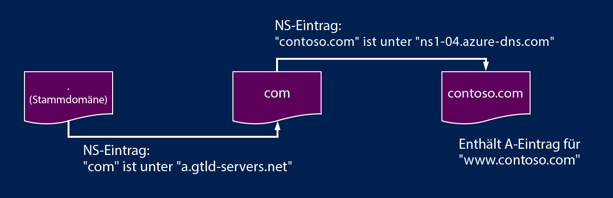

<properties
   pageTitle="Delegieren einer Domäne an Azure DNS | Microsoft Azure"
   description="Grundlegendes zum Ändern der Domänendelegierung und zum Verwenden von DNS-Namenserver zum Hosten von Domänen."
   services="dns"
   documentationCenter="na"
   authors="joaoma"
   manager="carmonm"
   editor=""/>

<tags
   ms.service="dns"
   ms.devlang="na"
   ms.topic="get-started-article"
   ms.tgt_pltfrm="na"
   ms.workload="infrastructure-services"
   ms.date="03/17/2016"
   ms.author="joaoma"/>

# Delegieren von Domänen an Azure DNS

Azure DNS ist ein Hostingdienst für DNS-Domänen. Damit DNS-Abfragen für eine Domäne Azure DNS erreichen, muss die Domäne aus der übergeordneten Domäne an Azure DNS delegiert werden. In diesem Artikel wird die Funktionsweise der Domänendelegierung und die Domänendelegierung an Azure DNS beschrieben.

## Funktionsweise der DNS-Delegierung

### Domänen und Zonen

Eine Domäne ist ein eindeutiger Name im Domain Name System, z. B. "contoso.com". Eine Domänenregistrierungsstelle ist ein Unternehmen, das Internetdomänennamen anbieten kann. Das Unternehmen überprüft, ob die Internetdomäne, die Sie verwenden möchten, noch verfügbar ist, und ermöglicht es Ihnen, sie zu erwerben. Sobald der Domänenname registriert wurde, sind Sie der rechtmäßige Besitzer des Domänennamens. Wenn Sie bereits über eine Internetdomäne verfügen, verwenden Sie für die Delegierung an Azure DNS die aktuelle Domänenregistrierungsstelle.

>[AZURE.NOTE] Weitere Informationen dazu, wer der Besitzer eines bestimmten Domänennamens ist, oder Informationen zum Kauf einer Domäne finden Sie im Thema zur [Verwaltung von Internetdomänen in Azure AD](https://msdn.microsoft.com/library/azure/hh969248.aspx).

Eine DNS-Zone wird zum Hosten der DNS-Einträge für eine bestimmte Domäne verwendet. Die Domäne "contoso.com" kann beispielsweise mehrere DNS-Einträge, wie z. B. "mail.contoso.com" (für einen E-Mail-Server) und "www.contoso.com" (für eine Website), enthalten.

Azure DNS ermöglicht es Ihnen, eine DNS-Zone zu hosten und dadurch die DNS-Einträge für eine Domäne in Azure zu verwalten. Denken Sie daran, dass Azure DNS keine Domänenregistrierungsstelle ist.

Das Domain Name System ist eine Hierarchie von Domänen. Die Hierarchie beginnt mit der Stammdomäne, deren Name einfach "." ist. Darunter befinden sich Domänen der obersten Ebene, z. B. "com", "net", "org", "uk" oder "jp". Unter diesen befinden sich die Domänen der zweiten Ebene, z. B. "org.uk" oder "co.jp". Und so weiter.

Die Domänen in der DNS-Hierarchie werden mithilfe von separaten DNS-Zonen gehostet. Diese Zonen sind global verteilt und werden von DNS-Namenservern in der ganzen Welt gehostet.

### Auflösung und Delegierung

Es gibt zwei Arten von DNS-Server:

- Ein _autoritativer_ DNS-Server hostet DNS-Zonen. Er antwortet nur auf DNS-Abfragen nach Einträgen für diese Zonen.
- Ein _rekursiver_ DNS-Server hostet keine DNS-Zonen. Er antwortet auf alle DNS-Abfragen, indem die autoritativen DNS-Server abgerufen werden, um die benötigten Daten zu erfassen.

DNS-Clients in PCs und mobilen Geräten rufen in der Regel einen rekursiven DNS-Server auf, um DNS-Abfragen auszuführen, die die Clientanwendungen benötigen.

Wenn ein rekursiver DNS-Server eine Abfrage für einen DNS-Eintrag erhält, z. B. "www.contoso.com", muss er zuerst den Namenserver suchen, der die Zone für die Domäne "contoso.com" hostet. Zu diesem Zweck beginnt er mit den Stammnamenservern und sucht von dort aus die Namenserver, die die Zone "com" hosten. Anschließend fragt er die com-Namenserver ab, um den Namenserver zu suchen, der die Zone "contoso.com" hostet. Anschließend kann er diese Namenserver nach "www.contoso.com" abfragen.

Dieser Vorgang wird als "Auflösung von DNS-Namen" bezeichnet. (Streng genommen umfasst die DNS-Auflösung zusätzliche Schritte wie z. B. Folgen von CNAMEs, aber für das Verständnis der Funktionsweise der DNS-Delegierung ist dies nicht wichtig.)

Wie verweist eine übergeordnete Zone auf die Namenserver für eine untergeordnete Zone? Dafür wird eine besondere Art von DNS-Eintrag verwendet, ein sogenannter NS-Eintrag (NS steht für Namenserver). Die Stammzone enthält beispielsweise NS-Einträge für „com“, die die Namenserver für die Zone „com“ anzeigen. Die com-Zone hingegen enthält NS-Einträge für "contoso.com", die die Namenserver für die Zone "contoso.com" anzeigen. Das Einrichten der NS-Einträge für eine untergeordnete Zone in einer übergeordneten Zone wird Delegieren der Domäne genannt.

Jede Delegierung umfasst in Wirklichkeit zwei Kopien der NS-Einträge – eine in der übergeordneten Zone, die auf die untergeordnete Zone verweist, und eine in der untergeordneten Zone selbst. Die Zone "contoso.com" enthält die NS-Einträge für "contoso.com" (neben den NS-Einträgen in "com"). Diese werden als autoritative NS-Einträge bezeichnet, und sie befinden sich der Spitze der untergeordneten Zone.

## Delegieren einer Domänen an Azure DNS

Nachdem Sie Ihre DNS-Zone in Azure DNS erstellt haben, müssen Sie NS-Einträge in der übergeordneten Zone einrichten, um Azure DNS zur autoritativen Quelle für die Namensauflösung der Zone zu machen. Für Domänen, die von einer Registrierungsstelle erworben wurden, bietet Ihnen die Registrierungsstelle die Möglichkeit, diese NS-Einträge einzurichten.

>[AZURE.NOTE] Sie müssen keine Domäne besitzen, um eine DNS-Zone mit diesem Domänennamen in Azure DNS zu erstellen. Sie müssen jedoch Besitzer der Domäne sein, um die Delegierung an Azure DNS bei der Registrierungsstelle einzurichten.

Nehmen wir beispielsweise an, Sie erwerben die Domäne "contoso.com" und erstellen eine Zone mit dem Namen 'contoso.com' in Azure DNS. Als Besitzer der Domäne bietet Ihre Registrierungsstelle Ihnen die Option, die Namenserveradressen (d. h. die NS-Einträge) für Ihre Domäne zu konfigurieren. Die Registrierungsstelle wird diese NS-Einträge in der übergeordneten Domäne speichern, in diesem Fall ".com". Clients auf der ganzen Welt werden beim Auflösen von DNS-Einträgen nach "contoso.com" dann an Ihre Domäne in der Azure DNS-Zone geleitet.

Zum Einrichten der Delegierung müssen Sie den Namenserver für die Zone kennen. Azure DNS weist jedes Mal Namenserver aus einem Pool zu, wenn Sie eine Zone erstellen, und speichert diese in den autoritativen NS-Einträgen, die automatisch in der Zone erstellt werden. Um die Namen der Namenserver anzuzeigen, müssen Sie daher lediglich diese Einträge abrufen.

Mithilfe von Azure PowerShell können die autoritativen NS-Einträge folgendermaßen abgerufen werden. (Der Eintragsname "@" wird verwendet, um auf Einträge an der Spitze der Zone zu verweisen.).

	PS C:\> $zone = Get-AzureRmDnsZone –Name contoso.com –ResourceGroupName MyAzureResourceGroup
	PS C:\> Get-AzureRmDnsRecordSet –Name “@” –RecordType NS –Zone $zone

	Name              : @
	ZoneName          : contoso.com
	ResourceGroupName : MyResourceGroup
	Ttl               : 3600
	Etag              : 5fe92e48-cc76-4912-a78c-7652d362ca18
	RecordType        : NS
	Records           : {ns1-04.azure-dns.com, ns2-04.azure-dns.net, ns3-04.azure-dns.org,
                     ns4-04.azure-dns.info}
	Tags              : {}

In diesem Beispiel wurde die Zone "contoso.com" den Namenservern "ns1-04.azure-dns.com", "ns2-04.azure-dns.net", "ns3-04.azure-dns.org" und "ns4-04.azure-dns.info" zugewiesen.

Jede Registrierungsstelle hat seine eigenen DNS-Verwaltungstools, um die Namenservereinträge für eine Domäne zu ändern. Bearbeiten Sie auf der DNS-Verwaltungsseite der Registrierungsstelle die NS-Einträge, und ersetzen Sie die NS-Einträge mit den von Azure DNS erstellten.

>[AZURE.NOTE] Wenn Sie eine Domäne an Azure DNS delegieren, müssen Sie die von Azure DNS bereitgestellten Namen der Namenserver verwenden. Sie sollten nicht mit Verbindungsdatensätzen auf die IP-Adressen der Azure DNS-Namenserver verweisen, da sich diese IP-Adressen später ändern können. Delegierungen, für die Namen der Namenserver in Ihrer eigenen Zone verwendet werden (manchmal als „Vanity-Namenserver“ bezeichnet), werden derzeit in Azure DNS nicht unterstützt.

Nach Abschluss der Delegierung können Sie überprüfen, ob die Namensauflösung funktioniert, indem Sie ein Tool wie z. B. "nslookup" verwenden, um den SOA-Eintrag für die Zone abzurufen (die auch automatisch beim Erstellen der Zone erstellt wird).

Beachten Sie, dass Sie nicht die Azure DNS-Namenserver angeben müssen, da der normale DNS-Auflösungsvorgang die Namenserver automatisch findet, wenn die Delegierung ordnungsgemäß eingerichtet wurde.

	PS C:\> nslookup –type=SOA contoso.com

	Server: ns1-04.azure-dns.com
	Address: 208.76.47.4

	contoso.com
	primary name server = ns1-04.azure-dns.com
	responsible mail addr = msnhst.microsoft.com
	serial = 1
	refresh = 900 (15 mins)
	retry = 300 (5 mins)
	expire = 604800 (7 days)
	default TTL = 300 (5 mins)

## Delegieren von Unterdomänen in Azure DNS

Angenommen, Sie möchten nach dem Einrichten und Delegieren von "contoso.com" in Azure DNS die separate untergeordnete Zone "partners.contoso.com" einrichten. Die auszuführenden Schritte ähneln dabei dem Einrichten einer normalen Delegierung:

1. Erstellen Sie die untergeordnete Zone "partners.contoso.com" in Azure DNS.
2. Suchen Sie die autoritativen NS-Datensätze in der untergeordneten Zone, um die Namenserver abzurufen, die die untergeordnete Zone in Azure DNS hosten.
3. Delegieren Sie die untergeordnete Zone, indem Sie NS-Datensätze in der übergeordneten Zone konfigurieren, die auf die untergeordnete Zone verweisen.

Der einzige Unterschied besteht darin, dass in Schritt 3 die NS-Datensätze in der übergeordneten Zone "contoso.com" in Azure DNS erstellt werden müssen und nicht über eine Domänenregistrierungsstelle eingerichtet werden.

Das folgende PowerShell-Beispiel dient als Veranschaulichung. Wir erstellen zuerst die übergeordnete und die untergeordnete Zone, die sich in der gleichen Ressourcengruppe oder in unterschiedlichen Ressourcengruppen befinden können.

	PS C:\> $parent = New-AzureRmDnsZone -Name contoso.com -ResourceGroupName RG1
	PS C:\> $child = New-AzureRmDnsZone -Name partners.contoso.com -ResourceGroupName RG1

Dann rufen wir wie im folgenden Beispiel dargestellt die autoritativen NS-Datensätze aus der untergeordneten Zone ab.

	PS C:\> $child_ns_recordset = Get-AzureRmDnsRecordSet -Zone $child -Name "@" -RecordType NS

Schließlich erstellen wir den entsprechenden NS-Datensatz in der übergeordneten Zone, um die Delegierung abzuschließen (Beachten Sie, dass der Name des Datensatzes in der übergeordneten Zone mit dem Namen in der untergeordneten Zone übereinstimmt, in diesem Fall "partners").

	PS C:\> $parent_ns_recordset = New-AzureRmDnsRecordSet -Zone $parent -Name "partners" -RecordType NS -Ttl 3600
	PS C:\> $parent_ns_recordset.Records = $child_ns_recordset.Records
	PS C:\> Set-AzureRmDnsRecordSet -RecordSet $parent_ns_recordset

Wie beim Delegieren mithilfe einer Registrierungsstelle können wir überprüfen, ob alles ordnungsgemäß eingerichtet ist, indem wir den SOA-Datensatz der untergeordneten Zone suchen.

	PS C:\> nslookup –type=SOA partners.contoso.com

	Server: ns1-08.azure-dns.com
	Address: 208.76.47.8

	partners.contoso.com
		primary name server = ns1-08.azure-dns.com
		responsible mail addr = msnhst.microsoft.com
		serial = 1
		refresh = 900 (15 mins)
		retry = 300 (5 mins)
		expire = 604800 (7 days)
		default TTL = 300 (5 mins)

## Nächste Schritte

[Verwalten von DNS-Zonen](dns-operations-dnszones.md)

[Verwalten von DNS-Einträgen](dns-operations-recordsets.md)

[Automatisieren von Azure-Vorgängen mit dem .NET SDK](dns-sdk.md)

[REST-API-Referenz für Azure DNS](https://msdn.microsoft.com/library/azure/mt163862.aspx)

<!---HONumber=AcomDC_0323_2016-->