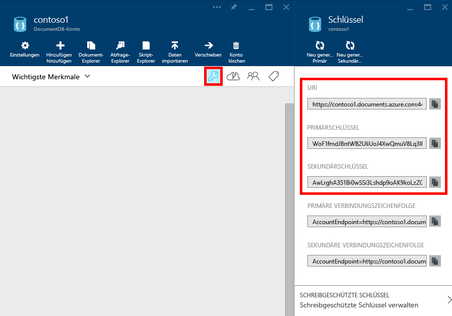

<properties 
	pageTitle="Verwalten eines DocumentDB-Kontos | Azure" 
	description="Erfahren Sie, wie Sie Ihr DocumentDB-Konto verwalten." 
	services="documentdb" 
	documentationCenter="" 
	authors="stephbaron" 
	manager="jhubbard" 
	editor="cgronlun"/>

<tags 
	ms.service="documentdb" 
	ms.workload="data-services" 
	ms.tgt_pltfrm="na" 
	ms.devlang="na" 
	ms.topic="article" 
	ms.date="03/23/2015" 
	ms.author="stbaro"/>

#Verwalten eines DocumentDB-Kontos

Erfahren Sie, wie mit Schlüsseln, Konsistenzeinstellungen und Kapazitätseinstellungen arbeiten und ein Konto löschen.

## Anzeigen, Kopieren und erneutes Generieren von Zugriffsschlüsseln
Wenn Sie ein DocumentDB-Konto erstellen, generiert der Dienst zwei Hauptzugriffsschlüssel, die für die Authentifizierung verwendet werden können, wenn der Zugriff auf das DocumentDB-Konto erfolgt. Durch Bereitstellen von zwei Zugriffsschlüsseln ermöglicht DocumentDB Ihnen das erneute Generieren der Schlüssel ohne Unterbrechung des Zugriffs auf das DocumentDB-Konto.

Greifen Sie im [Azure-Vorschauportal](https://portal.azure.com/) auf den Bereich **Schlüssel** des Blatts **DocumentDB-Konto** zu, um die für den Zugriff auf Ihr DocumentDB-Konto verwendeten Schlüssel anzuzeigen, zu kopieren und neu zu generieren.

### Anzeigen und Kopieren eines Zugriffsschlüssels

1.      Greifen Sie im [Azure-Vorschauportal](https://portal.azure.com/) auf Ihr DocumentDB-Konto zu.

2.      Klicken Sie im Bereich **Zusammenfassung** auf **Schlüssel**.

3.      Klicken Sie im Blatt **Schlüssel** auf die Schaltfläche **Kopieren** rechts neben dem Schlüssel, den Sie kopieren möchten.

  

### Erneutes Generieren von Zugriffsschlüsseln

Sie sollten regelmäßig die Zugriffsschlüssel für Ihr DocumentDB-Konto ändern, um dafür zu sorgen, dass Ihre Verbindungen möglichst sicher sind. Zwei Zugriffsschlüssel werden zugewiesen, damit Sie Verbindungen zum DocumentDB-Konto mit einem Zugriffsschlüssel aufrechterhalten können, während Sie den anderen Zugriffsschlüssel neu generieren.

> [AZURE.WARNING] Das erneute Generieren der Zugriffsschlüssel wirkt sich auf alle Anwendungen aus, die vom aktuellen Schlüssel abhängen. Alle Clients, die den Zugriffsschlüssel verwenden, um auf das DocumentDB-Konto zuzugreifen, müssen aktualisiert werden, um den neuen Schlüssel zu verwenden.

Falls Sie über Webanwendungen oder Cloud-Dienste verfügen, die das DocumentDB-Konto verwenden, verlieren Sie die Verbindungen beim erneuten Generieren von Schlüsseln - es sei denn, Sie führen einen Rollup für die Schlüssel aus. Die folgenden Schritte stellen den Prozess für das Rollup der Schlüssel dar.

1.      Aktualisieren Sie den Zugriffsschlüssel im Anwendungscode, damit er auf den sekundären Zugriffsschlüssel des DocumentDB-Kontos verweist.

2.      Generieren Sie den primären Zugriffsschlüssel für Ihr DocumentDB-Konto neu. Greifen Sie im [Azure-Vorschauportal](https://portal.azure.com/) auf Ihr DocumentDB-Konto zu.

3.      Klicken Sie in der Zusammenfassung auf **Schlüssel**.

4.      Klicken Sie im Blatt **Schlüssel** auf den Befehl **Primären Zugriffsschlüssel neu generieren**, und klicken Sie dann auf **OK**, um das Generieren eines neuen Schlüssels zu bestätigen.

5.      Sobald Sie sichergestellt haben, dass der neue Schlüssel verwendet werden kann (etwa 5 Minuten nach der erneuten Erzeugung), aktualisieren Sie den Zugriffsschlüssel im Anwendungscode, damit er auf den neuen primären Zugriffsschlüssel verweist.

6.      Generieren Sie den sekundären Zugriffsschlüssel neu.

*Beachten Sie, dass die Bereitstellung eines neu generierten Schlüssels einige Minuten in Anspruch nehmen kann, bevor Sie damit auf Ihr DocumentDB-Konto zugreifen können.*

## Verwalten von DocumentDB-Konsistenzeinstellungen: 
DocumentDB unterstützt vier detailliert definierte, benutzerkonfigurierbare Datenkonsistenzebenen. Mit diesen können Anwendungsentwickler vorhersagbare Kompromisse zwischen Konsistenz, Verfügbarkeit und Latenz schließen.

- **Strong** garantiert, dass Lesevorgänge stets den zuletzt geschriebenen Wert zurückgeben.

- **Bounded Staleness** garantiert, dass gelesene Werte nicht zu veraltet sind. Dadurch wird insbesondere garantiert, dass die Lesevorgänge nicht älter als K-Versionen der zuletzt geschriebenen Version sind. 

- **Session** garantiert monotone Lesevorgänge (es werden niemals alte Daten, dann neue, dann wieder alte gelesen) und monotone Schreibvorgänge (Schreibvorgänge werden geordnet). Und es wird garantiert, dass die neuesten Schreibvorgänge bezogen auf den Status eines einzelnen Clients gelesen werden.

- **Eventual** garantiert, dass Lesevorgänge stets ein gültiges Subset von Schreibvorgängen ergeben und schließlich konvergieren.

*Beachten Sie, dass DocumentDB-Konten standardmäßig über die Konsistenzebene "Session" verfügen. Weitere Informationen zu DocumentDB-Konsistenzeinstellungen finden Sie im Abschnitt [Konsistenzebene](http://go.microsoft.com/fwlink/p/?LinkId=402365).*

### Festlegen der standardmäßigen Konsistenz für ein DocumentDB-Konto

1.      Greifen Sie im [Azure-Vorschauportal](https://portal.azure.com/) auf Ihr DocumentDB-Konto zu.

2.      Klicken Sie unter **Konfiguration** auf **Standardkonsistenz**.

3.      Wählen Sie im Blatt **Standardkonsistenz** die für das DocumentDB-Konto standardmäßig zu verwendende Konsistenzebene aus.

4.      Klicken Sie auf **Speichern**.

5.      Sie können den Fortschritt des Vorgangs im  Notification Hub des Azure-Vorschauportals überwachen.

*Beachten Sie, dass es einige Minuten in Anspruch nehmen kann, bis sich die Änderung der Standardkonsistenz auf Ihr DocumentDB-Konto auswirkt.*

## Verwalten von DocumentDB-Kapazitätseinstellungen: Microsoft Azure DocumentDB ermöglicht Ihnen eine flexible Skalierung entsprechend den Anforderungen Ihrer Anwendung über ihren gesamten Lebenszyklus. Die Skalierung von DocumentDB erfolgt durch Erhöhung der Kapazität Ihres DocumentDB-Datenbankkontos im Azure-Vorschauportal.

Wenn Sie ein Datenbankkonto erstellen, wird es mit Datenbankspeicherplatz und reserviertem Durchsatz bereitgestellt. Sie können jederzeit den bereitgestellten Datenbankspeicher und Durchsatz für Ihr Konto ändern, indem Sie Kapazitätseinheiten über das Azure-Vorschauportal hinzufügen oder entfernen.

### Hinzufügen oder Entfernen von Kapazitätseinheiten

1.      Greifen Sie im [Azure-Vorschauportal](https://portal.azure.com/) auf Ihr DocumentDB-Konto zu.

2.      Klicken Sie im Bereich **Nutzung** auf **Skalieren**.

3.      Geben Sie im Blatt **Skalierung** die Anzahl der für Ihr DocumentDB-Konto zu verwendenden Kapazitätseinheiten an.

4.      Klicken Sie auf **Speichern**. (Beachten Sie, dass es ggf. einige Minuten dauert, bis der Skalierungsvorgang abgeschlossen ist. Sie können den Fortschritt im Notification Hub des Azure-Vorschauportals überwachen.)

 *Beachten Sie, dass die DocumentDB-Vorschau maximal 5 Kapazitätseinheiten
je DocumentDB-Konto unterstützt.*

##  Gewusst wie: Löschen eines DocumentDB-Kontos Verwenden Sie zum Löschen eines nicht mehr verwendeten DocumentDB-Kontos den Befehl **Löschen** im Blatt **DocumentDB-Konto**.

> [AZURE.WARNING] In der Vorschauversion gibt es keine Möglichkeit zur Wiederherstellung des Inhalts aus einem gelöschten DocumentDB-Konto. Beim Löschen eines DocumentDB-Kontos werden alle Ressourcen des Kontos einschließlich Datenbanken, Sammlungen, Dokumenten und Anhängen gelöscht.

1.      Greifen Sie im [Azure-Vorschauportal](https://portal.azure.com/) auf das zu löschende DocumentDB-Konto zu.

2.      Klicken Sie im Blatt **DocumentDB-Konto** auf den Befehl **Löschen**.

3.      Geben Sie im daraufhin angezeigten Bestätigungsblatt den Namen des DocumentDB-Kontos ein, um zu bestätigen, dass Sie das Konto löschen möchten.

4.      Klicken Sie im Bestätigungsblatt auf die Schaltfläche **Löschen**.

## Nächste Schritte

Erfahren Sie mehr über die [ersten Schritte mit Ihrem DocumentDB-Konto](http://go.microsoft.com/fwlink/p/?LinkId=402364).

Weitere Informationen zu DocumentDB finden Sie in der Azure DocumentDB-Dokumentation auf

[azure.com](http://go.microsoft.com/fwlink/?LinkID=402319&clcid=0x409).

 

<!--HONumber=49-->