<properties 
	pageTitle="ASP.NET MVC-Tutorial für DocumentDB: Entwicklung von Webanwendungen | Microsoft Azure" 
	description="Schließen Sie dieses ASP.NET MVC-Tutorial ab, um eine MVC-Webanwendung mit DocumentDB zu erstellen. Sie speichern JSON- und Zugriffsdaten über eine Todo-App, die in Azure Websites gehostet wird." 
	keywords="asp.net mvc tutorial, web application development, mvc web application, asp net mvc tutorial step by step"
	services="documentdb" 
	documentationCenter=".net" 
	authors="ryancrawcour" 
	manager="jhubbard" 
	editor="cgronlun"/>

<tags 
	ms.service="documentdb" 
	ms.workload="data-services" 
	ms.tgt_pltfrm="na" 
	ms.devlang="dotnet" 
	ms.topic="hero-article" 
	ms.date="11/18/2015" 
	ms.author="ryancraw"/>

#Erstellen einer Webanwendung mit ASP.NET MVC unter Verwendung von DocumentDB

> [AZURE.SELECTOR]
- [.NET](documentdb-dotnet-application.md)
- [Node.js](documentdb-nodejs-application.md)
- [Java](documentdb-java-application.md)
- [Python](documentdb-python-application.md) 

Um zu verdeutlichen, wie Sie Azure DocumentDB effizient zum Speichern und Abfragen von JSON-Dokumenten einsetzen, wird in diesem Artikel anhand einer umfassenden exemplarischen Vorgehensweise das Erstellen einer Todo-App mithilfe von Azure DocumentDB erläutert. Die Aufgaben werden als JSON-Dokumente in Azure DocumentDB gespeichert.

In dieser exemplarischen Vorgehensweise wird veranschaulicht, wie Sie mit dem von Azure bereitgestellten DocumentDB-Dienst Daten aus einer in Azure gehosteten ASP.NET MVC-Webanwendung speichern und auf diese zugreifen.

> [AZURE.TIP]Dieses Lernprogramm setzt vorherige Erfahrung mit der Verwendung von ASP.NET MVC und Azure-Websites voraus. Wenn Sie noch nicht mit ASP.NET oder den [erforderlichen Tools](#_Toc395637760) vertraut sind, sollten Sie das vollständige Beispielprojekt von [GitHub][] herunterladen und den Anweisungen in diesem Beispiel folgen. Nachdem Sie das Projekt erstellt haben, können Sie den Artikel lesen, um Einblick in den Code im Kontext des Projekts zu erhalten.

## Voraussetzungen für dieses Datenbanktutorial

Bevor Sie diesen Artikel durcharbeiten, sollten Sie sicherstellen, dass Folgendes vorhanden ist:

- Ein aktives Azure-Konto. Wenn Sie noch kein Konto haben, können Sie in nur wenigen Minuten ein kostenloses Testkonto erstellen. Weitere Informationen finden Sie unter [Kostenloses Azure-Testkonto](https://azure.microsoft.com/pricing/free-trial/).
- [Visual Studio 2013](http://www.visualstudio.com/), Update 4 oder höher
- Azure SDK für .NET Version 2.5.1 oder höher, verfügbar über [Microsoft-Webplattform-Installer][].

Alle Screenshots in diesem Artikel wurden unter Verwendung von Visual Studio 2013 mit Update 4 und Azure SDK für .NET Version 2.5.1 aufgenommen. Wenn Ihr System mit anderen Versionen konfiguriert ist, weichen Ihre Bildschirme und Optionen möglicherweise ab. Wenn Sie jedoch die oben aufgeführten Voraussetzungen erfüllen, sollte diese Lösung funktionieren.

## Schritt 1: Erstellen eines DocumentDB-Datenbankkontos

Erstellen Sie zunächst ein DocumentDB-Konto. Wenn Sie bereits über ein Konto verfügen, können Sie diesen Schritt überspringen und mit [Erstellen einer neuen ASP.NET MVC-Anwendung](#_Toc395637762) fortfahren.

[AZURE.INCLUDE [documentdb-create-dbaccount](../../includes/documentdb-create-dbaccount.md)]

[AZURE.INCLUDE [documentdb-keys](../../includes/documentdb-keys.md)]

 Im Folgenden wird erläutert, wie eine neue ASP.NET MVC-Anwendung von Grund auf erstellt wird.

## Schritt 2: Erstellen einer neuen ASP.NET MVC-Anwendung

Nun, da Sie über ein Konto verfügen, erstellen wir unser neues ASP.NET-Projekt.

1. Zeigen Sie in Visual Studio im Menü **Datei** auf **Neu**, und klicken Sie dann auf **Projekt**.

   	Das Dialogfeld **Neues Projekt** wird angezeigt.
2. Erweitern Sie im Bereich **Projekttypen** die Einträge **Vorlagen**, **Visual C#**, **Web**, und wählen Sie dann **ASP.NET-Webanwendung** aus.

  	

3. Geben Sie im Feld **Name** den Namen des Projekts ein. In diesem Lernprogramm wird der Name "Todo" (Aufgabe) verwendet. Wenn Sie einen anderen Namen verwenden, müssen Sie immer dann, wenn im Lernprogramm der Todo-Namespace genannt wird, die bereitgestellten Codebeispiele auf den von Ihnen verwendeten Namen für Ihre Anwendung ändern.

4. Klicken Sie auf **Durchsuchen**, um zu dem Ordner zu navigieren, in dem Sie das Projekt erstellen möchten, und klicken Sie dann auf **OK**.

  	Das Dialogfeld **Neues ASP.NET-Projekt** wird angezeigt.

  	

5. Wählen Sie im Vorlagenbereich **MVC** aus.

6. Wenn Sie Ihre Anwendung in Azure hosten möchten, aktivieren Sie das Kontrollkästchen **In der Cloud hosten**. Wir haben das Hosten in der Cloud und das Ausführen der auf einer Azure-Website gehosteten Anwendung ausgewählt. Wenn diese Option ausgewählt wird, wird eine Azure-Website vorab bereitgestellt, was die spätere Bereitstellung der endgültigen funktionierenden Anwendung wesentlich erleichtert. Wenn das Projekt nicht in der Cloud gehostet oder Azure nicht im Vorfeld konfiguriert werden soll, deaktivieren Sie das Kontrollkästchen **In der Cloud hosten**.

7. Klicken Sie auf **OK**, und lassen Sie Visual Studio die leere ASP.NET MVC-Gerüstvorlage erstellen.

8. Wenn Sie das Hosten in der Cloud ausgewählt haben, wird mindestens ein zusätzlicher Bildschirm angezeigt, in dem Sie dazu aufgefordert werden, sich bei Ihrem Azure-Konto anzumelden und einige Werte für Ihre neue Website anzugeben. Geben Sie alle zusätzlichen Werte an, und fahren Sie fort.

  	In diesem Beispiel wurde kein "Datenbankserver" ausgewählt, da kein Azure SQL-Datenbankserver verwendet wird. Ein neues Azure DocumentDB-Konto wird zu einem späteren Zeitpunkt im Azure-Portal erstellt.

	Weitere Informationen zum Auswählen eines **App Service-Plans** und einer **Ressourcengruppe** finden Sie unter [Azure App Service-Pläne – Detaillierte Übersicht](../app-service/azure-web-sites-web-hosting-plans-in-depth-overview.md).

  	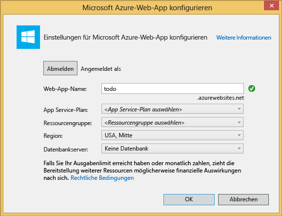

9. Wenn Visual Studio die Bausteine der MVC-Anwendung erstellt hat, steht Ihnen eine leere ASP.NET-Anwendung zur Verfügung, die lokal ausgeführt werden kann.

	Die lokale Ausführung des Projekts wird übersprungen, da sicher alle von Ihnen die ASP.NET-Anwendung "Hello World" gesehen haben. Betrachten wir im Folgenden das Hinzufügen von DocumentDB zu diesem Projekt, und das Erstellen unserer Anwendung.

## Schritt 3: Hinzufügen von DocumentDB zu Ihrem MVC-Webanwendungsprojekt

Nun, da ein Großteil des für diese Lösung benötigten ASP.NET MVC-Frameworks steht, kommen wir zum wesentlichen Teil dieses Tutorials: dem Hinzufügen von Azure DocumentDB zu unserer MVC-Webanwendung.

1. Das DocumentDB .NET SDK wird als NuGet-Paket verpackt und verteilt. Verwenden Sie zum Abrufen des NuGet-Pakets in Visual Studio den NuGet-Paket-Manager in Visual Studio, indem Sie im **Projektmappen-Explorer** mit der rechten Maustaste auf das Projekt klicken und dann auf **NuGet-Pakete verwalten** klicken.

  	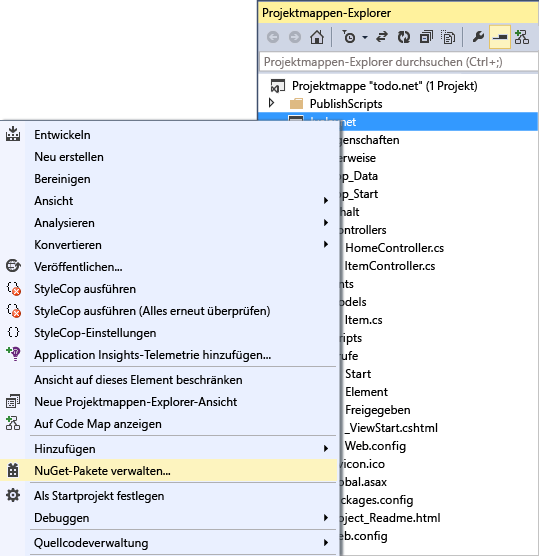

    Das Dialogfeld **NuGet-Pakete verwalten** wird geöffnet.

2. Geben Sie im Feld **Online suchen** den Suchbegriff ***Azure DocumentDB*** ein.
    
    Installieren Sie das in den Ergebnissen aufgeführte Paket **Microsoft Azure DocumentDB-Clientbibliothek**. Das DocumentDB-Paket, sowie alle Abhängigkeiten wie Newtonsoft.Json, werden heruntergeladen und installiert.

  	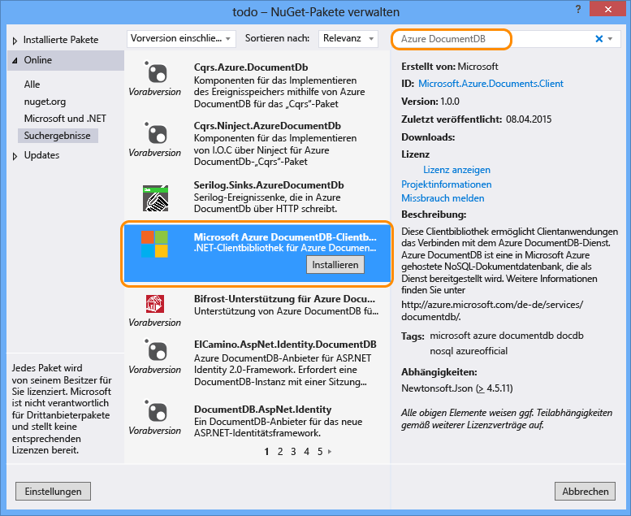

  	Alternativ können Sie die Paketverwaltungskonsole verwenden, um das Paket zu installieren. Klicken Sie dafür im Menü Extras auf **NuGet-Paket-Manager** und dann auf **Paket-Manager-Konsole**. Geben Sie in der Befehlszeile Folgendes ein.

    	Install-Package Microsoft.Azure.DocumentDB

3. Wenn das Paket installiert ist, sollte die Visual Studio-Projektmappe ungefähr wie folgt aussehen und die folgenden zwei neuen Verweise enthalten: Microsoft.Azure.Documents.Client und Newtonsoft.Json.

  	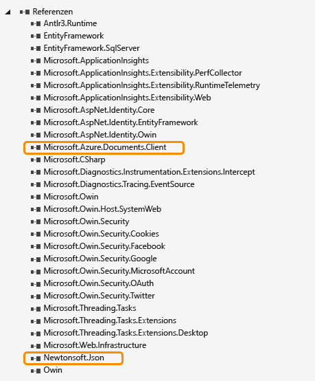

##Schritt 4: Einrichten der ASP.NET MVC-Anwendung
 
Jetzt werden der MVC-Anwendung die Modelle, Ansichten und Controller hinzugefügt:

- [Hinzufügen eines Modells](#_Toc395637764).
- [Hinzufügen eines Controllers](#_Toc395637765).
- [Hinzufügen von Ansichten](#_Toc395637766).

### Hinzufügen eines JSON-Datenmodells

Beginnen wir zunächst mit dem Erstellen des **M** in MVC, des Modells.

1. Klicken Sie im **Projektmappen-Explorer** mit der rechten Maustaste auf den Ordner **Modelle**, und klicken Sie dann auf **Hinzufügen** und anschließend auf **Klasse**.

  	Das Dialogfeld **Neues Element hinzufügen** wird angezeigt.

2. Nennen Sie die neue Klasse **Item.cs** und klicken Sie auf **Hinzufügen**.

3. In dieser neuen **Item.cs**-Datei fügen Sie Folgendes nach der letzten *using-Anweisung* hinzu.
		
		using Newtonsoft.Json;
	
4. Ersetzen Sie jetzt diesen Code
		
		public class Item
		{
		}

	durch den folgenden Code.
		
        public class Item
        {
        	[JsonProperty(PropertyName="id")]
        	public string Id { get; set; }
		
        	[JsonProperty(PropertyName="name")]
        	public string Name { get; set; }
		
        	[JsonProperty(PropertyName = "desc")]
        	public string Description { get; set; }
		
       		[JsonProperty(PropertyName="isComplete")]
        	public bool Completed { get; set; }    
		}

	Alle Daten in DocumentDB werden über das Netzwerk übertragen und als JSON gespeichert. Zum Kontrollieren, wie Ihre Objekte von JSON.NET serialisiert bzw. deserialisiert wurden, können Sie das **JsonProperty**-Attribut verwenden, wie in der erstellten **Element**-Klasse dargestellt. Dies ist nicht **erforderlich**, ist jedoch nützlich, wenn sichergestellt werden soll, dass die Eigenschaften die JSON camelCase-Benennungskonventionen befolgt haben.
	
	Sie können nicht nur das Format des Eigenschaftennamens bei der Weitergabe an JSON steuern, sondern die .NET-Eigenschaften sogar vollständig umbenennen, wie in diesem Beispiel mithilfe der **Description**-Eigenschaft geschehen.
	

### Hinzufügen eines Controllers

Das **M** ist damit abgedeckt, nun wird das **C** in MVC erstellt, eine Controllerklasse.

1. Klicken Sie im **Projektmappen-Explorer** mit der rechten Maustaste auf den Ordner **Controller**, und klicken Sie dann auf **Hinzufügen** und **Controller**.

    Das Dialogfeld **Gerüst hinzufügen** wird angezeigt.

2. Wählen Sie **MVC 5-Controller - Leer** aus, und klicken Sie dann auf **Hinzufügen**.

	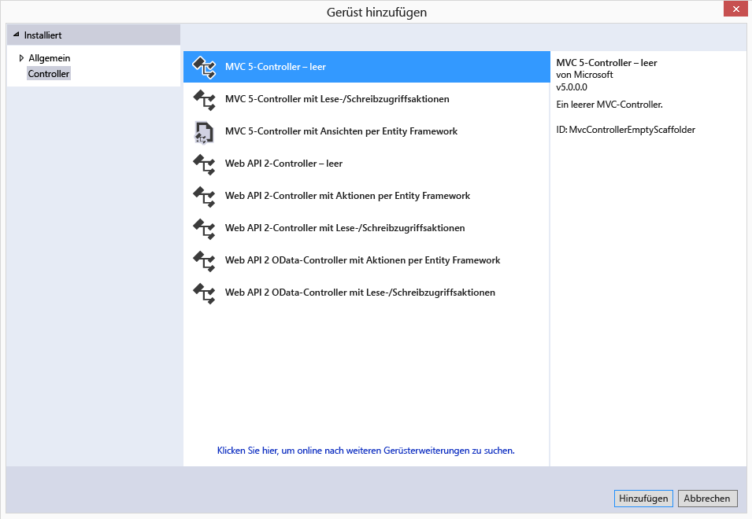

3. Geben Sie dem neuen Controller den Namen **ItemController.**

	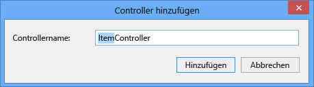

	Nachdem die Datei erstellt wurde, sollte die Visual Studio-Projektmappe ungefähr wie folgt aussehen, und die neue Datei "ItemController.cs" sollte im **Projektmappen-Explorer** angezeigt werden. Die neue Item.cs-Datei, die zuvor erstellt wurde, wird ebenfalls angezeigt.

	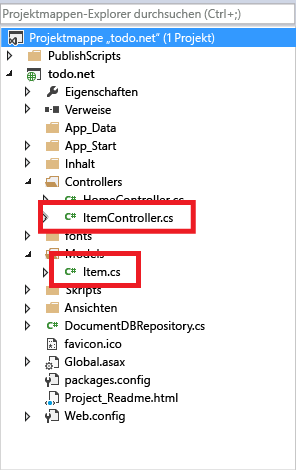

	Sie können ItemController.cs schließen, darauf kommen wir zu einem späteren Zeitpunkt zurück.

### Hinzufügen von Ansichten

Nun wird das **V** in MVC erstellt, die Ansichten (Views):

- [Hinzufügen einer Elementindexansicht](#AddItemIndexView).
- [Hinzufügen einer neuen Elementansicht](#AddNewIndexView).
- [Hinzufügen einer Elementbearbeitungsansicht](#_Toc395888515).

#### Hinzufügen einer Elementindexansicht

1. Erweitern Sie im **Projektmappen-Explorer** den Ordner **Ansichten**, klicken Sie mit der rechten Maustaste auf den leeren Ordner **Item**, der zuvor beim Hinzufügen des **ItemController** von Visual Studio erstellt wurde, klicken Sie auf **Hinzufügen** und dann auf **Ansicht**.

	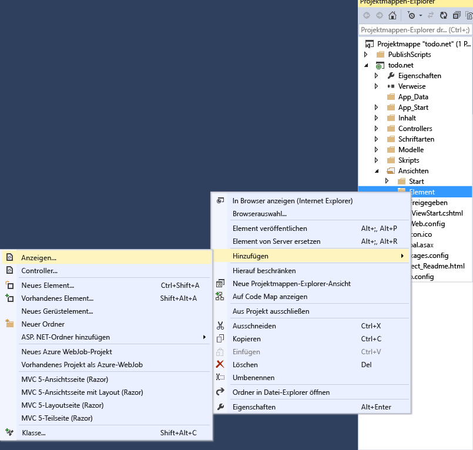

2. Gehen Sie im Dialogfeld **Ansicht hinzufügen** folgendermaßen vor:
	- Geben Sie im Feld **Ansichtsname** den Namen ***Index*** ein.
	- Wählen Sie im Feld **Vorlage** die Option ***Liste*** aus.
	- Wählen Sie im Feld **Modellklasse** die Option ***Item (todo.Models)*** aus.
	- Lassen Sie das Feld **Datenkontextklasse** leer. 
	- Geben Sie im Feld für die Layoutseite ***~/Views/Shared/\_Layout.cshtml*** ein.
	
	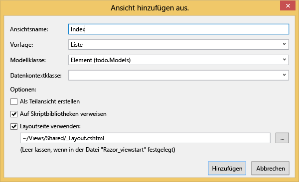

3. Wenn alle Werte festgelegt sind, klicken Sie auf **Hinzufügen**, und Visual Studio erstellt eine neue Vorlagenansicht. Wenn dies abgeschlossen ist, wird die erstellte CSHTML-Datei geöffnet. Diese Datei kann in Visual Studio geschlossen werden, da wir erst später darauf zurückkommen.

#### Hinzufügen einer neuen Elementansicht

Ähnlich wie eine Ansicht vom Typ **Elementindex** wird nun eine neue Ansicht zum Erstellen neuer **Elemente** erstellt.

1. Klicken Sie im **Projektmappen-Explorer** mit der rechten Maustaste erneut auf den Ordner **Elemente**, klicken Sie dann auf **Hinzufügen** und anschließend auf **Ansicht**.

2. Gehen Sie im Dialogfeld **Ansicht hinzufügen** folgendermaßen vor:
    - Geben Sie im Feld **Ansichtsname** den Namen ***Create*** ein.
    - Wählen Sie im Feld **Vorlage** die Option ***Erstellen*** aus.
    - Wählen Sie im Feld **Modellklasse** die Option ***Item (todo.Models)*** aus.
    - Lassen Sie das Feld **Datenkontextklasse** leer.
    - Geben Sie im Feld für die Layoutseite ***~/Views/Shared/\_Layout.cshtml*** ein.
    - Klicken Sie auf **Hinzufügen**.

#### Hinzufügen einer Elementbearbeitungsansicht

Fügen Sie abschließend eine letzte Ansicht zum Bearbeiten eines **Elements** auf dieselbe Art wie vorher hinzu.

1. Klicken Sie im **Projektmappen-Explorer** mit der rechten Maustaste erneut auf den Ordner **Elemente**, klicken Sie dann auf **Hinzufügen** und anschließend auf **Ansicht**.

2. Gehen Sie im Dialogfeld **Ansicht hinzufügen** folgendermaßen vor:
    - Geben Sie im Feld **Ansichtsname** den Namen ***Edit*** ein.
    - Wählen Sie im Feld **Vorlage** die Option ***Bearbeiten*** aus.
    - Wählen Sie im Feld **Modellklasse** die Option ***Item (todo.Models)*** aus.
    - Lassen Sie das Feld **Datenkontextklasse** leer. 
    - Geben Sie im Feld für die Layoutseite ***~/Views/Shared/\_Layout.cshtml*** ein.
    - Klicken Sie auf **Hinzufügen**.

Wenn dies abgeschlossen ist, schließen Sie alle CSHTML-Dokumente in Visual Studio, da wir erst später zu diesen Ansichten zurückkehren.

## Schritt 5: Einrichten von DocumentDB

Nun, da alle grundlegenden Dinge zu MVC behandelt wurden, fügen wir den Code für die DocumentDB hinzu.

In diesem Abschnitt fügen wir Code zur Ausführung folgender Aufgaben hinzu:

- [Auflisten unvollständiger Elemente](#_Toc395637770).
- [Hinzufügen von Elementen](#_Toc395637771).
- [Bearbeiten von Elementen](#_Toc395637772).

### Auflisten unvollständiger Elemente in Ihrer MVC-Webanwendung

Hier muss zunächst eine Klasse hinzugefügt werden, die die gesamte Logik zur Verbindung mit und Verwendung der DocumentDB enthält. Für dieses Lernprogramm kapseln wir die gesamte Logik in einer Repository-Klasse namens DocumentDBRepository.

1. Klicken Sie im **Projektmappen-Explorer** mit der rechten Maustaste auf das Projekt, klicken Sie auf **Hinzufügen** und anschließend auf **Klasse**. Nennen Sie die neue Klasse **DocumentDBRepository** und klicken Sie auf **Hinzufügen**.
 
2. In der neu erstellten **DocumentDBRepository**-Klasse fügen Sie die folgenden *using-Anweisungen* über die *Namespace*-Deklaration hinzu.
		
		using Microsoft.Azure.Documents; 
	    using Microsoft.Azure.Documents.Client; 
	    using Microsoft.Azure.Documents.Linq; 
		using System.Configuration;
		using System.Linq.Expressions;
		using System.Threading.Tasks;

	Ersetzen Sie jetzt diesen Code

		public class DocumentDBRepository
		{
    	}

	durch den folgenden Code.

    	
		public static class DocumentDBRepository<T>
    	{
			//Use the Database if it exists, if not create a new Database
	    	private static Database ReadOrCreateDatabase()
	    	{
	        	var db = Client.CreateDatabaseQuery()
	        	                .Where(d => d.Id == DatabaseId)
	        	                .AsEnumerable()
	        	                .FirstOrDefault();
				
	        	if (db == null)
	        	{
	        	    db = Client.CreateDatabaseAsync(new Database { Id = DatabaseId }).Result;
	        	}
				
	        	return db;
	    	}
			
			//Use the DocumentCollection if it exists, if not create a new Collection
	    	private static DocumentCollection ReadOrCreateCollection(string databaseLink)
	   		{
	    	    var col = Client.CreateDocumentCollectionQuery(databaseLink)
	        	                  .Where(c => c.Id == CollectionId)
	        	                  .AsEnumerable()
	        	                  .FirstOrDefault();
		
	        	if (col == null)
	        	{
					var collectionSpec = new DocumentCollection { Id = CollectionId };
					var requestOptions = new RequestOptions {OfferType = "S1" };
					
	        	    col = Client.CreateDocumentCollectionAsync(databaseLink, collectionSpec, requestOptions).Result;
	        	}
				
	        	return col;
	    	}
			
			//Expose the "database" value from configuration as a property for internal use
     	   	private static string databaseId;
     	   	private static String DatabaseId
     	   	{
				get
				{
					if (string.IsNullOrEmpty(databaseId))
					{
						databaseId = ConfigurationManager.AppSettings["database"];
					}
				
					return databaseId;
				}
       	 	}
			
			//Expose the "collection" value from configuration as a property for internal use
    	    private static string collectionId;
    	    private static String CollectionId
    	    {
				get
				{
					if (string.IsNullOrEmpty(collectionId))
					{
						collectionId = ConfigurationManager.AppSettings["collection"];
					}
				
					return collectionId;
				}
    	    }
			
			//Use the ReadOrCreateDatabase function to get a reference to the database.
    	    private static Database database;
    	    private static Database Database
    	    {
				get
				{
					if (database == null)
					{
						database = ReadOrCreateDatabase();
					}
					
					return database;
				}
    	    }
			
			//Use the ReadOrCreateCollection function to get a reference to the collection.
    	    private static DocumentCollection collection;
    	    private static DocumentCollection Collection
    	    {
				get
				{
					if (collection == null)
					{
						collection = ReadOrCreateCollection(Database.SelfLink);
					}
					
					return collection;
				}
    	    }
			
			//This property establishes a new connection to DocumentDB the first time it is used, 
			//and then reuses this instance for the duration of the application avoiding the
			//overhead of instantiating a new instance of DocumentClient with each request
    	    private static DocumentClient client;
    	    private static DocumentClient Client
    	    {
    	        get
    	        {
    	            if (client == null)
    	            {
						string endpoint = ConfigurationManager.AppSettings["endpoint"];
						string authKey = ConfigurationManager.AppSettings["authKey"];
						Uri endpointUri = new Uri(endpoint);
						client = new DocumentClient(endpointUri, authKey);
    	            }
    	            
    	            return client;
    	        }
    	    }
    	}

	> [AZURE.TIP]Beim Erstellen einer neuen Dokumentensammlung können Sie einen optionalen RequestOptions-Parameter vom Angebotstyp bereitstellen, sodass die Leistungsfähigkeit der neuen Sammlung angegeben werden kann. Wenn dieser Parameter nicht übergeben wird, wird der Standardtangebotstyp verwendet. Weitere Informationen zu DocumentDB-Angebotstypen finden Sie in [Leistungsstufen in DocumentDB](documentdb-performance-levels.md)

3. Nun werden einige Werte aus der Konfiguration gelesen. Öffnen Sie die Datei **Web.config** Ihrer Anwendung, und fügen Sie die folgenden Zeilen unter dem Abschnitt `<AppSettings>` hinzu.
	
    	<add key="endpoint" value="enter the URI from the Keys blade of the Azure Portal"/>
    	<add key="authKey" value="enter the PRIMARY KEY, or the SECONDARY KEY, from the Keys blade of the Azure  Portal"/>
    	<add key="database" value="ToDoList"/>
    	<add key="collection" value="Items"/>
	
4. Aktualisieren Sie nun die Werte für *Endpunkt* und *AuthKey*, indem Sie das Blatt „Schlüssel“ im Azure-Portal verwenden. Verwenden Sie die **URI** aus dem Blatt "Schlüssel" als Wert für die Endpunkt-Einstellung, und verwenden Sie den **PRIMÄRSCHLÜSSEL** oder den **SEKUNDÄRSCHLÜSSEL** aus dem Blatt "Schlüssel" als Wert für die authKey-Einstellung.

    Auf diese Weise wird das DocumentDB-Repository verknüpft. Fügen wir jetzt unsere Anwendungslogik hinzu.

5. Die erste Aufgabe, die mit einer To-Do-List-Anwendung ausgeführt werden soll, ist die Anzeige nicht abgeschlosssener Elemente. Kopieren Sie den folgenden Codeausschnitt und fügen Sie ihn in eine beliebige Stelle innerhalb der **DocumentDBRepository** Klasse ein.

	    public static IEnumerable<T> GetItems(Expression<Func<T, bool>> predicate) 
	    {
			return Client.CreateDocumentQuery<T>(Collection.DocumentsLink) 
				.Where(predicate) 
				.AsEnumerable(); 
		} 

6. Öffnen Sie den zuvor hinzugefügten **ItemController** und fügen Sie die folgenden *using-Anweisungen* über der Namespace-Deklaration hinzu.

		using System.Net;
		using System.Threading.Tasks;
		using todo.Models;

	Wenn das Projekt nicht "Todo" heißt, müssen Sie es auf "Todo.Modelle" aktualisieren, um den Namen Ihres Projekts wiederzugeben.

	Ersetzen Sie jetzt diesen Code

		//GET: Item
		public ActionResult Index()
		{
			return View();
		}

	durch den folgenden Code.

    	public ActionResult Index()
    	{
			var items = DocumentDBRepository<Item>.GetItems(d => !d.Completed);
			return View(items);
    	}
	
Jetzt sollte Ihre Lösung ohne Fehler erstellen können.

Wenn Sie die Anwendung jetzt ausführen, werden Sie zum **HomeController** und der Ansicht **Index** dieses Controllers geleitet. Das ist das Standardverhalten für das MVC-Vorlagenprojekt, das am Anfang ausgewählt wurde, das möchten wir jedoch nicht! Zum Ändern dieses Verhaltens muss die Weiterleitung dieser MVC-Anwendung geändert werden.

Öffnen Sie ***App\\_Start\\RouteConfig.cs***, navigieren Sie zur Zeile, die mit „defaults“ beginnt, und ändern Sie diese auf folgende Weise.

    	defaults: new { controller = "Item", action = "Index", id = UrlParameter.Optional }

Damit weiß ASP.NET MVC, dass Sie keinen Wert in der URL angegeben haben, um das Routingverhalten zu steuern, dass anstelle von **Home** **Item** als Controller und den Benutzer-**Index** als Ansicht verwendet.

Wenn Sie jetzt die Anwendung ausführen, wird Ihr **ItemController** aufgerufen. In diesem wird die „Repository“-Klasse aufgerufen und die „GetItems“-Methode verwendet, um alle unvollständigen Elemente an die Ansicht **Ansichten**\\**Element**\\**Index** zurückzugeben.

Wenn Sie dieses Projekt jetzt erstellen und ausführen, sollte ein Ergebnis ähnlich dem folgenden angezeigt werden.

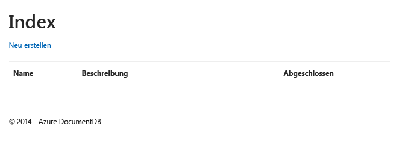

### Hinzufügen von Elementen

Als Nächstes werden einige Elemente zur Datenbank hinzugefügt, damit mehr als eine leere Tabelle angezeigt wird.

Jetzt fügen wir zur DocumentDBRepository und zum ItemController etwas Code hinzu, um den Datensatz in DocumentDB beizubehalten.

1.  Fügen Sie Ihrer **DocumentDBRepository**-Klasse die folgende Methode hinzu.

    	public static async Task<Document> CreateItemAsync(T item)
   	 	{
   	   		return await Client.CreateDocumentAsync(Collection.SelfLink, item);
   		}

	Mit dieser Methode wird ein Objekt an diese übergeben und in DocumentDB gespeichert.

2. Öffnen Sie die Datei „ItemController.cs“ und fügen Sie den folgenden Codeausschnitt in die Klasse ein. So weiß ASP.NET MVC, wie der Vorgang **Erstellen** durchgeführt werden muss. In diesem Fall soll lediglich die zuvor erstellte zugehörige Ansicht "Create.cshtml" gerendert werden.

    	public ActionResult Create()
    	{ 
			return View(); 
   		}

	Es ist noch weiterer Code in diesem Controller notwendig, mit dem die Übermittlung aus der Ansicht **Erstellen** akzeptiert wird.

2. Fügen Sie den nächsten Codeblock zur ItemController.cs-Klasse hinzu, sodass ASP.NET MVC mitgeteilt wird, was mit einem Formular POST für diesen Controller geschehen soll.
	
    	[HttpPost]
    	[ValidateAntiForgeryToken]
   	 	public async Task<ActionResult> Create([Bind(Include = 	"Id,Name,Description,Completed")] Item item)  
  	  	{
			if (ModelState.IsValid)  
			{  
			    await DocumentDBRepository<Item>.CreateItemAsync(item);
			    return RedirectToAction("Index");  
			}   
			return View(item);   
		}
	Dieser Code ruft das DocumentDBRepository-Element auf und verwendet die CreateItemAsync-Methode, um das neue Todo-Element in der Datenbank beizubehalten.
 
	**Sicherheitshinweis**: Das **ValidateAntiForgeryToken**-Attribut wird hier verwendet, um den Schutz dieser Anwendung vor websiteübergreifenden Anforderungsfälschungen zu unterstützen. Das Hinzufügen dieses Attributs reicht jedoch nicht aus, Ihre Ansichten müssen auch mit diesem Antifälschungstoken zusammenarbeiten. Weitere Informationen zum Thema und Beispiele für eine ordnungsgemäße Implementierung finden Sie unter [Verhindern der websiteübergreifenden Anforderungsfälschung][]. Der auf [GitHub][] bereitgestellte Quellcode enthält die vollständige Implementierung.

	**Sicherheitshinweis**: Wir verwenden außerdem das Attribut **Bind** im Methodenparameter, um Schutz vor Overposting-Angriffen bereitzustellen. Weitere Informationen finden Sie unter [Grundlegende CRUD-Vorgänge in ASP.NET MVC][].

Damit ist der für das Hinzufügen neuer Elemente zur Datenbank erforderliche Code komplett.

### Bearbeiten von Elementen

Eine letzte Sache bleibt noch zu tun, nämlich das Hinzufügen der Möglichkeit, **Elemente** in der Datenbank zu bearbeiten und sie als abgeschlossen zu markieren. Die Bearbeitungsansicht wurde bereits zum Projekt hinzugefügt, daher muss lediglich Code zum Controller und zur **DocumentDBRepository**-Klasse hinzugefügt werden.

1. Fügen Sie der **DocumentDBRepository**-Klasse folgenden Code hinzu;

    	public static T GetItem(Expression<Func<T, bool>> predicate)
    	{
        	return Client.CreateDocumentQuery<T>(Collection.DocumentsLink)
                    	.Where(predicate)
                    	.AsEnumerable()
                    	.FirstOrDefault();
    	}		

    	public static async Task<Document> UpdateItemAsync(string id, T item)
    	{
        	Document doc = GetDocument(id);	
        	return await Client.ReplaceDocumentAsync(doc.SelfLink, item);
    	}

		private static Document GetDocument(string id) 
		{ 
			return Client.CreateDocumentQuery(Collection.DocumentsLink) 
				.Where(d => d.Id == id) 
				.AsEnumerable() 
				.FirstOrDefault(); 
		} 
	
	Mit der ersten dieser Methoden ruft **GetItem** ein Element aus DocumentDB ab, das an den **ItemController** und dann an die Ansicht **Bearbeiten** zurückgegeben wird.
	
	Mit der zweiten von uns hinzugefügten Methode wird das **Dokument** in DocumentDB mit der Version des vom **ItemController** übergebenen **Dokuments** ersetzt.

2. Fügen Sie der **ItemController**-Klasse folgenden Code hinzu:

		public ActionResult Edit(string id)
		{
		    if (string.IsNullOrEmpty(id))
		    {
		        return new HttpStatusCodeResult(HttpStatusCode.BadRequest);
		    }
					 
		    Item item = (Item)DocumentDBRepository<Item>.GetItem(d => d.Id == id);
		 	
		    if (item == null)
		    {
		        return HttpNotFound();
		    }
		 	
		    return View(item);
		}
		
    	[HttpPost]
   		[ValidateAntiForgeryToken]
    	public async Task<ActionResult> Edit([Bind(Include = "Id,Name,Description,Completed")] Item item)
    	{
     	   if (ModelState.IsValid)
    	    {
    	        await DocumentDBRepository<Item>.UpdateItemAsync(item.Id, item);
    	        return RedirectToAction("Index");
    	    }

  	      return View(item);
 	   	}
		
	
	Die erste Methode verarbeitet den „Http GET“-Aufruf, der erfolgt, wenn der Benutzer in der Ansicht **Index** auf den Link **Bearbeiten** klickt. Mit dieser Methode wird ein [**Dokument**](http://msdn.microsoft.com/library/azure/microsoft.azure.documents.document.aspx) aus DocumentDB abgerufen und an die Ansicht **Bearbeiten** übergeben.

	Die Ansicht **Bearbeiten** führt dann einen „Http POST“-Aufruf für den **IndexController** durch.
	
	Die zweite Methode, die wir hinzugefügt haben, verarbeitet die Weitergabe des aktualisierten Objekts an DocumentDB, damit es in der Datenbank gespeichert werden kann.

Das ist alles, was zum Ausführen unserer Anwendung, zum Auflisten nicht abgeschlossener **Elemente**, zum Hinzufügen neuer **Elemente** und zum Bearbeiten von **Elementen** notwendig ist.

## Schritt 6: Lokales Ausführen der Anwendung

Um die Anwendung lokal zu testen, führen Sie die folgenden Schritte aus:

1. Drücken Sie in Visual Studio F5 , um die Anwendung im Debugmodus zu erstellen. Die Anwendung sollte erstellt, und ein Browser mit der zuvor angezeigten leeren Rasterseite sollte geöffnet werden:

	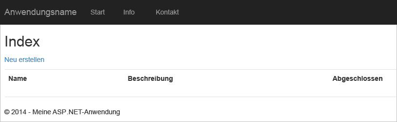

	Wenn an dieser Stelle Fehler auftreten, können Sie Ihren Code mit dem Beispielprojekt auf [GitHub][] vergleichen.

2. Klicken Sie auf den Link **Neu erstellen**, und fügen Sie Werte in die Felder **Name** und **Beschreibung** ein. Lassen Sie das Kontrollkästchen **Abgeschlossen** deaktiviert, andernfalls hat das neue hinzugefügte **Element** den Status abgeschlossen und erscheint nicht in der Anfangsliste.

	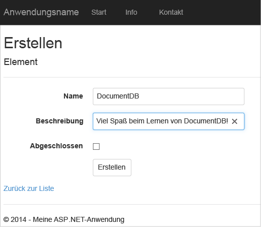

3. Klicken Sie auf **Erstellen**. Sie werden zur Ansicht **Index** zurückgeleitet, und Ihr **Element** wird in der Liste angezeigt.

	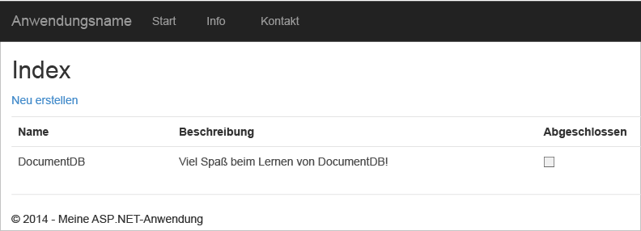

	Sie können weitere **Elemente** zu Ihrer "Todo"-Liste hinzufügen.

3. Wenn Sie auf **Bearbeiten** neben einem **Element** in der Liste klicken, werden Sie zur Ansicht **Edit** weitergeleitet, in der Sie beliebige Eigenschaften Ihres Objekts aktualisieren können, einschließlich der Markierung als **Abgeschlossen**. Wenn Sie das Flag **Abgeschlossen** markieren und auf **Speichern** klicken, wird das **Element** aus der Liste der nicht abgeschlossenen Aufgaben entfernt.

	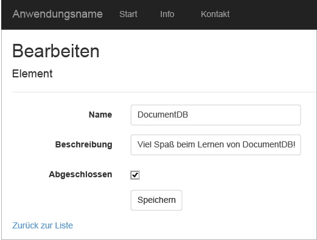

4. Nachdem Sie die App getestet haben, drücken Sie STRG+F5, um das Debuggen der App zu beenden. Jetzt können Sie Ihre App bereitstellen.

##Schritt 7: Bereitstellen der Anwendung in Azure-Websites

Nachdem die vollständige Anwendung korrekt mit DocumentDB zusammenarbeitet, stellen wir diese Web App in Azure-Websites bereit. Wenn Sie beim Erstellen des leeren ASP.NET MVC-Projekts **In der Cloud hosten** ausgewählt haben, ist das Bereitstellen mit Visual Studio wirklich einfach, da Ihnen die meiste Arbeit abgenommen wird.

1. Zum Veröffentlichen der Anwendung müssen Sie lediglich im **Projektmappen-Explorer** mit der rechten Maustaste auf das Projekt klicken und **Veröffentlichen** wählen.

    

2. Alles sollte bereits Ihren Anmeldeinformationen entsprechend konfiguriert sein; tatsächlich wurde die Website bereits unter der angezeigten **Ziel-URL** in Azure erstellt, Sie müssen lediglich noch auf **Veröffentlichen** klicken.

    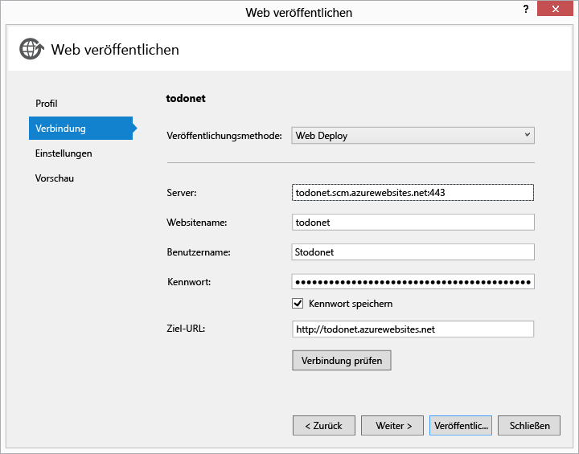

Dann schließt Visual Studio die Veröffentlichung Ihrer Webanwendung in wenigen Sekunden ab und startet einen Browser, in dem das Ergebnis Ihrer Arbeit in Azure ausgeführt wird!

##Nächste Schritte

Glückwunsch! Sie haben soeben Ihre erste ASP.NET MVC-Webanwendung unter Verwendung von Azure DocumentDB erstellt und in Azure Websites veröffentlicht. Der Quellcode für die vollständige Anwendung, einschließlich der Detail- und Löschfunktionen, die in diesem Lernprogramm nicht enthalten waren, kann von [GitHub][] heruntergeladen oder geklont werden. Wenn Sie diese Funktionen also zu Ihrer App hinzufügen möchten, laden Sie den Code herunter, und fügen Sie ihn dieser App hinzu.

Wenn Sie Ihrer Anwendung zusätzliche Funktionen hinzufügen möchten, sehen Sie sich die APIs in der [DocumentDB .NET-Bibliothek](https://msdn.microsoft.com/library/azure/dn948556.aspx) an. Sie können auch gerne eigene Beiträge zur DocumentDB .NET-Bibliothek auf [GitHub][] schreiben.

[*]: https://microsoft.sharepoint.com/teams/DocDB/Shared%20Documents/Documentation/Docs.LatestVersions/PicExportError
[Visual Studio Express]: http://www.visualstudio.com/products/visual-studio-express-vs.aspx
[Microsoft-Webplattform-Installer]: http://www.microsoft.com/web/downloads/platform.aspx
[Verhindern der websiteübergreifenden Anforderungsfälschung]: http://go.microsoft.com/fwlink/?LinkID=517254
[Grundlegende CRUD-Vorgänge in ASP.NET MVC]: http://go.microsoft.com/fwlink/?LinkId=317598
[GitHub]: https://github.com/Azure-Samples/documentdb-net-todo-app

<!---HONumber=AcomDC_0107_2016-->