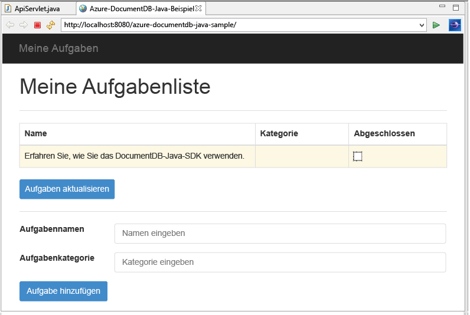
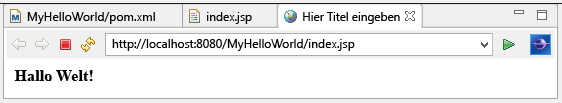

<properties 
	pageTitle="Java-Anwendungsentwicklungs-Lernprogramm, in dem DocumentDB verwendet wird | Microsoft Azure"
	description="In diesem Java-Webanwendungs-Lernprogramm erfahren Sie, wie Sie den Azure DocumentDB-Dienst verwenden, um Daten von einer auf Azure-Websites gehosteten Java-Anwendung zu speichern und abzurufen."
	keywords="Anwendungsentwicklung, Datenbanktutorial, Java-Anwendung, Java-Webanwendungstutorial, DocumentDB, Azure, Microsoft Azure"
	services="documentdb" 
	documentationCenter="java" 
	authors="aliuy" 
	manager="jhubbard" 
	editor="mimig"/>

<tags 
	ms.service="documentdb" 
	ms.devlang="java" 
	ms.topic="hero-article" 
	ms.tgt_pltfrm="NA" 
	ms.workload="data-services" 
	ms.date="01/29/2015" 
	ms.author="andrl"/>

# Erstellen einer Java-Webanwendung mithilfe von DocumentDB

> [AZURE.SELECTOR]
- [.NET](documentdb-dotnet-application.md)
- [Node.js](documentdb-nodejs-application.md)
- [Java](documentdb-java-application.md)
- [Python](documentdb-python-application.md)

In diesem Tutorial zur Java-Webanwendung erfahren Sie, wie Sie den [Microsoft Azure DocumentDB](https://portal.azure.com/#gallery/Microsoft.DocumentDB)-Dienst verwenden, um Daten von einer auf Azure-Websites gehosteten Java-Anwendung zu speichern und abzurufen. In diesem Abschnitt lernen Sie Folgendes:

- Erstellen einer einfachen JSP-Anwendung in Eclipse.
- Arbeiten mit dem Azure DocumentDB-Dienst mit dem [DocumentDB Java SDK](https://github.com/Azure/azure-documentdb-java).

In diesem Java-Anwendungslernprogramm erfahren Sie, wie Sie eine webbasierte Aufgabenverwaltungsanwendung erstellen, mit der Sie Aufgaben erstellen, abrufen und als abgeschlossen kennzeichnen können, wie in der folgenden Abbildung gezeigt. Alle Aufgaben in der Aufgabenliste sind als JSON-Dokumente in Azure DocumentDB gespeichert.

> [AZURE.TIP] In diesem Lernprogramm zur Anwendungsentwicklung wird davon ausgegangen, dass Sie bereits Erfahrung mit Java haben. Wenn Sie noch nicht mit Java oder den [erforderlichen Tools](#Prerequisites) vertraut sind, wird empfohlen, das vollständige [todo](https://github.com/Azure-Samples/documentdb-java-todo-app)-Projekt von GitHub herunterzuladen und [gemäß den Anweisungen am Ende dieses Artikels zu erstellen](#GetProject). Nachdem Sie das Projekt erstellt haben, können Sie den Artikel lesen, um Einblick in den Code im Kontext des Projekts zu erhalten.

##Voraussetzungen für dieses Java-Webanwendungstutorial
Bevor Sie mit diesem Lernprogramm zur Anwendungsentwicklung beginnen, benötigen Sie Folgendes:

- Ein aktives Azure-Konto. Wenn Sie noch kein Konto haben, können Sie in nur wenigen Minuten ein kostenloses Testkonto erstellen. Ausführliche Informationen finden Sie unter [Kostenlose Azure-Testversion](https://azure.microsoft.com/pricing/free-trial/).
- [Java Development Kit (JDK) 7+](http://www.oracle.com/technetwork/java/javase/downloads/index.html).
- [Eclipse IDE für Java EE-Entwickler.](http://www.eclipse.org/downloads/packages/eclipse-ide-java-ee-developers/lunasr1)
- [Eine Azure-Website mit aktivierter Java-Laufzeitumgebung (z. B. Tomcat oder Jetty).](../app-service-web/web-sites-java-get-started.md)

Wenn Sie diese Tools zum ersten Mal installieren, finden Sie unter coreservlets.com im Abschnitt „Schnellstart“ eine schrittweise Anleitung im Artikel [Lernprogramm: TomCat7 installieren und mit Eclipse verwenden](http://www.coreservlets.com/Apache-Tomcat-Tutorial/tomcat-7-with-eclipse.html).

##Schritt 1: Erstellen eines DocumentDB-Datenbankkontos
So stellen Sie ein DocumentDB-Datenbankkonto in Azure bereit

1. Wenn Sie noch kein Datenbankkonto haben, erstellen Sie ein Konto mithilfe der Anweisungen unter [Erstellen eines Datenbankkontos](documentdb-create-account.md). Wenn Sie bereits über ein Konto verfügen, fahren Sie mit Schritt 2 fort.
2. Kopieren Sie mithilfe des Bereichs **Schlüssel**, der in der folgenden Abbildung gezeigt ist, Ihren Endpunkt-**URI** und den **PRIMÄRSCHLÜSSEL** in die Zwischenablage und halten Sie beide bereit, da wir dieser Werte in der Webanwendung verwenden, die wir als Nächstes erstellen.

![Erstellen eines DocumentDB-Kontos – Datenbanklernprogramm. Screenshot des Azure-Portals mit einem DocumentDB-Konto, bei dem der ACTIVE-Hub, die Schaltfläche "SCHLÜSSEL" auf dem Blatt "DocumentDB-Konto", und auf dem Blatt "Schlüssel" die Werte URI, PRIMÄRSCHLÜSSEL und SEKUNDÄRSCHLÜSSEL hervorgehoben sind][1]

##Schritt 2: Erstellen der Java-JSP-Anwendung

So erstellen Sie eine JSP-Anwendung

1. Zunächst beginnen wir mit der Erstellung eines Java-Projekts. Starten Sie Eclipse, klicken Sie auf **Datei**, dann auf **Neu** und schließlich auf **Dynamisches Webprojekt**. Wenn **Dynamic Web Project** nicht als verfügbares Projekt aufgeführt ist, gehen Sie wie folgt vor: klicken Sie auf **Datei**, dann auf **Neu** und anschließend auf **Projekt**. Erweitern Sie die Option **Web**, klicken Sie auf **Dynamic Web Project**, und klicken Sie anschließend auf **Weiter**. 

	

2. Geben Sie einen **Projektnamen** in das Feld Projektname ein, wählen Sie optional im Dropdownmenü **Ziellaufzeit** einen Wert aus (z. B. Apache Tomcat v7.0), und klicken Sie dann auf **Fertig stellen**. Durch das Auswählen einer Ziellaufzeit können Sie das Projekt lokal über Eclipse ausführen.
3. Erweitern Sie in der Projektexplorer-Ansicht von Eclipse Ihr Projekt. Klicken Sie mit der rechten Maustaste auf **WebContent**, und klicken Sie dann auf **Neu** sowie auf **JSP-Datei**.
4. Geben Sie der Datei im Dialogfeld **Neue JSP-Datei** den Namen **index.jsp**. Behalten Sie für den übergeordneten Ordner **WebContent** bei, wie in der folgenden Abbildung gezeigt, und klicken dann auf **Weiter**.

	

5. Wählen Sie im Dialogfeld **JSP-Vorlage auswählen** im Rahmen dieses Lernprogramms **Neue JSP-Datei (HTML)**, und klicken Sie dann auf **Fertig stellen**.

6. Wenn in Eclipse die Datei "index.jsp" geöffnet wird, geben Sie den Text **Hello World!** zum Anzeigen im vorhandenen Element "<body>" ein. Der aktualisierte <body>-Inhalt sollte wie im folgenden Code aussehen:
    
	    <body>
	        <% out.println("Hello World!"); %>
	    </body>

8. Speichern Sie die Datei „index.jsp“.
9. Wenn Sie in Schritt 2 eine Ziellaufzeitversion festgelegt haben, können Sie auf **Projekt** und dann auf **Ausführen** klicken, um die JSP-Anwendung lokal auszuführen:

	

##Schritt 3: Installieren des DocumentDB Java SDKs ##

Das DocumentDB Java SDK und seine Abhängigkeiten können am einfachsten über [Apache Maven](http://maven.apache.org/) einbezogen werden.

Dazu müssen Sie das Projekt zu einem Maven-Projekt konvertieren, indem Sie die folgenden Schritte ausführen:

1. Klicken Sie mit der rechten Maustaste im Projektexplorer auf Ihr Projekt, klicken Sie dann auf **Konfigurieren** und anschließend auf die Option zur **Umwandlung in ein Maven-Projekt**.
2. Akzeptieren Sie im Fenster **Neue POM erstellen** die Standardeinstellungen, und klicken Sie auf **Fertig stellen**.
3. Öffnen Sie die Datei „pom.xml“ im **Projektexplorer**. 
4. Klicken Sie auf der Registerkarte **Abhängigkeiten** im Bereich **Abhängigkeiten** auf **Hinzufügen**.
4. Gehen Sie im Fenster **Abhängigkeit auswählen** wie folgt vor:
 - Geben Sie in das Feld **Gruppen-ID** „com.microsoft.azure“ ein.
 - Geben Sie in das Feld **Artefakt-ID** „azure-documentdb“ ein.
 - Geben Sie in das Feld **Version** den Wert „1.5.1“ ein.

	

	Alternativ fügen Sie den Abhängigkeits-XML-Code für die Gruppen-ID und Artefakt-ID mit einem Texteditor direkt in der Datei "pom.xml" hinzu:

	    <dependency>
		    <groupId>com.microsoft.azure</groupId>
		    <artifactId>azure-documentdb</artifactId>
		    <version>1.5.1</version>
	    </dependency>

5. Klicken Sie auf **OK**, damit Maven das DocumentDB Java SDK installiert.
6. Speichern Sie die Datei pom.xml.

##Schritt 4: Verwenden des DocumentDB-Diensts in einer Java-Anwendung 

1. Definieren Sie zunächst das "TodoItem"-Objekt:

	    @Data
	    @Builder
	    public class TodoItem {
		    private String category;
		    private boolean complete;
		    private String id;
		    private String name;
	    }

	In diesem Projekt verwenden wir [Project Lombok](http://projectlombok.org/), um den Konstruktor, die Getter, die Setter und einen Generator zu generieren. Alternativ können Sie diesen Code manuell eingeben oder von der IDE generieren lassen.

2. Um den DocumentDB-Dienst aufrufen, müssen Sie ein neues **DocumentClient** instanziieren. Im Allgemeinen ist es am besten, **DocumentClient** wiederzuverwenden, anstatt für jede nachfolgende Anforderung einen neuen Client zu erstellen. Der Client kann wiederverwendet werden, indem der Client in ein **DocumentClientFactory** eingehüllt wird. Hier müssen Sie auch die Werte für den URI und den PRIMÄRSCHLÜSSEL einfügen, die Sie in [Schritt 1](#CreateDB) in der Zwischenablage gespeichert haben. Ersetzen Sie [YOUR\_ENDPOINT\_HERE] durch den URI und [YOUR\_KEY\_HERE] durch den PRIMÄRSCHLÜSSEL.

	    private static final String HOST = "[YOUR_ENDPOINT_HERE]";
	    private static final String MASTER_KEY = "[YOUR_KEY_HERE]";
	
	    private static DocumentClient documentClient;
	
	    public static DocumentClient getDocumentClient() {
	        if (documentClient == null) {
	            documentClient = new DocumentClient(HOST, MASTER_KEY,
	                    ConnectionPolicy.GetDefault(), ConsistencyLevel.Session);
	        }
	
	        return documentClient;
	    }

3. Jetzt wird ein Datenzugriffsobjekt (Data Access Object, DAO) erstellt, um das Speichern der Aufgabenelemente für DocumentDB zusammenzufassen.

	Um die Aufgabenelemente in einer Sammlung zu speichern, muss der Client wissen, in welcher Datenbank und Sammlung die Speicherung erfolgen soll (auf die durch eigene Links verwiesen wird). Im Allgemeinen empfiehlt es sich, die Datenbank und Sammlung nach Möglichkeit zwischenzuspeichern, um zusätzliche Roundtrips zur Datenbank zu vermeiden.

	Der folgende Code veranschaulicht, wie eine vorhandene Datenbank und Sammlung abgerufen bzw. eine neue Datenbank und Sammlung erstellt werden, wenn diese nicht vorhanden sind:

		public class DocDbDao implements TodoDao {
		    // The name of our database.
		    private static final String DATABASE_ID = "TodoDB";
		
		    // The name of our collection.
		    private static final String COLLECTION_ID = "TodoCollection";
		
		    // The DocumentDB Client
		    private static DocumentClient documentClient = DocumentClientFactory
		            .getDocumentClient();
		
		    // Cache for the database object, so we don't have to query for it to
		    // retrieve self links.
		    private static Database databaseCache;
		
		    // Cache for the collection object, so we don't have to query for it to
		    // retrieve self links.
		    private static DocumentCollection collectionCache;
		
		    private Database getTodoDatabase() {
		        if (databaseCache == null) {
		            // Get the database if it exists
		            List<Database> databaseList = documentClient
		                    .queryDatabases(
		                            "SELECT * FROM root r WHERE r.id='" + DATABASE_ID
		                                    + "'", null).getQueryIterable().toList();
		
		            if (databaseList.size() > 0) {
		                // Cache the database object so we won't have to query for it
		                // later to retrieve the selfLink.
		                databaseCache = databaseList.get(0);
		            } else {
		                // Create the database if it doesn't exist.
		                try {
		                    Database databaseDefinition = new Database();
		                    databaseDefinition.setId(DATABASE_ID);
		
		                    databaseCache = documentClient.createDatabase(
		                            databaseDefinition, null).getResource();
		                } catch (DocumentClientException e) {
		                    // TODO: Something has gone terribly wrong - the app wasn't
		                    // able to query or create the collection.
		                    // Verify your connection, endpoint, and key.
		                    e.printStackTrace();
		                }
		            }
		        }
		
		        return databaseCache;
		    }
		
		    private DocumentCollection getTodoCollection() {
		        if (collectionCache == null) {
		            // Get the collection if it exists.
		            List<DocumentCollection> collectionList = documentClient
		                    .queryCollections(
		                            getTodoDatabase().getSelfLink(),
		                            "SELECT * FROM root r WHERE r.id='" + COLLECTION_ID
		                                    + "'", null).getQueryIterable().toList();
		
		            if (collectionList.size() > 0) {
		                // Cache the collection object so we won't have to query for it
		                // later to retrieve the selfLink.
		                collectionCache = collectionList.get(0);
		            } else {
		                // Create the collection if it doesn't exist.
		                try {
		                    DocumentCollection collectionDefinition = new DocumentCollection();
		                    collectionDefinition.setId(COLLECTION_ID);

		                    // Configure the new collection performance tier to S1.
		                    RequestOptions requestOptions = new RequestOptions();
		                    requestOptions.setOfferType("S1");
		
		                    collectionCache = documentClient.createCollection(
		                            getTodoDatabase().getSelfLink(),
		                            collectionDefinition, requestOptions).getResource();
		                } catch (DocumentClientException e) {
		                    // TODO: Something has gone terribly wrong - the app wasn't
		                    // able to query or create the collection.
		                    // Verify your connection, endpoint, and key.
		                    e.printStackTrace();
		                }
		            }
		        }
		
		        return collectionCache;
		    }
		}

4. Der nächste Schritt besteht darin, einigen Code zum Speichern der Aufgabenelemente in der Sammlung zu schreiben. In diesem Beispiel wird [Gson](https://code.google.com/p/google-gson/) verwendet, um TodoItem-POJOs (Plain Old Java Objects) in JSON-Dokumenten zu serialisieren oder zu deserialisieren. [Jackson](http://jackson.codehaus.org/) oder Ihr eigenes benutzerdefiniertes Serialisierungsprogramm sind ebenfalls hervorragende Alternativen für die Serialisierung von POJOs.

	    // We'll use Gson for POJO <=> JSON serialization for this example.
	    private static Gson gson = new Gson();

	    @Override
	    public TodoItem createTodoItem(TodoItem todoItem) {
	        // Serialize the TodoItem as a JSON Document.
	        Document todoItemDocument = new Document(gson.toJson(todoItem));
	
	        // Annotate the document as a TodoItem for retrieval (so that we can
	        // store multiple entity types in the collection).
	        todoItemDocument.set("entityType", "todoItem");
	
	        try {
	            // Persist the document using the DocumentClient.
	            todoItemDocument = documentClient.createDocument(
	                    getTodoCollection().getSelfLink(), todoItemDocument, null,
	                    false).getResource();
	        } catch (DocumentClientException e) {
	            e.printStackTrace();
	            return null;
	        }
	
	        return gson.fromJson(todoItemDocument.toString(), TodoItem.class);
	    }

5. Wie bei DocumentDB-Datenbanken und -Sammlungen wird auch auf Dokumente über eigene Links verwiesen. Mit der folgenden Hilfsfunktion können Dokumente über ein anderes Attribut (z. B. „id“) abgerufen werden, anstatt eigene Links zu verwenden:

	    private Document getDocumentById(String id) {
	        // Retrieve the document using the DocumentClient.
	        List<Document> documentList = documentClient
	                .queryDocuments(getTodoCollection().getSelfLink(),
	                        "SELECT * FROM root r WHERE r.id='" + id + "'", null)
	                .getQueryIterable().toList();
	
	        if (documentList.size() > 0) {
	            return documentList.get(0);
	        } else {
	            return null;
	        }
	    }

6. Ein TodoItem-JSON-Dokument kann über „id“ mithilfe der Hilfsmethode in Schritt 5 abgerufen und dann zu einem POJO deserialisiert werden:

	    @Override
	    public TodoItem readTodoItem(String id) {
	        // Retrieve the document by id using our helper method.
	        Document todoItemDocument = getDocumentById(id);
	
	        if (todoItemDocument != null) {
	            // De-serialize the document in to a TodoItem.
	            return gson.fromJson(todoItemDocument.toString(), TodoItem.class);
	        } else {
	            return null;
	        }
	    }

7. Wir können auch "DocumentClient" verwenden, um eine Sammlung oder Liste von Aufgabenelementen mithilfe von DocumentDB-SQL abzurufen:
	
	    @Override
	    public List<TodoItem> readTodoItems() {
	        List<TodoItem> todoItems = new ArrayList<TodoItem>();
	
	        // Retrieve the TodoItem documents
	        List<Document> documentList = documentClient
	                .queryDocuments(getTodoCollection().getSelfLink(),
	                        "SELECT * FROM root r WHERE r.entityType = 'todoItem'",
	                        null).getQueryIterable().toList();
	
	        // De-serialize the documents in to TodoItems.
	        for (Document todoItemDocument : documentList) {
	            todoItems.add(gson.fromJson(todoItemDocument.toString(),
	                    TodoItem.class));
	        }
	
	        return todoItems;
	    }

8. Es gibt viele Möglichkeiten, ein Dokument mit „DocumentClient“ zu aktualisieren. In unserer Aufgabenlistenanwendung möchten wir festlegen können, ob ein Aufgabenelement abgeschlossen ist. Dies kann durch Aktualisieren des "complete"-Attributs innerhalb des Dokuments erreicht werden:
	
	    @Override
	    public TodoItem updateTodoItem(String id, boolean isComplete) {
	        // Retrieve the document from the database
	        Document todoItemDocument = getDocumentById(id);
	
	        // You can update the document as a JSON document directly.
	        // For more complex operations - you could de-serialize the document in
	        // to a POJO, update the POJO, and then re-serialize the POJO back in to
	        // a document.
	        todoItemDocument.set("complete", isComplete);
	
	        try {
	            // Persist/replace the updated document.
	            todoItemDocument = documentClient.replaceDocument(todoItemDocument,
	                    null).getResource();
	        } catch (DocumentClientException e) {
	            e.printStackTrace();
	            return null;
	        }
	
	        return gson.fromJson(todoItemDocument.toString(), TodoItem.class);
	    }

9. Abschließend soll es möglich sein, ein Aufgabenelement aus der Liste zu löschen. Dazu können wir die zuvor erstellte Hilfsmethode verwenden, um den eigenen Link abzurufen und dem Client dann anzuweisen, ihn zu löschen:
	
	    @Override
	    public boolean deleteTodoItem(String id) {
	        // DocumentDB refers to documents by self link rather than id.
	
	        // Query for the document to retrieve the self link.
	        Document todoItemDocument = getDocumentById(id);
	
	        try {
	            // Delete the document by self link.
	            documentClient.deleteDocument(todoItemDocument.getSelfLink(), null);
	        } catch (DocumentClientException e) {
	            e.printStackTrace();
	            return false;
	        }
	
	        return true;
	    }

##Schritt 5: Zusammenfügen des Rests im Java-Anwendungsentwicklungsprojekt

Nachdem der angenehme Teil erledigt ist, muss nur noch schnell eine Benutzeroberfläche erstellt und mit unserem DAO verbunden werden.

1. Zunächst beginnen wir mit der Erstellung eines Controllers zum Aufrufen des Datenzugriffsobjekts (DAO):

		public class TodoItemController {
		    public static TodoItemController getInstance() {
		        if (todoItemController == null) {
		            todoItemController = new TodoItemController(TodoDaoFactory.getDao());
		        }
		        return todoItemController;
		    }
		
		    private static TodoItemController todoItemController;
		
		    private final TodoDao todoDao;
		
		    TodoItemController(TodoDao todoDao) {
		        this.todoDao = todoDao;
		    }
		
		    public TodoItem createTodoItem(@NonNull String name,
		            @NonNull String category, boolean isComplete) {
		        TodoItem todoItem = TodoItem.builder().name(name).category(category)
		                .complete(isComplete).build();
		        return todoDao.createTodoItem(todoItem);
		    }
		
		    public boolean deleteTodoItem(@NonNull String id) {
		        return todoDao.deleteTodoItem(id);
		    }
		
		    public TodoItem getTodoItemById(@NonNull String id) {
		        return todoDao.readTodoItem(id);
		    }
		
		    public List<TodoItem> getTodoItems() {
		        return todoDao.readTodoItems();
		    }
		
		    public TodoItem updateTodoItem(@NonNull String id, boolean isComplete) {
		        return todoDao.updateTodoItem(id, isComplete);
		    }
		}

	Bei einer komplexeren Anwendung kann der Controller zusätzlich zum DAO eine komplizierte Geschäftslogik enthalten.

2. Als nächstes erstellen wir ein Servlet zum Weiterleiten von HTTP-Anforderungen an den Controller:

		public class TodoServlet extends HttpServlet {
			// API Keys
			public static final String API_METHOD = "method";
		
			// API Methods
			public static final String CREATE_TODO_ITEM = "createTodoItem";
			public static final String GET_TODO_ITEMS = "getTodoItems";
			public static final String UPDATE_TODO_ITEM = "updateTodoItem";
		
			// API Parameters
			public static final String TODO_ITEM_ID = "todoItemId";
			public static final String TODO_ITEM_NAME = "todoItemName";
			public static final String TODO_ITEM_CATEGORY = "todoItemCategory";
			public static final String TODO_ITEM_COMPLETE = "todoItemComplete";
		
			public static final String MESSAGE_ERROR_INVALID_METHOD = "{'error': 'Invalid method'}";
		
			private static final long serialVersionUID = 1L;
			private static final Gson gson = new Gson();
		
			@Override
			protected void doGet(HttpServletRequest request,
					HttpServletResponse response) throws ServletException, IOException {
		
				String apiResponse = MESSAGE_ERROR_INVALID_METHOD;
		
				TodoItemController todoItemController = TodoItemController
						.getInstance();
		
				String id = request.getParameter(TODO_ITEM_ID);
				String name = request.getParameter(TODO_ITEM_NAME);
				String category = request.getParameter(TODO_ITEM_CATEGORY);
				boolean isComplete = StringUtils.equalsIgnoreCase("true",
						request.getParameter(TODO_ITEM_COMPLETE)) ? true : false;
		
				switch (request.getParameter(API_METHOD)) {
				case CREATE_TODO_ITEM:
					apiResponse = gson.toJson(todoItemController.createTodoItem(name,
							category, isComplete));
					break;
				case GET_TODO_ITEMS:
					apiResponse = gson.toJson(todoItemController.getTodoItems());
					break;
				case UPDATE_TODO_ITEM:
					apiResponse = gson.toJson(todoItemController.updateTodoItem(id,
							isComplete));
					break;
				default:
					break;
				}
		
				response.getWriter().println(apiResponse);
			}
	
			@Override
			protected void doPost(HttpServletRequest request,
					HttpServletResponse response) throws ServletException, IOException {
				doGet(request, response);
			}
		}

3. Wir benötigen eine Webbenutzeroberfläche, um den Benutzer anzuzeigen. Dazu wird die zuvor erstellte Datei "index.jsp" erneut geschrieben:

		<html>
		<head>
		  <meta http-equiv="Content-Type" content="text/html; charset=ISO-8859-1">
          <meta http-equiv="X-UA-Compatible" content="IE=edge;" />
		  <title>Azure DocumentDB Java Sample</title>
		
		  <!-- Bootstrap -->
		  <link href="//ajax.aspnetcdn.com/ajax/bootstrap/3.2.0/css/bootstrap.min.css" rel="stylesheet">
		
		  
		</head>
		<body>
		  <!-- Nav Bar -->
		  

		    

		      

		        <a class="navbar-brand" href="#">My Tasks</a>
		      

		    

		  

		
		  <!-- Body -->
		  

		    <h1>My ToDo List</h1>
		
		    

		
		    <!-- The ToDo List -->
		    

		      <table class="table table-bordered table-striped" id="todoItems">
		        <thead>
		          <tr>
		            <th>Name</th>
		            <th>Category</th>
		            <th>Complete</th>
		          </tr>
		        </thead>
		        <tbody>
		        </tbody>
		      </table>
		
		      <!-- Update Button -->
		      

		        <form class="form-horizontal" role="form">
		          <button type="button" class="btn btn-primary">Update Tasks</button>
		        </form>
		      

		
		    

		
		    

		
		    <!-- Item Input Form -->
		    

		      <form class="form-horizontal" role="form">
		        

		          <label for="inputItemName" class="col-sm-2">Task Name</label>
		          

		            <input type="text" class="form-control" id="inputItemName" placeholder="Enter name">
		          

		        

		
		        

		          <label for="inputItemCategory" class="col-sm-2">Task Category</label>
		          

		            <input type="text" class="form-control" id="inputItemCategory" placeholder="Enter category">
		          

		        

		
		        <button type="button" class="btn btn-primary">Add Task</button>
		      </form>
		    

		
		  

		
		  <!-- Placed at the end of the document so the pages load faster -->
		  
		  
		  
		</body>
		</html>

4. Und schließlich wird ein clientseitiges JavaScript erstellt, um die Webbenutzeroberfläche mit dem Servlet zu verbinden:
	
		var todoApp = {
		  /*
		   * API methods to call Java backend.
		   */
		  apiEndpoint: "api",
		
		  createTodoItem: function(name, category, isComplete) {
		    $.post(todoApp.apiEndpoint, {
		        "method": "createTodoItem",
		        "todoItemName": name,
		        "todoItemCategory": category,
		        "todoItemComplete": isComplete
		      },
		      function(data) {
		        var todoItem = data;
		        todoApp.addTodoItemToTable(todoItem.id, todoItem.name, todoItem.category, todoItem.complete);
		      },
		      "json");
		  },
		
		  getTodoItems: function() {
		    $.post(todoApp.apiEndpoint, {
		        "method": "getTodoItems"
		      },
		      function(data) {
		        var todoItemArr = data;
		        $.each(todoItemArr, function(index, value) {
		          todoApp.addTodoItemToTable(value.id, value.name, value.category, value.complete);
		        });
		      },
		      "json");
		  },
		
		  updateTodoItem: function(id, isComplete) {
		    $.post(todoApp.apiEndpoint, {
		        "method": "updateTodoItem",
		        "todoItemId": id,
		        "todoItemComplete": isComplete
		      },
		      function(data) {},
		      "json");
		  },
		
		  /*
		   * UI Methods
		   */
		  addTodoItemToTable: function(id, name, category, isComplete) {
		    var rowColor = isComplete ? "active" : "warning";
		
		    todoApp.ui_table().append($("<tr>")
		      .append($("<td>").text(name))
		      .append($("<td>").text(category))
		      .append($("<td>")
		        .append($("<input>")
		          .attr("type", "checkbox")
		          .attr("id", id)
		          .attr("checked", isComplete)
		          .attr("class", "isComplete")
		        ))
		      .addClass(rowColor)
		    );
		  },
		
		  /*
		   * UI Bindings
		   */
		  bindCreateButton: function() {
		    todoApp.ui_createButton().click(function() {
		      todoApp.createTodoItem(todoApp.ui_createNameInput().val(), todoApp.ui_createCategoryInput().val(), false);
		      todoApp.ui_createNameInput().val("");
		      todoApp.ui_createCategoryInput().val("");
		    });
		  },
		
		  bindUpdateButton: function() {
		    todoApp.ui_updateButton().click(function() {
		      // Disable button temporarily.
		      var myButton = $(this);
		      var originalText = myButton.text();
		      $(this).text("Updating...");
		      $(this).prop("disabled", true);
		
		      // Call api to update todo items.
		      $.each(todoApp.ui_updateId(), function(index, value) {
		        todoApp.updateTodoItem(value.name, value.value);
		        $(value).remove();
		      });
		
		      // Re-enable button.
		      setTimeout(function() {
		        myButton.prop("disabled", false);
		        myButton.text(originalText);
		      }, 500);
		    });
		  },
		
		  bindUpdateCheckboxes: function() {
		    todoApp.ui_table().on("click", ".isComplete", function(event) {
		      var checkboxElement = $(event.currentTarget);
		      var rowElement = $(event.currentTarget).parents('tr');
		      var id = checkboxElement.attr('id');
		      var isComplete = checkboxElement.is(':checked');
		
		      // Toggle table row color
		      if (isComplete) {
		        rowElement.addClass("active");
		        rowElement.removeClass("warning");
		      } else {
		        rowElement.removeClass("active");
		        rowElement.addClass("warning");
		      }
		
		      // Update hidden inputs for update panel.
		      todoApp.ui_updateForm().children("input[name='" + id + "']").remove();
		
		      todoApp.ui_updateForm().append($("<input>")
		        .attr("type", "hidden")
		        .attr("class", "updateComplete")
		        .attr("name", id)
		        .attr("value", isComplete));
		
		    });
		  },
		
		  /*
		   * UI Elements
		   */
		  ui_createNameInput: function() {
		    return $(".todoForm #inputItemName");
		  },
		
		  ui_createCategoryInput: function() {
		    return $(".todoForm #inputItemCategory");
		  },
		
		  ui_createButton: function() {
		    return $(".todoForm button");
		  },
		
		  ui_table: function() {
		    return $(".todoList table tbody");
		  },
		
		  ui_updateButton: function() {
		    return $(".todoUpdatePanel button");
		  },
		
		  ui_updateForm: function() {
		    return $(".todoUpdatePanel form");
		  },
		
		  ui_updateId: function() {
		    return $(".todoUpdatePanel .updateComplete");
		  },
		
		  /*
		   * Install the TodoApp
		   */
		  install: function() {
		    todoApp.bindCreateButton();
		    todoApp.bindUpdateButton();
		    todoApp.bindUpdateCheckboxes();
		
		    todoApp.getTodoItems();
		  }
		};
		
		$(document).ready(function() {
		  todoApp.install();
		});

5. Großartig! Jetzt muss die Anwendung nur noch getestet werden. Führen Sie die Anwendung lokal aus, und fügen Sie einige Aufgabenelemente hinzu, indem Sie den Elementnamen und die Kategorie eingeben und auf **Add Task** klicken.

6. Wenn das Element angezeigt wird, können Sie den Abschlussstatus aktualisieren, indem Sie das Kontrollkästchen umschalten und auf **Update Tasks** klicken.

##Schritt 6: Bereitstellen Ihrer Java-Anwendung auf Azure Websites

Azure-Websites gestalten die Bereitstellung von Java-Anwendungen so einfach wie das Exportieren Ihrer Anwendung als WAR-Datei und dem anschließenden Hochladen über die Quellcodeverwaltung (z. B. GIT) oder über FTP.

1. Zum Exportieren Ihrer Anwendung als WAR-Datei klicken Sie mit der rechten Maustaste auf das Projekt im **Projektexplorer**, klicken Sie auf **Exportieren**, und klicken Sie dann auf **WAR-Datei**. 
2. Gehen Sie im Fenster **WAR-Export** wie folgt vor:
 - Geben Sie in das Webprojektfeld azure-documentdb-java-sample ein.
 - Wählen Sie im Feld „Ziel“ ein Ziel aus, an dem die WAR-Datei gespeichert wird.
 - Klicken Sie auf **Fertig stellen**.

3. Nachdem Sie jetzt über eine WAR-Datei verfügen, können Sie diese ganz einfach in das Verzeichnis **Webapps** auf Ihre Azure-Website hochladen. Anweisungen zum Hochladen der Datei finden Sie unter [Hinzufügen einer Anwendung zur Java-Website in Azure](../app-service-web/web-sites-java-add-app.md).

	Sobald die WAR-Datei in das Verzeichnis "webapps" hochgeladen wurde, erkennt die Laufzeitumgebung, dass sie hinzugefügt wurde. Anschließend wird sie automatisch geladen.
4. Navigieren Sie zum Anzeigen Ihres fertigen Produkts zu http://YOUR\_SITE\_NAME.azurewebsites.net/azure-documentdb-java-sample/, und beginnen Sie mit dem Hinzufügen Ihrer Aufgaben!

##Abrufen des Projekts von GitHub

Alle Beispiele in diesem Tutorial befinden sich im Projekt [todo](https://github.com/Azure-Samples/documentdb-java-todo-app) auf GitHub. Zum Importieren des Todo-Projekts in Eclipse müssen Sie sicherstellen, dass Sie über die im Abschnitt [Voraussetzungen](#Prerequisites) aufgeführten Softwareanwendungen und Ressourcen verfügen. Gehen Sie anschließend folgendermaßen vor:

1. Installieren Sie das [Projekt Lombok](http://projectlombok.org/). Lombok wird verwendet, um Konstruktoren, Getter und Setter im Projekt zu generieren. Nachdem Sie die Datei „lombok.jar“ heruntergeladen haben, doppelklicken Sie auf die Datei, um sie zu installieren, installieren Sie sie über die Befehlszeile. 
2. Wenn Eclipse geöffnet ist, schließen Sie es, und starten Sie es neu, um Lombok zu laden.
3. Klicken in Eclipse im Menü **Datei** auf **Importieren**.
4. Klicken Sie im Fenster **Importieren** auf **Git**, dann auf **Projekte aus Git** und schließlich auf **Weiter**. 
5. Klicken Sie auf dem Bildschirm **Repositoryquelle auswählen** auf **URI klonen**.
6. Geben Sie auf dem Bildschirm **Quell-Git-Repository** in das Feld **URI** https://github.com/Azure-Samples/documentdb-java-todo-app.git ein, und klicken Sie dann auf **Weiter**.
7. Stellen Sie auf dem Bildschirm **Verzweigungsauswahl** sicher, dass **Master** ausgewählt ist, und klicken Sie dann auf **Weiter**.
8. Klicken Sie auf dem Bildschirm **Lokales Ziel** auf **Durchsuchen**, um einen Ordner auszuwählen, in den das Repository kopiert werden kann, und klicken Sie dann auf **Weiter**.
9. Stellen Sie auf dem Bildschirm **Assistent zum Importieren von Projekten auswählen** sicher, dass **Vorhandene Projekte importieren** ausgewählt ist, und klicken Sie dann auf **Weiter**.
10. Heben Sie auf dem Bildschirm **Projekte importieren** die Auswahl des Projekts **DocumentDB** auf, und klicken Sie dann auf **Fertig stellen**. Das DocumentDB-Projekt enthält das DocumentDB Java SDK, das wir stattdessen als Abhängigkeit hinzufügen.
11. Navigieren Sie im **Projektexplorer** zu "azure-documentdb-java-sample\\src\\com.microsoft.azure.documentdb.sample.dao\\DocumentClientFactory.java", und ersetzen Sie die Werte "HOST" und "MASTER\_KEY" durch den URI und den PRIMÄRSCHLÜSSEL für Ihr DocumentDB-Konto. Speichern Sie dann die Datei. Weitere Informationen finden Sie unter [Schritt 1. Erstellen eines DocumentDB-Datenbankkontos](#CreateDB).
12. Klicken Sie im **Projektexplorer** mit der rechten Maustaste auf **azure-documentdb-java-sample**, klicken Sie auf **Buildpfad**, und klicken Sie dann auf **Buildpfad konfigurieren**.
13. Wählen Sie auf dem Bildschirm **Java-Buildpfad** im rechten Bereich die Registerkarte **Bibliotheken** aus, und klicken Sie dann auf **Externe JARs hinzufügen**. Navigieren Sie zum Speicherort der Datei „lombok.jar“, und klicken Sie auf **Öffnen** und dann auf **OK**.
14. Verwenden Sie Schritt 12, um das Fenster **Eigenschaften** erneut zu öffnen, und klicken Sie dann im linken Bereich auf **Vorgesehene Laufzeiten**.
15. Klicken Sie auf dem Bildschirm **Vorgesehene Laufzeiten** auf **Neu**, wählen Sie **Apache Tomcat v7.0** aus, und klicken Sie dann auf **OK**.
16. Verwenden Sie Schritt 12, um das Fenster **Eigenschaften** erneut zu öffnen, und klicken Sie dann im linken Bereich auf **Projektfacets**.
17. Wählen Sie auf dem Bildschirm **Projektfacets** die Optionen **Dynamisches Webmodul** und **Java** aus, und klicken Sie dann auf **OK**.
18. Klicken Sie auf der Registerkarte **Server** am unteren Bildschirmrand mit der rechten Maustaste auf **Tomcat v7.0 Server auf Localhost**, und klicken Sie dann auf **Hinzufügen und Entfernen**.
19. Verschieben Sie im Fenster **Hinzufügen und Entfernen** **azure-documentdb-java-sample** in das Feld **Konfiguriert**, und klicken Sie dann auf **Fertig stellen**. 
20. Klicken Sie auf der Registerkarte **Server** mit der rechten Maustaste auf **Tomcat v7.0 Server auf Localhost**, und klicken Sie dann auf **Neu starten**.
21. Wechseln Sie in einem Browser zu http://localhost:8080/azure-documentdb-java-sample/ und beginnen Sie damit, Ihre Aufgabenliste hinzuzufügen. Beachten Sie, dass Sie, wenn Sie die Standardwerte für den Port geändert haben, 8080 auf den Wert von Ihnen ausgewählten Wert ändern müssen.
22. Informationen zum Bereitstellen Ihres Projekts auf einer Azure-Website finden Sie unter [Schritt 6: Bereitstellen der Anwendung auf Azure-Websites](#Deploy). 

[1]: media/documentdb-java-application/keys.png
 

<!---HONumber=AcomDC_0204_2016-->