<properties
    pageTitle="Erstellen einer Webanwendung mit Python und Flask mithilfe von DocumentDB | Microsoft Azure"
    description="Erfahren Sie, wie Sie mithilfe von DocumentDB Daten aus einer Anwendung in Azure gehosteten Python- und Flask-Webanwendung (MVC) speichern und darauf zugreifen."
    services="documentdb"
    documentationCenter="python"
    authors="ryancrawcour"
    manager="jhubbard"
    editor="cgronlun"/>

<tags
    ms.service="documentdb"
    ms.workload="data-management"
    ms.tgt_pltfrm="na"
    ms.devlang="python"
    ms.topic="hero-article"
    ms.date="07/07/2015"
    ms.author="ryancraw"/>

# Erstellen einer Webanwendung mit Python und Flask \(MVC\) mithilfe von DocumentDB

Dieses Dokument bietet eine vollständige Anleitung zur Erstellung einer Webanwendung für eine Wahl mithilfe von Azure DocumentDB, um zu zeigen, wie Azure DocumentDB von Kunden effizient zum Speichern und Abfragen von JSON-Dokumenten genutzt werden kann.

Dieses Lernprogramm zeigt, wie Sie den von Azure bereitgestellten DocumentDB-Dienst verwenden, um Daten einer auf Azure gehosteten Python-Webanwendung zu speichern und darauf zuzugreifen. Dabei wird vorausgesetzt, dass Sie bereits über Erfahrung mit Python und Azure-Websites verfügen.

In diesem Lernprogramm wird Folgendes behandelt:

1. Erstellen und Bereitstellen eines DocumentDB-Kontos
2. Erstellen einer Python MVC-Anwendung
3. Herstellen einer Verbindung zu Azure DocumentDB über eine Webanwendung und anschließendes Verwenden von DocumentDB
4. Bereitstellen der Webanwendung für Azure-Websites

Im Verlauf dieses Lernprogramms erstellen Sie eine einfache Wahlanwendung, über die Sie für eine Wahl abstimmen können.

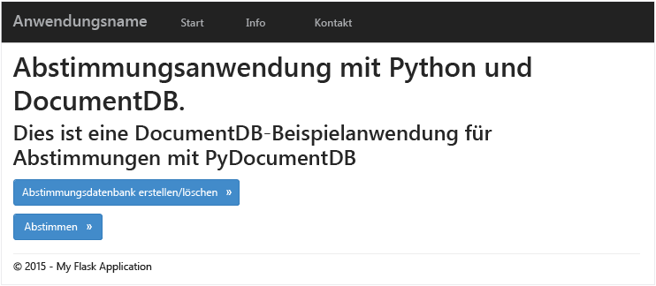

## Voraussetzungen

Bevor Sie diesen Artikel durcharbeiten, sollten Sie sicherstellen, dass Folgendes installiert ist:

- [Visual Studio 2013](http://www.visualstudio.com/) oder höher oder Visual Studio Express \(die kostenlose Version\).
- Python Tools für Visual Studio \([hier][] erhältlich\)
- Azure SDK für Visual Studio 2013, Version 2.4 oder höher \([hier][1] erhältlich\)
- Python 2.7 \([hier][2] erhältlich\)
- Microsoft Visual C++-Compiler für Python 2.7 \([hier][3] erhältlich\)

## Schritt 1: Erstellen eines DocumentDB-Datenbankkontos

Erstellen Sie zunächst ein DocumentDB-Konto. Wenn Sie bereits über ein Konto verfügen, können Sie mit [Schritt 2: Erstellen einer neuen Python-Flask-Webanwendung](#Step-2:-Create-a-new-Python-Flask-Web-Application) fortfahren.

[AZURE.INCLUDE [DocumentDB-Erstellen-DB-Account](../../includes/documentdb-create-dbaccount.md)]

[AZURE.INCLUDE [documentdb-keys](../../includes/documentdb-keys.md)]

  Im Folgenden wird erläutert, wie Sie eine Python Flask-Webanwendung von Grund auf neu erstellen.

## Schritt 2: Erstellen einer neuen Python Flask-Webanwendung

1. Öffnen Sie Visual Studio, klicken Sie auf **Datei** -\> **Neues Projekt** -\> **Python** -\>, **Flask-Webprojekt**, und erstellen Sie ein neues Projekt mit dem Namen **tutorial**.

	Bei Flask handelt es sich um ein Webframework, das uns beim schnelleren Erstellen von Webanwendungen in Python unterstützt. [Klicken Sie hier, um Flask-Lernprogramme zu öffnen][].

	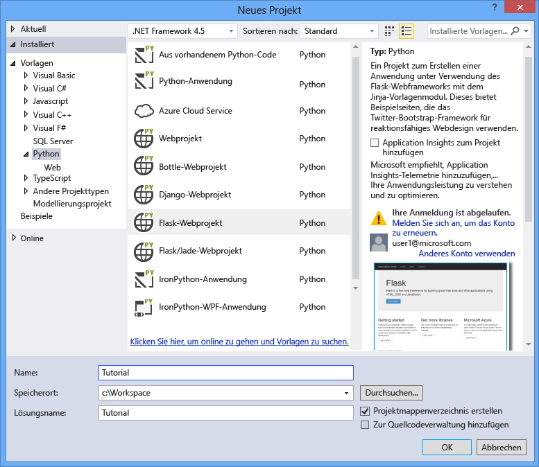

2. Sie werden dann gefragt, ob Sie externe Pakete installieren möchten. Wählen Sie **In einer virtuellen Umgebung installieren** aus. Achten Sie darauf, dass Sie Python 2.7 als Basisumgebung verwenden, da PyDocumentDB Python 3.x derzeit nicht unterstützt. Dadurch wird die erforderliche virtuelle Python-Umgebung für das Projekt eingerichtet.

	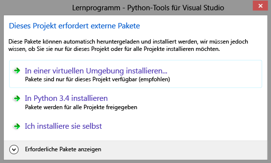

## Schritt 3: Ändern der Python Flask-Webanwendung

### Hinzufügen von Flask-Paketen zum Projekt

Nachdem das Projekt eingerichtet ist, müssen Sie bestimmte Flask-Pakete hinzufügen, die für unser Projekt erforderlich sind, z. B. "pydocumentdb", das Python-Paket für DocumentDB.

1. Öffnen Sie die Datei **requirements.txt**, und ersetzen Sie den Inhalt durch Folgendes:

    	flask==0.9
    	flask-mail==0.7.6
    	sqlalchemy==0.7.9
    	flask-sqlalchemy==0.16
    	sqlalchemy-migrate==0.7.2
    	flask-whooshalchemy==0.55a
    	flask-wtf==0.8.4
    	pytz==2013b
    	flask-babel==0.8
    	flup
    	pydocumentdb>=1.0.0

2. Klicken Sie mit der rechten Maustaste auf **env**, und klicken Sie auf den Link zum **Installieren aus requirements.txt**.

	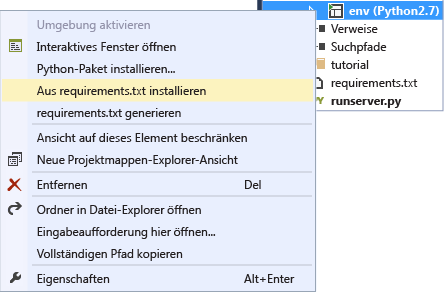

> [AZURE.NOTE]In seltenen Fällen wird eventuell ein Fehler im Ausgabefenster angezeigt. Wenn dies geschieht, prüfen Sie, ob der Fehler mit der Bereinigung zusammenhängt. Gelegentlich misslingt die Bereinigung, aber die Installation verläuft dennoch erfolgreich \(führen Sie im Ausgabefenster einen Bildlauf nach oben durch, um dies zu prüfen\).  In diesem Fall können Sie fortfahren.

### Überprüfen der virtuellen Umgebung

Stellen Sie sicher, dass alles einwandfrei installiert ist.

- Drücken Sie **F5**, um die Website zu starten. Dadurch werden der Flask-Entwicklungsserver und anschließend der Webbrowser gestartet. Daraufhin sollte die folgende Seite angezeigt werden.

	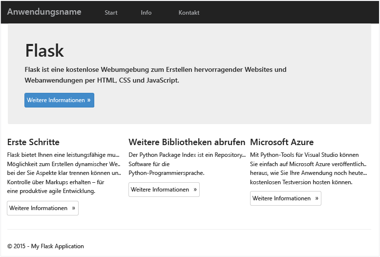

### Erstellen der Datenbank-, Sammlungs- und Dokumentdefinitionen

Jetzt erstellen wir selbst eine Abstimmungsanwendung.

- Fügen Sie eine Python-Datei hinzu, indem Sie mit der rechten Maustaste auf den Ordner **tutorial** im Projektmappen-Explorer klicken. Nennen Sie die Datei **forms.py**.  

    	from flask.ext.wtf import Form
    	from wtforms import RadioField

    	class VoteForm(Form):
        	deploy_preference  = RadioField('Deployment Preference', choices=[
            	('Web Site', 'Web Site'),
            	('Cloud Service', 'Cloud Service'),
            	('Virtual Machine', 'Virtual Machine')], default='Web Site')

### Fügen Sie die erforderlichen Importe zu views.py hinzu.

- Fügen Sie die folgenden Importanweisungen am Anfang der Datei **views.py** hinzu. Dadurch werden die DocumentDB-Pakete für PythonSDK und Flask importiert.

    	from forms import VoteForm
    	import config
    	import pydocumentdb.document_client as document_client

### Erstellen von Datenbank, Sammlung und Dokument

- Fügen Sie den folgenden Code zu **views.py** hinzu. Dieser ist für die Erstellung der vom Formular verwendeten Datenbank zuständig. Löschen Sie keinen vorhandenen Code in **views.py**. Fügen Sie diesen am Ende ein.

    	@app.route('/create')
    	def create():
        	"""Renders the contact page."""
        	client = document_client.DocumentClient(config.DOCUMENTDB_HOST, {'masterKey': config.DOCUMENTDB_KEY})

        	# Attempt to delete the database.  This allows this to be used to recreate as well as create
        	try:
            	db = next((data for data in client.ReadDatabases() if data['id'] == config.DOCUMENTDB_DATABASE))
            	client.DeleteDatabase(db['_self'])
        	except:
            	pass

       		# Create database
        	db = client.CreateDatabase({ 'id': config.DOCUMENTDB_DATABASE })
        	# Create collection
        	collection = client.CreateCollection(db['_self'],{ 'id': config.DOCUMENTDB_COLLECTION }, { 'offerType': 'S1' })
        	# Create document
        	document = client.CreateDocument(collection['_self'],
            	{ 'id': config.DOCUMENTDB_DOCUMENT,
            	'Web Site': 0,
            	'Cloud Service': 0,
            	'Virtual Machine': 0,
            	'name': config.DOCUMENTDB_DOCUMENT })

        	return render_template(
            	'create.html',
            	title='Create Page',
            	year=datetime.now().year,
            	message='You just created a new database, collection, and document.  Your old votes have been deleted')

> [AZURE.TIP]Die **CreateCollection**-Methode verwendet den optionalen Wert **RequestOptions** als dritten Parameter. Dieser kann verwendet werden, um den Angebotstyp für die Sammlung zu verwenden. Wenn kein "offerType"-Wert angegeben ist, wird die Sammlung mit dem Standardangebotstyp erstellt. Weitere Informationen zu DocumentDB-Angebotstypen finden Sie in [Leistungsebenen in DocumentDB](documentdb-performance-levels.md).
>
### Lesen von Datenbank, Sammlung und Dokument und Übermitteln des Formulars

- Fügen Sie den folgenden Code zu **views.py** hinzu. Dieser Code dient zum Einrichten des Formulars sowie zum Lesen der Datenbank, der Sammlung und des Dokuments. Löschen Sie keinen vorhandenen Code in **views.py**. Fügen Sie diesen am Ende ein.

    	@app.route('/vote', methods=['GET', 'POST'])
    	def vote():
        	form = VoteForm()
        	replaced_document ={}
        	if form.validate_on_submit(): # is user submitted vote  
            	client = document_client.DocumentClient(config.DOCUMENTDB_HOST, {'masterKey': config.DOCUMENTDB_KEY})

            	# Read databases and take the first since the id should not be duplicated.
            	db = next((data for data in client.ReadDatabases() if data['id'] == config.DOCUMENTDB_DATABASE))

            	# Read collections and take the first since the id should not be duplicated.
            	coll = next((coll for coll in client.ReadCollections(db['_self']) if coll['id'] == config.DOCUMENTDB_COLLECTION))

            	# Read documents and take the first since the id should not be duplicated.
            	doc = next((doc for doc in client.ReadDocuments(coll['_self']) if doc['id'] == config.DOCUMENTDB_DOCUMENT))

            	# Take the data from the deploy_preference and increment your database
            	doc[form.deploy_preference.data] = doc[form.deploy_preference.data] + 1
            	replaced_document = client.ReplaceDocument(doc['_self'], doc)

            	# Create a model to pass to results.html
            	class VoteObject:
                	choices = dict()
                	total_votes = 0

            	vote_object = VoteObject()
            	vote_object.choices = {
                	"Web Site" : doc['Web Site'],
                	"Cloud Service" : doc['Cloud Service'],
                	"Virtual Machine" : doc['Virtual Machine']
            	}
            	vote_object.total_votes = sum(vote_object.choices.values())

            	return render_template(
                	'results.html',
                	year=datetime.now().year,
                	vote_object = vote_object)

        	else :
            	return render_template(
                	'vote.html',
                	title = 'Vote',
                	year=datetime.now().year,
                	form = form)

### Erstellen der HTML-Dateien

Fügen Sie die folgenden HTML-Dateien zum Ordner "templates" hinzu: create.html, results.html, vote.html.

1. Fügen Sie den folgenden Code zur Datei **create.html** hinzu. Dieser Code dient zur Anzeige der Nachricht, dass eine neue Datenbank, eine neue Sammlung und ein neues Dokument erstellt wurden.

    	
    	
    	<h2>{{ title }}.</h2>
    	<h3>{{ message }}</h3>
    	
<a href="{{ url_for('vote') }}" class="btn btn-primary btn-large">Vote &raquo;</a>

    	

2. Fügen Sie den folgenden Code zur Datei **results.html** hinzu. Dieser Code ist für die Anzeige der Wahlergebnisse zuständig.

    	
    	
    	<h2>Results of the vote</h2>
   	 	 

    	
    	

        	
{{choice}}

        	

            	

                	

                    	{{vote_object.choices[choice]}}
                	

            	

        	

    	

    	

    	 
    	<a class="btn btn-primary" href="{{ url_for('vote') }}">Vote again?</a>
    	

3. Fügen Sie den folgenden Code zur Datei **vote.html** hinzu. Dieser Code ist für die Anzeige der Wahl und zum Akzeptieren der Stimmen zuständig. Beim Registrieren der Stimmen wird die Kontrolle an die Datei "views.py" übergeben, wo die abgegebene Stimme erkannt und das Dokument entsprechend angefügt wird.

    	
    	
    	<h2>What is your favorite way to host an application on Azure?</h2>
    	<form action="" method="post" name="vote">
        	{{form.hidden_tag()}}
        	{{form.deploy_preference}}
        	<button class="btn btn-primary" type="submit">Vote</button>
    	</form>
    	

4. Ersetzen Sie den Inhalt von **index.html** durch Folgendes. Dies dient als Startseite für Ihre Anwendung.

    	
    	
    	<h2>Python + DocumentDB Voting Application.</h2>
    	<h3>This is a sample DocumentDB voting application using PyDocumentDB</h3>
    	
<a href="{{ url_for('create') }}" class="btn btn-primary btn-large">Create/Clear the Voting Database &raquo;</a>

    	
<a href="{{ url_for('vote') }}" class="btn btn-primary btn-large">Vote &raquo;</a>

    	

### Hinzufügen einer Konfigurationsdatei und Ändern von \\\_\\\_init\\\_\\\_.py

1. Klicken Sie mit der rechten Maustaste auf den Projektnamen "tutorial", und fügen Sie die Datei **config.py** hinzu. Diese Konfiguration ist für Formulare in Flask erforderlich. Sie können damit auch einen geheimen Schlüssel bereitstellen. Dies ist jedoch für dieses Tutorial nicht erforderlich.

2. Fügen Sie folgenden Code zur Datei "config.py" hinzu: Ändern Sie die Werte von **DOCUMENTDB\\\_HOST** und **DOCUMENTDB\\\_KEY**.

    	CSRF_ENABLED = True
    	SECRET_KEY = 'you-will-never-guess'

    	DOCUMENTDB_HOST = 'https://YOUR_DOCUMENTDB_NAME.documents.azure.com:443/'
    	DOCUMENTDB_KEY = 'YOUR_SECRET_KEY_ENDING_IN_=='

    	DOCUMENTDB_DATABASE = 'voting database'
    	DOCUMENTDB_COLLECTION = 'voting collection'
    	DOCUMENTDB_DOCUMENT = 'voting document'

3. Ersetzen Sie den Inhalt von **\\\_\\\_init\\\_\\\_.py** durch Folgendes.

    	from flask import Flask
    	app = Flask(__name__)
    	app.config.from_object('config')
    	import tutorial.views

4. Nachdem Sie die oben aufgeführten Schritte ausgeführt haben, sollte Ihr Projektmappen-Explorer wie folgt aussehen.

	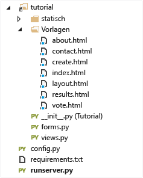

## Schritt 4: Lokales Ausführen der Anwendung

1. Drücken Sie F5, oder klicken Sie in Visual Studio auf die Schaltfläche **Ausführen**. Daraufhin sollte Folgendes auf Ihrem Bildschirm angezeigt werden.

	

2. Klicken Sie auf **Wahldatenbank erstellen/löschen**, um die Datenbank zu erstellen.

	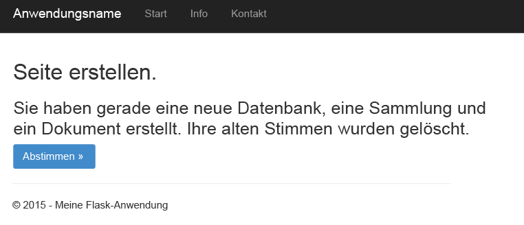

3. Klicken Sie anschließend auf **Abstimmen**, und wählen Sie Ihre Option aus.

	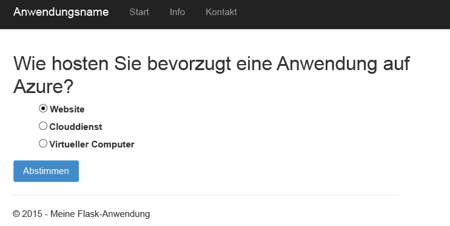

4. Für jede abgegebene Stimme wird der entsprechende Zähler erhöht.

	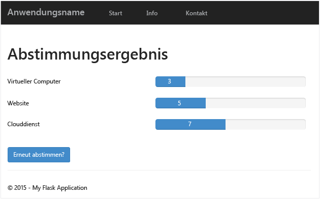

## Schritt 5: Bereitstellen der Anwendung in Azure-Websites

Nachdem Sie eine vollständige Anwendung erstellt haben, die DocumentDB ordnungsgemäß nutzt, stellen wir diese in Azure Websites bereit.

1. Klicken Sie im Projektmappen-Explorer mit der rechten Maustaste auf das Projekt \(stellen Sie sicher,dass es nicht lokal ausgeführt wird\), und wählen Sie dann **Veröffentlichen** aus. Wählen Sie dann **Microsoft Azure Websites** aus.

 	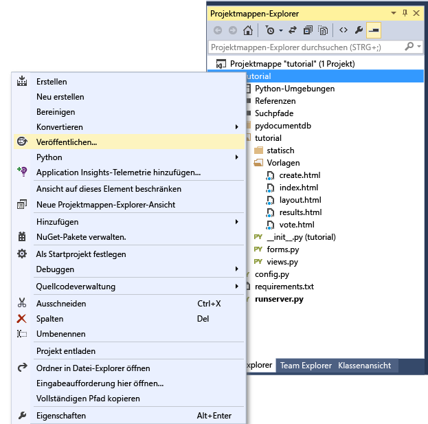

2. Konfigurieren Sie die Azure-Website, indem Sie Ihre Anmeldeinformationen angeben und auf **Veröffentlichen** klicken.

	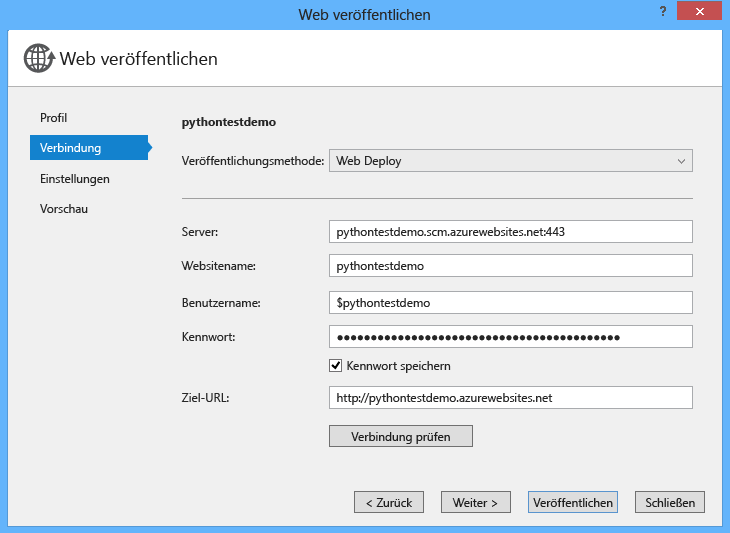

3. Dann schließt Visual Studio die Veröffentlichung Ihrer Webanwendung in wenigen Sekunden ab und startet einen Browser, in dem das Ergebnis Ihrer Arbeit in Azure ausgeführt wird!

## Nächste Schritte

Glückwunsch! Sie haben Ihre erste Python-Anwendung mit Azure DocumentDB erstellt und auf Azure-Websites veröffentlicht.

Um Ihrer Anwendung weitere Funktionen hinzuzufügen, überprüfen Sie die im [Python SDK für DocumentDB](https://pypi.python.org/pypi/pydocumentdb) verfügbaren APIs.

  [Klicken Sie hier, um Flask-Lernprogramme zu öffnen]: http://blog.miguelgrinberg.com/post/the-flask-mega-tutorial-part-i-hello-world
  [Visual Studio Express]: http://www.visualstudio.com/products/visual-studio-express-vs.aspx
  [hier]: http://aka.ms/ptvs
  [1]: http://go.microsoft.com/fwlink/?linkid=254281&clcid=0x409
  [2]: https://www.python.org/downloads/windows/
  [3]: http://aka.ms/vcpython27
  [Microsoft Web Platform Installer]: http://www.microsoft.com/web/downloads/platform.aspx
  [Azure portal]: http://portal.azure.com

<!---HONumber=August15_HO7-->