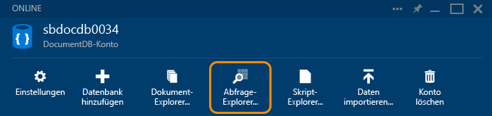
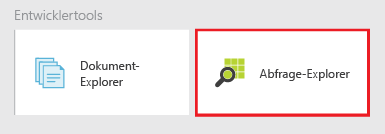
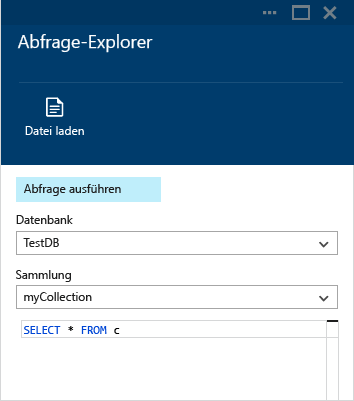
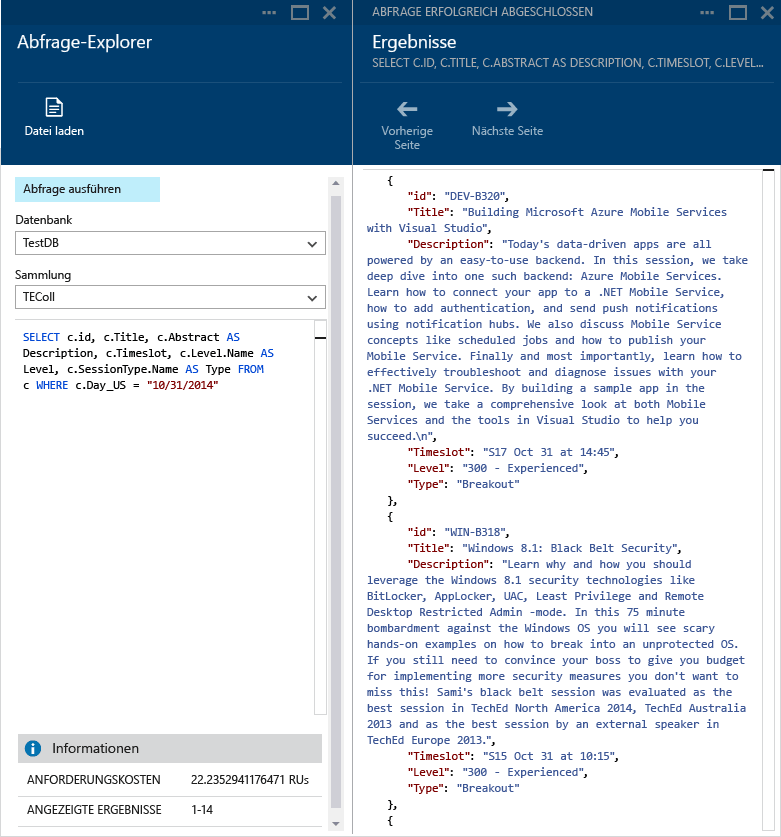
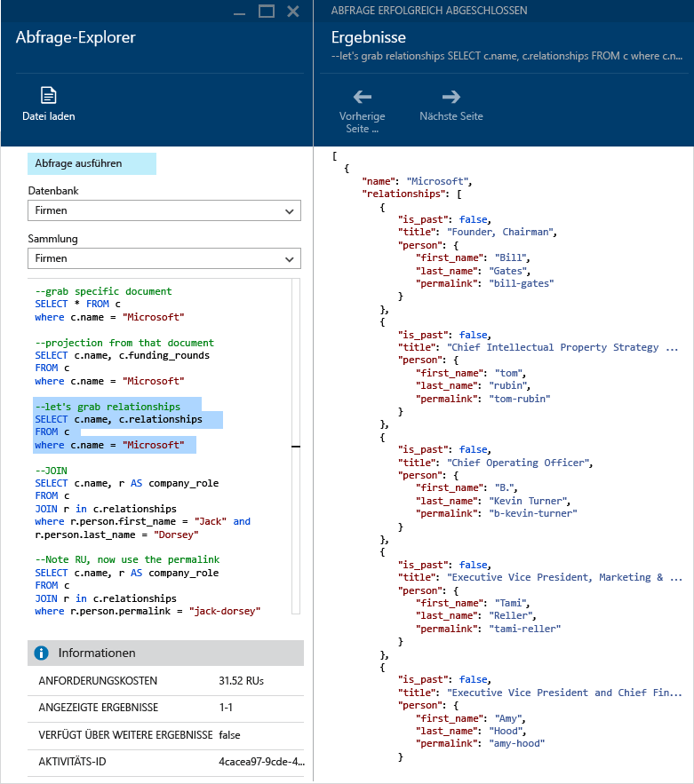
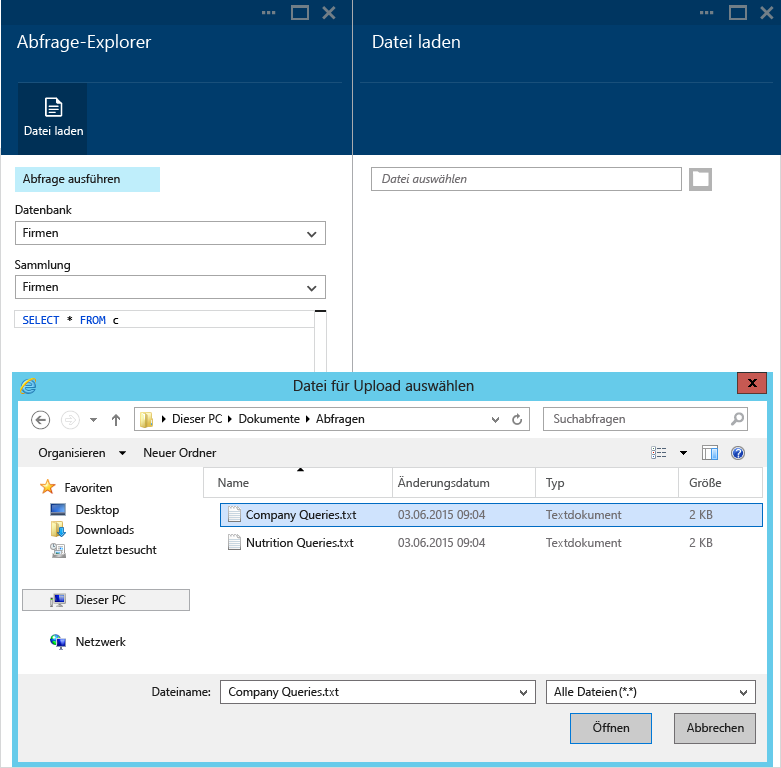
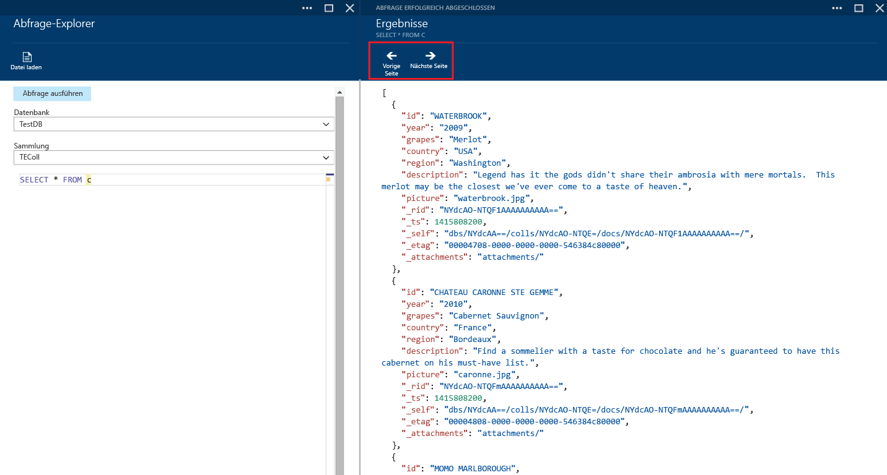
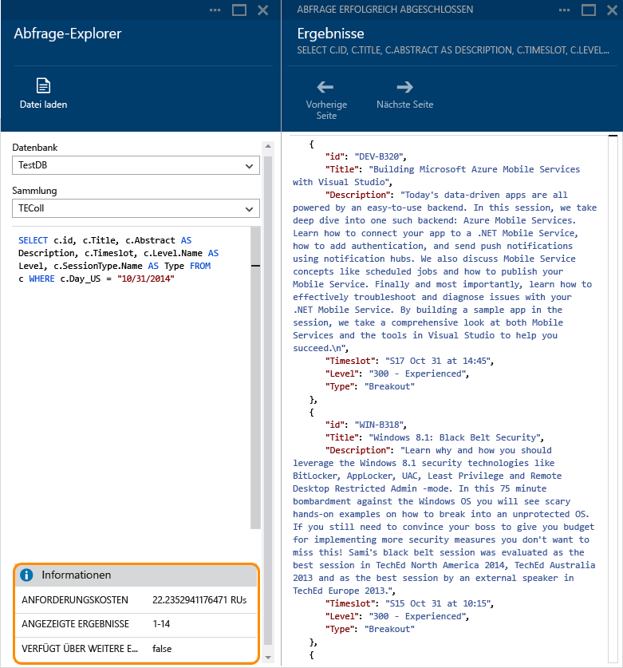
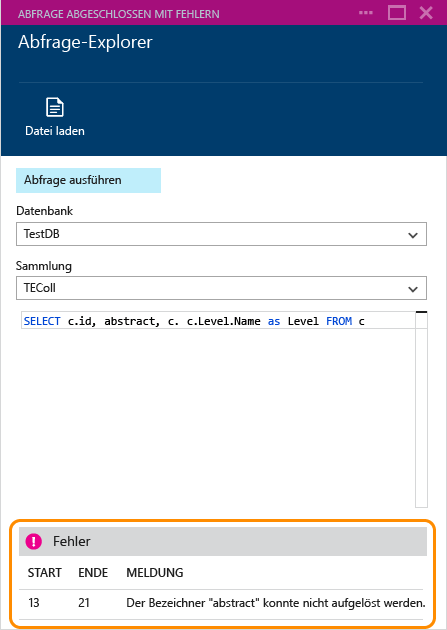

<properties 
	pageTitle="Erstellen, Bearbeiten und Ausführen von SQL-Abfragen in einer DocumentDB-Sammlung mithilfe des Abfrage-Explorers | Azure" 
	description="Erfahren Sie mehr über den DocumentDB-Abfrage-Explorer, ein Azure-Vorschauportaltool zum Erstellen, Bearbeiten und Ausführen von SQL-Abfragen in einer DocumentDB-Sammlung." 
	services="documentdb" 
	authors="stephbaron" 
	manager="johnmac" 
	editor="monicar" 
	documentationCenter=""/>

<tags 
	ms.service="documentdb" 
	ms.workload="data-services" 
	ms.tgt_pltfrm="na" 
	ms.devlang="na" 
	ms.topic="get-started-article"
	ms.date="06/10/2015" 
	ms.author="stbaro"/>

# Erstellen, Bearbeiten und Ausführen von SQL-Abfragen in einer DocumentDB-Sammlung mithilfe des Abfrage-Explorers #

Dieser Artikel bietet eine Übersicht über den Abfrage-Explorer von [Microsoft Azure DocumentDB](http://azure.microsoft.com/services/documentdb/), ein Microsoft Azure-Vorschauportaltool, mit dem Sie Abfragen in einer DocumentDB-Sammlung erstellen, bearbeiten und ausführen können.

Nach Abschluss dieses Lernprogramms können Sie die folgenden Fragen beantworten:

-	Wie kann ich über einen Webbrowser auf einfache Weise Abfragen in einer DocumentDB-Sammlung erstellen, bearbeiten und ausführen?
-	Wie kann ich über einen Webbrowser einfach durch Seiten der DocumentDB-Abfrageergebnisse navigieren?
-	Wie kann Syntaxfehler meiner DocumentDB-Abfrage beheben? 

##Starten des Abfrage-Explorers und Navigieren im Abfrage-Explorer##

Der Abfrage-Explorer kann über jedes DocumentDB-Blatt "Konto", "Datenbank" und "Sammlung" gestartet werden.
  
1. Klicken Sie einfach oben auf dem Blatt des DocumentDB-Kontos oder der Datenbank auf den Befehl **Abfrage-Explorer**.

	

2. Alternativ dazu befindet sich am unteren Rand jedes Blatts der Fokus **Entwicklertools**, der die Kachel **Abfrage-Explorer** enthält.
	
	

2. Klicken Sie einfach auf die Kachel, um den Abfrage-Explorer zu starten.

	Die Dropdownlistenfelder **Datenbank** und **Sammlung** werden basierend auf dem Kontext, in dem Sie den Abfrage-Explorer starten, automatisch ausgefüllt. Wenn Sie diesen z. B. aus einem Datenbankblatt starten, sind die Felder der aktuellen Datenbank bereits ausgefüllt. Wenn Sie diesen aus einem Blatt "Sammlung" starten, sind die Felder der aktuellen Sammlung ausgefüllt.

	

##Erstellen, Bearbeiten und Ausführen von Abfragen mit dem Abfrage-Explorer##

Mit dem Abfrage-Explorer können Sie problemlos Abfragen für eine DocumentDB-Sammlung erstellen, bearbeiten und ausführen. Darüber hinaus bietet er grundlegende Funktionen zum Hervorheben von Stichwörtern und Werten, um die Abfragebearbeitung zu verbessern.

- Beim ersten Öffnen des Abfrage-Explorers wird die Standardabfrage "SELECT * FROM c" bereitgestellt. Sie können die Standardabfrage akzeptieren oder eine eigene Abfrage erstellen. Klicken Sie dann auf die Schaltfläche **Abfrage ausführen**, um die Ergebnisse anzuzeigen. Der Abfrage-Explorer unterstützt die SQL-Abfragesprache von DocumentDB, wie in [Abfragen von DocumentDB](documentdb-sql-query.md) beschrieben.

	

- Sie können auch mehrere Abfragen eingeben, diejenige Abfrage markieren, die Sie ausführen möchten, und dann auf die Schaltfläche **Abfrage ausführen** klicken, um die Ergebnisse anzuzeigen.

	

- Mithilfe des Befehls **Datei laden** können Sie die Inhalte einer vorhandenen Datei laden.

	

- Standardmäßig zeigt der Abfrage-Explorer die Ergebnisse in Gruppen von jeweils 100 zurück. Wenn Ihre Abfrage mehr als 100 Ergebnisse erzeugt, verwenden Sie einfach die Befehle **Nächste Seite** und **Vorherige Seite**, um durch die Ergebnisse zu navigieren.

	

- Erfolgreiche Abfragen bieten Informationen, wie z. B. die Anforderungskosten und den aktuell angezeigten Ergebnissatz. Sie erfahren auch, ob weitere Ergebnisse vorhanden sind, die – wie bereits erwähnt – über den Befehl **Nächste Seite** angezeigt werden können.

	

- Wenn eine Abfrage mit Fehlern abgeschlossen wird, zeigt der Abfrage-Explorer eine Liste der Fehler an, die Sie bei der Fehlerbehebung unterstützen.

	

##Nächste Schritte

- Um weitere Informationen zu DocumentDB zu erhalten, klicken Sie [hier](http://azure.com/docdb).
- Weitere Informationen zur DocumentDB-SQL-Grammatik, die im Abfrage-Explorer unterstützt wird, finden Sie [hier](documentdb-sql-query.md).
 

<!---HONumber=July15_HO1-->