<properties
	pageTitle="Anzeigen, Bearbeiten, Erstellen und Hochladen von JSON-Dokumenten mithilfe von DocumentDB-Dokument-Explorer | Microsoft Azure"
	description="Informationen zum DocumentDB-Dokument-Explorer, einem Azure-Portaltool zum Anzeigen, Bearbeiten, Erstellen und Hochladen von JSON-Dokumenten mit DocumentDB."
	services="documentdb"
	authors="AndrewHoh"
	manager="jhubbard"
	editor="monicar"
	documentationCenter=""/>

<tags
	ms.service="documentdb"
	ms.workload="data-services"
	ms.tgt_pltfrm="na"
	ms.devlang="na"
	ms.topic="get-started-article" 
	ms.date="01/28/2015"
	ms.author="anhoh"/>

# Anzeigen, Bearbeiten, Erstellen und Hochladen von JSON-Dokumenten mithilfe von DocumentDB-Dokument-Explorer #

Dieser Artikel bietet eine Übersicht über den [Microsoft Azure DocumentDB](https://azure.microsoft.com/services/documentdb/)-Dokument-Explorer, ein Azure-Portaltool zum Anzeigen, Bearbeiten, Erstellen und Hochladen von JSON-Dokumenten mit DocumentDB.

Nach Abschluss dieses Lernprogramms können Sie die folgenden Fragen beantworten:

-	Wie kann ich einzelne DocumentDB-Dokumente über einen Webbrowser erstellen, anzeigen, bearbeiten und löschen?
-	Wie kann ich die Systemeigenschaften eines DocumentDB-Dokuments über einen Webbrowser anzeigen?
-	Wie kann ich eine Sammelerfassung von Dokumenten in DocumentDB über einen Webbrowser durchführen?

##Dokument-Explorer starten##

Dokument-Explorer kann über jedes DocumentDB-Blatt "Konto", "Datenbank" und "Sammlung" gestartet werden.

1. Klicken Sie einfach oben auf dem Blatt des DocumentDB-Kontos oder der Datenbank auf den Befehl **Dokument-Explorer**.

	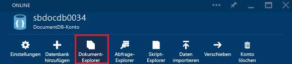
 
2. Alternativ dazu befindet sich am unteren Rand jedes Blatts der Fokus **Entwicklertools**, der das Detail **Dokument-Explorer** enthält.

	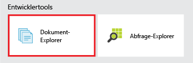

2. Klicken Sie zum Starten von Dokument-Explorer einfach auf die Kachel.

	
Die Dropdownlistenfelder **Datenbank** und **Sammlung** werden basierend auf dem Kontext, in dem Sie den Dokument-Explorer starten, automatisch ausgefüllt. Wenn Sie diesen z. B. aus einem Datenbankblatt starten, sind die Felder der aktuellen Datenbank bereits ausgefüllt. Wenn Sie diesen aus einem Auflistungsblatt starten, sind die Felder der aktuellen Auflistung ausgefüllt.

	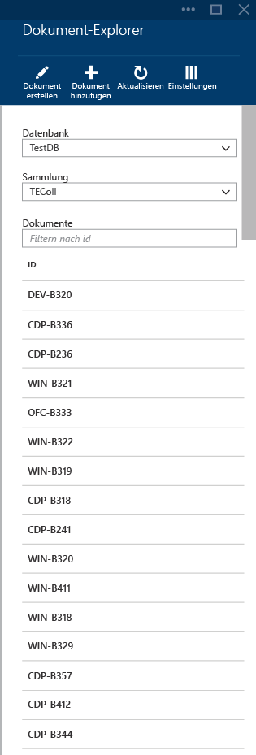

##Anzeigen, Erstellen und Bearbeiten von Dokumenten mit dem Dokument-Explorer##

Mit Dokument-Explorer können Sie problemlos Dokumente erstellen, bearbeiten und löschen.

- Klicken Sie zum Erstellen eines Dokuments einfach auf den Befehl **Dokument erstellen**, und es wird ein minimaler JSON-Codeausschnitt bereitgestellt.

	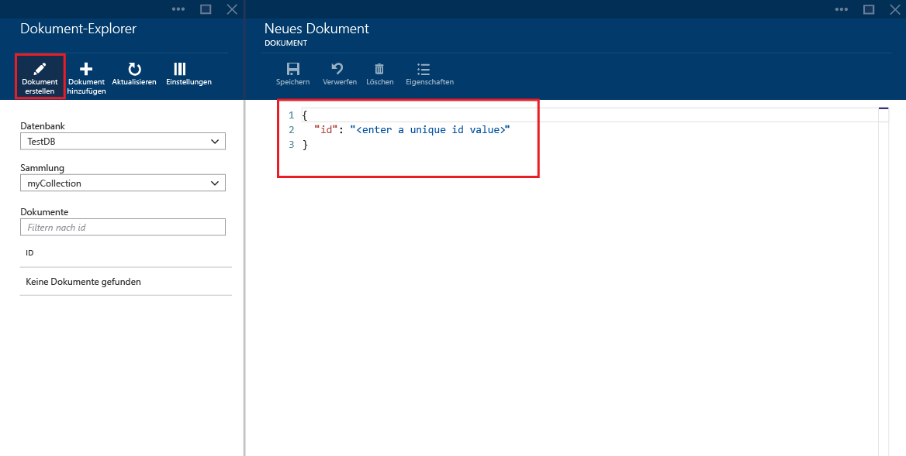

- Geben oder fügen Sie den JSON-Inhalt des Dokuments ein, das Sie erstellen möchten, und klicken Sie auf den Befehl **Speichern**, um das Dokument zu übernehmen.

	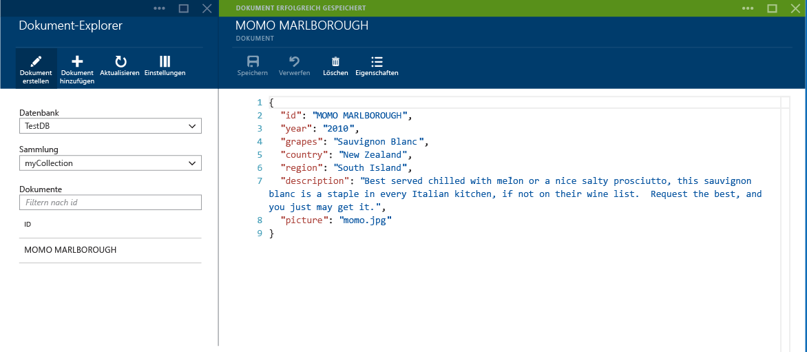

	> [AZURE.NOTE] Wenn Sie keine "id"-Eigenschaft angegebn, fügt Dokument-Explorer automatisch eine id-Eigenschaft hinzu und generiert eine GUID als id-Wert.

- Wenn Sie bereits über Daten aus JSON-Dateien, MongoDB, SQL Server, CSV-Dateien, Azure-Tabellenspeichern, Amazon DynamoDB, HBase oder anderen DocumentDB-Sammlungen verfügen, können Sie das [Datenmigrationstool](documentdb-import-data.md) von DocumentDB verwenden, um Ihre Daten schnell zu importieren.

- Um ein vorhandenes Dokument zu bearbeiten, wählen Sie das Dokument im Dokument-Explorer aus, bearbeiten Sie es wie gewünscht, und klicken Sie auf **Speichern**.

	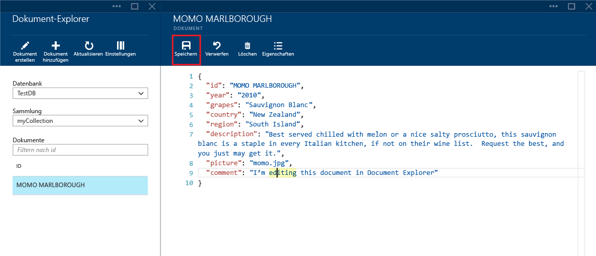

- Wenn Sie ein Dokument bearbeiten und dann die Änderungen verwerfen möchten, klicken Sie auf den Befehl "Verwerfen", bestätigen Sie die Aktion "Verwerfen", und die vorherige Version des Dokuments wird neu geladen.

	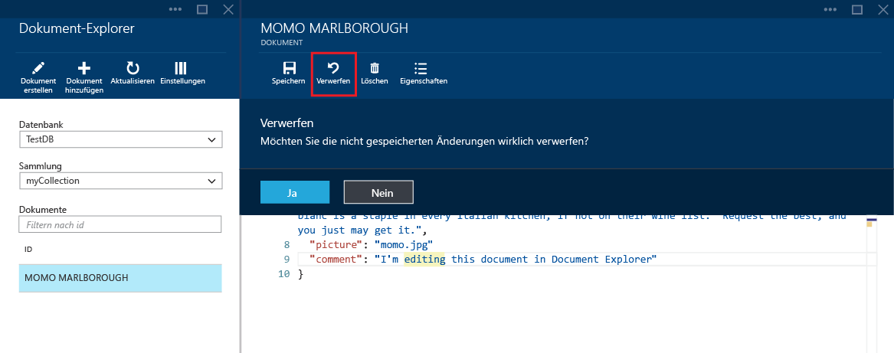

- Sie können ein Dokument löschen, indem Sie auf den Befehl **Löschen** klicken und dann den Löschvorgang bestätigen. Nach Bestätigung wird das Dokument sofort aus der Liste im Dokument-Explorer entfernt:

	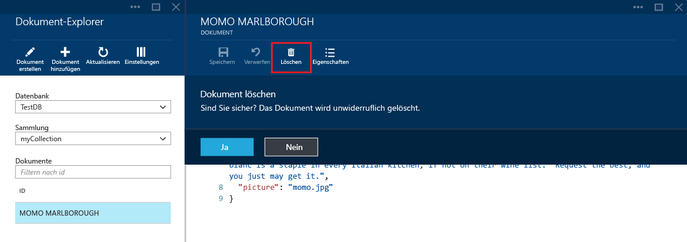

- Beachten Sie, dass Dokument-Explorer überprüft, ob alle neuen oder bearbeiteten Dokumente gültiges JSON enthalten. Sie können sogar mit der Maus auf den falschen Bereich zeigen, um Details zum Validierungsfehler anzuzeigen.

	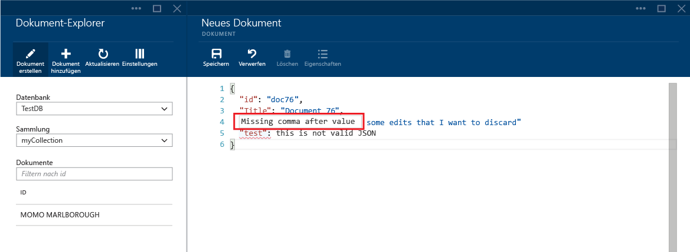

- Dokument-Explorer verhindert auch das Speichern eines Dokuments mit ungültigem JSON.

	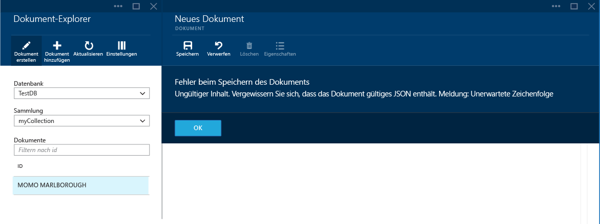

- Mit dem Dokument-Explorer können Sie ganz einfach die Systemeigenschaften des aktuell geladenen Dokuments anzeigen, indem Sie auf Befehl **Eigenschaften** klicken.

	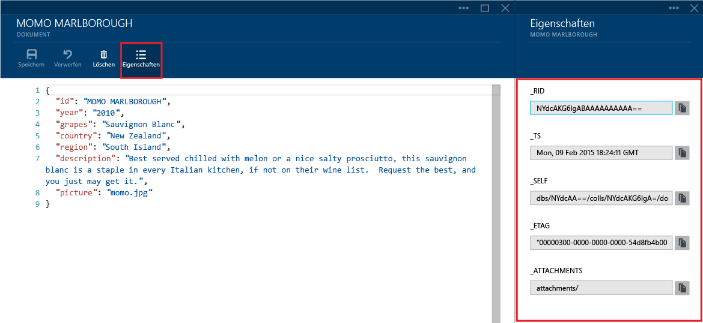

	> [AZURE.NOTE] Die Zeitstempeleigenschaft (\_ts) wird intern als Epochenzeit dargestellt, im Dokument-Explorer wird der Wert jedoch in einem vom Menschen lesbaren GMT-Format angezeigt.

##Navigationsoptionen und erweiterte Einstellungen für den Dokument-Explorer##

Der Dokument-Explorer unterstützt eine Reihe an Navigationsoptionen und erweiterten Einstellungen.

1. Standardmäßig lädt der Dokument-Explorer die ersten 100 Dokumente in die ausgewählte Sammlung, sortiert nach Erstellungsdatum, vom ältesten bis zum neuesten. Sie können weitere Dokumente (in Batches von je 100) laden, indem Sie die Option **Mehr laden** am unteren Rand des Dokument-Explorer-Blatts wählen. Sie können das Standardverhalten ändern, indem Sie oben im Dokument-Explorer-Blatt auf den Befehl "Einstellungen" klicken.

	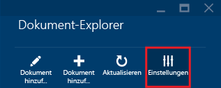

2. Auf dem Blatt "Einstellungen" können Sie die Anzahl der pro Seite zurückgegebenen Elemente ändern sowie eine WHERE-Klausel bereitstellen, um passende Dokumente in das Dokument-Explorer-Raster zu laden. Weitere Informationen über die DocumentDB-SQL-Grammatik erhalten Sie [hier](documentdb-sql-query.md).

	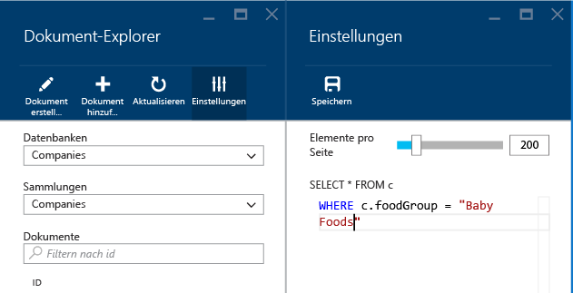

	> [AZURE.NOTE] Nach dem Ändern der Dokument-Explorer-Einstellungen müssen Sie auf den Befehl **Aktualisieren** klicken, um die neuen Einstellungen anzuwenden. Diese Einstellungen gelten nur für die aktuelle Browsersitzung.
	
3. Mit den Dropdownlistenfeldern **Datenbank** und **Sammlung** können Sie die Sammlung, aus der aktuell Dokumente angezeigt werden, ganz einfach ändern, ohne den Dokument-Explorer schließen und neu starten zu müssen.

4. Dokument-Explorer unterstützt auch das Filtern des aktuell geladenen Dokumentensets nach der id-Eigenschaft. Geben Sie diese einfach im Filterfeld ein.

	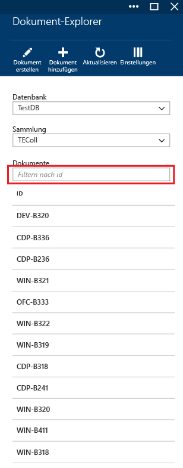

	Die Ergebnisse in der Dokument-Explorer-Liste sind nun basierend auf den angegebenen Kriterien gefiltert.

	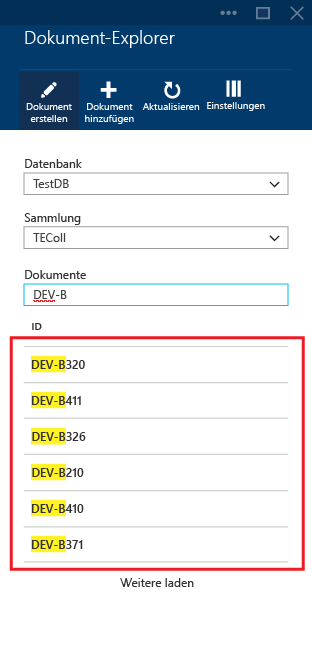

	> [AZURE.IMPORTANT] Die Filterfunktion des Dokument-Explorers filtert nur aus dem ***aktuell*** geladenen Dokumentensatz und führt keine Abfrage für die aktuell ausgewählte Sammlung aus.

5. Zum Aktualisieren der vom Dokument-Explorer geladenen Dokumentenliste klicken Sie einfach auf den Befehl **Aktualisieren** im oberen Bereich des Blatts.

	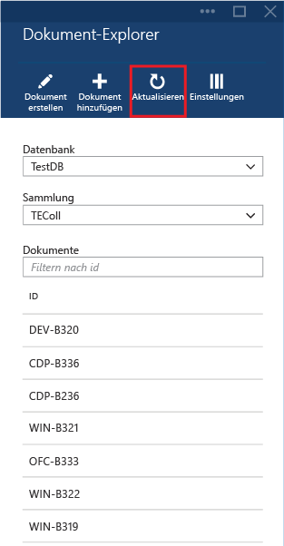

##Massenhinzufügen von Dokumenten mit dem Dokument-Explorer##

Dokument-Explorer unterstützt die Sammelerfassung von vorhandenen JSON-Dokumenten.

1. Klicken Sie zum Starten des Uploadprozesses auf den Befehl **Dokument hinzufügen**.

	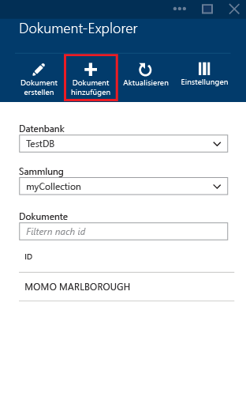

2. Ein neues Blatt wird geöffnet. Klicken Sie auf die Schaltfläche "Durchsuchen", um ein Datei-Explorer-Fenster zu öffnen, und wählen Sie die JSON-Dokumente aus, die hochgeladen werden sollen.

	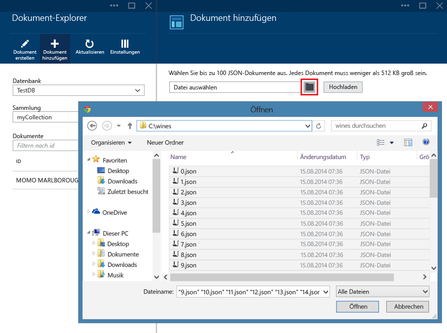

	> [AZURE.NOTE] Dokument-Explorer unterstützt derzeit bis zu 100 JSON-Dokumente pro einzelnen Hochladevorgang.

3. Sobald Sie mit der Auswahl fertig sind, klicken Sie auf die Schaltfläche **Hochladen**. Die Dokumente werden automatisch zum Dokument-Explorer-Raster hinzugefügt, und die Hochladeergebnisse werden angezeigt, während der Prozess weiterläuft. Importfehler werden für einzelne Dateien gemeldet.

	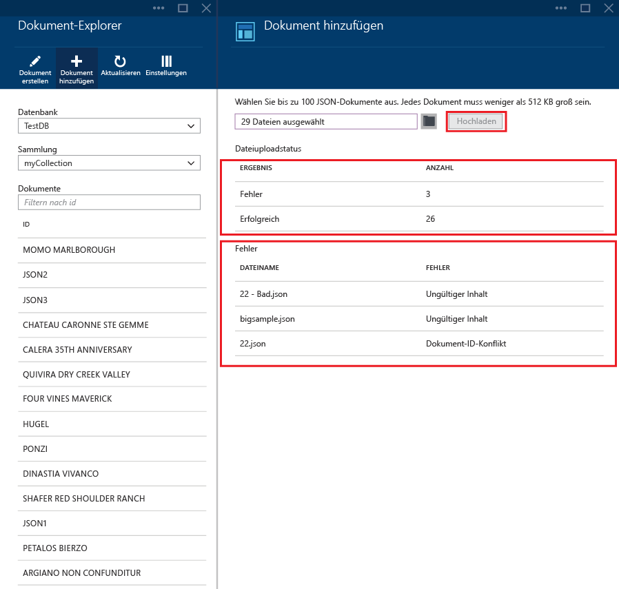

4. Sobald der Vorgang abgeschlossen ist, können Sie bis zu 100 weitere Dokumente auswählen, die Sie hochladen möchten.

##Nächste Schritte

- Um weitere Informationen zu DocumentDB zu erhalten, klicken Sie [hier](http://azure.com/docdb).
- Um mit Code zu beginnen, klicken Sie [hier](documentdb-get-started.md).

 

<!---HONumber=AcomDC_0128_2016-->