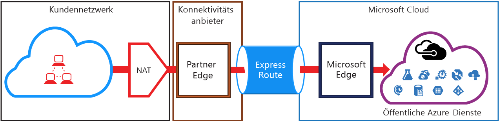
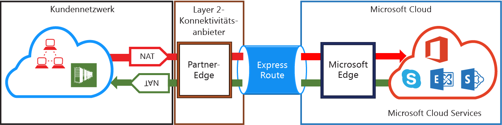

<properties
   pageTitle="NAT-Anforderungen für ExpressRoute-Verbindungen | Microsoft Azure"
   description="Diese Seite enthält ausführliche Anforderungen für das Konfigurieren und Verwalten von NAT für ExpressRoute-Verbindungen."
   documentationCenter="na"
   services="expressroute"
   authors="cherylmc"
   manager="carolz"
   editor=""/>
<tags
   ms.service="expressroute"
   ms.devlang="na"
   ms.topic="get-started-article"
   ms.tgt_pltfrm="na"
   ms.workload="infrastructure-services"
   ms.date="09/22/2015"
   ms.author="cherylmc"/>

# NAT-Anforderungen für ExpressRoute

Zum Herstellen einer Verbindung mit Microsoft-Clouddiensten per ExpressRoute müssen Sie NATs einrichten und verwalten. Einige Konnektivitätsanbieter bieten das Einrichten und Verwalten von NAT als verwalteten Dienst an. Fragen Sie bei Ihrem Konnektivitätsanbieter nach, ob dieser Dienst angeboten wird. Wenn dies nicht der Fall ist, müssen Sie die unten beschriebenen Anforderungen erfüllen.

Überprüfen Sie die Seite [ExpressRoute-Verbindungen und Routingdomänen](expressroute-circuit-peerings.md), um einen Überblick über die verschiedenen Routingdomänen zu erhalten. Um die Anforderungen für die öffentliche IP-Adresse für das öffentliche Azure- und Microsoft-Peering zu erfüllen, wird empfohlen, dass Sie NAT zwischen Ihrem Netzwerk und Microsoft einrichten. Dieser Abschnitt enthält eine ausführliche Beschreibung der NAT-Infrastruktur, die Sie einrichten möchten.

## NAT-Anforderungen für öffentliches Azure-Peering

Der öffentliche Azure-Peeringpfad ermöglicht, dass Sie zu allen in Azure gehosteten Diensten über die öffentliche IP-Adresse eine Verbindung herstellen können. Dazu zählen alle Dienste, die unter [ExpressRoute – Häufig gestellte Fragen](expressroute-faqs.md) aufgeführt sind und die von ISVs auf Microsoft Azure gehostet werden. Die Konnektivität mit Microsoft Azure-Diensten für öffentliches Peering wird immer von Ihrem Netzwerk aus in das Microsoft-Netzwerk initiiert. Für Datenverkehr, der auf Microsoft Azure über öffentliches Peering abzielt, muss vor dem Eintritt in das Microsoft-Netzwerk SNAT mit gültigen, öffentlichen IPv4-Adressen angewendet werden. Die folgende Abbildung bietet einen allgemeinen Überblick über die Einrichtung von NAT, um die oben genannte Anforderung zu erfüllen.

### NAT-IP-Pool und Routenankündigungen

Sie müssen sicherstellen, dass der Datenverkehr in den öffentlichen Azure-Peeringpfad über eine gültige, öffentliche IPv4-Adresse eintritt. Microsoft muss den Besitz des IPv4-NAT-Adresspools gegen ein regionales Routing Internet Registry (RIR) oder eine Internet Routing Registry (IRR) validieren können. Eine Überprüfung wird basierend auf der AS-Nummer ausgeführt, die für das Peering verwendet wird, und auf den für die NAT verwendeten IP-Adressen. Weitere Informationen zu Routingregistrierungen finden Sie auf der Seite [ExpressRoute-Routinganforderungen](expressroute-routing.md).
 
Es gibt keine Einschränkungen für die Länge des Präfixes für die NAT-IP, die über dieses Peering angekündigt wird. Sie müssen den NAT-Pool überwachen und sicherstellen, dass Sie die NAT-Sitzungen nicht außer acht lassen.

>[AZURE.IMPORTANT]Der Microsoft angekündigte NAT-IP-Adresspool muss nicht im Internet angekündigt werden. Ansonsten wird die Verbindung mit anderen Microsoft-Diensten unterbrochen.

## NAT-Anforderungen für Microsoft-Peering

Mit dem Microsoft-Peeringpfad können Sie eine Verbindung mit den Clouddiensten von Microsoft herstellen, die vom öffentlichen Azure-Peeringpfad nicht unterstützt werden. Die Liste der Dienste umfasst Office 365-Dienste wie z. B. Exchange Online, SharePoint Online, Skype for Business und CRM Online. Microsoft wird die bidirektionale Konnektivität beim Microsoft-Peering voraussichtlich unterstützen. Für Datenverkehr, der auf Microsoft-Clouddiensten über öffentliches Peering abzielt, muss vor dem Eintritt in das Microsoft-Netzwerk SNAT mit gültigen, öffentlichen IPv4-Adressen angewendet werden. Datenverkehr, der aus den Microsoft-Clouddiensten in Ihr Netzwerk eingeht, muss SNAT angewendet werden, bevor er in Ihr Netzwerk eintritt. Die folgende Abbildung bietet einen allgemeinen Überblick über die Einrichtung von NAT für Microsoft-Peering.
 

#### Datenverkehr von Ihrem Netzwerk an Microsoft

- Sie müssen sicherstellen, dass der Datenverkehr in den Microsoft-Peeringpfad über eine gültige, öffentliche IPv4-Adresse eintritt. Microsoft muss den Besitzer des IPv4-NAT-Adresspools gegen das regionale Routing Internet Registry (RIR) oder ein Internet Routing Registry (IRR) validieren können. Eine Überprüfung wird basierend auf der AS-Nummer ausgeführt, die für das Peering verwendet wird, und auf den für die NAT verwendeten IP-Adressen. Weitere Informationen zu Routingregistrierungen finden Sie auf der Seite [ExpressRoute-Routinganforderungen](expressroute-routing.md).

- IP-Adressen, die für die Einrichtung des öffentlichen Azure-Peerings und andere ExpressRoute-Verbindungen verwendet werden, müssen Microsoft nicht über die BGP-Sitzung angekündigt werden. Es gibt keine Einschränkung für die Länge des Präfixes für die NAT-IP, die über dieses Peering angekündigt wird.

	>[AZURE.IMPORTANT]Der Microsoft angekündigte NAT-IP-Adresspool muss nicht im Internet angekündigt werden. Ansonsten wird die Verbindung mit anderen Microsoft-Diensten unterbrochen.

#### Datenverkehr von Microsoft an Ihr Netzwerk

- Bestimmte Szenarios erfordern, dass Microsoft die Konnektivität zu den Dienstendpunkten innerhalb des Netzwerks initiiert. Ein typisches Szenarios wäre die Konnektivität zum ADFS-Server in Ihrem Netzwerk über Office 365. In solchen Fällen müssen Sie entsprechenden Präfixe aus dem Netzwerk in der Microsoft peering einfließen. 

- Sie müssen SNAT auf den Datenverkehr an IP-Adressen innerhalb des Netzwerks von Microsoft anwenden.

## Nächste Schritte

- Sehen Sie sich die Anforderungen für [Routing](expressroute-routing.md) und [QoS](expressroute-qos.md) an.
- Konfigurieren Sie Ihre ExpressRoute-Verbindung.
	- [Erstellen einer ExpressRoute-Verbindung](expressroute-howto-circuit-classic.md)
	- [Konfigurieren des Routings](expressroute-howto-routing-classic.md)
	- [Verknüpfen eines VNet mit einer ExpressRoute-Verbindung](expressroute-howto-linkvnet-classic.md)

<!---HONumber=Oct15_HO1-->