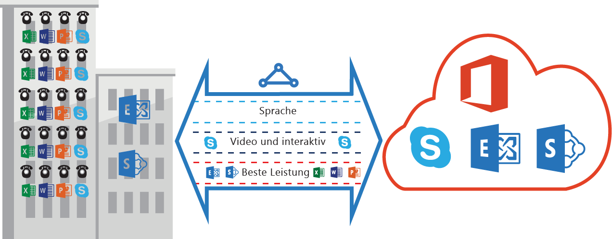

<properties
   pageTitle="QoS-Anforderungen für ExpressRoute | Microsoft Azure"
   description="Diese Seite enthält ausführliche Anforderungen für das Konfigurieren und Verwalten von QoS für ExpressRoute-Verbindungen."
   documentationCenter="na"
   services="expressroute"
   authors="cherylmc"
   manager="carolz"
   editor=""/>
<tags
   ms.service="expressroute"
   ms.devlang="na"
   ms.topic="get-started-article"
   ms.tgt_pltfrm="na"
   ms.workload="infrastructure-services"
   ms.date="10/06/2015"
   ms.author="cherylmc"/>

# QoS-Anforderungen für ExpressRoute

Skype for Business umfasst verschiedene Workloads mit jeweils unterschiedlichen QoS-Anforderungen. Wenn Sie Sprachdienste über ExpressRoute bereitstellen möchten, sollten die im Folgenden beschriebenen Anforderungen erfüllt sein.

**Hinweis**: Die QoS-Anforderungen gelten nur für das Microsoft-Peering.

Die folgende Tabelle enthält eine Liste mit DSCP-Markierungen, die von Skype for Business verwendet werden. Weitere Informationen finden Sie unter [Verwalten der Dienstqualität für Skype for Business](https://technet.microsoft.com/library/gg405409.aspx).

| **Datenverkehrsklasse** | **Behandlung (DSCP-Markierung)** | **Skype for Business-Workloads** |
|---|---|---|
| **Voice** | EF (46) | Skype-/Lync-Sprachanrufe |
| **Interactive** | AF41 (34) | Video |
| | AF21 (18) | App-Freigabe | 
| | CS3 (24) | SIP-Signalisierung |
| **Standard** | AF11 (10) | Dateiübertragung|
| | CS0 (0) | Alles andere| 

- Sie sollten die Workloads klassifizieren und die richtigen DSCP-Markierungen wählen. Folgen Sie [dieser Anleitung](https://technet.microsoft.com/library/gg405409.aspx) zum Festlegen von DSCP-Markierungen in Ihrem Netzwerk.

- Sie sollten mehrere QoS-Warteschlangen in Ihrem Netzwerk konfigurieren und bereitstellen. Voice muss als eigenständige Klasse definiert werden und die in RFC 3246 angegebene EF-Behandlung erhalten.

- Sie können den gewünschten Warteschlangenmechanismus, die Richtlinie für die Auslastungserkennung und die Bandbreitenzuordnung pro Datenverkehrsklasse festlegen. Die DSCP-Markierung der Skype for Business-Workloads muss jedoch in jedem Fall erhalten bleiben. Wenn Sie andere als die oben aufgeführten DSCP-Markierungen verwenden, z. B. AF31 (26), muss dieser DSCP-Wert im Paket vor dem Senden an Microsoft auf 0 zurückgesetzt werden. Microsoft sendet nur Pakete mit dem in der obigen Tabelle aufgeführten DSCP-Wert.

## Nächste Schritte

- Sehen Sie sich die Anforderungen für [Routing](expressroute-routing.md) und [NAT](expressroute-nat.md) an.
- Informationen zum Konfigurieren der ExpressRoute-Verbindung finden Sie über die folgenden Links.

	- [Erstellen einer ExpressRoute-Verbindung](expressroute-howto-circuit-classic.md)
	- [Konfigurieren des Routings](expressroute-howto-routing-classic.md)
	- [Verknüpfen eines VNet mit einer ExpressRoute-Verbindung](expressroute-howto-linkvnet-classic.md)

<!---HONumber=Oct15_HO2-->