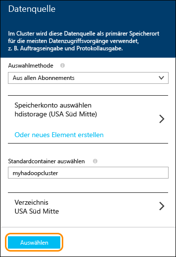

<properties
	pageTitle="Bereitstellen eines Spark-Clusters unter Azure HDInsight und Verwenden von Spark-SQL über Zeppelin und Jupyter für interaktive Analysen | Microsoft Azure"
	description="Schritt-für-Schritt-Anleitung zur schnellen Bereitstellung eines Apache Spark-Clusters in HDInsight und Verwendung von Spark-SQL über Zeppelin und Jupyter Notebooks zum Ausführen von interaktiven Abfragen"
	services="hdinsight"
	documentationCenter=""
	authors="nitinme"
	manager="paulettm"
	editor="cgronlun"
	tags="azure-portal"/>

<tags
	ms.service="hdinsight"
	ms.workload="big-data"
	ms.tgt_pltfrm="na"
	ms.devlang="na"
	ms.topic="article"
	ms.date="09/30/2015"
	ms.author="nitinme"/>

# Erste Schritte: Bereitstellen von Apache Spark für Azure HDInsight und Ausführen von interaktiven Abfragen per Spark-SQL

[AZURE.INCLUDE [hdinsight-azure-preview-portal](../../includes/hdinsight-azure-preview-portal.md)]

* [Bereitstellen von Apache Spark in HDInsight und Ausführen von interaktiven Abfragen mit Spark-SQL](hdinsight-apache-spark-zeppelin-notebook-jupyter-spark-sql-v1.md)

Hier erfahren Sie, wie Sie einen Apache Spark-Cluster in HDInsight mit der Option „Schnellerfassung“ bereitstellen und dann die webbasierten [Zeppelin](https://zeppelin.incubator.apache.org) und [Jupyter](https://jupyter.org) Notebooks verwenden, um interaktive Spark-SQL-Abfragen für den Spark-Cluster auszuführen.

   

**Voraussetzungen:**

Bevor Sie mit diesem Lernprogramm beginnen, müssen Sie über ein Azure-Abonnement verfügen. Siehe [Kostenlose Azure-Testversion](http://azure.microsoft.com/documentation/videos/get-azure-free-trial-for-testing-hadoop-in-hdinsight/).

## Bereitstellen eines HDInsight Spark-Clusters

In diesem Abschnitt stellen Sie einen HDInsight-Cluster der Version 3.2 bereit, der auf der Spark-Version 1.3.1 basiert. Informationen zu den verschiedenen HDInsight-Versionen und ihren SLAs finden Sie unter [HDInsight-Komponentenversionen](hdinsight-component-versioning.md).

>[AZURE.NOTE]Mit den Schritten in diesem Artikel wird ein Apache Spark-Cluster in HDInsight unter Verwendung grundlegender Konfigurationseinstellungen erstellt. Informationen zu anderen Clusterkonfigurationseinstellungen (z. B. zur Verwendung von zusätzlichem Speicher, einem virtuellen Azure-Netzwerk oder einem Metastore für Hive) finden Sie unter [Bereitstellen von HDInsight-Clustern mit benutzerdefinierten Optionen](hdinsight-apache-spark-provision-clusters.md).

**So stellen Sie einen Spark-Cluster bereit**

1. Melden Sie sich beim [Azure-Vorschauportal](https://ms.portal.azure.com/) an.

2. Klicken Sie auf **NEU**, auf **Datenanalyse** und anschließend auf **HDInsight**.

    

3. Geben Sie einen **Clusternamen** ein, wählen Sie **Hadoop** als **Clustertyp** aus, und wählen Sie im Dropdownmenü **Clusterbetriebssystem** den Eintrag **Windows Server 2012 R2 Datacenter** aus. Wenn der Clustername verfügbar ist, wird neben dem Namen ein grünes Häkchen angezeigt.

	

4. Falls Sie mehrere Abonnements besitzen, klicken Sie auf den Eintrag **Abonnement**, um das Azure-Abonnement für den Cluster auszuwählen.

5. Klicken Sie auf **Ressourcengruppe**, um eine Liste der vorhandenen Ressourcengruppen anzuzeigen, und wählen Sie dann die Gruppe aus, in der der Cluster erstellt werden soll. Alternativ können Sie eine neue Ressourcengruppe erstellen, indem Sie auf **Neu erstellen** klicken und den Namen der neuen Gruppe eingeben. Wenn der neue Gruppenname verfügbar ist, wird neben dem Namen ein grünes Häkchen angezeigt.

	> [AZURE.NOTE]Dieser Eintrag ist standardmäßig auf eine Ihrer vorhandenen Ressourcengruppen festgelegt (sofern verfügbar).

6. Klicken Sie auf **Anmeldeinformationen**, und geben Sie dann ein **Clusteranmeldekennwort** und einen **Clusterbenutzernamen** ein. Wenn Sie Remotedesktop für den Clusterknoten aktivieren möchten, klicken Sie für **Remotedesktop aktivieren** auf **Ja**, und geben Sie dann die erforderlichen Werte an. Da Remotedesktop für dieses Tutorial nicht erforderlich ist, können Sie diesen Schritt überspringen. Klicken Sie unten auf **Auswählen**, um die Konfiguration der Anmeldeinformationen zu speichern.

	

7. Klicken Sie auf **Datenquelle**, um eine vorhandene Datenquelle für den Cluster auszuwählen, oder erstellen Sie eine neue Datenquelle. Bei der Bereitstellung eines Hadoop-Clusters in HDInsight geben Sie ein Azure-Speicherkonto an. Ein bestimmter BLOB-Speichercontainer aus diesem Konto wird genau wie in HDFS (Hadoop Distributed File System) als Standarddateisystem festgelegt. Der HDInsight-Cluster wird standardmäßig in demselben Rechenzentrum bereitgestellt wie das angegebene Speicherkonto. Weitere Informationen finden Sie unter [Verwenden von Azure-Blob-Speicher mit HDInsight][hdinsight-storage].

	

	Zurzeit kann ein Azure-Speicherkonto als Datenquelle für einen HDInsight-Cluster ausgewählt werden. Die Einträge auf dem Blatt **Datenquelle** werden im Folgenden erläutert.

	- **Auswahlmethode**: Wählen Sie **Aus allen Abonnements** aus, damit Speicherkonten aus all Ihren Abonnements durchsucht werden können. Wählen Sie **Zugriffsschlüssel** aus, wenn Sie den **Speichernamen** und **Zugriffsschlüssel** eines vorhandenen Speicherkontos eingeben möchten.

	- **Speicherkonto auswählen/Neu erstellen**: Klicken Sie auf **Speicherkonto auswählen**, um ein vorhandenes Speicherkonto auszuwählen, das Sie dem Cluster zuordnen möchten. Alternativ können Sie auf **Neu erstellen** klicken, um ein neues Speicherkonto zu erstellen. Geben Sie den Namen des Speicherkontos in das angezeigte Feld ein. Wenn der Name verfügbar ist, wird ein grünes Häkchen angezeigt.

	- **Standardcontainer auswählen**: Geben Sie den Namen des Standardcontainers für den Cluster ein. Sie können einen beliebigen Namen eingeben, es wird jedoch empfohlen, den Namen des Clusters zu verwenden. So können Sie leichter erkennen, dass es sich um den Container für diesen spezifischen Cluster handelt.

	- **Standort**: Die geografische Region, in der sich das Speicherkonto befindet bzw. in der es erstellt wird.

		> [AZURE.IMPORTANT]Durch die Auswahl des Standorts für die Standarddatenquelle wird auch der Standort des HDInsight-Clusters festgelegt. Der Cluster und die Standarddatenquelle müssen sich in der gleichen Region befinden.

	Klicken Sie auf **Auswählen**, um die Datenquellenkonfiguration zu speichern.

8. Klicken Sie auf **Knotenpreistarife**, um Informationen zu den Knoten anzuzeigen, die für diesen Cluster erstellt werden. Legen Sie die Anzahl von Workerknoten fest, die Sie für den Cluster benötigen. Die vorkalkulierten Kosten für den Cluster werden auf dem Blatt angezeigt.

	

	Klicken Sie auf **Auswählen**, um die Konfiguration der Knotenpreise zu speichern.

9. Vergewissern Sie sich auf dem Blatt **Neues HDInsight-Cluster**, dass **An Startmenü anheften** ausgewählt ist, und klicken Sie dann auf **Erstellen**. Der Cluster wird erstellt, und dem Startmenü Ihres Azure-Portals wird eine Kachel für den Cluster hinzugefügt. Das Symbol zeigt an, dass der Cluster bereitgestellt wird. Sobald die Bereitstellung abgeschlossen ist, ändert es sich in das HDInsight-Symbol.

	| Während der Bereitstellung | Nach Abschluss der Bereitstellung |
	| ------------------ | --------------------- |
	|  |  |

	> [AZURE.NOTE]Die Erstellung des Clusters dauert in der Regel ca. 15 Minuten. Sie können den Status des Bereitstellungsprozesses auf der Kachel im Startmenü oder im linken Bereich der Seite unter **Benachrichtigungen** überprüfen.

10. Klicken Sie nach Abschluss der Bereitstellung im Startmenü auf die Kachel für den Spark-Cluster, um das Clusterblatt zu öffnen.

## Ausführen von interaktiven Spark-SQL-Abfragen mit einem Zeppelin Notebook

Nachdem Sie einen Cluster bereitgestellt haben, können Sie ein webbasiertes Zeppelin Notebook verwenden, um interaktive Spark-SQL-Abfragen für den Spark HDInsight-Cluster auszuführen. In diesem Abschnitt verwenden wir eine Beispieldatendatei (hvac.csv), die im Cluster standardmäßig verfügbar ist, um interaktive Spark-SQL-Abfragen auszuführen.

>[AZURE.NOTE]Das Notebook, das Sie gemäß der unten angegebenen Anleitung erstellen, ist standardmäßig auch im Cluster verfügbar. Nach dem Starten von Zeppelin wird dieses Notebook mit dem Namen **Zeppelin HVAC Tutorial** angezeigt.

1. Klicken Sie im [Azure-Vorschauportal](https://portal.azure.com/) im Startmenü auf die Kachel für Ihren Spark-Cluster (sofern Sie die Kachel ans Startmenü angeheftet haben). Sie können auch unter **Alle durchsuchen** > **HDInsight-Cluster** zu Ihrem Cluster navigieren.   

2. Klicken Sie auf dem Blatt für den Spark-Cluster auf **Quicklinks** und anschließend auf dem Blatt **Cluster Dashboard** auf **Zeppelin Notebook**. Geben Sie die Anmeldeinformationen für den Cluster ein, wenn Sie dazu aufgefordert werden.

	> [AZURE.NOTE]Sie können auch das Zeppelin Notebook für Ihren Cluster aufrufen, indem Sie in Ihrem Browser die folgende URL öffnen. Ersetzen Sie __CLUSTERNAME__ durch den Namen Ihres Clusters:
	>
	> `https://CLUSTERNAME.azurehdinsight.net/zeppelin`

2. Erstellen Sie ein neues Notebook. Klicken Sie im Headerbereich auf **Notebook**, und wählen Sie die Option **Neue Notiz erstellen** aus.

	

	Auf derselben Seite sollte unter der Überschrift **Notebook** ein neues Notebook angezeigt werden, dessen Name mit **Notiz XXXXXXXXX** beginnt. Klicken Sie auf das neue Notebook.

3. Klicken Sie auf der Webseite für das neue Notebook auf die Überschrift, und ändern Sie den Namen des Notebooks, wenn Sie dies möchten. Drücken Sie die EINGABETASTE, um die Namensänderung zu speichern. Stellen Sie außerdem sicher, dass im Header des Notebooks in der oberen rechten Ecke der Status **Verbunden** angezeigt wird.

	

4. Laden Sie Beispieldaten in eine temporäre Tabelle. Wenn Sie einen Spark-Cluster in HDInsight bereitstellen, wird die Beispieldatei **hvac.csv** in das zugeordnete Speicherkonto unter **\\HdiSamples\\SensorSampleData\\hvac** kopiert.

	Fügen Sie in den leeren Absatz, der im neuen Notebook standardmäßig erstellt wird, den folgenden Code ein.

		// Create an RDD using the default Spark context, sc
		val hvacText = sc.textFile("wasb:///HdiSamples/SensorSampleData/hvac/HVAC.csv")

		// Define a schema
		case class Hvac(date: String, time: String, targettemp: Integer, actualtemp: Integer, buildingID: String)

		// Map the values in the .csv file to the schema
		val hvac = hvacText.map(s => s.split(",")).filter(s => s(0) != "Date").map(
    		s => Hvac(s(0),
            		s(1),
            		s(2).toInt,
            		s(3).toInt,
            		s(6)
        	)
		).toDF()

		// Register as a temporary table called "hvac"
		hvac.registerTempTable("hvac")

	Drücken Sie UMSCHALT+EINGABETASTE auf der Tastatur, oder klicken Sie auf die Schaltfläche **Wiedergeben** für den Absatz, um den Code auszuführen. Der Status in der oberen rechten Ecke des Absatzes sollte sich entsprechend ändern: BEREIT, AUSSTEHEND, WIRD AUSGEFÜHRT bis zu BEENDET. Die Ausgabe wird unten im gleichen Absatz angezeigt. Der Screenshot sieht folgendermaßen aus:

	

	Sie können auch einen Titel für jeden Absatz angeben. Klicken Sie in der rechten Ecke auf das Symbol **Einstellungen** und dann auf **Titel anzeigen**.

5. Sie können jetzt Spark-SQL-Anweisungen für die **hvac**-Tabelle ausführen. Fügen Sie die folgende Abfrage in einen neuen Absatz ein. Mit der Abfrage werden die Gebäude-ID und der Unterschied zwischen den Ziel- und Ist-Temperaturen für jedes Gebäude an einem bestimmten Datum abgerufen. Drücken Sie UMSCHALT+EINGABETASTE.

		%sql
		select buildingID, (targettemp - actualtemp) as temp_diff, date
		from hvac
		where date = "6/1/13"

	Mit der **%sql**-Anweisung am Anfang wird das Notebook angewiesen, den Spark-SQL-Interpreter zu verwenden. Sie können die definierten Interpreter im Header des Notebooks auf der Registerkarte **Interpreter** anzeigen.

	Im folgenden Screenshot ist die Ausgabe dargestellt.

	

	Klicken Sie auf die Anzeigeoptionen (im Rechteck hervorgehoben), um für eine Ausgabe zwischen unterschiedlichen Darstellungen zu wechseln. Klicken Sie auf **Einstellungen**, um auszuwählen, worum es sich bei den Schlüsseln und Werten in der Ausgabe handelt. Im obigen Screenshot werden **buildingID** als Schlüssel und der Mittelwert von **temp\_diff** als Wert verwendet.

6. Sie können auch Spark-SQL-Anweisungen ausführen, indem Sie die Variablen in der Abfrage verwenden. Das nächste Codebeispiel zeigt, wie Sie eine Variable (**Temp**) in der Abfrage mit den möglichen Werten definieren, die für die Abfrage verwendet werden sollen. Beim ersten Ausführen der Abfrage wird automatisch eine Dropdownliste mit den Werten aufgefüllt, die Sie für die Variable angegeben haben.

		%sql
		select buildingID, date, targettemp, (targettemp - actualtemp) as temp_diff
		from hvac
		where targettemp > "${Temp = 65,65|75|85}"

	Fügen Sie diesen Beispielcode in einen neuen Absatz ein, und drücken Sie UMSCHALT+EINGABETASTE. Im folgenden Screenshot ist die Ausgabe dargestellt.

	

	Für nachfolgende Abfragen können Sie einen neuen Wert aus der Dropdownliste auswählen und die Abfrage erneut ausführen. Klicken Sie auf **Einstellungen**, um auszuwählen, worum es sich bei den Schlüsseln und Werten in der Ausgabe handelt. Im obigen Screenshot werden **buildingID** als Schlüssel, der Mittelwert von **temp\_diff** als Wert und **targettemp** als Gruppe verwendet.

7. Starten Sie den Spark-SQL-Interpreter neu, um die Anwendung zu beenden. Klicken Sie oben auf die Registerkarte **Interpreter**, und klicken Sie für den Spark-Interpreter auf **Neu starten**.

	

## Ausführen von Spark-SQL-Abfragen mit einem Jupyter Notebook

In diesem Abschnitt verwenden Sie ein Jupyter Notebook, um Spark-SQL-Abfragen für einen Spark-Cluster auszuführen.

>[AZURE.NOTE]Das Notebook, das Sie gemäß der unten angegebenen Anleitung erstellen, ist standardmäßig auch im Cluster verfügbar. Nach dem Starten von Jupyter wird dieses Notebook mit dem Namen **HVACTutorial.ipynb** angezeigt.

1. Klicken Sie im [Azure-Vorschauportal](https://portal.azure.com/) im Startmenü auf die Kachel für Ihren Spark-Cluster (sofern Sie die Kachel ans Startmenü angeheftet haben). Sie können auch unter **Alle durchsuchen** > **HDInsight-Cluster** zu Ihrem Cluster navigieren.   

2. Klicken Sie auf dem Blatt für den Spark-Cluster auf **Quicklinks** und anschließend auf dem Blatt **Cluster Dashboard** auf **Jupyter Notebook**. Geben Sie die Anmeldeinformationen für den Cluster ein, wenn Sie dazu aufgefordert werden.

	> [AZURE.NOTE]Sie können auch das Jupyter Notebook für Ihren Cluster aufrufen, indem Sie in Ihrem Browser die folgende URL öffnen. Ersetzen Sie __CLUSTERNAME__ durch den Namen Ihres Clusters:
	>
	> `https://CLUSTERNAME.azurehdinsight.net/jupyter`

2. Erstellen Sie ein neues Notebook. Klicken Sie auf **Neu** und dann auf **Python2**.

	

3. Ein neues Notebook mit dem Namen „Untitled.pynb“ wird erstellt und geöffnet. Klicken Sie oben auf den Namen des Notebooks, und geben Sie einen Anzeigenamen ein.

	

4. Importieren Sie die erforderlichen Module, und erstellen Sie die Spark- und SQL-Kontexte. Fügen Sie den folgenden Beispielcode in eine leere Zelle ein, und drücken Sie UMSCHALT+EINGABETASTE.

		from pyspark import SparkContext
		from pyspark.sql import SQLContext
		from pyspark.sql.types import *

		# Create Spark and SQL contexts
		sc = SparkContext('spark://headnodehost:7077', 'pyspark')
		sqlContext = SQLContext(sc)

	Bei jedem Ausführen eines Auftrags in Jupyter wird in der Titelleiste Ihres Webbrowserfensters neben dem Notebooktitel der Status **(Beschäftigt)** angezeigt. Außerdem sehen Sie in der oberen rechten Ecke einen ausgefüllten Kreis neben dem Text **Python 2**. Wenn der Auftrag abgeschlossen ist, wird ein Kreis ohne Füllung angezeigt.

	 

4. Laden Sie Beispieldaten in eine temporäre Tabelle. Wenn Sie einen Spark-Cluster in HDInsight bereitstellen, wird die Beispieldatei **hvac.csv** in das zugeordnete Speicherkonto unter **\\HdiSamples\\SensorSampleData\\hvac** kopiert.

	Fügen Sie den folgenden Beispielcode in eine leere Zelle ein, und drücken Sie UMSCHALT+EINGABETASTE. Mit diesem Beispielcode werden die Daten in einer temporären Tabelle mit dem Namen **hvac** registriert.

		# Load the data
		hvacText = sc.textFile("wasb:///HdiSamples/SensorSampleData/hvac/HVAC.csv")

		# Create the schema
		hvacSchema = StructType([StructField("date", StringType(), False),StructField("time", StringType(), False),StructField("targettemp", IntegerType(), False),StructField("actualtemp", IntegerType(), False),StructField("buildingID", StringType(), False)])

		# Parse the data in hvacText
		hvac = hvacText.map(lambda s: s.split(",")).filter(lambda s: s[0] != "Date").map(lambda s:(str(s[0]), str(s[1]), int(s[2]), int(s[3]), str(s[6]) ))

		# Create a data frame
		hvacdf = sqlContext.createDataFrame(hvac,hvacSchema)

		# Register the data fram as a table to run queries against
		hvacdf.registerAsTable("hvac")

		# Run queries against the table and display the data
		data = sqlContext.sql("select buildingID, (targettemp - actualtemp) as temp_diff, date from hvac where date = "6/1/13"")
		data.show()

5. Nachdem der Auftrag erfolgreich abgeschlossen wurde, wird die folgende Ausgabe angezeigt.

		buildingID temp_diff date  
		4          8         6/1/13
		3          2         6/1/13
		7          -10       6/1/13
		12         3         6/1/13
		7          9         6/1/13
		7          5         6/1/13
		3          11        6/1/13
		8          -7        6/1/13
		17         14        6/1/13
		16         -3        6/1/13
		8          -8        6/1/13
		1          -1        6/1/13
		12         11        6/1/13
		3          14        6/1/13
		6          -4        6/1/13
		1          4         6/1/13
		19         4         6/1/13
		19         12        6/1/13
		9          -9        6/1/13
		15         -10       6/1/13

6. Starten Sie den Kernel neu, um die Anwendung zu beenden. Klicken Sie in der oberen Menüleiste auf **Kernel** und **Neu starten**, und klicken Sie bei der Aufforderung noch einmal auf **Neu starten**.

	

## Weitere Informationen

* [Übersicht: Apache Spark für Azure HDInsight](hdinsight-apache-spark-overview.md)
* [Bereitstellen von Spark in einem HDInsight-Cluster](hdinsight-apache-spark-provision-clusters.md)
* [Durchführen interaktiver Datenanalysen mithilfe von Spark in HDInsight mit BI-Tools](hdinsight-apache-spark-use-bi-tools.md)
* [Verwenden von Spark in HDInsight zum Erstellen von Machine Learning-Anwendungen](hdinsight-apache-spark-ipython-notebook-machine-learning.md)
* [Verwenden von Spark in HDInsight zum Erstellen von Echtzeit-Streaminganwendungen](hdinsight-apache-spark-csharp-apache-zeppelin-eventhub-streaming.md)
* [Verwalten von Ressourcen für den Apache Spark-Cluster in Azure HDInsight](hdinsight-apache-spark-resource-manager.md)

[hdinsight-versions]: ../hdinsight-component-versioning/
[hdinsight-upload-data]: ../hdinsight-upload-data/
[hdinsight-storage]: ../hdinsight-use-blob-storage/

[azure-purchase-options]: http://azure.microsoft.com/pricing/purchase-options/
[azure-member-offers]: http://azure.microsoft.com/pricing/member-offers/
[azure-free-trial]: http://azure.microsoft.com/pricing/free-trial/
[azure-management-portal]: https://manage.windowsazure.com/
[azure-create-storageaccount]: ../storage-create-storage-account/

<!---HONumber=Oct15_HO2-->