<properties
	pageTitle="Apache Storm-Lernprogramm: Erste Schritte mit Storm | Microsoft Azure"
	description="Erste Schritte mit Big Data-Analysen in HDInsight mit Apache Storm und den Storm-Starter-Beispielen. Erfahren Sie, wie Sie Storm zur Verarbeitung von Daten in Echtzeit verwenden."
	keywords="apache storm,apache storm tutorial,big data analytics,storm starter"
	services="hdinsight"
	documentationCenter=""
	authors="Blackmist"
	manager="paulettm"
	editor="cgronlun"
	tags="azure-portal"/>

<tags
   ms.service="hdinsight"
   ms.devlang="java"
   ms.topic="get-started-article"
   ms.tgt_pltfrm="na"
   ms.workload="big-data"
   ms.date="08/12/2015"
   ms.author="larryfr"/>

# Apache Storm-Lernprogramm: Erste Schritte mit Storm-Starter-Beispielen für die Big Data-Analyse in HDInsight

Apache Storm ist ein skalierbares, fehlertolerantes, verteiltes Echtzeit-Berechnungssystem für die Verarbeitung von Datenströmen. Mit Storm in Microsoft Azure HDInsight können Sie einen cloudbasierten Storm-Cluster erstellen, der Big Data-Analysen in Echtzeit durchführt.

[AZURE.INCLUDE [Vorschauportal](../../includes/hdinsight-azure-preview-portal.md)]

* [Apache Storm-Lernprogramm: Erste Schritte mit Storm-Starter-Beispielen für die Big Data-Analyse in HDInsight](hdinsight-apache-storm-tutorial-get-started-v1.md)

   

> [AZURE.NOTE]Mit den Schritten in diesem Artikel wird ein Windows-basierter HDInsight-Cluster erstellt. Schritte zum Erstellen eines Linux-basierten "Storm in HDInsight"-Clusters finden Sie unter [Apache Storm-Lernprogramm: Erste Schritte mit Storm-Starter-Beispielen für die Datenanalyse in HDInsight](hdinsight-apache-storm-tutorial-get-started-linux.md).

## Voraussetzungen

Zur Ausführung dieses Lernprogramms zu Apache Storm benötigen Sie Folgendes:

- **Ein Azure-Abonnement**. Siehe [Kostenlose Azure-Testversion](http://azure.microsoft.com/documentation/videos/get-azure-free-trial-for-testing-hadoop-in-hdinsight/).

##  Erstellen eines Storm-Clusters

Storm in HDInsight verwendet Azure-Blobspeicher zum Speichern der an den Cluster übergebenen Protokolldateien und Topologien. Führen Sie zur Erstellung eines Azure-Speicherkontos für Ihren Cluster die folgenden Schritte aus:

1. Melden Sie sich beim [Azure-Vorschauportal][preview-portal] an.

2. Wählen Sie **NEU**, __Datenanalyse__ und anschließend __HDInsight__ aus.

	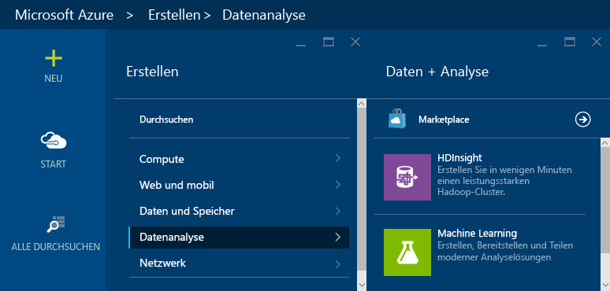

3. Geben Sie einen __Clusternamen__ ein, und wählen Sie dann __Storm__ unter __Clustertyp__ aus. Wenn der __Clustername__ verfügbar ist, wird neben dem Namen ein grünes Häkchen angezeigt.

	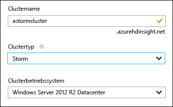

4. Falls Sie mehrere Abonnements besitzen, wählen Sie den Eintrag __Abonnement__ aus, um das Azure-Abonnement für den Cluster auszuwählen.

5. Wählen Sie den Eintrag __Ressourcengruppe__ aus, um eine Liste der vorhandenen Ressourcengruppen anzuzeigen, und wählen Sie dann die Gruppe aus, in der der Cluster erstellt werden soll. Alternativ können Sie eine neue Ressourcengruppe erstellen, indem Sie auf __Neu erstellen__ klicken und den Namen der neuen Gruppe eingeben. Wenn der neue Gruppenname verfügbar ist, wird neben dem Namen ein grünes Häkchen angezeigt.

	> [AZURE.NOTE]Dieser Eintrag ist standardmäßig auf eine Ihrer vorhandenen Ressourcengruppen festgelegt (sofern verfügbar).

6. Wählen Sie __Anmeldeinformationen__ aus, und geben Sie dann ein __Clusterbenutzernamen__ und ein __Clusteranmeldekennwort__ ein. Klicken Sie abschließend auf __Auswählen__, um die Anmeldeinformationen festzulegen. Remotedesktop wird in diesem Dokument nicht verwendet und muss daher nicht aktiviert werden.

	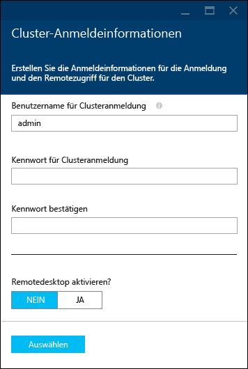

6. Wählen Sie den Eintrag __Datenquelle__ aus, um eine vorhandene Datenquelle auszuwählen, oder erstellen Sie eine neue Datenquelle.

	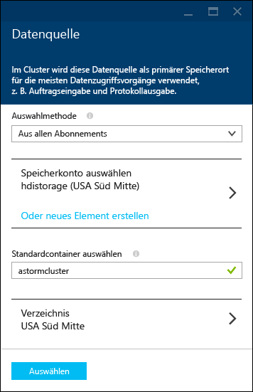

	Zurzeit kann ein Azure-Speicherkonto als Datenquelle für einen HDInsight-Cluster ausgewählt werden. Die Einträge auf dem Blatt __Datenquelle__ werden im Folgenden erläutert.

	- __Auswahlmethode__: Wählen Sie __Aus allen Abonnements__ aus, damit die Speicherkonten in Ihren Abonnements durchsucht werden können. Wählen Sie __Zugriffsschlüssel__ aus, wenn Sie den __Speichernamen__ und __Zugriffsschlüssel__ eines vorhandenen Speicherkontos eingeben möchten.

	- __Neu erstellen__: Hiermit können Sie ein neues Speicherkonto erstellen. Geben Sie den Namen des Speicherkontos in das angezeigte Feld ein. Wenn der Name verfügbar ist, wird ein grünes Häkchen angezeigt.

	- __Standardcontainer auswählen__: Geben Sie den Namen des Standardcontainers für den Cluster ein. Sie können einen beliebigen Namen eingeben, es wird jedoch empfohlen, den Namen des Clusters zu verwenden. So können Sie leichter erkennen, dass es sich um den Container für diesen spezifischen Cluster handelt.

	- __Standort__: Die geografische Region, in der sich das Speicherkonto befindet bzw. in der es erstellt wird.

		> [AZURE.IMPORTANT]Durch die Auswahl des Standorts für die Standarddatenquelle wird auch der Standort des HDInsight-Clusters festgelegt. Der Cluster und die Standarddatenquelle müssen sich in der gleichen Region befinden.

	- __Auswählen__: Hiermit speichern Sie die Datenquellenkonfiguration.

7. Wählen Sie __Knotenpreistarife__ aus, um Informationen zu den Knoten anzuzeigen, die für diesen Cluster erstellt werden. Die Anzahl von Workerknoten ist standardmäßig auf __4__ festgelegt. Legen Sie diese Einstellung auf __1__ fest. Für dieses Lernprogramm ist ein Workerknoten ausreichend, und zudem werden so die Kosten für den Cluster reduziert. Die vorkalkulierten Kosten für den Cluster werden unten auf dem Blatt angezeigt.

	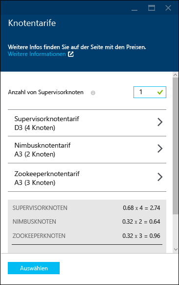

	Klicken Sie auf __Auswählen__, um die Informationen zu den __Knotenpreistarifen__ zu speichern.

8. Wählen Sie __Optionale Konfiguration__ aus. Auf diesem Blatt können Sie die Clusterversion auswählen und andere optionale Einstellungen konfigurieren. Sie können den Cluster z. B. einem __virtuellen Netzwerk__ hinzufügen oder einen __externen Metastore__ zum Speichern von Daten für Hive und Oozie einrichten.

	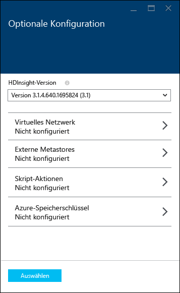

9. Stellen Sie sicher, dass __An Startmenü anheften__ ausgewählt ist, und klicken Sie dann auf __Erstellen__. Der Cluster wird erstellt, und dem Startmenü Ihres Azure-Portals wird eine Kachel für den Cluster hinzugefügt. Das Symbol zeigt an, dass der Cluster bereitgestellt wird. Sobald die Bereitstellung abgeschlossen ist, ändert es sich in das HDInsight-Symbol.

	| Während der Bereitstellung | Nach Abschluss der Bereitstellung |
	| ------------------ | --------------------- |
	|  |  |

	> [AZURE.NOTE]Die Erstellung des Clusters dauert in der Regel ca. 15 Minuten. Sie können den Status des Bereitstellungsprozesses auf der Kachel im Startmenü oder im linken Bereich der Seite unter __Benachrichtigungen__ überprüfen.

## Ausführen eines Storm Starter-Beispiels in HDInsight

Dieses Lernprogramm zu Apache Storm führt Sie in die Big Data-Analyse ein. Dazu werden auf GitHub bereitgestellte Storm-Starter-Beispiele verwendet.

Jeder Storm-Cluster in HDInsight enthält das Storm-Dashboard, über das Storm-Topologien im Cluster hochgeladen und ausgeführt werden können. Außerdem stellt jeder Cluster Beispieltopologien bereit, die direkt über das Storm-Dashboard ausgeführt werden können.

### Verbindungsaufbau zum Dashboard

Das Dashboard befindet sich unter **https://&lt;clustername>.azurehdinsight.net//**, wobei **Clustername** der Name des Clusters ist. Sie können auch einen Link zum Dashboard anzeigen, indem Sie den Cluster im Startmenü auswählen und oben auf dem Blatt auf den Link __Dashboard__ klicken.

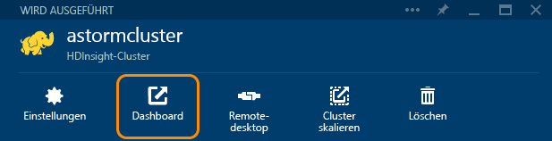

> [AZURE.NOTE]Beim Verbindungsaufbau zum Dashboard werden Sie zur Eingabe von Benutzername und Kennwort aufgefordert. Sie geben hier den Administratornamen (**admin**) und das Kennwort ein, die Sie bei der Erstellung des Clusters angegeben haben.

Sobald das Storm-Dashboard geladen ist, sehen Sie das Formular **Topologie übermitteln**.

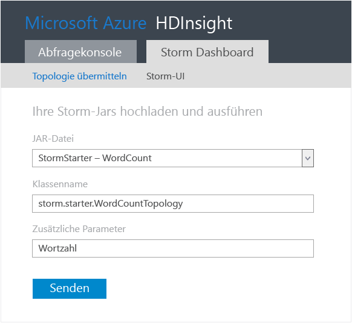

Das Formular **Topologie übermitteln** kann zum Hochladen und Ausführen von JAR-Dateien mit Storm-Topologien verwendet werden. Darüber hinaus enthält es verschiedene einfache Beispiele, die mit dem Cluster bereitgestellt werden.

### Ausführen des Wortanalysebeispiels (WordCount) aus dem Storm-Starter-Projekt auf GitHub

Die mit dem Cluster bereitgestellten Beispiele enthalten mehrere Varianten einer Wortanalysetopologie. Diese Beispiele enthalten einen **Spout**, der nach dem Zufallsprinzip Sätze ausgibt, sowie **Bolts**, die jeden Satz in einzelne Wörter aufteilen und danach zählen, wie oft jedes Wort vorkommt. Diese Beispiele stammen aus den mit Apache Storm bereitgestellten [Storm-Starter-Beispielen](https://github.com/apache/storm/tree/master/examples/storm-starter).

Führen Sie zur Ausführung eines Storm-Starter-Beispiels die folgenden Schritte aus:

1. Wählen Sie aus der Dropdown-Liste **JAR-Datei** die Option **StormStarter – WordCount** aus. Dadurch werden die Felder **Klassenname** und **Zusätzliche Parameter** mit den Parametern dieses Beispiels aufgefüllt.

	

	* **Klassenname** – Die Klasse in der JAR-Datei, durch die die Topologie übermittelt wird.
	* **Zusätzliche Parameter** – Alle von der Topologie benötigten Parameter. In diesem Beispiel wird in diesem Feld ein Anzeigename für die übermittelte Topologie bereitgestellt.

2. Klicken Sie auf **Senden**. Nach einer Weile werden im Feld **Ergebnis** der zur Übermittlung des Auftrags verwendete Befehl sowie dessen Ergebnisse angezeigt. Im Feld **Fehler** werden die bei der Übermittlung der Topologie aufgetretenen Fehler angezeigt.

	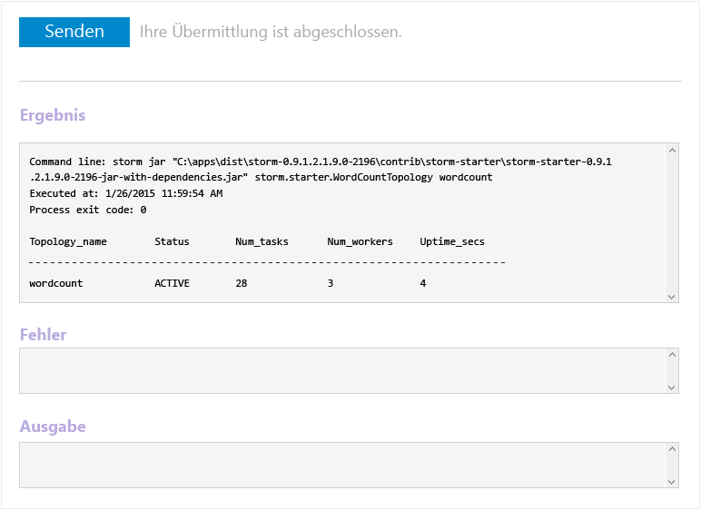

	> [AZURE.NOTE]Die Ergebnisse zeigen keine Beendigung der Topologie an – **Storm-Topologien werden nach dem Start solange ausgeführt, bis sie beendet werden.** Die WordCount-Topologie generiert zufällige Sequenzen und zählt mit, wie oft jedes Wort vorkommt, bis Sie die Topologie beenden.

### Überwachen der Topologie

Die Topologie kann über die Benutzeroberfläche von Apache Storm überwacht werden.

1. Wählen Sie oben im Storm-Dashboard die Option **Storm-UI**. Dadurch werden zusammenfassende Informationen zum Cluster und allen aktiven Topologien angezeigt.

	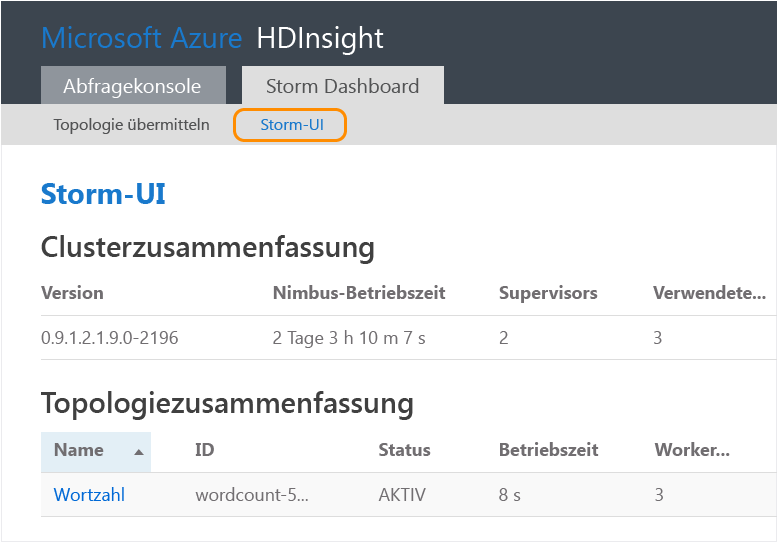

	Auf dieser Seite sehen Sie, wie lange die Topologie aktiv war, sowie die Anzahl der verwendeten Worker, Executors und Aufgaben.

	> [AZURE.NOTE]Die Spalte **Name** enthält den zuvor im Feld **Zusätzliche Parameter** angegebenen Anzeigenamen.

4. Klicken Sie unter **Topologiezusammenfassung** in der Spalte **Name** auf den Eintrag **wordcount**. Dadurch werden weitere Informationen zur Topologie angezeigt.

	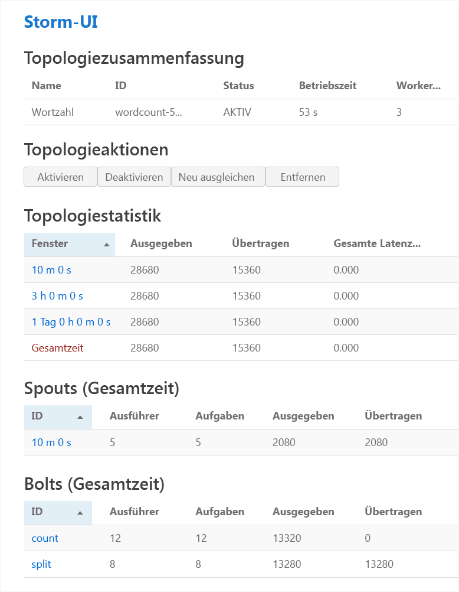

	Auf dieser Seite werden die folgenden Informationen angezeigt:

	* **Topologiestatistik** – Grundlegende Informationen zur Leistung der Topologie, aufgeteilt in Zeitfenster.

		> [AZURE.NOTE]Durch die Auswahl eines bestimmten Zeitfensters werden die Informationen in den anderen Abschnitten der Seite entsprechend angepasst.

	* **Spouts** – Grundlegende Informationen zu Spouts, einschließlich des letzten von einem Spout zurückgegebenen Fehlers.

	* **Bolts** – Grundlegende Informationen zu Bolts.

	* **Topologiekonfiguration** – Ausführliche Informationen zur Konfiguration der Topologie.

	Außerdem gibt diese Seite die für die Topologie ausführbaren Aktionen an:

	* **Aktivieren** – Setzt die Verarbeitung einer deaktivierten Topologie fort.

	* **Deaktivieren** – Hält eine aktive Topologie an.

	* **Ausgleichen** – Passt die Parallelität der Topologie an. Sie sollten aktive Topologien ausgleichen, nachdem Sie die Anzahl der Knoten im Cluster geändert haben. Dadurch kann die Topologie die Parallelität anpassen, um die höhere/geringere Anzahl der Knoten im Cluster zu kompensieren. Weitere Informationen finden Sie unter [Understanding the Parallelism of a Storm Topology](http://storm.apache.org/documentation/Understanding-the-parallelism-of-a-Storm-topology.html) (Grundlegendes zur Parallelität einer Storm-Topologie, in englischer Sprache).

	* **Beenden** – Beendet eine Storm-Topologie nach dem angegebenen Zeitlimit.

5. Wählen Sie auf dieser Seite einen Eintrag aus dem Abschnitt **Spouts** oder **Bolts** aus. Dadurch werden Informationen zur ausgewählten Komponente angezeigt.

	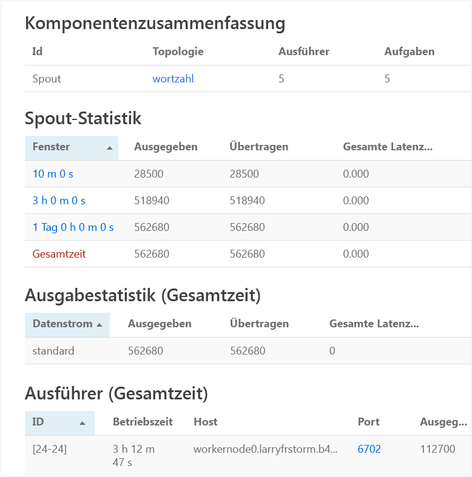

	Auf dieser Seite werden die folgenden Informationen angezeigt:

	* **Statistik für Spout/Bolt** – Grundlegende Informationen zur Leistung der Komponente, aufgeteilt in Zeitfenster.

		> [AZURE.NOTE]Durch die Auswahl eines bestimmten Zeitfensters werden die Informationen in den anderen Abschnitten der Seite entsprechend angepasst.

	* **Eingabestatistik** (nur Bolt) – Informationen zu Komponenten, die vom Bold konsumierte Daten generieren.

	* **Ausgabestatistik** – Informationen zu den von diesem Bold ausgegebenen Daten.

	* **Executors** – Informationen zu Instanzen dieser Komponente.

	* **Fehler** – Von dieser Komponente generierte Fehler.

5. Zum Anzeigen der Spout- oder Bolt-Details wählen Sie im Abschnitt **Executors** einen Eintrag aus der Spalte **Port** aus, um die Details einer bestimmten Instanz der Komponente anzuzeigen.

		2015-01-27 14:18:02 b.s.d.task [INFO] Emitting: split default ["with"]
		2015-01-27 14:18:02 b.s.d.task [INFO] Emitting: split default ["nature"]
		2015-01-27 14:18:02 b.s.d.executor [INFO] Processing received message source: split:21, stream: default, id: {}, [snow]
		2015-01-27 14:18:02 b.s.d.task [INFO] Emitting: count default [snow, 747293]
		2015-01-27 14:18:02 b.s.d.executor [INFO] Processing received message source: split:21, stream: default, id: {}, [white]
		2015-01-27 14:18:02 b.s.d.task [INFO] Emitting: count default [white, 747293]
		2015-01-27 14:18:02 b.s.d.executor [INFO] Processing received message source: split:21, stream: default, id: {}, [seven]
		2015-01-27 14:18:02 b.s.d.task [INFO] Emitting: count default [seven, 1493957]

	In diesem Beispiel entnehmen Sie der Spalte, dass das Wort **seven** 1.493.957 Mal vorkam. So oft wurde dieses Wort seit dem Start der Topologie erkannt.

### Beenden der Topologie

Kehren Sie zur **Topologiezusammenfassung** der WordCount-Topologie zurück, und klicken Sie im Abschnitt mit den **Topologieaktionen** auf die Schaltfläche **Beenden**. Geben Sie auf Aufforderung für die Verzögerung vor dem Beenden der Topologie 10 (Sekunden) ein. Nach dieser Wartezeit wird die Topologie im Abschnitt **Storm-UI** des Dashboards nicht mehr angezeigt.

## Zusammenfassung

In diesem Lernprogramm zu Apache Storm lernen Sie anhand der Storm-Starter-Beispiele, wie ein Storm-Cluster in HDInsight erstellt wird und wie Storm-Topologien im Storm-Dashboard bereitgestellt, überwacht und verwaltet werden.

## Nächste Schritte

* **HDInsight-Tools für Visual Studio** – Mithilfe der HDInsight-Tools können Sie Visual Studio ähnlich wie das zuvor beschriebene Storm-Dashboard zum Bereitstellen, Überwachen und Verwalten von Storm-Topologien verwenden. Die HDInsight-Tools bieten zudem die Möglichkeit der Erstellung von C#-Storm-Topologien und enthalten Beispieltopologien, die Sie in Ihrem Cluster bereitstellen und ausführen können.

	Weitere Informationen finden Sie unter [Erste Schritte mit den HDInsight-Tools für Visual Studio](hdinsight-hadoop-visual-studio-tools-get-started.md).

* **Beispieldateien** – Der HDInsight Storm-Cluster stellt im Verzeichnis **%STORM\_HOME%\\contrib** verschiedene Beispiele bereit. Jedes Beispiel enthält Folgendes:

	* Quellcode - z. B. storm-starter-0.9.1.2.1.5.0-2057-sources.jar

	* Javadocs - z. B. storm-starter-0.9.1.2.1.5.0-2057-javadoc.jar

	* Das eigentliche Beispiel - z. B. storm-starter-0.9.1.2.1.5.0-2057-jar-with-dependencies.jar

	Verwenden Sie den "jar"-Befehl, um Quellcode oder Javadocs zu extrahieren. Zum Beispiel 'jar -xvf storm-starter-0.9.1.2.1.5.0.2057-javadoc.jar'.

	> [AZURE.NOTE]Javadocs bestehen aus Webseiten. Öffnen Sie nach dem Extrahieren die Datei **index.html** in einem Browser.

	Für den Zugriff auf diese Beispiele müssen Sie für den Storm-Cluster in HDInsight Remotedesktop aktivieren und die Dateien dann aus dem Verzeichnis **%STORM\_HOME%\\contrib** kopieren.

* Das folgende Dokument enthält eine Liste weiterer Beispiele, die mit Storm in HDInsight verwendet werden können:

	* [Beispiele für Storm-Topologien für Storm in HDInsight](hdinsight-storm-example-topology.md)

[apachestorm]: https://storm.incubator.apache.org
[stormdocs]: http://storm.incubator.apache.org/documentation/Documentation.html
[stormstarter]: https://github.com/apache/storm/tree/master/examples/storm-starter
[stormjavadocs]: https://storm.incubator.apache.org/apidocs/
[azureportal]: https://manage.windowsazure.com/
[hdinsight-provision]: hdinsight-provision-clusters.md
[preview-portal]: https://portal.azure.com/

<!---HONumber=Oct15_HO1-->