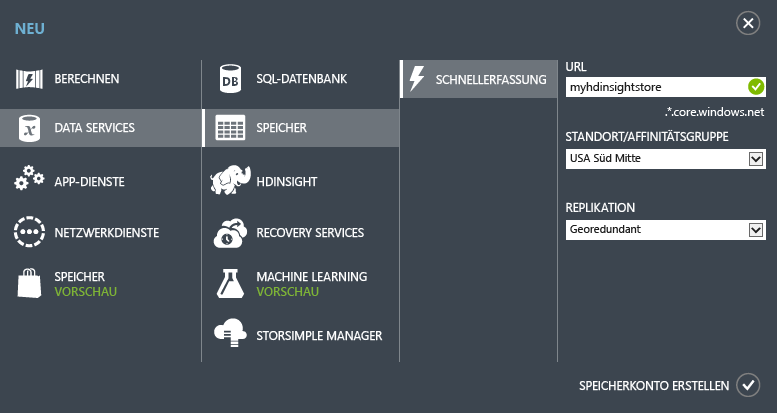

<properties
	pageTitle="Apache Storm-Lernprogramm: Erste Schritte mit Storm | Microsoft Azure"
	description="Erste Schritte mit Big Data-Analysen in HDInsight mit Apache Storm und den Storm-Starter-Beispielen. Erfahren Sie, wie Sie Storm zur Verarbeitung von Daten in Echtzeit verwenden."
	keywords="apache storm,apache storm tutorial,big data analytics,storm starter"
	services="hdinsight"
	documentationCenter=""
	authors="Blackmist"
	manager="paulettm"
	editor="cgronlun"/>

<tags
   ms.service="hdinsight"
   ms.devlang="java"
   ms.topic="get-started-article"
   ms.tgt_pltfrm="na"
   ms.workload="big-data"
   ms.date="07/06/2015"
   ms.author="larryfr"/>

# Apache Storm-Lernprogramm: Erste Schritte mit Storm-Starter-Beispielen für die Big Data-Analyse in HDInsight

Apache Storm ist ein skalierbares, fehlertolerantes, verteiltes Echtzeit-Berechnungssystem für die Verarbeitung von Datenströmen. Mit Storm in Azure HDInsight können Sie einen cloudbasierten Storm-Cluster erstellen, der Big Data-Analysen in Echtzeit durchführt.

## Voraussetzungen

Zur Ausführung dieses Lernprogramms zu Apache Storm benötigen Sie Folgendes:

- **Ein Azure-Abonnement**. Siehe [Kostenlose Azure-Testversion](http://azure.microsoft.com/documentation/videos/get-azure-free-trial-for-testing-hadoop-in-hdinsight/).

## Erstellen eines Azure-Speicherkontos

Storm in HDInsight verwendet Azure-Blobspeicher zum Speichern der an den Cluster übergebenen Protokolldateien und Topologien. Führen Sie zur Erstellung eines Azure-Speicherkontos für Ihren Cluster die folgenden Schritte aus:

1. Melden Sie sich beim [Azure-Portal](http://manage.windowsazure.com/) an.

2. Klicken Sie links unten auf **NEU**, zeigen Sie auf **DATA SERVICES**, auf **SPEICHER**, und klicken Sie anschließend auf **SCHNELLERFASSUNG**.

	

3. Geben Sie **URL**, **SPEICHERORT** und **REPLIKATION** ein, und klicken Sie dann auf **SPEICHERKONTO ERSTELLEN**. Wählen Sie bei der Erstellung des Speichers für HDInsight keine Affinitätsgruppe aus. Sie werden das neue Speicherkonto in der Speicherliste sehen.

	>[AZURE.NOTE]Die Schnellerfassungsoption zur Bereitstellung eines HDInsight-Clusters wie die in diesem Lernprogramm verwendete fordert beim Bereitstellen des Clusters nicht zur Angabe eines Standorts auf. Stattdessen wird der Cluster standardmäßig in demselben Rechenzentrum wie das Speicherkonto bereitgestellt. Stellen Sie daher sicher, dass Sie das Speicherkonto an Standorten erstellen, die den Cluster unterstützen: **Ostasien**, **Südostasien**, **Nordeuropa**, **Westeuropa**, **USA (Osten)**, **USA (Westen)**, **USA (Mitte/Norden)**, **USA (Süden-Mitte)**.

4. Warten Sie, bis sich der **STATUS** des neuen Speicherkontos in **Online** geändert hat.

Weitere Informationen zum Erstellen von Speicherkonten finden Sie unter [Erstellen eines Speicherkontos](../storage/storage-create-storage-account.md).

##Bereitstellen eines Storm-Clusters im Azure-Portal

Beim Bereitstellen eines HDInsight-Clusters werden Azure-Serverressourcen bereitgestellt, die Apache Storm und verwandte Anwendungen enthalten. Mit dem Azure-Portal, den Azure PowerShell-Cmdlets für HDInsight oder dem HDInsight .NET SDK können Sie auch Hadoop-Cluster für andere Versionen erstellen. Anweisungen finden Sie unter [Benutzerdefinierte Bereitstellung eines Hadoop-Clusters in HDInsight][hdinsight-provision]. Informationen zu den verschiedenen HDInsight-Versionen und deren Servicelevel-Vereinbarungen (SLAs) finden Sie auf der Seite [HDInsight-Komponentenversionen](hdinsight-component-versioning.md).

[AZURE.INCLUDE [provisioningnote](../../includes/hdinsight-provisioning.md)]

1. Melden Sie sich beim [Azure-Portal][azureportal] an.

2. Klicken Sie links auf **HDInsight** und anschließend unten links auf **+NEU**.

3. Klicken Sie in der zweiten Spalte auf das HDInsight-Symbol, und wählen Sie **STORM** aus.

	

4. Geben Sie einen eindeutigen Clusternamen und ein eindeutiges Kennwort für das Administratorkonto ein. Wählen Sie unter **STORAGE ACCOUNT** das zuvor erstellte Speicherkonto aus.

	Wählen Sie unter **CLUSTERGRÖSSE** für diesen Cluster die Größe **1 Datenknoten** aus. Dadurch sollen die mit dem Cluster verbundenen Kosten minimiert werden. Für die Verwendung in einer Produktionsumgebung würden Sie einen größeren Cluster erstellen.

	> [AZURE.NOTE]Das Administratorkonto für den Cluster erhält den Namen **admin**. Das eingegebene Kennwort ist das Kennwort für dieses Konto. Sie benötigen diese Informationen zum Ausführen von Aktionen im Cluster, beispielsweise zum Senden oder Verwalten von Storm-Topologien.

5. Wählen Sie schließlich das Häkchen neben **HDINSIGHT-CLUSTER ERSTELLEN** aus, um den Cluster zu erstellen.

> [AZURE.NOTE]Die Bereitstellung eines Clusters mit der Erstellung des Clusters, der Konfiguration der Software und der Installation der Beispieldaten und Topologien nimmt einige Zeit in Anspruch, in der Regel jedoch nicht länger als 15 Minuten.

##Ausführen eines Storm Starter-Beispiels in HDInsight

Dieses Lernprogramm zu Apache Storm führt Sie in die Big Data-Analyse ein. Dazu werden auf GitHub bereitgestellte Storm-Starter-Beispiele verwendet.

Jeder Storm-Cluster in HDInsight enthält das Storm-Dashboard, über das Storm-Topologien im Cluster hochgeladen und ausgeführt werden können. Außerdem stellt jeder Cluster Beispieltopologien bereit, die direkt über das Storm-Dashboard ausgeführt werden können.

###Verbindungsaufbau zum Dashboard

Das Dashboard befindet sich unter **https://&lt;clustername>.azurehdinsight.net//**, wobei **Clustername** der Name des Clusters ist. Auch am Ende der Azure-Portal-Seite Ihres Clusters finden Sie einen Link zum Dashboard.

> [AZURE.NOTE]Beim Verbindungsaufbau zum Dashboard werden Sie zur Eingabe von Benutzername und Kennwort aufgefordert. Sie geben hier den Administratornamen (**admin**) und das Kennwort ein, die Sie bei der Erstellung des Clusters angegeben haben.

Sobald das Storm-Dashboard geladen ist, sehen Sie das Formular **Topologie übermitteln**.

Das Formular **Topologie übermitteln** kann zum Hochladen und Ausführen von JAR-Dateien mit Storm-Topologien verwendet werden. Darüber hinaus enthält es verschiedene einfache Beispiele, die mit dem Cluster bereitgestellt werden.

###Ausführen des Wortanalysebeispiels (WordCount) aus dem Storm-Starter-Projekt auf GitHub

Die mit dem Cluster bereitgestellten Beispiele enthalten mehrere Varianten einer Wortanalysetopologie. Diese Beispiele enthalten einen **Spout**, der nach dem Zufallsprinzip Sätze ausgibt, sowie **Bolts**, die jeden Satz in einzelne Wörter aufteilen und danach zählen, wie oft jedes Wort vorkommt. Diese Beispiele gehören zu den mit Apache Storm bereitgestellten [Storm-Starter-Beispielen](https://github.com/apache/storm/tree/master/examples/storm-starter).

Führen Sie zur Ausführung eines Storm-Starter-Beispiels die folgenden Schritte aus:

1. Wählen Sie aus der Dropdown-Liste **JAR-Datei** die Option **StormStarter – WordCount** aus. Dadurch werden die Felder **Klassenname** und **Zusätzliche Parameter** mit den Parametern dieses Beispiels ausgefüllt.

	

	* **Klassenname** – Die Klasse in der JAR-Datei, durch die die Topologie übermittelt wird.
	* **Zusätzliche Parameter** – Alle von der Topologie benötigten Parameter. In diesem Beispiel wird in diesem Feld ein Anzeigename für die übermittelte Topologie bereitgestellt.

2. Klicken Sie auf die Schaltfläche **Senden**. Nach einer Weile werden im Feld **Ergebnis** der zur Übermittlung des Auftrags verwendete Befehl sowie dessen Ergebnisse angezeigt. Im Feld **Fehler** werden die bei der Übermittlung des Auftrags aufgetretenen Fehler angezeigt.

	

	> [AZURE.NOTE]Die Ergebnisse zeigen keine Beendigung der Topologie an – **Storm-Topologien werden nach dem Start solange ausgeführt, bis sie beendet werden.** Die WordCount-Topologie generiert zufällige Sequenzen und zählt mit, wie oft jedes Wort vorkommt, bis Sie die Topologie beenden.

###Überwachen der Topologie

Die Topologie kann über die Benutzeroberfläche von Apache Storm überwacht werden.

1. Wählen Sie oben im Storm-Dashboard die Option **Storm-UI**. Dadurch werden zusammenfassende Informationen zum Cluster und allen aktiven Topologien angezeigt.

	

	Auf dieser Seite sehen Sie, wie lange die Topologie aktiv war, sowie die Anzahl der verwendeten Worker, Executors und Aufgaben.

	> [AZURE.NOTE]Die Spalte **Name** enthält den zuvor im Feld **Zusätzliche Parameter** angegebenen Anzeigenamen.

4. Klicken Sie unter **Topologiezusammenfassung** in der Spalte **Name** auf den Eintrag **wordcount**. Dadurch werden weitere Informationen zur Topologie angezeigt.

	

	Auf dieser Seite werden die folgenden Informationen angezeigt:

	* **Topologiestatistik** – Grundlegende Informationen zur Leistung der Topologie, aufgeteilt in Zeitfenster.

		> [AZURE.NOTE]Durch die Auswahl eines bestimmten Zeitfensters werden die Informationen in den anderen Abschnitten der Seite entsprechend angepasst.

	* **Spouts** – Grundlegende Informationen zu Spouts, einschließlich des letzten von einem Spout zurückgegebenen Fehlers.

	* **Bolts** – Grundlegende Informationen zu Bolts.

	* **Topologiekonfiguration** – Ausführliche Informationen zur Konfiguration der Topologie.

	Außerdem gibt diese Seite die für die Topologie ausführbaren Aktionen an:

	* **Aktivieren** – Setzt die Verarbeitung einer deaktivierten Topologie fort.

	* **Deaktivieren** – Hält eine aktive Topologie an.

	* **Ausgleichen** – Passt die Parallelität der Topologie an. Sie sollten aktive Topologien ausgleichen, nachdem Sie die Anzahl der Knoten im Cluster geändert haben. Dadurch kann die Topologie die Parallelität anpassen, um die höhere/geringere Anzahl der Knoten im Cluster zu kompensieren. Weitere Informationen finden Sie unter [Understanding the Parallelism of a Storm Topology](http://storm.apache.org/documentation/Understanding-the-parallelism-of-a-Storm-topology.html) (in englischer Sprache).

	* **Beenden** – Beendet eine Storm-Topologie nach dem angegebenen Zeitlimit.

5. Wählen Sie auf dieser Seite einen Eintrag aus dem Abschnitt **Spouts** oder **Bolts** aus. Dadurch werden Informationen zur ausgewählten Komponente angezeigt.

	

	Auf dieser Seite werden die folgenden Informationen angezeigt:

	* **Statistik für Spout/Bolt** – Grundlegende Informationen zur Leistung der Komponente, aufgeteilt in Zeitfenster.

		> [AZURE.NOTE]Durch die Auswahl eines bestimmten Zeitfensters werden die Informationen in den anderen Abschnitten der Seite entsprechend angepasst.

	* **Eingabestatistik** (nur Bolt) – Informationen zu Komponenten, die vom Bold konsumierte Daten generieren.

	* **Ausgabestatistik** – Informationen zu den von diesem Bold ausgegebenen Daten.

	* **Executors** – Informationen zu Instanzen dieser Komponente.

	* **Fehler** – Von dieser Komponente generierte Fehler.

5. Zum Anzeigen der Spout- oder Bolt-Details wählen Sie im Abschnitt **Executors** einen Eintrag aus der Spalte **Port** aus, um die Details einer bestimmten Instanz der Komponente anzuzeigen.

		2015-01-27 14:18:02 b.s.d.task [INFO] Emitting: split default ["with"]
		2015-01-27 14:18:02 b.s.d.task [INFO] Emitting: split default ["nature"]
		2015-01-27 14:18:02 b.s.d.executor [INFO] Processing received message source: split:21, stream: default, id: {}, [snow]
		2015-01-27 14:18:02 b.s.d.task [INFO] Emitting: count default [snow, 747293]
		2015-01-27 14:18:02 b.s.d.executor [INFO] Processing received message source: split:21, stream: default, id: {}, [white]
		2015-01-27 14:18:02 b.s.d.task [INFO] Emitting: count default [white, 747293]
		2015-01-27 14:18:02 b.s.d.executor [INFO] Processing received message source: split:21, stream: default, id: {}, [seven]
		2015-01-27 14:18:02 b.s.d.task [INFO] Emitting: count default [seven, 1493957]

	In diesem Beispiel entnehmen Sie der Spalte, dass das Wort **seven** 1493957mal vorkam. So oft wurde dieses Wort seit dem Start der Topologie erkannt.

###Beenden der Topologie

Kehren Sie zur **Topologiezusammenfassung** der WordCount-Topologie zurück, und klicken Sie im Abschnitt mit den **Topologieaktionen** auf die Schaltfläche **Beenden**. Geben Sie auf Aufforderung für die Verzögerung vor dem Beenden der Topologie 10 (Sekunden) ein. Nach dieser Wartezeit wird die Topologie im Abschnitt **Storm-UI** des Dashboards nicht mehr angezeigt.

##Zusammenfassung

In diesem Lernprogramm zu Apache Storm lernen Sie anhand der Storm-Starter-Beispiele, wie ein Storm-Cluster in HDInsight erstellt wird und wie Storm-Topologien im Storm-Dashboard bereitgestellt, überwacht und verwaltet werden.

##Nächste Schritte

* **HDInsight-Tools für Visual Studio** – Mithilfe der HDInsight-Tools können Sie Visual Studio ähnlich wie das zuvor beschriebene Storm-Dashboard zum Bereitstellen, Überwachen und Verwalten von Storm-Topologien verwenden. Die HDInsight-Tools bieten zudem die Möglichkeit der Erstellung von C#-Storm-Topologien und enthalten Beispieltopologien, die Sie in Ihrem Cluster bereitstellen und ausführen können.

	Weitere Informationen finden Sie unter [Erste Schritte mit HDInsight-Tools für Visual Studio](hdinsight-hadoop-visual-studio-tools-get-started.md).

* **Beispieldateien** – Der HDInsight Storm-Cluster stellt im Verzeichnis **%STORM_HOME%\contrib** verschiedene Beispiele bereit. Jedes Beispiel enthält Folgendes:

	* Quellcode - z. B. storm-starter-0.9.1.2.1.5.0-2057-sources.jar

	* Javadocs - z. B. storm-starter-0.9.1.2.1.5.0-2057-javadoc.jar

	* Das eigentliche Beispiel - z. B. storm-starter-0.9.1.2.1.5.0-2057-jar-with-dependencies.jar

	Verwenden Sie den "jar"-Befehl, um Quellcode oder Javadocs zu extrahieren. Zum Beispiel 'jar -xvf storm-starter-0.9.1.2.1.5.0.2057-javadoc.jar'.

	> [AZURE.NOTE]Javadocs bestehen aus Webseiten. Öffnen Sie nach dem Extrahieren die Datei **index.html** in einem Browser.

	Für den Zugriff auf diese Beispiele müssen Sie für den Storm-Cluster in HDInsight Remotedesktop aktivieren und die Dateien dann aus dem Verzeichnis **%STORM_HOME%\contrib** kopieren.

* Das folgende Dokument enthält eine Liste weiterer Beispiele, die mit Storm in HDInsight verwendet werden können:

	* [Beispiele für Storm-Topologien für Storm in HDInsight](hdinsight-storm-example-topology.md)

[apachestorm]: https://storm.incubator.apache.org
[stormdocs]: http://storm.incubator.apache.org/documentation/Documentation.html
[stormstarter]: https://github.com/apache/storm/tree/master/examples/storm-starter
[stormjavadocs]: https://storm.incubator.apache.org/apidocs/
[azureportal]: https://manage.windowsazure.com/
[hdinsight-provision]: hdinsight-provision-clusters.md

<!---HONumber=July15_HO4-->