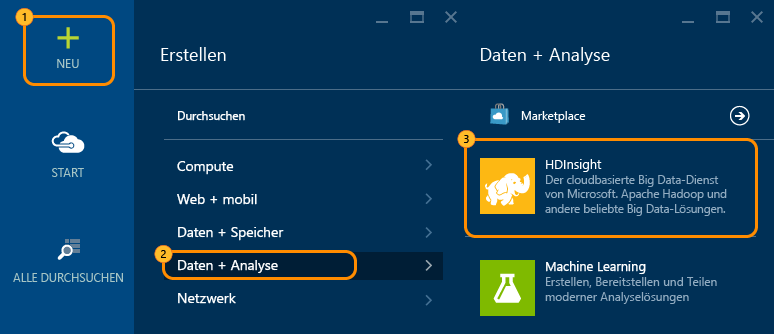
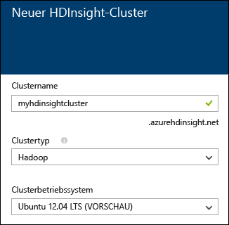
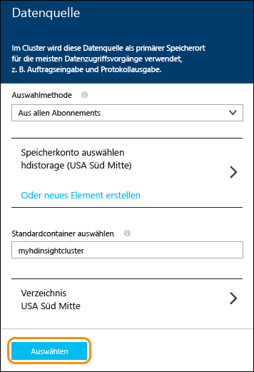
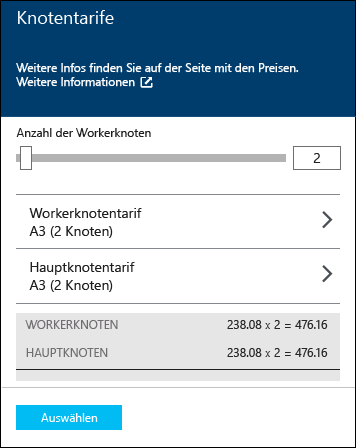
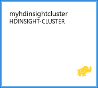

<properties
   	pageTitle="Linux-Lernprogramm: Erste Schritte mit Hadoop und Hive | Microsoft Azure"
   	description="Führen Sie dieses Linux-Lernprogramm aus, um sich mit Hadoop in HDInsight vertraut zu machen. Erfahren Sie, wie Sie Linux-Cluster bereitstellen und Daten mit Hive abfragen."
   	services="hdinsight"
   	documentationCenter=""
   	authors="nitinme"
   	manager="paulettm"
   	editor="cgronlun"
	tags="azure-portal"/>

<tags
   	ms.service="hdinsight"
   	ms.devlang="na"
   	ms.topic="hero-article"
   	ms.tgt_pltfrm="na"
   	ms.workload="big-data"
   	ms.date="01/21/2016"
   	ms.author="nitinme"/>

# Hadoop-Lernprogramm: Erste Schritte bei der Verwendung von Hadoop mit Hive in HDInsight unter Linux

> [AZURE.SELECTOR]
- [Windows](hdinsight-hadoop-tutorial-get-started-windows.md)
- [Linux](hdinsight-hadoop-linux-tutorial-get-started.md)

Anhand der Informationen in diesem Dokument können Sie schnell mit Azure HDInsight unter Linux arbeiten. Sie erfahren, wie Sie einen Linux-basierten Hadoop-Cluster erstellen, die Ambari-Webbenutzeroberfläche öffnen und dann eine Hive-Abfrage mit der Ambari-Hive-Ansicht ausführen.

> [AZURE.NOTE] Wenn Sie noch keine Erfahrung mit Hadoop und Big Data haben, erfahren Sie mehr zu den Begriffen [Apache Hadoop](http://go.microsoft.com/fwlink/?LinkId=510084), [MapReduce](http://go.microsoft.com/fwlink/?LinkId=510086), [Hadoop Distributed File System (HDFS)](http://go.microsoft.com/fwlink/?LinkId=510087) und [Hive](http://go.microsoft.com/fwlink/?LinkId=510085). Wie HDInsight Hadoop in Azure bereitstellt, erfahren Sie unter [Einführung in Hadoop in HDInsight](hdinsight-hadoop-introduction.md).

## Voraussetzungen

Bevor Sie mit diesem Linux-Lernprogramm beginnen können, benötigten Sie Folgendes:

- **Ein Azure-Abonnement**: Siehe [Kostenlose Azure-Testversion](https://azure.microsoft.com/documentation/videos/get-azure-free-trial-for-testing-hadoop-in-hdinsight/).

## Bereitstellen eines HDInsight-Clusters unter Linux

Beim Bereitstellen eines Clusters werden Azure-Compute-Ressourcen erstellt, die Hadoop-Dienste und -Ressourcen enthalten. In diesen Abschnitt stellen Sie einen HDInsight-Cluster der Version 3.2 bereit, der Hadoop-Version 2.2 umfasst. Informationen zu den verschiedenen HDInsight-Versionen und ihren SLAs finden Sie unter [HDInsight-Komponentenversionen](hdinsight-component-versioning.md). Informationen zum Erstellen eines HDInsight-Clusters finden Sie unter [Bereitstellen von Clustern in HDInsight][hdinsight-provision].

>[AZURE.NOTE]  Sie können auch Hadoop-Cluster erstellen, die das Windows Server-Betriebssystem ausführen. Anweisungen hierzu finden Sie unter [Erste Schritte mit HDInsight unter Windows](hdinsight-hadoop-tutorial-get-started-windows.md).

Führen Sie die folgenden Schritte aus, um einen neuen Cluster zu erstellen:

1. Melden Sie sich beim [Azure-Portal](https://ms.portal.azure.com/) an.
2. Klicken Sie auf **NEU**, auf **Datenanalyse** und anschließend auf **HDInsight**.

    

3. Geben Sie einen **Clusternamen** ein, wählen Sie **Hadoop** als **Clustertyp** aus, und wählen Sie in der Dropdownliste **Clusterbetriebssystem** den Eintrag **Ubuntu** aus. Wenn der Clustername verfügbar ist, wird neben dem Namen ein grünes Häkchen angezeigt.

	

4. Falls Sie mehrere Abonnements besitzen, klicken Sie auf den Eintrag **Abonnement**, um das Azure-Abonnement für den Cluster auszuwählen.

5. Klicken Sie auf **Ressourcengruppe**, um eine Liste der vorhandenen Ressourcengruppen anzuzeigen, und wählen Sie dann die Gruppe aus, in der der Cluster erstellt werden soll. Alternativ können Sie eine neue Ressourcengruppe erstellen, indem Sie auf **Neu erstellen** klicken und den Namen der neuen Gruppe eingeben. Wenn der neue Gruppenname verfügbar ist, wird neben dem Namen ein grünes Häkchen angezeigt.

	> [AZURE.NOTE] Dieser Eintrag ist standardmäßig auf eine Ihrer vorhandenen Ressourcengruppen festgelegt (sofern verfügbar).

6. Klicken Sie auf **Anmeldeinformationen**, und geben Sie ein Kennwort für den Administrator ein. Sie müssen außerdem einen **SSH-Benutzernamen** eingeben. Klicken Sie für **SSH-Authentifizierungstyp** auf **KENNWORT**, und geben Sie ein Kennwort für den SSH-Benutzer an. Klicken Sie unten auf **Auswählen**, um die Konfiguration der Anmeldeinformationen zu speichern.

	

    > [AZURE.NOTE] SSH wird verwendet, um remote über eine Befehlszeile auf den HDInsight-Cluster zuzugreifen. Der Benutzername und das Kennwort, die Sie hier verwenden, dienen zum Herstellen der Verbindung mit dem Cluster über SSH.

	Weitere Informationen zur Verwendung von SSH mit HDInsight finden Sie in den folgenden Dokumenten:

	* [Verwenden von SSH mit Linux-basiertem Hadoop in HDInsight unter Linux, Unix oder OS X](hdinsight-hadoop-linux-use-ssh-unix.md)
	* [Verwenden von SSH mit Linux-basiertem Hadoop in HDInsight unter Windows](hdinsight-hadoop-linux-use-ssh-windows.md)

7. Klicken Sie auf **Datenquelle**, um eine vorhandene Datenquelle für den Cluster auszuwählen, oder erstellen Sie eine neue Datenquelle. Bei der Bereitstellung eines Hadoop-Clusters in HDInsight geben Sie ein Azure-Speicherkonto an. Ein bestimmter Blobs-Speicher-Container aus diesem Konto wird genau wie in HDFS (Hadoop Distributed File System) als Standarddateisystem festgelegt. Der HDInsight-Cluster wird standardmäßig in demselben Rechenzentrum bereitgestellt wie das angegebene Speicherkonto. Weitere Informationen finden Sie unter [Verwenden von Azure-Blob-Speicher mit HDInsight](hdinsight-use-blob-storage.md).

	

	Zurzeit kann ein Azure-Speicherkonto als Datenquelle für einen HDInsight-Cluster ausgewählt werden. Die Einträge auf dem Blatt **Datenquelle** werden im Folgenden erläutert.

	- **Auswahlmethode**: Wählen Sie **Aus allen Abonnements** aus, damit Speicherkonten aus all Ihren Abonnements durchsucht werden können. Wählen Sie **Zugriffsschlüssel** aus, wenn Sie den **Speichernamen** und **Zugriffsschlüssel** eines vorhandenen Speicherkontos eingeben möchten.

	- **Speicherkonto auswählen/Neu erstellen**: Klicken Sie auf **Speicherkonto auswählen**, um ein vorhandenes Speicherkonto auszuwählen, das Sie dem Cluster zuordnen möchten. Alternativ können Sie auf **Neu erstellen** klicken, um ein neues Speicherkonto zu erstellen. Geben Sie den Namen des Speicherkontos in das angezeigte Feld ein. Wenn der Name verfügbar ist, wird ein grünes Häkchen angezeigt.

	- **Standardcontainer auswählen**: Geben Sie den Namen des Standardcontainers für den Cluster ein. Sie können einen beliebigen Namen eingeben, es wird jedoch empfohlen, den Namen des Clusters zu verwenden. So können Sie leichter erkennen, dass es sich um den Container für diesen spezifischen Cluster handelt.

	- **Standort**: Die geografische Region, in der sich das Speicherkonto befindet bzw. in der es erstellt wird.

		> [AZURE.IMPORTANT] Durch die Auswahl des Standorts für die Standarddatenquelle wird auch der Standort des HDInsight-Clusters festgelegt. Der Cluster und die Standarddatenquelle müssen sich in der gleichen Region befinden.

	Klicken Sie auf **Auswählen**, um die Datenquellenkonfiguration zu speichern.

8. Klicken Sie auf **Knotenpreistarife**, um Informationen zu den Knoten anzuzeigen, die für diesen Cluster erstellt werden. Legen Sie die Anzahl von Workerknoten fest, die Sie für den Cluster benötigen. Die vorkalkulierten Kosten für den Cluster werden auf dem Blatt angezeigt.

	
    
    > [AZURE.IMPORTANT] Wenn Sie mehr als 32 Workerknoten planen, entweder bei Erstellung des Clusters oder durch eine Skalierung des Clusters nach der Erstellung, müssen Sie eine Hauptknotengröße von mindestens 8 Kernen und 14 GB Arbeitsspeicher (RAM) auswählen.
    >
    > Weitere Informationen zu Knotengrößen und den damit verbundenen Kosten finden Sie unter [HDInsight – Preise](https://azure.microsoft.com/pricing/details/hdinsight/).

	Klicken Sie auf **Auswählen**, um die Konfiguration der Knotenpreise zu speichern.

9. Vergewissern Sie sich auf dem Blatt **Neues HDInsight-Cluster**, dass **An Startmenü anheften** ausgewählt ist, und klicken Sie dann auf **Erstellen**. Der Cluster wird erstellt, und dem Startmenü Ihres Azure-Portals wird eine Kachel für den Cluster hinzugefügt. Das Symbol zeigt an, dass der Cluster bereitgestellt wird. Sobald die Bereitstellung abgeschlossen ist, ändert es sich in das HDInsight-Symbol.

Während der Bereitstellung|Nach Abschluss der Bereitstellung
------------------|---------------------
	|

> [AZURE.NOTE] Die Erstellung des Clusters dauert in der Regel ca. 15 Minuten. Sie können den Status des Bereitstellungsprozesses auf der Kachel im Startmenü oder im linken Bereich der Seite unter **Benachrichtigungen** überprüfen.

Klicken Sie nach Abschluss der Bereitstellung im Startmenü auf die Kachel für den Cluster, um das Clusterblatt zu öffnen.

##Verbinden mit der Hive-Ansicht

Ambari-Ansichten stellen verschiedene Dienstprogramme über eine Webseite bereit. Die Hive-Ansicht verwenden Sie in den folgenden Abschnitten, um Hive-Abfragen in Ihrem HDInsight-Cluster auszuführen.

> [AZURE.NOTE] Ambari ist ein Verwaltungs- und Überwachungsdienstprogramm, das mit Linux-basierten HDInsight-Clustern bereitgestellt wird. Ambari verfügt über viele Funktionen, die in diesem Dokument nicht beschrieben werden. Weitere Informationen finden Sie unter [Verwalten von HDInsight-Clustern mithilfe der Ambari-Webbenutzeroberfläche](hdinsight-hadoop-manage-ambari.md).

Um Ambari-Ansichten im Azure-Portal anzuzeigen, wählen Sie Ihren HDInsight-Cluster aus, und wählen Sie dann im Abschnitt __Quicklinks__ die Option __Ambari-Ansichten__.

Sie können auch direkt zu Ambari navigieren, indem Sie in einem Webbrowser https://CLUSTERNAME.azurehdinsight.net aufrufen (wobei __CLUSTERNAME__ der Name Ihres HDInsight-Clusters ist) und dann den Satz von Quadraten im Seitenmenü auswählen (neben dem __Admin__-Link und der Schaltfläche links auf der Seite), um verfügbare Ansichten aufzulisten. Wählen Sie die __Hive-Ansicht__ aus.

.

> [AZURE.NOTE] Beim Zugriff auf Ambari werden Sie aufgefordert, sich bei der Website zu authentifizieren. Geben Sie den Administratorkontonamen (Standard-`admin`) und das Kennwort ein, den bzw. das Sie beim Erstellen des Clusters verwendet haben.

Eine Seite ähnlich der folgenden wird angezeigt:

##Ausführen einer Hive-Abfrage

Führen Sie in der Hive-Ansicht folgende Schritte aus, um eine Hive-Abfrage an Daten auszuführen, die im Cluster enthalten sind.

1. Fügen Sie im Abschnitt __Abfrage-Editor__ der Seite die folgenden HiveQL-Anweisungen in das Arbeitsblatt ein:

		DROP TABLE log4jLogs;
		CREATE EXTERNAL TABLE log4jLogs(t1 string, t2 string, t3 string, t4 string, t5 string, t6 string, t7 string)
		ROW FORMAT DELIMITED FIELDS TERMINATED BY ' '
		STORED AS TEXTFILE LOCATION 'wasb:///example/data/';
		SELECT t4 AS sev, COUNT(*) AS cnt FROM log4jLogs WHERE t4 = '[ERROR]' GROUP BY t4;

	Diese Anweisungen führen die folgenden Aktionen aus:

	- **DROP TABLE** löscht die Tabelle und Datendatei, falls die Tabelle bereits vorhanden ist.
	- **CREATE EXTERNAL TABLE** erstellt eine neue externe Tabelle in Hive. Externe Tabellen dienen nur zum Speichern der Tabellendefinition in Hive. Die Daten verbleiben am ursprünglichen Speicherort.
	- **ROW FORMAT** teilt Hive mit, wie die Daten formatiert werden sollen. In diesem Fall werden die Felder in den einzelnen Protokollen durch Leerzeichen getrennt.
	- **SPEICHERORT DER TEXTDATEI** – Teilt Hive den Speicherort der Daten (das Verzeichnis "example/data") und die Information mit, dass die Speicherung als Text erfolgt.
	- **AUSWÄHLEN** – Wählt die Anzahl aller Zeilen aus, bei denen die Spalte "t4" den Wert "FEHLER" enthält.

	>[AZURE.NOTE] Wenn erwartet wird, dass die zugrunde liegenden Daten über eine externe Quelle, z. B. einen automatisierten Prozess zum Hochladen von Daten, oder über einen anderen MapReduce-Vorgang aktualisiert, aber von Hive immer die neuesten Daten verwendet werden, sollten externe Tabellen verwendet werden. Durch das Löschen einer externen Tabelle werden *nicht* die Daten, sondern nur die Tabellendefinitionen gelöscht.

2. Starten Sie die Abfrage mit der Schaltfläche __Ausführen__ am unteren Rand des Abfrage-Editors. Deren Farbe sollte zu Orange wechseln, und der Text sollte sich in __Ausführung beenden__ ändern. Der Abschnitt __Abfrageprozessergebnisse__ sollte unterhalb des Abfrage-Editors angezeigt werden und Informationen über den Auftrag enthalten.

    > [AZURE.IMPORTANT] In einigen Browsern werden das Protokoll oder die Ergebnisdaten möglicherweise nicht korrekt aktualisiert. Wenn Sie einen Auftrag ausführen und eine scheinbar endlose Ausführung ohne Aktualisierung des Protokolls oder Rückgabe von Ergebnissen feststellen, sollten Sie es noch einmal mit Mozilla Firefox oder Google Chrome versuchen.
    
3. Nach Abschluss der Abfrage werden im Abschnitt __Abfrageprozessergebnisse__ die Ergebnisse des Vorgangs angezeigt. Die Schaltfläche __Ausführung beenden__ ändert sich auch wieder in die grüne Schaltfläche __Ausführen__. Die Registerkarte __Ergebnisse__ sollte folgende Informationen enthalten:

        sev       cnt
        [ERROR]   3

    Auf der Registerkarte __Protokolle__ können die vom Auftrag erstellten Protokollinformationen angezeigt werden. Sie können sie zur Problembehandlung verwenden, wenn Probleme mit einer Abfrage auftreten.
    
    > [AZURE.TIP] Beachten Sie die Dropdownliste __Ergebnisse speichern__ in der oberen linken Ecke des Abschnitts __Abfrageprozessergebnisse__; hiermit können Sie entweder die Ergebnisse herunterladen oder auf HDInsight-Speicher als CSV-Datei speichern.

3. Wählen Sie die ersten vier Zeilen dieser Abfrage und dann __Ausführen__. Beachten Sie, dass keine Ergebnisse vorliegen, wenn der Auftrag abgeschlossen ist. Der Grund ist, dass die Schaltfläche __Ausführen__, wenn ein Teil der Abfrage ausgewählt ist, nur die ausgewählten Anweisungen ausführt. In diesem Fall enthielt die Auswahl nicht die letzte Anweisung, die Zeilen aus der Tabelle abruft. Wenn Sie nur diese Zeile auswählen und __Ausführen__ verwenden, sollten die erwarteten Ergebnisse angezeigt werden.

3. Verwenden Sie die Schaltfläche __Neues Arbeitsblatt__ am unteren Rand des __Abfrage-Editors__, um ein neues Arbeitsblatt zu erstellen. Geben Sie in das neue Arbeitsblatt die folgenden HiveQL-Anweisungen ein:

		CREATE TABLE IF NOT EXISTS errorLogs (t1 string, t2 string, t3 string, t4 string, t5 string, t6 string, t7 string) STORED AS ORC;
		INSERT OVERWRITE TABLE errorLogs SELECT t1, t2, t3, t4, t5, t6, t7 FROM log4jLogs WHERE t4 = '[ERROR]';

	Diese Anweisungen führen die folgenden Aktionen aus:

	- **TABELLE ERSTELLEN, FALLS NICHT VORHANDEN** – Erstellt eine Tabelle, sofern diese noch nicht vorhanden ist. Da das Schlüsselwort **EXTERN** nicht verwendet wird, ist dies eine "interne" Tabelle, die im Hive-Data Warehouse gespeichert und vollständig von Hive verwaltet wird. Im Gegensatz zu externen Tabellen werden beim Ablegen von internen Tabellen auch die zugrunde liegenden Daten gelöscht.
	- **ALS ORC GESPEICHERT** – Speichert die Daten im ORC-Format (Optimized Row Columnar) Dies ist ein stark optimiertes und effizientes Format zum Speichern von Hive-Daten.
	- **ÜBERSCHREIBEN EINFÜGEN ... AUSWÄHLEN** – Wählt Zeilen in der Tabelle **log4jLogs** aus, die [FEHLER] enthalten, und fügt die Daten dann in die Tabelle **errorLogs** ein.
    
    Verwenden Sie die Schaltfläche __Ausführen__, um diese Abfrage auszuführen. Die Registerkarte __Ergebnisse__ wird keine Informationen enthalten, da diese Abfrage keine Zeilen zurückgibt, aber der Status __ERFOLGREICH__ sollte angezeigt werden.
    
4. Rechts vom Abfrage-Editor befindet sich eine Reihe von Symbolen. Wählen Sie das Symbol aus, das wie eine Kette aussieht.

    
    
    Dies ist die Ansicht __Visuelle Erläuterung__ der Abfrage, die das Verständnis des Ablaufs komplexer Abfragen erleichtern kann. Sie können eine Textentsprechung dieser Ansicht mit der Schaltfläche __Erklären__ im Abfrage-Editor anzeigen.
    
    
    
    Die anderen Symbole haben folgende Zwecke:
    
    * **Einstellungen:** Über das Zahnradsymbol können Sie Hive-Einstellungen wie etwa die Einstellung `hive.execution.engine` oder Tez-Parameter ändern.
    * **Tez:** Zeigt den gerichteten azyklischen Graphen (Directed Acyclic Graph, DAG) an, den Tez zum Ausführen der Abfrage verwendet hat. Wenn Sie den DAG für Abfragen anzeigen möchten, die Sie in der Vergangenheit ausgeführt haben, verwenden Sie stattdessen die __Tez-Ansicht__.
    * **Benachrichtigungen:** Zeigt Benachrichtigungen wie etwa „Abfrage wurde übermittelt.“ oder eine Meldung an, wenn beim Ausführen einer Abfrage ein Fehler auftritt.

5. Wählen Sie das __SQL__-Symbol, um zum Abfrage-Editor zurückzukehren, erstellen Sie dann ein neues Arbeitsblatt, und geben Sie folgende Abfrage ein:

        SELECT * from errorLogs;
    
    Klicken Sie unten im Editor auf die Schaltfläche __Speichern unter__. Geben Sie der Abfrage den Namen __Errorlogs__, und wählen Sie __OK__. Beachten Sie, dass der Name des Arbeitsblatts sich in __Errorlogs__ ändert.
    
    Gespeicherte Abfragen werden auch auf der Registerkarte __Gespeicherte Abfragen__ am oberen Rand der Seite angezeigt. Wählen Sie diese Registerkarte aus. Nun sollte __Errorlogs__ aufgeführt werden. Bei Auswahl des Namens wird die Abfrage im Abfrage-Editor geöffnet.

4. Führen Sie die Abfrage __Errorlogs__ aus. So sehen die Ergebnisse aus:

        errorlogs.t1 	errorlogs.t2 	errorlogs.t3 	errorlogs.t4 	errorlogs.t5 	errorlogs.t6 	errorlogs.t7
        2012-02-03 	18:35:34 	SampleClass0 	[ERROR] 	incorrect 	id 	
        2012-02-03 	18:55:54 	SampleClass1 	[ERROR] 	incorrect 	id 	
        2012-02-03 	19:25:27 	SampleClass4 	[ERROR] 	incorrect 	id

## Nächste Schritte

In diesem Dokument haben Sie erfahren, wie Sie über das Azure-Portal einen Linux-basierten HDInsight-Cluster erstellen, über SSH eine Verbindung mit dem Cluster herstellen, und wie Sie einfache Hive-Abfragen ausführen.

Weitere Informationen zur Datenanalyse mit HDInsight finden Sie in den folgenden Artikeln:

- Weitere Informationen zum Verwenden von Hive mit HDInsight, z. B. zum Ausführen von Hive-Abfragen in Visual Studio, finden Sie im Artikel zum [Verwenden von Hive mit HDInsight][hdinsight-use-hive].

- Informationen zu Pig, einer Sprache zum Transformieren von Daten, finden Sie im Artikel zum [Verwenden von Pig mit HDInsight][hdinsight-use-pig].

- Informationen zu MapReduce, einer Möglichkeit zum Schreiben von Programmen, die Daten in Hadoop verarbeiten, finden Sie im Artikel zu [Verwenden von MapReduce mit HDInsight][hdinsight-use-mapreduce].

- Informationen zur Verwendung der HDInsight-Tools für Visual Studio zum Analysieren von Daten in HDInsight finden Sie unter [Erste Schritte bei der Verwendung von Hadoop-Tools für Visual Studio für HDInsight](hdinsight-hadoop-visual-studio-tools-get-started.md).

Wenn Sie mit eigenen Daten arbeiten und mehr darüber wissen möchten, wie Daten in HDInsight gespeichert werden oder wie HDInsight auf Daten zugreift, finden Sie weitere Informationen in folgenden Artikeln:

- Informationen zur Verwendung von Azure-Blob-Speicher durch HDInsight finden Sie unter [Verwenden von Azure-Blob-Speicher mit HDInsight](hdinsight-use-blob-storage.md).

- Informationen zum Hochladen von Daten in HDInsight finden Sie im Artikel zum [Hochladen von Daten zu HDInsight][hdinsight-upload-data].

Weitere Informationen zum Erstellen und Verwalten von HDInsight-Clustern finden Sie in folgenden Artikeln:

- Informationen zum Verwalten eines Linux-basierten HDInsight-Clusters finden Sie unter [Verwalten von HDInsight-Clustern mit Ambari](hdinsight-hadoop-manage-ambari.md).

- Informationen zu den Optionen, die Sie beim Erstellen eines HDInsight-Clusters auswählen können, finden Sie unter [Benutzerdefinierte Bereitstellung eines Hadoop-Linux-Clusters in HDInsight](hdinsight-hadoop-provision-linux-clusters.md).

- Wenn Sie mit Linux und Hadoop vertraut sind und detaillierte Informationen zu Hadoop in HDInsight benötigen, finden Sie diese unter [Informationen zur Verwendung von HDInsight unter Linux](hdinsight-hadoop-linux-information.md). Dieser Artikel enthält u. a. folgende Informationen:

	* URLs für im Cluster gehostete Dienste, z. B. Ambari und WebHCat
	* Speicherort von Hadoop-Dateien und -Beispielen im lokalen Dateisystem
	* Verwendung von Azure-Speicher (WASB) anstelle von HDFS als Standarddatenspeicher

[1]: ../HDInsight/hdinsight-hadoop-visual-studio-tools-get-started.md

[hdinsight-provision]: hdinsight-provision-clusters.md
[hdinsight-admin-powershell]: hdinsight-administer-use-powershell.md
[hdinsight-upload-data]: hdinsight-upload-data.md
[hdinsight-use-mapreduce]: hdinsight-use-mapreduce.md
[hdinsight-use-hive]: hdinsight-use-hive.md
[hdinsight-use-pig]: hdinsight-use-pig.md

[powershell-download]: http://go.microsoft.com/fwlink/p/?linkid=320376&clcid=0x409
[powershell-install-configure]: ../install-configure-powershell.md
[powershell-open]: ../install-configure-powershell.md#Install

[img-hdi-dashboard]: ./media/hdinsight-hadoop-tutorial-get-started-windows/HDI.dashboard.png
[img-hdi-dashboard-query-select]: ./media/hdinsight-hadoop-tutorial-get-started-windows/HDI.dashboard.query.select.png
[img-hdi-dashboard-query-select-result]: ./media/hdinsight-hadoop-tutorial-get-started-windows/HDI.dashboard.query.select.result.png
[img-hdi-dashboard-query-select-result-output]: ./media/hdinsight-hadoop-tutorial-get-started-windows/HDI.dashboard.query.select.result.output.png
[img-hdi-dashboard-query-browse-output]: ./media/hdinsight-hadoop-tutorial-get-started-windows/HDI.dashboard.query.browse.output.png
[image-hdi-clusterstatus]: ./media/hdinsight-hadoop-tutorial-get-started-windows/HDI.ClusterStatus.png
[image-hdi-gettingstarted-powerquery-importdata]: ./media/hdinsight-hadoop-tutorial-get-started-windows/HDI.GettingStarted.PowerQuery.ImportData.png
[image-hdi-gettingstarted-powerquery-importdata2]: ./media/hdinsight-hadoop-tutorial-get-started-windows/HDI.GettingStarted.PowerQuery.ImportData2.png

<!---HONumber=AcomDC_0128_2016-->