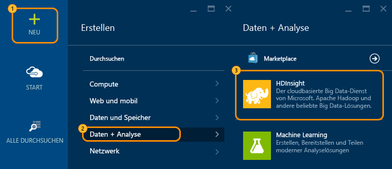
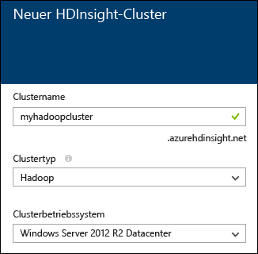
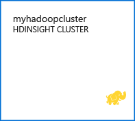
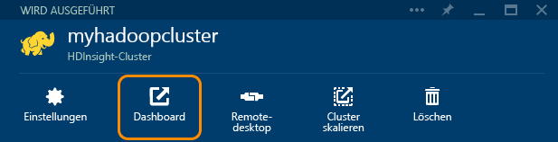

<properties
   pageTitle="Hadoop-Lernprogramm: Erste Schritte mit Hadoop unter Windows | Microsoft Azure"
   description="Erste Schritte mit Hadoop in HDInsight Erfahren Sie, wie Sie Hadoop-Cluster unter Windows erstellen, eine Hive-Abfrage für Daten ausführen und die Ausgabe in Excel analysieren."
   keywords="Hadoop-Tutorial, Hadoop unter Windows, Hadoop-Cluster, Kennenlernen von Hadoop, Hive-Abfrage"
   services="hdinsight"
   documentationCenter=""
   authors="nitinme"
   manager="paulettm"
   editor="cgronlun"
   tags="azure-portal"/>

<tags
   ms.service="hdinsight"
   ms.devlang="na"
   ms.topic="hero-article"
   ms.tgt_pltfrm="na"
   ms.workload="big-data"
   ms.date="02/25/2016"
   ms.author="nitinme"/>

# Hadoop-Tutorial: Erste Schritte bei der Verwendung von Hadoop in HDInsight unter Windows

> [AZURE.SELECTOR]
- [Windows](../hdinsight-hadoop-tutorial-get-started-windows.md)
- [Linux](../hdinsight-hadoop-linux-tutorial-get-started.md)

In diesem Lernprogramm lernen Sie Hadoop unter Windows kennen und unternehmen erste Schritte mit HDInsight. Das Lernprogramm beschreibt, wie Sie eine Hive-Abfrage für unstrukturierte Daten in einem Hadoop-Cluster ausführen und die Ergebnisse anschließend in Microsoft Excel analysieren.

Angenommen, Sie verfügen über einen großen unstrukturierten Datensatz und möchten eine Hive-Abfrage für diesen ausführen, um aussagekräftige Informationen zu extrahieren. Genau darum geht es in diesem Tutorial. Und so geht's:

   ![Hadoop-Tutorial: Erstellen eines Kontos; Erstellen eines Hadoop-Clusters; Senden einer Hive-Abfrage; Analysieren von Daten in Excel.][image-hdi-getstarted-flow]

Sehen Sie sich ein Demovideo dieses Lernprogramms an, um Hadoop in HDInsight kennenzulernen:

![Video eines ersten Hadoop-Lernprogramms: Senden einer Hive-Abfrage an einen Hadoop-Cluster und Analysieren der Ergebnisse in Excel.][img-hdi-getstarted-video]

**[Hadoop-Lernprogramm für HDInsight auf YouTube ansehen](https://www.youtube.com/watch?v=Y4aNjnoeaHA&list=PLDrz-Fkcb9WWdY-Yp6D4fTC1ll_3lU-QS)**

Im Rahmen der generellen Verfügbarkeit von Azure HDInsight hat Microsoft zudem den HDInsight-Emulator für Azure veröffentlicht, der zuvor als *Microsoft HDInsight Developer Preview* bekannt war. Dieser Emulator wurde für Entwicklungsszenarien erstellt und unterstützt nur Umgebungen mit einem Knoten. Informationen zur Verwendung von des HDInsight-Emulators finden Sie unter [Erste Schritte mit dem HDInsight-Emulator][hdinsight-emulator].

### Voraussetzungen

Bevor Sie mit diesem Lernprogramm für Hadoop unter Windows beginnen, benötigten Sie Folgendes:

- **Ein Azure-Abonnement**. Siehe [Kostenlose Azure-Testversion](https://azure.microsoft.com/documentation/videos/get-azure-free-trial-for-testing-hadoop-in-hdinsight/).
- **Einen Computer** mit Office 2013 Professional Plus, Office 365 Pro Plus, Excel 2013 Standalone oder Office 2010 Professional Plus.

##Erstellen von Hadoop-Clusters

Beim Erstellen eines Clusters werden Azure-Computeressourcen erstellt, die Hadoop und verwandte Anwendungen enthalten. In diesem Abschnitt erstellen Sie einen HDInsight-Cluster der Version 3.2. Sie können auch Hadoop-Cluster für andere Versionen erstellen. Anweisungen finden Sie unter [Erstellen von HDInsight-Clustern mithilfe benutzerdefinierter Optionen][hdinsight-provision]. Informationen zu den verschiedenen HDInsight-Versionen und ihren SLAs finden Sie unter [HDInsight-Komponentenversionen](hdinsight-component-versioning.md).

**So erstellen Sie einen Hadoop-Cluster**

1. Melden Sie sich beim [Azure-Portal](https://ms.portal.azure.com/) an.
2. Klicken Sie auf **NEU**, auf **Datenanalyse** und anschließend auf **HDInsight**. Das Portal öffnet ein Blatt **Neuer HDInsight-Cluster**.

    

3. Geben Sie folgende Werte ein, bzw. wählen Sie diese aus:

	
	
	|Feldname| Wert|
	|----------|------|
	|Clustername| Ein eindeutiger Name zum Identifizieren des Clusters|
	|Clustertyp| Wählen Sie **Hadoop** für dieses Tutorial. |
	|Clusterbetriebssystem| Wählen Sie **Windows Server 2012 R2 Datacenter** für dieses Tutorial.|
	|HDInsight-Version| Wählen Sie die neueste Version dieses Tutorials.|
	|Abonnement| Wählen Sie das Azure-Abonnement aus, das für den Cluster verwendet werden soll.|
	|Ressourcengruppe | Wählen Sie eine vorhandene Azure-Ressourcengruppe aus, oder erstellen Sie eine neue Ressourcengruppe. Ein grundlegender HDInsight-Cluster enthält einen Cluster und dessen Standardspeicherkonto. Sie können die beiden in einer Ressourcengruppe gruppieren, um die Verwaltung zu vereinfachen.|
	|Anmeldeinformationen| Geben Sie den Anmeldebenutzernamen und das Kennwort für den Cluster ein. Windows-basierte Cluster können über 2 Benutzerkonten verfügen. Der Clusterbenutzer (oder HTTP-Benutzer) wird verwendet, um den Cluster zu verwalten und Aufträge zu übermitteln. Optional können Sie ein Remotedesktop-Benutzerkonto (RDP) erstellen, um eine Remoteverbindung mit dem Cluster herzustellen. Wenn Sie den Remotedesktop aktivieren möchten, erstellen Sie das RDP-Benutzerkonto.|
	|Datenquelle| Klicken Sie auf "Neu erstellen", um ein neues standardmäßiges Speicherkonto zu erstellen. Verwenden Sie den Clusternamen als standardmäßigen Containernamen. Jeder HDinsight-Cluster besitzt einen Standardblobcontainer auf einem Azure-Speicherkonto. Der Speicherort für das standardmäßige Azure-Speicherkonto bestimmt den Speicherort des HDInsight-Clusters.|
	|Knotentarife| Verwenden Sie für dieses Tutorial einen oder zwei Workerknoten mit dem Standardtarif für Workerknoten und Hauptknoten.|
	|Optionale Konfiguration| Überspringen Sie diesen Teil.|

9. Vergewissern Sie sich auf dem Blatt **Neues HDInsight-Cluster**, dass **An Startmenü anheften** ausgewählt ist, und klicken Sie dann auf **Erstellen**. Der Cluster wird erstellt, und dem Startmenü Ihres Azure-Portals wird eine Kachel für den Cluster hinzugefügt. Das Symbol zeigt an, dass der Cluster erstellt wird. Sobald die Erstellung abgeschlossen ist, ändert es sich in das HDInsight-Symbol.

	| Während der Erstellung | Erstellung abgeschlossen |
	| ------------------ | --------------------- |
	|  |  |

	> [AZURE.NOTE] Die Erstellung des Clusters dauert in der Regel ca. 15 Minuten. Sie können den Status des Erstellungsprozesses auf der Kachel im Startmenü oder im linken Bereich der Seite unter **Benachrichtigungen** überprüfen.

10. Klicken Sie nach Abschluss der Erstellung im Startmenü auf die Kachel für den Cluster, um das Clusterblatt zu öffnen.

## Ausführen einer Hive-Abfrage im Portal
Nachdem Sie nun einen HDInsight-Cluster erstellt haben, ist der nächste Schritt die Ausführung eines Hive-Auftrags zum Abfragen einer Hive-Beispieltabelle. Wir verwenden die Tabelle *hivesampletable*, die zu HDInsight-Clustern gehört. Die Tabelle enthält Daten zu Mobilgeräteherstellern, -plattformen und -modellen. Eine Hive-Abfrage für diese Tabelle ruft Daten für Mobilgeräte eines bestimmten Herstellers ab.

> [AZURE.NOTE] HDInsight Tools für Visual Studio ist Bestandteil des Azure SDK für .NET Version 2.5 oder höher. Mithilfe der Tools von Visual Studio können Sie Verbindungen zu HDInsight-Clustern herstellen, Hive-Tabellen erstellen und Hive-Abfragen ausführen. Weitere Informationen finden Sie unter [Erste Schritte mit den HDInsight Hadoop-Tools für Visual Studio][1].

**So führen Sie einen Hive-Job über das Clusterdashboard aus**

1. Melden Sie sich beim [Azure-Portal](https://ms.portal.azure.com/) an.
2. Klicken Sie auf **ALLE DURCHSUCHEN** und dann auf **HDInsight-Cluster**, um eine Liste der Cluster, einschließlich des im vorherigen Abschnitt erstellten Clusters, anzuzeigen.
3. Klicken Sie auf den Namen des Clusters, in dem Sie den Hive-Auftrag ausführen möchten, und klicken Sie anschließend oben auf dem Blatt auf **Dashboard**.
4. Eine Webseite wird in einer anderen Browserregisterkarte geöffnet. Geben Sie das Hadoop-Benutzerkonto und das zugehörige Kennwort ein. Der Standardbenutzername ist **admin**, und das Kennwort haben Sie bei der Erstellung des Clusters angegeben.
5. Klicken Sie im Dashboard auf die Registerkarte **Hive-Editor**. Die folgende Webseite wird geöffnet.

	![Registerkarte "Hive-Editor" im HDInsight-Clusterdashboard.][img-hdi-dashboard]

	Am oberen Rand der Seite befinden sich mehrere Registerkarten. Die Standardregisterkarte ist **Hive-Editor**, die anderen Registerkarten heißen **Auftragsverlauf** und **Dateibrowser**. Mithilfe des Dashboards können Sie Hive-Abfragen senden, Protokolle von Hadoop-Aufträgen überprüfen und Dateien im Speicher durchsuchen.

	> [AZURE.NOTE] Beachten Sie, dass die URL der Webseite *&lt;ClusterName&gt;.azurehdinsight.net* lautet. Anstatt über das Portal können Sie das Dashboard also auch unter Angabe der URL in einem Webbrowser öffnen.

6. Geben Sie auf der Registerkarte **Hive-Editor** in das Feld **Abfragename** den Text **HTC20** ein. Der Abfragename ist gleichzeitig auch der Auftragstitel. Geben Sie im Abfragebereich die Hive-Abfrage wie in der Abbildung dargestellt ein:

	![Im Abfragebereich des Hive-Editors eingegebene Hive-Abfrage.][img-hdi-dashboard-query-select]

4. Klicken Sie auf **Senden**. Die Ausgabe der Ergebnisse dauert einen Moment. Der Bildschirm wird alle 30 Sekunden aktualisiert. Sie können auch auf **Aktualisieren** klicken.

    ![Ergebnisse einer Hive-Abfrage werden am unteren Rand des Clusterdashboards aufgeführt.][img-hdi-dashboard-query-select-result]

5. Nachdem angezeigt wurde, dass der Auftrag abgeschlossen ist, klicken Sie auf den Abfragenamen auf dem Bildschirm, um die Ausgabe anzuzeigen. Notieren Sie sich die **Job-Startzeit (UTC)**. Sie benötigen sie später.

    ![Auf der Registerkarte "Auftragsverlauf" des HDInsight-Clusterdashboards aufgeführte Auftragsstartzeit.][img-hdi-dashboard-query-select-result-output]

    Diese Seite enthält außerdem die **Job-Ausgabe** und das **Job-Protokoll**. Außerdem haben Sie die Möglichkeit, die Ausgabedatei (\_stdout) und die Protokolldatei (\_stderr) herunterzuladen.

**So navigieren Sie zur Ausgabedatei**

1. Klicken Sie oben im Clusterdashboard auf **Dateibrowser**.
2. Klicken Sie auf den Namen Ihres Speicherkontos, auf den Namen des Containers (identisch mit dem Clusternamen) und dann auf **Benutzer**.
3. Klicken Sie auf **admin** und dann auf die GUID, deren Uhrzeit der letzten Änderung kurz nach der zuvor notierten Startzeit des Auftrags liegt. Kopieren Sie diese GUID. Sie benötigen sie im nächsten Abschnitt.

   	![Auf der Registerkarte "Dateibrowser" aufgeführte Ausgabedatei-GUID der Hive-Abfrage.][img-hdi-dashboard-query-browse-output]

##Verbinden mit Microsoft Business Intelligence-Tools für Excel

Mit dem Power Query-Add-in für Microsoft Excel können Sie die Auftragsausgabe von HDInsight in Excel importieren. Dort können Sie die Ergebnisse mithilfe der Microsoft Business Intelligence (BI)-Tools weiter analysieren.

Sie benötigen Excel 2013 oder 2010, um diesen Teil des Lernprogramms durchführen zu können.

**So laden Sie Microsoft Power Query für Excel herunter**

- Laden Sie Microsoft Power Query für Microsoft Excel aus dem [Microsoft Download Center](http://www.microsoft.com/download/details.aspx?id=39379) herunter, und installieren Sie es.

**So importieren Sie HDInsight-Daten**

1. Öffnen Sie Excel, und erstellen Sie eine neue Arbeitsmappe.
3. Klicken Sie auf das Menü **Power Query**, klicken Sie auf **Von anderen Quellen**, und klicken Sie dann auf **Von Azure HDInsight**.

	![Für Azure HDInsight geöffnetes Menü "Excel PowerQuery importieren".][image-hdi-gettingstarted-powerquery-importdata]

3. Geben Sie den **Kontonamen** des mit Ihrem Cluster verbundenen Azure-Blob-Speicherkontos ein, und klicken Sie dann auf **OK**. (Dies ist das Speicherkonto, das Sie zu Beginn des Lernprogramms erstellt haben.)
4. Geben Sie den **Kontoschlüssel** für das Azure-Blob-Speicherkonto ein, und klicken Sie dann auf **Speichern**.
5. Doppelklicken Sie im rechten Bereich auf den Blobnamen. Standardmäßig entspricht der Blobname dem Namen des Clusters.

6. Suchen Sie **stdou** in der Spalte **Name**. Prüfen Sie, ob die GUID in der entsprechenden Spalte **Ordnerpfad** mit der GUID übereinstimmt, die Sie zuvor kopiert haben. Eine Übereinstimmung deutet darauf hin, dass die Ausgabedaten zu dem von Ihnen übermittelten Job gehören. Klicken Sie in der linken Spalte von **stdout** auf **Binary**.

	![Suchen der Datenausgabe nach GUID in der Liste der Inhalte.][image-hdi-gettingstarted-powerquery-importdata2]

9. Klicken Sie in der oberen linken Ecke auf **Schließen und laden**, um die Ausgabe des Hive-Auftrags in Excel zu importieren.

##Ausführen von Beispielen

Der HDInsight-Cluster stellt eine Abfragekonsole mit einem Katalog für den Einstieg bereit, damit Beispiele direkt im Portal ausgeführt werden können. Mit diesen Beispielen können Sie das Arbeiten mit HDInsight erlernen, indem Sie einige einfache Szenarien durcharbeiten. Die Beispiele enthalten alle benötigten Komponenten wie z. B. die zu analysierenden Daten und die entsprechenden Abfragen für die Daten. Um weitere Informationen zu den Beispielen im Katalog für den Einstieg zu erhalten, lesen Sie [Erlernen von Hadoop in HDInsight mithilfe des HDInsight-Katalogs für den Einstieg](hdinsight-learn-hadoop-use-sample-gallery.md).

**So führen Sie das Beispiel aus**

1. Klicken Sie im Startmenü des Azure-Portals auf die Kachel des Clusters, den Sie soeben erstellt haben.
 
2. Klicken Sie auf dem Blatt für den neuen Cluster auf **Dashboard**. Geben Sie bei entsprechender Aufforderung den Benutzernamen und das Kennwort des Administrators für den Cluster ein.

	
 
3. Klicken Sie auf der Webseite, die sich daraufhin öffnet, auf die Registerkarte **Galerie für erste Schritte** und anschließend in der Kategorie **Lösungen mit Beispieldaten** auf das Beispiel, das Sie ausführen möchten. Folgen Sie den Anweisungen auf der Webseite, um das Beispiel abzuschließen. In der folgende Tabelle sind einige Beispiele aufgeführt und weitere Informationen zur Funktion jedes Beispiels enthalten.

Beispiel | Behandelte Themen
------ | ---------------
[Analysieren von Sensordaten][hdinsight-sensor-data-sample] | Erfahren Sie, wie Sie Verlaufsdaten von Klimaanlagen mithilfe von HDInsight verarbeiten können, um herauszufinden, welche Anlagen nicht in der Lage sind, eine eingestellte Temperatur zu halten.
[Analysieren von Websiteprotokollen][hdinsight-weblogs-sample] | Erfahren Sie, wie Sie Websiteprotokolle mithilfe von HDInsight analysieren können, um Einblicke in die Häufigkeit von Besuchen pro Tag von externen Webseiten sowie eine Zusammenfassung von Websitefehlern zu erhalten, die den Benutzern angezeigt werden.
[Twitter-Trendanalyse](hdinsight-analyze-twitter-data.md) | Erfahren Sie, wie Sie HDInsight verwenden, um Trends in Twitter zu analysieren.

##Nächste Schritte
In diesem Hadoop-Tutorial haben Sie erfahren, wie ein Hadoop-Cluster unter Windows in HDInsight erstellt wird, eine Hive-Abfrage für Daten ausgeführt wird und die Ergebnisse in Excel importiert werden, wo sie mit Business Intelligence-Tools weiter bearbeitet und grafisch angezeigt werden können. Weitere Informationen finden Sie in den folgenden Lernprogrammen:

- [Erste Schritte mit den HDInsight Hadoop-Tools für Visual Studio][1]
- [Erste Schritte mit dem HDInsight-Emulator][hdinsight-emulator]
- [Verwenden von Azure-Blobspeicher mit HDInsight][hdinsight-storage]
- [Verwalten von HDInsight mit PowerShell][hdinsight-admin-powershell]
- [Hochladen von Daten in HDInsight][hdinsight-upload-data]
- [Verwenden von MapReduce mit HDInsight][hdinsight-use-mapreduce]
- [Verwenden von Hive mit HDInsight][hdinsight-use-hive]
- [Verwenden von Pig mit HDInsight][hdinsight-use-pig]
- [Verwenden von Oozie mit HDInsight][hdinsight-use-oozie]
- [Entwickeln von C#-Hadoop-Streamingprogrammen für HDInsight][hdinsight-develop-streaming]
- [Entwickeln von Java MapReduce-Programmen für HDInsight][hdinsight-develop-mapreduce]

[1]: ../HDInsight/hdinsight-hadoop-visual-studio-tools-get-started.md

[hdinsight-versions]: hdinsight-component-versioning.md

[hdinsight-provision]: hdinsight-provision-clusters.md
[hdinsight-admin-powershell]: hdinsight-administer-use-powershell.md
[hdinsight-upload-data]: hdinsight-upload-data.md
[hdinsight-use-mapreduce]: hdinsight-use-mapreduce.md
[hdinsight-use-hive]: hdinsight-use-hive.md
[hdinsight-use-pig]: hdinsight-use-pig.md
[hdinsight-use-oozie]: hdinsight-use-oozie.md
[hdinsight-storage]: hdinsight-hadoop-use-blob-storage.md
[hdinsight-emulator]: hdinsight-hadoop-emulator-get-started.md
[hdinsight-develop-streaming]: hdinsight-hadoop-develop-deploy-streaming-jobs.md
[hdinsight-develop-mapreduce]: hdinsight-develop-deploy-java-mapreduce.md
[hadoop-hdinsight-intro]: hdinsight-hadoop-introduction.md
[hdinsight-weblogs-sample]: hdinsight-hive-analyze-website-log.md
[hdinsight-sensor-data-sample]: hdinsight-hive-analyze-sensor-data.md

[azure-purchase-options]: http://azure.microsoft.com/pricing/purchase-options/
[azure-member-offers]: http://azure.microsoft.com/pricing/member-offers/
[azure-free-trial]: http://azure.microsoft.com/pricing/free-trial/
[azure-management-portal]: https://ms.portal.azure.com/
[azure-create-storageaccount]: ../storage-create-storage-account.md

[apache-hadoop]: http://go.microsoft.com/fwlink/?LinkId=510084
[apache-hive]: http://go.microsoft.com/fwlink/?LinkId=510085
[apache-mapreduce]: http://go.microsoft.com/fwlink/?LinkId=510086
[apache-hdfs]: http://go.microsoft.com/fwlink/?LinkId=510087
[hdinsight-hbase-custom-provision]: hdinsight-hbase-tutorial-get-started.md

[powershell-download]: http://go.microsoft.com/fwlink/p/?linkid=320376&clcid=0x409
[powershell-install-configure]: powershell-install-configure.md
[powershell-open]: powershell-install-configure.md#step-1-install

[img-hdi-dashboard]: ./media/hdinsight-hadoop-tutorial-get-started-windows/HDI.dashboard.png
[img-hdi-dashboard-query-select]: ./media/hdinsight-hadoop-tutorial-get-started-windows/HDI.dashboard.query.select.png
[img-hdi-dashboard-query-select-result]: ./media/hdinsight-hadoop-tutorial-get-started-windows/HDI.dashboard.query.select.result.png
[img-hdi-dashboard-query-select-result-output]: ./media/hdinsight-hadoop-tutorial-get-started-windows/HDI.dashboard.query.select.result.output.png
[img-hdi-dashboard-query-browse-output]: ./media/hdinsight-hadoop-tutorial-get-started-windows/HDI.dashboard.query.browse.output.png

[img-hdi-getstarted-video]: ./media/hdinsight-hadoop-tutorial-get-started-windows/hdi-get-started-video.png

[image-hdi-storageaccount-quickcreate]: ./media/hdinsight-hadoop-tutorial-get-started-windows/HDI.StorageAccount.QuickCreate.png
[image-hdi-clusterstatus]: ./media/hdinsight-hadoop-tutorial-get-started-windows/HDI.ClusterStatus.png
[image-hdi-quickcreatecluster]: ./media/hdinsight-hadoop-tutorial-get-started-windows/HDI.QuickCreateCluster.png
[image-hdi-getstarted-flow]: ./media/hdinsight-hadoop-tutorial-get-started-windows/HDI.GetStartedFlow.png

[image-hdi-gettingstarted-powerquery-importdata]: ./media/hdinsight-hadoop-tutorial-get-started-windows/HDI.GettingStarted.PowerQuery.ImportData.png
[image-hdi-gettingstarted-powerquery-importdata2]: ./media/hdinsight-hadoop-tutorial-get-started-windows/HDI.GettingStarted.PowerQuery.ImportData2.png
 

<!----HONumber=AcomDC_0302_2016-->