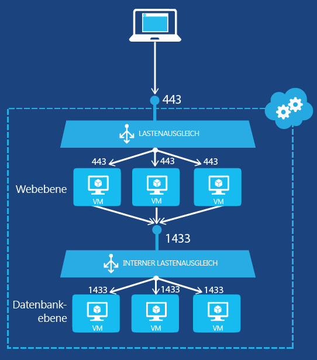

<properties 
   pageTitle="Erstellen eines internen Load Balancers im klassischen Bereitstellungsmodell mithilfe von PowerShell | Microsoft Azure"
   description="Hier erfahren Sie, wie Sie mithilfe von PowerShell einen internen Load Balancer im klassischen Bereitstellungsmodell erstellen."
   services="load-balancer"
   documentationCenter="na"
   authors="joaoma"
   manager="carolz"
   editor=""
   tags="azure-service-management"
/>
<tags  
   ms.service="load-balancer"
   ms.devlang="na"
   ms.topic="article"
   ms.tgt_pltfrm="na"
   ms.workload="infrastructure-services"
   ms.date="02/09/2016"
   ms.author="joaoma" />

# Erste Schritte zum Erstellen eines internen Load Balancers (klassisch) mithilfe von PowerShell

[AZURE.INCLUDE [load-balancer-get-started-ilb-classic-selectors-include.md](../../includes/load-balancer-get-started-ilb-classic-selectors-include.md)]

[AZURE.INCLUDE [load-balancer-get-started-ilb-intro-include.md](../../includes/load-balancer-get-started-ilb-intro-include.md)]

[AZURE.INCLUDE [azure-arm-classic-important-include](../../includes/learn-about-deployment-models-classic-include.md)] [Resource Manager model](load-balancer-get-started-ilb-arm-ps.md).

[AZURE.INCLUDE [load-balancer-get-started-ilb-scenario-include.md](../../includes/load-balancer-get-started-ilb-scenario-include.md)]

[AZURE.INCLUDE [azure-ps-prerequisites-include.md](../../includes/azure-ps-prerequisites-include.md)]

## Erstellen einer internen Load Balancer-Gruppe für virtuelle Computer

Zum Erstellen einer internen Load Balancer-Gruppe und der Server, die den Datenverkehr an diese Gruppe senden, müssen Sie Folgendes ausführen:

1. Erstellen Sie eine ILB-Instanz, die als Endpunkt für den eingehenden Datenverkehr dient, für den Lastenausgleich zwischen den Servern einer Lastenausgleichsgruppe durchgeführt wird.

1. Fügen Sie Endpunkte für die virtuellen Computer hinzu, die den eingehenden Datenverkehr empfangen.

1. Konfigurieren Sie die Server, die den Datenverkehr für den Lastenausgleich senden, so, dass der Datenverkehr an die virtuelle IP-Adresse (VIP) der ILB-Instanz gesendet wird.

### Schritt 1: Erstellen einer ILB-Instanz

Für einen vorhandenen Clouddienst oder einen Clouddienst, der in einem regionalen virtuellen Netzwerk bereitgestellt wird, können Sie eine ILB-Instanz mit den folgenden Windows PowerShell-Befehlen erstellen:

	$svc="<Cloud Service Name>"
	$ilb="<Name of your ILB instance>"
	$subnet="<Name of the subnet within your virtual network>"
	$IP="<The IPv4 address to use on the subnet-optional>"

	Add-AzureInternalLoadBalancer -ServiceName $svc -InternalLoadBalancerName $ilb –SubnetName $subnet –StaticVNetIPAddress $IP

Beachten Sie, dass bei dieser Verwendung des Windows PowerShell-Cmdlets [Add-AzureEndpoint](https://msdn.microsoft.com/library/dn495300.aspx) der DefaultProbe-Parametersatz verwendet wird. Weitere Informationen zu zusätzlichen Parametersätzen finden Sie unter [Add-AzureEndpoint](https://msdn.microsoft.com/library/dn495300.aspx).

### Schritt 2: Hinzufügen von Endpunkten zur ILB-Instanz

Beispiel:

	$svc="mytestcloud"
	$vmname="DB1"
	$epname="TCP-1433-1433"
	$lbsetname="lbset"
	$prot="tcp"
	$locport=1433
	$pubport=1433
	$ilb="ilbset"
	Get-AzureVM –ServiceName $svc –Name $vmname | Add-AzureEndpoint -Name $epname -Lbset $lbsetname -Protocol $prot -LocalPort $locport -PublicPort $pubport –DefaultProbe -InternalLoadBalancerName $ilb | Update-AzureVM

### Schritt 3: Konfigurieren der Server zum Senden von Datenverkehr an den neuen ILB-Endpunkt

Sie müssen die Server, für deren Datenverkehr Lastenausgleich ausgeführt werden soll, für die Verwendung der neuen IP-Adresse (VIP) der ILB-Instanz konfigurieren. Dies ist die Adresse, an der die ILB-Instanz lauscht. In den meisten Fällen müssen Sie nur einen DNS-Eintrag für die VIP der ILB-Instanz hinzufügen oder ändern.

Wenn Sie die IP-Adresse während der Erstellung der ILB-Instanz angegeben haben, verfügen Sie bereits über die VIP-Adresse. Andernfalls können Sie die VIP-Adresse mithilfe der folgenden Befehle anzeigen:

	$svc="<Cloud Service Name>"
	Get-AzureService -ServiceName $svc | Get-AzureInternalLoadBalancer

Um diese Befehle zu verwenden, geben Sie die Werte ein und entfernen die Symbole < and >. Beispiel:

	$svc="mytestcloud"
	Get-AzureService -ServiceName $svc | Get-AzureInternalLoadBalancer

Notieren Sie aus der Anzeige des Befehls "Get-AzureInternalLoadBalancer" die IP-Adresse, und nehmen Sie die erforderlichen Änderungen an Ihren Servern oder DNS-Datensätzen vor, um sicherzustellen, dass der Datenverkehr an die VIP-Adresse gesendet wird.

>[AZURE.NOTE] Die Microsoft Azure-Plattform nutzt eine statische, öffenlich routingfähige IPv4-Adresse für eine Vielzahl von administrativen Szenarien. Die IP-Adresse lautet 168.63.129.16. Diese IP-Adresse sollte nicht durch Firewalls blockiert werden, da dies zu unerwartetem Verhalten führen kann. In Bezug auf den internen Lastenausgleich in Azure wird diese IP-Adresse von Überwachungstests aus dem Lastenausgleich verwendet, um den Integritätsstatus von virtuellen Computern in einer Lastenausgleichsgruppe zu bestimmen. Wenn eine Netzwerksicherheitsgruppe verwendet wird, um den Datenverkehr auf virtuellen Azure-Computern in einer internen Lastenausgleichsgruppe einzuschränken, oder wenn eine Netzwerksicherheitsgruppe einem Subnetz eines virtuellen Netzwerks zugewiesen ist, stellen Sie sicher, dass eine Netzwerksicherheitsregel hinzugefügt wird, um Datenverkehr von 168.63.129.16 zuzulassen.

## Beispiel des internen Lastenausgleichs

Schrittweise Anleitungen für die End-to-End-Prozesse zum Erstellen eines Lastenausgleichs für zwei Beispielkonfigurationen finden Sie in den folgenden Abschnitten.

### Anwendung mit mehreren Ebenen mit Internetanbindung

Sie möchten einen Datenbankdienst mit Lastenausgleich für eine Gruppe von Webservern mit Internetanbindung bereitstellen. Beide Gruppen von Servern werden in einem einzelnen Azure-Clouddienst gehostet. Webserver-Datenverkehr an TCP-Port 1433 muss zwischen zwei virtuellen Computern auf Datenbankebene verteilt werden. Diese Konfiguration wird in Abbildung 1 gezeigt.

Die Konfiguration umfasst Folgendes:

- Der vorhandene Clouddienst, der die virtuellen Computer hostet, heißt „mytestcloud“.

- Die beiden vorhandenen Datenbankserver heißen „DB1“, „DB2“.

- Webserver auf Webebene stellen über die private IP-Adresse eine Verbindung mit dem Datenbankserver auf Datenbankebene her. Eine weitere Option ist die Verwendung Ihres eigenen DNS-Servers für das virtuelle Netzwerk und die manuelle Registrierung eines A-Datensatzes für die interne Load Balancer-Gruppe.

Die folgenden Befehle konfigurieren eine neue ILB-Instanz mit dem Namen **ILBset** und fügen Endpunkte für die virtuellen Computer hinzu, die den zwei Datenbankservern entsprechen:

	$svc="mytestcloud"
	$ilb="ilbset"
	Add-AzureInternalLoadBalancer -ServiceName $svc -InternalLoadBalancerName $ilb 
	$prot="tcp"
	$locport=1433
	$pubport=1433
	$epname="TCP-1433-1433"
	$lbsetname="lbset"
	$vmname="DB1"
	Get-AzureVM –ServiceName $svc –Name $vmname | Add-AzureEndpoint -Name $epname -LbSetName $lbsetname -Protocol $prot -LocalPort $locport -PublicPort $pubport –DefaultProbe -InternalLoadBalancerName $ilb | Update-AzureVM

	$epname="TCP-1433-1433-2"
	$vmname="DB2"
	Get-AzureVM –ServiceName $svc –Name $vmname | Add-AzureEndpoint -Name $epname -LbSetName $lbsetname -Protocol $prot -LocalPort $locport -PublicPort $pubport –DefaultProbe -InternalLoadBalancerName $ilb | Update-AzureVM

## Entfernen einer ILB-Konfiguration

Um einen virtuellen Computer als Endpunkt aus einer internen Load Balancer-Instanz zu entfernen, verwenden Sie die folgenden Befehle:

	$svc="<Cloud service name>"
	$vmname="<Name of the VM>"
	$epname="<Name of the endpoint>"
	Get-AzureVM -ServiceName $svc -Name $vmname | Remove-AzureEndpoint -Name $epname | Update-AzureVM

Um diese Befehle zu verwenden, geben Sie die Werte ein und entfernen die Symbole < and >.

Beispiel:

	$svc="mytestcloud"
	$vmname="DB1"
	$epname="TCP-1433-1433"
	Get-AzureVM -ServiceName $svc -Name $vmname | Remove-AzureEndpoint -Name $epname | Update-AzureVM

Um eine interne Load Balancer-Instanz aus einem Clouddienst zu entfernen, verwenden Sie die folgenden Befehle:

	$svc="<Cloud service name>"
	Remove-AzureInternalLoadBalancer -ServiceName $svc

Um diese Befehle zu verwenden, geben Sie den Wert ein und entfernen die Symbole < and >.

Beispiel:

	$svc="mytestcloud"
	Remove-AzureInternalLoadBalancer -ServiceName $svc

## Weitere Informationen zu Cmdlets für den internen Load Balancer

Um weitere Informationen zu ILB-Cmdlets zu erhalten, führen Sie die folgenden Befehle an einer Windows PowerShell-Eingabeaufforderung aus:

- Get-help New-AzureInternalLoadBalancerConfig -full

- Get-help Add-AzureInternalLoadBalancer -full

- Get-help Get-AzureInternalLoadbalancer -full

- Get-help Remove-AzureInternalLoadBalancer -full

## Nächste Schritte

[Konfigurieren eines Load Balancer-Verteilungsmodus mithilfe der Quell-IP-Affinität](load-balancer-distribution-mode.md)

[Konfigurieren von TCP-Leerlauftimeout-Einstellungen für den Lastenausgleich](load-balancer-tcp-idle-timeout.md)

<!---HONumber=AcomDC_0218_2016-->