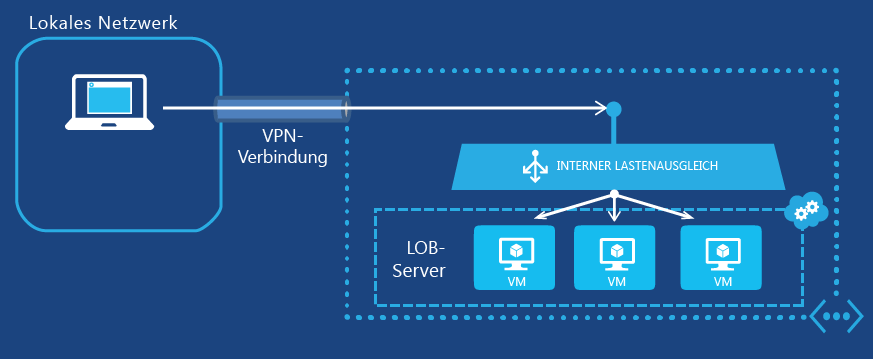

<properties
   pageTitle="Erste Schritte mit internem Lastenausgleich | Microsoft Azure"
   description="Konfigurieren von internem Lastenausgleich und dessen Implementierung für virtuelle Computer und Cloudbereitstellungen"
   services="load-balancer"
   documentationCenter="na"
   authors="joaoma"
   manager="adinah"
   editor="tysonn" />
<tags
   ms.service="load-balancer"
   ms.devlang="na"
   ms.topic="get-started-article"
   ms.tgt_pltfrm="na"
   ms.workload="infrastructure-services"
   ms.date="06/15/2015"
   ms.author="joaoma" />

# Erste Schritte zum Konfigurieren des internen Lastenausgleichs

Der interne Azure-Lastenausgleich (ILB) ermöglicht Lastenausgleich zwischen virtuellen Computern in einem Clouddienst oder virtuellen Netzwerk mit regionalem Umfang. Informationen zur Verwendung und Konfiguration virtueller Netzwerke mit regionalem Umfang finden Sie unter [Regionale virtuelle Netzwerke](../regional-virtual-networks.md) im Azure-Blog. Vorhandene virtuelle Netzwerke, die für eine Affinitätsgruppe konfiguriert wurden, können kein ILB verwenden.

## Erstellen einer internen Lastenausgleichsgruppe für Virtual Machines

Zum Erstellen eines internen Azure-Lastenausgleichsgruppe und der Server, die den Datenverkehr an diese Gruppe senden, müssen Sie Folgendes ausführen:

1. Erstellen Sie eine ILB-Instanz, die als Endpunkt für den eingehenden Datenverkehr dient, für den Lastenausgleich zwischen den Servern einer Lastenausgleichsgruppe durchgeführt wird.

1. Fügen Sie Endpunkte für die virtuellen Computer hinzu, die den eingehenden Datenverkehr empfangen.

1. Konfigurieren Sie die Server, die den Datenverkehr für den Lastenausgleich ausführen, so, dass der Datenverkehr an die virtuelle IP-Adresse (VIP) der ILB-Instanz gesendet wird.

### Schritt 1: Erstellen einer ILB-Instanz

Für einen vorhandenen Clouddienst oder einen Clouddienst, der in einem regionalen virtuellen Netzwerk bereitgestellt wird, können Sie eine ILB-Instanz mit den folgenden Windows PowerShell-Befehlen erstellen:

	$svc="<Cloud Service Name>"
	$ilb="<Name of your ILB instance>"
	$subnet="<Name of the subnet within your virtual network>"
	$IP="<The IPv4 address to use on the subnet-optional>"

	Add-AzureInternalLoadBalancer -ServiceName $svc -InternalLoadBalancerName $ilb –SubnetName $subnet –StaticVNetIPAddress $IP

Um diese Befehle zu verwenden, geben Sie die Werte ein und entfernen die Symbole < and >. Beispiel:

	$svc="WebCloud-NY"
	$ilb="SQL-BE"
	$subnet="Farm1"
	$IP="192.168.98.10"
	Add-AzureInternalLoadBalancer -ServiceName $svc -InternalLoadBalancerName $ilb –SubnetName $subnet –StaticVNetIPAddress $IP

### Schritt 2: Hinzufügen von Endpunkten zur ILB-Instanz

Für vorhandene virtuelle Computer können Sie mit den folgenden Befehlen der ILB-Instanz Endpunkte hinzufügen:

	$svc="<Cloud service name>"
	$vmname="<Name of the VM>"
	$epname="<Name of the endpoint>"
	$lbsetname="<Name of the load balancer set>"
	$prot="tcp" or "udp"
	$locport=<local port number>
	$pubport=<public port number>
	$ilb="<Name of your ILB instance>"
	Get-AzureVM –ServiceName $svc –Name $vmname | Add-AzureEndpoint -Name $epname -LbsetName $lbsetname -Protocol $prot -LocalPort $locport -PublicPort $pubport –DefaultProbe -InternalLoadBalancerName $ilb | Update-AzureVM

Um diese Befehle zu verwenden, geben Sie die Werte ein und entfernen die Symbole < and >.

Beachten Sie, dass bei dieser Verwendung des Windows PowerShell-Cmdlets [Add-AzureEndpoint](https://msdn.microsoft.com/library/dn495300.aspx) der DefaultProbe-Parametersatz verwendet wird. Weitere Informationen zu zusätzlichen Parametersätzen finden Sie unter [Add-AzureEndpoint](https://msdn.microsoft.com/library/dn495300.aspx).

Beispiel:

	$svc="AZ-LOB1"
	$vmname="SQL-LOBAZ1"
	$epname="SQL1"
	$lbsetname="SQL-LB"
	$prot="tcp"
	$locport=1433
	$pubport=1433
	$ilb="SQL ILB"
	Get-AzureVM –ServiceName $svc –Name $vmname | Add-AzureEndpoint -Name $epname -Lbset $lbsetname -Protocol $prot -LocalPort $locport -PublicPort $pubport –DefaultProbe -InternalLoadBalancerName $ilb | Update-AzureVM

### Schritt 3: Konfigurieren der Server zum Senden von Datenverkehr an den neuen ILB-Endpunkt

Sie müssen die Server, für deren Datenverkehr Lastenausgleich ausgeführt werden soll, für die Verwendung der neuen IP-Adresse (VIP) der ILB-Instanz konfigurieren. Dies ist die Adresse, die die ILB-Instanz überwacht. In den meisten Fällen müssen Sie nur einen DNS-Eintrag für die VIP der ILB-Instanz hinzufügen oder ändern.

Wenn Sie die IP-Adresse während der Erstellung der ILB-Instanz angegeben haben, verfügen Sie bereits über die VIP-Adresse. Andernfalls können Sie die VIP-Adresse mithilfe der folgenden Befehle anzeigen:

	$svc="<Cloud Service Name>"
	Get-AzureService -ServiceName $svc | Get-AzureInternalLoadBalancer

Um diese Befehle zu verwenden, geben Sie die Werte ein und entfernen die Symbole < and >. Beispiel:

	$svc="WebCloud-NY"
	Get-AzureService -ServiceName $svc | Get-AzureInternalLoadBalancer

Notieren Sie aus der Anzeige des Befehls "Get-AzureInternalLoadBalancer" die IP-Adresse, und nehmen Sie die erforderlichen Änderungen an Ihren Servern oder DNS-Datensätzen vor, um sicherzustellen, dass der Datenverkehr an die VIP-Adresse gesendet wird.

## End-to-End-Beispiele für internen Lastenausgleich

Schrittweise Anleitungen für die End-to-End-Prozesse zum Erstellen eines Lastenausgleichs für zwei Beispielkonfigurationen finden Sie in den folgenden Abschnitten.

### Anwendung mit mehreren Ebenen mit Internetanbindung

Die Contoso Corporation möchte Lastenausgleich zwischen einer Gruppe von Webservern mit Internetanbindung und einer Gruppe von Datenbankservern implementieren. Beide Gruppen von Servern werden in einem einzelnen Azure-Clouddienst gehostet. Webserver-Datenverkehr an TCP-Port 1433 muss zwischen drei virtuellen Computern auf Datenbankebene verteilt werden. Diese Konfiguration wird in Abbildung 1 gezeigt.

Abbildung 1: Beispiel für eine Anwendung mit mehreren Ebenen mit Internetanbindung

Die Konfiguration umfasst Folgendes:

- Der vorhandene Clouddienst, der die virtuellen Computer hostet, heißt "Contoso-PartnerSite".

- Die drei vorhandenen Datenbankserver heißen PARTNER-SQL-1, PARTNER-SQL-2 und PARTNER-SQL-3.

- Webserver auf Webebene stellen mithilfe des DNS-Namens "partner-sql.external.contoso.com" eine Verbindung mit dem Datenbankserver auf Datenbankebene her.

Die folgenden Befehle konfigurieren eine neue ILB-Instanz mit dem Namen PARTNER-DBTIER und fügen Endpunkte für die virtuellen Computer hinzu, die den drei Datenbankservern entsprechen:

	$svc="Contoso-PartnerSite"
	$ilb="PARTNER-DBTIER"
	Add-AzureInternalLoadBalancer -ServiceName $svc -InternalLoadBalancerName $ilb

	$prot="tcp"
	$locport=1433
	$pubport=1433
	$epname="DBTIER1"
	$lbsetname="SQL-LB"
	$vmname="PARTNER-SQL-1"
	Get-AzureVM –ServiceName $svc –Name $vmname | Add-AzureEndpoint -Name $epname -LbSetName $lbsetname -Protocol $prot -LocalPort $locport -PublicPort $pubport –DefaultProbe -InternalLoadBalancerName $ilb | Update-AzureVM

	$epname="DBTIER2"
	$vmname="PARTNER-SQL-2"
	Get-AzureVM –ServiceName $svc –Name $vmname | Add-AzureEndpoint -Name $epname -LbSetName $lbsetname -Protocol $prot -LocalPort $locport -PublicPort $pubport –DefaultProbe -InternalLoadBalancerName $ilb | Update-AzureVM

	$epname="DBTIER3"
	$vmname="PARTNER-SQL-3"
	Get-AzureVM –ServiceName $svc –Name $vmname | Add-AzureEndpoint -Name $epname -LbSetName $lbsetname -Protocol $prot -LocalPort $locport -PublicPort $pubport –DefaultProbe -InternalLoadBalancerName $ilb | Update-AzureVM

Im nächsten Schritt ermittelt Contoso die VIP-Adresse der ILB-Instanz PARTNER-DBTIER mit dem folgenden Befehl:

	Get-AzureService -ServiceName $svc | Get-AzureInternalLoadBalancer

Aus der Anzeige dieses Befehls notiert Contoso die VIP-Adresse 100.64.65.211 und konfiguriert den DNS-Adressdatensatz (A) für den Namen "partner-sql.external.contoso.com" so, dass diese neue Adresse verwendet wird.

### Eine in Azure gehostete LOB-Anwendung

Die Contoso Corporation möchte eine Line-of-Business(LOB)-Anwendung für eine Gruppe von Webservern in Azure hosten. Für den Clientdatenverkehr an TCP-Port 80 muss Lastenausgleich zwischen drei virtuellen Computern in einem standortübergreifenden virtuellen Netzwerk ausgeführt werden. Diese Konfiguration wird in Abbildung 2 gezeigt.

Abbildung 2: Beispiel für eine in Azure gehostete LOB-Anwendung

Die Konfiguration umfasst Folgendes:

- Der vorhandene Clouddienst, der die virtuellen Computer hostet, heißt "Contoso-Legal".

- Das Subnetz, in dem sich die LOB-Server befinden, heißt LOB-LEGAL, und Contoso hat die Adresse 198.168.99.145 als VIP-Adresse für das interne Lastenausgleichsmodul ausgewählt.

- Die drei vorhandenen LOB-Server heißen LEGAL-1, LEGAL-2 und LEGAL-3.

- Intranet-Webclients stellen eine Verbindung mit dem DNS-Namen "legalnet.corp.contoso.com" her.

Die folgenden Befehle erstellen eine neue ILB-Instanz mit dem Namen LEGAL-DBTIER und fügen Endpunkte für die virtuellen Computer hinzu, die den drei LOB-Servern entsprechen:

	$svc="Contoso-Legal"
	$ilb="LEGAL-ILB"
	$subnet="LOB-LEGAL"
	$IP="198.168.99.145"
	Add-AzureInternalLoadBalancer –ServiceName $svc -InternalLoadBalancerName $ilb –SubnetName $subnet –StaticVNetIPAddress $IP

	$prot="tcp"
	$locport=80
	$pubport=80
	$epname="LOB1"
	$lbsetname="LOB-LB"
	$vmname="LEGAL-1"
	Get-AzureVM –ServiceName $svc –Name $vmname | Add-AzureEndpoint -Name $epname-LbSetName $lbsetname -Protocol $prot -LocalPort $locport -PublicPort $pubport –DefaultProbe -InternalLoadBalancerName $ilb | Update-AzureVM

	$epname="LOB2"
	$vmname="LEGAL2"
	Get-AzureVM –ServiceName $svc –Name $vmname | Add-AzureEndpoint -Name $epname -LbSetName $lbsetname -Protocol $prot -LocalPort $locport -PublicPort $pubport –DefaultProbe -InternalLoadBalancerName $ilb | Update-AzureVM

	$epname="LOB3"
	$vmname="LEGAL3"
	Get-AzureVM –ServiceName $svc –Name $vmname | Add-AzureEndpoint -Name $epname -LbSetName $lbsetname -Protocol $prot -LocalPort $locport -PublicPort $pubport –DefaultProbe -InternalLoadBalancerName $ilb | Update-AzureVM

Im nächsten Schritt hat Contoso den DNS-A-Datensatz für den Namen "legalnet.corp.contoso.com" zur Verwendung von 198.168.99.145 konfiguriert.

## Hinzufügen eines virtuellen Computers zum ILB

Um einen virtuellen Computer zu einer ILB-Instanz bei deren Erstellung hinzuzufügen, können Sie die Cmdlets "New-AzureInternalLoadBalancerConfig" und "New-AzureVMConfig" verwenden.

Beispiel:

	$svc="AZ-LOB1"
	$ilb="LOB-ILB"
	$vnet="LOBNet_Azure"
	$subnet="LOBServers"
	$vmname="LOB-WEB1"
	$adminuser="Lando"
	$adminpw="Platform327"
	$regionname="North Central US"

	$myilbconfig=New-AzureInternalLoadBalancerConfig -InternalLoadBalancerName $ilb -SubnetName $subnet
	$images = Get-AzureVMImage
	New-AzureVMConfig -Name $vmname -InstanceSize Small -ImageName $images[50].ImageName | Add-AzureProvisioningConfig -Windows -AdminUsername $adminuser -Password $adminpw | New-AzureVM -ServiceName $svc -InternalLoadBalancerConfig $myilbconfig -Location $regionname –VNetName $vnet

## Konfigurieren von ILB für Clouddienste

ILB wird sowohl für virtuelle Computer als auch Clouddienste unterstützt. Ein ILB-Endpunkt, der in einem Clouddienst außerhalb eines regionalen virtuellen Netzwerks erstellt wurde, ist nur innerhalb des Clouddiensts verfügbar.

Die ILB-Konfiguration muss während der Erstellung der ersten Bereitstellung im Clouddienst festgelegt werden, wie im folgenden Cmdlet-Beispiel dargestellt.

### Erstellen eines lokalen ILB-Objekts
	$myilbconfig = New-AzureInternalLoadBalancerConfig -InternalLoadBalancerName "MyILB"

### Hinzufügen von internem Lastenausgleich für einen neuen Dienst

	New-AzureVMConfig -Name "Instance1" -InstanceSize Small -ImageName <imagename> | Add-AzureProvisioningConfig -Windows -AdminUsername <username> -Password <password> | New-AzureVM -ServiceName "Website2" -InternalLoadBalancerConfig $myilbconfig -Location "West US"

## Entfernen der ILB-Konfiguration

Um einen virtuellen Computer als Endpunkt aus einer ILB-Instanz zu entfernen, verwenden Sie die folgenden Befehle:

	$svc="<Cloud service name>"
	$vmname="<Name of the VM>"
	$epname="<Name of the endpoint>"
	Get-AzureVM -ServiceName $svc -Name $vmname | Remove-AzureEndpoint -Name $epname | Update-AzureVM

Um diese Befehle zu verwenden, geben Sie die Werte ein und entfernen die Symbole < and >.

Beispiel:

	$svc="AZ-LOB1"
	$vmname="SQL-LOBAZ1"
	$epname="SQL1"
	Get-AzureVM -ServiceName $svc -Name $vmname | Remove-AzureEndpoint -Name $epname | Update-AzureVM

Um eine ILB-Instanz aus einem Clouddienst zu entfernen, verwenden Sie die folgenden Befehle:

	$svc="<Cloud service name>"
	Remove-AzureInternalLoadBalancer -ServiceName $svc

Um diese Befehle zu verwenden, geben Sie den Wert ein und entfernen die Symbole < and >.

Beispiel:

	$svc="AZ-LOB1"
	Remove-AzureInternalLoadBalancer -ServiceName $svc

## Weitere Informationen zu ILB-Cmdlets

Um weitere Informationen zu ILB-Cmdlets zu erhalten, führen Sie die folgenden Befehle an einer Azure Windows PowerShell-Eingabeaufforderung aus:

- Get-help New-AzureInternalLoadBalancerConfig -full

- Get-help Add-AzureInternalLoadBalancer -full

- Get-help Get-AzureInternalLoadbalancer -full

- Get-help Remove-AzureInternalLoadBalancer -full

## Weitere Informationen

[Konfigurieren eines Lastenausgleichs-Verteilungsmodus](load-balancer-distribution-mode.md)

[Konfigurieren von TCP-Leerlauftimeout-Einstellungen für den Lastenausgleich](load-balancer-tcp-idle-timeout.md)
 

<!---HONumber=58_postMigration-->