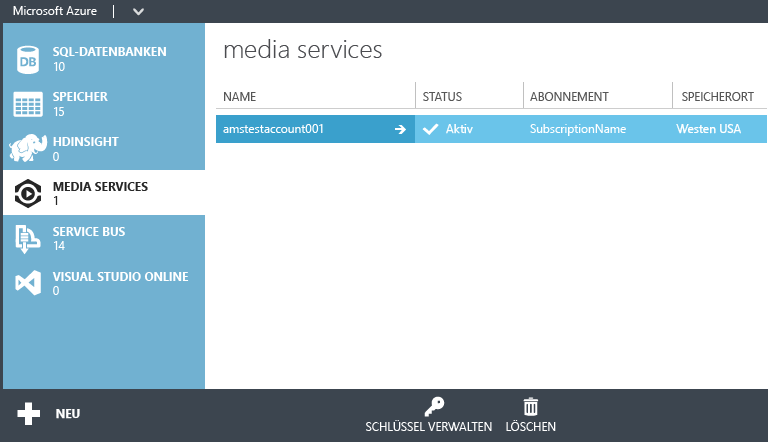

<properties
	pageTitle="Erstellen eines Media Services-Kontos | Microsoft Azure"
	description="Beschreibt die Erstellung eines neuen Azure Media Services-Kontos in Azure."
	services="media-services"
	documentationCenter=""
	authors="Juliako"
	manager="dwrede"
	editor=""/>

<tags
	ms.service="media-services"
	ms.workload="media"
	ms.tgt_pltfrm="na"
	ms.devlang="na"
	ms.topic="get-started-article"
	ms.date="11/03/2015"  
	ms.author="juliako"/>

# Erstellen eines Azure Media Services-Kontos

> [AZURE.SELECTOR]
- [Portal](media-services-create-account.md)
- [PowerShell](media-services-manage-with-powershell.md)
- [REST](https://msdn.microsoft.com/library/azure/dn167014.aspx)

Über das Azure-Portal können Sie schnell ein Azure Media Services-Konto erstellen. Sie können mit Ihrem Konto auf Mediendienste zugreifen, die Funktionen zum Speichern, Verschlüsseln, Codieren, Verwalten und Streamen von Medieninhalten in Azure bereitstellen. Beim Erstellen eines Media Services-Kontos erstellen Sie auch ein zugehöriges Speicherkonto (oder verwenden ein vorhandenes) in der gleichen geografischen Region wie das Media Services-Konto.

In diesem Artikel wird erläutert, wie Sie mithilfe der Schnellerfassung ein neues Media Services-Konto erstellen und anschließend einem Speicherkonto zuordnen.

## Konzepte

Für den Zugriff auf Media Services sind zwei zugeordnete Konten erforderlich:

-   **Ein Media Services-Konto**. Über Ihr Konto erhalten Sie Zugriff auf eine Reihe cloudbasierter Mediendienste in Azure. In einem Media Services-Konto wird kein Medieninhalt gespeichert. Stattdessen werden Metadaten über die Medieninhalte und Medienverarbeitungsaufträge in Ihrem Konto gespeichert. Beim Erstellen des Kontos wählen Sie eine verfügbare Media Services-Region aus. Bei der ausgewählten Region handelt es sich um ein Rechenzentrum, in dem Metadaten-Datensätze für Ihr Konto gespeichert werden.

    > [AZURE.NOTE]Folgende Media Services-Regionen (AMS) sind verfügbar: „Nordeuropa“, „Westeuropa“, „USA, Westen“, „USA, Osten“, „Südostasien“, „Ostasien“, „Japan, Westen“, „Japan, Osten“. Media Services verwendet keine Affinitätsgruppen.
    >
	> AMS ist jetzt auch in den folgenden Datencentern verfügbar: „Brasilien, Süden“, „Indien, Westen“, „Indien, Süden“ und „Indien, Mitte“. Jetzt können Sie das Azure-Verwaltungsportal zum [Erstellen von Media Service-Konten](media-services-create-account.md#create-a-media-services-account-using-quick-create) und zum Durchführen verschiedener Aufgaben verwenden, die [hier](https://azure.microsoft.com/documentation/services/media-services/) beschrieben werden. Live Encoding ist in diesen Datencentern jedoch nicht aktiviert. Darüber hinaus sind nicht alle Arten von für die Codierung reservierten Einheiten in diesen Datencentern verfügbar.
	>
	>- Brasilien, Süden: Für die Codierung reservierte Einheiten stehen nur in den Versionen Standard und Basic zur Verfügung.
	>- „Indien, Westen“, „Indien, Süden“ und „Indien, Mitte“: Für die Codierung reservierte Einheiten stehen nur in der Basic-Version zur Verfügung.

-   **Ein zugeordnetes Speicherkonto**. Bei Ihrem Speicherkonto handelt es sich um ein Azure-Speicherkonto, das Ihrem Media Services-Konto zugeordnet ist. Das Speicherkonto stellt Blob-Speicher für Mediendateien zur Verfügung und muss sich in derselben geografischen Region befinden wie das Media Services-Konto. Bei der Erstellung eines Media Services-Kontos können Sie entweder ein vorhandenes Speicherkonto in derselben Region auswählen oder ein neues Speicherkonto in derselben Region erstellen. Wenn Sie ein Media Services-Konto löschen, bleiben die Blobs im zugehörigen Speicherkonto erhalten.

## Erstellen eines Media Services-Kontos mithilfe der Schnellerfassung

1. Klicken Sie im [Azure-Portal][] auf **Neu**, klicken Sie auf **Mediendienst** und dann auf **Schnellerfassung**.

	

2. Geben Sie in das Feld **NAME** den Namen des neuen Kontos ein. Der Name eines Media Services-Kontos darf nur Kleinbuchstaben oder Ziffern ohne Leerzeichen enthalten und muss aus 3 bis 24 Zeichen bestehen.

3. Wählen Sie unter **REGION** die geografische Region aus, in der die Metadaten-Datensätze für Ihr Media Services-Konto gespeichert werden sollen. In der Dropdownliste werden nur die verfügbaren Media Services-Regionen angezeigt.

4. Wählen Sie unter **SPEICHERKONTO** ein Speicherkonto aus, das als Blob-Speicher für die Medieninhalte aus Ihrem Media Services-Konto dienen soll. Sie können ein vorhandenes Speicherkonto in derselben geografischen Region wie Ihr Media Services-Konto auswählen oder ein neues Speicherkonto erstellen. Ein neues Speicherkonto wird in derselben Region erstellt.

5. Wenn Sie ein neues Speicherkonto erstellt haben, geben Sie im Feld **NEUER SPEICHERKONTONAME** einen Namen für das Speicherkonto an. Für Namen von Speicherkonten gelten die gleichen Regeln wie für Namen von Media Services-Konten.

6. Klicken Sie unten im Formular auf **Schnellerfassung**.

	Sie können den Status des Prozesses im Meldungsbereich unten im Fenster überwachen.

	Der Status ändert sich in "Aktiv", wenn das Konto erfolgreich erstellt wurde. Die Seite **Mediendienste** wird geöffnet, und das neue Konto wird angezeigt.

	Am unteren Rand der Seite wird die Schaltfläche **SCHLÜSSEL VERWALTEN** angezeigt. Wenn Sie auf diese Schaltfläche klicken, wird eine Seite mit dem Media Services-Kontonamen und dem primären und sekundären Schlüssel angezeigt. Sie benötigen den Kontonamen und den Primärschlüssel, um programmgesteuert auf das Media Services-Konto zugreifen zu können.

	

	Wenn Sie auf den Kontonamen doppelklicken, wird standardmäßig die Seite **Schnellstart** angezeigt. Auf dieser Seite können Sie einige Verwaltungsaufgaben ausführen, die auch auf anderen Seiten des Portals verfügbar sind. Sie können beispielsweise eine Videodatei von dieser Seite oder der Seite **INHALT** hochladen.

	Außerdem können Sie Code anzeigen, der mithilfe des Azure Media Services-SDK die folgenden Aufgaben ausführt: Videos hochladen, verschlüsseln und veröffentlichen. Sie können auf einen der Links unter dem Abschnitt **ETWAS CODE SCHREIBEN** klicken, den Code kopieren und in Ihrer Anwendung verwenden.

##Media Services-Lernpfade

[AZURE.INCLUDE [media-services-learning-paths-include](../../includes/media-services-learning-paths-include.md)]

##Feedback geben

[AZURE.INCLUDE [media-services-user-voice-include](../../includes/media-services-user-voice-include.md)]

## Nächste Schritte

- [Erste Schritte zum Bereitstellen von Video-on-Demand-Inhalt (VoD) mit dem .NET SDK](media-services-dotnet-get-started.md)

- [Verwenden von .NET SDK, um Kanäle zu erstellen, von denen eine Livecodierung von Single-Bitrate- zu Multi-Bitrate-Datenströmen vorgenommen wird](media-services-dotnet-creating-live-encoder-enabled-channel.md)

<!-- Reusable paths. -->

<!-- Anchors. -->
  [Concepts]: #concepts
  [Before you begin]: #begin
  [How to: Create a Media Services account using Quick Create]: #quick

<!-- URLs. -->
  [Web Platform Installer]: http://go.microsoft.com/fwlink/?linkid=255386

  [Azure-Portal]: http://manage.windowsazure.com/

<!---HONumber=Nov15_HO3-->