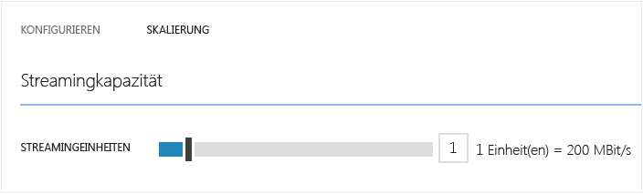
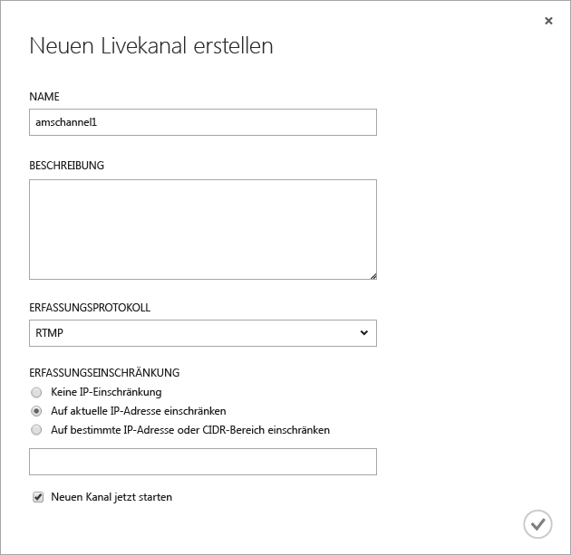
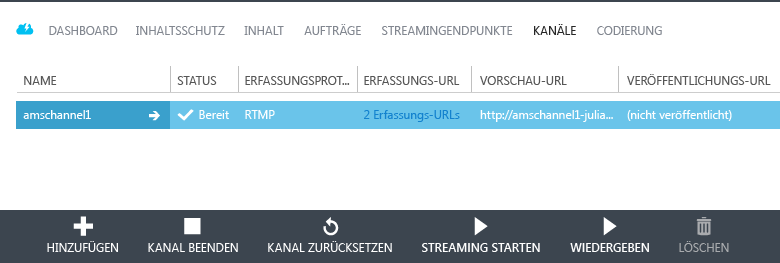
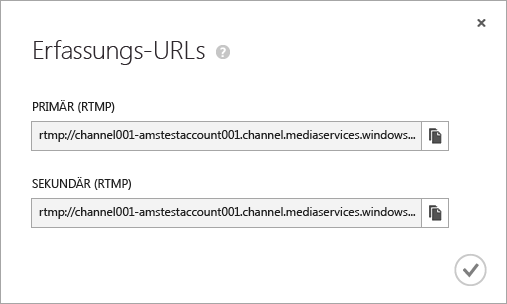
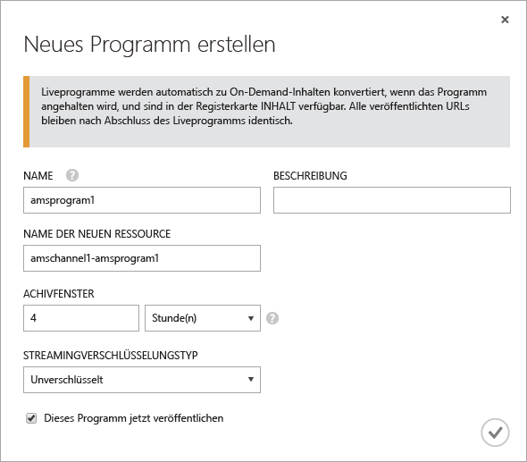
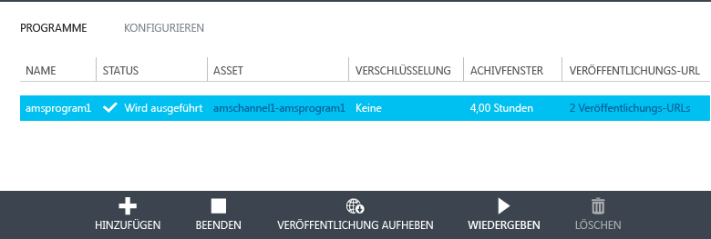
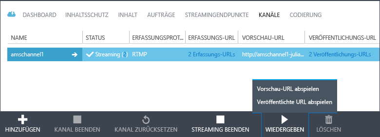
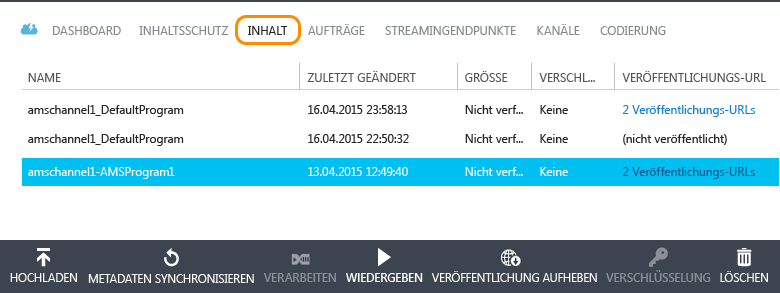

<properties
	pageTitle="Erstellen Sie mit dem klassischen Azure-Portal Kanäle, die Livestreams mit mehreren Bitraten von lokalen Encodern empfangen | Microsoft Azure"
	description="Dieses Lernprogramm führt Sie durch die Schritte zum Implementieren von grundlegenden Media Services-Anwendungen zum Livestreamen, in denen ein Kanal einen Livestream mit mehreren Bitraten von lokalen Encodern empfängt."
	services="media-services"
	documentationCenter=""
	authors="Juliako,cenkdin" 
	manager="dwrede" 
	editor=""/>

<tags 
	ms.service="media-services" 
	ms.workload="media" 
	ms.tgt_pltfrm="na" 
	ms.devlang="ne" 
	ms.topic="article" 
	ms.date="01/31/2016"  
	ms.author="juliako"/>

# Verwenden Sie das klassische Azure-Portal zum Erstellen von Kanälen, die Livestreams mit mehreren Bitraten von lokalen Encodern empfangen.

[AZURE.INCLUDE [media-services-selector-manage-channels](../../includes/media-services-selector-manage-channels.md)]

Dieses Lernprogramm führt Sie durch die Schritte zum Implementieren von grundlegenden Media Services-Anwendungen zum Livestreamen, in denen ein Kanal einen Livestream mit mehreren Bitraten von lokalen Encodern empfängt. Ausführlichere Informationen zum Arbeiten mit Kanälen und dazugehörigen Komponenten finden Sie unter [Arbeiten mit Kanälen, von denen Multi-Bitrate-Livedatenströme aus lokalen Encodern empfangen werden](media-services-manage-channels-overview.md).

In diesem Lernprogramm wird das klassische Azure-Portal verwendet, um die folgenden Aufgaben auszuführen:

2.  Konfigurieren von Streamingendpunkten
3.  Erstellen eines Kanals
1.  Konfigurieren eines Live-Encoders und Aufnehmen von Live-Datenströmen in den Kanal (bei diesem Schritt wird Wirecast verwendet)
1.  Erstellen eines Programms (und eines Medienobjekts)
1.  Veröffentlichen des Medienobjekts und Abrufen von Streaming-URLs
1.  Wiedergeben Ihrer Inhalte
2.  Bereinigen

## Voraussetzungen
Zum Abschließen dieses Lernprogramms müssen folgende Voraussetzungen erfüllt sein:

- Um dieses Lernprogramm abzuschließen, benötigen Sie ein Azure-Konto. Ausführliche Informationen finden Sie unter [Kostenlose Azure-Testversion](/pricing/free-trial/?WT.mc_id=A261C142F). 
- Media Services-Konto. Informationen zum Erstellen eines Media Services-Kontos finden Sie unter [Konto erstellen](media-services-create-account.md).
- Sie benötigen eine Webcam und einen Encoder, von dem ein Multi-Bitrate-Livedatenstrom gesendet wird.

## Konfigurieren von Streamingendpunkten mithilfe des klassischen Azure-Portals

Wenn Sie mit Azure Media Services arbeiten, besteht eines der häufigsten Szenarien darin, Streaming mit adaptiver Bitrate an Ihre Clients zu übermitteln. Beim Adaptive Bitrate Streaming mit adaptiver Bitrate kann der Client während der Videodarstellung abhängig von der aktuellen Netzwerkbandbreite, CPU-Auslastung und anderen Faktoren auf einen Stream mit höherer oder niedrigerer Bitrate wechseln. Von Media Services werden die folgenden Streamingtechnologien mit adaptiver Bitrate unterstützt: HTTP Live Streaming (HLS), Smooth Streaming, MPEG DASH und HDS (nur mit Adobe PrimeTime/Access-Lizenz).

Beim Arbeiten mit Livestreaming wird ein Livedatenstrom mit mehreren Bitraten von einem lokalen Liveencoder (im Beispielfall Wirecast) in den Kanal geleitet. Wenn der Datenstrom durch einen Benutzer angefordert wird, so wird der Quelldatenstrom durch dynamische Paketerstellung in die angeforderte Bitrate (HLS, DASH oder Smooth) umgewandelt.

Um die dynamische Paketerstellung nutzen zu können, ist mindestens eine Streamingeinheit für den *Streamingendpunkt* erforderlich, aus dem die Inhalte geliefert werden sollen.

Um die Anzahl der Einheiten zu ändern, die für das Streaming reserviert sind, gehen Sie folgendermaßen vor:

1. Klicken Sie im [klassischen Azure-Portal](https://manage.windowsazure.com/) auf **Media Services**. Klicken Sie anschließend auf den Namen des Media Service

2. Wählen Sie die Seite **STREAMING-ENDPUNKTE** aus. Klicken Sie anschließend auf das Streamingendgerät, das Sie ändern möchten.

3. Um die Anzahl der Streamingeinheiten anzugeben, wählen Sie die Registerkarte **SKALIERUNG** aus und verschieben anschließend den Schieberegler für die reservierte Kapazität.

4. Klicken Sie auf die Schaltfläche **SPEICHERN**, um die Änderungen zu speichern.

Das Zuordnen neuer Einheiten dauert etwa 20 Minuten.

>[AZURE.NOTE] Aktuell kann das Streaming bis zu eine Stunde lang deaktiviert werden, wenn Sie einen positiven Wert für die Streamingeinheiten zurück auf null setzen.
>
> Die höchste für den 24-Stunden-Zeitraum angegebene Anzahl an Einheiten wird zum Berechnen der Kosten verwendet. Informationen zu den Preisen finden Sie unter [Mediendienste – Preisübersicht](http://go.microsoft.com/fwlink/?LinkId=275107).

## Erstellen eines Kanals

Wählen Sie im klassischen Azure-Portal die Seite **KANÄLE** aus. Klicken Sie dann auf **NEU**. Geben Sie auf der Seite **Neuen Livekanal erstellen** einen Namen für den Kanal ein.

Klicken Sie unten rechts auf der Seite auf die entsprechende Option, um das Speichern Ihrer Updates zu aktivieren.

Nach einigen Minuten wird der Kanal erstellt und gestartet.

## Abrufen von Erfassungs-URLs

Wenn der Kanal erstellt wurde, können Sie Erfassungs-URLs abrufen, die Sie dem Liveencoder bereitstellen. Diese URLs werden vom Encoder zur Eingabe eines Livedatenstroms verwendet.

Weitere Informationen über Erfassungs-URLs finden Sie unter [Verwenden von lokalen Encodern zum Senden von Livestreams mit mehreren Bitraten an einen Kanal](media-services-channels-overview.md).

## Konfigurieren Sie einen Live-Encoder und erfassen Sie Livedatenströme

>[AZURE.NOTE] Dieser Schritt erfordert die Erfassungs-URL des Kanals, die im vorherigen Schritt erwähnt wurde.

Ausführliche Informationen zum Konfigurieren von Wirecast und der Erfassung von Streams finden Sie unter [Wirecast-Konfiguration](https://azure.microsoft.com/blog/2014/09/18/azure-media-services-rtmp-support-and-live-encoders/).

>[AZURE.NOTE] Wenn Sie aus irgendeinem Grund den Encoder stoppen und anschließend neu starten müssen, setzen Sie zuerst den Kanal zurück, indem Sie im klassischen Azure-Portal auf den Befehl **Zurücksetzen** klicken.

## Erstellen und Verwalten von Programmen

### Übersicht

Einem Kanal sind Programme zugeordnet, mit denen Sie das Veröffentlichen und Speichern von Segmenten in einem Livedatenstrom steuern können. Die Programme werden von den Kanälen verwaltet. Die Beziehung zwischen Kanal und Programm ähnelt herkömmlichen Medien, bei denen ein Kanal einen konstanten Inhaltsdatenstrom aufweist und ein Programm auf ein zeitlich festgelegtes Ereignis in diesem Kanal ausgerichtet ist.

Über die Länge des **Archivierungsfensters** können Sie die Anzahl der Stunden angeben, für die Sie den aufgezeichneten Inhalt des Programms beibehalten möchten. Es können Werte zwischen mindestens 5 Minuten und höchstens 25 Stunden eingestellt werden. Von der Länge des Archivierungsfensters wird außerdem bestimmt, wie lange von Clients von der aktuellen Liveposition aus maximal rückwärts gesucht werden kann. Programme können über die angegebene Zeitspanne laufen. Inhalte, die über das Zeitfenster hinausgehen, werden jedoch fortlaufend verworfen. Durch den Wert dieser Eigenschaft wird außerdem festgelegt, wie lange Clientmanifeste wachsen können.

Jedes Programm ist mit einem Medienobjekt verknüpft. Zum Veröffentlichen des Programms müssen Sie einen OnDemand-Locator für das zugehörige Medienobjekt erstellen. Mithilfe dieses Locators können Sie eine Streaming-URL erstellen, die Sie Ihren Kunden bereitstellen können.

Ein Kanal unterstützt bis zu drei gleichzeitig ausgeführte Programme, sodass Sie mehrere Archive desselben eingehenden Datenstroms erstellen können. Auf diese Weise können Sie verschiedene Teile eines Ereignisses nach Bedarf veröffentlichen und archivieren. Beispielsweise könnte Ihre Geschäftsanforderung darin bestehen, 6 Stunden eines Programms zu archivieren, jedoch nur die letzten 10 Minuten zu senden. Dazu müssen Sie zwei Programme erstellen, die gleichzeitig ausgeführt werden. Ein Programm wird auf die Archivierung von 6 Stunden des Ereignisses festgelegt. Dieses Programm wird jedoch nicht veröffentlicht. Das andere Programm wird auf die Archivierung von 10 Minuten festgelegt. Dieses Programm wird veröffentlicht.

Verwenden Sie vorhandene Programme nicht erneut für nachfolgende Ereignisse. Erstellen und starten Sie stattdessen für jedes Ereignis ein neues Programm.

Wenn Sie zum Starten von Streaming und Archivierung bereit sind, starten Sie das Programm. Sie können das Programm und damit das Streaming und die Archivierung des Ereignisses jederzeit beenden.

Zum Löschen von archivierten Inhalten beenden und löschen Sie das Programm und löschen anschließend das zugehörige Medienobjekt. Medienobjekte können nicht gelöscht werden, wenn sie von Programmen verwendet werden. Zuerst muss das betreffende Programm gelöscht werden.

Auch nach dem Beenden und Löschen des Programms können die Benutzer archivierte Inhalte als bedarfsgesteuertes Video streamen, solange das Medienobjekt nicht gelöscht wurde.

Wenn Sie die archivierten Inhalte beibehalten möchten, diese aber nicht für das Streaming verfügbar sein sollen, löschen Sie den Streaminglocator.

### Erstellen, Starten und Beenden von Programmen

Wenn der Datenstrom in den Kanal gelangt, können Sie das Streamingereignis starten, indem Sie ein Medienobjekt, ein Programm und einen Streaminglocator erstellen. Dadurch wird der Datenstrom archiviert und über den Streamingendpunkt für die Zuschauer verfügbar gemacht.

Es gibt zwei Möglichkeiten, ein Ereignis zu starten:

1. Klicken Sie auf der Seite **KANÄLE** auf **HINZUFÜGEN**, um ein neues Programm hinzuzufügen.

Geben Sie auf der Seite **Neues Programm erstellen** den Programmnamen, den Medienobjektnamen, das Archivfenster und die Verschlüsselungsoption an.

Wenn **Dieses Programm jetzt veröffentlichen** ausgewählt ist, werden die Veröffentlichungs-URLs erstellt.

Sie können jeweils auf **START** klicken, wenn Sie bereit zum Streamen des Programms sind.

Wenn Sie das Programm gestartet haben, können Sie auf **WIEDERGABE** klicken, um die Wiedergabe der Inhalte zu starten.

2. Alternativ dazu können Sie einfach auf der Seite **KANÄLE** auf die Schaltfläche **STREAMING STARTEN** klicken. Dadurch erstellen Sie ein Medienobjekt, ein Programm und einen Streaminglocator.

Das Programm hat den Namen „DefaultProgram“, und das Archivfenster ist auf 1 Stunde festgelegt.

Sie können das veröffentlichte Programm auf der Seite **KANÄLE** wiedergeben.

Wenn Sie auf der Seite **KANÄLE** auf **STREAMING BEENDEN** klicken, wird das Standardprogramm beendet und gelöscht. Das Medienobjekt bleibt erhalten, und Sie können es auf der Seite **INHALT** veröffentlichen bzw. die Veröffentlichung aufheben.

Wenn Sie zur Seite **INHALT** wechseln, sehen Sie die Ressourcen, die für Ihre Programme erstellt wurden.

## Wiedergeben von Inhalten

Um für Ihre Benutzer eine URL bereitzustellen, die zum Streamen Ihrer Inhalte verwendet werden kann, müssen Sie das Medienobjekt zunächst *veröffentlichen* (wie im vorigen Abschnitt beschrieben), indem Sie einen Locator erstellen (wenn Sie ein Medienobjekt mithilfe des klassischen Azure-Portals veröffentlichen, werden die Locators automatisch erstellt). Locators ermöglichen den Zugriff auf Dateien im Medienobjekt.

Je nach dem Streamingprotokoll, das zum Wiedergeben Ihrer Inhalte verwendet werden soll, müssen Sie möglicherweise die URL ändern, die Sie über den Link **URL VERÖFFENTLICHEN** des Kanals/Programms erhalten haben.

Durch dynamische Paketerstellung wird der Livedatenstrom in das angegebene Protokoll gepackt.

Eine Streaming-URL, mit der Sie Smooth Streaming-Medienobjekte wiedergeben können, weist standardmäßig das folgende Format auf:

{Streamingendpunktname-Media Services-Kontoname}.streaming.mediaservices.windows.net/{Locator-ID}/{Dateiname}.ism/Manifest

Um eine HLS-Streaming-URL zu erstellen, fügen Sie „(format=m3u8-aapl)“ an die URL an.

{Streamingendpunktname-Media Services-Kontoname}.streaming.mediaservices.windows.net/{Locator-ID}/{Dateiname}.ism/Manifest(Format=m3u8-aapl)

Um eine MPEG DASH-Streaming-URL zu erstellen, fügen Sie „(format=mpd-time-csf)“ an die URL an.

{Streamingendpunktname-Media Services-Kontoname}.streaming.mediaservices.windows.net/{Locator-ID}/{Dateiname}.ism/Manifest(Format=mpd-time-csf)

Weitere Informationen zum Bereitstellen von Inhalten finden Sie unter [Bereitstellen von Inhalten](media-services-deliver-content-overview.md).

Sie können Smooth Stream mit dem [AMS Player](http://amsplayer.azurewebsites.net/azuremediaplayer.html) wiedergeben oder iOS- und Android-Geräte verwenden, um HLS Version 3 wiederzugeben.

## Bereinigen

Wenn die Streamingereignisse beendet sind und Sie die zuvor bereitgestellten Ressourcen bereinigen möchten, verwenden Sie das folgende Verfahren:

- Beenden Sie die Datenstromeingabe vom Encoder.
- Beenden Sie den Kanal. Wenn der Kanal beendet ist, fallen keine Kosten an. Wenn Sie den Kanal erneut starten, weist er die gleiche Erfassungs-URL auf, damit Sie den Encoder nicht erneut konfigurieren müssen.
- Sie können Ihren Streamingendpunkt beenden, sofern Sie das Archiv Ihres Liveereignisses nicht als bedarfsgesteuerten Datenstrom bereitstellen möchten. Durch Kanäle im angehaltenen Zustand fallen keine Kosten an.

##Nächste Schritte: Media Services-Lernpfade

[AZURE.INCLUDE [media-services-learning-paths-include](../../includes/media-services-learning-paths-include.md)]

##Feedback geben

[AZURE.INCLUDE [media-services-user-voice-include](../../includes/media-services-user-voice-include.md)]

### Suchen Sie etwas anderes?

Wenn dieses Thema nicht die erwarteten Informationen enthält, Informationen fehlen oder auf andere Weise Ihre Erwartungen nicht erfüllt wurden, senden Sie uns bitte über den Disqus-Thread unten Ihr Feedback.

## Zusätzliche Ressourcen
- [Erste Schritte zum Livestreaming mithilfe des klassischen Azure-Portals (in englischer Sprache)](https://azure.microsoft.com/blog/getting-started-with-live-streaming-using-the-azure-management-portal/)

<!-- URLs. -->
[Azure Classic Portal]: http://manage.windowsazure.com/

<!-- Images -->

<!---HONumber=AcomDC_0204_2016-->