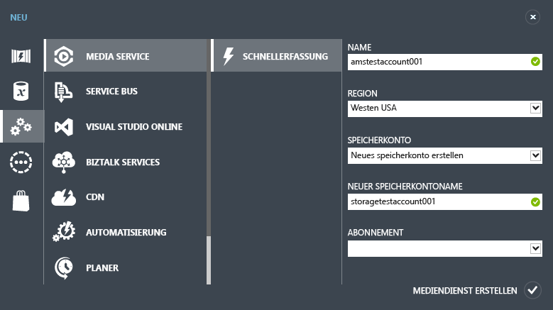
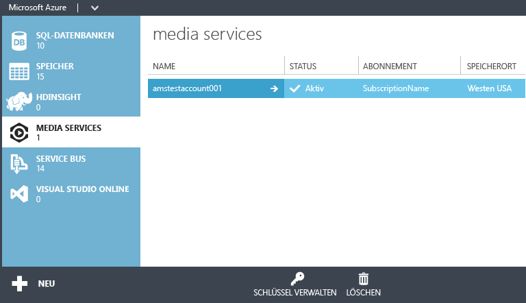
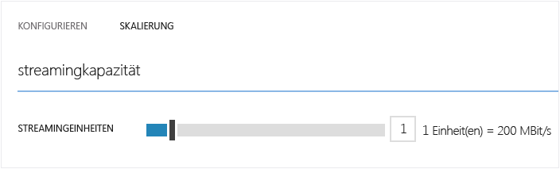

<properties
	pageTitle="Erste Schritte zum Bereitstellen von Inhalten nach Bedarf mit dem klassischen Azure-Portal | Microsoft Azure"
	description="Dieses Tutorial führt Sie durch die Schritte zum Implementieren einer Anwendung zur Video-on-Demand-Inhaltsübermittlung (VoD) mit Azure Media Services mithilfe des klassischen Azure-Portals."
	services="media-services"
	documentationCenter=""
	authors="Juliako"
	manager="dwrede"
	editor=""/>

<tags
	ms.service="media-services"
	ms.workload="media"
	ms.tgt_pltfrm="na"
	ms.devlang="na"
	ms.topic="get-started-article"
	ms.date="02/03/2016"
	ms.author="juliako"/>

# Erste Schritte zum Bereitstellen von Inhalten nach Bedarf mit dem klassischen Azure-Portal

[AZURE.INCLUDE [media-services-selector-get-started](../../includes/media-services-selector-get-started.md)]

Dieses Tutorial führt Sie durch die Schritte zum Implementieren einer einfachen Anwendung zur Video-on-Demand-Inhaltsübermittlung (VoD) mithilfe des klassischen Azure-Portals.

> [AZURE.NOTE] Um dieses Lernprogramm abzuschließen, benötigen Sie ein Azure-Konto. Ausführliche Informationen finden Sie unter [Kostenlose Azure-Testversion](/pricing/free-trial/?WT.mc_id=A261C142F).

Dieses Lernprogramm enthält die folgenden Aufgaben:

1.  Erstellen eines Azure Media Services-Kontos
2.  Konfigurieren eines Streamingendgeräts
1.  Hochladen einer Videodatei
1.  Codieren der Quelldatei in einen Satz von MP4-Dateien mit adaptiver Bitrate
1.  Veröffentlichen des Medienobjekts und Abrufen von URLs für Streaming und progressiven Download  
1.  Wiedergeben Ihrer Inhalte

## Erstellen eines Azure Media Services-Kontos

1. Klicken Sie im [klassischen Azure-Portal](https://manage.windowsazure.com/) auf **Neu**, **Mediendienst** und dann auf **Schnellerfassung**.

	

2. Geben Sie in das Feld **NAME** den Namen des neuen Kontos ein. Der Name eines Media Services-Kontos darf nur Kleinbuchstaben oder Ziffern ohne Leerzeichen enthalten und muss aus 3 bis 24 Zeichen bestehen.

3. Wählen Sie unter **REGION** die geografische Region aus, in der die Metadaten-Datensätze für Ihr Media Services-Konto gespeichert werden sollen. Im Dropdownlistenfeld werden nur die verfügbaren Media Services-Regionen angezeigt.

4. Wählen Sie unter **SPEICHERKONTO** ein Speicherkonto aus, das als Blob-Speicher für die Medieninhalte aus Ihrem Media Services-Konto dienen soll. Sie können ein vorhandenes Speicherkonto in derselben geografischen Region wie Ihr Media Services-Konto auswählen oder ein neues Speicherkonto erstellen. Ein neues Speicherkonto wird in derselben Region erstellt.

5. Wenn Sie ein neues Speicherkonto erstellt haben, geben Sie im Feld **NEUER SPEICHERKONTONAME** einen Namen für das Speicherkonto an. Für Namen von Speicherkonten gelten die gleichen Regeln wie für Namen von Media Services-Konten.

6. Klicken Sie unten im Formular auf **Schnellerfassung**.

	Sie können den Status des Prozesses im Meldungsbereich unten im Fenster überwachen.

	Wenn das Konto erfolgreich erstellt wurde, ändert sich der Status zu „Aktiv“.

	Am unteren Rand der Seite wird die Schaltfläche **SCHLÜSSEL VERWALTEN** angezeigt. Wenn Sie auf diese Schaltfläche klicken, wird ein Dialogfeld mit dem Media Services-Kontonamen und dem primären und sekundären Schlüssel angezeigt. Sie benötigen den Kontonamen und den Primärschlüssel, um programmgesteuert auf das Media Services-Konto zugreifen zu können.

	

	Wenn Sie auf den Kontonamen doppelklicken, wird standardmäßig die Seite „Schnellstart“ angezeigt. Auf dieser Seite können Sie einige Verwaltungsaufgaben ausführen, die auch auf anderen Seiten des Portals verfügbar sind. Sie können beispielsweise eine Videodatei auf dieser Seite oder auf der Seite INHALT hochladen.

## Konfigurieren von Streamingendpunkten mithilfe des Portals

Bei der Arbeit mit Azure Media Services ist eines der häufigsten Szenarios das Streaming mit adaptiver Bitrate an Clients. Beim Streaming mit adaptiver Bitrate kann der Client während der Videodarstellung abhängig von der aktuellen Netzwerkbandbreite, CPU-Auslastung und anderen Faktoren auf einen Stream mit höherer oder niedrigerer Bitrate wechseln. Von Media Services werden die folgenden Streamingtechnologien mit adaptiver Bitrate unterstützt: HTTP Live Streaming (HLS), Smooth Streaming, MPEG DASH und HDS (nur mit Adobe PrimeTime/Access-Lizenz).

Media Services bietet dynamische Paketerstellung zum Übermitteln Ihrer MP4-Dateien mit adaptiver Bitrate oder Smooth Streaming-codierten Inhalte in Streamingformaten, die von Media Services unterstützt werden (MPEG DASH, HLS, Smooth Streaming, HDS), ohne dass Sie diese Streamingformate erneut verpacken müssen.

Um die dynamische Paketerstellung nutzen zu können, müssen Sie folgende Schritte ausführen:

- Codieren Ihrer Zwischendatei (Quelle) in einen Satz von MP4-Dateien oder Smooth Streaming-Dateien mit adaptiver Bitrate (die Codierungsschritte werden weiter unten in diesem Lernprogramm beschrieben)  
- Rufen Sie mindestens eine Streamingeinheit für das *Streamingendgerät* ab, von dem aus Sie die Bereitstellung Ihrer Inhalte planen.

Mit der dynamischen Paketerstellung müssen Sie die Dateien nur in einem Speicherformat speichern und bezahlen. Media Services erstellt und verarbeitet die entsprechende Antwort basierend auf Anforderungen von einem Client.

Um die Anzahl der Einheiten zu ändern, die für das Streaming reserviert sind, gehen Sie folgendermaßen vor:

1. Klicken Sie im [klassischen Azure-Portal](https://manage.windowsazure.com/) auf **Media Services**. Klicken Sie anschließend auf den Namen des Media Service

2. Wählen Sie die Seite STREAMING-ENDPUNKTE aus. Klicken Sie anschließend auf das Streamingendgerät, das Sie ändern möchten.

3. Um die Anzahl der Streamingeinheiten anzugeben, wählen Sie die Registerkarte **SKALIERUNG** aus und verschieben anschließend den Schieberegler für die **reservierte Kapazität**.

	

4. Klicken Sie auf die Schaltfläche **SPEICHERN**, um die Änderungen zu speichern.

	Das Zuordnen neuer Einheiten dauert etwa 20 Minuten.

	>[AZURE.NOTE] Aktuell kann das Streaming bis zu eine Stunde lang deaktiviert werden, wenn Sie einen positiven Wert für die Streamingeinheiten zurück auf null setzen.
	>
	> Die höchste für den 24-Stunden-Zeitraum angegebene Anzahl an Einheiten wird zum Berechnen der Kosten verwendet. Informationen zu den Preisen finden Sie unter [Mediendienste – Preisübersicht](http://go.microsoft.com/fwlink/?LinkId=275107).

## Hochladen von Inhalten

1. Klicken Sie im [klassischen Azure-Portal](http://go.microsoft.com/fwlink/?LinkID=256666&clcid=0x409) auf **Media Services** und dann auf den Media Services-Kontonamen.
2. Wählen Sie die Seite "INHALT" aus.
3. Klicken Sie auf der Seite oder unten im Portal auf **Hochladen**.
4. Navigieren Sie im Dialogfeld **Inhalte hochladen** zur gewünschten Ressourcendatei. Klicken Sie auf die Datei und dann auf **Öffnen**, oder drücken Sie die EINGABETASTE.

	![Dialogfeld "Inhalte hochladen"][uploadcontent]

5. Klicken Sie im Dialogfeld **Inhalte hochladen** auf das Häkchen, um die **Datei** und den **Inhaltsnamen** zu akzeptieren.
6. Das Hochladen beginnt, und Sie können den Fortschritt unten im Portal verfolgen.  

	![Auftragsstatus][status]

Wenn der Upload abgeschlossen ist, wird in der Liste "Inhalt" das neue Medienobjekt aufgeführt. Entsprechend der Namenskonvention wird "**-Source**" an das Ende gehängt, damit neue Inhalte als Quellinhalte für Codieraufgaben erfasst werden können.

![Inhaltsseite][contentpage]

Wenn der Wert für die Dateigröße nach dem Hochladen nicht aktualisiert wird, wählen Sie die Schaltfläche **Metadaten synchronisieren**. Damit wird die Größe der Medienobjektdatei mit der tatsächlichen Dateigröße im Speicher synchronisiert, und der Wert auf der Seite "Inhalt" wird aktualisiert.

## Codieren von Inhalten

### Übersicht

Um digitale Videos über das Internet zu übermitteln, müssen Sie die Medien komprimieren. Media Services bietet einen Media Encoder, mit dem Sie angeben, wie Ihre Inhalte codiert werden sollen (z. B. Codecs, Dateiformat, Auflösung und Bitrate).

Bei der Arbeit mit Azure Media Services ist eines der häufigsten Szenarios das Streaming mit adaptiver Bitrate an Clients. Beim Streaming mit adaptiver Bitrate kann der Client während der Videodarstellung abhängig von der aktuellen Netzwerkbandbreite, CPU-Auslastung und anderen Faktoren auf einen Stream mit höherer oder niedrigerer Bitrate wechseln. Von Media Services werden die folgenden Streamingtechnologien mit adaptiver Bitrate unterstützt: HTTP Live Streaming (HLS), Smooth Streaming, MPEG DASH und HDS (nur mit Adobe PrimeTime/Access-Lizenz).

Media Services bietet dynamische Paketerstellung zum Übermitteln Ihrer MP4-Dateien mit adaptiver Bitrate oder Smooth Streaming-codierten Inhalte in Streamingformaten, die von Media Services unterstützt werden (MPEG DASH, HLS, Smooth Streaming oder HDS), ohne dass Sie diese Streamingformate erneut verpacken müssen.

Um die dynamische Paketerstellung nutzen zu können, müssen Sie folgende Schritte ausführen:

- Codieren Ihrer Zwischendatei (Quelle) in einen Satz von MP4-Dateien oder Smooth Streaming-Dateien mit adaptiver Bitrate (die Codierungsschritte werden weiter unten in diesem Lernprogramm beschrieben)
- Abrufen von mindestens einer On-Demand-Streamingeinheit für den Streamingendpunkt, von dem aus Sie die Bereitstellung Ihrer Inhalte planen. Weitere Informationen finden Sie unter [Skalieren von reservierten Einheiten für On-Demand-Streaming](media-services-manage-origins.md#scale_streaming_endpoints/).

Mit der dynamischen Paketerstellung müssen Sie die Dateien nur in einem Speicherformat speichern und bezahlen. Media Services erstellt und verarbeitet die entsprechende Antwort basierend auf Anforderungen von einem Client.

Beachten Sie, dass die reservierten Einheiten für On-Demand-Streaming Ihnen zusätzlich zur dynamischen Paketerstellung auch eine dedizierte Ausgangskapazität bereitstellen, die in Schritten von 200 Mbit/s erworben werden kann. Standardmäßig wird das bedarfsgesteuerte Streaming in einem Modell mit einer gemeinsam genutzten Instanz konfiguriert, für das Serverressourcen (z. B. Rechen- oder Ausgangskapazität) mit allen anderen Benutzern gemeinsam genutzt werden. Um den Durchsatz des bedarfsgesteuerten Streamings zu erhöhen, wird der Kauf von reservierten Einheiten für On-Demand Streaming empfohlen.

### Codieren

Dieser Abschnitt beschreibt die Schritte, die Sie ausführen können, um Ihre Inhalte mit Azure Media Encoder im klassischen Azure-Portal zu codieren.

1.  Wählen Sie die Datei aus, die Sie codieren möchten. Wenn die Codierung für diesen Dateityp unterstützt wird, wird die Schaltfläche **PROZESS** unten auf der Seite „INHALT“ aktiviert.
4. Wählen Sie im Dialogfeld **Prozess** den **Media Encoder Standard**-Prozessor aus.
5. Wählen Sie eine der **Codierungskonfigurationen** aus.

	![Prozess2][process2]

	Im Thema [Systemvoreinstellungen für Media Encoder Standard](https://msdn.microsoft.com/de-DE/library/mt269960) werden die einzelnen Voreinstellungen näher beschrieben.

5. Anschließend geben Sie den gewünschten Anzeigenamen für den Inhalt ein oder übernehmen den Standardnamen. Klicken Sie anschließend auf das Häkchen, um den Codiervorgang zu starten. Den Fortschritt des Vorgangs können Sie unten im Portal verfolgen.
6. Wählen Sie **OK**.

	Nach Abschluss der Codierung enthält die Inhaltsseite die codierte Datei.

	Um den Fortschritt des Codierungsauftrags anzuzeigen, wechseln Sie zur Seite **AUFTRÄGE**.

	Wenn der Wert für die Dateigröße nach dem Codieren nicht aktualisiert wird, wählen Sie die Schaltfläche **Metadaten synchronisieren**. Damit wird die Größe der ausgegebenen Medienobjektdatei mit der tatsächlichen Dateigröße im Speicher synchronisiert, und der Wert auf der Seite "Inhalt" wird aktualisiert.

## Veröffentlichen von Inhalten

### Übersicht

Um Ihren Benutzern eine URL für das Streaming bzw. Herunterladen des Inhalts angeben zu können, müssen Sie zunächst das Medienobjekt "veröffentlichen", indem Sie einen Locator erstellen. Locator ermöglichen den Zugriff auf Dateien im Medienobjekt. Media Services unterstützt zwei Locator-Typen: OnDemandOrigin-Locator zum Streamen von Medien (z. B. MPEG DASH, HLS oder Smooth Streaming) und Access Signature (SAS)-Locator zum Herunterladen von Mediendateien.

Wenn Sie Ihre Medienobjekte über das klassische Azure-Portal veröffentlichen, werden die Locators für Sie erstellt und eine OnDemand-basierte URL (wenn Ihr Medienobjekt eine ISM-Datei enthält) oder eine SAS-URL bereitgestellt.

Eine SAS-URL weist das folgende Format auf.

	{blob container name}/{asset name}/{file name}/{SAS signature}

Eine Streaming-URL weist das folgende Format auf. Mit dieser URL können Sie Smooth Streaming-Medienobjekte wiedergeben.

	{streaming endpoint name-media services account name}.streaming.mediaservices.windows.net/{locator ID}/{filename}.ism/Manifest

Um eine HLS-Streaming-URL zu erstellen, fügen Sie "(format=m3u8-aapl)" an die URL an.

	{streaming endpoint name-media services account name}.streaming.mediaservices.windows.net/{locator ID}/{filename}.ism/Manifest(format=m3u8-aapl)

Um eine MPEG DASH-Streaming-URL zu erstellen, fügen Sie "(format=mpd-time-csf)" an die URL an.

	{streaming endpoint name-media services account name}.streaming.mediaservices.windows.net/{locator ID}/{filename}.ism/Manifest(format=mpd-time-csf)

Locator haben ein Ablaufdatum. Wenn Sie Medienobjekte über das Portal veröffentlichen, werden Locator mit einem Ablaufdatum von 100 Jahren erstellt.

>[AZURE.NOTE] Die vor März 2015 über das Portal erstellten Locator weisen ein Ablaufdatum von zwei Jahren auf.

Verwenden Sie zum Aktualisieren eines Ablaufdatums für einen Locator die [REST](http://msdn.microsoft.com/library/azure/hh974308.aspx#update_a_locator)- oder [.NET](http://go.microsoft.com/fwlink/?LinkID=533259)-APIs. Wenn Sie das Ablaufdatum eines SAS-Locators aktualisieren, ändert sich auch die URL.

### Veröffentlichen

So veröffentlichen Sie ein Medienobjekt über das Portal:

1. Wählen Sie das Medienobjekt aus.
2. Klicken Sie dann auf die Schaltfläche "Veröffentlichen".

 ![Veröffentlichte Inhalte][publishedcontent]

## Wiedergeben von Inhalten im Portal

Im klassischen Azure-Portal wird ein Inhaltsplayer bereitgestellt, mit dem Sie Ihre Videos testen können.

Klicken Sie auf das gewünschte Video und dann auf die Schaltfläche **Wiedergeben** unten im Portal.

Folgende Überlegungen sollten berücksichtigt werden:

- Vergewissern Sie sich, dass das Video veröffentlicht wurde.
- Der **MEDIA SERVICES-INHALTSPLAYER** gibt die Inhalt vom standardmäßigen Streamingendpunkt wieder. Wenn Sie die Wiedergabe von einem anderen Streamingendpunkt starten möchten, verwenden Sie einen anderen Player. Sie können beispielsweise den [Azure Media Services-Player](http://amsplayer.azurewebsites.net/azuremediaplayer.html) nutzen.

![AMSPlayer][AMSPlayer]

##Nächste Schritte: Media Services-Lernpfade

[AZURE.INCLUDE [media-services-learning-paths-include](../../includes/media-services-learning-paths-include.md)]

##Feedback geben

[AZURE.INCLUDE [media-services-user-voice-include](../../includes/media-services-user-voice-include.md)]

## Suchen Sie etwas anderes?

Wenn dieses Thema nicht die erwarteten Informationen enthält, Informationen fehlen oder auf andere Weise Ihre Erwartungen nicht erfüllt wurden, senden Sie uns bitte über den Disqus-Thread unten Ihr Feedback.

### Zusätzliche Ressourcen
- <a href="http://channel9.msdn.com/Shows/Azure-Friday/Azure-Media-Services-101-Get-your-video-online-now-">Azure Media Services 101 - Stellen Sie Ihr Video jetzt online!</a>
- <a href="http://channel9.msdn.com/Shows/Azure-Friday/Azure-Media-Services-102-Dynamic-Packaging-and-Mobile-Devices">Azure Media Services 102 - Dynamische Pakete und mobile Geräte</a>

<!-- Anchors. -->

<!-- URLs. -->
[Azure Classic Portal]: http://manage.windowsazure.com/

<!-- Images -->
[portaloverview]: ./media/media-services-portal-get-started/media-services-content-page.png
[publishedcontent]: ./media/media-services-portal-get-started/media-services-upload-content-published.png
[uploadcontent]: ./media/media-services-portal-get-started/UploadContent.png
[status]: ./media/media-services-portal-get-started/Status.png
[encoder]: ./media/media-services-manage-content/EncoderDialog2.png
[branding]: ./media/branding-reporting.png
[contentpage]: ./media/media-services-portal-get-started/media-services-content-page.png
[process]: ./media/media-services-manage-content/media-services-process-video.png
[process2]: ./media/media-services-portal-get-started/media-services-process-video2.png
[encrypt]: ./media/media-services-manage-content/media-services-encrypt-content.png
[AMSPlayer]: ./media/media-services-portal-get-started/media-services-portal-player.png

<!---HONumber=AcomDC_0211_2016-->