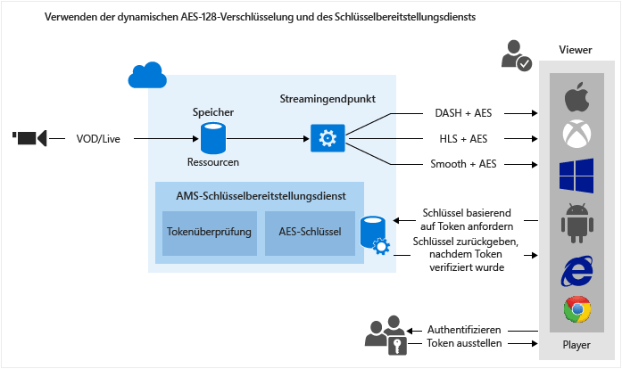

<properties
	pageTitle="Verwenden der dynamischen AES-128-Verschlüsselung und des Schlüsselübermittlungsdiensts"
	description="Mit Microsoft Azure Media Services können Sie Inhalte übermitteln, die mit 128-Bit-AES-Verschlüsselungsschlüsseln verschlüsselt wurden. Media Services stellt außerdem den Schlüsselübermittlungsdienst bereit, der Verschlüsselungsschlüssel an autorisierte Benutzer übermittelt. In diesem Thema werden das dynamische Verschlüsseln mit AES-128 und das Verwenden des Schlüsselübermittlungsdiensts behandelt."
	services="media-services"
	documentationCenter=""
	authors="Juliako"
	manager="dwrede"
	editor=""/>

<tags
	ms.service="media-services"
	ms.workload="media"
	ms.tgt_pltfrm="na"
	ms.devlang="na"
	ms.topic="get-started-article" 
 	ms.date="02/03/2016"  
	ms.author="juliako"/>

#Verwenden der dynamischen AES-128-Verschlüsselung und des Schlüsselübermittlungsdiensts

> [AZURE.SELECTOR]
- [.NET](media-services-protect-with-aes128.md)
- [Java](https://github.com/southworkscom/azure-sdk-for-media-services-java-samples)
- [PHP](https://github.com/Azure/azure-sdk-for-php/tree/master/examples/MediaServices)

##Übersicht

Mit Microsoft Azure Media Services können Sie HTTP Live Streaming-Inhalte (HLS) und Smooth Streams übermitteln, die mit AES (Advanced Encryption Standard) und 128-Bit-Verschlüsselungsschlüsseln verschlüsselt sind. Media Services stellt außerdem den Schlüsselübermittlungsdienst bereit, der Verschlüsselungsschlüssel an autorisierte Benutzer übermittelt. Wenn ein Medienobjekt von Media Services verschlüsselt werden soll, müssen Sie dem Medienobjekt einen Verschlüsselungsschlüssel zuordnen und außerdem Autorisierungsrichtlinien für den Schlüssel konfigurieren. Wenn ein Stream von einem Player angefordert wird, verwendet Media Services den angegebenen Schlüssel, um Ihren Inhalt dynamisch mit AES zu verschlüsseln. Um den Stream zu entschlüsseln, fordert der Player den Schlüssel vom Schlüsselübermittlungsdienst an. Um zu entscheiden, ob der Benutzer berechtigt ist, den Schlüssel zu erhalten, wertet der Dienst die Autorisierungsrichtlinien aus, die Sie für den Schlüssel angegeben haben.

Media Services unterstützt mehrere Möglichkeiten zur Authentifizierung von Benutzern, die Schlüssel anfordern. Die Autorisierungsrichtlinie für Inhaltsschlüssel kann eine oder mehrere Autorisierungseinschränkungen aufweisen: offen, Tokeneinschränkung oder IP-Einschränkung. Die durch Token eingeschränkte Richtlinie gilt nur zusammen mit einem Token, das von einem Secure Token Service (STS) ausgestellt wurde. Media Services unterstützt Token im Format [Simple Web Tokens (SWT)](https://msdn.microsoft.com/library/gg185950.aspx#BKMK_2) und [JSON Web Token (JWT)](https://msdn.microsoft.com/library/gg185950.aspx#BKMK_3). Weitere Informationen finden Sie unter [Konfigurieren einer Autorisierungsrichtlinie für Inhaltsschlüssel](media-services-protect-with-aes128.md#configure_key_auth_policy).

Damit dynamische Verschlüsselung genutzt werden kann, müssen Sie über ein Medienobjekt verfügen, das eine Sammlung aus MP4-Dateien mit mehreren Bitraten oder Smooth Streaming-Quelldateien mit mehreren Bitraten enthält. Außerdem müssen Sie die Übermittlungsrichtlinie für das Medienobjekt konfigurieren (weiter unten in diesem Thema beschrieben). Basierend auf dem angegebenen Format in der Streaming-URL stellt der On-Demand-Streaming-Server dann sicher, dass der Datenstrom im ausgewählten Protokoll übermittelt wird. So müssen Sie die Dateien nur in einem Speicherformat speichern und bezahlen. Die entsprechende Antwort wird von Media Services basierend auf Clientanforderungen erstellt und verfügbar gemacht.

Dieses Thema richtet sich an Entwickler, die an Anwendungen arbeiten, die geschützte Medieninhalte übermitteln. In dem Thema wird gezeigt, wie Sie den Schlüsselübermittlungsdienst mit Autorisierungsrichtlinien konfigurieren, damit nur autorisierte Clients die Verschlüsselungsschlüssel empfangen können. Außerdem wird gezeigt, wie dynamische Verschlüsselung verwendet wird.

>[AZURE.NOTE]Damit Sie mit der Verwendung der dynamischen Verschlüsselung beginnen können, müssen Sie zuerst mindestens eine "Scale Unit" (auch als "Streaming Unit" bezeichnet) abrufen. Weitere Informationen finden Sie unter [Skalieren eines Mediendiensts](media-services-manage-origins.md#scale_streaming_endpoints).

##Workflow für dynamische AES-128-Verschlüsselung und Schlüsselübermittlungsdienst

Die folgenden allgemeinen Schritte müssen Sie ausführen, wenn Sie Medienobjekte mit AES verschlüsseln und dabei den Media Services-Schlüsselübermittlungsdienst sowie dynamische Verschlüsselung verwenden möchten.

1. [Erstellen eines Medienobjekts und Hochladen von Dateien in das Medienobjekt](media-services-protect-with-aes128.md#create_asset). 
1. [Codieren eines Medienobjekts, das die Sammlung von MP4-Dateien mit adaptiver Bitrate enthält](media-services-protect-with-aes128.md#encode_asset).
1. [Erstellen eines Inhaltsschlüssels und Zuordnen des Schlüssels zum codierten Medienobjekt](media-services-protect-with-aes128.md#create_contentkey). In Media Services enthält der Inhaltsschlüssel den Verschlüsselungsschlüssel des Medienobjekts.
1. [Konfigurieren der Autorisierungsrichtlinie des Inhaltsschlüssels](media-services-protect-with-aes128.md#configure_key_auth_policy). Die Inhaltsschlüssel-Authentifizierungsrichtlinie muss von Ihnen konfiguriert und vom Client erfüllt werden, damit der Inhaltsschlüssel an den Client übermittelt wird. 
1. [Konfigurieren der Übermittlungsrichtlinie für ein Medienobjekt](media-services-protect-with-aes128.md#configure_asset_delivery_policy). Die Konfiguration der Übermittlungsrichtlinie umfasst Folgendes: URL für den Schlüsselerwerb und Initialisierungsvektor (IV) (für AES 128 muss beim Ver- und Entschlüsseln der gleiche IV bereitgestellt werden), Übermittlungsprotokoll (z. B. MPEG DASH, HLS, HDS, Smooth Streaming oder alle) sowie der Typ der dynamischen Verschlüsselung (z. B. Umschlag oder keine dynamische Verschlüsselung). 

	Sie können unterschiedliche Richtlinien für jedes Protokoll für das gleiche Medienobjekt anwenden. Sie können z. B. PlayReady-Verschlüsselung auf Smooth/DASH und AES Envelope auf HLS anwenden. Alle Protokolle, die nicht in einer Übermittlungsrichtlinie definiert sind (wenn Sie z. B. eine einzelne Richtlinie hinzufügen, die nur HLS als Protokoll angibt), werden vom Streaming ausgeschlossen. Die einzige Ausnahme besteht darin, wenn Sie überhaupt keine Übermittlungsrichtlinie für Medienobjekte definiert haben. In diesem Fall sind alle Protokolle ohne Verschlüsselung zulässig.

1. [Erstellen eines "OnDemand"-Locators](media-services-protect-with-aes128.md#create_locator), um eine Streaming-URL zu erhalten.

Außerdem wird in diesem Thema gezeigt, [wie der Client einen Schlüssel vom Schlüsselübermittlungsdienst anfordern kann](media-services-protect-with-aes128.md#client_request).

Sie finden ein vollständiges .NET-[Beispiel](media-services-protect-with-aes128.md#example) am Ende des Themas.

In der folgenden Abbildung wird der oben beschriebene Workflow gezeigt. Hier wird das Token zur Authentifizierung verwendet.

Im weiteren Verlauf finden Sie ausführliche Beschreibungen, Codebeispiele und Links zu Themen, die Sie informieren, wie die oben beschriebenen Aufgaben ausgeführt werden.

##Aktuelle Einschränkungen

Wenn Sie die Übermittlungsrichtlinie eines Medienobjekts hinzufügen oder aktualisieren, müssen Sie einen vorhandenen Locator (sofern vorhanden) löschen und einen neuen Locator erstellen.

##Erstellen eines Medienobjekts und Hochladen von Dateien in das Medienobjekt

Damit Sie Ihre Videos verwalten, codieren und streamen können, müssen Sie Ihre Inhalte zuerst in Microsoft Azure Media Services hochladen. Nachdem dies geschehen ist, sind Ihre Inhalte sicher in der Cloud zur weiteren Verarbeitung und zum weiteren Streaming gespeichert.

Ausführliche Informationen finden Sie unter [Hochladen von Dateien in ein Media Services-Konto ](media-services-dotnet-upload-files.md).

##Codieren eines Medienobjekts, das die Sammlung von MP4-Dateien mit adaptiver Bitrate enthält

Bei der dynamischen Verschlüsselung müssen Sie nur ein Medienobjekt erstellen, das eine Sammlung aus MP4-Dateien mit mehreren Bitraten oder Smooth Streaming-Quelldateien mit mehreren Bitraten enthält. Dann wird durch den bedarfsgesteuerten Streamingserver auf Basis des in der Manifest- oder Fragmentanforderung angegebenen Formats sichergestellt, dass Sie den Datenstrom im ausgewählten Protokoll erhalten. So müssen Sie die Dateien nur in einem Speicherformat speichern und bezahlen. Die entsprechende Antwort wird von Media Services basierend auf Clientanforderungen erstellt und verfügbar gemacht. Weitere Informationen finden Sie unter [Dynamische Paketerstellung – Übersicht](media-services-dynamic-packaging-overview.md).

Informationen zum Codieren finden Sie unter [Codieren eines Assets mit Media Encoder Standard](media-services-dotnet-encode-with-media-encoder-standard.md).

##Erstellen eines Inhaltsschlüssels und Zuordnen des Schlüssels zum codierten Medienobjekt

In Media Services enthält der Inhaltsschlüssel den Schlüssel, mit dem ein Medienobjekt verschlüsselt werden soll.

Ausführliche Informationen finden Sie unter [Erstellen eines Inhaltsschlüssels](media-services-dotnet-create-contentkey.md).

##Konfigurieren einer Autorisierungsrichtlinie für Inhaltsschlüssel

Media Services unterstützt mehrere Möglichkeiten zur Authentifizierung von Benutzern, die Schlüssel anfordern. Die Inhaltsschlüssel-Authentifizierungsrichtlinie muss von Ihnen konfiguriert und vom Client (Player) erfüllt werden, damit der Schlüssel an den Client übermittelt wird. Die Autorisierungsrichtlinie für Inhaltsschlüssel kann eine oder mehrere Autorisierungseinschränkungen aufweisen: offen, Tokeneinschränkung oder IP-Einschränkung.

Weitere Informationen finden Sie unter [Konfigurieren einer Autorisierungsrichtlinie für Inhaltsschlüssel](media-services-dotnet-configure-content-key-auth-policy.md).

##Konfigurieren der Übermittlungsrichtlinie für Medienobjekte 

Konfigurieren Sie die Übermittlungsrichtlinie für Medienobjekte. Die Konfiguration der Übermittlungsrichtlinie für Medienobjekte umfasst Folgendes:

- URL für den Schlüsselerwerb. 
- Initialisierungsvektor (IV) für die Umschlagverschlüsselung. Für AES 128 muss beim Ver- und Entschlüsseln der gleiche IV bereitgestellt werden. 
- Übermittlungsprotokoll für Medienobjekte (z. B. MPEG DASH, HLS, HDS, Smooth Streaming oder alle).
- Typ der dynamischen Verschlüsselung (z. B. AES-Umschlag) oder keine dynamische Verschlüsselung. 

Weitere Informationen finden Sie unter [Konfigurieren der Übermittlungsrichtlinie für Medienobjekte](media-services-rest-configure-asset-delivery-policy.md).

##Erstellen eines OnDemand-Streaminglocators, um eine Streaming-URL abzurufen

Sie müssen die Streaming-URL für Smooth Streaming, DASH oder HLS für Ihre Benutzer bereitstellen.

>[AZURE.NOTE]Wenn Sie die Übermittlungsrichtlinie eines Medienobjekts hinzufügen oder aktualisieren, müssen Sie einen vorhandenen Locator (sofern vorhanden) löschen und einen neuen Locator erstellen.

Anweisungen zum Veröffentlichen eines Medienobjekts und Erstellen einer Streaming-URL finden Sie unter [Erstellen einer Streaming-URL](media-services-deliver-streaming-content.md).

##Abrufen eines Testtokens

Rufen Sie ein Testtoken ab, das auf der Tokeneinschränkung basiert, die für die Schlüsselautorisierungsrichtlinie verwendet wurde.

	// Deserializes a string containing an Xml representation of a TokenRestrictionTemplate
	// back into a TokenRestrictionTemplate class instance.
	TokenRestrictionTemplate tokenTemplate = 
	    TokenRestrictionTemplateSerializer.Deserialize(tokenTemplateString);
	
	// Generate a test token based on the data in the given TokenRestrictionTemplate.
	//The GenerateTestToken method returns the token without the word “Bearer” in front
	//so you have to add it in front of the token string. 
	string testToken = TokenRestrictionTemplateSerializer.GenerateTestToken(tokenTemplate);
	Console.WriteLine("The authorization token is:\nBearer {0}", testToken);

Sie können den [AMS Player](http://amsplayer.azurewebsites.net/azuremediaplayer.html) zum Testen des Datenstroms verwenden.

##Wie kann der Client einen Schlüssel vom Schlüsselübermittlungsdienst anfordern?

Im vorherigen Schritt haben Sie die URL erstellt, die auf eine Manifestdatei verweist. Der Client muss die notwendigen Informationen aus den Streamingmanifestdateien extrahieren, um die Anforderung an den Schlüsselübermittlungsdienst zu stellen.

###Manifestdateien

Der Client muss den URL-Wert aus der Manifestdatei extrahieren. Der URL-Wert enthält außerdem die Inhaltsschlüssel-ID ("kid"). Dann versucht der Client, den Verschlüsselungsschlüssel vom Schlüsselübermittlungsdienst abzurufen. Außerdem muss der Client den IV-Wert extrahieren und damit den Datenstrom entschlüsseln. Der folgende Ausschnitt zeigt das <Protection>-Element des Smooth Streaming-Manifests.

	<Protection>
	  <ProtectionHeader SystemID="B47B251A-2409-4B42-958E-08DBAE7B4EE9">
	    <ContentProtection xmlns:sea="urn:mpeg:dash:schema:sea:2012" schemeIdUri="urn:mpeg:dash:sea:2012">
	      <sea:SegmentEncryption schemeIdUri="urn:mpeg:dash:sea:aes128-cbc:2013"/>
	      <sea:KeySystem keySystemUri="urn:mpeg:dash:sea:keysys:http:2013"/>
	      <sea:CryptoPeriod IV="0xD7D7D7D7D7D7D7D7D7D7D7D7D7D7D7D7" 
	                        keyUriTemplate="https://wamsbayclus001kd-hs.cloudapp.net/HlsHandler.ashx?
	                                        kid=da3813af-55e6-48e7-aa9f-a4d6031f7b4d"/>
	    </ContentProtection>
	  </ProtectionHeader>
	</Protection>

Im Fall von HLS wird das Stammmanifest in Segmentdateien aufgeteilt.

Beispiel für das Stammmanifest: http://test001.origin.mediaservices.windows.net/8bfe7d6f-34e3-4d1a-b289-3e48a8762490/BigBuckBunny.ism/manifest(format=m3u8-aapl. Es enthält eine Liste der Segmentdateinamen.
	
	. . . 
	#EXT-X-STREAM-INF:PROGRAM-ID=1,BANDWIDTH=630133,RESOLUTION=424x240,CODECS="avc1.4d4015,mp4a.40.2",AUDIO="audio"
	QualityLevels(514369)/Manifest(video,format=m3u8-aapl)
	#EXT-X-STREAM-INF:PROGRAM-ID=1,BANDWIDTH=965441,RESOLUTION=636x356,CODECS="avc1.4d401e,mp4a.40.2",AUDIO="audio"
	QualityLevels(842459)/Manifest(video,format=m3u8-aapl)
	…

Wenn Sie eine der Segmentdateien in einem Text-Editor öffnen (z. B. http://test001.origin.mediaservices.windows.net/8bfe7d6f-34e3-4d1a-b289-3e48a8762490/BigBuckBunny.ism/QualityLevels(514369)/Manifest(video,format=m3u8-aapl)), sollte sie #EXT-X-KEY enthalten, was angibt, dass die Datei verschlüsselt ist.
	
	#EXTM3U
	#EXT-X-VERSION:4
	#EXT-X-ALLOW-CACHE:NO
	#EXT-X-MEDIA-SEQUENCE:0
	#EXT-X-TARGETDURATION:9
	#EXT-X-KEY:METHOD=AES-128,
	URI="https://wamsbayclus001kd-hs.cloudapp.net/HlsHandler.ashx?
	     kid=da3813af-55e6-48e7-aa9f-a4d6031f7b4d",
	        IV=0XD7D7D7D7D7D7D7D7D7D7D7D7D7D7D7D7
	#EXT-X-PROGRAM-DATE-TIME:1970-01-01T00:00:00.000+00:00
	#EXTINF:8.425708,no-desc
	Fragments(video=0,format=m3u8-aapl)
	#EXT-X-ENDLIST
	
###Anfordern des Schlüssels vom Schlüsselübermittlungsdienst

Im folgenden Code wird gezeigt, wie Sie eine Anforderung an den Media Services-Schlüsselübermittlungsdienst senden und dabei einen aus dem Manifest extrahierten Schlüsselübermittlungs-URI und ein Token senden. (Das Abrufen einfacher Webtoken aus einem sicheren Tokendienst wird in diesem Thema nicht behandelt.)

	private byte[] GetDeliveryKey(Uri keyDeliveryUri, string token)
	{
	    HttpWebRequest request = (HttpWebRequest)WebRequest.Create(keyDeliveryUri);
	            
	    request.Method = "POST";
	    request.ContentType = "text/xml";
	    if (!string.IsNullOrEmpty(token))
	    {
	        request.Headers[AuthorizationHeader] = token;
	    }
	    request.ContentLength = 0;
	
	    var response = request.GetResponse();
	 
	    var stream = response.GetResponseStream();
	    if (stream == null)
	    {
	        throw new NullReferenceException("Response stream is null");
	    }
	
	    var buffer = new byte[256];
	    var length = 0;
	    while (stream.CanRead && length <= buffer.Length)
	    {
	        var nexByte = stream.ReadByte();
	        if (nexByte == -1)
	        {
	            break;
	        }
	        buffer[length] = (byte)nexByte;
	        length++;
	    }
	    response.Close();
	
	    // AES keys must be exactly 16 bytes (128 bits).
	    var key = new byte[length];
	    Array.Copy(buffer, key, length);
	    return key;
	}
	
##Beispiel

1. Erstellen Sie ein neues Konsolenprojekt.
1. Verwenden Sie NuGet, um Azure Media Services .NET SDK-Erweiterungen zu installieren und hinzuzufügen. Durch Installieren dieses Pakets werden auch das Media Services .NET SDK installiert und alle anderen erforderlichen Abhängigkeiten hinzugefügt.
2. Fügen Sie eine CONFIG-Datei hinzu, die den Kontonamen und Schlüsselinformationen enthält:

	
		<?xml version="1.0" encoding="utf-8"?>
		<configuration>
		    <startup> 
		        <supportedRuntime version="v4.0" sku=".NETFramework,Version=v4.5" />
		    </startup>
			  <appSettings>
			
			    <add key="MediaServicesAccountName" value="AccountName"/>
			    <add key="MediaServicesAccountKey" value="AccountKey"/>
			
			    <add key="Issuer" value="http://testacs.com"/>
			    <add key="Audience" value="urn:test"/>
			  </appSettings>
		</configuration>

1. Überschreiben Sie den Code in Ihrer Datei "Program.cs" mit dem in diesem Abschnitt gezeigten Code.
	
	Stellen Sie sicher, dass die Variablen so aktualisiert werden, dass sie auf die Ordner zeigen, in denen sich Ihre Eingabedateien befinden.
			
		
		using System;
		using System.Collections.Generic;
		using System.Configuration;
		using System.IO;
		using System.Linq;
		using System.Net;
		using System.Security.Cryptography;
		using System.Text;
		using System.Threading.Tasks;
		using Microsoft.WindowsAzure.MediaServices.Client;
		using Newtonsoft.Json.Linq;
		using System.Threading;
		using Microsoft.WindowsAzure.MediaServices.Client.ContentKeyAuthorization;
		using Microsoft.WindowsAzure.MediaServices.Client.DynamicEncryption;
		using System.Web;
		using System.Globalization;
		
		namespace AESDynamicEncryptionAndKeyDeliverySvc
		{
		    class Program
		    {
		        // Read values from the App.config file.
		        private static readonly string _mediaServicesAccountName =
		            ConfigurationManager.AppSettings["MediaServicesAccountName"];
		        private static readonly string _mediaServicesAccountKey =
		            ConfigurationManager.AppSettings["MediaServicesAccountKey"];
		
		        // A Uri describing the issuer of the token.  
		        // Must match the value in the token for the token to be considered valid.
		        private static readonly Uri _sampleIssuer =
		            new Uri(ConfigurationManager.AppSettings["Issuer"]);
		        // The Audience or Scope of the token.  
		        // Must match the value in the token for the token to be considered valid.
		        private static readonly Uri _sampleAudience =
		            new Uri(ConfigurationManager.AppSettings["Audience"]);
		
		        // Field for service context.
		        private static CloudMediaContext _context = null;
		        private static MediaServicesCredentials _cachedCredentials = null;
		
		        private static readonly string _mediaFiles =
		            Path.GetFullPath(@"../..\Media");
		
		        private static readonly string _singleMP4File =
		            Path.Combine(_mediaFiles, @"BigBuckBunny.mp4");
		
		
		        static void Main(string[] args)
		        {
		            // Create and cache the Media Services credentials in a static class variable.
		            _cachedCredentials = new MediaServicesCredentials(
		                            _mediaServicesAccountName,
		                            _mediaServicesAccountKey);
		            // Used the chached credentials to create CloudMediaContext.
		            _context = new CloudMediaContext(_cachedCredentials);
		
		            bool tokenRestriction = false;
		            string tokenTemplateString = null;
		
		            IAsset asset = UploadFileAndCreateAsset(_singleMP4File);
		            Console.WriteLine("Uploaded asset: {0}", asset.Id);
		
		            IAsset encodedAsset = EncodeToAdaptiveBitrateMP4Set(asset);
		            Console.WriteLine("Encoded asset: {0}", encodedAsset.Id);
		
		            IContentKey key = CreateEnvelopeTypeContentKey(encodedAsset);
		            Console.WriteLine("Created key {0} for the asset {1} ", key.Id, encodedAsset.Id);
		            Console.WriteLine();
		
		            if (tokenRestriction)
		                tokenTemplateString = AddTokenRestrictedAuthorizationPolicy(key);
		            else
		                AddOpenAuthorizationPolicy(key);
		
		            Console.WriteLine("Added authorization policy: {0}", key.AuthorizationPolicyId);
		            Console.WriteLine();
		
		            CreateAssetDeliveryPolicy(encodedAsset, key);
		            Console.WriteLine("Created asset delivery policy. \n");
		            Console.WriteLine();
		
		            if (tokenRestriction && !String.IsNullOrEmpty(tokenTemplateString))
		            {
		                // Deserializes a string containing an Xml representation of a TokenRestrictionTemplate
		                // back into a TokenRestrictionTemplate class instance.
		                TokenRestrictionTemplate tokenTemplate =
		                    TokenRestrictionTemplateSerializer.Deserialize(tokenTemplateString);
		
		                // Generate a test token based on the data in the given TokenRestrictionTemplate.
		                // Note, you need to pass the key id Guid because we specified 
		                // TokenClaim.ContentKeyIdentifierClaim in during the creation of TokenRestrictionTemplate.
		                Guid rawkey = EncryptionUtils.GetKeyIdAsGuid(key.Id);
		
		                //The GenerateTestToken method returns the token without the word “Bearer” in front
		                //so you have to add it in front of the token string. 
		                string testToken = TokenRestrictionTemplateSerializer.GenerateTestToken(tokenTemplate, null, rawkey);
		                Console.WriteLine("The authorization token is:\nBearer {0}", testToken);
		                Console.WriteLine();
		            }
		
		            // You can use the bit.ly/aesplayer Flash player to test the URL 
		            // (with open authorization policy). 
		            // Paste the URL and click the Update button to play the video. 
		            //
		            string URL = GetStreamingOriginLocator(encodedAsset);
		            Console.WriteLine("Smooth Streaming Url: {0}/manifest", URL);
		            Console.WriteLine();
		            Console.WriteLine("HLS Url: {0}/manifest(format=m3u8-aapl)", URL);
		            Console.WriteLine();
		
		            Console.ReadLine();
		        }
		
		        static public IAsset UploadFileAndCreateAsset(string singleFilePath)
		        {
		            if (!File.Exists(singleFilePath))
		            {
		                Console.WriteLine("File does not exist.");
		                return null;
		            }
		
		            var assetName = Path.GetFileNameWithoutExtension(singleFilePath);
		            IAsset inputAsset = _context.Assets.Create(assetName, AssetCreationOptions.StorageEncrypted);
		
		            var assetFile = inputAsset.AssetFiles.Create(Path.GetFileName(singleFilePath));
		
		            Console.WriteLine("Created assetFile {0}", assetFile.Name);
		
		            var policy = _context.AccessPolicies.Create(
		                                    assetName,
		                                    TimeSpan.FromDays(30),
		                                    AccessPermissions.Write | AccessPermissions.List);
		
		            var locator = _context.Locators.CreateLocator(LocatorType.Sas, inputAsset, policy);
		
		            Console.WriteLine("Upload {0}", assetFile.Name);
		
		            assetFile.Upload(singleFilePath);
		            Console.WriteLine("Done uploading {0}", assetFile.Name);
		
		            locator.Delete();
		            policy.Delete();
		
		            return inputAsset;
		        }
		
		        static public IAsset EncodeToAdaptiveBitrateMP4Set(IAsset asset)
		        {
		            // Declare a new job.
		            IJob job = _context.Jobs.Create("Media Encoder Standard Job");
		            // Get a media processor reference, and pass to it the name of the 
		            // processor to use for the specific task.
		            IMediaProcessor processor = GetLatestMediaProcessorByName("Media Encoder Standard");
		
		            // Create a task with the encoding details, using a string preset.
		            // In this case "H264 Multiple Bitrate 720p" preset is used.
		            ITask task = job.Tasks.AddNew("My encoding task",
		                processor,
		                "H264 Multiple Bitrate 720p",
		                TaskOptions.None);
		
		            // Specify the input asset to be encoded.
		            task.InputAssets.Add(asset);
		            // Add an output asset to contain the results of the job. 
		            // This output is specified as AssetCreationOptions.None, which 
		            // means the output asset is not encrypted. 
		            task.OutputAssets.AddNew("Output asset",
		                AssetCreationOptions.None);
		
		            job.StateChanged += new EventHandler<JobStateChangedEventArgs>(JobStateChanged);
		            job.Submit();
		            job.GetExecutionProgressTask(CancellationToken.None).Wait();
		
		            return job.OutputMediaAssets[0];
		        }
		
		        private static IMediaProcessor GetLatestMediaProcessorByName(string mediaProcessorName)
		        {
		            var processor = _context.MediaProcessors.Where(p => p.Name == mediaProcessorName).
		            ToList().OrderBy(p => new Version(p.Version)).LastOrDefault();
		
		            if (processor == null)
		                throw new ArgumentException(string.Format("Unknown media processor", mediaProcessorName));
		
		            return processor;
		        }
		
		        static public IContentKey CreateEnvelopeTypeContentKey(IAsset asset)
		        {
		            // Create envelope encryption content key
		            Guid keyId = Guid.NewGuid();
		            byte[] contentKey = GetRandomBuffer(16);
		
		            IContentKey key = _context.ContentKeys.Create(
		                                    keyId,
		                                    contentKey,
		                                    "ContentKey",
		                                    ContentKeyType.EnvelopeEncryption);
		
		            // Associate the key with the asset.
		            asset.ContentKeys.Add(key);
		
		            return key;
		        }
		
		        static public void AddOpenAuthorizationPolicy(IContentKey contentKey)
		        {
		            // Create ContentKeyAuthorizationPolicy with Open restrictions 
		            // and create authorization policy             
		            IContentKeyAuthorizationPolicy policy = _context.
		                                    ContentKeyAuthorizationPolicies.
		                                    CreateAsync("Open Authorization Policy").Result;
		
		            List<ContentKeyAuthorizationPolicyRestriction> restrictions =
		                new List<ContentKeyAuthorizationPolicyRestriction>();
		
		            ContentKeyAuthorizationPolicyRestriction restriction =
		                new ContentKeyAuthorizationPolicyRestriction
		                {
		                    Name = "HLS Open Authorization Policy",
		                    KeyRestrictionType = (int)ContentKeyRestrictionType.Open,
		                    Requirements = null // no requirements needed for HLS
		                        };
		
		            restrictions.Add(restriction);
		
		            IContentKeyAuthorizationPolicyOption policyOption =
		                _context.ContentKeyAuthorizationPolicyOptions.Create(
		                "policy",
		                ContentKeyDeliveryType.BaselineHttp,
		                restrictions,
		                "");
		
		            policy.Options.Add(policyOption);
		
		            // Add ContentKeyAutorizationPolicy to ContentKey
		            contentKey.AuthorizationPolicyId = policy.Id;
		            IContentKey updatedKey = contentKey.UpdateAsync().Result;
		            Console.WriteLine("Adding Key to Asset: Key ID is " + updatedKey.Id);
		        }
		
		        public static string AddTokenRestrictedAuthorizationPolicy(IContentKey contentKey)
		        {
		            string tokenTemplateString = GenerateTokenRequirements();
		
		            IContentKeyAuthorizationPolicy policy = _context.
		                                    ContentKeyAuthorizationPolicies.
		                                    CreateAsync("HLS token restricted authorization policy").Result;
		
		            List<ContentKeyAuthorizationPolicyRestriction> restrictions =
		                    new List<ContentKeyAuthorizationPolicyRestriction>();
		
		            ContentKeyAuthorizationPolicyRestriction restriction =
		                    new ContentKeyAuthorizationPolicyRestriction
		                    {
		                        Name = "Token Authorization Policy",
		                        KeyRestrictionType = (int)ContentKeyRestrictionType.TokenRestricted,
		                        Requirements = tokenTemplateString
		                    };
		
		            restrictions.Add(restriction);
		
		            //You could have multiple options 
		            IContentKeyAuthorizationPolicyOption policyOption =
		                _context.ContentKeyAuthorizationPolicyOptions.Create(
		                    "Token option for HLS",
		                    ContentKeyDeliveryType.BaselineHttp,
		                    restrictions,
		                    null  // no key delivery data is needed for HLS
		                    );
		
		            policy.Options.Add(policyOption);
		
		            // Add ContentKeyAutorizationPolicy to ContentKey
		            contentKey.AuthorizationPolicyId = policy.Id;
		            IContentKey updatedKey = contentKey.UpdateAsync().Result;
		            Console.WriteLine("Adding Key to Asset: Key ID is " + updatedKey.Id);
		
		            return tokenTemplateString;
		        }
		
		        static public void CreateAssetDeliveryPolicy(IAsset asset, IContentKey key)
		        {
		            Uri keyAcquisitionUri = key.GetKeyDeliveryUrl(ContentKeyDeliveryType.BaselineHttp);
		
		            string envelopeEncryptionIV = Convert.ToBase64String(GetRandomBuffer(16));
		
		            // The following policy configuration specifies: 
		            //   key url that will have KID=<Guid> appended to the envelope and
		            //   the Initialization Vector (IV) to use for the envelope encryption.
		            Dictionary<AssetDeliveryPolicyConfigurationKey, string> assetDeliveryPolicyConfiguration =
		                new Dictionary<AssetDeliveryPolicyConfigurationKey, string>
		            {
		                        {AssetDeliveryPolicyConfigurationKey.EnvelopeKeyAcquisitionUrl, keyAcquisitionUri.ToString()},
		                        {AssetDeliveryPolicyConfigurationKey.EnvelopeEncryptionIVAsBase64, envelopeEncryptionIV}
		            };
		
		            IAssetDeliveryPolicy assetDeliveryPolicy =
		                _context.AssetDeliveryPolicies.Create(
		                            "AssetDeliveryPolicy",
		                            AssetDeliveryPolicyType.DynamicEnvelopeEncryption,
		                            AssetDeliveryProtocol.SmoothStreaming | AssetDeliveryProtocol.HLS,
		                            assetDeliveryPolicyConfiguration);
		
		            // Add AssetDelivery Policy to the asset
		            asset.DeliveryPolicies.Add(assetDeliveryPolicy);
		            Console.WriteLine();
		            Console.WriteLine("Adding Asset Delivery Policy: " +
		                assetDeliveryPolicy.AssetDeliveryPolicyType);
		        }
		
		        static public string GetStreamingOriginLocator(IAsset asset)
		        {
		
		            // Get a reference to the streaming manifest file from the  
		            // collection of files in the asset. 
		
		            var assetFile = asset.AssetFiles.Where(f => f.Name.ToLower().
		                                        EndsWith(".ism")).
		                                        FirstOrDefault();
		
		            // Create a 30-day readonly access policy. 
                	// You cannot create a streaming locator using an AccessPolicy that includes write or delete permissions.            
		            IAccessPolicy policy = _context.AccessPolicies.Create("Streaming policy",
		                TimeSpan.FromDays(30),
		                AccessPermissions.Read);
		
		            // Create a locator to the streaming content on an origin. 
		            ILocator originLocator = _context.Locators.CreateLocator(LocatorType.OnDemandOrigin, asset,
		                policy,
		                DateTime.UtcNow.AddMinutes(-5));
		
		            // Create a URL to the manifest file. 
		            return originLocator.Path + assetFile.Name;
		        }
		
		        static private string GenerateTokenRequirements()
		        {
		            TokenRestrictionTemplate template = new TokenRestrictionTemplate(TokenType.SWT);
		
		            template.PrimaryVerificationKey = new SymmetricVerificationKey();
		            template.AlternateVerificationKeys.Add(new SymmetricVerificationKey());
		            template.Audience = _sampleAudience.ToString();
		            template.Issuer = _sampleIssuer.ToString();
		
		            template.RequiredClaims.Add(TokenClaim.ContentKeyIdentifierClaim);
		
		            return TokenRestrictionTemplateSerializer.Serialize(template);
		        }
		
		        static private void JobStateChanged(object sender, JobStateChangedEventArgs e)
		        {
		            Console.WriteLine(string.Format("{0}\n  State: {1}\n  Time: {2}\n\n",
		                ((IJob)sender).Name,
		                e.CurrentState,
		                DateTime.UtcNow.ToString(@"yyyy_M_d__hh_mm_ss")));
		        }
		
		        static private byte[] GetRandomBuffer(int size)
		        {
		            byte[] randomBytes = new byte[size];
		            using (RNGCryptoServiceProvider rng = new RNGCryptoServiceProvider())
		            {
		                rng.GetBytes(randomBytes);
		            }
		
		            return randomBytes;
		        }
		    }
		}

##Media Services-Lernpfade

[AZURE.INCLUDE [media-services-learning-paths-include](../../includes/media-services-learning-paths-include.md)]

##Feedback geben

[AZURE.INCLUDE [media-services-user-voice-include](../../includes/media-services-user-voice-include.md)]

<!---HONumber=AcomDC_0211_2016-->