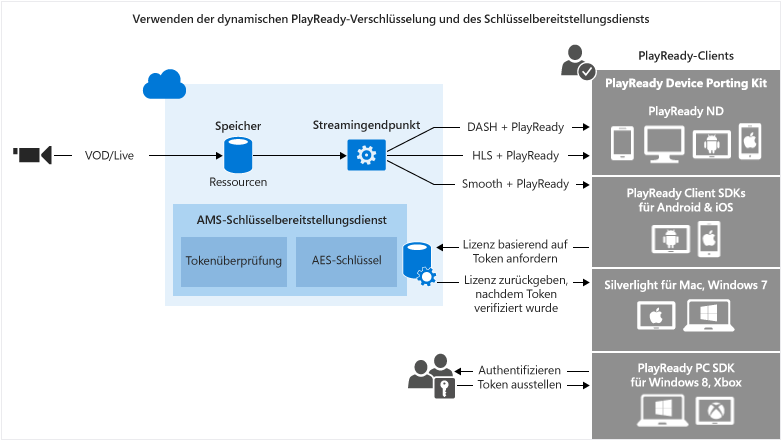

<properties
	pageTitle="Verwenden der dynamischen PlayReady DRM-Verschlüsselung und des Lizenzübermittlungsdiensts"
	description="Mit Microsoft Azure Media Services können Sie MPEG-DASH-, Smooth Streaming- und Http-Live-Streaming (HLS)-Streams übermitteln, die mit Microsoft PlayReady DRM geschützt sind. In diesem Thema werden das dynamische Verschlüsseln mit PlayReady DRM und das Verwenden des Schlüsselübermittlungsdiensts behandelt."
	services="media-services"
	documentationCenter=""
	authors="Juliako"
	manager="dwrede"
	editor=""/>

<tags
	ms.service="media-services"
	ms.workload="media"
	ms.tgt_pltfrm="na"
	ms.devlang="na"
	ms.topic="get-started-article"
	ms.date="08/14/2015"
	ms.author="juliako"/>

#Verwenden der dynamischen PlayReady DRM-Verschlüsselung und des Lizenzübermittlungsdiensts

> [AZURE.SELECTOR]
- [.NET](media-services-protect-with-drm.md)
- [Java](https://github.com/southworkscom/azure-sdk-for-media-services-java-samples)

Mit Microsoft Azure Media Services können Sie MPEG-DASH-, Smooth Streaming- und Http-Live-Streaming (HLS)-Streams übermitteln, die mit [Microsoft PlayReady DRM](https://www.microsoft.com/playready/overview/) geschützt sind.

Media Services bietet jetzt einen Dienst für die Bereitstellung von Microsoft PlayReady-Lizenzen. Mithilfe der von Media Services bereitgestellten APIs können Sie die Rechte und Einschränkungen konfigurieren, die für die PlayReady-DRM-Laufzeit erzwungen werden sollen, wenn ein Benutzer versucht, geschützte Inhalte wiederzugeben. Wenn ein Benutzer durch PlayReady geschützte Inhalte anfordert, fordert die Clientwiedergabeanwendung die Inhalte von Azure Media Services an. Azure Media Services leitet den Client dann an einen Azure Media Services PlayReady-Lizenzierungsserver weiter, der den Zugriff des Benutzers auf die Inhalte authentifiziert und autorisiert. Eine PlayReady-Lizenz enthält den Entschlüsselungsschlüssel, der vom Clientplayer zum Entschlüsseln und Streamen des Inhalts verwendet werden kann.

Media Services unterstützt mehrere Möglichkeiten zur Authentifizierung von Benutzern, die Schlüssel anfordern. Die Autorisierungsrichtlinie für Inhaltsschlüssel kann eine oder mehrere Autorisierungseinschränkungen aufweisen: offen, Tokeneinschränkung oder IP-Einschränkung. Die durch Token eingeschränkte Richtlinie gilt nur zusammen mit einem Token, das von einem Secure Token Service (STS) ausgestellt wurde. Media Services unterstützt Token im [Simple Web Tokens](https://msdn.microsoft.com/library/gg185950.aspx#BKMK_2) (SWT)-Format und [JSON Web Token](https://msdn.microsoft.com/library/gg185950.aspx#BKMK_3) (JWT)-Format. Weitere Informationen finden Sie unter "Konfigurieren einer Autorisierungsrichtlinie für Inhaltsschlüssel".

Damit dynamische Verschlüsselung genutzt werden kann, müssen Sie über ein Medienobjekt verfügen, das eine Sammlung aus MP4-Dateien mit mehreren Bitraten oder Smooth Streaming-Quelldateien mit mehreren Bitraten enthält. Außerdem müssen Sie die Übermittlungsrichtlinie für das Medienobjekt konfigurieren (weiter unten in diesem Thema beschrieben). Basierend auf dem angegebenen Format in der Streaming-URL stellt der On-Demand-Streaming-Server dann sicher, dass der Datenstrom im ausgewählten Protokoll übermittelt wird. So müssen Sie die Dateien nur in einem Speicherformat speichern und bezahlen. Die entsprechende Antwort wird von Media Services basierend auf Clientanforderungen erstellt und verfügbar gemacht.

Dieses Thema richtet sich an Entwickler, die an Anwendungen arbeiten, die geschützte Medieninhalte übermitteln. In diesem Thema erfahren Sie, wie der PlayReady-Lizenzbereitstellungsdienst mit Autorisierungsrichtlinien so konfiguriert wird, dass nur autorisierte Clients PlayReady-Lizenzen erhalten können. Außerdem wird gezeigt, wie dynamische Verschlüsselung verwendet wird.

>[AZURE.NOTE]Damit Sie mit der Verwendung der dynamischen Verschlüsselung beginnen können, müssen Sie zuerst mindestens eine "Scale Unit" (auch als "Streaming Unit" bezeichnet) abrufen. Weitere Informationen finden Sie unter [Skalieren eines Mediendiensts](media-services-manage-origins.md#scale_streaming_endpoints).

##Dynamische PlayReady-Verschlüsselung und Workflow des PlayReady-Lizenzbereitstellungsdiensts

Die folgenden allgemeinen Schritte müssen ausgeführt werden, wenn Sie Ihre Medienobjekte mit PlayReady mithilfe des Media Services-Lizenzbereitstellungsdiensts schützen und außerdem dynamische Verschlüsselung verwenden möchten.

1. Erstellen eines Medienobjekts und Hochladen von Dateien in das Medienobjekt. 
1. Codieren eines Medienobjekts, das die Sammlung von MP4-Dateien mit adaptiver Bitrate enthält.
1. Erstellen eines Inhaltsschlüssels und Zuordnen des Schlüssels zum codierten Medienobjekt In Media Services enthält der Inhaltsschlüssel den Verschlüsselungsschlüssel des Medienobjekts. Weitere Informationen finden Sie unter "ContentKey".
1. Konfigurieren der Autorisierungsrichtlinie des Inhaltsschlüssels. Die Inhaltsschlüssel-Authentifizierungsrichtlinie muss von Ihnen konfiguriert und vom Client erfüllt werden, damit der Inhaltsschlüssel an den Client übermittelt wird. 
1. Konfigurieren der Übermittlungsrichtlinie für ein Medienobjekt. Die Konfiguration der Bereitstellungsrichtlinie umfasst Folgendes: das Bereitstellungsprotokoll (z. B. MPEG DASH, HLS, HDS, Smooth Streaming oder alle), den Typ der dynamischen Verschlüsselung (z. B. allgemeine Verschlüsselung) und die PlayReady-Lizenzerwerb-URL. 
 
	Sie können unterschiedliche Richtlinien für jedes Protokoll für das gleiche Medienobjekt anwenden. Sie können z. B. PlayReady-Verschlüsselung auf Smooth/DASH und AES Envelope auf HLS anwenden. Alle Protokolle, die nicht in einer Übermittlungsrichtlinie definiert sind (wenn Sie z. B. eine einzelne Richtlinie hinzufügen, die nur HLS als Protokoll angibt), werden vom Streaming ausgeschlossen. Die einzige Ausnahme besteht darin, wenn Sie überhaupt keine Übermittlungsrichtlinie für Medienobjekte definiert haben. In diesem Fall sind alle Protokolle ohne Verschlüsselung zulässig.
1. Erstellen eines "OnDemand"-Locators, um eine Streaming-URL zu erhalten.

Sie finden ein vollständiges .NET-Beispiel am Ende des Themas.

In der folgenden Abbildung wird der oben beschriebene Workflow gezeigt. Hier wird das Token zur Authentifizierung verwendet.

Im weiteren Verlauf finden Sie ausführliche Beschreibungen, Codebeispiele und Links zu Themen, die Sie informieren, wie die oben beschriebenen Aufgaben ausgeführt werden.

##Aktuelle Einschränkungen

Wenn Sie die Übermittlungsrichtlinie eines Medienobjekts hinzufügen oder aktualisieren, müssen Sie einen vorhandenen Locator (sofern vorhanden) löschen und einen neuen Locator erstellen.

##Erstellen eines Medienobjekts und Hochladen von Dateien in das Medienobjekt

Damit Sie Ihre Videos verwalten, codieren und streamen können, müssen Sie Ihre Inhalte zuerst in Microsoft Azure Media Services hochladen. Nachdem dies geschehen ist, sind Ihre Inhalte sicher in der Cloud zur weiteren Verarbeitung und zum weiteren Streaming gespeichert.

Der folgende Codeausschnitt zeigt, wie ein Medienobjekt erstellt und die angegebene Datei dann in das Medienobjekt hochgeladen wird.

	static public IAsset UploadFileAndCreateAsset(string singleFilePath)
	{
	    if(!File.Exists(singleFilePath))
	    {
	        Console.WriteLine("File does not exist.");
	        return null;
	    }
	
	    var assetName = Path.GetFileNameWithoutExtension(singleFilePath);
	    IAsset inputAsset = _context.Assets.Create(assetName, AssetCreationOptions.StorageEncrypted);
	
	    var assetFile = inputAsset.AssetFiles.Create(Path.GetFileName(singleFilePath));
	
	    Console.WriteLine("Created assetFile {0}", assetFile.Name);
	
	    var policy = _context.AccessPolicies.Create(
	                            assetName,
	                            TimeSpan.FromDays(30),
	                            AccessPermissions.Write | AccessPermissions.List);
	
	    var locator = _context.Locators.CreateLocator(LocatorType.Sas, inputAsset, policy);
	
	    Console.WriteLine("Upload {0}", assetFile.Name);
	
	    assetFile.Upload(singleFilePath);
	    Console.WriteLine("Done uploading {0}", assetFile.Name);
	
	    locator.Delete();
	    policy.Delete();
	
	    return inputAsset;
	}

##Codieren eines Medienobjekts, das die Sammlung von MP4-Dateien mit adaptiver Bitrate enthält

Bei der dynamischen Verschlüsselung müssen Sie nur ein Medienobjekt erstellen, das eine Sammlung aus MP4-Dateien mit mehreren Bitraten oder Smooth Streaming-Quelldateien mit mehreren Bitraten enthält. Dann wird durch den bedarfsgesteuerten Streamingserver auf Basis des in der Manifest- oder Fragmentanforderung angegebenen Formats sichergestellt, dass Sie den Datenstrom im ausgewählten Protokoll erhalten. So müssen Sie die Dateien nur in einem Speicherformat speichern und bezahlen. Die entsprechende Antwort wird von Media Services basierend auf Clientanforderungen erstellt und verfügbar gemacht. Weitere Informationen finden Sie unter [Dynamische Paketerstellung](media-services-dynamic-packaging-overview.md).

Der folgende Codeausschnitt zeigt das Codieren eines Medienobjekts in eine adaptive MP4-Bitratensammlung:

	static public IAsset EncodeToAdaptiveBitrateMP4Set(IAsset inputAsset)
	{
	    var encodingPreset = "H264 Adaptive Bitrate MP4 Set 720p";
	
	    IJob job = _context.Jobs.Create(String.Format("Encoding into Mp4 {0} to {1}",
	                            inputAsset.Name,
	                            encodingPreset));
	
	    var mediaProcessors = 
	        _context.MediaProcessors.Where(p => p.Name.Contains("Media Encoder")).ToList();
	
	    var latestMediaProcessor = 
	        mediaProcessors.OrderBy(mp => new Version(mp.Version)).LastOrDefault();
	
	
	
	    ITask encodeTask = job.Tasks.AddNew("Encoding", latestMediaProcessor, encodingPreset, TaskOptions.None);
	    encodeTask.InputAssets.Add(inputAsset);
	    encodeTask.OutputAssets.AddNew(String.Format("{0} as {1}", inputAsset.Name, encodingPreset), AssetCreationOptions.StorageEncrypted);
	
	    job.StateChanged += new EventHandler<JobStateChangedEventArgs>(JobStateChanged);
	    job.Submit();
	    job.GetExecutionProgressTask(CancellationToken.None).Wait();
	
	    return job.OutputMediaAssets[0];
	}
	
	static private void JobStateChanged(object sender, JobStateChangedEventArgs e)
	{
	    Console.WriteLine(string.Format("{0}\n  State: {1}\n  Time: {2}\n\n",
	        ((IJob)sender).Name,
	        e.CurrentState,
	        DateTime.UtcNow.ToString(@"yyyy_M_d__hh_mm_ss")));
	}

##Erstellen eines Inhaltsschlüssels und Zuordnen des Schlüssels zum codierten Medienobjekt

In Media Services enthält der Inhaltsschlüssel den Schlüssel, mit dem ein Medienobjekt verschlüsselt werden soll.

Ausführliche Informationen finden Sie unter [Erstellen eines Inhaltsschlüssels](media-services-dotnet-create-contentkey.md).

##Konfigurieren der Autorisierungsrichtlinie für Inhaltsschlüssel

Media Services unterstützt mehrere Möglichkeiten zur Authentifizierung von Benutzern, die Schlüssel anfordern. Die Inhaltsschlüssel-Authentifizierungsrichtlinie muss von Ihnen konfiguriert und vom Client (Player) erfüllt werden, damit der Schlüssel an den Client übermittelt wird. Die Autorisierungsrichtlinie für Inhaltsschlüssel kann eine oder mehrere Autorisierungseinschränkungen aufweisen: offen, Tokeneinschränkung oder IP-Einschränkung.

Weitere Informationen finden Sie unter [Konfigurieren einer Autorisierungsrichtlinie für Inhaltsschlüssel](media-services-dotnet-configure-content-key-auth-policy.md#playready-dynamic-encryption).

##Konfigurieren der Übermittlungsrichtlinie für Medienobjekte 

Konfigurieren Sie die Übermittlungsrichtlinie für Medienobjekte. Die Konfiguration der Übermittlungsrichtlinie für Medienobjekte umfasst Folgendes:

- PlayReady-Lizenzerwerbs-URL. 
- Übermittlungsprotokoll für Medienobjekte (z. B. MPEG DASH, HLS, HDS, Smooth Streaming oder alle). 
- Typ der dynamischen Verschlüsselung (in diesem Fall allgemeine Verschlüsselung). 

Weitere Informationen finden Sie unter [Konfigurieren der Übermittlungsrichtlinie für Medienobjekte](media-services-rest-configure-asset-delivery-policy.md).

##Erstellen eines "OnDemand"-Locators, um eine Streaming-URL zu erhalten

Sie müssen die Streaming-URL für Smooth Streaming, DASH oder HLS für Ihre Benutzer bereitstellen.

>[AZURE.NOTE]Wenn Sie die Übermittlungsrichtlinie eines Medienobjekts hinzufügen oder aktualisieren, müssen Sie einen vorhandenen Locator (sofern vorhanden) löschen und einen neuen Locator erstellen.

Anweisungen zum Veröffentlichen eines Medienobjekts und Erstellen einer Streaming-URL finden Sie unter [Erstellen einer Streaming-URL](media-services-deliver-streaming-content.md).

##Abrufen eines Testtokens

Rufen Sie ein Testtoken ab, das auf der Tokeneinschränkung basiert, die für die Schlüsselautorisierungsrichtlinie verwendet wurde.

	// Deserializes a string containing an Xml representation of a TokenRestrictionTemplate
	// back into a TokenRestrictionTemplate class instance.
	TokenRestrictionTemplate tokenTemplate = 
	    TokenRestrictionTemplateSerializer.Deserialize(tokenTemplateString);
	
	// Generate a test token based on the data in the given TokenRestrictionTemplate.
	//The GenerateTestToken method returns the token without the word “Bearer” in front
	//so you have to add it in front of the token string. 
	string testToken = TokenRestrictionTemplateSerializer.GenerateTestToken(tokenTemplate);
	Console.WriteLine("The authorization token is:\nBearer {0}", testToken);

	
Sie können den [AMS Player](http://amsplayer.azurewebsites.net/azuremediaplayer.html) zum Testen Ihres Streams verwenden.

##Beispiel

1. Erstellen Sie ein neues Konsolenprojekt.
1. Verwenden Sie NuGet, um Azure Media Services .NET SDK-Erweiterungen zu installieren und hinzuzufügen. Durch Installieren dieses Pakets werden auch das Media Services .NET SDK installiert und alle anderen erforderlichen Abhängigkeiten hinzugefügt.
2. Fügen Sie eine CONFIG-Datei hinzu, die den Kontonamen und Schlüsselinformationen enthält:

	
		<?xml version="1.0" encoding="utf-8"?>
		<configuration>
		    <startup> 
		        <supportedRuntime version="v4.0" sku=".NETFramework,Version=v4.5" />
		    </startup>
			  <appSettings>
			
			    <add key="MediaServicesAccountName" value="AccountName"/>
			    <add key="MediaServicesAccountKey" value="AccountKey"/>
			
			    <add key="Issuer" value="http://testacs.com"/>
			    <add key="Audience" value="urn:test"/>
			  </appSettings>
		</configuration>

1. Überschreiben Sie den Code in Ihrer Datei "Program.cs" mit dem in diesem Abschnitt gezeigten Code.
	
	Stellen Sie sicher, dass die Variablen so aktualisiert werden, dass sie auf die Ordner zeigen, in denen sich Ihre Eingabedateien befinden.

		using System;
		using System.Collections.Generic;
		using System.Configuration;
		using System.IO;
		using System.Linq;
		using System.Text;
		using System.Threading;
		using System.Threading.Tasks;
		using System.Xml.Linq;
		using Microsoft.WindowsAzure.MediaServices.Client;
		using Microsoft.WindowsAzure.MediaServices.Client.ContentKeyAuthorization;
		using Microsoft.WindowsAzure.MediaServices.Client.DynamicEncryption;
		
		namespace PlayReadyDynamicEncryptAndKeyDeliverySvc
		{
		    class Program
		    {
		        // Read values from the App.config file.
		        private static readonly string _mediaServicesAccountName =
		            ConfigurationManager.AppSettings["MediaServicesAccountName"];
		        private static readonly string _mediaServicesAccountKey =
		            ConfigurationManager.AppSettings["MediaServicesAccountKey"];
		
		        private static readonly Uri _sampleIssuer =
		            new Uri(ConfigurationManager.AppSettings["Issuer"]);
		        private static readonly Uri _sampleAudience =
		            new Uri(ConfigurationManager.AppSettings["Audience"]);
		
		        // Field for service context.
		        private static CloudMediaContext _context = null;
		        private static MediaServicesCredentials _cachedCredentials = null;
		
		        private static readonly string _mediaFiles =
		            Path.GetFullPath(@"../..\Media");
		
		        private static readonly string _singleMP4File =
		            Path.Combine(_mediaFiles, @"BigBuckBunny.mp4");
		
		        static void Main(string[] args)
		        {
		            // Create and cache the Media Services credentials in a static class variable.
		            _cachedCredentials = new MediaServicesCredentials(
		                            _mediaServicesAccountName,
		                            _mediaServicesAccountKey);
		            // Used the cached credentials to create CloudMediaContext.
		            _context = new CloudMediaContext(_cachedCredentials);
		
		            bool tokenRestriction = false;
		            string tokenTemplateString = null;
		
		            IAsset asset = UploadFileAndCreateAsset(_singleMP4File);
		            Console.WriteLine("Uploaded asset: {0}", asset.Id);
		
		            IAsset encodedAsset = EncodeToAdaptiveBitrateMP4Set(asset);
		            Console.WriteLine("Encoded asset: {0}", encodedAsset.Id);
		
		            IContentKey key = CreateCommonTypeContentKey(encodedAsset);
		            Console.WriteLine("Created key {0} for the asset {1} ", key.Id, encodedAsset.Id);
		            Console.WriteLine("PlayReady License Key delivery URL: {0}", key.GetKeyDeliveryUrl(ContentKeyDeliveryType.PlayReadyLicense));
		            Console.WriteLine();
		    
		            if (tokenRestriction)
		                tokenTemplateString = AddTokenRestrictedAuthorizationPolicy(key);
		            else
		                AddOpenAuthorizationPolicy(key);
		
		            Console.WriteLine("Added authorization policy: {0}", key.AuthorizationPolicyId);
		            Console.WriteLine();
		
		            CreateAssetDeliveryPolicy(encodedAsset, key);
		            Console.WriteLine("Created asset delivery policy. \n");
		            Console.WriteLine();
		
		            if (tokenRestriction && !String.IsNullOrEmpty(tokenTemplateString))
		            {
		                // Deserializes a string containing an Xml representation of a TokenRestrictionTemplate
		                // back into a TokenRestrictionTemplate class instance.
		                TokenRestrictionTemplate tokenTemplate =
		                    TokenRestrictionTemplateSerializer.Deserialize(tokenTemplateString);
		
		                // Generate a test token based on the the data in the given TokenRestrictionTemplate.
		                // Note, you need to pass the key id Guid because we specified 
		                // TokenClaim.ContentKeyIdentifierClaim in during the creation of TokenRestrictionTemplate.
		                Guid rawkey = EncryptionUtils.GetKeyIdAsGuid(key.Id);
		
		                //The GenerateTestToken method returns the token without the word “Bearer” in front
		                //so you have to add it in front of the token string. 
		                string testToken = TokenRestrictionTemplateSerializer.GenerateTestToken(tokenTemplate, null, rawkey, DateTime.UtcNow.AddDays(365));
		                Console.WriteLine("The authorization token is:\nBearer {0}", testToken);
		                Console.WriteLine();
		            }
		
		            // You can use the http://smf.cloudapp.net/healthmonitor player 
		            // to test the smoothStreamURL URL.
		            //
		            string url = GetStreamingOriginLocator(encodedAsset);
		            Console.WriteLine("Encrypted Smooth Streaming URL: {0}/manifest", url);
		
		
		            Console.ReadLine();
		        }
		
		        static public IAsset UploadFileAndCreateAsset(string singleFilePath)
		        {
		            if (!File.Exists(singleFilePath))
		            {
		                Console.WriteLine("File does not exist.");
		                return null;
		            }
		
		            var assetName = Path.GetFileNameWithoutExtension(singleFilePath);
		            IAsset inputAsset = _context.Assets.Create(assetName, AssetCreationOptions.StorageEncrypted);
		
		            var assetFile = inputAsset.AssetFiles.Create(Path.GetFileName(singleFilePath));
		
		            Console.WriteLine("Created assetFile {0}", assetFile.Name);
		
		            var policy = _context.AccessPolicies.Create(
		                                    assetName,
		                                    TimeSpan.FromDays(30),
		                                    AccessPermissions.Write | AccessPermissions.List);
		
		            var locator = _context.Locators.CreateLocator(LocatorType.Sas, inputAsset, policy);
		
		            Console.WriteLine("Upload {0}", assetFile.Name);
		
		            assetFile.Upload(singleFilePath);
		            Console.WriteLine("Done uploading {0}", assetFile.Name);
		
		            locator.Delete();
		            policy.Delete();
		
		            return inputAsset;
		        }
		
		
		        static public IAsset EncodeToAdaptiveBitrateMP4Set(IAsset inputAsset)
		        {
		            var encodingPreset = "H264 Adaptive Bitrate MP4 Set 720p";
		
		            IJob job = _context.Jobs.Create(String.Format("Encoding into Mp4 {0} to {1}",
		                                    inputAsset.Name,
		                                    encodingPreset));
		
		            var mediaProcessors =
		                _context.MediaProcessors.Where(p => p.Name.Contains("Media Encoder")).ToList();
		
		            var latestMediaProcessor =
		                mediaProcessors.OrderBy(mp => new Version(mp.Version)).LastOrDefault();
		
		
		
		            ITask encodeTask = job.Tasks.AddNew("Encoding", latestMediaProcessor, encodingPreset, TaskOptions.None);
		            encodeTask.InputAssets.Add(inputAsset);
		            encodeTask.OutputAssets.AddNew(String.Format("{0} as {1}", inputAsset.Name, encodingPreset), AssetCreationOptions.StorageEncrypted);
		
		            job.StateChanged += new EventHandler<JobStateChangedEventArgs>(JobStateChanged);
		            job.Submit();
		            job.GetExecutionProgressTask(CancellationToken.None).Wait();
		
		            return job.OutputMediaAssets[0];
		        }
		
		
		        static public IContentKey CreateCommonTypeContentKey(IAsset asset)
		        {
		            // Create envelope encryption content key
		            Guid keyId = Guid.NewGuid();
		            byte[] contentKey = GetRandomBuffer(16);
		
		            IContentKey key = _context.ContentKeys.Create(
		                                    keyId,
		                                    contentKey,
		                                    "ContentKey",
		                                    ContentKeyType.CommonEncryption);
		
		            // Associate the key with the asset.
		            asset.ContentKeys.Add(key);
		
		            return key;
		        }
		
		    static public void AddOpenAuthorizationPolicy(IContentKey contentKey)
		    {
		
		        // Create ContentKeyAuthorizationPolicy with Open restrictions 
		        // and create authorization policy          
		
		        List<ContentKeyAuthorizationPolicyRestriction> restrictions = new List<ContentKeyAuthorizationPolicyRestriction>
		        {
		            new ContentKeyAuthorizationPolicyRestriction 
		            { 
		                Name = "Open", 
		                KeyRestrictionType = (int)ContentKeyRestrictionType.Open, 
		                Requirements = null
		            }
		        };
		
		        // Configure PlayReady license template.
		        string newLicenseTemplate = ConfigurePlayReadyLicenseTemplate();
		
		        IContentKeyAuthorizationPolicyOption policyOption =
		            _context.ContentKeyAuthorizationPolicyOptions.Create("",
		                ContentKeyDeliveryType.PlayReadyLicense,
		                    restrictions, newLicenseTemplate);
		
		        IContentKeyAuthorizationPolicy contentKeyAuthorizationPolicy = _context.
		                    ContentKeyAuthorizationPolicies.
		                    CreateAsync("Deliver Common Content Key with no restrictions").
		                    Result;
		
		
		        contentKeyAuthorizationPolicy.Options.Add(policyOption);
		
		        // Associate the content key authorization policy with the content key.
		        contentKey.AuthorizationPolicyId = contentKeyAuthorizationPolicy.Id;
		        contentKey = contentKey.UpdateAsync().Result;
		    }
		
		        public static string AddTokenRestrictedAuthorizationPolicy(IContentKey contentKey)
		        {
		            string tokenTemplateString = GenerateTokenRequirements();
		
		            IContentKeyAuthorizationPolicy policy = _context.
		                                    ContentKeyAuthorizationPolicies.
		                                    CreateAsync("HLS token restricted authorization policy").Result;
		
		            List<ContentKeyAuthorizationPolicyRestriction> restrictions = new List<ContentKeyAuthorizationPolicyRestriction>
		            {
		                new ContentKeyAuthorizationPolicyRestriction 
		                { 
		                    Name = "Token Authorization Policy", 
		                    KeyRestrictionType = (int)ContentKeyRestrictionType.TokenRestricted,
		                    Requirements = tokenTemplateString, 
		                }
		            };
		
		            // Configure PlayReady license template.
		            string newLicenseTemplate = ConfigurePlayReadyLicenseTemplate();
		
		            IContentKeyAuthorizationPolicyOption policyOption =
		                _context.ContentKeyAuthorizationPolicyOptions.Create("Token option",
		                    ContentKeyDeliveryType.PlayReadyLicense,
		                        restrictions, newLicenseTemplate);
		
		            IContentKeyAuthorizationPolicy contentKeyAuthorizationPolicy = _context.
		                        ContentKeyAuthorizationPolicies.
		                        CreateAsync("Deliver Common Content Key with no restrictions").
		                        Result;
		            
		            policy.Options.Add(policyOption);
		
		            // Add ContentKeyAutorizationPolicy to ContentKey
		            contentKeyAuthorizationPolicy.Options.Add(policyOption);
		
		            // Associate the content key authorization policy with the content key
		            contentKey.AuthorizationPolicyId = contentKeyAuthorizationPolicy.Id;
		            contentKey = contentKey.UpdateAsync().Result;
		
		            return tokenTemplateString;
		        }
		
		        static private string GenerateTokenRequirements()
		        {
		            TokenRestrictionTemplate template = new TokenRestrictionTemplate(TokenType.SWT);
		
		            template.PrimaryVerificationKey = new SymmetricVerificationKey();
		            template.AlternateVerificationKeys.Add(new SymmetricVerificationKey());
		            template.Audience = _sampleAudience;
		            template.Issuer = _sampleIssuer;
		            template.RequiredClaims.Add(TokenClaim.ContentKeyIdentifierClaim);
		
		            return TokenRestrictionTemplateSerializer.Serialize(template);
		        } 
		
		        static private string ConfigurePlayReadyLicenseTemplate()
		        {
		            // The following code configures PlayReady License Template using .NET classes
		            // and returns the XML string.
		             
		            PlayReadyLicenseResponseTemplate responseTemplate = new PlayReadyLicenseResponseTemplate();
		            PlayReadyLicenseTemplate licenseTemplate = new PlayReadyLicenseTemplate();
		
		            responseTemplate.LicenseTemplates.Add(licenseTemplate);
		
		            return MediaServicesLicenseTemplateSerializer.Serialize(responseTemplate);
		        }
		
		        static public void CreateAssetDeliveryPolicy(IAsset asset, IContentKey key)
		        {
		            Uri acquisitionUrl = key.GetKeyDeliveryUrl(ContentKeyDeliveryType.PlayReadyLicense);
		
		            Dictionary<AssetDeliveryPolicyConfigurationKey, string> assetDeliveryPolicyConfiguration =
		                new Dictionary<AssetDeliveryPolicyConfigurationKey, string>
		            {
		                {AssetDeliveryPolicyConfigurationKey.PlayReadyLicenseAcquisitionUrl, acquisitionUrl.ToString()},
		            };
		
		            var assetDeliveryPolicy = _context.AssetDeliveryPolicies.Create(
		                    "AssetDeliveryPolicy",
		                AssetDeliveryPolicyType.DynamicCommonEncryption,
		                AssetDeliveryProtocol.SmoothStreaming,
		                assetDeliveryPolicyConfiguration);
		
		            // Add AssetDelivery Policy to the asset
		            asset.DeliveryPolicies.Add(assetDeliveryPolicy);
		
		            Console.WriteLine();
		            Console.WriteLine("Adding Asset Delivery Policy: " +
		                assetDeliveryPolicy.AssetDeliveryPolicyType);
		        }
		
		
		        /// 

		        /// Gets the streaming origin locator.
		        /// 

		        /// <param name="assets"></param>
		        /// <returns></returns>
		        static public string GetStreamingOriginLocator(IAsset asset)
		        {
		
		            // Get a reference to the streaming manifest file from the  
		            // collection of files in the asset. 
		
		            var assetFile = asset.AssetFiles.Where(f => f.Name.ToLower().
		                                         EndsWith(".ism")).
		                                         FirstOrDefault();
		
		            // Create a 30-day readonly access policy. 
		            IAccessPolicy policy = _context.AccessPolicies.Create("Streaming policy",
		                TimeSpan.FromDays(30),
		                AccessPermissions.Read);
		
		            // Create a locator to the streaming content on an origin. 
		            ILocator originLocator = _context.Locators.CreateLocator(LocatorType.OnDemandOrigin, asset,
		                policy,
		                DateTime.UtcNow.AddMinutes(-5));
		
		            // Create a URL to the manifest file. 
		            return originLocator.Path + assetFile.Name;
		        }
		
		        static private void JobStateChanged(object sender, JobStateChangedEventArgs e)
		        {
		            Console.WriteLine(string.Format("{0}\n  State: {1}\n  Time: {2}\n\n",
		                ((IJob)sender).Name,
		                e.CurrentState,
		                DateTime.UtcNow.ToString(@"yyyy_M_d__hh_mm_ss")));
		        }
		
		        static private byte[] GetRandomBuffer(int length)
		        {
		            var returnValue = new byte[length];
		
		            using (var rng =
		                new System.Security.Cryptography.RNGCryptoServiceProvider())
		            {
		                rng.GetBytes(returnValue);
		            }
		
		            return returnValue;
		        }
		    }
		}

<!---HONumber=August15_HO9-->