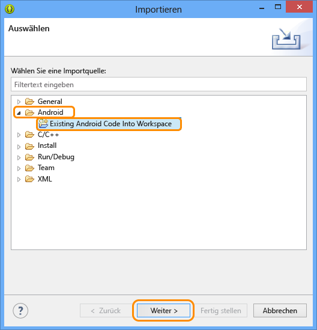
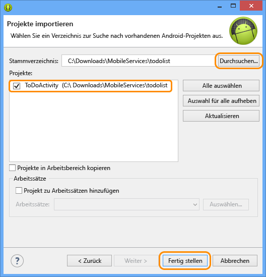

<properties linkid="develop-mobile-tutorials-get-started-with-data-android" urlDisplayName="Get Started with Data - Android" pageTitle="Get started with data (Android) | Mobile Dev Center" metaKeywords="Azure android data, Azure mobile services data, windows droid, windows android, microsoft droid, microsoft android" description="Learn how to get started using Mobile Services to leverage data in your Android app." metaCanonical="" services="" documentationCenter="Mobile" title="Get started with data in Mobile Services" authors="ricksal,glenga" solutions="" manager="" editor="" />

Erste Schritte mit Daten in Mobile Services
===========================================

[Windows Store C\#](/de-de/develop/mobile/tutorials/get-started-with-data-dotnet "Windows Store C#")[Windows Store JavaScript](/de-de/develop/mobile/tutorials/get-started-with-data-js "Windows Store JavaScript")[Windows Phone](/de-de/develop/mobile/tutorials/get-started-with-data-wp8 "Windows Phone")[iOS](/de-de/develop/mobile/tutorials/get-started-with-data-ios "iOS")[Android](/de-de/develop/mobile/tutorials/get-started-with-data-android "Android")[HTML](/de-de/develop/mobile/tutorials/get-started-with-data-html "HTML")[Xamarin.iOS](/de-de/develop/mobile/tutorials/get-started-with-data-xamarin-ios "Xamarin.iOS")[Xamarin.Android](/de-de/develop/mobile/tutorials/get-started-with-data-xamarin-android "Xamarin.Android")

Dieses Thema beschreibt die Nutzung von mobilen Azure-Diensten für die Nutzung von Daten in einer Android-App. In diesem Lernprogramm laden Sie eine App herunter, die Daten im Arbeitsspeicher speichert, erstellen einen neuen mobilen Dienst, integrieren den mobilen Dienst in eine App und melden sich dann beim Azure-Verwaltungsportal an, um Datenänderungen beim AusfĂĽhren der App anzuzeigen.

[Lernprogramm ansehen](http://channel9.msdn.com/Series/Windows-Azure-Mobile-Services/Android-Getting-Started-With-Data-Connecting-your-app-to-Windows-Azure-Mobile-Services) [Video abspielen](http://channel9.msdn.com/Series/Windows-Azure-Mobile-Services/Android-Getting-Started-With-Data-Connecting-your-app-to-Windows-Azure-Mobile-Services)15:32

**Hinweis**

Dieses Lernprogramm vermittelt ein besseres Verständnis davon, wie Sie mit mobilen Diensten in Azure Daten aus einer Android-App speichern und abrufen können. Dieses Thema behandelt viele der Schritte, die Ihnen im Schnellstart für mobile Dienste abgenommen werden. Falls Sie noch keine Erfahrung mit Mobile Services haben, sollten Sie eventuell zuerst das Lernprogramm [Erste Schritte mit mobilen Diensten](/de-de/develop/mobile/tutorials/get-started-android) abschließen.

In diesem Lernprogramm werden die folgenden grundlegenden Schritte behandelt:

1.  [Herunterladen des Android-App-Projekts](#download-app)
2.  [Erstellen des mobilen Diensts](#create-service)
3.  [Erstellen einer Datentabelle als Datenspeicher](#add-table)
4.  [Aktualisieren der App zur Verwendung von Mobile Services](#update-app)
5.  [Testen der App mit Mobile Services](#test-app)

**Hinweis**

Sie benötigen ein Azure-Konto, um dieses Lernprogramm auszuführen. Wenn Sie über kein Konto verfügen, können Sie in nur wenigen Minuten ein kostenloses Testkonto erstellen. Weitere Informationen finden Sie unter [Kostenlose Azure-Testversion](http://www.windowsazure.com/de-de/pricing/free-trial/?WT.mc_id=AED8DE357).

Für dieses Lernprogramm benötigen Sie das [Android-SDK für mobile Dienste](http://go.microsoft.com/fwlink/p/?LinkID=280126). Dieses [Android-SDK](https://go.microsoft.com/fwLink/p/?LinkID=280125) enthält die integrierte Eclipse-Entwicklungsumgebung (IDE) und das Android Developer Tools (ADT)-Plugin und Android 4.2 oder eine neuere Version.

**Hinweis**

Dieses Lernprogramm enthält Anleitungen für die Installation des Android-SDK und des Android-SDK für mobile Dienste. Das heruntergeladene GetStartedWithData-Projekt benötigt Android 4.2 oder eine neuere Version. Das SDK für mobile Dienste benötigt dagegen nur Android 2.2 oder eine neuere Version.

Herunterladen des ProjektsHerunterladen des GetStartedWithData-Projekts
-----------------------------------------------------------------------

### Laden Sie den Beispielcode herunter

Dieses Lernprogramm verwendet die Android-App [GetStartedWithData](http://go.microsoft.com/fwlink/p/?LinkID=282122). Die GUI dieser App ist identisch mit der App aus dem Schnellstart für mobile Dienste in Android, nur werden die hinzugefügten Elemente bei dieser App lokal im Speicher abgelegt. Sie werden den Code zum Persistieren der Daten im Speicher hinzufügen.

1.  Laden Sie die `GetStartedWithData`-Beispielapp herunter und entpacken Sie die Dateien auf Ihrem Computer.

2.  Klicken Sie in Eclipse auf **Datei**, dann auf **Importieren**, und erweitern Sie dann **Android**. Klicken Sie auf **Existing Android Code into Workspace** und dann auf **Weiter.**

	

1.  Klicken Sie auf **Durchsuchen**, navigieren Sie zum Ort der entpackten Projektdateien. Klicken Sie auf **OK** und vergewissern Sie sich, dass das TodoActivity-Projekt markiert ist. Falls Sie das Projekt in Ihren Arbeitsbereich kopieren möchten, markieren Sie das Kontrolllkästchen **Projekte in Arbeitsbereich kopieren**. Klicken Sie abschließend auf **Fertig stellen**.

	

    Daraufhin werden die Projektdateien in den aktuellen Arbeitsbereich importiert.

### Prüfen der Version des Android-SDK

[WACOM.INCLUDE [SDK-Prüfung](../includes/mobile-services-verify-android-sdk-version.md)]

### Prüfen und Ausführen des Beispielcodes

1.  Erweitern Sie im Paket-Explorer die Einträge **GetStartedWithData**, **src** und **.com.example.GetStartedWithData** und sehen Sie sich die Datei ToDoActivity.java an.

     

   	Die `//TODO`-Kommentare geben die notwendigen Schritte für die Integration dieser App mit Ihrem mobilen Dienst an.

2.  Klicken Sie im Menü **Ausführen** auf **Ausführen** und anschließend auf **Android-Anwendung**, um das Projekt zu starten.

    **Hinweis**

    Sie können dieses Projekt entweder auf einem Android-Telefon oder im Android-Emulator ausführen. Für die Ausführung auf einem Android-Telefon müssen Sie einen telefonspezifischen USB-Treiber herunterladen.

    Um das Projekt im Android-Emulator auszuführen, müssen Sie mindestens ein virtuelles Android-Gerät (AVD) definieren. Verwenden Sie den AVD Manager, um diese Geräte zu erstellen und zu verwalten.

3.  Geben Sie in der App einen sinnvollen Text ein, beispielsweise *Lernprogramm beenden*, und klicken Sie dann auf **Hinzufügen**.

     

   	Der gespeicherte Test wird in einer speicherinternen Sammlung gespeichert und in der folgenden Liste angezeigt.

Erstellen eines mobilen DienstesErstellen eines neuen mobilen Dienstes im Verwaltungsportal
-------------------------------------------------------------------------------------------

[WACOM.INCLUDE [mobile-services-create-new-service-data](../includes/mobile-services-create-new-service-data.md)]

Erstellen einer neuen TabelleFügen Sie eine neue Tabelle zum mobilen Dienst hinzu
---------------------------------------------------------------------------------

[WACOM.INCLUDE [mobile-services-create-new-service-data-2](../includes/mobile-services-create-new-service-data-2.md)]

Aktualisieren der AppAktualisieren der App für den Datenzugriff über mobile Dienste
-----------------------------------------------------------------------------------

Ihr mobiler Dienst ist nun bereit und Sie können die App aktualisieren, sodass dieser Elemente im mobilen Dienst anstatt in einer lokalen Sammlung speichert.

1.  Falls Sie das [Android-SDK für mobile Dienste](http://go.microsoft.com/fwlink/p/?LinkID=280126) noch nicht haben, laden Sie es jetzt herunter und entpacken Sie die komprimierten Dateien.

2.  Kopieren Sie die `.jar`-Dateien aus dem `mobileservices`-Ordner des SDK in den `libs`-Ordner des GetStartedWithData-Projekts.

3.  Klicken Sie im Paket-Explorer in Eclipse mit der rechten Maustaste auf den `libs`-Ordner, klicken Sie auf **Aktualisieren**, um die kopierten jar-Dateien anzuzeigen.

	Damit wird das SDK für mobile Dienste zum Arbeitsbereich hinzugefügt.

1.  Öffnen Sie die AndroidManifest.xml-Datei und fügen Sie die folgende Zeile hinzu, um der App den Zugriff auf mobile Dienste in Azure zu ermöglichen.

        <uses-permission android:name="android.permission.INTERNET" />

2.  Öffnen Sie im Paket-Explorer die Datei TodoActivity.java im Paket com.example.getstartedwithdata und entfernen Sie die Kommentare in den folgenden Codezeilen:

        import com.microsoft.windowsazure.mobileservices.MobileServiceClient;
        import com.microsoft.windowsazure.mobileservices.MobileServiceTable;
        import com.microsoft.windowsazure.mobileservices.NextServiceFilterCallback;
        import com.microsoft.windowsazure.mobileservices.ServiceFilter;
        import com.microsoft.windowsazure.mobileservices.ServiceFilterRequest;
        import com.microsoft.windowsazure.mobileservices.ServiceFilterResponse;
        import com.microsoft.windowsazure.mobileservices.ServiceFilterResponseCallback;
        import com.microsoft.windowsazure.mobileservices.TableOperationCallback;
        import com.microsoft.windowsazure.mobileservices.TableQueryCallback;

        import java.net.MalformedURLException;

3.  Wir werden die aktuell verwendete speicherinterne Liste entfernen und durch einen mobilen Dienst ersetzen. Kommentieren Sie in der Klasse **ToDoActivity** die folgenden Codezeilen, in denen die **toDoItemList**-Liste definiert wird.

        public List<ToDoItem> toDoItemList = new ArrayList<ToDoItem>();

4.  Nach Abschluss dieses Schritts zeigt das Projekt Buildfehler an. Suchen Sie nach den verbleibenden drei Orten, an denen die Variable `toDoItemList` verwendet wird und kommentieren Sie die entsprechenden Abschnitte aus. Entfernen Sie ebenfalls die Zeile `import java.util.ArrayList`. Nun haben Sie die speicherinterne Liste vollständig entfernt.

5.  Wir werden nun den mobilen Dienst hinzufügen. Entfernen Sie die Kommentare in den folgenden Codezeilen:

        private MobileServiceClient mClient;
        private private MobileServiceTable<ToDoItem> mToDoTable;

6.  Suchen Sie die ProgressFilter-Klasse am Ende der Datei und entfernen Sie deren Kommentare ebenfalls. Diese Klasse zeigt einen Hinweis an, wenn der MobileServiceClient Netzwerkoperationen ausführt.

7.  Klicken Sie im Verwaltungsportal auf **Mobile Services** und klicken Sie auf den mobilen Dienst, den Sie gerade erstellt haben.

8.  Klicken Sie auf die Registerkarte **Dashboard**, und notieren Sie sich die **Site URL**. Klicken Sie anschließend auf **Schlüssel verwalten**, und notieren Sie sich den **Anwendungsschlüssel**.

	
	
	Sie benötigen diese Werte beim Zugriff auf den mobilen Dienst von Ihrem App-Code aus.

1.  Entfernen Sie in der Methode **onCreate** die Kommentare in den folgenden Codezeilen, in denen die **MobileServiceClient**-Variable definiert wird:

        try {
        // Erstellen der Mobile Service Client-Instanz mit
        // URL und Schlüssel des mobilen Dienstes
            mClient = new MobileServiceClient(
                    "MobileServiceUrl",
                    "AppKey", 
                    this).withFilter(new ProgressFilter());

            // Abrufen der zu verwendenden Tabelle im mobilen Dienst
            mToDoTable = mClient.getTable(ToDoItem.class);
        } catch (MalformedURLException e) {
            createAndShowDialog(new Exception("There was an error creating the Mobile Service. Verify the URL"), "Error");
        }

	Hierdurch wird eine neue Instanz des MobileServiceClient erstellt, die für den Zugriff auf Ihren mobilen Dienst verwendet wird. Außerdem wird die MobileServiceTable-Instanz für die Proxy-Datenspeicherung im mobilen Dienst erstellt.

1.  Ersetzen Sie im obigen Code `MobileServiceUrl` und `AppKey` mit der URL und dem Anwendungsschlüssel Ihres mobilen Dienstes, in dieser Reihenfolge.

2.  Entfernen Sie die Kommentare in diesen Zeilen in der **checkItem**-Methode:

        mToDoTable.update(item, new TableOperationCallback<ToDoItem>() { 
            public void onCompleted(ToDoItem entity, Exception exception,
                    ServiceFilterResponse response) {
                if(exception == null){
                    if (entity.isComplete()) {
                        mAdapter.remove(entity);
                    }
                } else {
                    createAndShowDialog(exception, "Error");  
                }
            }
        });

	Dieser Code schickt eine Elementaktualisierung an den mobilen Dienst und entfernt markierte Elemente aus dem Adapter.

1.  Entfernen Sie die Kommentare in diesen Zeilen in der **addItem**-Methode:

        mToDoTable.insert(item, new TableOperationCallback<ToDoItem>() {
                
            public void onCompleted(ToDoItem entity, Exception exception,
                    ServiceFilterResponse response) {
                if(exception == null){
                    if (!entity.isComplete()) {
                        mAdapter.add(entity);
                    }
                } else {
                    createAndShowDialog(exception, "Error");
                }               
            }
        });

	Dieser Code erstellt ein neues Element und fügt es in die Tabelle im mobilen Dienst ein.

1.  Entfernen Sie die Kommentare in diesen Zeilen in der **refreshItemsFromTable**-Methode:

        mToDoTable.where().field("complete").eq(false)
        .execute(new TableQueryCallback<ToDoItem>() {
             public void onCompleted(List<ToDoItem> result, 
                     int count, Exception exception, 
                     ServiceFilterResponse response) {
                            
                        if(exception == null){
                            mAdapter.clear();

                            for (ToDoItem item : result) {
                                mAdapter.add(item);
                            }
                        } else {
                            createAndShowDialog(exception, "Error");
                        }
                    }
                }); 

    Dieser Code fragt den mobilen Dienst ab und gibt alle Elemente zurück, die nicht als abgeschlossen markiert sind. Die Elemente werden für die Bindung zum Adapter hinzugefügt.

Testen der AppTesten der App mit Ihrem neuen mobilen Dienst
-----------------------------------------------------------

Die App verwendet nun mobile Dienste als Back-End-Speicher, und Sie können sie entweder im Android-Emulator oder auf einem Android-Telefon gegen den mobilen Dienst testen.

1.  Klicken Sie im Menü **Ausführen** auf **Ausführen**, um das Projekt zu starten.

    Dadurch wird Ihre mit dem Android-SDK erstellte App ausgeführt, die mithilfe der Clientbibliothek Elemente aus Ihrem mobilen Dienst abfragt.

2.  Geben Sie wie zuvor einen lesbaren Text ein und klicken Sie auf **Hinzufügen**.

    Dieser Code schickt ein neues einzufügendes Element an den mobilen Dienst.

3.  Klicken Sie im [Verwaltungsportal](https://manage.windowsazure.com/) auf **Mobile Dienste** und dann auf Ihren mobilen Dienst.

4.  Klicken Sie auf die Registerkarte **Daten** und dann auf **Durchsuchen**.

     
          
     Die **TodoItem**-Tabelle enthält nun Daten. Einige der Werte wurden vom mobilen Dienst generiert, und die entsprechenden Spalten für die TodoItem-Klasse in der App wurden automatisch in der Tabelle erstellt.

Damit ist das Android-Lernprogramm **Erste Schritte mit Daten** abgeschlossen.

Nächste Schritte
----------------

Dieses Lernprogramm zeigt die Grundlagen für die Integration von Daten in mobilen Diensten in Android-Apps.

Als Nächstes können Sie eines der folgenden Lernprogramme ausführen, das auf der GetStartedWithData-App aufbaut, die Sie in diesem Lernprogramm erstellt haben:

-   [Prüfen und Ändern von Daten mit Skripten](/de-de/develop/mobile/tutorials/validate-modify-and-augment-data-dotnet)
    Informationen zur Verwendung von Serverskripten in Mobile Services, um von Ihrer App gesendete Daten zu prüfen und zu ändern.

-   [Optimieren von Abfragen mittels Paging](/de-de/develop/mobile/tutorials/add-paging-to-data-android)
    Informationen zur Verwendung von Paging in Abfragen, um die in einer einzelnen Anforderung behandelte Datenmenge zu steuern.

Nach Abschluss der Daten-Lernprogramme können Sie diese anderen Android-Lernprogramme ausprobieren:

-   [Erste Schritte mit der Authentifizierung](/de-de/develop/mobile/tutorials/get-started-with-users-android)
    Informationen zur Authentifizierung von Benutzern Ihrer App.

-   [Erste Schritte mit Pushbenachrichtigungen](/de-de/develop/mobile/tutorials/get-started-with-push-android)
    Verschicken Sie mit Mobile Services eine einfache Pushbenachrichtigung an Ihre App.

