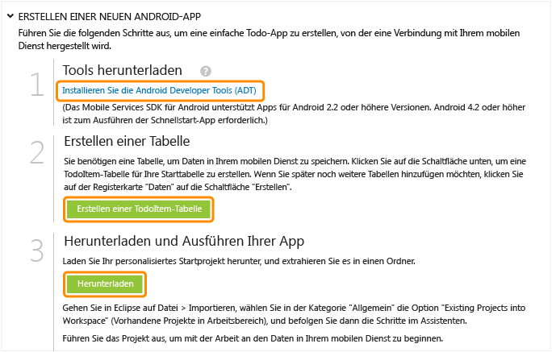

<properties pageTitle="Get Started with Azure Mobile Services for Android apps" metaKeywords="Azure android application, mobile service android, getting started Azure android, azure droid, getting started droid windows" description="Follow this tutorial to get started using Azure Mobile Services for Android development." metaCanonical="" services="" documentationCenter="Mobile" title="Get started with Mobile Services" authors="glenga" solutions="" manager="" editor="" />

Erste Schritte mit Mobile Services
==================================

[Windows Store](/en-us/documentation/articles/mobile-services-windows-store-get-started "Windows Store") [Windows Phone](/en-us/documentation/articles/mobile-services-windows-phone-get-started "Windows Phone") [iOS](/en-us/documentation/articles/mobile-services-ios-get-started "iOS") [Android](/en-us/documentation/articles/mobile-services-android-get-started "Android") [HTML](/en-us/documentation/articles/mobile-services-html-get-started "HTML") [Xamarin.iOS](/en-us/documentation/articles/partner-xamarin-mobile-services-ios-get-started "Xamarin.iOS") [Xamarin.Android](/en-us/documentation/articles/partner-xamarin-mobile-services-android-get-started "Xamarin.Android") [Sencha](/en-us/documentation/articles/partner-sencha-mobile-services-get-started/ "Sencha") [PhoneGap](/en-us/documentation/articles/mobile-services-javascript-backend-phonegap-get-started/ "PhoneGap")

[.NET-Backend](/en-us/documentation/articles/mobile-services-dotnet-backend-android-get-started/ ".NET-Backend") | [JavaScript-Backend](/en-us/documentation/articles/mobile-services-android-get-started/ "JavaScript-Backend")

In diesem Lernprogramm erfahren Sie, wie Sie einen Cloud-basierten Backend-Service mithilfe von Azure Mobile Services zu einer Android-App hinzufügen. Sie erstellen hierzu in diesem Lernprogramm einen neuen Mobile Service und eine einfache *Aufgabenlisten*-App, die App-Daten in dem neuen Mobile Service speichert.

Im Folgenden finden Sie einen Screenshot der fertigen App:

[Lernprogramm ansehen](http://channel9.msdn.com/Series/Windows-Azure-Mobile-Services/Android-Support-in-Windows-Azure-Mobile-Services) [Video abspielen](http://channel9.msdn.com/Series/Windows-Azure-Mobile-Services/Android-Support-in-Windows-Azure-Mobile-Services)7:26

Sie benötigen die [Android Developer Tools](https://go.microsoft.com/fwLink/p/?LinkID=280125), um dieses Lernprogramm abzuschließen. Diese umfassen die integrierte Entwicklungsumgebung (IDE) von Eclipse, das Android Developer Tools (ADT)-Plug-In und die neueste Android-Plattform. Android 4.2 oder eine höhere Version ist erforderlich.

Das heruntergeladene Schnellstartprojekt enthält den Mobile Services SDK für Android. Dieses Projekt erfordert Android 4.2 oder eine höhere Version. Der Mobile Services SDK benötigt jedoch nur Android 2.2 oder eine höhere Version.

**Hinweis**

Sie benötigen ein Azure-Konto, um dieses Lernprogramm auszuführen. Wenn Sie kein Konto besitzen, können Sie in wenigen Minuten ein kostenloses Testkonto erstellen. Weitere Informationen finden Sie unter [Kostenloses Azure-Testkonto](http://www.windowsazure.com/en-us/pricing/free-trial/?WT.mc_id=AE564AB28).

Erstellen eines neuen Mobile Service
------------------------------------

[WACOM.INCLUDE [mobile-services-create-new-service](../includes/mobile-services-create-new-service.md)]

&lt;h2 data-morhtml="true"\>Erstellen einer neuen AppErstellen einer neuen Android-App&lt;/h2\>
-------------------------------------------------------------------------------------------

Sobald Sie Ihren Mobile Service erstellt haben, können Sie einen einfachen Schnellstart im Verwaltungsportal durchführen, um entweder eine neue App zu erstellen oder eine bereits vorhandene App zu bearbeiten und diese mit Ihrem Mobile Service zu verbinden.

In diesem Abschnitt erstellen Sie eine neue Android-App, die mit Ihrem Mobile Service verbunden ist.

1.  Klicken Sie im Verwaltungsportal auf **Mobile Services** und anschließend auf den gerade von Ihnen erstellten Mobile Service.

2.  Klicken Sie auf der Schnellstartregisterkarte unter **Plattform auswählen** auf **Android**, und erweitern Sie **Create a new Android app**.

        ![][6] Daraufhin werden drei einfache Schritte zum Erstellen einer Android-App angezeigt, die mit Ihrem Mobile Service verbunden ist.

1.  Wenn Sie dies nicht bereits getan haben, laden Sie die [Android Developer Tools](https://go.microsoft.com/fwLink/p/?LinkID=280125) auf Ihren lokalen oder virtuellen Computer herunter, und installieren Sie diese.

2.  Klicken Sie auf **Create TodoItem table**, um eine Tabelle zum Speichern von App-Daten zu erstellen.

3.  Klicken Sie unter **Download and run your app** auf **Herunterladen**.

Daraufhin wird das Projekt für die Beispielanwendung *Aufgabenliste* heruntergeladen, die mit Ihrem Mobile Service verbunden ist. Speichern Sie die komprimierte Projektdatei auf Ihrem lokalen Computer, und notieren Sie sich den Speicherort.

Ausführen Ihrer Android-App
---------------------------

Im letzten Schritt dieses Lernprogramms erstellen Sie Ihre neue App, und führen diese aus.

1.  Navigieren Sie zum Speicherort der komprimierten Projektdateien, und entpacken Sie die Dateien auf Ihrem Computer.

2.  Klicken Sie in Eclipse auf **Datei**, dann auf **Importieren**, und erweitern Sie dann **Android**. Klicken Sie auf **Existing Android Code into Workspace** und dann auf **Weiter**.

1.  Klicken Sie auf **Durchsuchen**, navigieren Sie zum Speicherort der entpackten Projektdateien, klicken Sie auf **OK**, stellen Sie sicher, dass das TodoActivity-Projekt ausgewählt ist, und klicken Sie dann auf **Fertig stellen**.

    Daraufhin werden die Projektdateien in den aktuellen Arbeitsbereich importiert.

1.  Klicken Sie im Menü **Ausführen** auf **Ausführen**, um das Projekt im Android-Emulator zu starten.

    **Hinweis**

    Sie müssen mindestens ein Android Virtual Device (AVD) definieren, um das Projekt im Android-Emulator auszuführen. Verwenden Sie den AVD Manager, um diese Geräte zu erstellen und zu verwalten.

2.  Geben Sie in der App einen sinnvollen Text ein, beispielsweise *Lernprogramm beenden*, und klicken Sie dann auf **Hinzufügen**.

        ![][10] Daraufhin wird eine POST-Anforderung an den neuen Mobile Service gesendet, der in Azure gehostet wird. Die Daten dieser Anforderungen werden in die TodoItem-Tabelle eingefügt. Die in der Tabelle gespeicherten Elemente werden vom Mobile Service zurückgegeben, und die Daten werden in der Liste angezeigt.

    **Hinweis**

    Sie können den Code überprüfen, der auf Ihren Mobile Service zugreift, um Daten abzufragen und einzufügen. Sie finden ihn in der ToDoActivity.java-Datei.

3.  Klicken Sie dann im Verwaltungsportal auf die Registerkarte **Daten**, und klicken Sie auf die Tabelle **TodoItems**.

        ![][11] So können Sie die Daten durchsuchen, die von der App in die Tabelle eingefügt wurden. ![][12]

Nächste Schritte
----------------

Nachdem Sie nun den Schnellstart abgeschlossen haben, erfahren Sie, wie Sie zusätzliche wichtige Aufgaben in Mobile Services durchführen:

-   [Erste Schritte mit Daten](/en-us/develop/mobile/tutorials/get-started-with-data-android)
    Erfahren Sie mehr über das Speichern und Abfragen von Daten mithilfe von Mobile Services.

-   [Erste Schritte bei der Authentifizierung](/en-us/develop/mobile/tutorials/get-started-with-users-android)
    Erfahren Sie, wie Sie Benutzer Ihrer App mithilfe eines Identitätsanbieters authentifizieren.

-   [Erste Schritte mit Pushbenachrichtigungen](/en-us/develop/mobile/tutorials/get-started-with-push-android)
    Erfahren Sie, wie Sie eine sehr einfache Pushbenachrichtigung an Ihre App senden.

