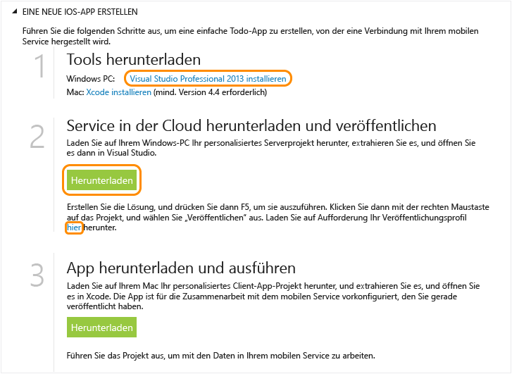

<properties pageTitle="Get Started with Azure Mobile Services for iOS apps" metaKeywords="Azure iOS application, mobile service iOS, getting started Azure iOS" description="Follow this tutorial to get started using Azure Mobile Services for iOS development. " metaCanonical="" services="" documentationCenter="Mobile" title="Get started with Mobile Services" authors="glenga" solutions="" manager="" editor="" />

Erste Schritte mit Mobile Services
==================================

[Windows Store C\#](/de-de/documentation/articles/mobile-services-dotnet-backend-windows-store-dotnet-get-started "Windows Store C#") [Windows Store JavaScript](/de-de/documentation/articles/mobile-services-dotnet-backend-windows-store-javascript-get-started "Windows Store JavaScript") [Windows Phone](/de-de/documentation/articles/mobile-services-dotnet-backend-windows-phone-get-started "Windows Phone") [iOS](/de-de/documentation/articles/mobile-services-dotnet-backend-ios-get-started "iOS") [Android](/de-de/documentation/articles/mobile-services-dotnet-backend-android-get-started "Android")
[.NET backend](/de-de/documentation/articles/mobile-services-dotnet-backend-ios-get-started/ ".NET backend") | [JavaScript backend](/de-de/documentation/articles/mobile-services-ios-get-started/ "JavaScript backend")

In diesem Lernprogramm erfahren Sie, wie Sie mit den Azure Mobile Services einen cloudbasierten Backend-Dienst zu einer iOS-App hinzufügen können. In diesem Lernprogramm erstellen Sie einen neuen mobilen Dienst und eine einfache *To-Do-Listen*-App, die App-Daten im neuen mobilen Dienst speichert. Der mobile Dienst, den Sie erstellen, verwendet die unterstützten .NET-Sprachen mit Visual Studio für serverseitige Geschäftslogik und zum Verwalten des mobilen Dienstes. Informationen zum Erstellen eines mobilen Dienstes, mit dem Sie serverseitige Geschäftslogik in JavaScript schreiben können, finden Sie in der [JavaScript-Back-End-Version](/de-de/documentation/articles/mobile-services-ios-get-started) dieses Themas.

Unten finden Sie einen Screenshot aus der fertigen App:

Zum Abschließen dieses Lernprogramms sind XCode 4.5 und iOS 5.0 oder neuere Versionen erforderlich.

**Hinweis**

Sie benötigen ein Azure-Konto, um dieses Lernprogramm auszuführen. Wenn Sie über kein Konto verfügen, können Sie in nur wenigen Minuten ein kostenloses Testkonto erstellen. Weitere Informationen finden Sie hier [Kostenloses Azure-Testkonto](http://www.windowsazure.com/de-de/pricing/free-trial/?WT.mc_id=AE564AB28&returnurl=http%3A%2F%2Fwww.windowsazure.com%2Fen-us%2Fdevelop%2Fmobile%2Ftutorials%2Fget-started-ios%2F).

Erstellen eines neuen mobilen Dienstes
--------------------------------------

[WACOM.INCLUDE [mobile-services-create-new-service](../includes/mobile-services-create-new-service.md)]

Herunterladen des mobilen Dienstes auf den lokalen Computer
-----------------------------------------------------------

Da Sie den mobilen Dienst jetzt erstellt haben, laden Sie das Projekt für den personalisierten mobilen Dienst herunter, den Sie auf dem lokalen oder dem virtuellen Computer ausführen können.

1.  Klicken Sie auf den gerade erstellten mobilen Dienst, und klicken Sie dann auf der Schnellstartregisterkarte auf **iOS** unter **Plattform auswählen**. Erweitern Sie dann **Erstellen einer neuen iOS-App**.

    

2.  Wenn Sie dies noch nicht durchgeführt haben, laden Sie Visual Studio Professional 2013 oder eine neuere Version herunter, und installieren Sie diese.

3.  Klicken Sie auf **Download** unter **Download and publish your service to the cloud**.

    Dadurch wird das Visual Studio-Projekt, das den mobilen Dienst implementiert, heruntergeladen. Speichern Sie die komprimierte Projektdatei auf dem lokalen Computer, und notieren Sie sich den Speicherort.

4.  Laden Sie außerdem das Veröffentlichungsprofil herunter, speichern Sie die heruntergeladene Datei auf dem lokalen Computer, und notieren Sie sich den Speicherort.

Testen des mobilen Dienstes
---------------------------

[WACOM.INCLUDE [mobile-services-dotnet-backend-test-local-service](../includes/mobile-services-dotnet-backend-test-local-service.md)]

Veröffentlichen des mobilen Dienstes
------------------------------------

[WACOM.INCLUDE [mobile-services-dotnet-backend-publish-service](../includes/mobile-services-dotnet-backend-publish-service.md)]

Erstellen einer neuen iOS-App
-----------------------------

In diesem Abschnitt erstellen Sie eine neue iOS-App, die mit dem mobilen Dienst verbunden ist.

1.  Klicken Sie im Verwaltungsportal auf **Mobile Services** und anschließend auf den mobilen Dienst, den Sie gerade erstellt haben.

2.  Klicken Sie auf der Schnellstartregisterkarte auf **iOS** unter **Plattform auswählen**. Erweitern Sie dann **Erstellen einer neuen iOS-App**.

3.  Wenn Sie dies noch nicht durchgeführt haben, laden Sie [Xcode](https://go.microsoft.com/fwLink/p/?LinkID=266532) v4.4 oder eine neuere Version herunter, und installieren Sie diese.

4.  Klicken Sie auf **TodoItems-Tabelle erstellen**, um eine Tabelle zum Speichern der App-Daten zu erstellen.

5.  Klicken Sie unter **Ihre App herunterladen und ausführen** auf **Download**.

Dadurch wird das Projekt für die Beispielanwendung der *To-do-List* heruntergeladen, die zusammen mit dem Mobile Services iOS SDK mit dem mobilen Dienst verbunden ist. Speichern Sie die komprimierte Projektdatei auf dem lokalen Computer, und notieren Sie sich den Speicherort.

Ausführen der neuen iOS-App
---------------------------

[WACOM.INCLUDE [mobile-services-ios-run-app](../includes/mobile-services-ios-run-app.md)]

Hier wird das Ausführen der neuen Client-App für den mobilen Dienst unter Azure demonstriert. Bevor Sie die iOS-App mit dem mobilen Dienst auf einem lokalen Computer testen können, müssen Sie den Webserver und die Firewall so konfigurieren, dass der Zugriff vom iOS-Entwicklungscomputer aus zulässig ist. Weitere Informationen finden Sie unter [Configure the local web server to allow connections to a local mobile service](/de-de/documentation/articles/mobile-services-dotnet-backend-how-to-configure-iis-express).

