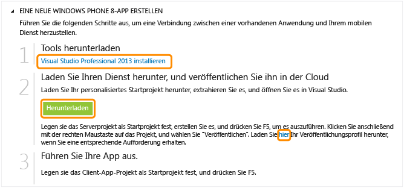

<properties linkid="develop-mobile-tutorials-get-started-wp8" urlDisplayName="Get Started (WP8)" pageTitle="Get Started with Azure Mobile Services for Windows Phone apps" metaKeywords="" description="Follow this tutorial to get started using Azure Mobile Services for Windows Phone development. " metaCanonical="" services="" documentationCenter="Mobile" title="Get started with Mobile Services" authors="glenga" solutions="" manager="" editor="" />

<a name="getting-started">
Erste Schritte mit Mobile Services
==================================

	<a href="/de-de/documentation/articles/mobile-services-dotnet-backend-windows-store-dotnet-get-started" title="Windows Store C#">Windows Store C#</a>
	<a href="/de-de/documentation/articles/mobile-services-dotnet-backend-windows-store-javascript-get-started" title="Windows Store JavaScript">Windows Store JavaScript</a>
	<a href="/de-de/documentation/articles/mobile-services-dotnet-backend-windows-phone-get-started" title="Windows Phone" class="current">Windows Phone</a><a href="/de-de/documentation/articles/mobile-services-dotnet-backend-ios-get-started" title="iOS">iOS</a>
	<a href="/de-de/documentation/articles/mobile-services-dotnet-backend-android-get-started" title="Android">Android</a>
	<!--<a href="/de-de/documentation/articles/get-started-android" title="Android">Android</a>
		<a href="/de-de/documentation/articles/get-started-html" title="HTML">HTML</a>
		<a href="/de-de/documentation/articles/partner-xamarin-mobile-services-ios-get-started" title="Xamarin.iOS">Xamarin.iOS</a>
		<a href="/de-de/documentation/articles/partner-xamarin-mobile-services-android-get-started" title="Xamarin.Android">Xamarin.Android</a>
		<a href="/de-de/documentation/articles/partner-sencha-mobile-services-get-started/" title="Sencha">Sencha</a>
		<a href="/de-de/documentation/articles/mobile-services-javascript-backend-phonegap-get-started/" title="PhoneGap">PhoneGap</a>-->

	<a href="/de-de/documentation/articles/mobile-services-dotnet-backend-windows-phone-get-started/" title=".NET backend" class="current">.NET backend</a> | <a href="/de-de/documentation/articles/mobile-services-windows-phone-get-started/"  title="JavaScript backend" >JavaScript backend</a>

In diesem Lernprogramm wird das Hinzufügen eines cloudbasierten Back-End-Diensts zu einer Windows Phone 8-App mit Azure Mobile Services erläutert. In diesem Lernprogramm erstellen Sie einen neuen mobilen Dienst und eine einfache *To-Do-Listen*-App, die App-Daten im neuen mobilen Dienst speichert. Der mobile Dienst, den Sie erstellen, verwendet die unterstützten .NET-Sprachen mit Visual Studio für serverseitige Geschäftslogik und zum Verwalten des mobilen Dienstes. Informationen zum Erstellen eines mobilen Dienstes, mit dem Sie serverseitige Geschäftslogik in JavaScript schreiben können, finden Sie in der [JavaScript-Back-End-Version](/de-de/documentation/articles/mobile-services-windows-phone-get-started) dieses Themas.

Unten finden Sie einen Screenshot aus der fertigen App:

> [WACOM.NOTE]Sie benötigen ein Azure-Konto mit aktivierter "Azure Mobile Services"-Funktion, um dieses Lernprogramm auszuführen. Wenn Sie über kein Konto verfügen, können Sie in nur wenigen Minuten ein kostenloses Testkonto erstellen. Weitere Informationen finden Sie hier [Kostenloses Azure-Testkonto](http://www.windowsazure.com/en-us/pricing/free-trial/?WT.mc_id=A30A4DDE2&returnurl=http%3A%2F%2Fwww.windowsazure.com%2Fen-us%2Fdocumentation%2Farticles%2Fmobile-services-dotnet-backend-windows-phone-get-started%2F).
> Für dieses Lernprogramm ist [Visual Studio Professional 2013](https://go.microsoft.com/fwLink/p/?LinkID=257546) erforderlich. Eine kostenlose Testversion ist ebenfalls verfügbar.

Erstellen eines neuen mobilen Dienstes
--------------------------------------

[WACOM.INCLUDE [mobile-services-dotnet-backend-create-new-service](../includes/mobile-services-dotnet-backend-create-new-service.md)]

Erstellen einer neuen Windows Phone-App
---------------------------------------

Sobald Sie den mobilen Dienst erstellt haben, können Sie einem einfachen Schnellstart im Verwaltungsportal folgen, um eine neue App zu erstellen oder eine vorhandene App für die Verbindung zum mobilen Dienst zu ändern.

In diesem Abschnitt erstellen Sie eine neue Windows Phone 8-App, die mit Ihrem mobilen Dienst verbunden ist.

1.  Klicken Sie im Verwaltungsportal auf **Mobile Services** und anschließend auf den mobilen Dienst, den Sie gerade erstellt haben.

2.  Klicken Sie auf der Registerkarte "Schnellstart" unter **Eine Plattform wählen** auf **Windows Phone 8**, und erweitern Sie **Eine neue Windows Phone 8-App erstellen**.

	![][6]

	Daraufhin werden die drei einfachen Schritte zum Erstellen einer Windows Phone-App, die mit Ihrem mobilen Dienst verbunden ist, angezeigt.

	

1.  Falls noch nicht geschehen, sollten Sie [Visual Studio Professional 2013](https://go.microsoft.com/fwLink/p/?LinkID=257546) auf den lokalen Computer oder virtuellen Computer herunterladen und installieren.

2.  Klicken Sie unter **Download and publish you service to the cloud** auf **Download**.

    Dadurch wird eine Lösung mit Projekten für den mobilen Dienst und für die *To do list*-Beispielanwendung, die mit dem mobilen Dienst verbunden ist, heruntergeladen. Speichern Sie die komprimierte Projektdatei auf dem lokalen Computer und merken Sie sich, wo Sie sie gespeichert haben.

1.  Laden Sie unter **Publish your service to the cloud** Ihr Veröffentlichungsprofil herunter, speichern Sie die heruntergeladene Datei auf dem lokalen Computer, und notieren Sie sich den Speicherort.

Testen des mobilen Dienstes auf dem lokalen Computer
----------------------------------------------------

[WACOM.INCLUDE [mobile-services-dotnet-backend-test-local-service](../includes/mobile-services-dotnet-backend-test-local-service.md)]

> [WACOM.NOTE]Zum Ausführen einer Windows Phone-App, die eine Verbindung zu einem lokalen Dienst herstellt, sind zusätzliche Konfigurationsschritte erforderlich. Informationen dazu finden Sie nicht in diesem Thema, sondern in [How to connect to a local web service from the Windows Phone 8 emulator](http://go.microsoft.com/fwlink/p/?LinkId=391930).

Veröffentlichen des mobilen Dienstes
------------------------------------

[WACOM.INCLUDE [mobile-services-dotnet-backend-publish-service](../includes/mobile-services-dotnet-backend-publish-service.md)]

<ol start="4">
<li>
Öffnen Sie im Windows Phone-App-Projekt die Datei "App.xaml.cs", suchen Sie den Code, durch den eine <a href="http://msdn.microsoft.com/en-us/library/Windowsazure/microsoft.windowsazure.mobileservices.mobileserviceclient.aspx" target="_blank">MobileServiceClient</a>-Instanz erstellt wird, kommentieren Sie den Code aus, der diesen Client mit *localhost* erstellt, und heben Sie die Auskommentierung für den Code auf, der den Client mithilfe der mobilen Remotedienst-URL erstellt und in etwa folgendermaßen aussieht:

        <pre><code>public static MobileServiceClient MobileService = new MobileServiceClient(
            "https://todolist.azure-mobile.net/",
            "XXXXXXX-APPLICATION-KEY-XXXXXXXX");</code></pre>

    
Der Client greift jetzt auf den in Azure veröffentlichten mobilen Dienst zu.
</li>

<li>
Drücken Sie die <b>F5</b>-Taste, um das Projekt neu zu erstellen und die App zu starten.
</li>

<li>
Geben Sie in der App sinnvollen Text, wie z. B. *Lernprogramm fertigstellen*, ein, und klicken Sie dann auf <b>Save</b>.

    
Dadurch wird eine POST-Anforderung an den neuen, in Azure gehosteten mobilen Dienst gesendet. Daten von der Anforderung werden in die TodoItem-Tabelle eingefügt. In der Tabelle gespeicherte Einträge werden von dem mobilen Dienst zurückgegeben, und die Daten werden in der Liste angezeigt.

	
<b>Hinweis</b>

    
Sie können den Code überprüfen, der auf Ihren Mobile Service zugreift, um Daten abzufragen und einzufügen. Sie finden ihn in der Datei "MainPage.xaml.cs".

	

</li>
</ol>

Hier wird das Ausführen der neuen Client-App für den mobilen Dienst unter Azure demonstriert. Bevor Sie die Windows Phone-App mit dem mobilen Dienst auf einem lokalen Computer testen können, müssen Sie den Webserver und die Firewall so konfigurieren, dass der Zugriff vom Windows Phone-Gerät oder -Emulator aus zulässig ist. Weitere Informationen finden Sie unter [Configure the local web server to allow connections to a local mobile service](/de-de/documentation/articles/mobile-services-dotnet-backend-how-to-configure-iis-express).

<a name="next-steps">
Nächste Schritte
----------------

Da Sie den Schnellstart jetzt abgeschlossen haben, erfahren Sie, wie zusätzliche wichtige Aufgaben in Mobile Services ausgeführt werden:

-   [Erste Schritte mit Daten](/de-de/documentation/articles/mobile-services-dotnet-backend-windows-phone-get-started-data)
     Weitere Informationen zum Speichern und Abfragen von Daten mit mobilen Diensten.

-   [Erste Schritte mit der Authentifizierung](/de-de/documentation/articles/mobile-services-dotnet-backend-windows-phone-get-started-users)
     Informationen zur Authentifizierung von Benutzern Ihrer App bei einem Identitätsanbieter.

-   [Erste Schritte mit Pushbenachrichtigungen](/de-de/documentation/articles/mobile-services-dotnet-backend-windows-phone-get-started-push)
     Informationen zum Senden einer einfachen Pushbenachrichtigung an Ihre App.

<!-- Images. -->
[0]: ./media/mobile-services-windows-phone-get-started/mobile-quickstart-completed-wp8.png

[6]: ./media/mobile-services-dotnet-backend-windows-phone-get-started/mobile-portal-quickstart-wp8.png
[7]: ./media/mobile-services-dotnet-backend-windows-phone-get-started/mobile-quickstart-steps-wp8.png
[8]: ./media/mobile-services-dotnet-backend-windows-phone-get-started/mobile-service-startup.pnG

[10]: ./media/mobile-services-dotnet-backend-windows-phone-get-started/mobile-quickstart-startup-wp8.png
[11]: ./media/mobile-services-dotnet-backend-windows-phone-get-started/mobile-data-tab.png
[12]: ./media/mobile-services-dotnet-backend-windows-phone-get-started/mobile-data-browse.png

<!-- URLs. -->
[Get started with data]: /de-de/documentation/articles/mobile-services-dotnet-backend-windows-phone-get-started-data
[Get started with authentication]: /de-de/documentation/articles/mobile-services-dotnet-backend-windows-phone-get-started-users
[Get started with push notifications]: /de-de/documentation/articles/mobile-services-dotnet-backend-windows-phone-get-started-push
[Visual Studio 2012 Express for Windows Phone]: https://go.microsoft.com/fwLink/p/?LinkID=268374
[Mobile Services SDK]: https://go.microsoft.com/fwLink/p/?LinkID=268375

[Management Portal]: https://manage.windowsazure.com/
[JavaScript backend version]: /de-de/documentation/articles/mobile-services-windows-phone-get-started
[How to connect to a local web service from the Windows Phone 8 emulator]: http://go.microsoft.com/fwlink/p/?LinkId=391930

