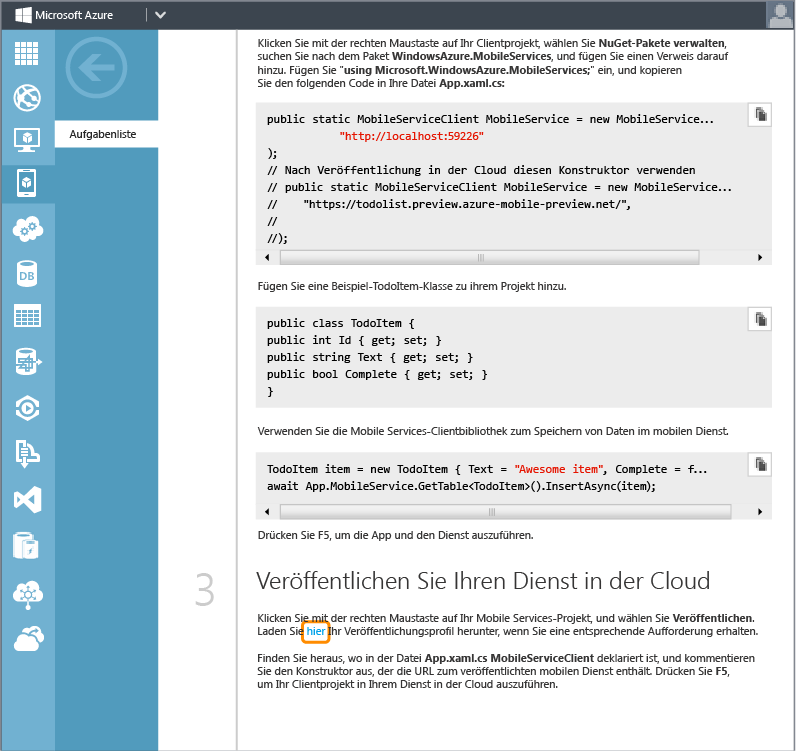
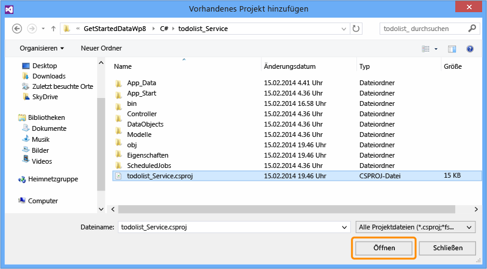
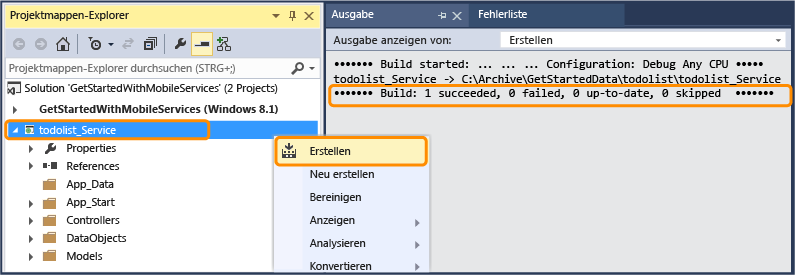
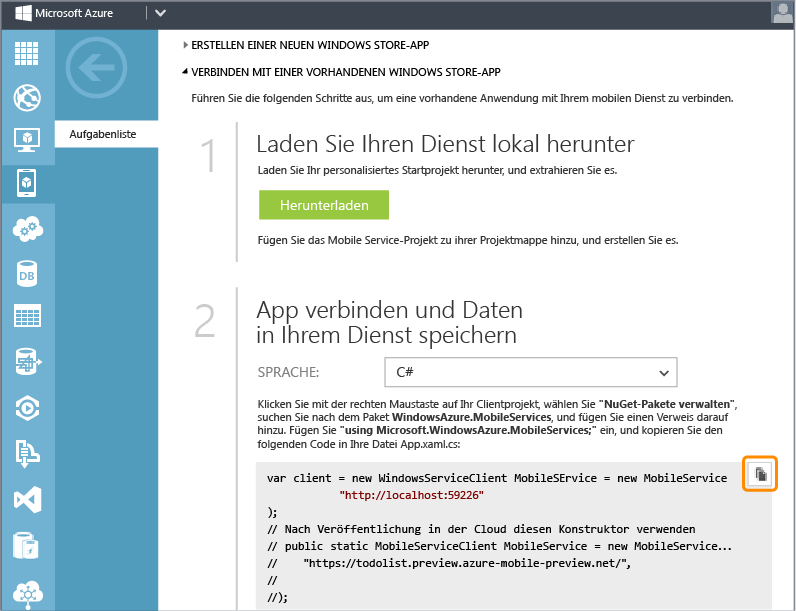
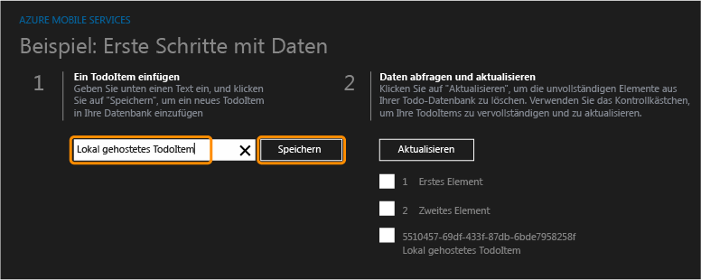
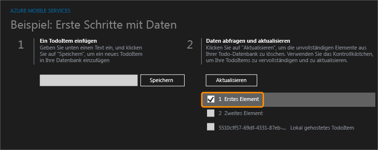
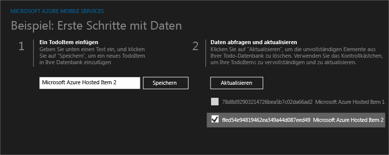

<properties linkid="develop-mobile-tutorials-dotnet-backend-get-started-with-data-dotnet-vs2013" urlDisplayName="Get Started with Data" pageTitle="Get started with data (Windows Store) | Mobile Dev Center" metaKeywords="" description="Learn how to get started using Mobile Services to leverage data in your Windows Store app." metaCanonical="" services="" documentationCenter="Mobile" title="Get started with data in Mobile Services" authors="wesmc" solutions="" manager="" editor="" />

Erste Schritte mit Daten in Mobile Services
===========================================

[Windows Store C\#](/en-us/documentation/articles/mobile-services-dotnet-backend-windows-store-dotnet-get-started-data/ "Windows Store C#") [Windows Store JavaScript](/en-us/documentation/articles/mobile-services-dotnet-backend-windows-store-javascript-get-started-data/ "Windows Store JavaScript") [Windows Phone](/en-us/documentation/articles/mobile-services-dotnet-backend-windows-phone-get-started-data/ "Windows Phone")
[.NET backend](/en-us/documentation/articles/mobile-services-dotnet-backend-windows-store-dotnet-get-started-data/ ".NET backend") | [JavaScript backend](/en-us/develop/mobile/tutorials/get-started-with-data-dotnet/ "JavaScript backend")

In diesem Thema wird das Verwenden von Azure Mobile Services als Back-End-Datenquelle für eine Windows Store-App demonstriert. In diesem Lernprogramm laden Sie ein Visual Studio 2013-Projekt für eine App herunter, die Daten im Arbeitsspeicher speichert, erstellen einen neuen mobilen Dienst, integrieren den mobilen Dienst in eine App und zeigen die Änderungen an, die beim Ausführen der App vorgenommen wurden.

Der mobile Dienst, den Sie in diesem Lernprogramm erstellen, unterstützt die .NET-Laufzeit im mobilen Dienst. Auf diese Weise können Sie .NET-Sprachen und Visual Studio für serverseitige Geschäftslogik im mobilen Dienst verwenden. Informationen zum Erstellen eines mobilen Dienstes, mit dem Sie serverseitige Geschäftslogik in JavaScript schreiben können, finden Sie in der [JavaScript-Back-End-Version](/en-us/develop/mobile/tutorials/get-started-with-data-dotnet) dieses Themas.

**Hinweis**

Für dieses Lernprogramm ist Visual Studio 2013 erforderlich.

In diesem Lernprogramm werden die grundlegenden Schritte erläutert:

1.  [Herunterladen des Windows Store-App-Projekts](#download-app)
2.  [Erstellen eines neuen mobilen Dienstes](#create-service)
3.  [Lokales Herunterladen des mobilen Dienstes](#download-the-service-locally)
4.  [Aktualisieren der Windows Store-App zum Verwenden des mobilen Dienstes](#update-app)
5.  [Testen der Windows Store-App mit dem lokal gehosteten Dienst](#test-locally-hosted)
6.  [Veröffentlichen des mobilen Dienstes in Azure](#publish-mobile-service)
7.  [Testen der Windows Store-App mit dem in Azure gehosteten Dienst](#test-azure-hosted)

**Hinweis**

Sie benötigen ein Azure-Konto, um dieses Lernprogramm auszuführen. Wenn Sie über kein Konto verfügen, können Sie in nur wenigen Minuten ein kostenloses Testkonto erstellen. Weitere Informationen finden Sie hier [Kostenloses Azure-Testkonto](http://www.windowsazure.com/en-us/pricing/free-trial/?WT.mc_id=AE564AB28&returnurl=http%3A%2F%2Fwww.windowsazure.com%2Fen-us%2Fdocumentation%2Farticles%2Fmobile-services-dotnet-backend-windows-store-dotnet-get-started-data%2F).

Herunterladen des ProjektsHerunterladen des GetStartedWithData-Projekts
-----------------------------------------------------------------------

Dieses Lernprogramm basiert auf der [GetStartedWithMobileServices-App](http://go.microsoft.com/fwlink/p/?LinkId=328660). Dabei handelt es sich um ein Windows Store-App-Projekt in Visual Studio 2013. Die Benutzeroberfläche dieser App ähnelt der, die vom Mobile Services-Schnellstart generiert wird, mit der Ausnahme, dass Elemente lokal im Arbeitsspeicher gespeichert werden.

1.  Laden Sie die C\#-Version der GetStartedWithMobileServices-Beispiel-App von der [Website mit den Codebeispielen für Entwickler](http://go.microsoft.com/fwlink/p/?LinkId=328660) herunter.

      ![][1]

2.  Führen Sie Visual Studio 2013 mit Administratorrechten aus, indem Sie mit der rechten Maustaste auf Visual Studio klicken und dann auf **Als Administrator ausführen** klicken.

3.  Öffnen Sie in Visual Studio 2013 das heruntergeladene Projekt, und sehen Sie sich die Datei "MainPage.xaml.cs" an.

      Beachten Sie, dass die hinzugefügten **TodoItem**-Elemente in einem speicherinternen **ObservableCollection<TodoItem>**-Element gespeichert werden.

4.  Drücken Sie die **F5**-Taste, um das Projekt neu zu erstellen und die App zu starten.

5.  Geben Sie in der App in **Insert a TodoItem** Text ein, und klicken Sie dann auf **Save**.

      ![][0]  

     Der gespeicherte Text wird in der zweiten Spalte unter **Query and update data** angezeigt.

Erstellen eines neuen mobilen DienstesErstellen eines neuen mobilen Dienstes
----------------------------------------------------------------------------

[WACOM.INCLUDE [mobile-services-dotnet-backend-create-new-service](../includes/mobile-services-dotnet-backend-create-new-service.md)]

Lokales Herunterladen des DienstesHerunterladen des Projekts für den mobilen Dienst und Hinzufügen zur Lösung
-------------------------------------------------------------------------------------------------------------

1.  Klicken Sie im [Azure-Verwaltungsportal](https://manage.windowsazure.com/) auf den neuen mobilen Dienst oder die zugehörige Cloudsymbol-Registerkarte, um zur Übersichtsseite zu wechseln.

    

2.  Klicken Sie auf die Plattform **Windows Store**. Erweitern Sie im Abschnitt **Get Started** die Option **Connect an existing Windows Store app**, und klicken Sie auf die Schaltfläche **Download**, um ein personalisiertes Startprojekt für den mobilen Dienst herunterzuladen.

    

3.  Blättern Sie im Abschnitt **Get Started** ganz nach unten zum Schritt **Publish your service to the cloud**. Klicken Sie auf den Link, der im Screenshot unten gezeigt wird, um eine Veröffentlichungsprofildatei für den gerade heruntergeladenen mobilen Dienst herunterzuladen.

    > [WACOM.NOTE] Speichern Sie die Datei an einem sicheren Ort, da sie vertrauliche Informationen zu Ihrem Azure-Konto enthält.. Nach dem Veröffentlichen des mobilen Dienstes später in diesem Lernprogramm löschen Sie diese Datei.

    

4.  Entpacken Sie das heruntergeladene Startprojekt für den personalisierten Dienst. Kopieren Sie die Ordner aus der ZIP-Datei in das gleiche **C\#**-Verzeichnis, in dem sich die Lösungsdatei "Erste Schritte mit Daten" (.sln) befindet. Auf dieser Weise kann NuGet Package Manager die Pakete leichter synchronisieren.

    

5.  Klicken Sie dann im Projektmappen-Explorer von Visual Studio mit der rechten Maustaste auf Ihre Lösung für die Windows Store-App "Erste Schritte mit Daten". Klicken Sie auf **Hinzufügen** und anschließend auf **Vorhandenes Projekt**.

    

6.  Navigieren Sie im Dialogfeld "Vorhandenes Projekt hinzufügen" zum Projektordner mit dem mobilen Dienst, den Sie in das **C\#**-Verzeichnis verschoben haben. Wählen Sie die C\#-Projektdatei (.csproj) im Dienstunterverzeichnis aus. Klicken Sie auf **Öffnen**, um das Projekt Ihrer Lösung hinzuzufügen.

    

7.  Klicken Sie in Visual Studio im Projektmappen-Explorer mit der rechten Maustaste auf das gerade hinzugefügte Dienstprojekt. Klicken Sie dann auf **Build**, um zu überprüfen, ob die Erstellung ohne Fehler erfolgt. Während der Erstellung muss NuGet Package Manager möglicherweise einige NuGet-Pakete, auf die im Projekt verwiesen wird, wiederherstellen.

    

8.  Klicken Sie erneut mit der rechten Maustaste auf das Dienstprojekt. Klicken Sie dieses Mal auf **Start new instance** im Kontextmenü **Debug**.

    

    Visual Studio öffnet die Standardwebseite für Ihren Dienst. Sie können auf **try it now** klicken, um Methoden im mobilen Dienst von der Standardwebseite aus zu testen.

    

    Visual Studio hat den mobilen Dienst standardmäßig lokal in IIS Express gehostet. Sie sehen das, indem Sie mit der rechten Maustaste auf das Taskleistensymbol für IIS Express auf der Taskleiste klicken.

    

Aktualisieren der Windows Store-AppAktualisieren der Windows Store-App zum Verwenden des mobilen Dienstes
---------------------------------------------------------------------------------------------------------

In diesem Abschnitt aktualisieren Sie die Windows Store-App für die Verwendung des mobilen Dienstes als Back-End-Dienst für die Anwendung.

1.  Klicken Sie im Projektmappen-Explorer in Visual Studio mit der rechten Maustaste auf das Windows Store-App-Projekt. Klicken Sie dann auf **NuGet-Pakete verwalten**.

    

2.  Suchen Sie im Dialogfeld "NuGet-Pakete verwalten" nach **WindowsAzure.MobileServices** in der Sammlung der Onlinepakete, und klicken Sie, um das Azure Mobile Services Nuget-Paket zu installieren. Schließen Sie dann das Dialogfeld.

    

3.  Suchen Sie im Azure-Verwaltungsportal den Schritt **Connect your app and store data in your service**. Vergewissern Sie sich, dass **C\#** als Sprache ausgewählt ist. Kopieren Sie den Codeausschnitt, der die `MobileServiceClient`-Verbindung erstellt.

    

4.  Öffnen Sie "App.xaml.cs" in Visual Studio. Fügen Sie den Codeausschnitt am Anfang der `App`-Klassendefinition ein. Fügen Sie außerdem die folgende `using`-Anweisung oben in der Datei ein. Speichern Sie dann die Datei.

         using Microsoft.WindowsAzure.MobileServices;

    

5.  Öffnen Sie "MainPage.xaml.cs" in Visual Studio. Fügen Sie folgende using-Anweisung hinzu:

         using Microsoft.WindowsAzure.MobileServices;

6.  Ersetzen Sie in "MainPage.xaml.cs" in Visual Studio die `MainPage`-Klassendefinition mit der folgenden Definition, und speichern Sie die Datei.

    Dieser Code verwendet das Mobile Services SDK, um der App das Speichern der Daten in einer Tabelle zu ermöglichen, die vom Dienst bereitgestellt wird, anstatt lokal im Arbeitsspeicher gespeichert zu werden. Die drei Hauptmethoden sind `InsertTodoItem`, `RefreshTodoItems` und `UpdateCheckedTodoItem`. Diese drei Methoden ermöglichen Ihnen das asynchrone Einfügen, Abfragen und Aktualisieren Ihrer Datensammlung mit einer Tabelle in Azure.

         public sealed partial class MainPage : Page
         {
             private MobileServiceCollection<TodoItem, TodoItem> items;
             private IMobileServiceTable<TodoItem> todoTable = 
                 App.MobileService.GetTable<TodoItem>();            
             public MainPage()
             {
                 this.InitializeComponent();
             }
             private async void InsertTodoItem(TodoItem todoItem)
             {
                 await todoTable.InsertAsync(todoItem); 
                 items.Add(todoItem);
             }
             private async void RefreshTodoItems()
             {
                 items = await todoTable.ToCollectionAsync(); 
                 ListItems.ItemsSource = items;
             }
             private async void UpdateCheckedTodoItem(TodoItem item)
             {
                 await todoTable.UpdateAsync(item);      
             }
             private void ButtonRefresh_Click(object sender, RoutedEventArgs e)
             {
                 RefreshTodoItems();
             }
             private void ButtonSave_Click(object sender, RoutedEventArgs e)
             {
                 var todoItem = new TodoItem { Text = TextInput.Text };
                 InsertTodoItem(todoItem);
             }
             private void CheckBoxComplete_Checked(object sender, RoutedEventArgs e)
             {
                 CheckBox cb = (CheckBox)sender;
                 TodoItem item = cb.DataContext as TodoItem;
                 UpdateCheckedTodoItem(item);
             }
             protected override void OnNavigatedTo(NavigationEventArgs e)
             {
                 RefreshTodoItems();
             }
         }

Lokales Testen der Windows Store-AppTesten der Windows Store-App mit dem lokal gehosteten Dienst
------------------------------------------------------------------------------------------------

In diesem Abschnitt verwenden Sie Visual Studio, um den mobilen Dienst lokal auf der Entwicklungsarbeitsstation in IIS Express zu hosten. Dann testen Sie die App und den Back-End-Dienst.

1.  Drücken Sie in Visual Studio die F7-Taste oder klicken Sie auf **Projektmappe erstellen** im Menü "Build", um die Windows Store-App und den mobilen Dienst zu erstellen. Stellen Sie sicher, dass beide Projekte ohne Fehler im Ausgabefenster von Visual Studio erstellt werden.

    

2.  Drücken Sie in Visual Studio die F5-Taste oder klicken Sie auf **Debugging starten** im Menü "Debuggen", um die App auszuführen und den mobilen Dienst lokal in IIS Express zu hosten.

3.  Geben Sie den Text eines neuen todoitem ein. Klicken Sie anschließend auf **Save**. Dadurch wird ein neues todoItem in die Datenbank eingefügt, die vom mobilen Dienst erstellt wurde, der lokal in IIS Express gehostet wird.

    

4.  Aktivieren Sie das Kontrollkästchen für eines der Elemente, um es als abgeschlossen zu markieren.

    

5.  In Visual Studio können Sie die Änderungen in der Datenbank, die für den Back-End-Dienst erstellt wurde, anzeigen, indem Sie den Server-Explorer öffnen und die Datenverbindungen erweitern. Klicken Sie mit der rechten Maustaste auf die TodoItems-Tabelle unter **MS\_TableConnectionString**. Klicken Sie dann auf **Show Table Data**.

    

Veröffentlichen des mobilen Dienstes in AzureVeröffentlichen des mobilen Dienstes in Azure
------------------------------------------------------------------------------------------

[WACOM.INCLUDE [mobile-services-dotnet-backend-publish-service](../includes/mobile-services-dotnet-backend-publish-service.md)]

Testen des mobilen Dienstes in AzureTesten des in Azure veröffentlichten mobilen Dienstes
-----------------------------------------------------------------------------------------

1.  Öffnen Sie "App.xaml.cs" in Visual Studio. Kommentieren Sie den Code aus, der den `MobileServiceClient` erstellt, der eine Verbindung zum lokal gehosteten mobilen Dienst herstellt. Heben Sie die Auskommentierung des Codes auf, der den `MobileServiceClient` erstellt, der den Dienst in Azure verbindet. Speichern Sie die Änderungen an der Datei.

         sealed partial class App : Application
         {
             //public static MobileServiceClient MobileService = new MobileServiceClient(
             //          "http://localhost:59226"
             //);
             // Use this constructor instead after publishing to the cloud
             public static MobileServiceClient MobileService = new MobileServiceClient(
                  "https://todolist.preview.azure-mobile-preview.net/",
                  "XXXXXXXXXXXXXXXXXXXXXXXXXXXXXXXX"
             );        
             ....

2.  Drücken Sie in Visual Studio die F5-Taste oder klicken Sie im Menü "Debuggen" auf **Debugging starten**. Dadurch wird die Windows Store-App mit der vorherigen Änderung neu erstellt, bevor die App ausgeführt wird, um eine Verbindung zum remote in Azure gehosteten mobilen Dienst herzustellen.

3.  Geben Sie einige neue todoitems ein und klicken Sie jeweils auf **Save**. Aktivieren Sie das Kontrollkästchen, um einige neue Elemente abzuschließen. Jedes neue todoItem wird in der SQL-Datenbank, die Sie zuvor für den mobilen Dienst im Azure-Verwaltungsportal konfiguriert haben, gespeichert und aktualisiert.

    

    Sie können die App neu starten, um zu überprüfen, ob die Änderungen in der Datenbank in Azure beibehalten wurden. Sie können die Datenbank auch mithilfe des Azure-Verwaltungsportals oder mit dem SQL Server-Objekt-Explorer von Visual Studio untersuchen. Die nächsten beiden Schritte verwenden das Azure-Verwaltungsportal, um die Änderungen in der Datenbank anzuzeigen.

4.  Klicken Sie im Azure-Verwaltungsportal für die Datenbank, die dem mobilen Dienst zugeordnet ist, auf "Verwalten".

    

5.  Führen Sie im Verwaltungsportal eine Abfrage aus, um die von der Windows Store-App vorgenommenen Änderungen anzuzeigen. Ihre Abfrage ähnelt der folgenden Abfrage. Verwenden Sie aber Ihren Datenbanknamen anstelle von `todolist`.

         SELECT * FROM [todolist].[todoitems]

    

Damit ist das Lernprogramm **Erste Schritte mit Daten** beendet.

Nächste Schritte
----------------

In diesem Lernprogramm wurden die Grundlagen der Aktivierung einer Windows Store-App für die Arbeit mit Daten in Mobile Services gezeigt. Als Nächstes können Sie eines der folgenden Lernprogramme ausführen, das auf der GetStartedWithData-App aufbaut, die Sie in diesem Lernprogramm erstellt haben:

-   [Prüfen und Ändern von Daten mit Skripten](/en-us/develop/mobile/tutorials/validate-modify-and-augment-data-dotnet)
     Informationen zur Verwendung von Serverskripts in Mobile Services, um von Ihrer App gesendete Daten zu prüfen und zu ändern.

-   [Optimieren von Abfragen mittels Paging](/en-us/develop/mobile/tutorials/add-paging-to-data-dotnet)
     Informationen zur Verwendung von Paging in Abfragen, um die in einer einzelnen Anforderung behandelte Datenmenge zu steuern.

Wenn Sie die Datenreihe abgeschlossen haben, können Sie eines der folgenden Lernprogramme ausprobieren:

-   [Erste Schritte mit der Authentifizierung](/en-us/documentation/articles/mobile-services-dotnet-backend-windows-store-dotnet-get-started-users/)
     Informationen zur Authentifizierung von Benutzern Ihrer App.

-   [Erste Schritte mit Pushbenachrichtigungen](/en-us/documentation/articles/mobile-services-dotnet-backend-windows-store-dotnet-get-started-push/)
     Informationen zum Senden einer einfachen Pushbenachrichtigung an Ihre App.

-   [Mobile Services .NET-Anleitungen: Konzeptionelle Referenz](/en-us/develop/mobile/how-to-guides/work-with-net-client-library)
     Erfahren Sie mehr über die Verwendung von Mobile Services mit .NET.

<!-- Images. -->
[0]: ./media/mobile-services-dotnet-backend-windows-store-dotnet-get-started-data/app-view.png
[1]: ./media/mobile-services-dotnet-backend-windows-store-dotnet-get-started-data/mobile-data-sample-download-dotnet-vs13.png
[2]: ./media/mobile-services-dotnet-backend-windows-store-dotnet-get-started-data/mobile-service-overview-page.png
[3]: ./media/mobile-services-dotnet-backend-windows-store-dotnet-get-started-data/download-service-project.png
[4]: ./media/mobile-services-dotnet-backend-windows-store-dotnet-get-started-data/add-service-project-to-solution.png
[5]: ./media/mobile-services-dotnet-backend-windows-store-dotnet-get-started-data/download-publishing-profile.png
[6]: ./media/mobile-services-dotnet-backend-windows-store-dotnet-get-started-data/add-existing-project-dialog.png
[7]: ./media/mobile-services-dotnet-backend-windows-store-dotnet-get-started-data/vs-manage-nuget-packages.png
[8]: ./media/mobile-services-dotnet-backend-windows-store-dotnet-get-started-data/manage-nuget-packages.png
[9]: ./media/mobile-services-dotnet-backend-windows-store-dotnet-get-started-data/copy-mobileserviceclient-snippet.png
[10]: ./media/mobile-services-dotnet-backend-windows-store-dotnet-get-started-data/vs-pasted-mobileserviceclient.png
[11]: ./media/mobile-services-dotnet-backend-windows-store-dotnet-get-started-data/vs-build-solution.png
[12]: ./media/mobile-services-dotnet-backend-windows-store-dotnet-get-started-data/vs-run-solution.png
[13]: ./media/mobile-services-dotnet-backend-windows-store-dotnet-get-started-data/new-local-todoitem.png
[14]: ./media/mobile-services-dotnet-backend-windows-store-dotnet-get-started-data/vs-show-local-table-data.png
[15]: ./media/mobile-services-dotnet-backend-windows-store-dotnet-get-started-data/local-item-checked.png
[16]: ./media/mobile-services-dotnet-backend-windows-store-dotnet-get-started-data/azure-items.png
[17]: ./media/mobile-services-dotnet-backend-windows-store-dotnet-get-started-data/manage-sql-azure-database.png
[18]: ./media/mobile-services-dotnet-backend-windows-store-dotnet-get-started-data/sql-azure-query.png

[20]: ./media/mobile-services-dotnet-backend-windows-store-dotnet-get-started-data/vs-build-service-project.png
[21]: ./media/mobile-services-dotnet-backend-windows-store-dotnet-get-started-data/vs-start-debug-service-project.png
[22]: ./media/mobile-services-dotnet-backend-windows-store-dotnet-get-started-data/service-welcome-page.png
[23]: ./media/mobile-services-dotnet-backend-windows-store-dotnet-get-started-data/iis-express-tray.png

[26]: ./media/mobile-services-dotnet-backend-windows-store-dotnet-get-started-data/copy-service-and-packages-folder.png

<!-- URLs. -->
[Validate and modify data with scripts]: /en-us/develop/mobile/tutorials/validate-modify-and-augment-data-dotnet
[Refine queries with paging]: /en-us/develop/mobile/tutorials/add-paging-to-data-dotnet
[Get started with Mobile Services]: /en-us/documentation/articles/mobile-services-dotnet-backend-windows-store-dotnet-get-started/
[Get started with authentication]: /en-us/documentation/articles/mobile-services-dotnet-backend-windows-store-dotnet-get-started-users/
[Get started with push notifications]: /en-us/documentation/articles/mobile-services-dotnet-backend-windows-store-dotnet-get-started-push/
[JavaScript and HTML]: /en-us/develop/mobile/tutorials/get-started-with-data-js
[JavaScript backend version]: /en-us/develop/mobile/tutorials/get-started-with-data-dotnet

[Azure Management Portal]: https://manage.windowsazure.com/
[Management Portal]: https://manage.windowsazure.com/
[Mobile Services SDK]: http://go.microsoft.com/fwlink/p/?LinkId=257545
[Developer Code Samples site]:  http://go.microsoft.com/fwlink/p/?LinkId=328660
[Mobile Services .NET How-to Conceptual Reference]: /en-us/develop/mobile/how-to-guides/work-with-net-client-library
[MobileServiceClient class]: http://go.microsoft.com/fwlink/p/?LinkId=302030

