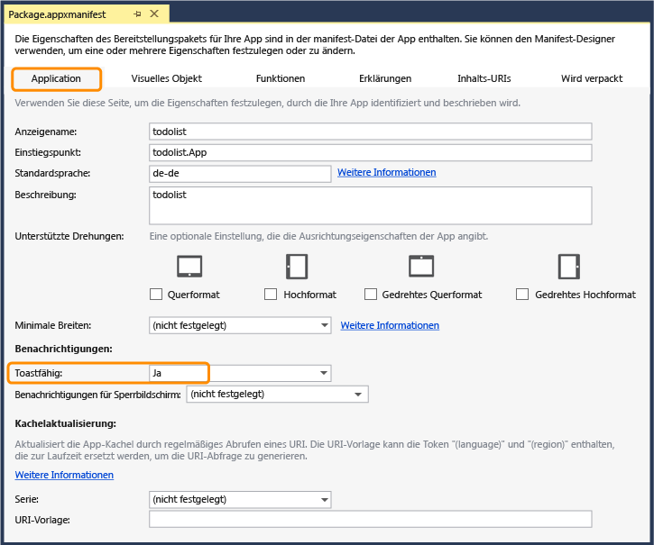

<properties pageTitle="Get started with push notification hubs using .NET runtime mobile services" metaKeywords="" description="Learn how to use Azure Mobile Services and Notification Hubs to send push notifications to your Windows Store app." metaCanonical="" services="mobile" documentationCenter="Mobile" title="Get started with push notifications in Mobile Services" authors="wesmc" solutions="" manager="" editor="" />

Erste Schritte mit Pushbenachrichtigungen in Mobile Services
============================================================

[Windows Store C\#](/de-de/documentation/articles/mobile-services-dotnet-backend-windows-store-dotnet-get-started-push "Windows Store C#")[Windows Store JavaScript](/de-de/documentation/articles/mobile-services-dotnet-backend-windows-store-javascript-get-started-push "Windows Store JavaScript")
[.NET-Backend](/de-de/documentation/articles/mobile-services-dotnet-backend-windows-store-dotnet-get-started-push ".NET-Backend") | [JavaScript-Backend](/de-de/documentation/articles/mobile-services-javascript-backend-windows-store-dotnet-get-started-push/ "JavaScript-Backend")

In diesem Thema erfahren Sie, wie Sie mithilfe von Azure Mobile Services mit .NET-Backend Pushbenachrichtigungen an eine Windows Store-App senden. In diesem Lernprogramm fügen Sie Pushbenachrichtigungen mithilfe von Azure-Benachrichtigungshubs zum Schnellstartprojekt hinzu. Wenn dies abgeschlossen ist, sendet Ihr mobiler Dienst immer dann, wenn ein Datensatz eingefügt wird, eine Pushbenachrichtigung vom .NET-Backend über die Benachrichtigungshubs. Der von Ihnen erstellte Benachrichtigungshub ist für den mobilen Dienst kostenlos, kann unabhängig vom mobilen Dienst verwaltet werden und kann von anderen Anwendungen und Diensten verwendet werden.

> [WACOM.NOTE]Die Mobile Services-Integration in Benachrichtigungshubs ist derzeit als Vorschau und nur für Windows-Plattformen verfügbar. Vorläufig können Sie Pushbenachrichtigungen an iOS- und Android-Geräte vom .NET-Backend-Dienst mithilfe des angeschlossenen Benachrichtigungshubs senden, wie unter **Erste Schritte mit Benachrichtigungshubs** ([iOS](/de-de/documentation/articles/notification-hubs-ios-get-started)/[Android](/de-de/documentation/articles/notification-hubs-android-get-started)) beschrieben ist.

In diesem Lernprogramm werden die folgenden grundlegenden Schritte zur Aktivierung von Pushbenachrichtigungen behandelt:

1.  [Registrieren Ihrer App bei WNS und Konfigurieren von Mobile Services](#register)
2.  [Aktualisieren Ihrer App zur Registrierung für Benachrichtigungen](#update-app)
3.  [Aktualisieren des Servers zum Senden von Pushbenachrichtigungen](#update-server)
4.  [Einfügen von Daten zum Empfangen von Pushbenachrichtigungen](#test)

Dieses Lernprogramm baut auf dem Mobile Services-Schnellstart auf. Bevor Sie mit diesem Lernprogramm beginnen, müssen Sie zunächst entweder [Erste Schritte mit Mobile Services](/de-de/documentation/articles/mobile-services-dotnet-backend-windows-store-get-started) oder [Erste Schritte mit Daten](/de-de/documentation/articles/mobile-services-dotnet-backend-windows-store-dotnet-get-started-data) abschließen, um Ihr Projekt mit Mobile Services zu verbinden. Wenn kein mobiler Dienst verbunden wurde, stellt der Assistent für Pushbenachrichtigungen diese Verbindung für Sie her.

Registrieren Ihrer App bei WNS und Konfigurieren von Mobile Services
--------------------------------------------------------------------

[WACOM.INCLUDE [mobile-services-javascript-backend-register-windows-store-app](../includes/mobile-services-javascript-backend-register-windows-store-app.md)]

Sowohl Ihr Mobile Service als auch Ihre App sind nun konfiguriert und funktionieren mit WNS und Benachrichtigungshubs. Anschließend aktualisieren Sie Ihre Windows Store-App, um sich für Benachrichtigungen zu registrieren.

Aktualisieren Ihrer App zur Registrierung für Benachrichtigungen
----------------------------------------------------------------

Bevor die App Pushbenachrichtigungen empfangen kann, müssen Sie einen Benachrichtigungskanal registrieren.

1.  Öffnen Sie in Visual Studio die Datei "App.xaml.cs" und fügen Sie die folgende `using`-Anweisungen hinzu:

         using Windows.Networking.PushNotifications;
         using Windows.UI.Popups;

2.  Fügen Sie die folgende `InitNotificationAsync` Methode zur **App**-Klasse hinzu, um einen Pushbenachrichtigungskanal zu erstellen und sich für Pushbenachrichtigungen zu registrieren:

         private async void InitNotificationsAsync()
         {
             // Pushbenachrichtigungskanal anfordern.
             var channel = await PushNotificationChannelManager
                 .CreatePushNotificationChannelForApplicationAsync();

             // Für Benachrichtigungen mit neuem Kanal registrieren
             System.Exception exception = null;
             try
             {
                 await MobileService.GetPush().RegisterNativeAsync(channel.Uri);
             }
             catch (System.Exception ex)
             {
                 exception = ex;
             }
             if (exception != null)
             {
                 var dialog = new MessageDialog(exception.Message, "Kanal-URI wird registriert");
                 dialog.Commands.Add(new UICommand("OK"));
                 await dialog.ShowAsync();
             }
         }

    Dieser Code ruft den Kanal-URI für die App vom WNS ab und registriert anschließend diesen Kanal-URI für Pushbenachrichtigungen.

3.  Fügen Sie in der Datei "App.xaml.cs" am Anfang des **OnLaunched**-Ereignishandlers den folgenden Aufruf zu der neuen **InitNotificationsAsync**-Methode hinzu:

         InitNotificationsAsync();

    Dadurch wird sichergestellt, dass die Registrierung jedes Mal beim Laden der Seite angefordert wird. In Ihrer App möchten Sie diese Registrierung ggf. nur in bestimmten Abständen vornehmen, um sicherzustellen, dass die Registrierung noch aktuell ist.

4.  Öffnen Sie in Visual Studio die Datei "Package.appxmanifest" und vergewissern Sie sich, dass **Toast Capable** in der Registerkarte **Application UI** auf **Yes** gesetzt ist. Speichern Sie die Datei.

      

      Damit stellen Sie sicher, dass Ihre App Popupbenachrichtigungen anzeigen kann. 

Aktualisieren des Servers zum Senden von Pushbenachrichtigungen
---------------------------------------------------------------

[WACOM.INCLUDE [mobile-services-dotnet-backend-update-server-push](../includes/mobile-services-dotnet-backend-update-server-push.md)]

Testen von Pushbenachrichtigungen in der App
--------------------------------------------

1.  Drücken Sie in Visual Studio die Taste F5, um die App auszuführen.

2.  Geben Sie in der App einen Text in **Insert a TodoItem** ein, und klicken Sie dann auf **Save**.

      

      Bitte beachten Sie, dass die App nach dem Einfügen eine Pushbenachrichtigung von WNS erhält.

      

Nächste Schritte
----------------

In diesem Lernprogramm wurden die Grundlagen der Aktivierung einer Windows Store-App für die Arbeit mit Daten in Mobile Services gezeigt. Als Nächstes können Sie eines der folgenden Lernprogramme ausführen, das auf der GetStartedWithData-App aufbaut, die Sie in diesem Lernprogramm erstellt haben:

-   [Erste Schritte mit Benachrichtigungshubs](/de-de/manage/services/notification-hubs/getting-started-windows-dotnet/)
     Lernen Sie, wie Sie Benachrichtigungshubs in Ihrer Windows Store-App einsetzen können.

-   [Senden von Benachrichtigungen an Abonnenten](/de-de/manage/services/notification-hubs/breaking-news-dotnet/)
     Lernen Sie, wie Benutzer sich registrieren und Pushbenachrichtigungen für Kategorien erhalten können, an denen sie interessiert sind.

-   [Senden von Benachrichtigungen an Benutzer](/de-de/manage/services/notification-hubs/notify-users/)
     Lernen Sie, wie Sie Pushbenachrichtigungen von einem mobilen Dienst an bestimmte Benutzer auf beliebigen Geräten senden können.

-   [Senden plattformübergreifender Benachrichtigungen an Benutzer](/de-de/manage/services/notification-hubs/notify-users-xplat-mobile-services/)
     Lernen Sie, wie Vorlagen zum Senden von Pushbenachrichtigungen mit einem mobilen Dienst gesendet werden, ohne dass Sie in Ihrem Backend auf plattformspezifische Nutzlasten zurückgreifen müssen.

Weitere Informationen zu Mobile Services:

-   [Erste Schritte mit Daten](/de-de/documentation/articles/mobile-services-dotnet-backend-windows-store-dotnet-get-started-data)
     Informationen zum Speichern und Abfragen von Daten mit .NET Runtime Mobile Services.

-   [Erste Schritte mit der Authentifizierung](/de-de/documentation/articles/mobile-services-dotnet-backend-windows-store-dotnet-get-started-users)
     Informationen zur Authentifizierung von Benutzern Ihrer App mit verschiedenen Kontotypen mithilfe von .NET Runtime Mobile Services.

-   [Mobile Services: Serverskriptreferenz](http://go.microsoft.com/fwlink/?LinkId=262293)
     Lernen Sie mehr über das Registrieren und Verwenden von Serverskripts.

-   [Mobile Services .NET-Anleitungen: Konzeptionelle Referenz](/de-de/documentation/articles/mobile-services-windows-dotnet-how-to-use-client-library)
     Lernen Sie mehr über die Verwendung von Mobile Services mit .NET.

