<properties linkid="develop-mobile-tutorials-dotnet-backend-get-started-with-data-javascript-vs2013" urlDisplayName="Get Started with Data" pageTitle="Get started with data (Windows Store) | Mobile Dev Center" metaKeywords="" description="Learn how to get started using Mobile Services to leverage data in your Windows Store app." metaCanonical="" services="" documentationCenter="Mobile" title="Get started with data in Mobile Services" authors="wesmc" solutions="" manager="" editor="" />

Erste Schritte mit Daten in Mobile Services
===========================================

[Windows Store C\#](/de-de/documentation/articles/mobile-services-dotnet-backend-windows-store-dotnet-get-started-data/ "Windows Store C#") [Windows Store JavaScript](/de-de/documentation/articles/mobile-services-dotnet-backend-windows-store-javascript-get-started-data/ "Windows Store JavaScript") [Windows Phone](/de-de/documentation/articles/mobile-services-dotnet-backend-windows-phone-get-started-data/ "Windows Phone")
[.NET-Backend](/de-de/documentation/articles/mobile-services-dotnet-backend-windows-store-javascript-get-started-data/ ".NET-Backend") | [JavaScript-Backend](/de-de/documentation/articles/mobile-services-windows-store-javascript-get-started-data/ "JavaScript-Backend")

In diesem Thema wird gezeigt, wie Sie Azure Mobile Services als Backend-Datenquelle für eine Windows Store-App nutzen können. In diesem Lernprogramm laden Sie ein Visual Studio 2013-Projekt für eine App herunter, die Daten im Arbeitsspeicher speichert, erstellen einen neuen mobilen Dienst, integrieren den mobilen Dienst in eine App und zeigen dann die Datenänderungen beim Ausführen der App an.

Der mobile Dienst, den Sie in diesem Lernprogramm erstellen, unterstützt .NET Runtime in Mobile Services. Auf diese Weise können Sie .NET-Sprachen und Visual Studio für die serverseitige Geschäftslogik im mobilen Dienst verwenden. Informationen zum Erstellen eines mobilen Diensts, dessen serverseitige Geschäftslogik Sie in JavaScript schreiben können, finden Sie in der [JavaScript-Backend-Version](/de-de/develop/mobile/tutorials/get-started-with-data-js) dieses Themas.

**Hinweis**

Für dieses Lernprogramm ist Visual Studio 2013 erforderlich.

In diesem Lernprogramm werden die grundlegenden Schritte erläutert:

1.  [Herunterladen des Windows Store-App-Projekts](#download-app)
2.  [Erstellen eines neuen mobilen Diensts](#create-service)
3.  [Lokales Herunterladen des mobilen Diensts](#download-the-service-locally)
4.  [Aktualisieren der Windows Store-App zur Verwendung des mobilen Diensts](#update-app)
5.  [Testen der Windows Store-App mit dem lokal gehosteten Dienst](#test-locally-hosted)
6.  [Veröffentlichen des mobilen Diensts in Azure](#publish-mobile-service)
7.  [Testen der Windows Store-App mit dem in Azure gehosteten Dienst](#test-azure-hosted)

**Hinweis**

Sie benötigen ein Azure-Konto, um dieses Lernprogramm auszuführen. Wenn Sie über kein Konto verfügen, können Sie in nur wenigen Minuten ein kostenloses Testkonto erstellen. Ausführliche Informationen finden Sie unter [Kostenloses Azure-Testkonto](http://www.windowsazure.com/de-de/pricing/free-trial/?WT.mc_id=AE564AB28&returnurl=http%3A%2F%2Fwww.windowsazure.com%2Fen-us%2Fdocumentation%2Farticles%2Fmobile-services-dotnet-backend-windows-store-javascript-get-started-data%2F).

Herunterladen des ProjektsHerunterladen des GetStartedWithData-Projekts
-----------------------------------------------------------------------

Dieses Lernprogramm basiert auf der [GetStartedWithMobileServices-App](http://go.microsoft.com/fwlink/p/?LinkId=328660), bei der es sich um ein Windows Store-App-Projekt in Visual Studio 2013 handelt. Die Benutzeroberfläche dieser App und die vom Mobile Services-Schnellstart generierte Benutzeroberfläche sind ähnlich, mit der Ausnahme, dass hinzugefügte Einträge lokal im Arbeitsspeicher gespeichert werden.

1.  Laden Sie die JavaScript-Version der GetStartedWithMobileServices-Beispiel-App von der Website mit den [Codebeispielen für Entwickler](http://go.microsoft.com/fwlink/p/?LinkId=328660) herunter.

      ![][1]

2.  Führen Sie Visual Studio 2013 mit Administratorberechtigung aus, indem Sie mit der rechten Maustaste auf Visual Studio klicken und dann **Als Administrator ausführen** auswählen.

3.  Öffnen Sie in Visual Studio 2013 das heruntergeladene Projekt. Erweitern Sie den Ordner "js", und sehen Sie sich die Datei "default.js" an.

      Beachten Sie, dass die hinzugefügten **TodoItem**-Objekte in einer speicherinternen `WinJS.Binding.List` gespeichert werden.

4.  Drücken Sie die **F5**-Taste, um das Projekt neu zu erstellen und die App zu starten.

5.  Geben Sie in der App unter **Insert a TodoItem** Text ein, und klicken Sie dann auf **Save**.

      ![][0]  

      Der gespeicherte Text wird in der zweiten Spalte unter **Query and update data** angezeigt.

Erstellen eines neuen mobilen DienstsErstellen eines neuen mobilen Diensts
--------------------------------------------------------------------------

[WACOM.INCLUDE [mobile-services-dotnet-backend-create-new-service](../includes/mobile-services-dotnet-backend-create-new-service.md)]

Lokales Herunterladen des DienstsHerunterladen des mobilen Dienstprojekts und Hinzufügen zur Lösung
---------------------------------------------------------------------------------------------------

1.  Klicken Sie im [Azure-Verwaltungsportal](https://manage.windowsazure.com/) auf den neuen mobilen Dienst oder auf die Registerkarte mit dem Cloudsymbol, um zur Übersichtsseite zu gelangen.

    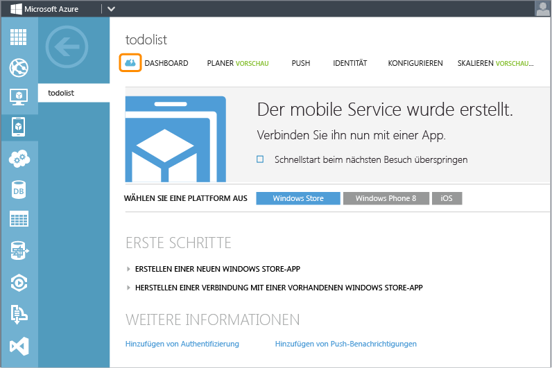

2.  Klicken Sie auf die **Windows Store**-Plattform. Erweitern Sie im Abschnitt **Get Started** den Eintrag **Connect an existing Windows Store app**, und klicken Sie auf **Download**, um ein personalisiertes Startprojekt für den mobilen Dienst herunterzuladen.

    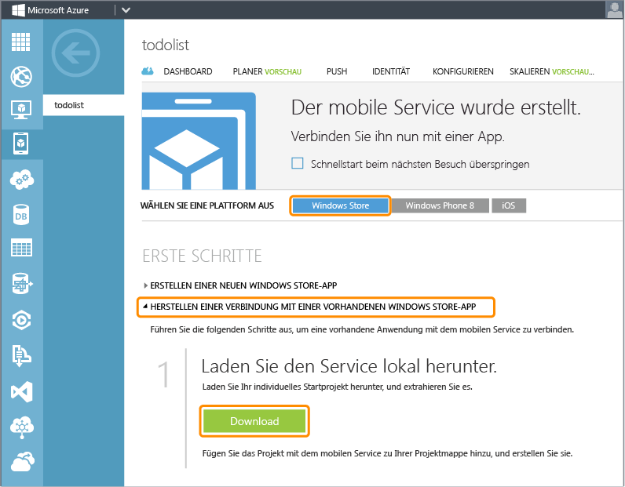

3.  Blättern Sie zum Ende des Abschnitts **Get Started** bis zum Schritt **Publish your service to the cloud**. Klicken Sie auf den im Screenshot gezeigten Link, um eine Veröffentlichungsprofildatei für den soeben heruntergeladenen mobilen Dienst herunterzuladen.

    > [WACOM.NOTE] Speichern Sie die Datei an einem sicheren Ort, da sie vertrauliche Daten zu Ihrem Azure-Konto enthält. Sie löschen diese Datei später in diesem Lernprogramm, nachdem Sie den mobilen Dienst veröffentlicht haben.

    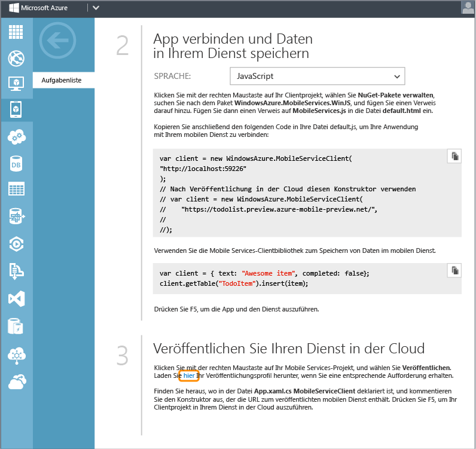

4.  Entpacken Sie das personalisierte Dienststartprojekt, das Sie heruntergeladen haben. Kopieren Sie die Ordner aus der ZIP-Datei in dasselbe **JavaScript**-Verzeichnis, in dem sich auch die Lösungsdatei (.sln) aus "Erste Schritte mit Daten" befindet. Dies erleichtert es dem NuGet-Paket-Manager, alle Pakete zu synchronisieren.

    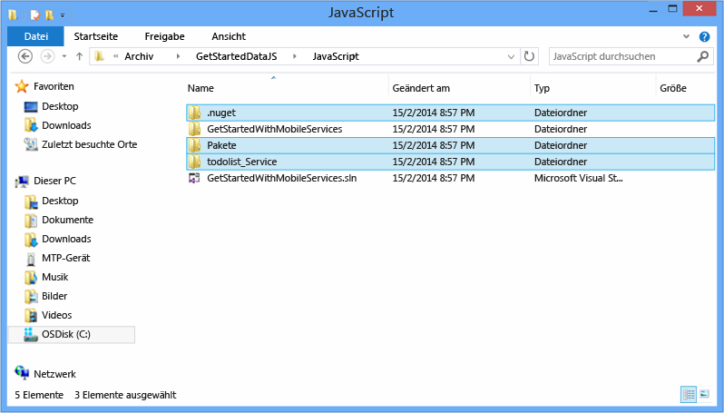

5.  Klicken Sie im Projektmappen-Explorer von Visual Studio mit der rechten Maustaste auf die Lösung für die Windows Store-App aus "Erste Schritte mit Daten". Klicken Sie auf **Hinzufügen** und anschließend auf **Vorhandenes Projekt**.

    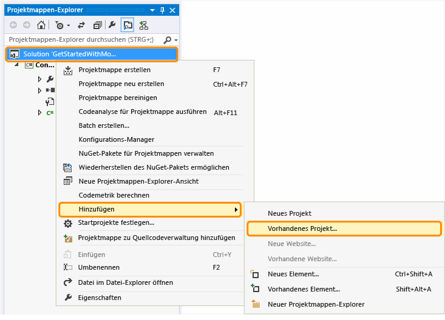

6.  Navigieren Sie im Dialogfeld "Add Existing Project" zum Projektordner des mobilen Diensts, den Sie in das **JavaScript**-Verzeichnis verschoben haben. Wählen Sie die C\#-Projektdatei (.csproj) im Dienstunterverzeichnis aus. Klicken Sie auf **Öffnen**, um das Projekt zu Ihrer Lösung hinzuzufügen.

    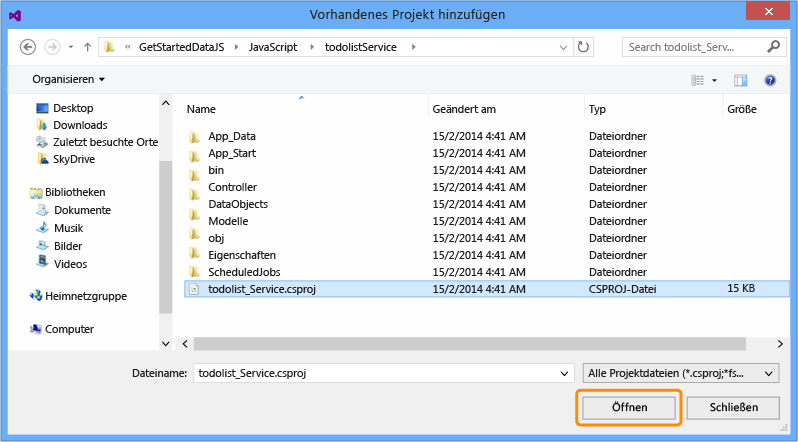

7.  Klicken Sie im Projektmappen-Explorer in Visual Studio mit der rechten Maustaste auf das soeben hinzugefügte Dienstprojekt und anschließend auf **Build**, um sicherzustellen, dass es fehlerfrei erstellt wird. Während des Erstellens muss der NuGet-Paket-Manager möglicherweise einige NuGet-Pakete wiederherstellen, auf die im Projekt verwiesen wird.

    

8.  Klicken Sie erneut mit der rechten Maustaste auf das Dienstprojekt. Klicken Sie diesmal im Kontextmenü **Debuggen** auf **Neue Instanz starten**.

    

    Visual Studio öffnet die Standardwebseite für Ihren Dienst. Sie können auf **Jetzt testen** klicken, um die Methoden in Ihrem mobilen Dienst von der Standardwebseite aus zu testen.

    

    Visual Studio hostet Ihren mobilen Dienst standardmäßig lokal in IIS Express. Klicken Sie zum Anzeigen mit der rechten Maustaste in der Taskleiste auf das IIS Express-Symbol.

    

Aktualisieren der Windows Store-AppAktualisieren der Windows Store-App zur Verwendung des mobilen Diensts
---------------------------------------------------------------------------------------------------------

In diesem Abschnitt aktualisieren Sie die Windows Store-App, um den mobilen Dienst als Backend-Dienst für die Anwendung zu verwenden.

1.  Klicken Sie im Projektmappen-Explorer in Visual Studio mit der rechten Maustaste auf das Windows Store-App-Projekt, und wählen Sie dann **NuGet-Pakete verwalten** aus.

    

2.  Suchen Sie im Dialogfeld "NuGet-Pakete verwalten" den Eintrag **WindowsAzure.MobileServices.WinJS** in der Online-Paketauflistung, und klicken Sie, um das Azure Mobile Services NuGet-Paket zu installieren. Schließen Sie dann das Dialogfeld.

    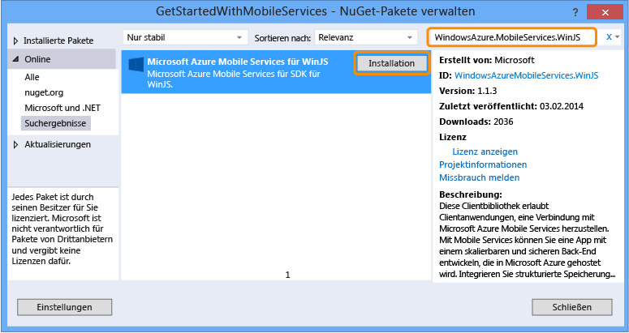

3.  Suchen Sie im Azure-Verwaltungsportal auf der Übersichtsseite für den mobilen Dienst den Schritt **Connect your app and store data in your service**. Wählen Sie **JavaScript** als ihre Sprache aus, und kopieren Sie den Codeausschnitt zum Erstellen von `MobileServiceClient`.

    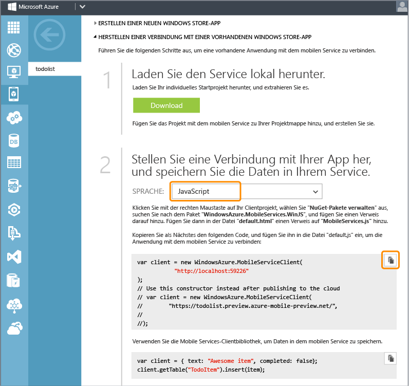

4.  Erweitern Sie im Projektmappen-Explorer in Visual Studio den Ordner **js**, und öffnen Sie "default.js". Fügen Sie den kopierten Codeausschnitt in den Ereignishandler `app.onactivated` direkt vor der Definition der `todoItems`-Variable ein. Beachten Sie, dass der Codeausschnitt einen auskommentierten Konstruktor für die Verbindung mit dem mobilen Dienst in Azure mithilfe des Anwendungsschlüssels enthält. Das Kommentarzeichen wird in einem späteren Schritt entfernt.

    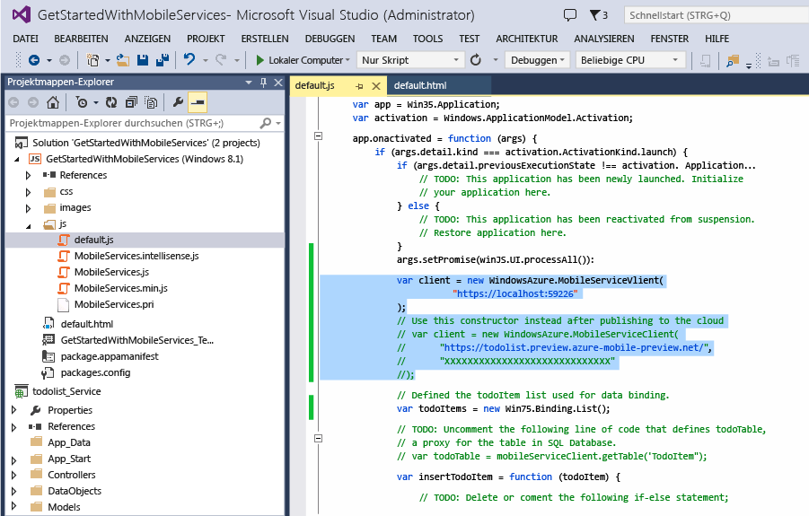

5.  Ersetzen Sie in "default.js" den Rest des Codes für den Ereignishandler `app.onactiviated` durch den folgenden Code, der `todoItems` und die Vorgänge definiert, die wir mit dem mobilen Dienst testen wollen. Speichern Sie anschließend die Datei.

    Dieser Code verwendet das Mobile Services SDK für JavaScript, um der App das Speichern der Daten in einer Tabelle zu ermöglichen, die vom Dienst bereitgestellt wird, statt lokal im Arbeitsspeicher. Die drei Hauptmethoden sind `insertTodoItem`, `refreshTodoItems` und `updateCheckedTodoItem`. Diese drei Methoden ermöglichen das asynchrone Einfügen, Abfragen und Aktualisieren der Datensammlung mit einer Tabelle in Azure.

             var todoTable = client.getTable('TodoItem');
             var todoItems = new WinJS.Binding.List();
             var insertTodoItem = function (todoItem) {
                 // Dieser Code fügt ein neues TodoItem in die Datenbank ein. 
                 // Mobile Service weist jedem Element eine ID zu, 
                 // Element wird zur bindenden Liste hinzugefügt.
                 todoTable.insert(todoItem).done(function (item) {
                     todoItems.push(item);
                 });
             };
             var refreshTodoItems = function () {
                 // Dieser Code aktualisiert die Einträge in der Listenansicht, 
                 // indem die TodoItems-Tabelle abgefragt wird.
                 todoTable.where()
                     .read()
                     .done(function (results) {
                         todoItems = new WinJS.Binding.List(results);
                         listItems.winControl.itemDataSource = todoItems.dataSource;
                     });
             };
             var updateCheckedTodoItem = function (todoItem) {
                 // Dieser Code aktualisiert die Datenbank. 
                 // Sobald der MobileService antwortet, 
                 // wird das Element aus der Liste entfernt. 
                 todoTable.update(todoItem).done(function (item) {
                     todoItems.splice(todoItems.indexOf(item), 1);
                 });
             };
             buttonSave.addEventListener("click", function () {
                 insertTodoItem({
                     text: textInput.value,
                     complete : falsch
                 });
             });
             buttonRefresh.addEventListener("click", function () {
                 refreshTodoItems();
             });
             listItems.addEventListener("change", function (eventArgs) {
                 var todoItem = eventArgs.target.dataContext.backingData;
                 todoItem.complete = eventArgs.target.checked;
                 updateCheckedTodoItem(todoItem);
             });
             refreshTodoItems();

6.  Öffnen Sie im Projektmappen-Explorer in Visual Studio die Datei "default.html". Fügen Sie oben in der Datei eine neue WinJS-Skriptreferenz für MobileServices.js ein. Speichern Sie anschließend die Datei.

         

    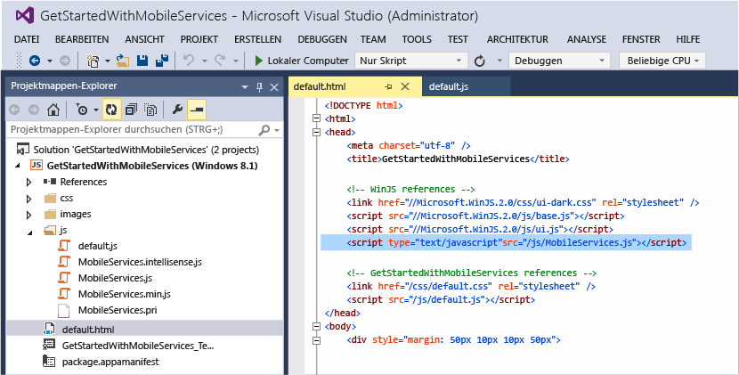

Lokales Testen der Windows Store-AppTesten der Windows Store-App mit dem lokal gehosteten Dienst
------------------------------------------------------------------------------------------------

In diesem Abschnitt verwenden Sie Visual Studio, um den mobilen Dienst lokal auf Ihrer Entwicklungsarbeitsstation in IIS Express zu hosten. Anschließend testen Sie die App und den Backend-Dienst.

1.  Drücken Sie in Visual Studio die Taste F7, oder klicken Sie im Build-Menü auf **Projektmappe erstellen**, um die Windows Store-App und den mobilen Dienst zu erstellen. Vergewissern Sie sich im Ausgabefenster von Visual Studio, dass beide Projekte ohne Fehler erstellt werden.

    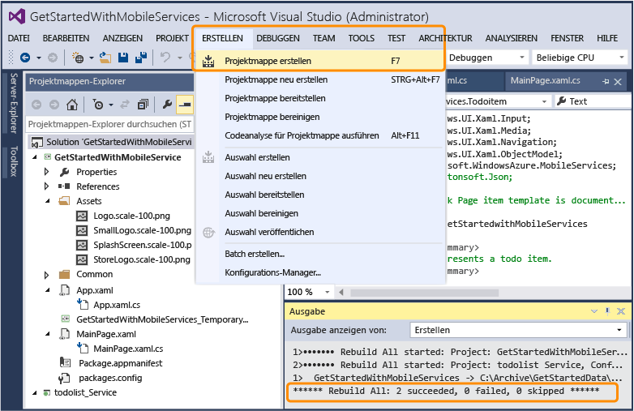

2.  Drücken Sie in Visual Studio die Taste F5, oder klicken Sie im Debuggen-Menü auf **Debugging starten**, um die App auszuführen und den mobilen Dienst lokal in IIS Express zu hosten.

    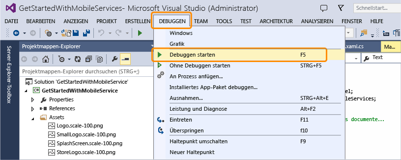

3.  Geben Sie einen neuen Text für "todoitem" ein. Klicken Sie anschließend auf **Save**. Daraufhin wird ein neues todoItem in die Datenbank eingefügt, die vom mobilen Dienst, der lokal in IIS Express gehostet wird, erstellt wurde.

    

4.  Klicken Sie auf das Kontrollkästchen für eines der Elemente, um es als abgeschlossen zu markieren.

    

5.  In Visual Studio können Sie die Änderungen in der Datenbank anzeigen, die für den Backend-Dienst erstellt wurde, indem Sie den Server-Explorer öffnen und die Datenverbindungen erweitern. Klicken Sie in der TodoItems-Tabelle mit der rechten Maustaste unter **MS\_TableConnectionString**, und klicken Sie dann auf **Show Table Data**.

    

Veröffentlichen des mobilen Diensts in AzureVeröffentlichen des mobilen Diensts in Azure
----------------------------------------------------------------------------------------

[WACOM.INCLUDE [mobile-services-dotnet-backend-publish-service](../includes/mobile-services-dotnet-backend-publish-service.md)]

Testen des mobilen Diensts in AzureTesten des mobilen Diensts in Azure
----------------------------------------------------------------------

1.  Erweitern Sie im Projektmappen-Explorer in Visual Studio den Ordner **js**, und öffnen Sie die Datei "default.js". Kommentieren Sie den Code aus, der den `MobileServiceClient` erstellt, welcher mit dem lokal gehosteten mobilen Dienst verbunden wird. Entfernen Sie die Kommentarzeichen für den Code, der den `MobileServiceClient` erstellt, welcher mit dem Dienst in Azure verbunden wird. Speichern Sie die Änderungen an der Datei.

         //var client = new WindowsAzure.MobileServiceClient(
         //          "http://localhost:59226"
         //);
         // Stattdessen diesen Konstruktor nach Cloudveröffentlichung verwenden
         var client = new WindowsAzure.MobileServiceClient(
             "https://todolist.preview.azure-mobile-preview.net/",
             "XXXXXXXXXXXXXXXXXXXXXXXXXXXXXXXX");

2.  Drücken Sie in Visual Studio die Taste F5, oder klicken Sie im Debuggen-Menü auf **Debugging starten**. Daraufhin wird die Windows Store-App mit den vorhergehenden Änderungen neu erstellt, bevor die App ausgeführt wird, um eine Verbindung mit dem mobilen Dienst herzustellen, welcher remote in Azure gehostet wird.

    

3.  Geben Sie neue "todoitems" ein, und klicken Sie jeweils auf **Speichern**. Klicken Sie auf die Kontrollkästchen für einige der neuen Elemente, um sie abzuschließen. Jedes neue todoItem wird in der SQL-Datenbank, die Sie zuvor für Ihren mobilen Dienst im Azure-Verwaltungsportal konfiguriert haben, gespeichert und aktualisiert.

    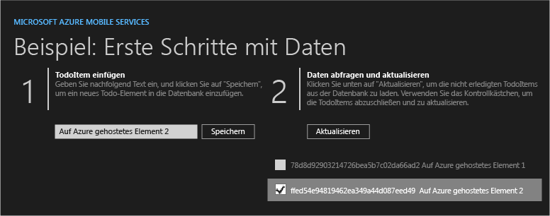

    Sie können die App neu starten, um zu sehen, dass die Änderungen in die Datenbank in Azure übernommen wurden. Außerdem können Sie die Datenbank im Azure-Verwaltungsportal oder im Visual Studio SQL Server-Objekt-Explorer überprüfen. In den nächsten beiden Schritten wird das Azure-Verwaltungsportal verwendet, um die Änderungen in der Datenbank anzuzeigen.

4.  Klicken Sie im Azure-Verwaltungsportal auf die Option zum Verwalten der Datenbank, die mit Ihrem mobilen Dienst verknüpft ist.

    

5.  Führen Sie im Verwaltungsportal eine Abfrage aus, um die von der Windows Store-App vorgenommenen Änderungen anzuzeigen. Ihre Abfrage sieht in etwa wie folgt aus, nur dass Sie Ihren Datenbanknamen statt `todolist` verwenden.

         SELECT * FROM [todolist].[todoitems]

    

Damit ist das Lernprogramm **Erste Schritte mit Daten** beendet.

Nächste Schritte
----------------

In diesem Lernprogramm wurden die Grundlagen der Aktivierung einer Windows Store-App für die Arbeit mit Daten in Mobile Services gezeigt. Als Nächstes können Sie eines der folgenden Lernprogramme ausführen, das auf der GetStartedWithData-App aufbaut, die Sie in diesem Lernprogramm erstellt haben:

-   [Prüfen und Ändern von Daten mit Skripten](/de-de/develop/mobile/tutorials/validate-modify-and-augment-data-js)
     Informationen zur Verwendung von Serverskripts in Mobile Services, um von Ihrer App gesendete Daten zu prüfen und zu ändern.

-   [Optimieren von Abfragen mittels Paging](/de-de/develop/mobile/tutorials/add-paging-to-data-js)
     Informationen zur Verwendung von Paging in Abfragen, um die in einer einzelnen Anforderung behandelte Datenmenge zu steuern.

Wenn Sie die Datenreihe abgeschlossen haben, können Sie eines der folgenden Lernprogramme ausprobieren:

-   [Erste Schritte mit der Authentifizierung](/de-de/documentation/articles/mobile-services-dotnet-backend-windows-store-javascript-get-started-users/)
     Informationen zur Authentifizierung von Benutzern Ihrer App.

-   [Erste Schritte mit Pushbenachrichtigungen](/de-de/documentation/articles/mobile-services-dotnet-backend-windows-store-javascript-get-started-push/)
     Informationen zum Senden einer einfachen Pushbenachrichtigung an Ihre App.

-   [Mobile Services .NET-Anleitungen: Konzeptionelle Referenz](/de-de/develop/mobile/how-to-guides/work-with-html-js-client/)
     Lernen Sie mehr über die Verwendung von Mobile Services mit HTML und JavaScript.

<!-- Images. -->
[0]: ./media/mobile-services-dotnet-backend-windows-store-javascript-get-started-data/app-view.png
[1]: ./media/mobile-services-dotnet-backend-windows-store-javascript-get-started-data/mobile-data-sample-download-javascript-vs13.png
[2]: ./media/mobile-services-dotnet-backend-windows-store-javascript-get-started-data/mobile-service-overview-page.png
[3]: ./media/mobile-services-dotnet-backend-windows-store-javascript-get-started-data/download-service-project.png
[4]: ./media/mobile-services-dotnet-backend-windows-store-javascript-get-started-data/add-service-project-to-solution.png
[5]: ./media/mobile-services-dotnet-backend-windows-store-javascript-get-started-data/download-publishing-profile.png
[6]: ./media/mobile-services-dotnet-backend-windows-store-javascript-get-started-data/add-existing-project-dialog.png
[7]: ./media/mobile-services-dotnet-backend-windows-store-javascript-get-started-data/vs-manage-nuget-packages.png
[8]: ./media/mobile-services-dotnet-backend-windows-store-javascript-get-started-data/manage-nuget-packages.png
[9]: ./media/mobile-services-dotnet-backend-windows-store-javascript-get-started-data/copy-mobileserviceclient-snippet.png
[10]: ./media/mobile-services-dotnet-backend-windows-store-javascript-get-started-data/vs-pasted-mobileserviceclient.png
[11]: ./media/mobile-services-dotnet-backend-windows-store-javascript-get-started-data/vs-build-solution.png
[12]: ./media/mobile-services-dotnet-backend-windows-store-javascript-get-started-data/vs-run-solution.png
[13]: ./media/mobile-services-dotnet-backend-windows-store-javascript-get-started-data/new-local-todoitem.png
[14]: ./media/mobile-services-dotnet-backend-windows-store-javascript-get-started-data/vs-show-local-table-data.png
[15]: ./media/mobile-services-dotnet-backend-windows-store-javascript-get-started-data/local-item-checked.png
[16]: ./media/mobile-services-dotnet-backend-windows-store-javascript-get-started-data/azure-items.png
[17]: ./media/mobile-services-dotnet-backend-windows-store-javascript-get-started-data/manage-sql-azure-database.png
[18]: ./media/mobile-services-dotnet-backend-windows-store-javascript-get-started-data/sql-azure-query.png
[19]: ./media/mobile-services-dotnet-backend-windows-store-javascript-get-started-data/vs-mobileservices-script-reference.png
[20]: ./media/mobile-services-dotnet-backend-windows-store-javascript-get-started-data/vs-build-service-project.png
[21]: ./media/mobile-services-dotnet-backend-windows-store-javascript-get-started-data/vs-start-debug-service-project.png
[22]: ./media/mobile-services-dotnet-backend-windows-store-javascript-get-started-data/service-welcome-page.png
[23]: ./media/mobile-services-dotnet-backend-windows-store-javascript-get-started-data/iis-express-tray.png

[26]: ./media/mobile-services-dotnet-backend-windows-store-javascript-get-started-data/copy-service-and-packages-folder.png

<!-- URLs. -->
[Validate and modify data with scripts]: /de-de/develop/mobile/tutorials/validate-modify-and-augment-data-js
[Refine queries with paging]: /de-de/develop/mobile/tutorials/add-paging-to-data-js
[Get started with Mobile Services]: /de-de/documentation/articles/mobile-services-dotnet-backend-windows-store-javascript-get-started/
[Get started with data]: /de-de/documentation/articles/mobile-services-dotnet-backend-windows-store-javascript-get-started-data/
[Get started with authentication]: /de-de/documentation/articles/mobile-services-dotnet-backend-windows-store-javascript-get-started-users/
[Get started with push notifications]: /de-de/documentation/articles/mobile-services-dotnet-backend-windows-store-javascript-get-started-push/
[JavaScript and HTML]: /de-de/develop/mobile/tutorials/get-started-with-data-js
[JavaScript backend version]: /de-de/develop/mobile/tutorials/get-started-with-data-js

[Azure Management Portal]: https://manage.windowsazure.com/
[Management Portal]: https://manage.windowsazure.com/
[Mobile Services SDK]: http://go.microsoft.com/fwlink/p/?LinkId=257545
[Developer Code Samples site]:  http://go.microsoft.com/fwlink/p/?LinkId=328660
[Mobile Services .NET How-to Conceptual Reference]: /de-de/develop/mobile/how-to-guides/work-with-html-js-client/
[MobileServiceClient class]: http://go.microsoft.com/fwlink/p/?LinkId=302030

