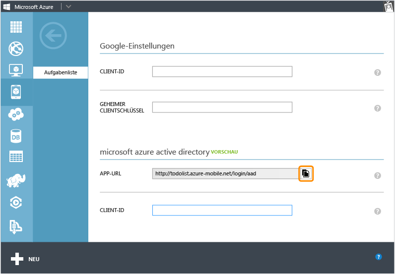
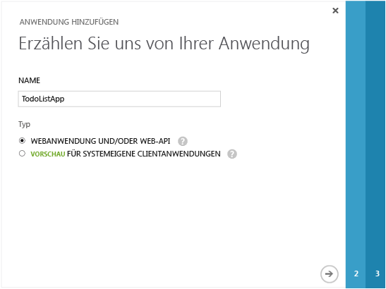
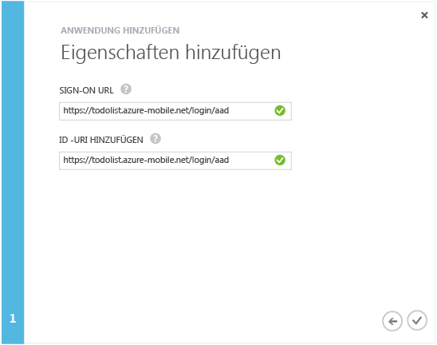
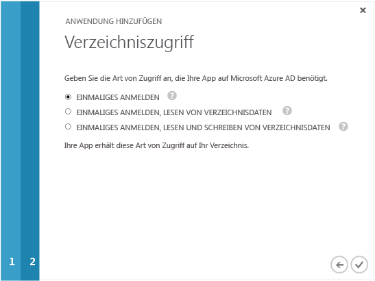

<properties linkid="develop-mobile-how-to-guides-register-for-active-directory-authentication" urlDisplayName="Register for Azure Active Directory Authentication" pageTitle="Register for Azure Active Directory authentication - Mobile Services" metaKeywords="Azure registering application, Azure Active Directory authentication, application authenticate, authenticate mobile services" description="Learn how to register for Azure Active Directory authentication in your Mobile Services application." title="Register your account to use an Azure Active Directory account login" authors="" />

Registrieren Ihrer Apps für die Verwendung einer Azure Active Directory-Anmeldung
=================================================================================

In diesem Thema erfahren Sie, wie Sie Ihre Apps registrieren, um Azure Active Directory als Authentifizierungsanbieter für Azure Mobile Services zu verwenden.

> [WACOM.NOTE] Der Azure Active Directory-Authentifizierungsanbieter für Mobile Services befindet sich momentan in der Vorschauphase. Bitte kontaktieren Sie <mobileservices@microsoft.com>, falls Sie an der Vorschauphase teilnehmen möchten. Andernfalls ist der Authentifizierungsanbieter nicht in der Registerkarte `Identity` Ihres mobilen Dienstes enthalten.

> [WACOM.NOTE]Wenn Sie auch eine clientgesteuerte Authentifizierung für einmaliges Anmelden (SSO) oder Pushbenachrichtigungen aus einer Windows Store-App bereitstellen möchten, sollten Sie die Registrierung Ihrer App beim Windows Store in Betracht ziehen. Weitere Informationen finden Sie unter [Registrieren Ihrer Windows Store-Apps für die Windows Live Connect-Authentifizierung](/en-us/develop/mobile/how-to-guides/register-for-single-sign-on).

1.  Melden Sie sich beim [Azure-Verwaltungsportal](https://manage.windowsazure.com/) an, klicken Sie auf **Mobile Services** und dann auf Ihren mobilen Dienst.

    

2.  Klicken Sie auf die Registerkarte **Identity** für Ihren mobilen Dienst.

    

3.  Blättern Sie nach unten bis zum Bereich für den **Azure active directory**-Identitätsanbieter und kopieren Sie die dort aufgelistete **APP URL**.

    

4.  Navigieren Sie zu **Active Directory** im Verwaltungsportal und klicken Sie auf Ihr Directory.

    

5.  Klicken Sie oben auf die Registerkarte **Applications** und anschließend auf **ADD**, um eine App hinzuzufügen.

    

6.  Klicken Sie auf **Add an application my organization is developing**.

7.  Geben Sie im Add Application-Assistenten einen **Namen** für Ihre Anwendung ein und klicken Sie auf den Typ **Web Application And/Or Web API**. Klicken Sie dann auf Continue.

    

8.  Fügen Sie im Feld **SIGN-ON URL** die App-ID ein, die Sie aus den Einstellungen für den Active Directory-Identitätsanbieter Ihres mobilen Dienstes kopiert haben. Geben Sie außerdem einen eindeutigen Ressourcen-Bezeichner in das Feld **App ID URI** ein. Die Anwendung verwendet diese URI zur Übermittlung von Anfragen zur einmaligen Anmeldung an das Azure Active Directory. Klicken Sie dann auf Continue.

    

9.  Aktivieren Sie den **Single Sign-On**-Zugriffstyp für die Anwendung. Schließen Sie anschließend den Add Application-Assistenten ab.

    

10. Blättern Sie ganz nach unten, nachdem die Anwendung hinzugefügt wurde. Klicken Sie anschließend auf den Bereich **Enable your app to read or write directory data**, um diesen zu erweitern. Kopieren Sie nun die **Client ID** für die App.

    

11. Kehren Sie zur Registerkarte **Identity** für Ihren mobilen Dienst zurück. Fügen Sie am unteren Ende die **Client ID**-Einstellung für den Azure Active Directory-Identitätsanbieter ein. Klicken Sie anschließend auf **Save**.

    

Sie können nun Azure Active Directory für die Authentifizierung in Ihrer App verwenden.

