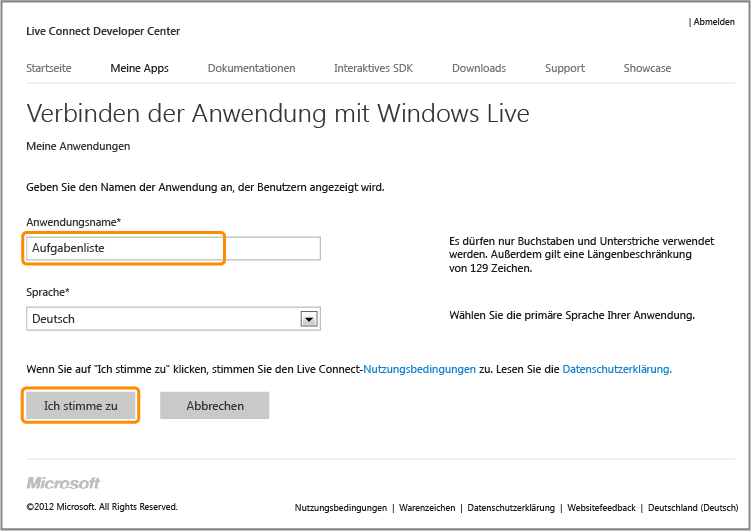

<properties pageTitle="Register for Microsoft authentication - Mobile Services" metaKeywords="Azure registering application, Azure Microsoft authentication, application authenticate, authenticate mobile services" description="Learn how to register for Microsoft authentication in your Azure Mobile Services application." metaCanonical="" disqusComments="0" umbracoNaviHide="1" title="Register your apps to use a Microsoft Account login" authors="" />

Registrieren Ihrer Apps für die Verwendung einer Microsoft Account-Anmeldung
============================================================================

In diesem Thema erfahren Sie, wie Sie Ihre Apps registrieren, um Live Connect als Authentifizierungsanbieter für Azure Mobile Services zu verwenden.

> [WACOM.NOTE]Wenn Sie auch eine clientgesteuerte Authentifizierung für einmaliges Anmelden (SSO) oder Pushbenachrichtigungen aus einer Windows Store-App bereitstellen möchten, sollten Sie die Registrierung Ihrer App beim Windows Store in Betracht ziehen. Weitere Informationen finden Sie unter [Registrieren Ihrer Windows Store-Apps für die Windows Live Connect-Authentifizierung](/en-us/develop/mobile/how-to-guides/register-for-single-sign-on).

1.  Navigieren Sie im Live Connect Developer Center zur Seite [Eigene Apps](http://go.microsoft.com/fwlink/p/?LinkId=262039), und melden Sie sich, falls erforderlich, mit Ihrem Microsoft-Konto an.

2.  Klicken Sie auf **Anwendung erstellen**, geben Sie dann einen **Anwendungsnamen** ein, und klicken Sie auf **Ich stimme zu**.

   	 

   	Damit wird die Anwendung bei Live Connect registriert.

3.  Klicken Sie auf die Seite **App-Einstellungen**, dann auf **API-Einstellungen**, und notieren Sie sich die Werte von **Client-ID** und **Geheimer Clientschlüssel**.

   	

    
<b>Sicherheitshinweis</b>
	
Der geheime Clientschlüssel ist eine wichtige Sicherheitsanmeldeinformation. Teilen Sie den geheimen Clientschlüssel mit niemandem, und geben Sie ihn nicht über Ihre App frei.

    

1.  Geben Sie in **Umleitungsdomäne** die URL Ihres mobilen Diensts ein, und klicken Sie dann auf **Speichern**.

Sie können nun eine Microsoft Account-Anmeldung für die Authentifizierung in Ihrer App verwenden, indem Sie die Client-ID und den geheimen Clientschlüssel für Mobile Services bereitstellen.

