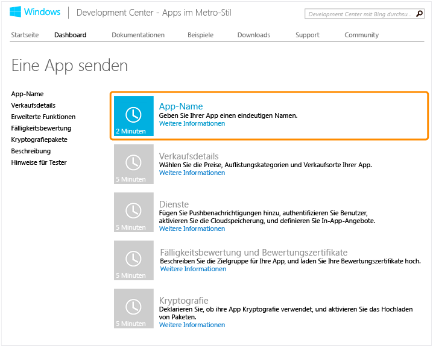
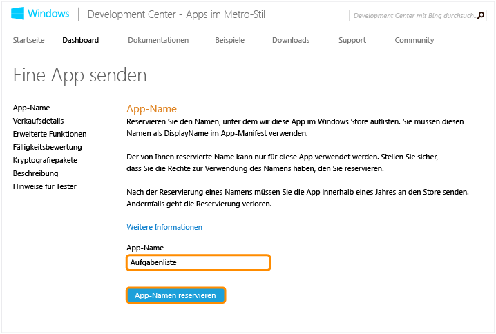
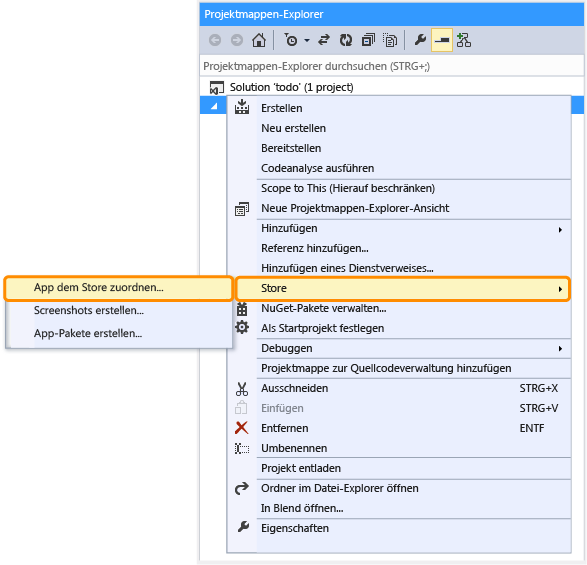
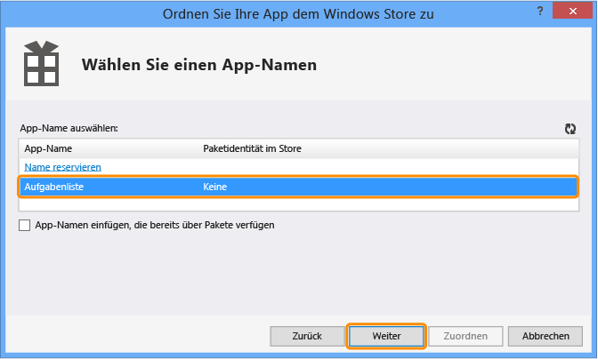
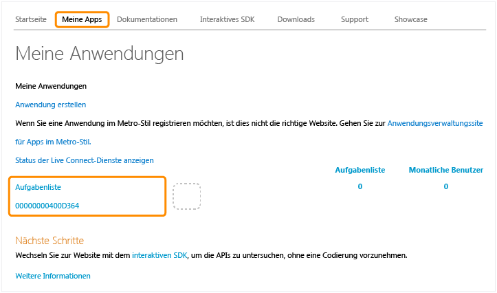

<properties linkid="develop-mobile-how-to-guides-register-for-single-sign-on" urlDisplayName="Register for single sign on" pageTitle="Register for single sign-on - Azure Mobile Services" metaKeywords="" description="Learn how to register for single sign-on authentication in your Azure Mobile Services application." metaCanonical="" services="" documentationCenter="" title="Register your Windows Store apps to use Windows Live Connect single sign-on" authors="" solutions="" manager="" editor="" />

Registrieren Ihrer Windows Store-App für die einmalige Anmeldung mit Windows Live Connect
=========================================================================================

In diesem Thema erfahren Sie, wie Sie Ihre App im Windows Store registrieren, um Live Connect als Authentifizierungsanbieter für einmalige Anmeldung in Azure Mobile Services zu verwenden. Dieser Schritt wird ebenfalls für die Verwendung von Pushbenachrichtigungen benötigt.

**Hinweis**

Sie müssen Ihre App nicht im Windows Store registrieren, um Microsoft-Konten für die Authentifizierung zu verwenden, bevor Sie Ihre App veröffentlichen. Falls Ihre Windows Store-App keine einmalige Anmeldung oder Pushbenachrichtigungen benötigt, können Sie die App einfach mit Live Connect für die Verwendung von Microsoft-Konten registrieren. Weitere Informationen finden Sie unter [Registrieren Ihrer Windows Store-Apps zum Verwenden von Microsoft-Konten](/en-us/develop/mobile/how-to-guides/register-for-microsoft-authentication).

1.  Falls Sie Ihre Anwendung noch nicht registriert haben, navigieren Sie im Entwicklungscenter für Windows Store-Anwendungen zu [Submit an app page](http://go.microsoft.com/fwlink/p/?LinkID=266582), melden Sie sich mit Ihrem Microsoft-Konto an, und klicken Sie dann auf **App name**.

      

2.  Geben Sie einen Namen für die App unter **App Name** ein, klicken Sie auf **Reserve app name** und dann auf **Save**.

      

      Daraufhin wird eine neue Windows Store-Registrierung für Ihre Anwendung erstellt.

3.  Öffnen Sie in Visual Studio 2012 Express für Windows 8 das Projekt, das Sie erstellt haben, als Sie das Lernprogramm [Erste Schritte mit Mobile Services](/en-us/develop/mobile/tutorials/get-started) abgeschlossen haben.

4.  Klicken Sie im Projektmappen-Explorer mit der rechten Maustaste auf **Store**, und klicken Sie dann auf **Associate App with the Store...**.

    
     Daraufhin wird der Assistent **Associate Your App with the Windows Store** angezeigt.

1.  Klicken Sie im Assistenten auf **Sign in**. Melden Sie sich dann mit Ihrem Microsoft-Konto ein.

2.  Wählen Sie die App aus, die Sie in Schritt 2 registriert haben, klicken Sie auf **Next** und dann auf **Associate**.

      

      Daraufhin werden die erforderlichen Windows Store-Registrierungsinformationen zum Anwendungsmanifest hinzugefügt.    

3.  Navigieren Sie zur Seite [My Applications](http://go.microsoft.com/fwlink/p/?LinkId=262039) im Live Connect Developer Center, und klicken Sie in der Liste **My applications** auf Ihre App.

       

4.  Klicken Sie auf **Edit Settings**, dann auf **API Settings** und notieren Sie sich den Wert für **Client secret**.

    

    
<b>Security Note</b>
    
Der Clientschlüssel ist eine wichtige Anmeldeinformation. Teilen Sie den Clientschlüssel mit niemandem, und geben Sie ihn nicht über Ihre App frei.

    

1.  Geben Sie unter **Redirect domain** die URL Ihres mobilen Dienstes aus Schritt 8 ein, und klicken Sie auf **Save**.

Nun können Sie die Authentifizierung mit Live Connect in Ihre App integrieren. Mobile Services bietet die beiden folgenden Methoden zur Authentifizierung von Benutzern mit Live Connect an:

-   Einmaliges Anmelden für Windows Store-Apps. Mit dieser Methode müssen die Benutzer die Authentifizierung in Ihrer App per Live Connect nur einmal autorisieren. Anschließend werden die Anmeldeinformationen anhand der Benutzerpräferenzen von Windows verwaltet. Weitere Informationen finden Sie unter [Einmalige Anmeldung für Windows Store Apps mithilfe von Live Connect](/en-us/develop/mobile/tutorials/single-sign-on-windows-8-dotnet).

-   Einfache Authentifizierung. Diese Methode unterstützt eine Vielzahl verschiedener Authentifizierungsanbieter, allerdings müssen sich die Benutzer bei jedem Start der App erneut anmelden. Weitere Informationen finden Sie unter [Erste Schritte mit der Authentifizierung](/en-us/develop/mobile/tutorials/get-started-with-users-dotnet).

