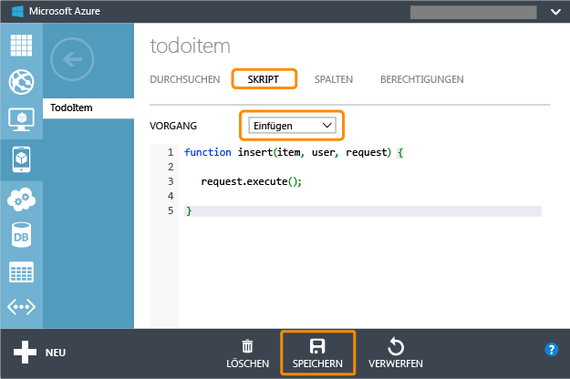
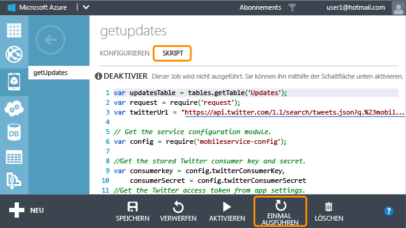

<properties linkid="register-for-facebook-auth" urlDisplayName="Mobile Services" pageTitle="Work with server scripts in Mobile Services" metaKeywords="server scripts, mobile devices, Azure, scheduler" description="Provides examples on how to define, register, and use server scripts in Azure Mobile Services." metaCanonical="" services="" documentationCenter="Mobile" title="Work with server scripts in Mobile Services" authors="ricksal" solutions="" manager="" editor="" />

Arbeiten mit Serverskripts in Mobile Services
=============================================

Dieser Artikel enthält ausführliche Informationen und Beispiele zum Arbeiten mit Serverskripts in Azure Mobile Services. Der Artikel ist in folgende Abschnitte unterteilt:

-   [Einführung](#intro)
-   [Tabellenvorgänge](#table-scripts)
    -   [Gewusst wie: Registrierung für Tabellenvorgänge](#register-table-scripts)
    -   [Gewusst wie: Außerkraftsetzen der Standardantwort](#override-response)
    -   [Gewusst wie: Außer Kraft setzen des Ausführungserfolgs](#override-success)
    -   [Gewusst wie: Außerkraftsetzen der Standard-Fehlerbehandlung](#override-error)
    -   [Gewusst wie: Hinzufügen benutzerdefinierter Parameter](#access-headers)
    -   [Gewusst wie: Arbeiten mit Tabellenbenutzern](#work-with-users)
-   [Benutzerdefinierter API](#custom-api)
    -   [Gewusst wie: Definieren einer benutzerdefinierten API](#define-custom-api)
    -   [Gewusst wie: Implementieren von HTTP-Methoden](#handle-methods)
    -   [Gewusst wie: Senden und Empfangen von Daten als XML](#api-return-xml)
    -   [Gewusst wie: Arbeiten mit Benutzern und Headern in benutzerdefinierten APIs](#get-api-user)
    -   [Gewusst wie: Definieren mehrerer Routen in einer benutzerdefinierten API](#api-routes)
-   [Auftragsplaner](#scheduler-scripts)
    -   [Gewusst wie: Definieren geplanter Auftragsskripts](#scheduler-scripts)
-   [Quellcodeverwaltung, freigegebener Code und Hilfsfunktionen](#shared-code)
    -   [Gewusst wie: Laden von Node.js-Modulen](#modules-helper-functions)
    -   [Gewusst wie: Arbeiten mit Hilfsfunktionen](#helper-functions)
    -   [Gewusst wie: Freigeben von Code mithilfe von Quellcodeverwaltung](#shared-code-source-control)
    -   [Gewusst wie: Arbeiten mit App-Einstellungen](#app-settings)
-   [Arbeiten mit dem Befehlszeilentool](#command-prompt)
-   [Arbeiten mit Tabellen](#working-with-tables)
    -   [Gewusst wie: Tabellenzugriff in Skripts](#access-tables)
    -   [Gewusst wie: Ausführen von Masseneinfügungen](#bulk-inserts)
    -   [Gewusst wie: Zuordnen von JSON-Typen zu Datenbanktypen](#JSON-types)
    -   [Tabellenzugriff mit Transact-SQL](#TSQL)
-   [Debuggen und Problembehandlung](#debugging)
    -   [Gewusst wie: Schreiben von Ausgaben in die Mobile Service-Protokolle](#write-to-logs)

Einführung
----------

In Mobile Services können Sie Ihre eigene Geschäftslogik in Form von JavaScript-Code definieren, der auf dem Server abgelegt und ausgeführt wird. Dieser serverseitige Skriptcode ist einer der folgenden Serverfunktionen zugewiesen:

-   [Lese-, Schreib-, Änderungs- oder Löschvorgänge in einer bestimmten Tabelle](#table-scripts).
-   [Geplante Aufträge](#scheduler-scripts).
-   [Definieren von HTTP-Methoden in einer benutzerdefinierten API](#custom-api).

Die Signatur der main-Funktion im Serverskript hängt davon ab, in welchem Kontext das Skript verwendet wird. Sie können auch CommonScript-Code als nodes.js-Module definieren, die von verschiedenen Skripts genutzt werden. Weitere Informationen finden Sie unter [Quellcodeverwaltung und freigegebener Code](#shared-code).

Beschreibungen zu einzelnen Serverskript-Objekten und -Funktionen finden Sie unter [Skriptreferenz für Mobile Services-Server](http://msdn.microsoft.com/en-us/library/windowsazure/jj554226.aspx).

Tabellenvorgänge
----------------

Tabellenvorgänge sind Serverskripts, die für einen Vorgang auf einer Tabelle registriert sind: einfügen, lesen, ändern oder löschen (*del*). Der Name des Skripts muss mit dem Vorgang übereinstimmen, für die es registriert ist. Pro Tabellenvorgang kann nur ein Skript registriert werden. Das Skript wird jedes mal ausgeführt, wenn der entsprechende Vorgang durch eine REST-Anforderung aufgerufen wird, z. B. beim Empfang einer POST-Anforderung zum Einfügen eines Elements in die Tabelle. Mobile Services speichert den Status zwischen einzelnen Skriptausführungen nicht. Da bei jeder Skriptausführung ein neuer globaler Kontext erstellt wird, werden sämtliche im Skript definierten Statusvariablen neu initialisiert. Falls Sie den Status zwischen einzelnen Anforderungen speichern möchten, erstellen Sie eine Tabelle in Ihrem Mobile Service und speichern Sie den Status in dieser Tabelle. Weitere Informationen finden Sie unter [Gewusst wie: Tabellenzugriff in Skripts](#access-tables).

Skripts für Tabellenvorgänge dienen zur Umsetzung von benutzerdefinierter Geschäftslogik bei der Ausführung des Vorgangs. Das folgende Skript verhindert z. B. Einfügevorgänge, wenn die Zeichenfolge im Feld `Text` länger als zehn Zeichen ist:

    function insert(item, user, request) {
        if (item.text.length > 10) {
            request.respond(statusCodes.BAD_REQUEST, 
                'Der Text muss kürzer als 10 Zeichen lang sein');
        } else {
            request.execute();
        }
    }

Tabellen-Skriptfunktionen nehmen immer drei Argumente entgegen.

-   Das erste Argument variiert je nach Tabellenvorgang.

    -   Für Insert- und Update-Vorgänge ist dies ein **Item**-Objekt mit einer JSON-Abbildung der vom entsprechenden Vorgang betroffenen Zeile. Auf diese Weise können Sie die Spaltenwerte mit Namen ansprechen, z. B. *item.Owner*, wobei *Owner* einer der Namen in der JSON-Darstellung ist.
    -   Für Delete-Vorgänge ist dies die ID des zu löschenden Eintrags.
    -   Für Select-Vorgänge ist das erste Argument ein [Suchabfrageobjekt](http://msdn.microsoft.com/en-us/library/windowsazure/jj613353.aspx), welches das zurückzuliefernde Rowset angibt.
-   Das zweite Argument ist immer ein [Benutzerobjekt](http://msdn.microsoft.com/en-us/library/windowsazure/jj554220.aspx) und repräsentiert den Benutzer, der die Anforderung übermittelt hat.

-   Das dritte Argument ist immer ein [Anforderungsobjekt](http://msdn.microsoft.com/en-us/library/windowsazure/jj554218.aspx), mit dem Sie den angeforderten Vorgang und die an den Client geschickte Antwort steuern können.

Dies sind die kanonischen Signaturen der main-Funktion für die Tabellenvorgänge:

-   [Insert](http://msdn.microsoft.com/en-us/library/windowsazure/jj554229.aspx): `function insert (item, user, request) { ... }`
-   [Update](http://msdn.microsoft.com/en-us/library/windowsazure/jj554214.aspx): `function update (item, user, request) { ... }`
-   [Delete](http://msdn.microsoft.com/en-us/library/windowsazure/jj554215.aspx): `function del (id, user, request) { ... }`
-   [Read](http://msdn.microsoft.com/en-us/library/windowsazure/jj554224.aspx): `function read (query, user, request) { ... }`

> [WACOM.NOTE]Funktionen, die für den Delete-Vorgang registriert sind, müssen *del* genannt werden, da delete ein reserviertes Schlüsselwort in JavaScript ist.

Jedes Serverskript hat eine main-Funktion und weitere optionale Hilfsfunktionen. Auch wenn ein Serverskript für eine bestimmte Tabelle erstellt wurde, kann das Skript auf andere Tabellen in derselben Datenbank verweisen. Sie können auch allgemeine Funktionen als Module definieren, die von verschiedenen Skripts genutzt werden. Weitere Informationen finden Sie unter [Quellcodeverwaltung und freigegebener Code](#shared-code).

### Gewusst wie: Registrieren von Tabellenskripts

Sie können Serverskripts, die für einen Tabellenvorgang registriert sind, auf folgende Arten definieren:

-   Im [Azure-Verwaltungsportal](https://manage.windowsazure.com/). Sie finden die Skripts für Tabellenvorgänge in der Registerkarte **Skripts** für eine bestimmte Tabelle. Hier sehen Sie den Standardcode, der für das Insert-Skript der Tabelle `TodoItem` registriert ist. Sie können diesen Code mit Ihrer eigenen benutzerdefinierten Geschäftslogik überschreiben.

    

    Weitere Informationen hierzu finden Sie unter [Validate and modify data in Mobile Services by using server scripts](/en-us/develop/mobile/tutorials/validate-modify-and-augment-data-dotnet/) (Validierung und Änderung von Daten in Mobile Services mithilfe von Serverskripts, in englischer Sprache).

-   Mithilfe von Quellcodeverwaltung. Falls Sie Quellcodeverwaltung aktiviert haben, können Sie einfach eine Datei mit dem Namen *`<table>`*.*`<operation>`*.js im Unterordner .\\service\\table in Ihrem Git-Repository erstellen, wobei *`<table>`* der Name der Tabelle ist und *`<operation>`* der zu registrierende Tabellenvorgang. Weitere Informationen finden Sie unter [Quellcodeverwaltung und freigegebener Code](#shared-code).

-   Über die Eingabeaufforderung im Azure-Befehlszeilentool. Weitere Informationen finden Sie unter [Arbeiten mit dem Befehlszeilentool](#command-prompt).

Tabellenvorgänge müssen mindestens eine der folgenden Funktionen des [Anforderungsobjekt](http://msdn.microsoft.com/en-us/library/windowsazure/jj554218.aspx) aufrufen, um sicherzustellen, dass der Client eine Antwort erhält.

-   **execute function**: Der Vorgang wird wie angefordert ausgeführt und die Standardantwort zurückgeliefert.

-   **respond function**: Eine benutzerdefinierte Antwort wird zurückgegeben.

**Wichtig**

Falls ein Skript einen Codepfad enthält, in dem weder **execute** noch **respond** aufgerufen wird, kann es passieren, dass der Vorgang nicht reagiert.

Das folgende Skript ruft die **execute**-Funktion auf, um den vom Client angeforderten Datenvorgang abzuschließen:

    function insert(item, user, request) { 
        request.execute(); 
    }

In diesem Beispiel wird das Element in die Datenbank eingefügt und der entsprechende Statuscode an den Benutzer zurückgeliefert.

Beim Aufruf der **execute**-Funktion wird der Wert für `item`, [query](http://msdn.microsoft.com/en-us/library/windowsazure/jj613353.aspx) oder `id`, der als erstes Argument an die Skriptfunktion übergeben wurde, für den Vorgang verwendet. Für Insert-, Update- oder Query-Vorgänge können Sie Element oder Abfrage modifizieren, bevor Sie **execute** aufrufen:

    function insert(item, user, request) { 
        item.scriptComment =
            'Dies wurde per Skript hinzugefügt und wird in der Datenbank gespeichert'; 
        request.execute(); 
    } 
     
    function update(item, user, request) { 
        item.scriptComment = 
            'Dies wurde per Skript hinzugefügt und wird in der Datenbank gespeichert'; 
        request.execute(); 
    } 

    function read(query, user, request) { 
        // Nur Einträge für den aktuellen Benutzer zurückgeben       
        query.where({ userid: user.userId}); 
        request.execute(); 
    }

> [WACOM.NOTE]In Delete-Skripts haben Änderungen am Wert der übergebenen userId-Variable keinen Einfluss darauf, welcher Datensatz gelöscht wird.

Weitere Beispiele finden Sie unter [Lesen und Schreiben von Daten](http://msdn.microsoft.com/en-us/library/windowsazure/jj631640.aspx), [Ändern der Anforderung](http://msdn.microsoft.com/en-us/library/windowsazure/jj631635.aspx) und [Überprüfen von Daten](http://msdn.microsoft.com/en-us/library/windowsazure/jj631638.aspx).

### Gewusst wie: Außerkraftsetzen der Standardantwort

Sie können mithilfe von Skripts auch eine Prüflogik implementieren und das Standard-Antwortverhalten überschreiben. Falls die Überprüfung fehlschlägt, rufen Sie einfach die **respond**-Funktion anstelle der **execute**-Funktion auf und schreiben die Antwort an den Client:

    function insert(item, user, request) {
        if (item.userId !== user.userId) {
            request.respond(statusCodes.FORBIDDEN, 
            'Sie dürfen nur Einträge mit Ihrer Benutzer-ID hinzufügen.');
        } else {
            request.execute();
        }
    }

In diesem Beispiel wird die Anforderung abgelehnt, wenn das einzufügende Element keine `userId`-Eigenschaft hat, die mit der `userId` des [Benutzerobjekts](http://msdn.microsoft.com/en-us/library/windowsazure/jj554220.aspx) übereinstimmt, das für den authentifizierten Client geliefert wurde. In diesem Fall wird der Datenbankvorgang (*insert*) nicht ausgeführt, und der Client erhält eine Antwort mit HTTP-Statuscode 403 und einer benutzerdefinierten Fehlermeldung. Weitere Beispiele finden Sie unter [Ändern der Antwort](http://msdn.microsoft.com/en-us/library/windowsazure/jj631631.aspx).

### Gewusst wie: Außer Kraft setzen des Ausführungserfolgs

Die **execute**-Funktion in Tabellenvorgängen schreibt die Antworten standardmäßig automatisch. Sie können jedoch zwei optionale Parameter an die execute-Funktion übergeben, die dieses Verhalten im Erfolgs- und/oder Fehlerfall außer Kraft setzen.

Wenn Sie beim Aufruf von execute einen **success**-Handler übergeben, können Sie die Ergebnisse einer Anforderung modifizieren, bevor Sie diese in die Antwort schreiben. Das folgende Beispiel ruft `execute({ success: function(results) { ... })` auf, um zusätzliche Vorgänge auszuführen, nachdem die Daten aus der Datenbank gelesen wurden, jedoch bevor die Antwort geschrieben wird:

    function read(query, user, request) {
        request.execute({
            success: function(results) {
                results.forEach(function(r) {
                    r.scriptComment = 
                    'Dies wurde per Skript hinzugefügt, nachdem die Datenbank abgefragt wurde';
                });
                request.respond();
            }
        });
    }

Wenn Sie der **execute**-Funktion einen **success**-Handler übergeben, müssen Sie außerdem die **respond**-Funktion als Teil des **success**-Handlers aufrufen, um der Runtime mitzuteilen, dass das Skript abgeschlossen wurde und eine Antwort geschrieben werden kann. Wenn Sie **respond** ohne Argumente aufrufen, generiert Mobile Services die Standardantwort.

> [WACOM.NOTE]Sie können **respond** erst dann ohne Argumente aufrufen, um die Standardantwort zu erhalten, nachdem Sie die **execute**-Funktion aufgerufen haben.

### Gewusst wie: Außerkraftsetzen der Standard-Fehlerbehandlung

Die **execute**-Funktion kann fehlschlagen, wenn die Datenbankverbindung abbricht oder ein ungültiges Objekt bzw. eine ungültige Abfrage übergeben wird. Standardmäßig werden Fehler vom Serverskript in das Protokoll geschrieben, und der Client erhält eine Antwort mit einer Fehlermeldung. Dank der Standard-Fehlerbehandlung von Mobile Services müssen Sie eventuelle Fehler in Ihrem Dienst nicht behandeln.

Sie können die Standard-Fehlerbehandlung durch eine eigene Fehlerbehandlung überschreiben, falls Sie bestimmte Maßnahmen ergreifen oder über das globale Konsolenobjekt zusätzliche Detailinformationen in das Protokoll schreiben möchten. Übergeben Sie hierzu einen **error**-Handler an die **execute**-Funktion:

    function update(item, user, request) { 
      request.execute({ 
        error: function(err) { 
          // Benutzerdefinierte Protokollierung und anschließender Aufruf von respond. 
          request.respond(); 
        } 
      }); 
    }

Wenn Sie einen error-Handler übergeben, liefert Mobile Services ein Fehlerergebnis an den Client zurück, wenn **respond** aufgerufen wird.

Sie können bei Bedarf auch einen **success**- und einen **error**-Handler übergeben.

### Gewusst wie: Zugreifen auf benutzerdefinierte Parameter

Wenn Sie eine Anforderung an Ihren Mobile Service schicken, können Sie die Anforderungs-URI um benutzerdefinierte Parameter erweitern, um Ihrem Tabellenvorgangs-Skript mitzuteilen, wie eine bestimmte Anforderung behandelt werden soll. Anschließend ändern Sie Ihr Skript, sodass dieses den Parameter ausliest und den Verarbeitungspfad ermittelt.

Die folgende URI für eine POST-Anforderung weist den Service z. B. an, keine Einfügung von *TodoItem*s mit demselben Textwert zuzulassen:

     https://todolist.azure-mobile.net/tables/TodoItem
        duplicateText=false

Diese benutzerdefinierten Abfrageparameter können als JSON-Werte der **parameters**-Eigenschaft des [Anforderungsobjekts](http://msdn.microsoft.com/en-us/library/windowsazure/jj554218.aspx) abgerufen werden. Das **Anforderungsobjekt** wird von Mobile Services für alle Funktionen bereitgestellt, die für einen Tabellenvorgang registriert sind. Das folgende Serverskript für den insert-Vorgang prüft den Wert des Parameters `duplicateText`, bevor der insert-Vorgang ausgeführt wird:

     function insert(item, user, request) {
            var todoItemTable = tables.getTable('TodoItem');
            // Übergebenen benutzerdefinierten Parameter prüfen, um zu bestimmen,
            // ob duplizierte Textelemente eingefügt werden dürfen.          
            if (request.parameters.duplicateText === 'false') {
                // Suche nach existierenden Elementen mit demselben Text
                // die noch nicht als 'complete' markiert sind. 
                todoItemTable.where({
                    text: item.text,
                    complete: false
                }).read({
                    success: insertItemIfNotComplete
                });
            } else {
                request.execute();
            }

            function insertItemIfNotComplete(existingItems) {
                if (existingItems.length > 0) {
                    request.respond(statusCodes.CONFLICT, 
                        "Duplizierte Elemente sind nicht erlaubt.");
                } else {
                    // Normales Einfügen des Elements. 
                    request.execute();
                }
            }
        }

Beachten Sie, dass in **insertItemIfNotComplete** die **execute**-Funktion des [Anforderungsobjekts](http://msdn.microsoft.com/en-us/library/windowsazure/jj554218.aspx) aufgerufen wird, um das Element einzufügen, falls kein duplizierter Text vorhanden ist. Andernfalls wird die **respond**-Funktion aufgerufen, um den Client über den duplizierten Text zu informieren.

Beachten Sie die Syntax des Aufrufs an die **success**-Funktion im obigen Code:

}).read({

                 success: insertItemIfNotComplete
                });

In JavaScript ist dies eine kompakte Version des folgenden Codes:

     success: function(results) 
        { 
            insertItemIfNotComplete(results); 
        }

### Gewusst wie: Arbeiten mit Benutzern

In Azure Mobile Services können Sie Benutzer mithilfe von Identitätsanbietern authentifizieren. Weitere Informationen finden Sie unter [Get started with authentication](http://go.microsoft.com/fwlink/p/?LinkId=287177) (Erste Schritte zur Authentifizierung, in englischer Sprache). Wenn ein authentifizierter Benutzer einen Tabellenvorgang aufruft, verwendet Mobile Services das [Benutzerobjekt](http://msdn.microsoft.com/en-us/library/windowsazure/jj554220.aspx), um Informationen über den Benutzer an die registrierte Skriptfunktion zu liefern. Die **userId**-Eigenschaft kann zum Speichern und Abrufen benutzerspezifischer Informationen verwendet werden. Im folgenden Beispiel wird die owner-Eigenschaft eines Elements anhand der userId eines authentifizierten Benutzers gesetzt:

    function insert(item, user, request) {
        item.owner = user.userId;
        request.execute();
    }

Im nächsten Beispiel wird ein zusätzlicher Filter für die Abfrage anhand der **userId** eines authentifizierten Benutzers hinzugefügt: Dieser Filter schränkt das Ergebnis auf Elemente ein, die dem aktuellen Benutzer gehören:

    function read(query, user, request) {
        query.where({
            owner: user.userId
        });
        request.execute();
    }

Benutzerdefinierte API
----------------------

Benutzerdefinierte APIs sind Endpunkte in Ihrem Mobile Service, die von einer oder mehreren der Standard-HTTP-Methoden aufgerufen werden: GET, POST, PUT, PATCH, DELETE. Ein separater Funktionsexport kann für jede HTTP-Methode definiert werden, die von der benutzerdefinierten API unterstützt wird, alles zusammen in einer Skriptdatei. Das registrierte Skript wird aufgerufen, wenn eine Anforderung an die benutzerdefinierte API über die entsprechende Methode empfangen wird. Weitere Informationen finden Sie unter [Benutzerdefinierte API](http://msdn.microsoft.com/en-us/library/windowsazure/dn280974.aspx).

Bei Aufrufen von Funktionen einer benutzerdefinierten API durch die Mobile Services-Runtime werden sowohl [Anforderungs-](http://msdn.microsoft.com/en-us/library/windowsazure/jj554218.aspx) als auch [Antwort-](http://msdn.microsoft.com/en-us/library/windowsazure/dn303373.aspx)Objekt mitgeliefert. Diese Objekte machen die Funktionen der [express.js-Bibliothek](http://go.microsoft.com/fwlink/p/?LinkId=309046) verfügbar, die wiederum von Ihren Skripts verwendet werden können. Die folgende benutzerdefinierte API namens **hello** ist ein sehr einfaches Beispiel und gibt als Antwort auf eine POST-Anforderung *Hello, world!* zurück:

     exports.post = function(request, response) {
            response.send(200, "{ message: 'Hallo Welt!' }");
        } 

Die **send**-Funktion des [Antwortobjekts](http://msdn.microsoft.com/en-us/library/windowsazure/dn303373.aspx) gibt die gewünschte Antwort an den Client zurück. Sie können diesen Code aufrufen, indem Sie eine POST-Anforderung an die folgende URL schicken:

     https://todolist.azure-mobile.net/api/hello  

Der globale Status bleibt zwischen Ausführungen erhalten.

### Gewusst wie: Definieren einer benutzerdefinierten API

Sie können Serverskripts, die für HTTP-Methoden in einem Endpunkt einer benutzerdefinierten API registriert sind, auf folgende Arten definieren:

-   Im [Azure-Verwaltungsportal](https://manage.windowsazure.com/). Skripts für benutzerdefinierte APIs werden in der Registerkarte **API** erstellt und bearbeitet. Der Serverskript-Code befindet sich in der Registerkarte **Skripts** der jeweiligen benutzerdefinierten API. Es folgt ein Beispiel für ein Skript, das durch eine POST-Anforderung an den `CompleteAll`-Endpunkt der benutzerdefinierten API aufgerufen wird.

    

    Zugriffsberechtigungen für Methoden von benutzerdefinierten APIs werden in der Registerkarte Berechtigungen zugewiesen. Informationen zur Erstellung der API finden Sie unter [Call a custom API from the client](/en-us/develop/mobile/tutorials/call-custom-api-dotnet/#define-custom-api) (Aufrufen benutzerdefinierter APIs vom Client, in englischer Sprache.

-   Mithilfe von Quellcodeverwaltung. Falls Sie Quellcodeverwaltung aktiviert haben, können Sie einfach eine Datei mit dem Namen *`<custom data-morhtml="true"_api>`*.js im Unterordner .\\service\\api in Ihrem Git-Repository erstellen, wobei *`<custom data-morhtml="true"_api>`* der Name der zu registrierenden benutzerdefinierten API ist. Die Skriptdatei enthält eine *exported*-Funktion für jede HTTP-Methode, die von der benutzerdefinierten API verfügbar gemacht wird. Die Berechtigungen werden in einer separaten .json-Datei definiert. Weitere Informationen finden Sie unter [Quellcodeverwaltung und freigegebener Code](#shared-code).

-   Über die Eingabeaufforderung im Azure-Befehlszeilentool. Weitere Informationen finden Sie unter [Arbeiten mit dem Befehlszeilentool](#command-prompt).

### Gewusst wie: Implementieren von HTTP-Methoden

Benutzerdefinierte APIs können eine oder mehrere der HTTP-Methoden GET, POST, PUT, PATCH und DELETE verarbeiten. Für jede von der benutzerdefinierten API verarbeitete HTTP-Methode wird eine exported-Funktion definiert. Eine einzelne Codedatei einer benutzerdefinierten API kann eine oder alle der folgenden Funktionen exportieren:

     exports.get = function(request, response) { ... };
        exports.post = function(request, response) { ... };
        exports.patch = function(request, response) { ... };
        exports.put = function(request, response) { ... };
        exports.delete = function(request, response) { ... };

Der Endpunkt der benutzerdefinierten API kann nur mit den HTTP-Methoden aufgerufen werden, die im Serverskript implementiert sind, ansonsten wird eine Fehlerantwort 405 (Methode nicht erlaubt) zurückgegeben. Für die einzelnen HTTP-Methoden können separate Berechtigungsstufen vergeben werden.

### Gewusst wie: Senden und Empfangen von Daten als XML

Wenn Clients Daten speichern und abrufen, verwendet Mobile Services JavaScript Object Notation (JSON) für die Darstellung der Daten im Nachrichtentext. In manchen Szenarien macht es jedoch mehr Sinn, stattdessen eine XML-Nutzlast zu verwenden. Windows Store-Apps haben z. B. eine eingebaute Funktion für periodische Benachrichtigungen, die nur mit XML-Diensten funktioniert. Weitere Informationen finden Sie unter [Define a custom API that supports periodic notifications](/en-us/develop/mobile/tutorials/create-pull-notifications-dotnet/) (Definieren benutzerdefinierter APIs mit Unterstützung für periodische Benachrichtigungen, in englischer Sprache).

Die folgende **OrderPizza**-Funktion einer benutzerdefinierten API liefert ein einfaches XML-Dokument als Nutzlast der Antwort zurück.

     exports.get = function(request, response) {
          response.set('content-type', 'application/xml');
          var xml = '<
    xml version="1.0"
    ><PizzaOrderForm><PizzaOrderForm data-morhtml="true"/>';
          response.send(200, xml);
        };

Sie können diese Funktion aufrufen, indem Sie eine HTTP GET-Anforderung an den folgenden Endpunkt schicken:

     https://todolist.azure-mobile.net/api/orderpizza

### Gewusst wie: Arbeiten mit Benutzern und Headern in benutzerdefinierten APIs

In Azure Mobile Services können Sie Benutzer mithilfe von Identitätsanbietern authentifizieren. Weitere Informationen finden Sie unter [Get started with authentication](http://go.microsoft.com/fwlink/p/?LinkId=287177) (Erste Schritte zur Authentifizierung, in englischer Sprache). Wenn ein authentifizierter Benutzer eine benutzerdefinierte API aufruft, verwendet Mobile Services das [Benutzerobjekt](http://msdn.microsoft.com/en-us/library/windowsazure/jj554220.aspx), um Informationen über den Benutzer an den Code der benutzerdefinierten API zu liefern. Das [Benutzerobjekt](http://msdn.microsoft.com/en-us/library/windowsazure/jj554220.aspx) ist über die user-Eigenschaft des [Anforderungsobjekts](http://msdn.microsoft.com/en-us/library/windowsazure/jj554218.aspx) zugänglich. Die **userId**-Eigenschaft kann zum Speichern und Abrufen benutzerspezifischer Informationen verwendet werden.

In der folgenden **OrderPizza**-Funktion einer benutzerdefinierten API wird die owner-Eigenschaft eines Elements anhand der userId eines authentifizierten Benutzers gesetzt:

     exports.post = function(request, response) {
            var userTable = request.service.tables.getTable('user');
            userTable.lookup(request.user.userId, {
                success: function(userRecord) {
                    callPizzaAPI(userRecord, request.body, function(orderResult) {
                        response.send(201, orderResult);
                    });
                }
            });
        
        };

Sie können diese Funktion aufrufen, indem Sie eine HTTP POST-Anforderung an den folgenden Endpunkt schicken:

     https://<service>.azure-mobile.net/api/orderpizza

Sie können auch auf bestimmte HTTP-Header des [Anforderungsobjekts](http://msdn.microsoft.com/en-us/library/windowsazure/jj554218.aspx) zugreifen, wie der folgende Code zeigt:

     exports.get = function(request, response) {    
            var header = request.header('my-custom-header');
            response.send(200, "Ihre Anforderung: " + header);
        };

In diesem einfachen Beispiel wird ein benutzerdefinierter Header namens `my-custom-header` ausgelesen und der Wert in der Antwort zurückgegeben.

### Gewusst wie: Definieren mehrerer Routen in einer benutzerdefinierten API

Mit Mobile Services können Sie mehrere Pfade oder Routen in benutzerdefinierten APIs definieren. HTTP GET-Anforderungen an die folgenden URLs in einer benutzerdefinierten **Taschenrechner**-API werden z. B. die **add-** bzw. die **subtract-**Funktion aufrufen:

-   `https://<service>.azure-mobile.net/api/calculator/add`
-   `https://<service>.azure-mobile.net/api/calculator/sub`

Mehrere Routen werden durch den Export einer **register**-Funktion definiert, der ein **api**-Objekt übergeben wird (ähnlich dem [express-Objekt in express.js](http://expressjs.com/api.html#express)), das wiederum zum Registrieren von Routen innerhalb des Endpunkts der benutzerdefinierten API verwendet wird. Das folgende Beispiel implementiert die **add-** und **sub-**-Methoden in der benutzerdefinierten **Taschenrechner**-API:

     exports.register = function (api) {
            api.get('add', add);
            api.get('sub', subtract);
        }
        
        function add(req, res) {
            var result = parseInt(req.query.a) + parseInt(req.query.b);
            res.send(200, { result: result });
        }
        
        function subtract(req, res) {
            var result = parseInt(req.query.a) - parseInt(req.query.b);
            res.send(200, { result: result });
        }

Das an die **register**-Funktion übergebene **api**-Objekt macht eine Funktion für jede HTTP-Methode verfügbar (**get**, **post**, **put**, **patch**, **delete**). Diese Funktionen registrieren eine Route zu einer bestimmten Funktion für die entsprechende HTTP-Methode. Jede Funktion nimmt zwei Parameter entgegen, den Namen der Route und die Funktion, die für die Route registriert ist.

Die beiden Routen im obigen Beispiel für eine benutzerdefinierte API können wie folgt durch HTTP GET-Anforderungen aufgerufen werden (jeweils mit der Antwort):

-   `https://<service>.azure-mobile.net/api/calculator/add a=1&b=2`

          {"result":3}

-   `https://<service>.azure-mobile.net/api/calculator/sub a=3&b=5`

          {"result":-2}

Auftragsplaner
--------------

Mit Mobile Services können Sie Serverskripts definieren, die entweder als Aufträge nach festem Zeitplan oder bedarfsgesteuert über das Verwaltungsportal ausgeführt werden können. Planmäßige Aufträge sind hilfreich für periodische Aufgaben wie z. B: Aufräumvorgänge in Tabellendaten und Batchverarbeitungen. Weitere Informationen finden Sie unter [Geplante Aufträge](http://msdn.microsoft.com/en-us/library/windowsazure/jj860528.aspx).

Skripts, die für geplante Aufträge registriert sind, haben eine Hauptfunktion mit demselben Namen wie der geplante Auftrag. Da geplante Aufträge nicht über HTTP-Anforderungen aufgerufen werden, existiert kein Kontext, der von der Server-Runtime übergeben werden kann, und die Funktion nimmt keine Parameter entgegen. Wie auch andere Skriptarten können Sie Unterfunktionen definieren und freigegebene Module einbinden. Weitere Informationen finden Sie unter [Quellcodeverwaltung, freigegebener Code und Hilfsfunktionen](#shared-code).

### Gewusst wie: Definieren geplanter Auftragsskripts

Serverskripts können Aufträgen zugewiesen werden, die im Mobile Service-Scheduler definiert sind. Diese Skripts gehören zum jeweiligen Auftrag und werden nach Auftragsplaner ausgeführt. (Sie können Aufträge auch über das [Verwaltungsportal](https://manage.windowsazure.com/) bei Bedarf ausführen.) Skripts, die geplante Aufträge definieren, haben keine Parameter, da Mobile Services keine Daten an sie übergeben. Sie werden stattdessen als normale JavaScript-Funktion aufgerufen und interagieren nicht direkt mit Mobile Services.

Geplante Aufträge können auf zwei Arten definiert werden:

-   Im [Azure-Verwaltungsportal](https://manage.windowsazure.com/) in der Registerkarte **Skript** im Scheduler:

    

    Weitere Informationen hierzu finden Sie unter [Schedule backend jobs in Mobile Services](/en-us/develop/mobile/tutorials/schedule-backend-tasks/) (Planen von Back-End-Aufgaben in Mobile Services, in englischer Sprache).

-   Über die Eingabeaufforderung im Azure-Befehlszeilentool. Weitere Informationen finden Sie unter [Arbeiten mit dem Befehlszeilentool](#command-prompt).

> [WACOM.NOTE]Falls Sie Quellcodeverwaltung aktiviert haben, können Sie die Skriptdateien der geplanten Aufträge direkt im Unterordner .\\service\\scheduler in Ihrem Git-Repository bearbeiten. Weitere Informationen finden Sie unter [Gewusst wie: Freigeben von Code mithilfe von Quellcodeverwaltung](#shared-code-source-control).

Quellcodeverwaltung, freigegebener Code und Hilfsfunktionen
-----------------------------------------------------------

Da Mobile Services auf dem Server Node.js verwendet, haben Ihre Skripts bereits Zugriff auf die eingebauten Node.js-Module. Sie können in Ihrer Quellcodeverwaltung eigene Module definieren oder andere Node.js-Module zu Ihrem Dienst hinzufügen.

Es folgt eine Liste hilfreicher Module, die Sie über die globale **require**-Funktion in Ihre Skripts einbinden können:

-   **azure**: Macht die Funktionen des Azure SDK für Node.js verfügbar. Weitere Informationen finden Sie unter [Azure SDK für Node.js](http://go.microsoft.com/fwlink/p/?LinkId=275539).
-   **crypto**: Macht die Verschlüsselungsfunktionen von Open SSL verfügbar. Weitere Informationen finden Sie in der [Node.js-Dokumentation](http://go.microsoft.com/fwlink/p/?LinkId=288802).
-   **path**: Enthält Werkzeuge zum Arbeiten mit Dateipfaden. Weitere Informationen finden Sie in der [Node.js-Dokumentation](http://go.microsoft.com/fwlink/p/?LinkId=288803).
-   **querystring**: Enthält Werkzeuge zum Arbeiten mit Abfragezeichenfolgen. Weitere Informationen finden Sie in der [Node.js-Dokumentation](http://go.microsoft.com/fwlink/p/?LinkId=288804).
-   **request**: Verschickt HTTP-Anforderungen an externe REST-Dienste wie z. B. Twitter und Facebook. Weitere Informationen finden Sie unter [HTTP-Anforderungen senden](http://msdn.microsoft.com/en-us/library/windowsazure/jj631641.aspx).
-   **sendgrid**: Verschickt E-Mails über den Sendgrid-E-Mail-Dienst in Azure. Weitere Informationen finden Sie unter [Send email from Mobile Services with SendGrid](/en-us/develop/mobile/tutorials/send-email-with-sendgrid/) (E-Mail-Versand in Mobile Services mit SendGrid, in englischer Sprache).
-   **url**: Enthält Werkzeuge zum Analysieren und Auflösen von URLs. Weitere Informationen finden Sie in der [Node.js-Dokumentation](http://go.microsoft.com/fwlink/p/?LinkId=288805).
-   **util**: Enthält verschiedene Werkzeuge wie z. B. Zeichenfolgenformatierung und Objekttypprüfungen. Weitere Informationen finden Sie in der [Node.js-Dokumentation](http://go.microsoft.com/fwlink/p/?LinkId=288806).
-   **zlib**: Macht Komprimierungsmethoden wie z. B. gzip und deflate verfügbar. Weitere Informationen finden Sie in der [Node.js-Dokumentation](http://go.microsoft.com/fwlink/p/?LinkId=288807).

### Gewusst wie: Einbinden von Modulen

Mobile Services bietet eine Reihe von Modulen an, die mithilfe der globalen **require**-Funktion in Skripts eingebunden werden können. Ein Skript kann z. B. **request** einbinden, um HTTP-Anforderungen zu schicken:

    function update(item, user, request) { 
        var httpRequest = require('request'); 
        httpRequest('http://www.google.com', function(err, response, body) { 
            ... 
        }); 
    } 

### Gewusst wie: Freigeben von Code mithilfe von Quellcodeverwaltung

Sie können über Ihre Quellcodeverwaltung und den Node.js-Paket-Manager (npm) steuern, welche Module für Ihren Mobile Service zur Verfügung stehen. Dies kann auf zwei Arten erreicht werden:

-   Für die von npm bereitgestellten und installierten Module verwenden Sie die Datei package.json, um anzugeben, welche Pakete von Ihrem Mobile Service installiert werden sollen. Auf diese Weise hat Ihr Dienst immer Zugriff auf die neueste Version der installierten Pakete. Die Datei package.json befindet sich im Verzeichnis `.\service`. Weitere Informationen finden Sie unter [Support for package.json in Azure Mobile Services](http://go.microsoft.com/fwlink/p/?LinkId=391036) (package.json-Unterstützung in Azure Mobile Services, in englischer Sprache).

-   Private oder benutzerdefinierte Module können Sie mithilfe von npm manuell in das Verzeichnis `.\service\node_modules` Ihrer Quellcodeverwaltung installieren. Ein Beispiel zum manuellen Hochladen von Modulen finden Sie unter [Leverage shared code and Node.js modules in your server scripts](/en-us/develop/mobile/tutorials/store-scripts-in-source-control/#use-npm) (Einbinden von freigegebenem Code und Node.js-Modulen in Ihren Serverskripts, in englischer Sprache).

    > [WACOM.NOTE]Falls `node_modules` bereits in der Verzeichnishierarchie existiert, erstellt NPM das Unterverzeichnis `\node-uuid` dort, anstatt ein neues `node_modules`-Verzeichnis im Repository anzulegen. In diesem Fall können Sie das existierende `node_modules`-Verzeichnis löschen.

Nachdem Sie die Daten package.json oder Ihre benutzerdefinierten Module im Repository für Ihren Mobile Service übernommen haben, können Sie die Module über deren Namen mit **require** einbinden.

> [WACOM.NOTE] Module, die Sie in package.json angeben oder auf Ihren Mobile Service hochladen, werden ausschließlich in Ihrem Serverskript-Code verwendet. Diese Module werden nicht von der Mobile Services-Runtime verwendet.

### Gewusst wie: Arbeiten mit Hilfsfunktionen

Zusätzlich zum Einbinden von Modulen mit dem Befehl require können Serverskripts auch Hilfsfunktionen einbinden. Diese Funktionen sind separat von der main-Funktion und können zur Faktorisierung von Code im Skript verwendet werden.

Im folgenden Beispiel wird ein Tabellenskript für den insert-Vorgang registriert, das die Hilfsfunktion **handleUnapprovedItem** per include einbindet:

    function insert(item, user, request) {
        if (!item.approved) {
            handleUnapprovedItem(item, user, request);
        } else {
            request.execute();
        }
    }

    function handleUnapprovedItem(item, user, request) {
        // Aktionen mit den übergebenen Parametern (Element, Benutzer, Anforderung).
    }

Hilfsfunktionen müssen in Skripts nach der main-Funktion definiert werden. Sie müssen alle Variablen in Ihrem Skript deklarieren. Nicht deklarierte Variablen verursachen einen Fehler.

Hilfsfunktionen können an einer Stelle definiert und von mehreren Serverskripts verwendet werden. Um eine Funktion zwischen Skripten freizugeben, muss die Funktion exportiert werden und die Skript muss im Verzeichnis `.\service\shared\` existieren. Es folgt ein Beispiel für den Export einer freigegebenen Funktion in einer Datei `.\services\shared\helpers.js`:

     exports.handleUnapprovedItem = function (tables, user, callback) {
            
            // Ausführen von Aktionen für die übergebenen Tabellen bzw. Benutzerobjekte
            // und Rückgabe eines Werts an die Rückruffunktion.
        };

Anschließend können Sie Funktion in einem Tabellenvorgangsskript verwenden:

     function insert(item, user, request) {
            var helper = require('../shared/helper');
            helper.handleUnapprovedItem(tables, user, function(result) {
                    
                    // Ergebnisabhängige Aktion.
                    request.execute();
                }
            }
        }

In diesem Beispiel müssen Sie sowohl ein [Tabellenobjekt](http://msdn.microsoft.com/en-us/library/windowsazure/jj614364.aspx) als auch ein [Benutzerobjekt](http://msdn.microsoft.com/en-us/library/windowsazure/jj554220.aspx) an die freigegebene Funktion übergeben. Dies liegt daran, dass freigegebene Skripts keinen Zugriff auf das globale [Tabellenobjekt](http://msdn.microsoft.com/en-us/library/windowsazure/jj614364.aspx) haben, und das [Benutzerobjekt](http://msdn.microsoft.com/en-us/library/windowsazure/jj554220.aspx) nur im Kontext einer Anforderung existiert.

Skriptdateien können entweder mithilfe der [Quellcodeverwaltung](#shared-code-source-control) oder über das [Befehlszeilentool](#command-prompt) in das freigegebene Verzeichnis kopiert werden.

### Gewusst wie: Arbeiten mit App-Einstellungen

Mit Mobile Services können Sie Werte wie z. B. App-Einstellungen sicher speichern und Ihren Serverskripts zur Laufzeit zur Verfügung stellen. Wenn Sie Daten zu den App-Einstellungen Ihres Mobile Service hinzufügen, werden die Name-Wert-Paare verschlüsselt gespeichert und Sie können in Ihren Serverskripts darauf zugreifen, ohne die Daten hart in der Skriptdatei codieren zu müssen. Weitere Informationen finden Sie unter [App-Einstellungen](http://msdn.microsoft.com/en-us/library/dn529070.aspx).

Die folgende benutzerdefinierte API verwendet das übergebene [Serviceobjekt](http://msdn.microsoft.com/en-us/library/windowsazure/dn303371.aspx), um den Wert einer App-Einstellung abzurufen.

     exports.get = function(request, response) {
        
            // Abrufen des Werts von MY_CUSTOM_SETTING aus den App-Einstellungen.
            var customSetting = 
                request.service.config.appSettings.my_custom_setting;
                
            // Aktion ausführen und Antwort senden.

        }

Im folgenden Code werden Werte eines Twitter-Zugriffstokens über das Konfigurationsmodul abgerufen, in den App-Einstellungen gespeichert und dort wiederum im Skript eines geplanten Auftrags verwendet.

     // Abrufen des Dienstkonfigurationsmoduls.
        var config = require('mobileservice-config');

        // Abrufen der gespeicherten Werte für Consumer Key und Secret von Twitter. 
        var consumerKey = config.twitterConsumerKey,
            consumerSecret = config.twitterConsumerSecret
        // Abrufen des Twitter-Zugriffstokens aus den App-Einstellungen.    
        var accessToken= config.appSettings.TWITTER_ACCESS_TOKEN,
            accessTokenSecret = config.appSettings.TWITTER_ACCESS_TOKEN_SECRET;

Beachten Sie, dass dieser Code auch die Consumer Key-Werte von Twitter abruft und in der Registerkarte **Identität** im Portal speichert. Da das **config-Objekt** in Skripts für Tabellenvorgänge und geplante Aufträge nicht verfügbar ist, muss das Konfigurationsmodul stattdessen auf die App-Einstellungen zugreifen. Ein vollständiges Beispiel finden Sie unter [Schedule backend jobs in Mobile Services](/en-us/develop/mobile/tutorials/schedule-backend-tasks/) (Planen von Back-End-Aufgaben in Mobile Services, in englischer Sprache).

Arbeiten mit dem Befehlszeilentool
----------------------------------

In Mobile Services können Sie Serverskripts mithilfe des Azure-Befehlszeilentools erstellen, bearbeiten und löschen. Stellen Sie vor dem Hochladen der Skripts sicher, dass Sie die folgende Verzeichnisstruktur verwenden:

Diese Verzeichnisstruktur entspricht dem Git-Repository, falls Sie Quellcodeverwaltung verwenden.

Beim Hochladen von Skriptdateien im Befehlszeilentool müssen Sie zuerst zum Verzeichnis `.\services\` navigieren. Der folgende Befehl lädt ein Skript namens `todoitem.insert.js` aus dem Unterverzeichnis `table` hoch:

     ~$azure mobile script upload todolist table/todoitem.insert.js
        info:    Executing command mobile script upload
        info:    mobile script upload command OK

Der folgende Befehl gibt Informationen über sämtliche Skriptdateien in Ihrem Mobile Service zurück:

     ~$ azure mobile script list todolist
        info:    Executing command mobile script list
        + Retrieving script information
        info:    Table scripts
        data:    Name                       Size
        data:    -------------------------  ----
        data:    table/channels.insert      1980
        data:    table/TodoItem.insert      5504
        data:    table/TodoItem.read        64
        info:    Shared scripts
        data:    Name              Size
        data:    ----------------  ----
        data:    shared/helper.js  62
        data:    shared/uuid.js    7452
        info:    Scheduled job scripts
        data:    Job name    Script name           Status    Interval     Last run  Next run
        data:    ----------  --------------------  --------  -----------  --------  --------
        data:    getUpdates  scheduler/getUpdates  disabled  15 [minute]  N/A       N/A
        info:    Custom API scripts
        data:    Name                    Get          Put          Post         Patch        Delete
        data:    ----------------------  -----------  -----------  -----------  -----------  -----------
        data:    completeall             application  application  application  application  application
        data:    register_notifications  application  application  user         application  application
        info:    mobile script list command OK

Weitere Informationen finden Sie unter [Commands to manage Azure Mobile Services](/en-us/manage/linux/other-resources/command-line-tools/#Commands_to_manage_mobile_services/#Mobile_Scripts) (Befehle zum Verwalten von Azure Mobile Services, in englischer Sprache).

Arbeiten mit Tabellen
---------------------

Serverskripts in Mobile Services benötigen häufig Zugriff auf Tabellen in der Datenbank. Zum Beispiel weil Mobile Services den Status zwischen Skriptausführungen nicht speichert und alle Daten, die zwischen Skriptausführungen erhalten bleiben sollen, in Tabellen gespeichert werden müssen. Es kann auch passieren, dass Sie Einträge in einer Berechtigungstabelle auslesen oder Überwachungsdaten anstelle von normalen Protokolleinträgen speichern müssen, die nur eine begrenzte Lebensdauer haben und nicht programmgesteuert abrufbar sind.

Mobile Services bietet zwei Methoden für den Zugriff auf Tabellen, entweder über das [Tabellenobjekt](http://msdn.microsoft.com/en-us/library/windowsazure/jj554210.aspx) als Proxy oder über Transact-SQL-Abfragen an das [mssql-Objekt](http://msdn.microsoft.com/en-us/library/windowsazure/jj554212.aspx). Das [Tabellenobjekt](http://msdn.microsoft.com/en-us/library/windowsazure/jj554210.aspx) erleichtert den Zugriff auf Tabellendaten aus Ihrem Serverskriptcode heraus. Das [mssql-Objekt](http://msdn.microsoft.com/en-us/library/windowsazure/jj554212.aspx) unterstützt komplexere Datenvorgänge und bietet die größte Flexibilität.

### Gewusst wie: Tabellenzugriff in Skripts

Der einfachste Weg, um in Ihrem Skript auf Tabellen zuzugreifen, ist das [Tabellenobjekt](http://msdn.microsoft.com/en-us/library/windowsazure/jj614364.aspx). Die **getTable**-Funktion gibt eine [Tabellenobjekt](http://msdn.microsoft.com/en-us/library/windowsazure/jj554210.aspx)-Instanz zurück, die als Proxy für den Zugriff auf die angeforderte Tabelle dient. Sie können anschließend Funktionen des Proxy aufrufen, um Daten auszulesen oder zu ändern.

Skripts, die sowohl für Tabellenvorgänge als auch für geplante Aufträge registriert sind, können auf das [Tabellenobjekt](http://msdn.microsoft.com/en-us/library/windowsazure/jj614364.aspx) als globales Objekt zugreifen. Die folgende Codezeile ruft einen Proxy für die Tabelle *TodoItems* aus dem globalen [Tabellenobjekt](http://msdn.microsoft.com/en-us/library/windowsazure/jj614364.aspx) ab:

     var todoItemsTable = tables.getTable('TodoItems');

Skripts in benutzerdefinierten APIs können über die **service**-Eigenschaft des übergebenen [Anforderungsobjekts](http://msdn.microsoft.com/en-us/library/windowsazure/jj554218.aspx) auf das [Tabellenobjekt](http://msdn.microsoft.com/en-us/library/windowsazure/jj614364.aspx) zugreifen. Die folgende Codezeile ruft das [Tabellenobjekt](http://msdn.microsoft.com/en-us/library/windowsazure/jj614364.aspx) aus der Anforderung ab:

     var todoItemsTable = request.service.tables.getTable('TodoItem');

**Hinweis**

Freigegebene Funktionen können nicht direkt auf das **Tabellenobjekt** zugreifen. In freigegebenen Funktionen müssen Sie das Tabellenobjekt an die Funktion übergeben.

Sobald Sie ein [Tabellenobjekt](http://msdn.microsoft.com/en-us/library/windowsazure/jj554210.aspx) haben, können Sie die folgenden Funktionen für Tabellenvorgänge aufrufen: insert, update, delete oder read. Das folgende Beispiel ruft Berechtigungen eines Benutzers aus einer Berechtigungstabelle ab:

    function insert(item, user, request) {
        var permissionsTable = tables.getTable('permissions');

        permissionsTable
            .where({ userId: user.userId, permission: 'submit order'})
            .read({ success: checkPermissions });
            
        function checkPermissions(results) {
            if(results.length > 0) {
                // Berechtigungseintrag gefunden. Normale Ausführung wird fortgesetzt.
                request.execute();
            } else {
                console.log('Benutzer %s hat versucht, ohne Berechtigungen eine Bestellung aufzugeben.', user.userId);
                request.respond(statusCodes.FORBIDDEN, 'Sie haben keine Berechtigungen für die Aufgabe von Bestellungen.');
            }
        }
    }

Das nächste Beispiel schreibt Überwachungsinformationen in eine **Überwachungstabelle**:

    function update(item, user, request) {
        request.execute({ success: insertAuditEntry });
        
        function insertAuditEntry() {
            var auditTable = tables.getTable('audit');
            var audit = {
                record: 'checkins',
                recordId: item.id,
                timestamp: new Date(),
                values: JSON.stringify(item)
            };
            auditTable.insert(audit, {
                success: function() {
                    // Schreiben der Antwort nach Abschluss aller Datenoperationen
                    request.respond();
                }
            });
        }
    }

Der folgende Code dient als letztes Beispiel: [Gewusst wie: Zugreifen auf benutzerdefinierte Parameter](#access-headers).

### Gewusst wie: Ausführen von Masseneinfügungen

Wenn Sie mithilfe einer **for-** oder **while-**Schleife große Mengen (z. B. 1000) von Datensätzen in eine Tabelle einfügen, können SQL-Verbindungslimits dazu führen, dass nicht alle Datensätze eingefügt werden. Möglicherweise wird die Anforderung nie beendet, oder sie liefert einen HTTP 500 Interner Serverfehler zurück. Um dieses Problem zu vermeiden, können Sie die Datensätze stapelweise einfügen (z. B. 10 auf einmal). Nach Abschluss des ersten Stapels übermitteln Sie den zweiten Stapel, und so weiter.

Mit dem folgenden Skript können Sie die Stapelgröße für das parallele Einfügen von Datensätzen festlegen. Sie sollten diese Anzahl jedoch möglichst klein halten. Die Funktion **insertItems** ruft sich selbst rekursiv auf, wenn ein asynchroner insert-Stapel abgeschlossen wurde. Die for-Schleife am Ende fügt die Datensätze nacheinander ein und ruft bei Erfolg **insertComplete** und im Fehlerfall **errorHandler** auf. **insertComplete** bestimmt, ob **insertItems** rekursiv für den nächsten Stapel aufgerufen wird, oder ob der Auftrag abgeschlossen ist und das Skript beendet werden muss.

     var todoTable = tables.getTable('TodoItem');
        var recordsToInsert = 1000;
        var batchSize = 10; 
        var totalCount = 0;
        var errorCount = 0; 
        
        function insertItems() {        
            var batchCompletedCount = 0;  
        
            var insertComplete = function() { 
                batchCompletedCount++; 
                totalCount++; 
                if(batchCompletedCount === batchSize || totalCount === recordsToInsert) {                        
                    if(totalCount < recordsToInsert) {
                        // Start des nächsten Stapels
                        insertItems(); 
                    } else { 
                        // Fertig. Auftragsstatus wird ins Protokoll
                        // geschrieben und Verarbeitung endet
                        console.log("Einfügen abgeschlossen. %d Einträge verarbeitet. Insgesamt sind %d Fehler aufgetreten.", totalCount, errorCount); 
                    } 
                } 
            }; 
        
            var errorHandler = function(err) { 
                errorCount++; 
                console.warn("Insert-Fehler als Teil eines Stapels wird ignoriert.", err); 
                insertComplete(); 
            };
        
            for(var i = 0; i < batchSize; i++) { 
                var item = { text: "Element Nummer: " + totalCount + i }; 
                todoTable.insert(item, { 
                    success: insertComplete, 
                    error: errorHandler 
                }); 
            } 
        } 
        
        insertItems(); 

Das gesamte Codebeispiel und eine begleitende Besprechung finden Sie in diesem [Blogeintrag](http://blogs.msdn.com/b/jpsanders/archive/2013/03/20/server-script-to-insert-table-items-in-windows-azure-mobile-services.aspx). Wenn Sie diesen Code verwenden, können Sie ihn an Ihre speziellen Anforderungen anpassen und gründlich testen.

### Gewusst wie: Zuordnen von JSON-Typen zu Datenbanktypen

Client- und Mobile Service-Datenbank verwenden unterschiedliche Datentypen. Manche dieser Datentypen lassen sich einfach zuordnen, andere dagegen weniger einfach. Mobile Services führt bei der Zuordnung eine Reihe von Typumwandlungen durch:

-   Die spezifischen Typen der Clientsprache werden im JSON-Format serialisiert.
-   Die JSON-Darstellung wird nach JavaScript übersetzt, bevor sie in den Serverskripts auftaucht.
-   Die JavaScript-Daten werden beim Speichern mit dem [Tabellenobjekt](http://msdn.microsoft.com/en-us/library/windowsazure/jj614364.aspx) in SQL-Datenbanktypen transformiert.

Die Transformation vom Clientschema nach JSON unterscheidet sich je nach Plattform. JSON.NET wird im Windows Store und auf Windows Phone-Clients verwendet. Der Android-Client verwendet die gson-Bibliothek. Der iOS-Client verwendet die NSJSONSerialization-Klasse. Diese Bibliotheken verwenden jeweils ihr Standard-Serialisierungsverhalten, allerdings werden Datumsobjekte in JSON-Zeichenfolgen umgewandelt, in denen das Datum nach ISO 8601 codiert ist.

Beim Schreiben von Serverskripts, die [insert-](http://msdn.microsoft.com/en-us/library/windowsazure/jj554229.aspx), [update-](http://msdn.microsoft.com/en-us/library/windowsazure/jj554214.aspx), [read-](http://msdn.microsoft.com/en-us/library/windowsazure/jj554224.aspx) oder [delete-](http://msdn.microsoft.com/en-us/library/windowsazure/jj554215.aspx)-Funktionen verwenden, haben Sie Zugriff auf die JavaScript-Darstellung Ihrer Daten. Mobile Services verwendet die Deserialisierungsfunktion von Node.js ([JSON.parse](http://es5.github.io/#x15.12)), um eingehendes JSON in JavaScript-Objekte zu transformieren. Mobile Services führt jedoch eine Transformation durch, um **Date**-Objekte aus ISO 8601-Zeichenfolgen zu extrahieren.

Wenn Sie das [Tabellenobjekt](http://msdn.microsoft.com/en-us/library/windowsazure/jj614364.aspx) oder das [mssql-Objekt](http://msdn.microsoft.com/en-us/library/windowsazure/jj554212.aspx) verwenden oder Ihre Skripts ausführen, werden die deserialisierten JavaScript-Objekte in Ihre SQL-Datenbank eingefügt. Bei diesem Vorgang werden die Objekteigenschaften auf T-SQL-Datentypen abgebildet:

<table>
<colgroup>
<col width="50%" />
<col width="50%" />
</colgroup>
<tbody>
<tr class="odd">
<td align="left">JavaScript-Eigenschaft
T-SQL-Datentyp</td>
<td align="left">Number
Float(53)</td>
</tr>
</tbody>
</table>

### Tabellenzugriff mit Transact-SQL

Der einfachste Weg, um in einem Serverskript mit Tabellendaten zu arbeiten, ist das [Tabellenobjekt](http://msdn.microsoft.com/en-us/library/windowsazure/jj554210.aspx) als Proxy. Manche erweiterte Szenarien wie z. B. join-Abfragen und andere komplexe Abfragen sowie das Aufrufen von gespeicherten Prozeduren werden jedoch vom [Tabellenobjekt](http://msdn.microsoft.com/en-us/library/windowsazure/jj554210.aspx) nicht unterstützt. In diesen Fällen müssen Sie Transact-SQL-Anweisungen über das [mssql-Objekt](http://msdn.microsoft.com/en-us/library/windowsazure/jj554212.aspx) direkt auf den relationalen Tabellen ausführen. Dieses Objekt bietet die folgenden Funktionen:

-   **query**: führt eine Abfrage in Form einer TSQL-Zeichenfolge aus. Die Ergebnisse werden an den **success**-Rückruf des **options**-Objekts zurückgegeben. Die Abfrage kann Parameter enthalten, falls der *params*-Parameter vorhanden ist.
-   **queryRaw**: wie *query*, allerdings wird das Resultset der Abfrage im "raw"-Format zurückgegeben (siehe Beispiel unten).
-   **open**: öffnet eine Verbindung zu Ihrer Mobile Services-Datenbank. Anschließend können Sie über das Verbindungsobjekt Datenbankvorgänge wie z. B. Transaktionen ausführen.

Mit diesen Methoden erhalten Sie eine immer tiefgehendere Kontrolle über die Verarbeitung der Abfrage.

-   [Gewusst wie: Ausführen statischer Abfragen](#static-query)
-   [Gewusst wie: Ausführen dynamischer Abfragen](#dynamic-query)
-   [Gewusst wie: Verknüpfen relationaler Tabellen](#joins)
-   [Gewusst wie: Ausführen einer Abfrage, die Ergebnisse im *raw*-Format zurückgibt](#raw)
-   [Gewusst wie: Zugreifen auf eine Datenbankverbindung](#connection)

#### Gewusst wie: Ausführen statischer Abfragen

Die folgende Abfrage hat keine Parameter und gibt drei Datensätze aus der Tabelle `statusupdate` zurück. Das Rowset ist im JSON-Standardformat.

     mssql.query('select top 3 * from statusupdates', {
            success: function(results) {
                console.log(results);
            },
            error: function(err) {
                console.log("Fehler: " + err);
            }
        });

#### Gewusst wie: Ausführen einer parametrisierten dynamischen Abfrage

Das folgende Beispiel implementiert eine benutzerdefinierte Autorisierung, indem die Berechtigungen der einzelnen Benutzer aus der Tabelle permissions gelesen werden. Der Platzhalter (?) wird beim Ausführen der Abfrage durch den übergebenen Parameter ersetzt.

         var sql = "SELECT _id FROM permissions WHERE userId = 
     AND permission = 'submit order'";
            mssql.query(sql, [user.userId], {
                success: function(results) {
                    if (results.length > 0) {
                        // Berechtigungseintrag gefunden. Normale Ausführung wird fortgesetzt. 
                        request.execute();
                    } else {
                        console.log('Benutzer %s hat versucht, ohne Berechtigungen eine Bestellung aufzugeben.', user.userId);
                        request.respond(statusCodes.FORBIDDEN, 'Sie haben keine Berechtigungen für die Aufgabe von Bestellungen.');
                    }
                },
                error: function(err) {
                    console.log("Fehler: " + err);
                }   
            });

#### Gewusst wie: Verknüpfen relationaler Tabellen

Sie können zwei Tabellen mithilfe der **query**-Methode des [mssql-Objekts](http://msdn.microsoft.com/en-us/library/windowsazure/jj554212.aspx) verknüpfen, indem Sie den TSQL-Code übergeben, der die Verknüpfungsanweisung enthält. Nehmen wir an, unsere Tabelle **ToDoItem** enthält einige Datensätze und jeder Datensatz hat eine Eigenschaft **priority**, die einer Spalte in der Tabelle entspricht. Ein Element kann folgendermaßen aussehen:

     { text: 'Müll rausbringen', complete: false, priority: 1}

Nehmen wir außerdem an, wir haben eine zweite Tabelle namens **Priority**, deren Spalten eine **Prioritätsnummer** und eine **Textbeschreibung enthalten**. Die Prioritätsnummer 1 hat z. B. die Beschreibung "Kritisch", und das Objekt sieht folgendermaßen aus:

     { number: 1, description: 'Kritisch'}

Wir können nun die **Prioritätsnummer** in unserem Element durch die Textbeschreibung der Prioritätsnummer ersetzen. Wir erreichen dies mit einer relationalen Verknüpfung der beiden Tabellen.

     mssql.query('SELECT t.text, t.complete, p.description FROM ToDoItem as t INNER JOIN Priority as p ON t.priority = p.number', {
            success: function(results) {
                console.log(results);
            },
            error: function(err) {
                console.log("Fehler: " + err);
        });

Das Skript verknüpft die beiden Tabellen und schreibt die Ergebnisse in das Protokoll. Die resultierenden Objekte könnten folgendermaßen aussehen:

     { text: 'Müll rausbringen', complete: false, description: 'Kritisch'}

#### Gewusst wie: Ausführen einer Abfrage, die Ergebnisse im *raw*-Format zurückgibt

Dieses Beispiel führt die Abfrage wie zuvor aus, gibt jedoch das Resultset im "raw"-Format zurück, das Sie Zeile für Zeile und Spalte für Spalte durchlaufen müssen. Dies macht z. B. Sinn, wenn Sie Zugriff auf Datentypen benötigen, die von Mobile Services nicht unterstützt werden. Dieser Code schreibt die Ausgabe einfach in das Konsolenprotokoll, sodass Sie das "raw"-Format inspizieren können.

     mssql.queryRaw('SELECT * FROM ToDoItem', {
            success: function(results) {
                console.log(results);
            },
            error: function(err) {
                console.log("Fehler: " + err);
            }
        });

Unten finden Sie die Ausgabe dieser Abfrage. Sie enthält Metadaten der einzelnen Tabellenspalten, gefolgt von einer Darstellung der Zeilen und Spalten.

     { meta: 
           [ { name: 'id',
               size: 19,
               nullable: false,
               type: 'number',
               sqlType: 'bigint identity' },
             { name: 'text',
               size: 0,
               nullable: true,
               type: 'text',
               sqlType: 'nvarchar' },
             { name: 'complete',
               size: 1,
               nullable: true,
               type: 'boolean',
               sqlType: 'bit' },
             { name: 'priority',
               size: 53,
               nullable: true,
               type: 'number',
               sqlType: 'float' } ],
          rows: 
           [ [ 1, 'gute Idee für die Zukunft', null, 3 ],
             [ 2, 'einigermaßen wichtig', null, 2 ],
             [ 3, 'Bug sofort beheben', null, 0 ],
             [ 4, 'Dieser Bug muss echt bald behoben werden', null, 1 ],
           ] }

#### Gewusst wie: Zugreifen auf eine Datenbankverbindung

Mit der **open**-Methode erhalten Sie Zugriff auf die Datenbankverbindung. Dies ist z. B. nützlich, wenn Sie Datenbanktransaktionen verwenden möchten.

Bei einem erfolgreichen Aufruf von **open** wird die Datenbankverbindung als Parameter an die **success**-Funktion übergeben. Anschließend können Sie die folgenden Funktionen des **connection**-Objekts aufrufen: *close*, *queryRaw*, *query*, *beginTransaction*, *commit* und *rollback*.

         mssql.open({
                success: function(connection) {
                    connection.query(//auszuführende Abfrage);
                },
                error: function(err) {
                    console.log("Fehler: " + err);
                }
            });

Debuggen und Problembehandlung
------------------------------

Debugging und Problembehandlung Ihrer Serverskript erledigen Sie am Besten, indem Sie in das Dienst-Protokoll schreiben. Mobile Services schreibt standardmäßig alle Fehler, die bei der Ausführung von Dienstskripten auftreten, in die Dienst-Protokolle. Ihre Skripts können ebenfalls in die Protokolle schreiben. Dies ist ein guter Weg, um Ihre Skripts zu debuggen und deren Verhalten zu überprüfen.

### Gewusst wie: Schreiben von Ausgaben in die Mobile Service-Protokolle

Verwenden Sie das globale [Konsolenobjekt](http://msdn.microsoft.com/en-us/library/windowsazure/jj554209.aspx), um in die Protokolle zu schreiben. Mit den Funktionen **log** oder **info** können Sie Warnungen auf der Informationsebene schreiben. Die Funktionen **warning** und **error** schreiben Einträge auf ihrer jeweiligen Ebene, die in den Protokollen hervorgehoben werden.

**Hinweis**

Um die Protokolle für Ihren Mobile Service anzuzeigen, melden Sie sich am [Verwaltungsportal](https://manage.windowsazure.com/) an, wählen Sie Ihren Mobile Service aus und öffnen Sie die Registerkarte **Protokolle**.

Sie können außerdem die Protokollfunktionen des [Konsolenobjekts](http://msdn.microsoft.com/en-us/library/windowsazure/jj554209.aspx) verwenden, um Ihre Nachrichten mithilfe von Parametern zu formatieren. Im folgenden Beispiel wird ein JSON-Objekt als Parameter an die Nachrichten-Zeichenfolge übergeben:

    function insert(item, user, request) {
        console.log("Element '%j' für Benutzer '%j' wird eingefügt.", item, user);  
        request.execute();
    }

Beachten Sie, dass die Zeichenfolge `%j` als Platzhalter für ein JSON-Objekt verwendet wird, und dass die Parameter in sequenzieller Reihenfolge angegeben werden.

Um Ihr Protokoll nicht zu überladen, sollten Sie Aufrufe von console.log() entfernen oder auskommentieren, die Sie im Produktionsalltag nicht benötigen.

