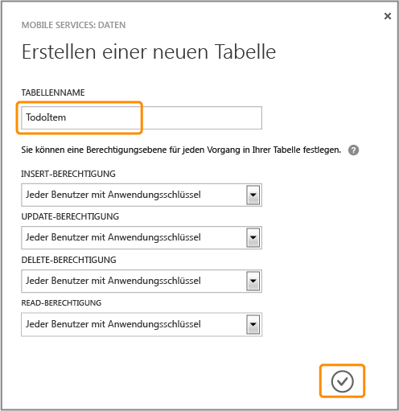
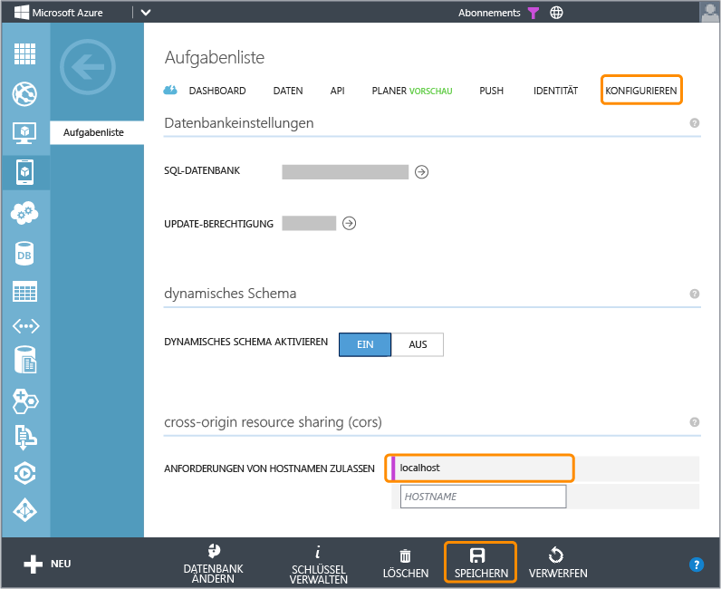

<properties linkid="develop-mobile-tutorials-get-started-with-data-html" urlDisplayName="Get Started with Data (HTML5)" pageTitle="Get started with data (HTML 5) | Mobile Dev Center" metaKeywords="" description="Learn how to get started using Mobile Services to leverage data in your HTML app." metaCanonical="" services="" documentationCenter="Mobile" title="Get started with data in Mobile Services" authors="glenga" solutions="" manager="" editor="" />

Erste Schritte mit Daten in Mobile Services
===========================================

[Windows Store C\#](/en-us/develop/mobile/tutorials/get-started-with-data-dotnet "Windows Store C#")[Windows Store JavaScript](/en-us/develop/mobile/tutorials/get-started-with-data-js "Windows Store JavaScript")[Windows Phone](/en-us/develop/mobile/tutorials/get-started-with-data-wp8 "Windows Phone")[iOS](/en-us/develop/mobile/tutorials/get-started-with-data-ios "iOS")[Android](/en-us/develop/mobile/tutorials/get-started-with-data-android "Android")[HTML](/en-us/develop/mobile/tutorials/get-started-with-data-html "HTML")[Xamarin.iOS](/en-us/develop/mobile/tutorials/get-started-with-data-xamarin-ios "Xamarin.iOS")[Xamarin.Android](/en-us/develop/mobile/tutorials/get-started-with-data-xamarin-android "Xamarin.Android")

Dieses Thema beschreibt den Einsatz von Azure Mobile Services für die Nutzung von Daten in HTML-Apps. In diesem Lernprogramm laden Sie eine App herunter, die Daten im Speicher ablegt, einen neuen mobilen Dienst erstellt, den mobilen Dienst mit der App integriert und melden sich anschließend im Azure-Verwaltungsportal an, um die Änderungen an den Daten beim Ausführen der App anzuzeigen.

**Hinweis**

Dieses Lernprogramm vermittelt ein besseres Verständnis davon, wie Sie mit Mobile Services in Azure Daten aus einer HTML-App speichern und abrufen können. Dieses Thema behandelt viele der Schritte, die Ihnen im Mobile Services-Schnellstart abgenommen werden. Falls Sie noch keine Erfahrung mit Mobile Serviceshaben, sollten Sie eventuell zuerst das Lernprogramm [Erste Schritte mit Mobile Servicesn](/en-us/develop/mobile/tutorials/get-started-html) abschließen.

In diesem Lernprogramm werden die folgenden grundlegenden Schritte behandelt:

1.  [Herunterladen des HTML-App-Projekts](#download-app)
2.  [Erstellen des mobilen Diensts](#create-service)
3.  [Erstellen einer Datentabelle als Datenspeicher](#add-table)
4.  [Aktualisieren der App zur Verwendung von Mobile Services](#update-app)
5.  [Testen der App mit Mobile Services](#test-app)

**Hinweis**

Sie benötigen ein Azure-Konto, um dieses Lernprogramm auszuführen. Wenn Sie über kein Konto verfügen, können Sie in nur wenigen Minuten ein kostenloses Testkonto erstellen. Weitere Informationen finden Sie unter [Kostenlose Azure-Testversion](http://www.windowsazure.com/en-us/pricing/free-trial/?WT.mc_id=A756A2826&returnurl=http%3A%2F%2Fwww.windowsazure.com%2Fen-us%2Fdevelop%2Fmobile%2Ftutorials%2Fget-started-with-data-html%2F).

### Weitere Anforderungen

Sie können die GetStartedWithData-App auf jedem beliebigen Webserver hosten. Wir haben jedoch praktische Skripts bereitgestellt, mit denen Sie die App auf `http://localhost:8000` ausführen können.

-   Um localhost für dieses Lernprogramm verwenden zu können, muss einer der folgenden Webserver auf Ihrem lokalen Computer laufen:

    -   **Unter Windows**: IIS Express. IIS Express wird mit dem [Microsoft-Webplattform-Installer] installiert.
    -   **Unter MacOS X**: Python, das bereits installiert sein sollte.
    -   **Unter Linux**: Python. Sie müssen die [neueste Version von Python] installieren.

    Die App kann zwar auf jedem Webserver gehostet werden, aber dies sind die von den heruntergeladenen Skripts unterstützen Webserver.

-   Ein Webbrowser, der HTML5 unterstützt.

Herunterladen des ProjektsHerunterladen des GetStartedWithData-Projekts
-----------------------------------------------------------------------

Dieses Lernprogramm verwendet die HTML5-App [GetStartedWithData](http://go.microsoft.com/fwlink/?LinkID=286345). Die Benutzeroberfläche dieser App und die vom Mobile Services-Schnellstart generierte Benutzeroberfläche sind identisch, mit der Ausnahme, dass hinzugefügte Einträge lokal im Arbeitsspeicher gespeichert werden.

1.  [Download der HTML-App-Projektdateien](http://go.microsoft.com/fwlink/?LinkID=286345).

2.  Öffnen Sie das heruntergeladene Projekt in einem HTML-Editor und sehen Sie sich die Datei app.js an.

    Beachten Sie, dass hinzugefügte Elemente in einem speicherinternen **Array**-Objekt gespeichert werden (**staticItems**). Aktualisieren Sie die Seite, und die Daten verschwinden. Die Daten werden nicht persistent gespeichert.

3.  Starten Sie eine der folgenden Befehlsdateien aus dem **server**-Unterordner.

    -   **launch-windows** (Windows-Computer)
    -   **launch-mac.command** (Mac OS X-Computer)
    -   **launch-linux.sh** (Linux-Computer)

    **Hinweis**

    Bei einem Windows-Computer geben Sie `R` ein, wenn Sie von PowerShell zur Bestätigung aufgefordert werden, dass Sie das Skript ausführen möchten. Ihr Webbrowser rät Ihnen unter Umständen von einer Ausführung des Skripts ab, weil es vom Internet heruntergeladenen wurde. In diesem Fall müssen Sie darauf bestehen, dass der Browser mit dem Laden des Skripts fortfährt.

    Hierdurch wird ein Webserver auf Ihrem lokalen Computer zum Hosten der neuen App gestartet.

4.  Öffnen Sie die URL <http://localhost:8000/> in einem Webbrowser, um die App zu starten.

5.  Geben Sie in der App unter **Neue Aufgabe eingeben** eine Beschreibung ein, wie zum Beispiel *Lernprogramm ausführen* und klicken Sie anschließend auf **Hinzufügen**.

    ![][0]  

    Beachten Sie, dass der gespeicherte Text zum Array **staticItems** hinzugefügt wird. Anschließend wird die Seite neu geladen, um das neue Element anzuzeigen.

Erstellen des mobilen DienstesErstellen eines neuen mobilen Dienstes im Verwaltungsportal
-----------------------------------------------------------------------------------------

[WACOM.INCLUDE [mobile-services-create-new-service-data](../includes/mobile-services-create-new-service-data.md)]

Erstellen einer neuen TabelleFügen Sie eine neue Tabelle zum mobilen Dienst hinzu
---------------------------------------------------------------------------------

Um App-Daten im neuen mobilen Dienst speichern zu können, müssen Sie zuerst eine neue Tabelle in der verknüpften SQL-Datenbankinstanz erstellen.

1.  Klicken Sie im Verwaltungsportal auf **Mobile Services** und anschließend auf den mobilen Dienst, den Sie gerade erstellt haben.

2.  Klicken Sie auf die Registerkarte **Daten** und anschließend auf **+Erstellen**.

    ![][5]

    Daraufhin wird der Dialog **Neue Tabelle erstellen** geöffnet.

3.  Geben Sie unter **Tabellenname** den Namen *TodoItem* ein und klicken Sie auf das Kontrollkästchen.

	

	Dadurch wird die neue Speichertabelle **TodoItem** mit Standardberechtigungen erstellt. Dies bedeutet, dass jeder mit dem Anwendungsschlüssel (der mit Ihrer App verteilt wird) auf die Daten in der Tabelle zugreifen und diese ändern kann.

    
 
    <b>Hinweis</b> 
    
Der Mobile Services-Schnellstart verwendet dieselbe Tabelle. Jede Tabelle wird jedoch in einem Schema erstellt, das für einen bestimmten mobilen Dienst gilt. Auf diese Weise werden Datenkollisionen verhindert, wenn mehrere mobile Dienste dieselbe Datenbank verwenden.
 
    

1.  Klicken Sie auf die neue Tabelle **TodoItem** und überprüfen Sie, dass keine Datenzeilen vorhanden sind.

2.  Klicken Sie auf die Registerkarte **Spalten**. Überprüfen Sie, dass folgende Standardspalten automatisch erstellt werden:

    <table border="1" cellpadding="10">
		<tr>
	 		<th>Spaltenname</th>
	 		<th>Typ</th>
	 		<th>Index</th>
    	</tr>
    	<tr>
		 	<td>id</td>
		 	<td>string</td>
		 	<td>Indexed</td>
	 	</tr>
	 	<tr>
		 	<td>__createdAt</td>
		 	<td>date</td>
		 	<td>Indexed</td>
	 	</tr>
	 	<tr>
		 	<td>__updatedAt</td>
		 	<td>date</td>
		 	<td>-</td>
	 	</tr>
	 	<tr>
		 	<td>__version</td>
		 	<td>timestamp (MSSQL)</td>
		 	<td>-</td>
	 	</tr>
    </table>

	Dies ist die Mindestanforderung für eine Tabelle in Mobile Services.

    
<b>Hinweis</b>
    
Wenn für Ihren mobilen Dienst das dynamische Schema aktiviert ist, werden neue Spalten immer dann automatisch erstellt, wenn JSON-Objekte über einen Einfüge- oder Aktualisierungsvorgang an den mobilen Dienst gesendet werden.

    

1.  Vergewissern Sie sich auf der Registerkarte **Konfigurieren**, dass `localhost` bereits im Feld **Anforderungen von Hostnamen zulassen** unter **cross-origin resource sharing (CORS)** eingetragen ist. Falls nicht, geben Sie `localhost` im Feld **Hostname** ein, und klicken Sie dann auf **Speichern**.

	

    
<b>Hinweis</b>
    	
Wenn Sie die Schnellstart-App auf einem anderen Webserver als dem localhost bereitstellen, müssen Sie den Hostnamen des Webservers zur Liste von <strong>Anforderungen von Hostnamen zulassen</strong> hinzufügen. Weitere Informationen finden Sie unter <a href="http://msdn.microsoft.com/en-us/library/windowsazure/dn155871.aspx" target="_blank">Cross-Origin Resource Sharing (CORS)</a>.

    

Sie können den neuen mobilen Dienst nun als Datenspeicher für die App verwenden.

Aktualisieren der AppAktualisieren der App für den Datenzugriff über mobile Dienste
-----------------------------------------------------------------------------------

Ihr mobiler Dienst ist nun bereit und Sie können die App aktualisieren, sodass diese Elemente in Mobile Services anstatt in einer lokalen Sammlung speichert.

1.  Klicken Sie im Verwaltungsportal auf **Mobile Services**, und klicken Sie auf den zuvor erstellten mobilen Dienst.

2.  Klicken Sie die Registerkarte **Dashboard** und notieren Sie die **Site-URL**. Klicken Sie anschließend auf **Schlüssel verwalten** und notieren Sie den **Anwendungsschlüssel**.

    ![][8]

	Sie brauchen diese Werte für den Zugriff auf den mobilen Dienst in Ihrem App-Code.

3.  Öffnen Sie die Projektdatei index.html in Ihrem Web-Editor und fügen Sie den folgenden Code zu den Skriptverweisen der Seite hinzu:

		

4.  Öffnen Sie die Datei app.js im Editor und fügen Sie den folgenden Code hinzu, um die **MobileServiceClient**-Variable zu definieren und übergeben Sie Anwendungs-URL und -Schlüssel in dieser Reihenfolge an den **MobileServiceClient**-Konstruktor:

     	var MobileServiceClient = WindowsAzure.MobileServiceClient,
             client = new MobileServiceClient('AppUrl', 'AppKey'),              

	Dieser Code erstellt eine neue MobileServiceClient-Instanz, die für den Zugriff auf Ihren mobilen Dienst verwendet wird.

5.  Entfernen Sie die Kommentare in den folgenden Codezeilen:

         var itemCount = 0;
         var staticItems = [];

    Die Daten werden im mobilen Dienst gespeichert, und nicht im speicherinternen Array.

6.  Entfernen Sie die Kommentare in den folgenden Codezeilen:

         todoItemTable = client.getTable('todoitem');

    Dieser Code erstellt ein Proxyobjekt (**todoItemTable**) für die SQL-Datenbank **TodoItem**. 

7.  Ersetzen Sie den **$('#add-item').submit**-Ereignishandler durch den folgenden Code:

         $('#add-item').submit(function(evt) {
             var textbox = $('#new-item-text'),
                 itemText = textbox.val();
             if (itemText !== '') {
                 todoItemTable.insert({ text: itemText, complete: false })
                     .then(refreshTodoItems);
             }
             textbox.val('').focus();
             evt.preventDefault();
         });

	Mit diesem Code wird ein neuer Eintrag in die Tabelle eingefügt.

8.  Ersetzen Sie die **refreshTodoItems**-Methode durch den folgenden Code:

         function refreshTodoItems() {

             var query = todoItemTable;

             query.read().then(function(todoItems) {
                 listItems = $.map(todoItems, function(item) {
                     return $('<li>')
                         .attr('data-todoitem-id', item.id)
                         .append($('<button class="item-delete">Delete</button>'))
                         .append($('<input type="checkbox" class="item-complete">').prop('checked', item.complete))
                         .append($('
').append($('<input class="item-text">').val(item.text)));
                 });
                           
                 $('#todo-items').empty().append(listItems).toggle(listItems.length > 0);
                 $('#summary').html('<strong>' + todoItems.length + '</strong> item(s)');
             });
         }

    Dieser Code schickt eine Abfrage an den mobilen Dienst, die alle Elemente zurückgibt. Das Ergebnis wird durchlaufen und die Daten auf der Seite angezeigt.

9.  Ersetzen Sie die Ereignishandler **$(document.body).on('change', '.item-text')** und **\$(document.body).on('change', '.item-complete')** durch den folgenden Code:

         $(document.body).on('change', '.item-text', function() {
             var newText = $(this).val();
             todoItemTable.update({ id: getTodoItemId(this), text: newText });
         });

         $(document.body).on('change', '.item-complete', function() {
             var isComplete = $(this).prop('checked');
             todoItemTable.update({ id: getTodoItemId(this), complete: isComplete })
                 .then(refreshTodoItems);
         });
         
    Dieser Code schickt eine Änderungsabfrage an den mobilen Dienst, wenn Text geändert oder das Kontrollkästchen markiert wird.

3.  Ersetzen Sie den **$(document.body).on('click', '.item-delete')**-Ereignishandler durch den folgenden Code:

        $(document.body).on('click', '.item-delete', function () {
            todoItemTable.del({ id: getTodoItemId(this) }).then(refreshTodoItems);
        });

    Dieser Code schickt eine Löschanfrage an den Server, wenn die **Delete**-Schaltfläche angeklickt wird.

Nachdem nun die App für die Verwendung von Mobile Services als Back-End-Speicher aktualisiert ist, können Sie die App mit Mobile Services testen.

Testen der AppTesten der App mit Ihrem neuen mobilen Dienst
-----------------------------------------------------------

1.  Öffnen Sie die URL <http://localhost:8000/> in einem Webbrowser, um die App zu starten.

    **Hinweis**

    Wiederholen Sie die Schritte im ersten Abschnitt, falls Sie den Webserver neu starten müssen.

2.  Geben Sie wie zuvor Text in das Feld **Neue Aufgabe eingeben** ein und klicken Sie auf **Hinzufügen**.

    Dieser Code schickt ein neues einzufügendes Element an den mobilen Dienst.

3.  Klicken Sie im [Verwaltungsportal](https://manage.windowsazure.com/) auf **Mobile Services** und dann auf Ihren mobilen Dienst.

4.  Klicken Sie auf die Registerkarte **Daten** und dann auf **Durchsuchen**.

    ![][9]
          
    Die **TodoItem**-Tabelle enthält nun Daten, deren ID-Werte von Mobile Services generiert wurden, und die entsprechenden Spalten für die TodoItem-Klasse in der App wurden automatisch in der Tabelle erstellt.

5.  Markieren Sie in der App einen Eintrag in der Liste, kehren Sie dann zurück zur Registerkarte "Durchsuchen" des Portals, und klicken Sie auf **Aktualisieren**.

	Beachten Sie, dass der Wert "complete" von **false** in **true** geändert wurde.

6.  Suchen Sie die Methode **RefreshTodoItems** in der Projektdatei app.js und ersetzen Sie die Codezeile, in der `query` definiert wird, durch die folgende Zeile:

		var query = todoItemTable.where({ complete: false });

7.  Laden Sie die Seite erneut und markieren Sie eines der anderen Elemente in der Liste.

    Der markierte Eintrag erscheint jetzt nicht mehr in der Liste. Jede Änderung führt zu einem Roundtrip zum mobilen Dienst, der jetzt gefilterte Daten zurückgibt.

Damit ist das Lernprogramm **Erste Schritte mit Daten** beendet.

Nächste Schritte
----------------

In diesem Lernprogramm wurden die Grundlagen für die Integration von Daten in HTML-Apps in Mobile Services behandelt. Als Nächstes können Sie eines der folgenden Lernprogramme ausführen, das auf der GetStartedWithData-App aufbaut, die Sie in diesem Lernprogramm erstellt haben:

-   [Prüfen und Ändern von Daten mit Skripten](/en-us/develop/mobile/tutorials/validate-modify-and-augment-data-html)
     Informationen zur Verwendung von Serverskripts in Mobile Servicesn, um von Ihrer App gesendete Daten zu prüfen und zu ändern.

-   [Optimieren von Abfragen mittels Paging](/en-us/develop/mobile/tutorials/add-paging-to-data-html)
     Informationen zur Verwendung von Paging in Abfragen, um die in einer einzelnen Anforderung behandelte Datenmenge zu steuern.

Nach Abschluss der Daten-Lernprogramme können Sie herausfinden, wie Sie Benutzer Ihrer App authentifizieren können. Probieren Sie eines der anderen Lernprogramme aus, z. B. [Erste Schritte mit Authentifizierung](/en-us/develop/mobile/tutorials/get-started-with-users-html).

<!-- Anchors. -->
[Download the HTML app project]: #download-app
[Create the mobile service]: #create-service
[Add a data table for storage]: #add-table
[Update the app to use Mobile Services]: #update-app
[Test the app against Mobile Services]: #test-app
[Next Steps]:#next-steps

<!-- Images. -->
[0]: ./media/mobile-services-html-get-started-data/mobile-quickstart-startup-html.png

[5]: ./media/mobile-services-html-get-started-data/mobile-data-tab-empty.png
[6]: ./media/mobile-services-html-get-started-data/mobile-create-todoitem-table.png

[8]: ./media/mobile-services-html-get-started-data/mobile-dashboard-tab.png
[9]: ./media/mobile-services-html-get-started-data/mobile-todoitem-data-browse.png

[11]: ./media/mobile-services-html-get-started-data/mobile-services-set-cors-localhost.png

<!-- URLs. -->
[Validate and modify data with scripts]: /en-us/develop/mobile/tutorials/validate-modify-and-augment-data-html
[Refine queries with paging]: /en-us/develop/mobile/tutorials/add-paging-to-data-html
[Get started with Mobile Services]: /en-us/develop/mobile/tutorials/get-started
[Get started with authentication]: /en-us/develop/mobile/tutorials/get-started-with-users-html

[Azure Management Portal]: https://manage.windowsazure.com/
[Management Portal]: https://manage.windowsazure.com/
[GetStartedWithData app]:  http://go.microsoft.com/fwlink/?LinkID=286345

[Mobile Services HTML/JavaScript How-to Conceptual Reference]: /en-us/develop/mobile/how-to-guides/work-with-html-js-client

[Cross-origin resource sharing]: http://msdn.microsoft.com/en-us/library/windowsazure/dn155871.aspx

