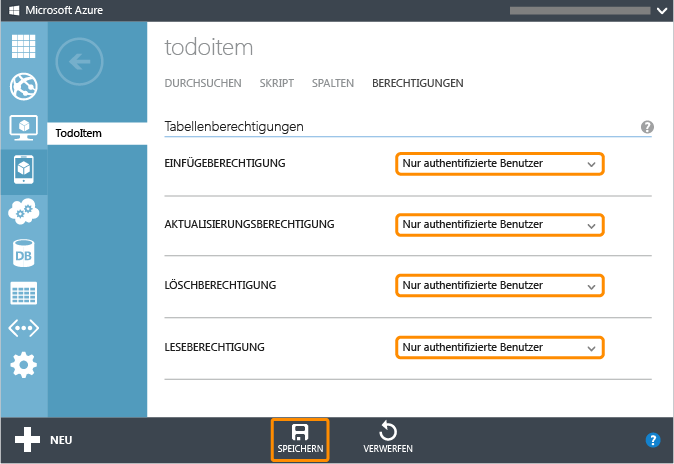

<properties linkid="develop-mobile-tutorials-get-started-with-users-html" urlDisplayName="Get Started with Authentication (HTML5)" pageTitle="Get started with authentication (HTML 5) | Mobile Dev Center" metaKeywords="" description="Learn how to use Mobile Services to authenticate users of your HTML app through a variety of identity providers, including Google, Facebook, Twitter, and Microsoft." metaCanonical="" services="" documentationCenter="Mobile" title="Get started with authentication in Mobile Services" authors="glenga" solutions="" manager="" editor="" />

Erste Schritte bei der Authentifizierung in Mobile Services
===========================================================

[Windows Store C\#](/de-de/develop/mobile/tutorials/get-started-with-users-dotnet "Windows Store C#")[Windows Store JavaScript](/de-de/develop/mobile/tutorials/get-started-with-users-js "Windows Store JavaScript")[Windows Phone](/de-de/develop/mobile/tutorials/get-started-with-users-wp8 "Windows Phone")[iOS](/de-de/develop/mobile/tutorials/get-started-with-users-ios "iOS")[Android](/de-de/develop/mobile/tutorials/get-started-with-users-android "Android")[HTML](/de-de/develop/mobile/tutorials/get-started-with-users-html "HTML")[Xamarin.iOS](/de-de/develop/mobile/tutorials/get-started-with-users-xamarin-ios "Xamarin.iOS")[Xamarin.Android](/de-de/develop/mobile/tutorials/get-started-with-users-xamarin-android "Xamarin.Android")

Dieses Thema beschreibt die Authentifizierung von Benutzern in mobilen Azure-Diensten aus Ihrer HTML-App. In diesem Lernprogramm fügen Sie eine Authentifizierung zu dem Schnellstartprojekt hinzu. Sie verwenden dazu einen Identitätsanbieter, der von Mobile Services unterstützt wird. Nach der erfolgreichen Authentifizierung und Autorisierung durch Mobile Services wird der Benutzer-ID-Wert angezeigt.

Dieses Lernprogramm zeigt Ihnen die grundlegenden Schritte zur Aktivierung von Authentifizierung in Ihrer App:

1.  [Registrieren Ihrer App für Authentifizierung und Konfigurieren von Mobile Services](#register)
2.  [Einschränken von Tabellenberechtigungen für authentifizierte Benutzer](#permissions)
3.  [Hinzufügen von Authentifizierung zur App](#add-authentication)

Dieses Lernprogramm baut auf dem Mobile Services-Schnellstart auf. Sie müssen zunächst das Lernprogramm [Erste Schritte mit Mobile Services](/de-de/develop/mobile/tutorials/get-started-html) abschließen.

Registrieren Ihrer AppRegistrieren Ihrer App für Authentifizierung und Konfigurieren von Mobile Services
--------------------------------------------------------------------------------------------------------

Sie müssen Ihre App bei einem Identitätsanbieter registrieren, damit Sie Benutzer authentifizieren können. Sie müssen dann den vom Anbieter generierten geheimen Clientschlüssel bei Mobile Services registrieren.

1.  Melden Sie sich beim [Azure-Verwaltungsportal](https://manage.windowsazure.com/) an, klicken Sie auf **Mobile Services** und dann auf Ihren mobilen Dienst.

     

2.  Klicken Sie auf die Registerkarte **Dashboard**, und notieren Sie sich den Wert der **Mobile Service URL**.

     

    Möglicherweise müssen Sie diesen Wert an den Identitätsanbieter übermitteln, wenn Sie Ihre App registrieren.

3.  Wählen Sie aus der Liste unten einen unterstützten Identitätsanbieter aus, und folgen Sie den unten aufgeführten Schritten, um Ihre App bei diesem Anbieter zu registrieren:

	-   [Microsoft Account](/de-de/develop/mobile/how-to-guides/register-for-microsoft-authentication/)
	-   [Facebook-Login](/de-de/develop/mobile/how-to-guides/register-for-facebook-authentication/)
	-   [Twitter-Login](/de-de/develop/mobile/how-to-guides/register-for-twitter-authentication/)
	-   [Google-Login](/de-de/develop/mobile/how-to-guides/register-for-google-authentication/)
	-   [Azure Active Directory](/de-de/documentation/articles/mobile-services-how-to-register-active-directory-authentication/)

    	Notieren Sie die Clientidentität und die geheimen Werte, die vom Anbieter generiert wurden.

    	**Sicherheitshinweis**

    	Der vom Anbieter generierte geheime Schlüssel ist eine wichtige Anmeldeinformation. Teilen Sie diesen Schlüssel mit niemandem, und geben Sie ihn nicht über Ihre App frei.

1.  Klicken Sie dann im Verwaltungsportal auf die Registerkarte **Identität**, geben Sie den App-Bezeichner und die freigegebenen geheimen Werte ein, die Sie von Ihrem Identitätsanbieter erhalten haben, und klicken Sie auf **Speichern**.

      

Sowohl Ihr Mobile Service als auch Ihre App sind nun konfiguriert und funktionieren mit dem ausgewählten Authentifizierungsanbieter.

Einschränken von BerechtigungenEinschränken von Berechtigungen für authentifizierte Benutzer
--------------------------------------------------------------------------------------------

1.  Klicken Sie im Verwaltungsportal auf die Registerkarte **Daten**, und klicken Sie dann auf die Tabelle **TodoItem**.

     

2.  Klicken Sie auf die Registerkarte **Berechtigungen**, legen Sie für alle Berechtigungen **Only authenticated users** fest, und klicken Sie dann auf **Speichern**. So wird sichergestellt, dass für alle Vorgänge für die Tabelle **TodoItem** eine Benutzerauthentifizierung erforderlich ist. Dies vereinfacht auch die Skripts im nächsten Lernprogramm, da diese keine anonymen Benutzer zulassen müssen.

     

3.  Starten Sie im Ordner der App eine der folgenden Befehlsdateien aus dem **server**-Unterordner.

    -   **launch-windows** (Windows-Computer)
    -   **launch-mac.command** (Mac OS X-Computer)
    -   **launch-linux.sh** (Linux-Computer)

	**Hinweis**

    Bei einem Windows-Computer geben Sie "R" ein, wenn Sie von PowerShell zur Bestätigung aufgefordert werden, dass Sie das Skript ausführen möchten. Ihr Webbrowser rät Ihnen unter Umständen von einer Ausführung des Skripts ab, weil es vom Internet heruntergeladenen wurde. In diesem Fall müssen Sie darauf bestehen, dass der Browser mit dem Laden des Skripts fortfährt.

    Hierdurch wird ein Webserver auf Ihrem lokalen Computer zum Hosten der neuen App gestartet.

4.  Öffnen Sie die URL <http://localhost:8000/> in einem Webbrowser, um die App zu starten.

    Das Laden der Daten schlägt fehl. Dies liegt daran, dass die App als nicht authentifizierter Benutzer auf den mobilen Dienst zugreift und die *TodoItem*-Tabelle nun eine Authentifizierung verlangt.

5.  (Optional) Öffnen Sie den Skript-Debugger Ihres Webbrowsers und aktualisieren Sie die Seite. Vergewissern Sie sich, dass ein "Zugriff verweigert"-Fehler auftritt.

Anschließend werden Sie die App aktualisieren, sodass diese sich authentifiziert, bevor sie Ressourcen aus dem mobilen Dienst abfragt.

Hinzufügen von AuthentifizierungHinzufügen von Authentifizierung zur App
------------------------------------------------------------------------

**Hinweis**

Da die Anmeldung in einem Popup erfolgt, sollten Sie die **login**-Methode aus dem Click-Ereignis einer Schaltfläche heraus aufrufen. Viele Browser unterdrücken ansonsten das Anmeldefenster.

1.  Öffnen Sie die Projektdatei index.html, suchen Sie das H1-Element und fügen Sie im Anschluss den folgenden Codeausschnitt ein:

         

             You are logged in as .
             <button id="log-out">Log out</button>
         

         

             You are not logged in.
             <button>Log in</button>
         

    Mit diesem Code können Sie sich von der Seite aus bei einem mobilen Dienst anmelden.

2.  Suchen Sie am Ende der Datei app.js nach der Codezeile, in der die refreshTodoItems-Funktion aufgerufen wird und ersetzen Sie die Zeile durch den folgenden Code:

         function refreshAuthDisplay() {
             var isLoggedIn = client.currentUser !== null;
             $("#logged-in").toggle(isLoggedIn);
             $("#logged-out").toggle(!isLoggedIn);

             if (isLoggedIn) {
                 $("#login-name").text(client.currentUser.userId);
                 refreshTodoItems();
             }
         }

         function logIn() {
             client.login("facebook").then(refreshAuthDisplay, function(error){
                 alert(error);
             });
         }

         function logOut() {
             client.logout();
             refreshAuthDisplay();
             $('#summary').html('<strong>You must login to access data.</strong>');
         }

         // On page init, fetch the data and set up event handlers
         $(function () {
             refreshAuthDisplay();
             $('#summary').html('<strong>You must login to access data.</strong>');           
             $("#logged-out button").click(logIn);
             $("#logged-in button").click(logOut);
         });

    Diese Funktionen erledigen den Authentifizierungsprozess. Der Benutzer wird mithilfe eines Facebook-Logins authentifiziert.

    **Hinweis**

    Falls Sie einen anderen Identitätsanbieter als Facebook verwenden, ändern Sie den an die **login**-Methode übergebenen Wert auf einen der folgenden Werte: *microsoftaccount*, *facebook*, *twitter* oder *google*.

3.  Wechseln Sie zum Browser, in dem Ihre App ausgeführt wird, und aktualisieren Sie die Seite.

    Wenn Sie sich erfolgreich angemeldet haben, sollte die App fehlerfrei ausgeführt werden, und Sie sollten Mobile Services abfragen und Daten aktualisieren können.

    **Hinweis**

    Falls Sie Internet Explorer verwenden, kann es sein, dass Sie nach der Anmeldung den folgenden Fehler erhalten: `Fensteröffner nicht erreichbar. Möglicherweise befindet sich dieser in einer anderen Internet Explorer-Zone`. Dies liegt daran, dass das Popup in einer anderen Sicherheitszone (Internet) als Localhost (Intranet) ausgeführt wird. Dies betrifft nur Apps während der Entwicklung mit Localhost. Um dies zu vermeiden, öffnen Sie die Registerkarte **Sicherheit** in den **Internet-Optionen**, klicken Sie auf **Lokales Intranet**, anschließend auf **Sites** und deaktivieren Sie **Intranetnetzwerk automatisch ermitteln**. Vergessen Sie nicht, diese Einstellung nach Abschluss Ihrer Tests wiederherzustellen.

Nächste Schritte
----------------

Im nächsten Lernprogramm [Autorisieren von Benutzern mit Skripts](/de-de/develop/mobile/tutorials/authorize-users-in-scripts-html) werden Sie den von Mobile Services auf Basis eines authentifizierten Benutzers bereitgestellten Benutzer-ID-Wert verwenden, um von Mobile Services zurückgegebene Daten zu filtern. Weitere Informationen zur Verwendung von mobilen Diensten mit HTML/JavaScript finden Sie unter [Mobile Services HTML/JavaScript How-to Conceptual Reference](/de-de/develop/mobile/how-to-guides/work-with-html-js-client)

