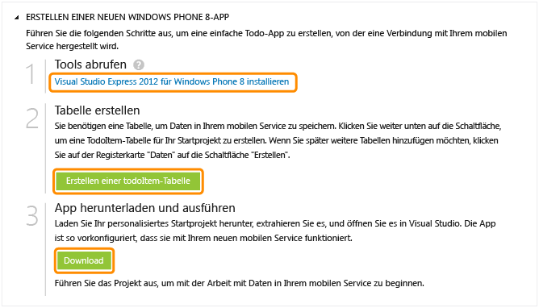

<properties pageTitle="Get Started with Azure Mobile Services for Windows Phone apps" metaKeywords="" description="Follow this tutorial to get started using Azure Mobile Services for Windows Phone development. " metaCanonical="" services="" documentationCenter="Mobile" title="Get started with Mobile Services" authors="glenga" solutions="" manager="" editor="" />

Erste Schritte mit Mobile Services
==================================

[Windows Store](/de-de/documentation/articles/mobile-services-windows-store-get-started "Windows Store")[Windows Phone](/de-de/documentation/articles/mobile-services-windows-phone-get-started "Windows Phone")[iOS](/de-de/documentation/articles/mobile-services-ios-get-started "iOS")[Android](/de-de/documentation/articles/mobile-services-android-get-started "Android")[HTML](/de-de/documentation/articles/mobile-services-html-get-started "HTML")[Xamarin.iOS](/de-de/documentation/articles/partner-xamarin-mobile-services-ios-get-started "Xamarin.iOS")[Xamarin.Android](/de-de/documentation/articles/partner-xamarin-mobile-services-android-get-started "Xamarin.Android")[Sencha](/de-de/documentation/articles/partner-sencha-mobile-services-get-started/ "Sencha")[PhoneGap](/de-de/documentation/articles/mobile-services-javascript-backend-phonegap-get-started/ "PhoneGap")

[.NET-Back-End](/de-de/documentation/articles/mobile-services-dotnet-backend-windows-phone-get-started/ ".NET-Back-End") | [JavaScript-Back-End](/de-de/documentation/articles/mobile-services-windows-phone-get-started/ "JavaScript-Back-End")

In diesem Lernprogramm wird das Hinzufügen eines cloudbasierten Back-End-Diensts zu einer Windows Phone 8-App mit Azure Mobile Services erläutert. Im Rahmen dieses Lernprogramms erstellen Sie einen neuen mobilen Dienst und eine einfache App für eine *To-do-Liste*, die App-Daten in dem neuen mobilen Dienst speichert.

Wenn Sie sich lieber ein Video anschauen möchten, im Clip rechts werden dieselben Schritte wie in diesem Lernprogramm durchgeführt. Nick Harris gibt in diesem Video eine Einführung in Mobile Services und erklärt, wie Sie Ihren ersten mobilen Dienst erstellen und ihn mit einer Windows Store-App verbinden können.

[Tutorial anschauen](http://go.microsoft.com/fwlink/?LinkId=290816) [Video abspielen](http://go.microsoft.com/fwlink/?LinkId=290816) 13:18

Im Rahmen dieses Lernprogramms erstellen Sie einen neuen mobilen Dienst und eine einfache App für eine *To-do-Liste*, die App-Daten in dem neuen mobilen Dienst speichert. Der mobile Dienst, den Sie erstellen, verwendet für die serverseitige Geschäftslogik JavaScript. Informationen zum Erstellen eines mobile Diensts, dessen serverseitige Geschäftslogik Sie in den unterstützen .NET-Sprachen mit Visual Studio schreiben können, finden Sie in der [.NET-Back-End-Version](/de-de/documentation/articles/mobile-services-dotnet-backend-windows-phone-get-started) dieses Themas.

Screenshot der fertigen App:

**Hinweis**

Sie benötigen ein Azure-Konto mit aktivierter "Azure Mobile Services"-Funktion, um dieses Lernprogramm auszuführen.

-   Wenn Sie über kein Konto verfügen, können Sie in nur wenigen Minuten ein kostenloses Testkonto erstellen. Weitere Informationen finden Sie unter [Windows Azure-Testkonto](http://www.windowsazure.com/de-de/pricing/free-trial/?WT.mc_id=A30A4DDE2&returnurl=http%3A%2F%2FFen-us%2Fdocumentation%2Farticles%2Fmobile-services-windows-phone-get-started%2F).

Erstellen eines neuen mobilen Diensts
-------------------------------------

[WACOM.INCLUDE [mobile-services-create-new-service](../includes/mobile-services-create-new-service.md)]

&lt;h2 data-morhtml="true"\>Erstellen einer neuen AppErstellen einer neuen Windows Phone-App&lt;/h2\>
-------------------------------------------------------------------------------------------------

Sobald Sie Ihren mobilen Dienst erstellt haben, können Sie die einfachen Schnellstart-Anleitungen im Verwaltungsportal befolgen, um für die Verbindung mit Ihrem mobilen Dienst entweder eine neue App zu erstellen oder eine bestehende App zu ändern.

In diesem Abschnitt erstellen Sie eine neue Windows Phone 8-App, die mit Ihrem mobilen Dienst verbunden ist.

1.  Klicken Sie im Verwaltungsportal auf **Mobile Dienste** und dann auf den mobilen Dienst, den Sie gerade erstellt haben.

2.  Klicken Sie auf der Registerkarte "Schnellstart" unter **Eine Plattform wählen** auf **Windows Phone 8**, und erweitern Sie **Eine neue Windows Phone 8-App erstellen**.

        ![][6]

        Daraufhin werden die drei einfachen Schritte zum Erstellen einer Windows Phone-App, die mit Ihrem mobilen Dienst verbunden ist, angezeigt.

1.  Laden Sie [Visual Studio 2012 Express für Windows Phone](https://go.microsoft.com/fwLink/p/?LinkID=268374) herunter, und installieren Sie es auf Ihrem lokalen Computer, falls noch nicht geschehen.

2.  Klicken Sie auf **TodoItem-Tabelle erstellen**, um eine Tabelle zum Speichern der App-Daten zu erstellen.

3.  Klicken Sie unter **App herunterladen und ausführen** auf **Herunterladen**.

Damit wird das Projekt für die Beispielanwendung *To do list* heruntergeladen, die mit Ihrem mobilen Dienst verbunden ist. Speichern Sie die komprimierte Projektdatei auf Ihrem lokalen Computer, und merken Sie sich, wo Sie sie gespeichert haben.

Ausführen Ihrer Windows Phone-App
---------------------------------

Im letzten Schritt dieses Lernprogramms erstellen Sie Ihre neue App, und führen Sie aus.

1.  Navigieren Sie zu dem Verzeichnis, in dem Sie die komprimierten Projektdateien gespeichert haben, erweitern Sie die Dateien auf Ihrem Computer, und öffnen Sie die Projektmappen-Datei in Visual Studio.

2.  Drücken Sie die Taste **F5**, um das Projekt neu zu erstellen und die App zu starten.

3.  Geben Sie in der App sinnvollen Text, wie z. B. *Tutorial fertigstellen* ein, und klicken Sie dann auf **Save**.

        ![][10]

        Damit wird eine POST-Anforderung an den in Azure gehosteten neuen mobilen Dienst gesendet. Daten von der Anforderung werden in die TodoItem-Tabellen eingefügt. In der Tabelle gespeicherte Einträge werden von dem mobilen Dienst zurückgegeben, und die Daten werden in der Liste angezeigt.

    > [WACOM.NOTE]Sie können den Code überprüfen, der auf Ihren mobilen Dienst zum Abfragen und Einfügen von Daten zugreift. Der Code befindet sich in der Datei "MainPage.xaml.cs".

4.  Klicken Sie im Verwaltungsportal auf die Registerkarte **Daten** und dann auf die Tabelle **TodoItems**.

        ![][11]

        Damit können Sie die Daten anzeigen, die von der App in die Tabelle eingefügt wurden.

        ![][12]

Nächste Schritte
----------------

Sie haben den Schnellstart abgeschlossen und können nun mit weiteren wichtigen Aufgaben in Mobile Services fortfahren:

-   [Erste Schritte mit Daten](/de-de/develop/mobile/tutorials/get-started-with-data-wp8)
    Informationen zum Speichern und Abfragen von Daten mit Mobile Services.

-   [Erste Schritte mit der Authentifizierung](/de-de/develop/mobile/tutorials/get-started-with-users-wp8)
    Informationen zur Authentifizierung von Benutzern Ihrer App bei einem Identitätsanbieter.

-   [Erste Schritte mit Pushbenachrichtigungen](/de-de/develop/mobile/tutorials/get-started-with-push-wp8)
    Informationen zum Senden einer einfachen Pushbenachrichtigung an Ihre App.

