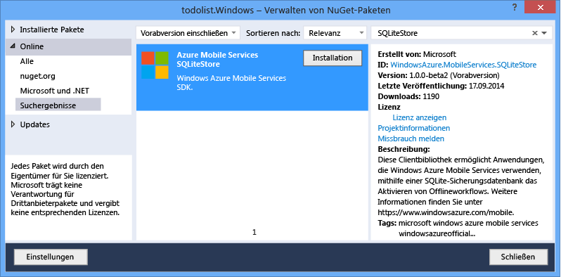
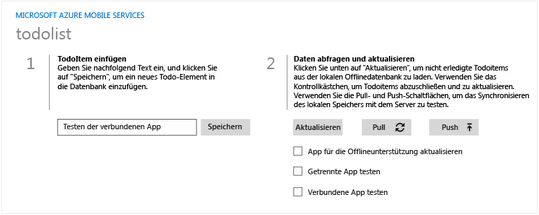
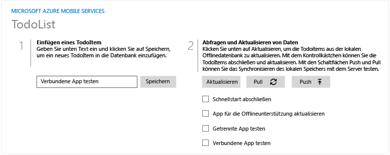
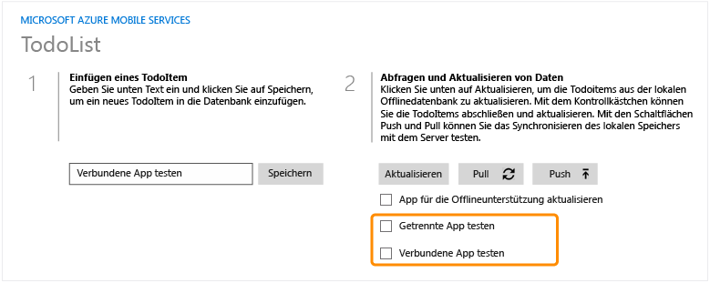
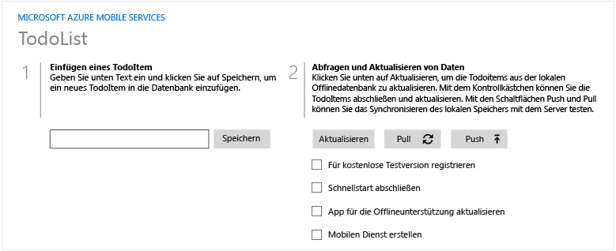

<properties linkid="develop-mobile-tutorials-get-started-offline-data-dotnet" urlDisplayName="Getting Started with Offline Data" pageTitle="Get started with offline data in Mobile Services (Windows Store) | Mobile Dev Center" metaKeywords="" description="Learn how to use offline data in your Windows Store application." metaCanonical="" disqusComments="1" umbracoNaviHide="1" documentationCenter="Mobile" title="Get started with offline data in Mobile Services" authors="wesmc" />

Erste Schritte mit Offlinedaten in Mobile Services
==================================================

[Windows Store C\#](/de-de/documentation/articles/mobile-services-windows-store-dotnet-get-started-offline-data "Windows Store C#")

In diesem Thema erfahren Sie, wie Sie die Offlinefunktionen von Azure Mobile Services nutzen können. Offlinefunktionen von Azure Mobile Services ermöglichen Ihnen die Interaktion mit einer lokalen Datenbank, wenn Sie den mobilen Dienst offline verwenden. Mit den Offlinefunktionen können Sie Ihre lokalen Änderungen mit dem mobilen Dienst synchronisieren, wenn Sie erneut online sind.

In diesem Lernprogramm aktualisieren Sie die App aus dem Lernprogramm [Erste Schritte mit Mobile Services](/de-de/documentation/articles/mobile-services-windows-store-get-started/) oder [Erste Schritte mit Daten](/de-de/documentation/articles/mobile-services-dotnet-backend-windows-store-dotnet-get-started-data/) so, dass diese die Offlinefunktionen von Azure Mobile Services unterstützt. Dann fügen Sie Daten in einem Offlineszenario mit getrennter Verbindung hinzu, synchronisieren diese Elemente mit der Onlinedatenbank und melden sich daraufhin beim Azure-Verwaltungsportal an, um Änderungen an den Daten anzuzeigen, die bei der Ausführung der Anwendung vorgenommen wurden.

> [WACOM.NOTE] Anhand dieses Lernprogramms soll Ihnen ein besseres Verständnis davon vermittelt werden, wie Sie mit Mobile Services Azure verwenden können, um Daten in der Windows Store-App zu speichern und abzurufen. Dieses Thema behandelt viele der Schritte, die Ihnen im Schnellstart für mobile Dienste abgenommen werden. Falls Sie noch keine Erfahrung mit Mobile Services haben, sollten Sie eventuell zuerst das Lernprogramm [Erste Schritte mit Mobile Services](/de-de/documentation/articles/mobile-services-windows-store-get-started/) abschließen.

In diesem Lernprogramm werden die grundlegenden Schritte erläutert:

1.  [Aktualisieren der App für die Unterstützung von Offlinefunktionen](#enable-offline-app)
2.  [Testen der App in einem Offlineszenario](#test-offline-app)
3.  [Aktualisieren der App zur Herstellung einer Verbindung mit dem mobilen Dienst](#update-online-app)
4.  [Testen der App mit Verbindung zum mobilen Dienst](#test-online-app)

Für dieses Lernprogramm ist Folgendes erforderlich:

-   Visual Studio 2013 für Windows 8.1
-   Abschluss des Lernprogramms [Erste Schritte mit Mobile Services](/de-de/documentation/articles/mobile-services-windows-store-get-started/) oder [Erste Schritte mit Daten](/de-de/documentation/articles/mobile-services-dotnet-backend-windows-store-dotnet-get-started-data/).
-   Azure Mobile Services SDK, NuGet-Paket, Version 1.3.0-alpha
-   Azure Mobile Services SQLite Store NuGet-Paket, Version 0.1.0-alpha
-   SQLite für Windows 8.1

> [WACOM.NOTE] Um dieses Lernprogramm abzuschließen, benötigen Sie ein Windows Azure-Konto. Wenn Sie über kein Konto verfügen, können Sie in nur wenigen Minuten ein kostenloses Testkonto erstellen. Weitere Informationen finden Sie unter [Kostenloses Azure-Testkonto](http://www.windowsazure.com/de-de/pricing/free-trial/?WT.mc_id=AE564AB28).

Aktualisieren der App für die Unterstützung von Offlinefunktionen
-----------------------------------------------------------------

Offlinefunktionen von Azure Mobile Services ermöglichen Ihnen die Interaktion mit einer lokalen Datenbank, wenn Sie den mobilen Dienst offline verwenden. Initialisieren Sie `MobileServiceClient.SyncContext` in einem lokalen Speicher, um diese Funktionen in der App zu verwenden. Erstellen Sie dann für die Tabelle einen Verweis über die Schnittstelle `IMobileServiceSyncTable`.

In diesem Abschnitt wird SQLite als lokaler Speicher für die Offlinefunktionen verwendet.

> [WACOM.NOTE] Sie können diesen Abschnitt überspringen und einfach eine Version des "Erste Schritte"-Projekt herunterladen, das bereits über Offlineunterstützung verfügt. Ein Projekt mit aktivierter Offlineunterstützung können Sie unter [Getting Started Offline Sample](http://go.microsoft.com/fwlink/?LinkId=394777) (Beispiel zu Erste Schritte offline) herunterladen.

1.  Installieren Sie SQLite. Sie können es über diesen Link installieren: [SQLite für Windows 8.1](http://go.microsoft.com/fwlink/?LinkId=394776).

    > [WACOM.NOTE] Wenn Sie Internet Explorer verwenden und auf den Link für das Herunterladen von SQLite klicken, werden Sie möglicherweise aufgefordert, die VSIX-Datei als ZIP-Datei herunterzuladen. Speichern Sie die Datei mit der Endung .vsix statt.zip an einem Speicherort auf Ihrer Festplatte. Doppelklicken Sie im Windows-Explorer auf die VSIX-Datei, um die Installation auszuführen.

2.  Öffnen Sie in Visual Studio das Projekt, das Sie im Lernprogramm [Erste Schritte mit Mobile Services](/de-de/documentation/articles/mobile-services-windows-store-get-started/) oder [Erste Schritte mit Daten](/de-de/documentation/articles/mobile-services-dotnet-backend-windows-store-dotnet-get-started-data/) abgeschlossen haben. Fügen Sie einen **Windows Extension**-Verweis zu **SQLite für Windows-Laufzeit (Windows 8.1)** hinzu.

    

    > [WACOM.NOTE] Für die SQLite-Laufzeitumgebung muss die Prozessorarchitektur des Projekts, das erstellt wird, in **x86**, **x64**, oder **ARM** geändert werden. **Beliebige CPU** wird nicht unterstützt.

3.  Klicken Sie im Projektmappen-Explorer von Visual Studio mit der rechten Maustaste auf das Client-App-Projekt, und klicken Sie dann auf **NuGet-Pakete verwalten**, um den NuGet-Paket-Manager auszuführen. Suchen Sie nach **SQLiteStore**, um das Paket **WindowsAzure.MobileServices.SQLiteStore** zu installieren.

    

4.  Öffnen Sie im Projektmappen-Explorer von Visual Studio die Datei "MainPage.xaml.cs". Fügen Sie die folgenden Anweisungen am Anfang der Datei ein.

         using Microsoft.WindowsAzure.MobileServices.SQLiteStore;
         using Microsoft.WindowsAzure.MobileServices.Sync;
         using Newtonsoft.Json.Linq;

5.  Ersetzen Sie in "Mainpage.xaml.cs" die Deklaration von `todoTable` durch eine Deklaration des Typs `IMobileServicesSyncTable`, der durch das Aufrufen von `MobileServicesClient.GetSyncTable()` initialisiert wird.

         //private IMobileServiceTable<TodoItem> todoTable = App.MobileService.GetTable<TodoItem>();
         private IMobileServiceSyncTable<TodoItem> todoTable = App.MobileService.GetSyncTable<TodoItem>();

6.  Aktualisieren Sie in "MainPage.xaml.cs" die Klasse `TodoItem` so, dass die Klasse die **Version**-Systemeigenschaft folgendermaßen enthält.

         public class TodoItem
         {
           public string Id { get; set; }
           [JsonProperty(PropertyName = "text")]
           public string Text { get; set; }
           [JsonProperty(PropertyName = "complete")]
           public bool Complete { get; set; }
           [Version]
           public string Version { get; set; }
         }

7.  Aktualisieren Sie in "MainPage.xaml.cs" den Ereignishandler `OnNavigatedTo` so, dass er den Clientsynchronisierungskontext mit einem SQLite-Store initialisiert. Der SQLite-Store wird mit einer Tabelle erstellt, die dem Schema der Tabelle für den mobilen Dienst entspricht. Er muss jedoch die **Version**-Systemeigenschaft enthalten, die im vorherigen Schritt hinzugefügt wurde.

         protected async override void OnNavigatedTo(NavigationEventArgs e)
         {
             if (!App.MobileService.SyncContext.IsInitialized)
             {
                 var store = new MobileServiceSQLiteStore("localsync12.db");
                 store.DefineTable<TodoItem>();
                 await App.MobileService.SyncContext.InitializeAsync(store, new MobileServiceSyncHandler());
             }
             RefreshTodoItems();
         }

8.  Öffnen Sie im Projektmappen-Explorer von Visual Studio die Datei "MainPage.xaml". Suchen Sie das Grid-Element mit dem StackPanel namens **Query and Update Data**. Fügen Sie den folgenden UI-Code hinzu, der die Elemente aus den Zeilendefinitionen bis zum Start-Tag von ListView ersetzt.

    Dieser Code fügt Zeilen- und Spaltendefinitionen zum Raster für das Layout der Elemente hinzu. Es werden außerdem zwei Schaltflächensteuerelemente mit Klick-Ereignishandlern für **Push**- und **Pull**-Vorgänge hinzugefügt. Die Schaltflächen befinden sich genau oberhalb von `ListView` und heißen ListItems. Speichern Sie die Datei.

         <Grid.RowDefinitions>
             <RowDefinition Height="Auto" />
             <RowDefinition Height="Auto" />
             <RowDefinition Height="*" />
         </Grid.RowDefinitions>
         <Grid.ColumnDefinitions>
             <ColumnDefinition Width="Auto" />
             <ColumnDefinition Width="*" />
         </Grid.ColumnDefinitions>
         <StackPanel Grid.Row="0" Grid.ColumnSpan="2">
             <local:QuickStartTask Number="2" Title="Query, Update, and Synchronize Data" 
               Description="Use the Pull and Push buttons to synchronize the local store with the server" />
         </StackPanel>
         <Button Grid.Row="1" Grid.Column="0" Margin="5,5,0,0" Name="ButtonPush"
             Click="ButtonPush_Click" Width="80" Height="34">⬆ Push</Button>
         <Button Grid.Row="1" Grid.Column="1" Margin="5,5,0,0"  Name="ButtonPull" 
             Click="ButtonPull_Click" Width="80" Height="34">⬇ Pull</Button>
         <ListView Name="ListItems" SelectionMode="None" Margin="0,10,0,0" Grid.ColumnSpan="2" Grid.Row="2">

9.  Fügen Sie in "MainPage.xaml.cs" die Schaltflächenklick-Ereignishandler für die Schaltflächen **Push** und **Pull** hinzu, und speichern Sie die Datei.

         private async void ButtonPull_Click(object sender, RoutedEventArgs e)
         {
             Exception pullException = null;
             try
             {
                 await todoTable.PullAsync();
                 RefreshTodoItems();
             }
             catch (Exception ex)
             {
                 pullException = ex;
             }
             if (pullException != null) {
                 MessageDialog d = new MessageDialog("Pull failed: " + pullException.Message +
                   "\n\nIf you are in an offline scenario, " + 
                   "try your Pull again when connected with your Mobile Service.");
                 await d.ShowAsync();
             }
         }
         private async void ButtonPush_Click(object sender, RoutedEventArgs e)
         {
             string errorString = null;
             try
             {
                 await App.MobileService.SyncContext.PushAsync();
                 RefreshTodoItems();
             }
             catch (MobileServicePushFailedException ex)
             {
                 errorString = "Push failed because of sync errors: " + 
                   ex.PushResult.Errors.Count() + ", message: " + ex.Message;
             }
             catch (Exception ex)
             {
                 errorString = "Push failed: " + ex.Message;
             }
             if (errorString != null) {
                 MessageDialog d = new MessageDialog(errorString + 
                   "\n\nIf you are in an offline scenario, " + 
                   "try your Push again when connected with your Mobile Service.");
                 await d.ShowAsync();
             }
         }

10. Führen Sie die App noch nicht aus. Drücken Sie die Taste **F7**, um das Projekt erneut zu erstellen. Prüfen Sie, ob Buildfehler aufgetreten sind.

Testen der App in einem Offlineszenario
---------------------------------------

In diesem Abschnitt trennen Sie die Verbindung zwischen App und mobilem Dienst, um ein Offlineszenario darzustellen. Dann fügen Sie einige Datenelemente hinzu, die im lokalen Speicher aufbewahrt werden.

Beachten Sie, dass in diesem Abschnitt keinerlei Verbindung zwischen App und mobilem Dienst bestehen sollte. Daher lösen die Schaltflächen **Push** und **Pull** Ausnahmefehler aus, wenn sie getestet werden.. Im nächsten Abschnitt verbinden Sie diese Client-App erneut mit dem mobilen Dienst, um die **Push**- und **Pull**-Vorgänge zu testen und den Speicher mit der Datenbank des mobilen Dienstes zu synchronisieren.

1.  Öffnen Sie im Projektmappen-Explorer von Visual Studio die Datei "App.xaml.cs". Ändern Sie die Initialisierung von **MobileServiceClient** in eine ungültige Adresse, indem Sie in der URL "**azure-mobile.net**" durch"**azure-mobile.xxx**" ersetzen. Speichern Sie dann die Datei.

          public static MobileServiceClient MobileService = new MobileServiceClient(
             "https://your-mobile-service.azure-mobile.xxx/",
             "AppKey"
         );

2.  Drücken Sie in Visual Studio die Taste **F5**, um die App zu erstellen und auszuführen. Geben Sie ein neues Todo-Element ein, und klicken Sie auf **Speichern**. Die neuen Todo-Elemente existieren nur im lokalen Speicher, bis sie per Push auf den mobilen Dienst übertragen werden können. Die Client-App verhält sich so, als ob eine Verbindung zum mobilen Dienst vorhanden wäre, und unterstützt alle Erstellungs-, Lese-, Aktualisierungs- und Löschaktionen (CRUD).

    

3.  Schließen Sie die App und starten Sie sie erneut, um zu überprüfen, ob die neuen Elemente dauerhaft im lokalen Speicher gespeichert wurden.

Aktualisieren der App zur Herstellung einer Verbindung mit dem mobilen Dienst
-----------------------------------------------------------------------------

In diesem Abschnitt verbinden Sie die App erneut mit dem mobilen Dienst. Dies simuliert, dass die App von einem Offlinestatus in einen Onlinestatus mit dem mobilen Dienst wechselt.

1.  Öffnen Sie im Projektmappen-Explorer von Visual Studio die Datei "App.xaml.cs". Ändern Sie die Initialisierung von **MobileServiceClient** zurück zur korrekten Adresse, indem Sie in der URL "**azure-mobile.xxx**" durch "**azure-mobile.net**" ersetzen. Speichern Sie dann die Datei.

          public static MobileServiceClient MobileService = new MobileServiceClient(
             "https://your-mobile-service.azure-mobile.net/",
             "Your AppKey"
         );

Testen der App mit Verbindung zum mobilen Dienst
------------------------------------------------

In diesem Abschnitt testen Sie die Push- und Pull-Vorgänge zur Synchronisierung des lokalen Speichers mit der Datenbank des mobilen Dienstes.

1.  Drücken Sie in Visual Studio die Taste **F5**, um die App erneut zu erstellen und auszuführen. Beachten Sie, dass die Daten genau wie im Offlineszenario aussehen, obwohl die App jetzt mit dem mobilen Dienst verbunden ist. Dies liegt daran, dass die App immer mit `IMobileServiceSyncTable` arbeitet, und diese Tabelle bezieht sich auf den lokalen Speicher.

    

2.  Melden Sie sich beim Azure-Verwaltungsportal an, und zeigen Sie die Datenbank für Ihren mobilen Dienst an. Wenn Ihr Dienst das JavaScript-Backend für mobile Dienste verwendet, können Sie die Daten in der Registerkarte **Daten** des mobilen Dienstes durchsuchen. Wenn Sie das .NET-Backend für Ihren mobilen Dienst verwenden, können Sie auf die Schaltfläche **Manage** für Ihre Datenbank in der SQL-Azure-Erweiterung klicken, um eine Abfrage der Tabelle auszuführen.

    Beachten Sie, dass die Daten zwischen Datenbank und lokalem Speicher nicht synchronisiert wurden.

    

3.  Klicken Sie in der App auf die Schaltfläche **Push**. Dadurch ruft die App `MobileServiceClient.SyncContext.PushAsync` auf und dann `RefreshTodoItems`, um die App mit Elementen aus dem lokalen Speicher zu aktualisieren. Dieser Push-Vorgang führt dazu, dass die Datenbank des mobilen Dienstes die Daten aus dem Speicher erhält. Der lokale Speicher erhält jedoch nicht die Elemente aus der Datenbank des mobilen Dienstes.

    Ein Push-Vorgang wird aus `MobileServiceClient.SyncContext` statt `IMobileServicesSyncTable` ausgeführt und überträgt per Push alle Änderungen in alle Tabellen, die mit dem Synchronisierungskontext verknüpft sind. Dies ist bei Szenarios erforderlich, in denen Beziehungen zwischen Tabellen bestehen.

    

4.  Fügen Sie in der App einige neue Elemente zum lokalen Speicher hinzu.

    

5.  Klicken Sie dieses Mal in der App auf die Schaltfläche **Pull**. Die App ruft nur `IMobileServiceSyncTable.PullAsync()` und `RefreshTodoItems` auf. Beachten Sie, dass die Daten aus der Datenbank des mobilen Dienstes per Pull-Vorgang in den lokalen Speicher übertragen wurden und in der App angezeigt werden. Beachten Sie jedoch auch, dass alle Daten im lokalen Speicher ebenfalls per Push-Vorgang in die Datenbank des mobilen Dienstes übertragen wurden. Dies liegt daran, dass ein **Pull-Vorgang immer zuerst einen Push-Vorgang ausführt**.

    

    

Zusammenfassung
---------------

Um die Offlinefunktionen mobiler Dienste zu unterstützen, haben Sie die Schnittstelle der Tabelle `IMobileServiceSyncTable` verwendet und `MobileServiceClient.SyncContext` mit einem lokalen Speicher initialisiert. In diesem Fall war der lokale Speicher eine SQLite-Datenbank.

Die normalen CRUD-Operationen für mobile Dienste funktionieren so, als ob die App immer noch verbunden wäre. Alle Operationen erfolgen jedoch nur im lokalen Speicher.

Zur Synchronisierung des lokalen Speichers mit dem Server haben Sie die Methoden `IMobileServiceSyncTable.PullAsync` und `MobileServiceClient.SyncContext.PushAsync` verwendet.

-   Dann haben Sie `IMobileServiceSyncContext.PushAsync()` aufgerufen, um die Änderungen per Push-Vorgang auf den Server zu übertragen. Diese Methode ist ein Element von `IMobileServicesSyncContext` statt der Synchronisierungstabelle, da Änderungen per Push-Vorgang auf alle Tabellen übertragen werden:

    Nur Datensätze, die lokal geändert wurden (mit CRUD-Operationen), werden an den Server gesendet.

-   Um Daten per Pull-Vorgang von einer Tabelle auf dem Server in die App zu übertragen, haben Sie `IMobileServiceSyncTable.PullAsync` aufgerufen.

    Ein Pull-Vorgang führt immer zuerst einen Push-Vorgang aus.

    Es gibt außerdem Überladungen von **PullAsync()**, mit denen eine Abfrage spezifiziert werden kann. Beachten Sie, dass in der Vorabversion von Offlineunterstützung für Mobile Services **PullAsync** alle Zeilen in der entsprechenden Tabelle (oder Abfrage) liest. Es wird nicht etwa versucht, nur die Zeilen zu lesen, die neuer als die letzte Synchronisierung sind. Wenn die Zeilen bereits in der lokalen Synchronisierungstabelle vorhanden sind, bleiben sie unverändert.

Nächste Schritte
----------------

-   [Behandeln von Konflikten mit Offlineunterstützung für Mobile Services](/de-de/documentation/articles/mobile-services-windows-store-dotnet-handling-conflicts-offline-data/)

<!-- Anchors. -->
[Update the app to support offline features]: #enable-offline-app
[Test the app in an offline Scenario]: #test-offline-app
[Update the app to reconnect your mobile service]: #update-online-app
[Test the app connected to the Mobile Service]: #test-online-app
[Next Steps]:#next-steps

<!-- Images -->
[0]: ./media/mobile-services-windows-store-dotnet-get-started-data-vs2013/mobile-todoitem-data-browse.png
[1]: ./media/mobile-services-windows-store-dotnet-get-started-offline-data/mobile-services-add-reference-sqlite-dialog.png
[2]: ./media/mobile-services-windows-store-dotnet-get-started-offline-data/mobile-services-sqlitestore-nuget.png
[3]: ./media/mobile-services-windows-store-dotnet-get-started-offline-data/mobile-services-sqlitepcl-nuget.png
[4]: ./media/mobile-services-windows-store-dotnet-get-started-offline-data/mobile-services-offline-app-run1.png
[5]: ./media/mobile-services-windows-store-dotnet-get-started-offline-data/mobile-services-online-app-run1.png
[6]: ./media/mobile-services-windows-store-dotnet-get-started-offline-data/mobile-data-browse.png
[7]: ./media/mobile-services-windows-store-dotnet-get-started-offline-data/mobile-data-browse2.png
[8]: ./media/mobile-services-windows-store-dotnet-get-started-offline-data/mobile-services-online-app-run2.png
[9]: ./media/mobile-services-windows-store-dotnet-get-started-offline-data/mobile-services-online-app-run3.png
[10]: ./media/mobile-services-windows-store-dotnet-get-started-offline-data/mobile-data-browse3.png

<!-- URLs. -->
[Handling conflicts with offline support for Mobile Services]: /de-de/documentation/articles/mobile-services-windows-store-dotnet-handling-conflicts-offline-data/ 
[Getting Started Offline Sample]: http://go.microsoft.com/fwlink/?LinkId=394777
[Get started with Mobile Services]: /de-de/develop/mobile/tutorials/get-started/#create-new-service
[Getting Started]: /de-de/documentation/articles/mobile-services-dotnet-backend-windows-phone-get-started/
[Get started with data]: /de-de/documentation/articles/mobile-services-dotnet-backend-windows-store-dotnet-get-started-data/
[Get started with Mobile Services]: /de-de/documentation/articles/mobile-services-windows-store-get-started/
[SQLite for Windows 8.1]: http://go.microsoft.com/fwlink/?LinkId=394776

