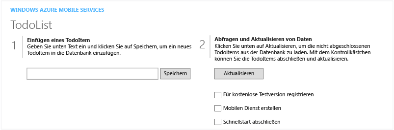

<properties pageTitle="Get Started with Mobile Services for Windows Store apps | Mobile Dev Center" metaKeywords="" description="Follow this tutorial to get started using Azure Mobile Services for Windows Store development in C# or JavaScript. " metaCanonical="" services="" documentationCenter="Mobile" title="Get started with Mobile Services" authors="glenga" solutions="" manager="" editor="" />

Erste Schritte mit Mobile Services
==================================

[Windows Store](/de-de/documentation/articles/mobile-services-windows-store-get-started "Windows Store") [Windows Phone](/de-de/documentation/articles/mobile-services-windows-phone-get-started "Windows Phone") [iOS](/de-de/documentation/articles/mobile-services-ios-get-started "iOS") [Android](/de-de/documentation/articles/mobile-services-android-get-started "Android") [HTML](/de-de/documentation/articles/mobile-services-html-get-started "HTML") [Xamarin.iOS](/de-de/documentation/articles/partner-xamarin-mobile-services-ios-get-started "Xamarin.iOS") [Xamarin.Android](/de-de/documentation/articles/partner-xamarin-mobile-services-android-get-started "Xamarin.Android") [Sencha](/de-de/documentation/articles/partner-sencha-mobile-services-get-started/ "Sencha") [PhoneGap](/de-de/documentation/articles/mobile-services-javascript-backend-phonegap-get-started/ "PhoneGap")

[.NET-Back-End](/de-de/documentation/articles/mobile-services-dotnet-backend-windows-store-dotnet-get-started/ ".NET-Back-End") | [JavaScript-Back-End](/de-de/documentation/articles/mobile-services-windows-store-get-started/ "JavaScript-Back-End")

Dieses Lernprogramm zeigt Ihnen, wie Sie einen cloudbasierten Back-End-Dienst zu einer Windows Store-App mithilfe von Azure Mobile Services hinzufügen.

Wenn Sie sich lieber ein Video ansehen möchten, finden Sie die Schritte dieses Lernprogramms auch im Clip rechts. Im Video gibt Scott Guthrie eine Einführung in Mobile Services und führt Sie durch das Erstellen Ihres ersten mobilen Dienstes und das Verbinden dieses Diensts über eine Windows Store-App.

[Lernprogramm ansehen](http://channel9.msdn.com/Series/Windows-Azure-Mobile-Services/Introduction-to-Windows-Azure-Mobile-Services) [Video wiedergeben](http://channel9.msdn.com/Series/Windows-Azure-Mobile-Services/Introduction-to-Windows-Azure-Mobile-Services) 10:08

In diesem Lernprogramm erstellen Sie einen neuen mobilen Dienst und eine einfache *To-Do-Listen*-App, die App-Daten im neuen mobilen Dienst speichert. Der mobile Dienst, den Sie erstellen, verwendet JavaScript für serverseitige Geschäftslogik. Informationen zum Erstellen eines mobilen Diensts, mit dem Sie serverseitige Geschäftslogik in den unterstützten .NET-Sprachen mithilfe von Visual Studio verfassen können, finden Sie in der .NET-Back-End-Version dieses Themas.

Unten finden Sie einen Screenshot aus der fertigen App:

Das Abschließen dieses Lernprogramms ist eine Voraussetzung für alle anderen Mobile Services-Lernprogramme für Windows Store-Apps.

> [WACOM.NOTE] Zum Abschließen dieses Lernprogramms benötigen Sie ein Azure-Konto. Wenn Sie über kein Konto verfügen, können Sie in nur wenigen Minuten ein kostenloses Testkonto erstellen. Weitere Informationen dazu finden Sie unter [Kostenloses Windows Azure-Testkonto](http://www.windowsazure.com/de-de/pricing/free-trial/?WT.mc_id=A0E0E5C02&returnurl=http%3A%2F%2Fwww.windowsazure.com%2Fen-us%2Fdevelop%2Fmobile%2Ftutorials%2Fget-started%2F).

> Dieses Lernprogramm erfordert Visual Studio 2013. Um eine Windows Store-App mithilfe von Visual Studio 2012 zu verbinden, folgen Sie den Schritten im Thema [Erste Schritte mit Daten in Mobile Services mithilfe von Visual Studio 2012](/de-de/develop/mobile/tutorials/get-started-with-data-dotnet-vs2012/).

Erstellen eines neuen mobilen Dienstes
--------------------------------------

[WACOM.INCLUDE [mobile-services-create-new-service](../includes/mobile-services-create-new-service.md)]

Erstellen einer neuen Windows Store-App
---------------------------------------

Sobald Sie den mobilen Dienst erstellt haben, können Sie einem einfachen Schnellstart im Verwaltungsportal folgen, um eine neue App zu erstellen oder eine vorhandene App für die Verbindung zum mobilen Dienst zu ändern.

In diesem Abschnitt erstellen Sie eine neue Windows Store-App, die mit dem mobilen Dienst verbunden ist.

1.  Klicken Sie im Verwaltungsportal auf **Mobile Services** und dann auf den mobilen Dienst, den Sie gerade erstellt haben.

2.  Klicken Sie auf der Schnellstartregisterkarte unter **Plattform auswählen** auf **Windows**. Erweitern Sie dann **Neue Windows Store-App erstellen**.

        ![][6]

        Auf diese Weise werden die drei einfachen Schritte zum Erstellen einer Windows Store-App, die mit dem mobilen Dienst verbunden ist, angezeigt.

1.  Falls noch nicht geschehen, sollten Sie [Visual Studio 2013 Express für Windows](http://go.microsoft.com/fwlink/?LinkId=257546) auf den lokalen Computer oder virtuellen Computer herunterladen und installieren.

2.  Klicken Sie auf **TodoItem-Tabelle erstellen**, um eine Tabelle zum Speichern von App-Daten zu erstellen.

3.  Wählen Sie unter **App herunterladen und ausführen** eine Sprache für die App aus. Klicken Sie dann auf **Herunterladen**.

Das Projekt für die beispielhafte *To-Do-Listen*-Anwendung, die mit dem mobilen Dienst verbunden ist, wird heruntergeladen. Speichern Sie die komprimierte Projektdatei auf dem lokalen Computer und merken Sie sich, wo Sie sie gespeichert haben.

Ausführen der Windows-App
-------------------------

Der letzte Schritt dieses Lernprogramms besteht im Erstellen und Ausführen der neuen App.

1.  Wechseln Sie zu dem Speicherort, an dem Sie die komprimierten Projektdateien gespeichert haben, erweitern Sie die Dateien auf Ihrem Computer, und öffnen Sie die Lösungsdatei in Visual Studio 2013 Express für Windows.

2.  Drücken Sie die **F5**-Taste, um das Projekt neu zu erstellen und die App zu starten.

3.  Geben Sie in der App einen beschreibenden Text ein, zum Beispiel *Lernprogramm abschließen*, unter **TodoItem einfügen**. Klicken Sie dann auf **Speichern**.

        ![][10]

        Dadurch wird eine POST-Anforderung an den neuen, in Azure gehosteten mobilen Dienst gesendet. Daten aus der Anforderung werden in die TodoItem-Tabelle eingefügt. In der Tabelle gespeicherte Elemente werden vom mobilen Dienst zurückgegeben und die Daten werden in der zweiten Spalte der App angezeigt.

    > [WACOM.NOTE]Sie können den Code überprüfen, der auf den mobilen Dienst zugreift, um Daten abzufragen und einzufügen, die in der Datei "MainPage.xaml.cs" (C\#/XAML-Projekt) oder "default.js" (JavaScript/HTML-Projekt) vorhanden sind.

4.  Klicken Sie im Verwaltungsportal auf die Registerkarte **Daten** und dann auf die Tabelle **TodoItems**.

        ![][11]

        Auf diese Weise können Sie die Daten durchsuchen, die von der App in die Tabelle eingefügt wurden.

        ![][12]

Nächste Schritte
----------------

Da Sie den Schnellstart jetzt abgeschlossen haben, erfahren Sie, wie zusätzliche wichtige Aufgaben in Mobile Services ausgeführt werden:

-   **Erste Schritte mit Daten** ( [C\#](/de-de/develop/mobile/tutorials/get-started-with-data-dotnet) / [JavaScript](/de-de/develop/mobile/tutorials/get-started-with-data-js) )
    Erhalten Sie weitere Informationen zum Speichern und Abfragen von Daten mithilfe von Mobile Services.

-   **Erste Schritte mit der Authentifizierung** ( [C\#](/de-de/develop/mobile/tutorials/get-started-with-users-dotnet) / [JavaScript](/de-de/develop/mobile/tutorials/get-started-with-users-js) )
    Erhalten Sie Informationen zum Authentifizieren von Benutzern der App mit einem Identitätsanbieter.

-   **Erste Schritte mit Pushbenachrichtigungen** ( [C\#](/de-de/develop/mobile/tutorials/get-started-with-push-dotnet) / [JavaScript](/de-de/develop/mobile/tutorials/get-started-with-push-js) )
    Erhalten Sie Informationen zum Senden einer sehr grundlegenden Pushbenachrichtigung an die App.

