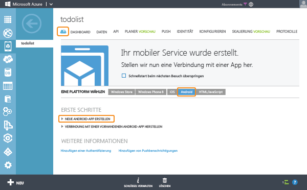

<properties
	pageTitle="Erste Schritte mit Azure Mobile Services für Android-Apps (JavaScript-Back-End)"
	description="Befolgen Sie dieses Lernprogramm für die ersten Schritte bei der Verwendung von Azure Mobile Services für die Android-Entwicklung (JavaScript-Back-End)."
	services="mobile-services"
	documentationCenter="android"
	authors="RickSaling"
	manager="dwrede"
	editor=""/>

<tags
	ms.service="mobile-services"
	ms.workload="mobile"
	ms.tgt_pltfrm="mobile-android"
	ms.devlang="java"
	ms.topic="hero-article"
	ms.date="02/05/2016"
	ms.author="ricksal"/>

# Erste Schritte mit Mobile Services für Android (JavaScript-Back-End)

[AZURE.INCLUDE [mobile-service-note-mobile-apps](../../includes/mobile-services-note-mobile-apps.md)]

&nbsp;

[AZURE.INCLUDE [mobile-services-selector-get-started](../../includes/mobile-services-selector-get-started.md)]

&nbsp;

[AZURE.INCLUDE [mobile-services-hero-slug](../../includes/mobile-services-hero-slug.md)]

In diesem Tutorial erfahren Sie, wie Sie einen cloudbasierten Back-End-Dienst mithilfe von Azure Mobile Services zu einer Android-App hinzufügen. In diesem Lernprogramm erstellen Sie einen neuen mobilen Dienst und eine einfache **To-Do-Listen**-App, die App-Daten im neuen mobilen Dienst speichert.

> [AZURE.VIDEO mobile-get-started-android]

Unten sehen Sie einen Screenshot aus der fertigen App:

## Voraussetzungen

Sie benötigen für dieses Lernprogramm die [Android Developer Tools](https://developer.android.com/sdk/index.html), die die integrierte Entwicklungsumgebung Android Studio enthalten, sowie die neueste Android-Plattform. Android 4.2 oder eine höhere Version ist erforderlich.

Das heruntergeladene Schnellstartprojekt enthält das Azure Mobile Services SDK für Android.

> [AZURE.IMPORTANT] Um dieses Tutorial abzuschließen, benötigen Sie ein Azure-Konto. Wenn Sie über kein Konto verfügen, können Sie in nur wenigen Minuten ein kostenloses Testkonto erstellen. Weitere Informationen finden Sie hier [Kostenloses Azure-Testkonto](https://azure.microsoft.com/pricing/free-trial/?WT.mc_id=AE564AB28).

## Erstellen eines neuen mobilen Diensts

[AZURE.INCLUDE [mobile-services-create-new-service](../../includes/mobile-services-create-new-service.md)]

## Erstellen einer neuen Android-App

Sobald Sie den mobilen Dienst erstellt haben, können Sie einer einfachen Schnellstartanleitung im klassischen Azure-Portal folgen, um eine neue App zu erstellen oder eine vorhandene App für die Verbindung mit dem mobilen Dienst zu ändern.

In diesem Abschnitt erstellen Sie eine neue Android-App, die mit Ihrem Mobile Service verbunden ist.

1.  Klicken Sie im klassischen Azure-Portal auf **Mobile Services** und anschließend auf den mobilen Dienst, den Sie gerade erstellt haben.

2. Klicken Sie in der Schnellstartregisterkarte unter **Plattform auswählen** auf **Android**, und erweitern Sie die Option **Neue Android-App erstellen**.

   	

   	Dadurch werden drei einfache Schritte zum Erstellen einer Android-App angezeigt, die mit dem mobilen Dienst verbunden wird.

  	

3. Wenn Sie dies nicht bereits getan haben, laden Sie die [Android Developer Tools](https://go.microsoft.com/fwLink/p/?LinkID=280125) auf Ihren lokalen oder virtuellen Computer herunter, und installieren Sie diese.

4. Klicken Sie auf **TodoItem-Tabelle erstellen**, um eine Tabelle zum Speichern von App-Daten zu erstellen.

5. Laden Sie jetzt Ihre App durch Klicken auf die Schaltfläche **Herunterladen** herunter.

## Ausführen Ihrer Android-App

[AZURE.INCLUDE [mobile-services-run-your-app](../../includes/mobile-services-android-get-started.md)]

## Nächste Schritte
Da Sie den Schnellstart jetzt abgeschlossen haben, erfahren Sie, wie zusätzliche wichtige Aufgaben in Mobile Services ausgeführt werden:

* [Erste Schritte mit Daten]  Informationen zum Speichern und Abfragen von Daten mit Mobile Services.

* [Erste Schritte mit der Authentifizierung]  Informationen zur Authentifizierung von Benutzern Ihrer App bei einem Identitätsanbieter.

* [Erste Schritte mit Pushbenachrichtigungen]  Informationen zum Senden einer einfachen Pushbenachrichtigung an Ihre App.

[AZURE.INCLUDE [app-service-disqus-feedback-slug](../../includes/app-service-disqus-feedback-slug.md)]

<!-- URLs. -->
[Get started (Eclipse)]: mobile-services-android-get-started-ec.md
[Erste Schritte mit Daten]: mobile-services-android-get-started-data.md
[Erste Schritte mit der Authentifizierung]: mobile-services-android-get-started-users.md
[Erste Schritte mit Pushbenachrichtigungen]: mobile-services-javascript-backend-android-get-started-push.md
[Mobile Services Android SDK]: https://go.microsoft.com/fwLink/p/?LinkID=266533

<!---HONumber=AcomDC_0211_2016-->