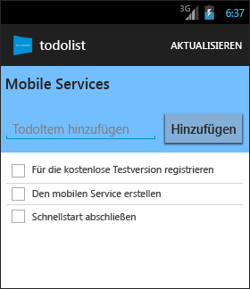

<properties
	pageTitle="Erste Schritte mit Azure Mobile Services für Android-Apps"
	description="Befolgen Sie dieses Tutorial für die ersten Schritte bei der Verwendung von Azure Mobile Services für die Android-Entwicklung."
	services="mobile-services"
	documentationCenter="android"
	authors="RickSaling"
	manager="dwrede"
	editor=""/>

<tags
	ms.service="mobile-services"
	ms.workload="mobile"
	ms.tgt_pltfrm="mobile-android"
	ms.devlang="java"
	ms.topic="get-started-article"
	ms.date="11/05/2015"
	ms.author="ricksal"/>

# Erste Schritte mit Mobile Services

[AZURE.INCLUDE [mobile-service-note-mobile-apps](../../includes/mobile-services-note-mobile-apps.md)]

&nbsp;

[AZURE.INCLUDE [mobile-services-selector-get-started](../../includes/mobile-services-selector-get-started.md)]&nbsp;

[AZURE.INCLUDE [mobile-services-hero-slug](../../includes/mobile-services-hero-slug.md)]

In diesem Tutorial erfahren Sie, wie Sie einen cloudbasierten Back-End-Dienst mithilfe von Azure Mobile Services zu einer Android-App hinzufügen. In diesem Lernprogramm erstellen Sie einen neuen mobilen Dienst und eine einfache _To-Do-Listen_-App, die App-Daten im neuen mobilen Dienst speichert. Der von Ihnen erstellte mobile Dienst verwendet die unterstützten .NET-Sprachen unter Verwendung von Visual Studio für die serverseitige Geschäftslogik und zur Verwaltung des mobilen Diensts. Informationen zum Erstellen eines mobilen Dienstes, mit dem Sie serverseitige Geschäftslogik in JavaScript schreiben können, finden Sie in der [JavaScript-Back-End-Version](mobile-services-android-get-started.md) dieses Themas.

Unten sehen Sie einen Screenshot aus der fertigen App:

Sie benötigen die [Android Developer Tools][Android Studio], die die integrierte Entwicklungsumgebung Android Studio enthalten, sowie die neueste Android-Plattform. Android 4.2 oder eine höhere Version ist erforderlich.

Das heruntergeladene Schnellstartprojekt enthält den Mobile Services SDK für Android.

> [AZURE.IMPORTANT] Um dieses Lernprogramm abzuschließen, benötigen Sie ein Azure-Konto. Falls Sie kein Konto besitzen, können Sie sich für eine Azure-Testversion registrieren. So erhalten Sie bis zu 10 kostenlose mobile Dienste, die Sie auch nach Ablauf der Testversion weiter nutzen können. Ausführliche Informationen finden Sie unter [Kostenlose Azure-Testversion](https://azure.microsoft.com/pricing/free-trial/?WT.mc_id=AE564AB28).

## Erstellen eines neuen mobilen Dienstes

[AZURE.INCLUDE [mobile-services-dotnet-backend-create-new-service](../../includes/mobile-services-dotnet-backend-create-new-service.md)]

## Herunterladen des mobilen Dienstes auf den lokalen Computer

Da Sie nun den mobilen Dienst erstellt haben, können Sie Ihr personalisiertes Mobildienstprojekt herunterladen und auf Ihrem lokalen oder auch einem virtuellen Computer ausführen.

1. Klicken Sie auf den mobilen Dienst, den Sie gerade erstellt haben, und dann in der Schnellstartregisterkarte unter **Plattform auswählen** auf **Android**, und erweitern Sie die Option **Neue Android-App erstellen**.

	![][1]

2. Wenn Sie dies noch nicht durchgeführt haben, laden Sie [Visual Studio Professional 2013](https://go.microsoft.com/fwLink/p/?LinkID=391934) oder eine neuere Version herunter, und installieren Sie diese.

3. Klicken Sie in Schritt 2 auf **Download** unter **Herunterladen und Veröffentlichen des Diensts in der Cloud**.

	Dadurch wird das Visual Studio-Projekt, das den mobilen Dienst implementiert, heruntergeladen. Speichern Sie die komprimierte Projektdatei auf Ihrem lokalen Computer, und notieren Sie sich den Speicherort.

## Testen des mobilen Diensts

[AZURE.INCLUDE [mobile-services-dotnet-backend-test-local-service](../../includes/mobile-services-dotnet-backend-test-local-service.md)]

## Veröffentlichen des mobilen Diensts

[AZURE.INCLUDE [mobile-services-dotnet-backend-publish-service](../../includes/mobile-services-dotnet-backend-publish-service.md)]

## Erstellen einer neuen Android-App

In diesem Abschnitt erstellen Sie eine neue Android-App, die mit Ihrem Mobile Service verbunden ist.

1. Klicken Sie im [klassischen Azure-Portal] auf **Mobile Services** und anschließend auf den mobilen Dienst, den Sie gerade erstellt haben.

2. Klicken Sie in der Schnellstartregisterkarte unter **Plattform auswählen** auf **Android**, und erweitern Sie die Option **Neue Android-App erstellen**.

	![][2]

3. Wenn Sie dies nicht bereits getan haben, laden Sie die [Android Developer Tools][Android SDK] auf Ihren lokalen oder virtuellen Computer herunter, und installieren Sie diese.

4. Klicken Sie unter **Ihre App herunterladen und ausführen** auf **Download**.

  	Das Projekt für die beispielhafte _To-Do-Listen_-Anwendung, die mit dem mobilen Dienst verbunden ist, wird heruntergeladen. Speichern Sie die komprimierte Projektdatei auf dem lokalen Computer und merken Sie sich, wo Sie sie gespeichert haben.

## Ausführen Ihrer Android-App

[AZURE.INCLUDE [mobile-services-run-your-app](../../includes/mobile-services-android-get-started.md)]

## Nächste Schritte
Da Sie den Schnellstart jetzt abgeschlossen haben, erfahren Sie, wie zusätzliche wichtige Aufgaben in Mobile Services ausgeführt werden:

* [Hinzufügen von Pushbenachrichtigungen zur App]  Erfahren Sie, wie Sie eine einfache Pushbenachrichtigung an Ihre App senden können.

* [Hinzufügen von Authentifizierung zur App]  Erfahren Sie, wie Sie den Zugriff auf Back-End-Daten auf registrierte Benutzer der App beschränken.

* [Beheben von Problemen bei einem Mobile Services .NET-Back-End]   Erfahren Sie, wie Sie Probleme diagnostizieren und beheben, die in Zusammenhang mit einem Mobile Services .NET-Back-End auftreten.

<!-- Anchors. -->
[Getting started with Mobile Services]: #getting-started
[Create a new mobile service]: #create-new-service
[Define the mobile service instance]: #define-mobile-service-instance
[Next Steps]: #next-steps

<!-- Images. -->
[0]: ./media/mobile-services-dotnet-backend-android-get-started/mobile-quickstart-completed-android.png
[1]: ./media/mobile-services-dotnet-backend-android-get-started/mobile-quickstart-steps-vs-AS.png
[2]: ./media/mobile-services-dotnet-backend-android-get-started/mobile-quickstart-steps-android-AS.png

[6]: ./media/mobile-services-dotnet-backend-android-get-started/mobile-portal-quickstart-android.png
[7]: ./media/mobile-services-dotnet-backend-android-get-started/mobile-quickstart-steps-android.png
[8]: ./media/mobile-services-dotnet-backend-android-get-started/mobile-eclipse-quickstart.png

[10]: ./media/mobile-services-dotnet-backend-android-get-started/mobile-quickstart-startup-android.png
[11]: ./media/mobile-services-dotnet-backend-android-get-started/mobile-data-tab.png
[12]: ./media/mobile-services-dotnet-backend-android-get-started/mobile-data-browse.png

[14]: ./media/mobile-services-dotnet-backend-android-get-started/mobile-services-import-android-workspace.png
[15]: ./media/mobile-services-dotnet-backend-android-get-started/mobile-services-import-android-project.png

<!-- URLs. -->
[Get started (Eclipse)]: mobile-services-dotnet-backend-android-get-started-ec.md
[Hinzufügen von Pushbenachrichtigungen zur App]: mobile-services-dotnet-backend-android-get-started-push.md
[Hinzufügen von Authentifizierung zur App]: mobile-services-dotnet-backend-android-get-started-auth.md
[Android SDK]: https://go.microsoft.com/fwLink/p/?LinkID=280125
[Android Studio]: https://developer.android.com/sdk/index.html
[Mobile Services Android SDK]: https://go.microsoft.com/fwLink/p/?LinkID=266533
[Beheben von Problemen bei einem Mobile Services .NET-Back-End]: mobile-services-dotnet-backend-how-to-troubleshoot.md

[klassischen Azure-Portal]: https://manage.windowsazure.com/

<!---HONumber=AcomDC_0128_2016-->