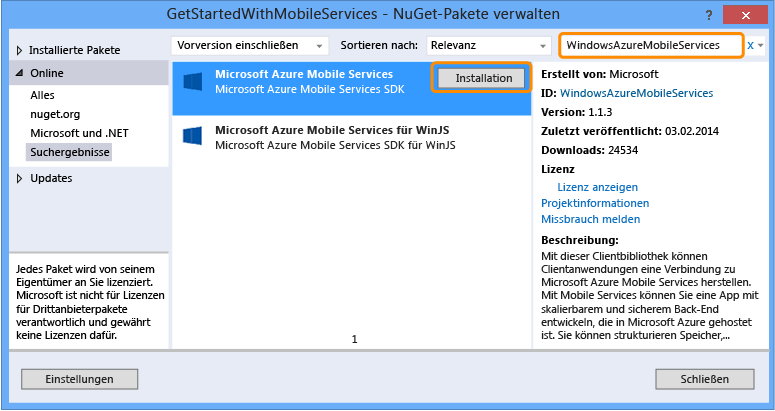
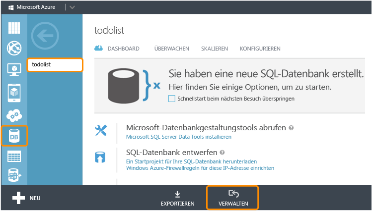

<properties 
	pageTitle="Hinzufügen von Mobile Services zu einer vorhandenen App (Windows Phone) | Mobile Dev Center" 
	description="Erfahren Sie mehr über die ersten Schritte bei der Verwendung von Mobile Services zur Nutzung von Daten in Ihrer Windows Phone-App." 
	services="mobile-services" 
	documentationCenter="windows" 
	authors="wesmc7777" 
	manager="dwrede" 
	editor=""/>

<tags 
	ms.service="mobile-services" 
	ms.workload="mobile" 
	ms.tgt_pltfrm="mobile-windows-phone" 
	ms.devlang="dotnet" 
	ms.topic="article" 
	ms.date="05/12/2015" 
	ms.author="wesmc"/>

# Hinzufügen von Mobile Services zu einer vorhandenen App

##Übersicht

[AZURE.INCLUDE [mobile-services-selector-get-started-data-legacy](../../includes/mobile-services-selector-get-started-data-legacy.md)]

In diesem Thema wird das Hinzufügen von Azure Mobile Services als Back-End-Datenquelle für eine Windows Phone 8.1-Silverlight-App veranschaulicht. In diesem Lernprogramm laden Sie ein Visual Studio-Projekt für eine App herunter, die Daten im Arbeitsspeicher speichert, erstellen einen neuen mobilen Dienst, integrieren den mobilen Dienst in die App und zeigen die Datenänderungen beim Ausführen der App an. Wenn Sie Mobile Services zu einer Windows Phone Store 8.1-App hinzufügen möchten, finden Sie weitere Informationen [in dieser Version des Lernprogramms](mobile-services-dotnet-backend-windows-universal-dotnet-get-started-data.md).

Der mobile Dienst, den Sie in diesem Lernprogramm erstellen, unterstützt die .NET Runtime in Mobile Services. Auf diese Weise können Sie .NET-Sprachen und Visual Studio für die serverseitige Geschäftslogik im mobilen Dienst verwenden. Informationen zum Erstellen eines mobilen Diensts, dessen serverseitige Geschäftslogik Sie in JavaScript schreiben können, finden Sie in der [JavaScript-Backend-Version](mobile-services-windows-phone-get-started-data.md) dieses Themas.

##Voraussetzungen

Für dieses Lernprogramm ist Folgendes erforderlich:

+ Visual Studio 2013 Update 2 oder eine höhere Version.
+ Ein Microsoft Azure-Konto. Wenn Sie über kein Konto verfügen, können Sie in nur wenigen Minuten ein kostenloses Testkonto erstellen. Einzelheiten finden Sie unter <a href="http://azure.microsoft.com/pricing/free-trial/?WT.mc_id=AE564AB28&amp;returnurl=http%3A%2F%2Fazure.microsoft.com%2Fde-de%2Fdocumentation%2Farticles%2Fmobile-services-dotnet-backend-windows-store-dotnet-get-started-data%2F" target="_blank">Kostenlose Azure-Testversion</a>. 

##Download des GetStartedWithData-Projekts

Dieses Lernprogramm baut auf der [GetStartedWithMobileServices-App](https://code.msdn.microsoft.com/Add-Azure-Mobile-to-a-8b906f72) auf, bei der es sich um ein Windows Phone Silverlight 8.1-App-Projekt für Visual Studio 2013 handelt.

1. Laden Sie die C#-Version der GetStartedWithMobileServices-Beispiel-App von der [Website mit den Codebeispielen für Entwickler](https://code.msdn.microsoft.com/Add-Azure-Mobile-to-a-8b906f72) herunter. 

	>[AZURE.NOTE]Zum Erstellen einer Windows Phone Silverlight 8.1-App ändern Sie einfach das Zielbetriebssystem im heruntergeladenen Windows Phone Silverlight 8-App-Projekt in Windows Phone 8.1. Zum Erstellen einer Windows Phone Store-App laden Sie die [Windows Phone Store-App-Version](http://go.microsoft.com/fwlink/p/?LinkId=397372) des App-Beispielprojekts GetStartedWithData herunter.

2. Führen Sie Visual Studio mit Administratorberechtigung aus, indem Sie mit der rechten Maustaste auf Visual Studio klicken und dann **Als Administrator ausführen** auswählen.

3. Öffnen Sie in Visual Studio das heruntergeladene Projekt, und sehen Sie sich die Datei "MainPage.xaml.cs" an.

   	Beachten Sie, dass die hinzugefügten **TodoItem**-Objekte in einem speicherinternen **ObservableCollection&lt;TodoItem&gt;**-Objekt gespeichert werden.

4. Wählen Sie in Visual Studio ein Bereitstellungsziel für die App aus. Sie können die Bereitstellung auf einem Windows Phone-Gerät oder auf einem der Emulatoren durchführen, die im Windows Phone SDK enthalten sind. In diesem Lernprogramm wird die Bereitstellung auf einem Emulator demonstriert.

5. Drücken Sie die **F5**-Taste. Dadurch wird die App zum Debuggen erstellt, bereitgestellt und gestartet.

6. Geben Sie in der App Text in das Textfeld ein. Klicken Sie dann auf **Save**, um einige Elemente im Arbeitsspeicher der App zu speichern.

   	

   	Beachten Sie, dass der Text für jedes `TodoItem` unterhalb der Aktualisierungsschaltfläche zusammen mit einem Kontrollkästchen angezeigt wird, das es Ihnen ermöglicht, das Element als abgeschlossen zu markieren.

##Erstellen eines neuen mobilen Dienstes

[AZURE.INCLUDE [mobile-services-dotnet-backend-create-new-service](../../includes/mobile-services-dotnet-backend-create-new-service.md)]

##Herunterladen des mobilen Dienstprojekts und Hinzufügen zur Projektmappe

1. Wenn Sie dies noch nicht durchgeführt haben, laden Sie [Visual Studio Professional 2013](https://go.microsoft.com/fwLink/p/?LinkID=391934) oder eine neuere Version herunter, und installieren Sie diese.
 
2. Klicken Sie im [Azure-Verwaltungsportal](https://manage.windowsazure.com/) auf den neuen mobilen Service. Klicken Sie auf der Schnellstartseite auf die Plattform **Windows** und erweitern Sie dann unter **Erste Schritte** den Eintrag **Herstellen einer Verbindung mit einer vorhandenen Windows- oder Windows Phone-App**.

    

4. Klicken Sie unter **Service in der Cloud herunterladen und veröffentlichen** auf **Herunterladen**.

	Dadurch wird das Visual Studio-Projekt, das den mobilen Dienst implementiert, heruntergeladen.

4. Entpacken Sie die heruntergeladene ZIP-Datei mit der personalisierten Service-Startlösung und kopieren Sie die Ordner aus der ZIP-Datei in dasselbe **C#**-Verzeichnis, in dem sich auch die Projektmappendatei "GetStartedWithData" (.sln) befindet. Dies erleichtert es dem NuGet-Paket-Manager, alle Pakete zu synchronisieren.

5. Klicken Sie im Projektmappen-Explorer von Visual Studio mit der rechten Maustaste auf Ihre Lösung für die Windows Store-App "Erste Schritte mit Daten". Klicken Sie auf **Hinzufügen** und anschließend auf **Vorhandenes Projekt**.

6. Navigieren Sie im Dialogfeld **Vorhandenes Projekt hinzufügen** zum Projektordner für den mobilen Service, den Sie in das **C#**-Verzeichnis verschoben haben. Wählen Sie im Unterverzeichnis für den Service die C#-Projektdatei (.csproj) aus und klicken Sie anschließend auf **Öffnen**, um das Projekt Ihrer Projektmappe hinzuzufügen.

7. Klicken Sie im Projektmappen-Explorer in Visual Studio mit der rechten Maustaste auf das soeben hinzugefügte Dienstprojekt und anschließend auf **Build**, um sicherzustellen, dass es fehlerfrei erstellt wird. Während des Erstellens muss der NuGet-Paket-Manager möglicherweise einige NuGet-Pakete wiederherstellen, auf die im Projekt verwiesen wird.

8. Klicken Sie erneut mit der rechten Maustaste auf das Dienstprojekt. Klicken Sie diesmal im Kontextmenü **Debuggen** auf **Neue Instanz starten**.

    Visual Studio öffnet die Standardwebseite für Ihren Dienst. Sie können auf **Jetzt testen** klicken, um die Methoden in Ihrem mobilen Dienst von der Standardwebseite aus zu testen.

    

    Visual Studio hostet Ihren mobilen Dienst standardmäßig lokal in IIS Express. Klicken Sie zum Anzeigen mit der rechten Maustaste in der Taskleiste auf das IIS Express-Symbol.

##Aktualisieren der Windows Phone-App zum Verwenden des mobilen Diensts

In diesem Abschnitt aktualisieren Sie die Windows Phone-App für die Verwendung des mobilen Dienstes als Back-End-Dienst für die Anwendung.

1. Klicken Sie im Projektmappen-Explorer in Visual Studio mit der rechten Maustaste auf das Windows Phone-App-Projekt. Klicken Sie dann auf **NuGet-Pakete verwalten**.

2. Suchen Sie im Dialogfeld "NuGet-Pakete verwalten" nach **WindowsAzure.MobileServices** in der Sammlung der Onlinepakete, und klicken Sie, um das Azure Mobile Services Nuget-Paket zu installieren. Schließen Sie dann das Dialogfeld.

    

3. Suchen Sie im Azure-Verwaltungsportal den Schritt **Connect your app and store data in your service**. Kopieren Sie den Codeausschnitt, der die `MobileServiceClient`-Verbindung erstellt.

    

4. Öffnen Sie "App.xaml.cs" in Visual Studio. Fügen Sie den Codeausschnitt am Anfang der `App`-Klassendefinition ein. Fügen Sie ebenfalls die folgende `using`-Anweisung am Anfang der Datei hinzu, und speichern Sie die Datei.

		using Microsoft.WindowsAzure.MobileServices;

5. Öffnen Sie "MainPage.xaml.cs" in Visual Studio. Fügen Sie die using-Anweisung oben in der Datei an:

		using Microsoft.WindowsAzure.MobileServices;

6. Ersetzen Sie in "MainPage.xaml.cs" in Visual Studio die `MainPage`-Klassendefinition mit der folgenden Definition, und speichern Sie die Datei.

    Dieser Code verwendet das Mobile Services SDK, um der App das Speichern der Daten in einer Tabelle zu ermöglichen, die vom Dienst bereitgestellt wird, anstatt lokal im Arbeitsspeicher gespeichert zu werden. Die drei Hauptmethoden sind `InsertTodoItem`, `RefreshTodoItems` und `UpdateCheckedTodoItem`. Diese drei Methoden ermöglichen Ihnen das asynchrone Einfügen, Abfragen und Aktualisieren Ihrer Datensammlung in einer Tabelle in Azure.

        public sealed partial class MainPage : PhoneApplicationPage
        {
            private MobileServiceCollection<TodoItem, TodoItem> items;
            private IMobileServiceTable<TodoItem> todoTable = 
                App.MobileService.GetTable<TodoItem>();            
            public MainPage()
            {
                this.InitializeComponent();
            }
            private async void InsertTodoItem(TodoItem todoItem)
            {
                await todoTable.InsertAsync(todoItem); 
                items.Add(todoItem);
            }
            private async void RefreshTodoItems()
            {
                items = await todoTable 
                    .ToCollectionAsync(); 
                ListItems.ItemsSource = items;
            }
            private async void UpdateCheckedTodoItem(TodoItem item)
            {
                await todoTable.UpdateAsync(item);      
            }
            private void ButtonRefresh_Click(object sender, RoutedEventArgs e)
            {
                RefreshTodoItems();
            }
            private void ButtonSave_Click(object sender, RoutedEventArgs e)
            {
                var todoItem = new TodoItem { Text = InputText.Text };
                InsertTodoItem(todoItem);
            }
            private void CheckBoxComplete_Checked(object sender, RoutedEventArgs e)
            {
                CheckBox cb = (CheckBox)sender;
                TodoItem item = cb.DataContext as TodoItem;
                item.Complete = (bool)cb.IsChecked;
                UpdateCheckedTodoItem(item);
            }
            protected override void OnNavigatedTo(NavigationEventArgs e)
            {
                RefreshTodoItems();
            }
        }

##Testen der Windows Phone-App mit dem lokal gehosteten Dienst</h2>

In diesem Abschnitt verwenden Sie Visual Studio zum lokalen Testen der App und des mobilen Dienstes auf der Entwicklungsarbeitsstation. Um den mobilen Dienst, der lokal in IIS Express gehostet wird, von einem Windows Phone-Gerät oder Windows Phone-Emulator aus zu testen, müssen Sie IIS Express und die Arbeitsstation so konfigurieren, dass Verbindungen zur IP-Adresse und zum Port der Arbeitsstation zulässig sind. Windows Phone-Geräte und -Emulatoren stellen Verbindungen als nicht lokale Netzwerkclients her.

#### Konfigurieren von IIS Express zum Zulassen von Remoteverbindungen

[AZURE.INCLUDE [mobile-services-how-to-configure-iis-express](../../includes/mobile-services-how-to-configure-iis-express.md)]

#### Testen der App mit dem mobilen Dienst in IIS Express

6. Öffnen Sie die Datei "App.xaml.cs" in Visual Studio, und kommentieren Sie die `MobileService`-Definition aus, die Sie kürzlich in die Datei eingefügt haben. Fügen Sie eine neue Definition hinzu, um die Verbindung basierend auf der IP-Adresse und dem Port herzustellen, die Sie auf der Arbeitsstation konfiguriert haben. Speichern Sie anschließend die Datei. Ihr Code sollte ähnlich dem folgenden aussehen.

        public static MobileServiceClient MobileService = new MobileServiceClient(
            "http://192.168.111.11:54321");

        //public static MobileServiceClient MobileService = new MobileServiceClient(
        //    "https://todolist.azure-mobile.net/",
        //    "XXXXXXXXXXXXXXXXXXXXXXXXXXXXXXXX"
        //);        

7. Drücken Sie in Visual Studio die F7-Taste oder klicken Sie auf **Projektmappe erstellen** im Menü "Build", um die Windows Phone-App und den mobilen Dienst zu erstellen. Vergewissern Sie sich im Ausgabefenster von Visual Studio, dass beide Projekte ohne Fehler erstellt werden.

8. Drücken Sie in Visual Studio die Taste F5, oder klicken Sie im Debuggen-Menü auf **Debugging starten**, um die App auszuführen und den mobilen Dienst lokal in IIS Express zu hosten.

    >[AZURE.NOTE]Stellen Sie sicher, dass Sie Visual Studio mit der Option **Als Administrator ausführen** ausgeführt haben. Andernfalls lädt IIS Express Ihre Änderungen an "applicationhost.config" möglicherweise nicht.

9. Geben Sie einen neuen Text für "todoitem" ein. Klicken Sie anschließend auf **Save**. Daraufhin wird ein neues todoItem in die Datenbank eingefügt, die vom mobilen Dienst, der lokal in IIS Express gehostet wird, erstellt wurde. Klicken Sie auf das Kontrollkästchen für eines der Elemente, um es als abgeschlossen zu markieren.

10. Halten Sie in Visual Studio das Debuggen der App an. Sie können die Änderungen in der Datenbank, die für den Back-End-Dienst erstellt wurde, anzeigen, indem Sie den Server-Explorer öffnen und die Datenverbindungen erweitern. Klicken Sie in der TodoItems-Tabelle mit der rechten Maustaste unter **MS_TableConnectionString**, und klicken Sie dann auf **Show Table Data**.

    

11. Sobald Sie Ihre Tests mit dem lokal gehosteten mobilen Dienst abgeschlossen haben, löschen Sie die Windows Firewall-Regel, die Sie zum Öffnen des Ports auf der Arbeitsstation erstellt haben.

##Veröffentlichen des mobilen Diensts in Azure

[AZURE.INCLUDE [mobile-services-dotnet-backend-publish-service](../../includes/mobile-services-dotnet-backend-publish-service.md)]

##Testen des mobilen in Azure veröffentlichten Diensts

1. Öffnen Sie "App.xaml.cs" in Visual Studio. Kennzeichnen Sie den Code, der den `MobileServiceClient` erstellt, der mit dem lokal gehosteten mobilen Dienst verbunden wird, als Kommentar. Entfernen Sie die Kommentarzeichen vor dem Code, der den `MobileServiceClient` erstellt, der mit dem Dienst in Azure verbunden wird. Speichern Sie die Änderungen an der Datei.

        sealed partial class App : Application
        {
            //public static MobileServiceClient MobileService = new MobileServiceClient(
            //          "http://192.168.111.11:54321");

            // Use this constructor instead after publishing to the cloud
            public static MobileServiceClient MobileService = new MobileServiceClient(
                 "https://todolist.azure-mobile.net/",
                 "XXXXXXXXXXXXXXXXXXXXXXXXXXXXXXXX"
            );        
            ....

2. Drücken Sie in Visual Studio die Taste F5, oder klicken Sie im Debuggen-Menü auf **Debugging starten**. Dadurch wird die App mit der vorherigen Änderung neu erstellt, bevor die App ausgeführt wird, um eine Verbindung zum remote in Azure gehosteten mobilen Dienst herzustellen.

3. Geben Sie neue "todoitems" ein, und klicken Sie jeweils auf **Speichern**. Klicken Sie auf die Kontrollkästchen für einige der neuen Elemente, um sie abzuschließen. Jedes neue todoItem wird in der SQL-Datenbank, die Sie zuvor für Ihren mobilen Dienst im Azure-Verwaltungsportal konfiguriert haben, gespeichert und aktualisiert.

    Sie können die App neu starten, um zu sehen, dass die Änderungen in die Datenbank in Azure übernommen wurden. Außerdem können Sie die Datenbank im Azure-Verwaltungsportal oder im Visual Studio SQL Server-Objekt-Explorer überprüfen. In den nächsten beiden Schritten wird das Azure-Verwaltungsportal verwendet, um die Änderungen in der Datenbank anzuzeigen.

4. Klicken Sie im Azure-Verwaltungsportal auf die Option zum Verwalten der Datenbank, die mit Ihrem mobilen Dienst verknüpft ist.

    

5. Führen Sie im Verwaltungsportal eine Abfrage aus, um die von der App vorgenommenen Änderungen anzuzeigen. Ihre Abfrage sieht wie folgt aus, nur dass Sie Ihren Datenbanknamen anstelle von `todolist` verwenden.

        SELECT * FROM [todolist].[todoitems]

    

Damit ist das Lernprogramm **Erste Schritte mit Daten** beendet.

##Nächste Schritte

Dieses Lernprogramm hat die Grundlagen der Zusammenarbeit einer Windows Phone 8-App mit Daten in Mobile Services, die mit der .Net-Laufzeit erstellt werden, demonstriert. Probieren Sie als Nächstes eines der anderen Lernprogramme aus:

* [Erste Schritte mit der Authentifizierung]  Informationen zur Authentifizierung von Benutzern Ihrer App.

* [Hinzufügen von Pushbenachrichtigungen zur App]()  Erfahren Sie, wie Sie eine einfache Pushbenachrichtigung an Ihre App senden können.

* [Mobile Services .NET-Anleitungen: Konzeptionelle Referenz]  Lernen Sie mehr über die Verwendung von Mobile Services mit .NET.
  

<!-- Images. -->

<!-- URLs. -->
[Get started with Mobile Services]: ../mobile-services-dotnet-backend-windows-phone-get-started.md
[Get started with data]: mobile-services-dotnet-backend-windows-phone-get-started-data.md
[Erste Schritte mit der Authentifizierung]: mobile-services-dotnet-backend-windows-phone-get-started-users.md
[Get started with push notifications]: mobile-services-dotnet-backend-windows-phone-get-started-push.md

[Windows Phone 8 SDK]: http://go.microsoft.com/fwlink/p/?linkid=268374
[Azure Management Portal]: https://manage.windowsazure.com/
[Management Portal]: https://manage.windowsazure.com/
[Mobile Services SDK]: http://go.microsoft.com/fwlink/p/?LinkId=257545
[Developer Code Samples site]: https://code.msdn.microsoft.com/Add-Azure-Mobile-to-a-8b906f72
[Mobile Services .NET-Anleitungen: Konzeptionelle Referenz]: mobile-services-windows-dotnet-how-to-use-client-library.md
[MobileServiceClient class]: http://go.microsoft.com/fwlink/p/?LinkId=302030
[How to add a new Windows Firewall port rule]: http://go.microsoft.com/fwlink/?LinkId=392240
   

<!---HONumber=July15_HO4-->