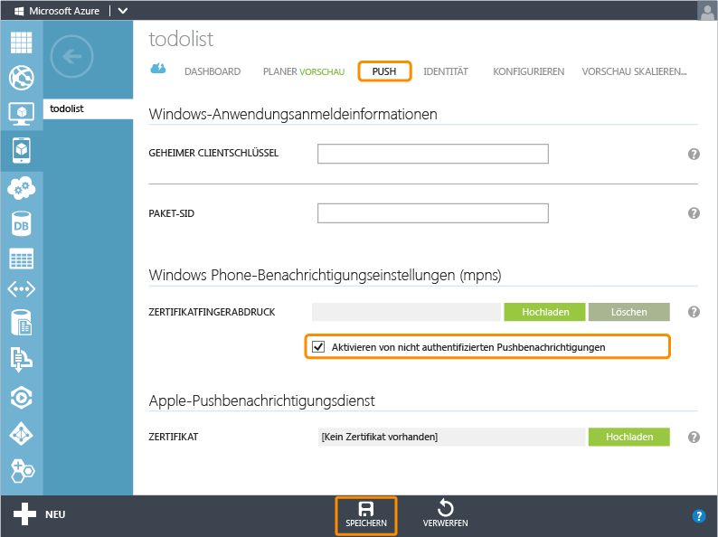

<properties 
	pageTitle="Verwenden Sie Azure Mobile Services und Notification Hubs, um Pushbenachrichtigungen an Ihre Windows Phone-App zu senden." 
	description="Erfahren Sie, wie Sie Notification Hubs mit Azure Mobile Services verwenden, um Pushbenachrichtigungen an Ihre Windows Phone-App zu senden." 
	services="mobile-services,notification-hubs" 
	documentationCenter="windows" 
	authors="ggailey777" 
	manager="dwrede" 
	editor=""/>

<tags 
	ms.service="mobile-services" 
	ms.workload="mobile" 
	ms.tgt_pltfrm="mobile-windows-phone" 
	ms.devlang="dotnet" 
	ms.topic="article" 
	ms.date="06/04/2015" 
	ms.author="wesmc"/>

# Hinzufügen von Pushbenachrichtigungen zur Mobile Services-App

[AZURE.INCLUDE [mobile-services-selector-get-started-push-legacy](../../includes/mobile-services-selector-get-started-push-legacy.md)]

##Übersicht

In diesem Thema erfahren Sie, wie Sie mithilfe von Azure Mobile Services mit einem .NET-Back-End über den Microsoft-Pushbenachrichtigungsdienst (MPNS) Pushbenachrichtigungen an eine Windows Phone Silverlight 8-App senden. In diesem Lernprogramm fügen Sie Pushbenachrichtigungen mithilfe von Azure-Benachrichtigungshubs zum Schnellstartprojekt hinzu. Wenn dies abgeschlossen ist, sendet Ihr mobiler Dienst immer dann, wenn ein Datensatz eingefügt wird, eine Pushbenachrichtigung mithilfe von Benachrichtigungshubs. Der von Ihnen erstellte Benachrichtigungshub ist für den mobilen Dienst kostenlos, kann unabhängig vom mobilen Dienst verwaltet werden und kann von anderen Anwendungen und Diensten verwendet werden.

Dieses Lernprogramm baut auf dem Mobile Services-TodoList-Projekt auf. Bevor Sie mit diesem Lernprogramm beginnen, müssen Sie zunächst das Lernprogramm [Hinzufügen von Mobile Services zu einer vorhandenen Anwendung] abschließen, um Ihr Projekt mit dem mobilen Dienst zu verbinden.

>[AZURE.NOTE]Dieses Lernprogramm ist auf Windows Phone 8.1-Silverlight-Apps ausgerichtet. Falls Sie stattdessen eine Windows Phone 8.1 Store-App erstellen, informieren Sie sich in der Lernprogrammversion zu [Windows Store-Apps](mobile-services-dotnet-backend-windows-store-dotnet-get-started-push). Informationen zu Windows Phone Silverlight-Apps und einen Vergleich mit Windows Phone Store-Apps finden Sie unter [Windows Phone Silverlight 8.1-Apps].

##Aktualisieren Ihrer App zur Registrierung für Benachrichtigungen

Bevor die App Pushbenachrichtigungen empfangen kann, müssen Sie einen Benachrichtigungskanal registrieren.

1. Öffnen Sie in Visual Studio die Datei "App.xaml.cs", und fügen Sie die folgende `using`-Anweisung hinzu:

        using Microsoft.Phone.Notification;

2. Fügen Sie der `AcquirePushChannel`-Klasse die folgende `App`-Methode hinzu:

        public static HttpNotificationChannel CurrentChannel { get; private set; }	
        
        private void AcquirePushChannel()
        {
            CurrentChannel = HttpNotificationChannel.Find("MyPushChannel");
            if (CurrentChannel == null)
            {
                CurrentChannel = new HttpNotificationChannel("MyPushChannel");
                CurrentChannel.Open();
                CurrentChannel.BindToShellToast();
            }
            CurrentChannel.ChannelUriUpdated +=
                new EventHandler<NotificationChannelUriEventArgs>(async (o, args) =>
                {
                    // Register for notifications using the new channel
                    System.Exception exception = null;
                    try
                    {
                        await MobileService.GetPush()
                            .RegisterNativeAsync(CurrentChannel.ChannelUri.ToString());
                    }
                    catch (System.Exception ex)
                    {
                        CurrentChannel.Close();
                        exception = ex;
                    }
                    if (exception != null)
                    {
                        Deployment.Current.Dispatcher.BeginInvoke(() =>
                        {
                            MessageBox.Show(exception.Message, 
                                            "Registering for Push Notifications",
                                            MessageBoxButton.OK);
                        });
                    }
            });
            CurrentChannel.ShellToastNotificationReceived += 
                new EventHandler<NotificationEventArgs>((o, args) =>
                {
                    string message = "";
                    foreach (string key in args.Collection.Keys)
                    {
                        message += key + " : " + args.Collection[key] + ", ";
                    }
                    Deployment.Current.Dispatcher.BeginInvoke(() =>
                    {
                        MessageBox.Show(message);
                    });
            });
        }

    Dieser Code ruft den Kanal-URI für die App ab, falls vorhanden. Andernfalls wird er erstellt. Der Kanal-URI wird dann für Popupbenachrichtigungen geöffnet und gebunden. Sobald der Kanal-URI vollständig geöffnet ist, wird der Handler für die `ChannelUriUpdated`-Methode aufgerufen, und der Kanal wird registriert, um Pushbenachrichtigungen zu empfangen. Falls bei der Registrierung Fehler auftreten, wird der Kanal geschlossen, sodass nachfolgende Ausführungen der App die Registrierung erneut versuchen können. Der `ShellToastNotificationReceived`-Handler wird so eingerichtet, dass die App während der Ausführung Pushbenachrichtigungen empfangen und verarbeiten kann.
    
4. Fügen Sie im `Application_Launching`-Ereignishandler in "App.xaml.cs" der neuen `AcquirePushChannel`-Methode folgenden Aufruf hinzu:

        AcquirePushChannel();

	Auf diese Weise wird sichergestellt, dass die Registrierung bei jedem Laden der App angefordert wird. Sie können diese Registrierung in Ihrer App auch nur von Zeit zu Zeit durchführen, um sicherzustellen, dass die Registrierung aktuell ist.

5. Drücken Sie **F5**, um die App auszuführen. Ein Dialogfenster wird mit dem Registrierungsschlüssel angezeigt.
  
6. Öffnen Sie in Visual Studio die Datei "Package.appxmanifest" und vergewissern Sie sich, dass **Toast Capable** in der Registerkarte **Application UI** auf **Yes** gesetzt ist.

   	![][1]

   	Damit stellen Sie sicher, dass Ihre App Popupbenachrichtigungen ausgeben kann.

##Aktualisieren des Servers zum Senden von Pushbenachrichtigungen

1. Erweitern Sie im Projektmappen-Explorer in Visual Studio den Ordner **Controllers** im mobilen Dienstprojekt. Öffnen Sie die Datei "TodoItemController.cs", und aktualisieren Sie die `PostTodoItem`-Methodendefinition mithilfe des folgenden Codes:  

        public async Task<IHttpActionResult> PostTodoItem(TodoItem item)
        {
            TodoItem current = await InsertAsync(item);
            MpnsPushMessage message = new MpnsPushMessage();
            message.XmlPayload = "<?xml version="1.0" encoding="utf-8"?>" +
                "<wp:Notification xmlns:wp="WPNotification">" +
                   "<wp:Toast>" +
                        "<wp:Text1>" + item.Text + "</wp:Text1>" +
                   "</wp:Toast> " +
                "</wp:Notification>";

            try
            {
                var result = await Services.Push.SendAsync(message);
                Services.Log.Info(result.State.ToString());
            }
            catch (System.Exception ex)
            {
                Services.Log.Error(ex.Message, null, "Push.SendAsync Error");
            }
            return CreatedAtRoute("Tables", new { id = current.Id }, current);
        }

    Dieser Code sendet eine Pushbenachrichtigung (mit dem Text des eingefügten Eintrags), nachdem ein todo-Eintrag eingefügt wurde. Falls ein Fehler auftritt, wird vom Code ein Fehlerprotokolleintrag hinzugefügt, der auf der Registerkarte **Protokolle** des mobilen Diensts im Verwaltungsportal angezeigt werden kann.

2. Melden Sie sich beim [Azure-Verwaltungsportal] an, klicken Sie auf **Mobile Services**, und klicken Sie dann auf Ihre Anwendung.

3. Klicken Sie auf die Registerkarte **Push**, aktivieren Sie **Enable unauthenticated push notifications**, und klicken Sie dann auf **Speichern**.

   	

	>[AZURE.NOTE]Dieses Lernprogramm verwendet MPNS im nicht authentifizierten Modus. In diesem Modus beschränkt MPNS die Anzahl der Benachrichtigungen, die an einen Gerätekanal gesendet werden können. Um diese Beschränkung aufzuheben, müssen Sie ein Zertifikat generieren und hochladen, indem Sie auf <strong>Upload</strong> klicken und das Zertifikat auswählen. Weitere Informationen zum Generieren des Zertifikats finden Sie unter <a href="http://msdn.microsoft.com/library/windowsphone/develop/ff941099(v=vs.105).aspx">Einrichten eines authentifizierten Webdiensts zum Senden von Pushbenachrichtigungen für Windows Phone</a>.

Daraufhin kann der mobile Dienst im nicht authentifizierten Modus eine Verbindung mit MPNS zum Senden von Pushbenachrichtigungen herstellen.

##Aktivieren von Pushbenachrichtigungen für lokale Tests

[AZURE.INCLUDE [mobile-services-dotnet-backend-configure-local-push](../../includes/mobile-services-dotnet-backend-configure-local-push.md)]

##Testen von Pushbenachrichtigungen in der App

1. Drücken Sie in Visual Studio die Taste F5, um die App auszuführen.

    >[AZURE.NOTE]Beim Ausführen von Tests im Windows Phone-Emulator kann der Fehler "401 Nicht autorisiert – RegistrationAuthorizationException" auftreten. Der Fehler kann während des `RegisterNativeAsync()`-Aufrufs auftreten und wird dadurch verursacht, wie der Windows Phone-Emulator seine Uhr mit dem Host-PC synchronisiert. Dies kann dazu führen, dass ein Sicherheitstoken abgelehnt wird. Um das Problem zu beheben, stellen Sie die Uhrzeit im Emulator vor dem Testen einfach manuell ein.

5. Geben Sie in der App in das Textfeld den Text "hello push" ein, und klicken Sie dann auf **Speichern**. Klicken Sie dann direkt auf die Schaltfläche "Start" oder "Zurück", um die App zu verlassen

   	![Einfügen von Text][2]

  	Damit wird eine Einfügeanforderung zum Speichern des hinzugefügten Eintrags an den mobilen Dienst gesendet. Das Gerät empfängt eine Popupbenachrichtigung mit dem Text **hello push**.

	

	>[AZURE.NOTE]Wenn Sie sich noch in der App befinden, erhalten Sie die Benachrichtigung nicht. Um eine Popupbenachrichtigung zu empfangen, während die App aktiv ist, müssen Sie das [ShellToastNotificationReceived](http://msdn.microsoft.com/library/windowsphone/develop/microsoft.phone.notification.httpnotificationchannel.shelltoastnotificationreceived.aspx)-Ereignis behandeln.

##Nächste Schritte

In diesem Lernprogramm wurde allgemein erläutert, wie eine Windows Phone-App für das Senden von Pushbenachrichtigungen unter Verwendung von Mobile Services und Notification Hubs eingerichtet wird. Im Anschluss empfiehlt sich das nächste Lernprogramm [Senden von Pushbenachrichtigungen an authentifizierte Benutzer]. Hier wird erläutert, wie Pushbenachrichtigungen mithilfe von Tags von einem mobilen Dienst ausschließlich an einen authentifizierten Benutzer gesendet werden.

Weitere Informationen zu Mobile Services und Notification Hubs:

* [Hinzufügen von Authentifizierung zur app]   Erfahren Sie, wie sich Benutzer Ihrer App mit verschiedenen Kontotypen mithilfe von mobilen Diensten authentifizieren können.

* [Was sind Notification Hubs?]  Erfahren Sie, wie Sie mit Benachrichtigungshubs Benachrichtigungen an all Ihre Apps auf allen großen Clientplattformen versenden können.

* [Debuggen von Notification Hubs-Anwendungen](http://go.microsoft.com/fwlink/p/?linkid=386630)  Hier finden Sie die Anleitungen zur Problembehandlung und zum Debuggen von Notification Hubs-Lösungen.

* [Mobile Services .NET-Anleitungen: Konzeptionelle Referenz]  Lernen Sie mehr über die Verwendung von Mobile Services mit .NET.

<!-- Images. -->

[1]: ./media/mobile-services-dotnet-backend-windows-phone-get-started-push/mobile-app-enable-push-wp8.png
[2]: ./media/mobile-services-dotnet-backend-windows-phone-get-started-push/mobile-quickstart-push3-wp8.png
[3]: ./media/mobile-services-dotnet-backend-windows-phone-get-started-push/mobile-quickstart-push4-wp8.png

<!-- URLs. -->
[Hinzufügen von Mobile Services zu einer vorhandenen Anwendung]: mobile-services-dotnet-backend-windows-phone-get-started-data.md
[Hinzufügen von Authentifizierung zur app]: mobile-services-dotnet-backend-windows-phone-get-started-users.md

[Senden von Pushbenachrichtigungen an authentifizierte Benutzer]: mobile-services-dotnet-backend-windows-phone-push-notifications-app-users.md

[Was sind Notification Hubs?]: ../notification-hubs-overview.md
[Send broadcast notifications to subscribers]: ../notification-hubs-windows-phone-send-breaking-news.md
[Send template-based notifications to subscribers]: ../notification-hubs-windows-phone-send-localized-breaking-news.md

[Mobile Services .NET-Anleitungen: Konzeptionelle Referenz]: mobile-services-html-how-to-use-client-library.md
[Windows Phone Silverlight 8.1-Apps]: http://msdn.microsoft.com/library/windowsphone/develop/dn642082(v=vs.105).aspx
[Azure-Verwaltungsportal]: https://manage.windowsazure.com/
 

<!---HONumber=July15_HO3-->