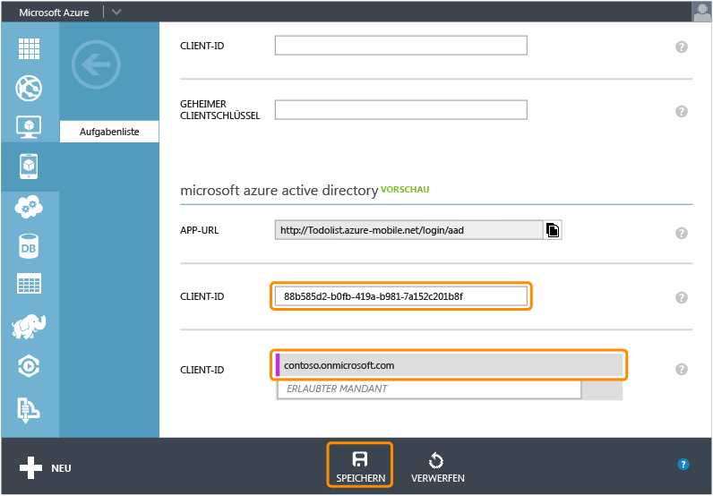

<properties 
	pageTitle="Registrieren für die Authentifizierung in Azure Active Directory | Microsoft Azure" 
	description="Erfahren Sie mehr über die Registrierung für die Azure Active Directory-Authentifizierung in Ihrer Mobile Services-Anwendung." 
	authors="wesmc7777" 
	services="mobile-services" 
	documentationCenter="" 
	manager="dwrede" 
	editor=""/>

<tags 
	ms.service="mobile-services" 
	ms.workload="mobile" 
	ms.tgt_pltfrm="multiple" 
	ms.devlang="multiple" 
	ms.topic="article" 
	ms.date="06/15/2015" 
	ms.author="wesmc"/>

# Registrieren Ihrer Apps für die Verwendung einer Azure Active Directory-Anmeldung

[AZURE.INCLUDE [mobile-services-selector-register-identity-provider](../../includes/mobile-services-selector-register-identity-provider.md)]

##Übersicht

In diesem Thema erfahren Sie, wie Sie Ihre Apps registrieren, um Azure Active Directory als Authentifizierungsanbieter für Ihren mobilen Dienst zu verwenden.

##Registrieren Ihrer App

>[AZURE.NOTE]Die in diesem Thema beschriebenen Schritte sollten mit dem Lernprogramm [Hinzufügen von Authentifizierung zur Mobile Services-App](../mobile-services-dotnet-backend-windows-store-dotnet-get-started-users.md) verwendet werden, wenn Sie [Vom Dienst ausgehende Anmeldevorgänge](http://msdn.microsoft.com/library/azure/dn283952.aspx) mit Ihrer App verwenden möchten. Auch wenn Ihre App vom [Client ausgehende Anmeldevorgänge](http://msdn.microsoft.com/library/azure/jj710106.aspx) für Azure Active Directory und einen mobilen .NET Backend-Dienst erfordert, sollten Sie mit dem Lernprogramm [Authentifizieren Ihrer App mit der Active Directory-Bibliothek für einmaliges Anmelden](mobile-services-windows-store-dotnet-adal-sso-authentication.md) beginnen.

1. Melden Sie sich auf dem [Azure-Verwaltungsportal] an, navigieren Sie zu Ihrem mobilen Dienst, klicken Sie auf die Registerkarte **Identität** und blättern Sie anschließend nach unten bis zum Bereich **Azure Active Directory**-Identitätsanbieter. Kopieren Sie die dort angezeigte **App-URL**.

    

2. Navigieren Sie im Verwaltungsportal zum **Active Directory**, klicken Sie dann auf Ihr Verzeichnis und auf **Domänen**, und notieren Sie sich die Standarddomäne für Ihr Verzeichnis.

3. Klicken Sie auf **Anwendungen** > **Hinzufügen** > **Add an application my organization is developing**.

4. Geben Sie im Add Application-Assistenten einen **Namen** für Ihre Anwendung ein und klicken Sie auf den Typ **Web Application And/Or Web API**.

    

5. Fügen Sie im Eingabefeld **Anmelde-URL** den kopierten Wert der App-URL aus Ihrem mobilen Dienst ein. Geben Sie den gleichen eindeutigen Wert im Eingabefeld **App-ID-URI** ein, und klicken Sie dann, um den Vorgang fortzusetzen.
 
    

6. Nachdem die Anwendung hinzugefügt wurde, klicken Sie auf die Registerkarte **Konfigurieren** und kopieren Sie die **Client-ID** für die App.

    >[AZURE.NOTE]Für einen mobilen .NET-Backend-Dienst müssen Sie auch den Wert **Antwort-URL** unter **Einmaliges Anmelden** bearbeiten, und legen diese URL gefolgt vom Pfad _signin-aad_ fest. Beispiel: `https://todolist.azure-mobile.net/signin-aad`

7. Kehren Sie zurück zur Registerkarte **Identität** Ihres mobilen Diensts und fügen Sie den kopierten **Client-ID**-Wert für den Azure Active Directory-Identitätsanbieter ein.
 
    

8.  In der Liste **Zulässige Mandanten** geben Sie die Domäne des Verzeichnisses ein, in dem Sie die Anwendung registriert haben (z. B. `contoso.onmicrosoft.com`). Klicken Sie anschließend auf **Speichern**.

Sie können nun Azure Active Directory für die Authentifizierung in Ihrer App verwenden.

<!-- Anchors. -->

<!-- Images. -->

<!-- URLs. -->
[Azure-Verwaltungsportal]: https://manage.windowsazure.com/

 

<!---HONumber=August15_HO8-->