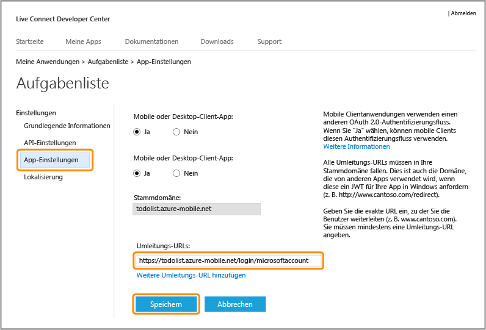

<properties 
	pageTitle="Registrieren für die Microsoft-Authentifizierung | Microsoft Azure" 
	description="Erfahren Sie mehr über die Registrierung für die Microsoft-Authentifizierung in Ihrer Azure Mobile Services-Anwendung." 
	authors="ggailey777" 
	services="mobile-services" 
	documentationCenter="Mobile" 
	manager="dwrede" 
	editor=""/>

<tags 
	ms.service="mobile-services" 
	ms.workload="mobile" 
	ms.tgt_pltfrm="NA" 
	ms.devlang="multiple" 
	ms.topic="article" 
	ms.date="11/15/2015" 
	ms.author="glenga"/>

# Registrieren Ihrer App für die Verwendung eines Microsoft-Kontos für die Authentifizierung

[AZURE.INCLUDE [mobile-services-selector-register-identity-provider](../../includes/mobile-services-selector-register-identity-provider.md)]

## Übersicht 

In diesem Thema erfahren Sie, wie Sie Ihre mobile App registrieren, um ihr Microsoft-Konto als Identitätsanbieter mit Azure Mobile Services verwenden zu können. Die gleichen Schritte gelten für die dienstgesteuerte und die Client-gesteuerte Authentifizierung mithilfe des Live SDK.

##Registrieren der Windows Store-App im Windows-Entwicklungscenter

Windows Store-Apps müssen zunächst im Windows-Entwicklungscenter registriert werden.

>[AZURE.NOTE]Windows Phone 8, Windows Phone 8.1 Silverlight und nicht auf Windows basierte Anwendungen können diesen Abschnitt überspringen.

1. Falls Sie Ihre Anwendung noch nicht registriert haben, navigieren Sie zu [Windows Dev Center](https://dev.windows.com/dashboard/Application/New), melden Sie sich dort mit Ihrem Microsoft-Konto an, geben Sie einen Namen für Ihre App ein, und klicken Sie anschließend auf **App-Name reservieren**.
 
3. Öffnen Sie Ihr Windows-App-Projekt in Visual Studio. Klicken Sie im Projektmappen-Explorer mit der rechten Maustaste auf das Windows Store-App-Projekt, und klicken Sie anschließend auf **Store** > **App mit Store verknüpfen...**.

  	

5. Klicken Sie im Assistenten auf **Anmelden**, melden Sie sich mit Ihrem Microsoft-Konto an, wählen Sie den reservierten App-Namen aus, und klicken Sie auf **Weiter** > **Zuordnen**.

6. Optional: Wiederholen Sie bei einer universellen Windows 8.1-App die Schritte 4 und 5 für das Windows Phone Store-Projekt.

6. Klicken Sie auf der Windows Dev Center-Seite für Ihre neue App auf **Dienste** > **Pushbenachrichtigungen**.

7. Klicken Sie auf der Seite **Pushbenachrichtigungen** unter **Windows-Pushbenachrichtigungsdienste (WNS) und Microsoft Azure Mobile Services** auf **Live Services-Website**.

Die Microsoft-Kontoseite für Ihre App wird nun angezeigt. Als Nächstes erhalten Sie die Anmeldeinformationen, die Azure benötigt, um die Microsoft-Authentifizierung für Ihre App verwenden zu können.

## Konfigurieren Sie Ihre Microsoft-Kontoanmeldung und stellen Sie eine Verbindung zu Mobile Services her

Der erste Schritt in diesem Abschnitt gilt nur für Windows Phone 8, Windows Phone 8.1 Silverlight und Apps, die nicht Windows Store-basiert sind. Für diese Anwendungen können Sie auch die Paket-Sicherheits-ID (SID) ignorieren, die nur für Windows Store-Apps verfügbar ist.

1. Für eine App, die nicht Windows Store-basiert ist, navigieren Sie zur Seite [Meine Anwendungen](http://go.microsoft.com/fwlink/p/?LinkId=262039) im Developer Center des Microsoft-Kontos, melden sich mit Ihrem Microsoft-Konto an (falls erforderlich), klicken auf **Anwendung erstellen**, geben einen Anwendungsnamen ein und klicken auf **Ich stimme zu**.

   	Dadurch wird ein App-Name mit dem Microsoft-Konto reserviert und die Microsoft-Kontoseite für Ihre App angezeigt.

2. Klicken Sie auf der Microsoft-Kontoseite für Ihre App auf **API-Einstellungen**, aktivieren Sie das Kontrollkästchen **Mobile oder Desktop-Client-App**, legen Sie die mobile Dienst-URL als Zieldomäne fest, geben Sie unter **Umleitungs-URL** eines der folgenden URL-Formate ein, und klicken Sie anschließend auf **Speichern**:

	+ **.NET-Back-End**: `https://<mobile_service>.azure-mobile.net/signin-microsoft`
	+ **JavaScript-Back-End**: `https://<mobile_service>.azure-mobile.net/login/microsoftaccount` 

	 >[AZURE.NOTE]Stellen Sie sicher, dass Sie das passende Umleitungs-URL-Pfadformat für Ihr Mobile Services-Back-End verwenden. Andernfalls ist die Authentifizierung nicht erfolgreich. Die Stammdomäne wird automatisch ausgefüllt. &nbsp;

    

4. Klicken Sie auf **App-Einstellungen** und notieren Sie sich die Werte unter **Client-ID**, **Geheimer Clientschlüssel** und **Paket-SID**.
	
   	
	
	
    > [AZURE.NOTE]Der geheime Clientschlüssel ist eine wichtige Anmeldeinformation. Teilen Sie den geheimen Clientschlüssel mit niemandem, und geben Sie ihn nicht über Ihre App frei. Nur für App-Registrierungen in Windows Store wird ein Paket-SID-Feld angezeigt.

4. Klicken Sie im [Azure-Verwaltungsportal] auf die Registerkarte **Identität** für den mobilen Dienst, geben Sie die Client-ID, den geheimen Clientschlüssel und die Paket-SID von Ihrem Identitätsanbieter ein, und klicken Sie anschließend auf **Speichern**.
	
	>[AZURE.NOTE]Für Windows Phone 8, Windows Phone Store 8.1 Silverlight und nicht auf Windows basierte Anwendungen ist kein Paket-SID-Wert erforderlich.
	
Sowohl Ihr Mobile Service als auch Ihre App sind nun konfiguriert und funktionieren mit dem Microsoft-Konto.

<!-- Anchors. -->

<!-- Images. -->

<!-- URLs. -->

[Submit an app page]: http://go.microsoft.com/fwlink/p/?LinkID=266582
[My Applications]: http://go.microsoft.com/fwlink/p/?LinkId=262039

[Azure-Verwaltungsportal]: https://manage.windowsazure.com/
 

<!---HONumber=Nov15_HO4-->