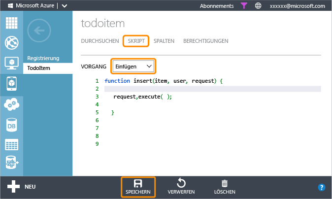

<properties 
	pageTitle="Erste Schritte mit Pushbenachrichtigungen (Android JavaScript) | Microsoft Azure" 
	description="Erfahren Sie mehr über die Verwendung von Azure Mobile Services zum Senden von Pushbenachrichtigungen an Ihre Android-JavaScript-App." 
	services="mobile-services, notification-hubs" 
	documentationCenter="android" 
	authors="RickSaling" 
	manager="dwrede" 
	editor=""/>

<tags 
	ms.service="mobile-services" 
	ms.workload="mobile" 
	ms.tgt_pltfrm="mobile-android" 
	ms.devlang="java" 
	ms.topic="article" 
	ms.date="06/03/2015" 
	ms.author="ricksal"/>

# Hinzufügen von Pushbenachrichtigungen zur Mobile Services-App

[AZURE.INCLUDE [mobile-services-selector-get-started-push](../../includes/mobile-services-selector-get-started-push-ec.md)]

In diesem Thema erfahren Sie, wie Sie mithilfe von Azure Mobile Services eine Pushbenachrichtigung per Google Cloud Messaging (GCM) an Ihre Android-App senden. In diesem Lernprogramm fügen Sie Pushbenachrichtigungen mithilfe von Azure-Benachrichtigungshubs zum Schnellstartprojekt hinzu. Wenn dies abgeschlossen ist, sendet Ihr mobiler Dienst immer dann, wenn ein Datensatz eingefügt wird, eine Pushbenachrichtigung.

In diesem Lernprogramm werden die folgenden grundlegenden Schritte zur Aktivierung von Pushbenachrichtigungen behandelt:

1. [Aktivieren von Google Cloud Messaging](#register)
2. [Konfigurieren von Mobile Services](#configure)
3. [Hinzufügen von Pushbenachrichtigungen zur App](#add-push)
4. [Aktualisieren von Skripts zum Senden von Pushbenachrichtigungen](#update-scripts)
5. [Einfügen von Daten zum Empfangen von Benachrichtigungen](#test)

>[AZURE.NOTE]Den Quellcode der fertig gestellten App finden Sie <a href="https://github.com/RickSaling/mobile-services-samples/tree/futures/GettingStartedWithPush/Android" target="_blank">hier</a>.

##Voraussetzungen

[AZURE.INCLUDE [mobile-services-android-prerequisites](../../includes/mobile-services-android-prerequisites-ec.md)]

##Aktivieren von Google Cloud Messaging

[AZURE.INCLUDE [Aktivieren von GCM](../../includes/mobile-services-enable-google-cloud-messaging.md)]

##Konfigurieren von Mobile Services zum Senden von Pushanforderungen

[AZURE.INCLUDE [mobile-services-android-configure-push](../../includes/mobile-services-android-configure-push.md)]

##Hinzufügen von Pushbenachrichtigungen zur App

###Prüfen der Version des Android-SDK

[AZURE.INCLUDE [Prüfen des SDK](../../includes/mobile-services-verify-android-sdk-version-ec.md)]

Als Nächstes installieren Sie Google Play Services. Google Cloud Messaging verfügt über einige Mindestanforderungen an den API-Level für Entwicklung und Tests, denen die Eigenschaft **minSdkVersion** im Manifest entsprechen muss.

Wenn Sie den Testvorgang mit einem älteren Gerät durchführen, konsultieren Sie [Set Up Google Play Services SDK] (Einrichten des Google Play Services SDK, in englischer Sprache), um zu ermitteln, wie niedrig Sie diesen Wert einstellen können. Legen Sie den Wert anschließend entsprechend fest.

###Hinzufügen von Google Play Services zum Projekt

[AZURE.INCLUDE [Hinzufügen von Play Services](../../includes/mobile-services-add-google-play-services-ec.md)]

###Hinzufügen des Codes

[AZURE.INCLUDE [mobile-services-android-getting-started-with-push](../../includes/mobile-services-android-getting-started-with-push-ec.md)]

##Aktualisieren des registrierten Einfügeskripts im Verwaltungsportal

1. Klicken Sie im Verwaltungsportal auf die Registerkarte **Daten** und dann auf die Tabelle **TodoItem**. 

   	

2. Klicken Sie unter **todoitem** auf die Registerkarte **Skript**, und wählen Sie **Einfügen** aus.
   
  	

   	Daraufhin wird die Funktion angezeigt, die aufgerufen wird, wenn etwas in die Tabelle **TodoItem** eingefügt wird.

3. Ersetzen Sie die Einfügefunktion durch den folgenden Code. Klicken Sie dann auf **Speichern**:

		function insert(item, user, request) {
		// Define a payload for the Google Cloud Messaging toast notification.
		var payload = {
		    "data": {
		        "message": item.text 
		    }
		};		
		request.execute({
		    success: function() {
		        // If the insert succeeds, send a notification.
		        push.gcm.send(null, payload, {
		            success: function(pushResponse) {
		                console.log("Sent push:", pushResponse, payload);
		                request.respond();
		                },              
		            error: function (pushResponse) {
		                console.log("Error Sending push:", pushResponse);
		                request.respond(500, { error: pushResponse });
		                }
		            });
		        },
		    error: function(err) {
		        console.log("request.execute error", err)
		        request.respond();
		    }
		  });
		}

   	Daraufhin wird ein neues Einfügeskript registriert, das das [gcm-Objekt] zum Senden einer Pushbenachrichtigung an alle registrierten Geräte verwendet, nachdem der Einfügevorgang erfolgreich war.

##Testen von Pushbenachrichtigungen in der App

Sie können die App testen, indem Sie ein Android-Telefon direkt mit einem USB-Kabel verbinden oder ein virtuelles Gerät im Emulator verwenden.

###Einrichten des Emulators für den Testvorgang

Wenn Sie diese App im Emulator ausführen, stellen Sie sicher, dass Sie ein Android Virtual Device (AVD) verwenden, das Google-APIs unterstützt.

1. Starten Sie Eclipse neu, und klicken Sie dann im Paket-Explorer mit der rechten Maustaste auf das Projekt. Klicken Sie auf **Eigenschaften**, dann auf **Android**, überprüfen Sie **Google APIs**, und klicken Sie dann auf **OK**.

	

  	Dies gibt das Projekt für die Google-APIs vor.

2. Wählen Sie unter **Fenster** **Android Virtual Device Manager**, wählen Sie Ihr Gerät aus, und klicken Sie auf **Bearbeiten**.

	

3. Wählen Sie **Google APIs** in **Ziel** aus, und klicken Sie auf OK.

   	

	Dies gibt das AVD zur Verwendung von Google-APIs vor.

###Ausführen des Tests

1. Klicken Sie in Eclipse im Menü **Run** auf **Run**, um die App zu starten.

2. Geben Sie in der App einen sinnvollen Text ein, beispielsweise _Eine neue Mobile Services-Aufgabe hinzufügen_, und klicken Sie dann auf die Schaltfläche **Hinzufügen**.

  	

3. Führen Sie eine Streifbewegung vom oberen Bildschirmrand aus, um das Notification Center des Geräts zu öffnen, sodass die Benachrichtigung angezeigt wird.

Sie haben dieses Lernprogramm erfolgreich abgeschlossen.

## Nächste Schritte

<!---This tutorial demonstrated the basics of enabling an Android app to use Mobile Services and Notification Hubs to send push notifications. Next, consider completing the next tutorial, [Send push notifications to authenticated users], which shows how to use tags to send push notifications from a Mobile Service to only an authenticated user.

+ [Send push notifications to authenticated users]
	 Learn how to use tags to send push notifications from a Mobile Service to only an authenticated user.

+ [Send broadcast notifications to subscribers]
	 Learn how users can register and receive push notifications for categories they're interested in.

+ [Send template-based notifications to subscribers]
	 Learn how to use templates to send push notifications from a Mobile Service, without having to craft platform-specific payloads in your back-end.
-->

Weitere Informationen zu Mobile Services und Benachrichtigungshubs finden Sie in den folgenden Themen:

* [Erste Schritte mit Daten]  Informationen zum Speichern und Abfragen von Daten mit Mobile Services.

* [Hinzufügen von Authentifizierung zur app][Get started with authentication]   Erfahren Sie, wie sich Benutzer Ihrer App mit verschiedenen Kontotypen mithilfe von mobilen Diensten authentifizieren können.

* [Was sind Notification Hubs?]  Erfahren Sie, wie Sie mit Benachrichtigungshubs Benachrichtigungen an all Ihre Apps auf allen großen Clientplattformen versenden können.

* [Debuggen von Notification Hubs-Anwendungen](http://go.microsoft.com/fwlink/p/?linkid=386630)  Hier finden Sie die Anleitungen zur Problembehandlung und zum Debuggen von Notification Hubs-Lösungen.

* [Verwenden der Android-Clientbibliothek für Mobile Services]  Erfahren Sie mehr über die Verwendung von Mobile Services mit Android.

* [Mobile Services: Serverskriptreferenz]  Erfahren Sie mehr über das Implementieren von Geschäftslogik in Ihren mobilen Dienst.

<!-- Anchors. -->
[Register your app for push notifications and configure Mobile Services]: #register
[Update the generated push notification code]: #update-scripts
[Insert data to receive notifications]: #test
[Next Steps]: #next-steps

<!-- Images. -->
[13]: ./media/mobile-services-windows-store-javascript-get-started-push/mobile-quickstart-push1.png
[14]: ./media/mobile-services-windows-store-javascript-get-started-push/mobile-quickstart-push2.png

<!-- URLs. -->
[Submit an app page]: http://go.microsoft.com/fwlink/p/?LinkID=266582
[My Applications]: http://go.microsoft.com/fwlink/p/?LinkId=262039
[Live SDK for Windows]: http://go.microsoft.com/fwlink/p/?LinkId=262253
[Erste Schritte mit Mobile Services]: mobile-services-android-get-started.md
[Erste Schritte mit Daten]: mobile-services-android-get-started-data.md
[Get started with authentication]: mobile-services-android-get-started-users.md
[Get started with push notifications]: /develop/mobile/tutorials/get-started-with-push-js
[Push notifications to app users]: /develop/mobile/tutorials/push-notifications-to-users-js
[Authorize users with scripts]: /develop/mobile/tutorials/authorize-users-in-scripts-js
[JavaScript and HTML]: /develop/mobile/tutorials/get-started-with-push-js
[Set Up Google Play Services SDK]: http://go.microsoft.com/fwlink/?LinkId=389801
[Azure Management Portal]: https://manage.windowsazure.com/
[Verwenden der Android-Clientbibliothek für Mobile Services]: mobile-services-android-how-to-use-client-library.md

[gcm-Objekt]: http://go.microsoft.com/fwlink/p/?LinkId=282645

[Mobile Services: Serverskriptreferenz]: http://go.microsoft.com/fwlink/?LinkId=262293

[Send push notifications to authenticated users]: mobile-services-javascript-backend-android-push-notifications-app-users.md

[Was sind Notification Hubs?]: ../notification-hubs-overview.md
[Send broadcast notifications to subscribers]: ../notification-hubs-android-send-breaking-news.md
[Send template-based notifications to subscribers]: ../notification-hubs-android-send-localized-breaking-news.md
 

<!------HONumber=August15_HO8-->
