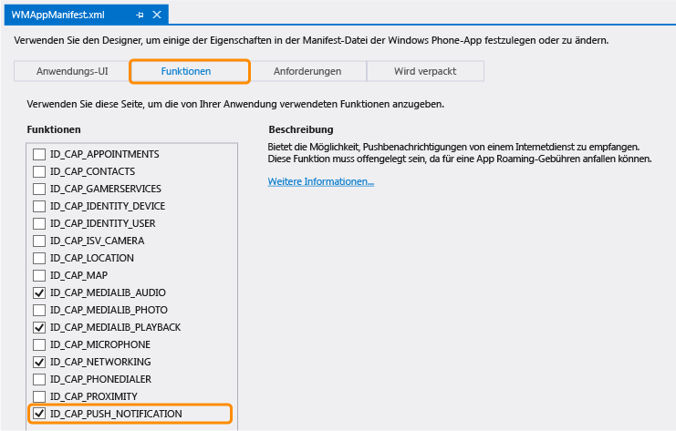

<properties 
	pageTitle="Hinzufügen von Pushbenachrichtigungen zur Mobile Services-App (Windows Store) | Microsoft Azure" 
	description="Erfahren Sie, wie Sie Azure Mobile Services und Notification Hubs verwenden, um Pushbenachrichtigungen an Ihre Windows Store-App zu senden." 
	services="mobile-services,notification-hubs" 
	documentationCenter="windows" 
	authors="ggailey777" 
	manager="dwrede" 
	editor=""/>

<tags 
	ms.service="mobile-services" 
	ms.workload="mobile" 
	ms.tgt_pltfrm="mobile-windows-phone" 
	ms.devlang="dotnet" 
	ms.topic="article" 
	ms.date="06/11/2015" 
	ms.author="glenga"/>

# Hinzufügen von Pushbenachrichtigungen zur Mobile Services-App

[AZURE.INCLUDE [mobile-services-selector-get-started-push](../../includes/mobile-services-selector-get-started-push.md)]

##Übersicht

In diesem Thema wird gezeigt, wie Sie mit Azure Mobile Services Pushbenachrichtigungen an eine Windows Phone Silverlight-App senden können. In diesem Lernprogramm fügen Sie Pushbenachrichtigungen mithilfe von Azure-Benachrichtigungshubs zum Schnellstartprojekt hinzu. Wenn dies abgeschlossen ist, sendet Ihr mobiler Dienst immer dann, wenn ein Datensatz eingefügt wird, eine Pushbenachrichtigung mithilfe von Benachrichtigungshubs. Der von Ihnen erstellte Benachrichtigungshub ist für den mobilen Dienst kostenlos, kann unabhängig vom mobilen Dienst verwaltet werden und kann von anderen Anwendungen und Diensten verwendet werden.

Dieses Lernprogramm baut auf der TodoList-Beispiel-App auf. Bevor Sie mit diesem Lernprogramm beginnen, müssen Sie zunächst das Thema [Hinzufügen von Mobile Services zu einer vorhandenen Anwendung] abschließen, um Ihr Projekt mit dem mobilen Dienst zu verbinden. Wenn ein mobiler Dienst nicht verbunden wurde, stellt der Assistent für Pushbenachrichtigungen diese Verbindung für Sie her.

>[AZURE.NOTE]Zum Senden von Pushbenachrichtigungen an eine Windows Phone 8.1 Store-App führen Sie die Lernprogrammversion für [Windows Store-Apps](../mobile-services-javascript-backend-windows-store-dotnet-get-started-push.md) aus.

## Aktualisieren Ihrer App zur Registrierung für Benachrichtigungen

Bevor die App Pushbenachrichtigungen empfangen kann, müssen Sie einen Benachrichtigungskanal registrieren.

1. Öffnen Sie in Visual Studio die Datei "App.xaml.cs", und fügen Sie die folgende `using`-Anweisung hinzu:

        using Microsoft.Phone.Notification;

3. Fügen Sie der Datei "App.xaml.cs" folgenden Code hinzu:
	
        public static HttpNotificationChannel CurrentChannel { get; private set; }

        private void AcquirePushChannel()
        {
            CurrentChannel = HttpNotificationChannel.Find("MyPushChannel");

            if (CurrentChannel == null)
            {
                CurrentChannel = new HttpNotificationChannel("MyPushChannel");
                CurrentChannel.Open();
                CurrentChannel.BindToShellToast();
            }

            CurrentChannel.ChannelUriUpdated +=
                new EventHandler<NotificationChannelUriEventArgs>(async (o, args) =>
                {

                    // Register for notifications using the new channel
                    await MobileService.GetPush()
                        .RegisterNativeAsync(CurrentChannel.ChannelUri.ToString());
                });
        }

    Dieser Code ruft den Kanal-URI für die App aus dem von Windows Phone 8.x "Silverlight" verwendeten Microsoft-Pushbenachrichtigungsdienst (MPNS) ab und registriert anschließend diesen Kanal-URI für Pushbenachrichtigungen.

	>[AZURE.NOTE]In diesem Lernprogramm sendet der mobile Dienst eine Popupbenachrichtigung an das Gerät. Wenn Sie eine Kachelbenachrichtigung senden, müssen Sie stattdessen die **BindToShellTile**-Methode für den Kanal aufrufen.

4. Fügen Sie in der Datei "App.xaml.cs" am Anfang des **Application\_Launching**-Ereignishandlers den folgenden Aufruf der neuen **AcquirePushChannel**-Methode hinzu:

        AcquirePushChannel();

	Dadurch wird sichergestellt, dass die Registrierung jedes Mal beim Laden der Seite angefordert wird. In Ihrer App möchten Sie diese Registrierung ggf. nur in bestimmten Abständen vornehmen, um sicherzustellen, dass die Registrierung noch aktuell ist.

5. Drücken Sie **F5**, um die App auszuführen. Ein Dialogfenster wird mit dem Registrierungsschlüssel angezeigt.
  
6.	Erweitern Sie im Projektmappen-Explorer **Eigenschaften**, öffnen Sie die Datei "WMAppManifest.xml", klicken Sie auf die Registerkarte **Funktionen**, und aktivieren Sie die Funktion **IID\_\_\_CAP\_\_\_PUSH\_NOTIFICATION**.

   	

   	Damit stellen Sie sicher, dass Ihre App Popupbenachrichtigungen ausgeben kann.

## Aktualisieren von Serverskripts zum Senden von Pushbenachrichtigungen

Schließlich müssen Sie das Skript, das für den Einfügevorgang in der Tabelle "TodoItem" registriert wird, aktualisieren, um Benachrichtigungen zu senden.

1. Klicken Sie auf **TodoItem**, dann auf **Script**, und wählen Sie **Insert** aus. 

2. Ersetzen Sie die Einfügefunktion durch den folgenden Code. Klicken Sie dann auf **Speichern**:

		function insert(item, user, request) {
		// Define a payload for the Windows Phone toast notification.
		var payload = '<?xml version="1.0" encoding="utf-8"?>' +
		    '<wp:Notification xmlns:wp="WPNotification"><wp:Toast>' +
		    '<wp:Text1>New Item</wp:Text1><wp:Text2>' + item.text + 
		    '</wp:Text2></wp:Toast></wp:Notification>';
		
		request.execute({
		    success: function() {
		        // If the insert succeeds, send a notification.
		    	push.mpns.send(null, payload, 'toast', 22, {
		            success: function(pushResponse) {
		                console.log("Sent push:", pushResponse);
						request.respond();
		                },              
		                error: function (pushResponse) {
		                    console.log("Error Sending push:", pushResponse);
							request.respond(500, { error: pushResponse });
		                    }
		                });
		            }
		        });      
		}

	Dieses Einfügeskript sendet eine Pushbenachrichtigung (mit dem Text des eingefügten Eintrags) an alle Windows Phone-App-Registrierungen, nachdem der Einfügevorgang erfolgreich war.

3. Klicken Sie auf die Registerkarte **Push**, aktivieren Sie **Enable unauthenticated push notifications**, und klicken Sie dann auf **Speichern**.

	Daraufhin kann der mobile Dienst im nicht authentifizierten Modus eine Verbindung mit MPNS zum Senden von Pushbenachrichtigungen herstellen.

	>[AZURE.NOTE]Dieses Lernprogramm verwendet MPNS im nicht authentifizierten Modus. In diesem Modus beschränkt MPNS die Anzahl der Benachrichtigungen, die an einen Gerätekanal gesendet werden können. Um diese Beschränkung aufzuheben, müssen Sie ein Zertifikat generieren und hochladen, indem Sie auf **Upload** klicken und das Zertifikat auswählen. Weitere Informationen zum Generieren des Zertifikats finden Sie unter [Einrichten eines authentifizierten Webdienstes zum Senden von Pushbenachrichtigungen für Windows Phone].

## Testen von Pushbenachrichtigungen in der App

1. Drücken Sie in Visual Studio die Taste F5, um die App auszuführen.

    >[AZURE.NOTE]Beim Ausführen von Tests im Windows Phone-Emulator kann der Fehler "401 Nicht autorisiert – RegistrationAuthorizationException" auftreten. Der Fehler kann während des `RegisterNativeAsync()`-Aufrufs auftreten und wird dadurch verursacht, wie der Windows Phone-Emulator seine Uhr mit dem Host-PC synchronisiert. Dies kann dazu führen, dass ein Sicherheitstoken abgelehnt wird. Um das Problem zu beheben, stellen Sie die Uhrzeit im Emulator vor dem Testen einfach manuell ein.

5. Geben Sie in der App in das Textfeld den Text „hello push“ ein, und klicken Sie dann auf **Speichern**. Klicken Sie dann direkt auf die Schaltfläche „Start“ oder „Zurück“, um die App zu verlassen

   	

  	Damit wird eine Einfügeanforderung zum Speichern des hinzugefügten Eintrags an den mobilen Dienst gesendet. Das Gerät empfängt eine Popupbenachrichtigung mit dem Text **hello push**.

	

	>[AZURE.NOTE]Wenn Sie sich noch in der App befinden, erhalten Sie die Benachrichtigung nicht. Um eine Popupbenachrichtigung zu empfangen, während die App aktiv ist, müssen Sie das [ShellToastNotificationReceived](http://msdn.microsoft.com/library/windowsphone/develop/microsoft.phone.notification.httpnotificationchannel.shelltoastnotificationreceived.aspx)-Ereignis behandeln.

## Nächste Schritte

In diesem Lernprogramm wurden die Grundlagen der Aktivierung einer Windows Store-App für die Verwendung von Mobile Services und Notification Hubs zum Senden von Pushbenachrichtigungen gezeigt. Als Nächstes können Sie eines der folgenden Lernprogramme ausführen:

+ [Senden von Pushbenachrichtigungen an authentifizierte Benutzer](mobile-services-javascript-backend-windows-phone-push-notifications-app-users.md)  Erfahren Sie, wie Pushbenachrichtigungen mithilfe von Tags von einem mobilen Dienst ausschließlich an authentifizierte Benutzer gesendet werden.

+ [Senden von Übertragungsbenachrichtigungen an Abonnenten](../notification-hubs-windows-phone-send-breaking-news.md)  Erfahren Sie, wie Benutzer sich registrieren und Pushbenachrichtigungen für Kategorien erhalten können, an denen sie interessiert sind.

+ [Senden plattformunabhängiger Benachrichtigungen an Abonnenten](../notification-hubs-aspnet-cross-platform-notify-users.md)  Erfahren Sie, wie Vorlagen zum Senden von Pushbenachrichtigungen von einem mobilen Dienst genutzt werden, ohne dass Sie im Back-End auf plattformspezifische Nutzlasten zurückgreifen müssen.

Weitere Informationen zu Mobile Services und Benachrichtigungshubs finden Sie in den folgenden Themen:

* [Azure Notification Hubs - Diagnoserichtlinien](../notification-hubs-diagnosing.md)  Erfahren Sie, wie Sie Probleme mit Pushbenachrichtigungen beheben.

* [Erste Schritte mit der Authentifizierung]  Informationen zur Authentifizierung von Benutzern Ihrer App mit verschiedenen Kontotypen mithilfe von mobilen Diensten.

* [Was sind Notification Hubs?]  Erfahren Sie, wie Sie mit Benachrichtigungshubs Benachrichtigungen an all Ihre Apps auf allen großen Clientplattformen versenden können.

* [Mobile Services .NET-Anleitungen: Konzeptionelle Referenz]  Lernen Sie mehr über die Verwendung von Mobile Services mit .NET.

* [Mobile Services: Serverskriptreferenz]  Erfahren Sie mehr über das Implementieren von Geschäftslogik in Ihren mobilen Dienst.

<!-- Anchors. -->

<!-- Images. -->

<!-- URLs. -->
[Submit an app page]: http://go.microsoft.com/fwlink/p/?LinkID=266582
[My Applications]: http://go.microsoft.com/fwlink/p/?LinkId=262039
[Live SDK for Windows]: http://go.microsoft.com/fwlink/p/?LinkId=262253
[Hinzufügen von Mobile Services zu einer vorhandenen Anwendung]: mobile-services-windows-phone-get-started-data.md
[Erste Schritte mit der Authentifizierung]: mobile-services-windows-phone-get-started-users.md

[Einrichten eines authentifizierten Webdienstes zum Senden von Pushbenachrichtigungen für Windows Phone]: http://msdn.microsoft.com/library/windowsphone/develop/ff941099(v=vs.105).aspx

[Mobile Services: Serverskriptreferenz]: http://go.microsoft.com/fwlink/?LinkId=262293
[Mobile Services .NET-Anleitungen: Konzeptionelle Referenz]: mobile-services-windows-dotnet-how-to-use-client-library.md

[Was sind Notification Hubs?]: ../notification-hubs-overview.md

 

<!---HONumber=August15_HO8-->