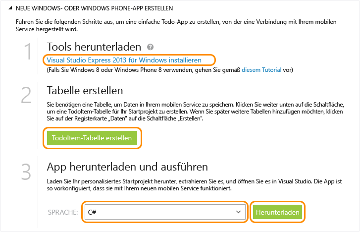

<properties
	pageTitle="Erste Schritte mit Mobile Services für Windows Store-Apps (C#) | Microsoft Azure"
	description="Befolgen Sie dieses Lernprogramm für die ersten Schritte bei der Verwendung von Azure Mobile Services für die Windows Store-Entwicklung in C#."
	services="mobile-services"
	documentationCenter="windows"
	authors="ggailey777"
	manager="dwrede"
	editor=""/>

<tags
	ms.service="mobile-services"
	ms.workload="mobile"
	ms.tgt_pltfrm="mobile-windows"
	ms.devlang="dotnet"
	ms.topic="get-started-article" 
	ms.date="11/06/2015"
	ms.author="glenga"/>

# Erste Schritte mit Mobile Services

[AZURE.INCLUDE [mobile-services-selector-get-started](../../includes/mobile-services-selector-get-started.md)]&nbsp;

[AZURE.INCLUDE [mobile-services-hero-slug](../../includes/mobile-services-hero-slug.md)]

In diesem Lernprogramm wird gezeigt, wie Sie einer universellen Windows-App einen cloudbasierten Back-End-Dienst unter Verwendung von Azure Mobile Services hinzufügen. Universelle Windows-App-Lösungen beinhalten Projekte für Windows Store 8.1, Windows Phone Store 8.1-Apps und ein gemeinsames, geteiltes Projekt. Weitere Informationen finden Sie unter [Erstellen universeller Windows-Apps, die Windows und Windows Phone als Ziel verwenden](http://msdn.microsoft.com/library/windows/apps/xaml/dn609832.aspx).

In diesem Lernprogramm erstellen Sie einen neuen mobilen Dienst und eine einfache *To-Do-Listen*-App, die App-Daten im neuen mobilen Dienst speichert. Der von Ihnen zu erstellende mobile Dienst verwendet JavaScript für die serverseitige Geschäftslogik. Informationen zum Erstellen eines mobilen Diensts, mit dem Sie serverseitige Geschäftslogik in den unterstützten .NET-Sprachen mithilfe von Visual Studio verfassen können, finden Sie in der .NET-Back-End-Version dieses Themas.

[AZURE.INCLUDE [mobile-services-windows-universal-get-started](../../includes/mobile-services-windows-universal-get-started.md)]

Für dieses Lernprogramm benötigen Sie Folgendes:

* Ein aktives Azure-Konto. Falls Sie kein Konto besitzen, können Sie sich für eine Azure-Testversion registrieren. So erhalten Sie bis zu 10 kostenlose mobile Dienste, die Sie auch nach Ablauf der Testversion weiter nutzen können. Ausführliche Informationen finden Sie unter [Kostenlose Azure-Testversion](http://azure.microsoft.com/pricing/free-trial/?WT.mc_id=A0E0E5C02&amp;returnurl=http%3A%2F%2Fazure.microsoft.com%2Fde-DE%2Fdocumentation%2Farticles%2Fmobile-services-javascript-backend-windows-store-javascript-get-started%2F).
* [Visual Studio 2013 Express für Windows]

## Erstellen eines neuen mobilen Diensts

[AZURE.INCLUDE [mobile-services-create-new-service](../../includes/mobile-services-create-new-service.md)]

## Erstellen einer neuen universellen Windows-App

Sobald Sie den mobilen Dienst erstellt haben, können Sie einer einfachen Schnellstartanleitung im klassischen Azure-Portal folgen, um eine neue universelle Windows-App zu erstellen oder eine vorhandene Windows Store- oder Windows Phone-App für die Verbindung mit dem mobilen Dienst zu ändern.

In diesem Abschnitt erstellen Sie eine neue universelle Windows-App, die sich mit dem mobilen Dienst verbindet.

1.  Klicken Sie im [klassischen Azure-Portal] auf **Mobile Services** und anschließend auf den mobilen Dienst, den Sie gerade erstellt haben.

2. Klicken Sie auf der Schnellstartregisterkarte unter **Plattform auswählen** auf **Windows**. Erweitern Sie dann **Neue Windows Store-App erstellen**.

   	Auf diese Weise werden die drei einfachen Schritte zum Erstellen einer Windows Store-App, die mit dem mobilen Dienst verbunden ist, angezeigt.

  	

3. Falls noch nicht geschehen, sollten Sie [Visual Studio 2013 Express für Windows] auf den lokalen Computer oder virtuellen Computer herunterladen und installieren.

4. Klicken Sie auf **TodoItem-Tabelle erstellen**, um eine Tabelle zum Speichern von App-Daten zu erstellen.

5. Wählen Sie unter **App herunterladen und ausführen** eine Sprache für die App aus. Klicken Sie dann auf **Herunterladen**.

  	Das Projekt für die beispielhafte *To-Do-Listen*-Anwendung, die mit dem mobilen Dienst verbunden ist, wird heruntergeladen. Speichern Sie die komprimierte Projektdatei auf dem lokalen Computer und merken Sie sich, wo Sie sie gespeichert haben.

## Ausführen der Windows-App

[AZURE.INCLUDE [mobile-services-javascript-backend-run-app](../../includes/mobile-services-javascript-backend-run-app.md)]

>[AZURE.NOTE]Sie können den Code überprüfen, der auf Ihren Mobile Service zugreift, um Daten abzufragen und einzufügen. Sie finden ihn in der Datei "MainPage.xaml.cs".

## Nächste Schritte
Da Sie den Schnellstart jetzt abgeschlossen haben, erfahren Sie, wie zusätzliche wichtige Aufgaben in Mobile Services ausgeführt werden:

* [Erste Schritte mit der Synchronisierung von Offlinedaten] Erfahren Sie, wie Sie die Offlinedatensynchronisierung nutzen, um eine reaktionsfähige, stabile App zu implementieren.

* [Hinzufügen von Authentifizierung zur Mobile Services-App][Get started with authentication] Informationen zur Authentifizierung von Benutzern Ihrer App mit einem Identitätsanbieter.

* [Hinzufügen von Pushbenachrichtigungen zur App][Get started with push notifications] Erfahren Sie, wie Sie eine einfache Pushbenachrichtigung an Ihre App senden können.

* [Verwenden der .NET Clientbibliothek](mobile-services-windows-dotnet-how-to-use-client-library.md) Erfahren Sie, wie Sie den mobilen Dienst abfragen, mit Daten arbeiten und auf benutzerdefinierte APIs zugreifen.

[AZURE.INCLUDE [app-service-disqus-feedback-slug](../../includes/app-service-disqus-feedback-slug.md)]

<!-- Anchors. -->
[Getting started with Mobile Services]: #getting-started
[Create a new mobile service]: #create-new-service
[Define the mobile service instance]: #define-mobile-service-instance
[Next Steps]: #next-steps

<!-- Images. -->

<!-- URLs. -->
[Erste Schritte mit der Synchronisierung von Offlinedaten]: mobile-services-windows-store-dotnet-get-started-offline-data.md
[Get started with authentication]: ../mobile-services-windows-store-dotnet-get-started-users.md
[Get started with push notifications]: ../mobile-services-javascript-backend-windows-store-dotnet-get-started-push.md
[Visual Studio 2013 Express für Windows]: http://go.microsoft.com/fwlink/?LinkId=257546
[Mobile Services SDK]: http://go.microsoft.com/fwlink/?LinkId=257545
[klassischen Azure-Portal]: https://manage.windowsazure.com/
 

<!---HONumber=AcomDC_1203_2015-->