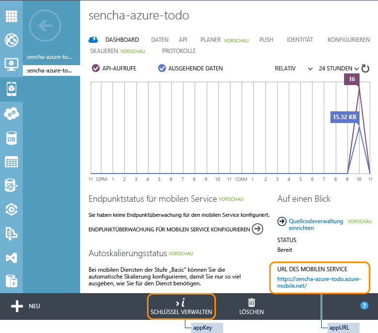
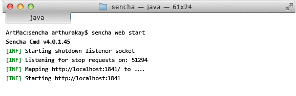

<properties
	pageTitle="Erste Schritte mit Azure Mobile Services und Sencha"
	description="Befolgen Sie dieses Lernprogramm für die ersten Schritte bei der Entwicklung mit Mobile Services und dem Sencha HTML5-Framework für mobile Apps."
	services="mobile-services"
	documentationCenter=""
	authors="ggailey777"
	manager="dwrede"
	editor=""/>

<tags
	ms.service="mobile-services"
	ms.workload="mobile"
	ms.tgt_pltfrm="mobile-sencha"
	ms.devlang="multiple"
	ms.topic="article" 
	ms.date="04/24/2015"
	ms.author="glenga"/>

# Erste Schritte mit Mobile Services und Sencha Touch

[AZURE.INCLUDE [mobile-services-selector-get-started](../../includes/mobile-services-selector-get-started.md)]

##Übersicht

In diesem Lernprogramm erfahren Sie, wie Sie Azure Mobile Services in Ihrer Sencha Touch-Anwendung nutzen können. Sie werden mit Sencha Touch eine einfache To-Do-Listen-Anwendung erstellen, die einen Mobile Service verwendet, den Sie über das Verwaltungsportal festlegen. Dieses Lernprogramm richtet sich an Entwickler mit guten bis sehr guten Webanwendungskenntnissen, die in JavaScript bewandert sind und sich mit dem Sencha Touch-Framework auskennen.

Sie können auch ein Video zu diesem Thema ansehen. In diesem Clip werden dieselben Schritte behandelt wie in diesem Tutorial. Im Video erklärt Arthur Kay, wie Sie eine Sencha Touch-Anwendung mithilfe eines Azure Mobile Services-Back-Ends erstellen.

> [AZURE.VIDEO getting-started-with-sencha-touch]

Unten finden Sie einen Screenshot aus der fertigen App:

![][0]

##Anforderungen

- Herunterladen und Installieren von [Sencha Touch](http://wwww.sencha.com/products/touch/download" target="\_blank").

- Herunterladen und Installieren von [Sencha Cmd Tool](http://www.sencha.com/products/sencha-cmd/download" target="\_blank").

- Java Runtime Environment (JRE) oder Java Development Kit (wenn Sie Android-Apps erstellen)

## Erstellen eines neuen mobilen Diensts

[AZURE.INCLUDE [mobile-services-create-new-service](../../includes/mobile-services-create-new-service.md)]

##Erstellen einer TodoItems-Tabelle

Sobald Sie den Mobile Service erstellt haben, können Sie einfach dem Schnellstart im Verwaltungsportal folgen, um eine neue Datenbanktabelle für die Verwendung im Mobile Service zu erstellen.

1. Klicken Sie im Verwaltungsportal auf **Mobile Services** und anschließend auf den mobilen Dienst, den Sie gerade erstellt haben.

2. Klicken Sie auf der Schnellstartregisterkarte auf **HTML** unter **Plattform auswählen**, und erweitern Sie die Option **Neue HTML-App erstellen**.

    

    Hierdurch werden die drei einfachen Schritte zum Erstellen und Hosten einer mit dem mobilen Dienst verbundenen HTML-App angezeigt.

    

3. Klicken Sie auf **TodoItems-Tabelle erstellen**, um eine Tabelle zum Speichern der App-Daten zu erstellen.

	> [AZURE.NOTE]Laden Sie NICHT die HTML-App aus dem Verwaltungsportal herunter. Wir werden stattdessen im Abschnitt unten manuell eine Sencha Touch-Anwendung erstellen.

1. Notieren Sie sich **appKey** und **appUrl** im Verwaltungsportal. Sie werden diese in anderen Abschnitten dieses Lernprogramms benötigen.

    

1. Vergewissern Sie sich auf der Registerkarte **Konfigurieren**, dass `localhost` bereits im Feld **Anforderungen von Hostnamen zulassen** unter **Cross-Origin Resource Sharing (CORS)** eingetragen ist. Falls nicht, geben Sie `localhost` im Feld **Hostname** ein, und klicken Sie dann auf **Speichern**.

    

##Generieren der Touch-Anwendung

Das Generieren einer Sencha Touch-Vorlagenanwendung mit Sencha Cmd ist eine einfache Aufgabe und eine gute Möglichkeit, um eine Anwendung sehr schnell zum Laufen zu bekommen.

Geben Sie im Verzeichnis, in dem Sie das Touch-Framework erstellt haben, folgenden Befehl aus:

	$ sencha generate app Basic /path/to/application

Dadurch wird eine Touch-Vorlagenanwendung mit dem Anwendungsnamen 'Basic' erstellt. Um die Anwendung zu starten, navigieren Sie einfach im Browser zum Verzeichnis "/path/to/application", wo Sie die Standard-Touch-Beispielanwendung finden sollten.

##Installieren der Sencha Touch-Erweiterungen für Azure

Die Erweiterung für Azure wird entweder manuell oder als Sencha-Paket installiert. Sie können die Methode frei wählen.

###Manuelle Installation

Wenn Sie eine externe Klassenbibliothek hinzufügen möchten, laden Sie bei den meisten Touch-Anwendungen einfach das Paket herunter, entpacken es im Anwendungsverzeichnis und konfigurieren das Touch-Ladeprogramm mit dem Speicherort der Bibliothek.

Sie können die Azure-Erweiterungen durch folgende Schritte manuell zur Anwendung hinzufügen:

1. Laden Sie das Azure-Erweiterungenpaket [hier](https://market.sencha.com/extensions/sencha-touch-extensions-for-windows-azure) herunter. (Sie können Ihre Sencha-Foren-ID verwenden, um Zugriff auf diesen Bereich zu erhalten.)

2. Kopieren Sie das Azure-Erweiterungenpaket vom Downloadverzeichnis zum endgültigen Zielort, und entpacken Sie es:

        $ cd /path/to/application
	    $ mv /download-location/azure.zip .
    	$ unzip azure.zip  

    Dadurch wird ein **azure**-Verzeichnis erstellt, welches den gesamten Quellcode, Beispiele und die Dokumentation des Pakets enthält. Der Quellcode wird sich im Verzeichnis **azure/src** befinden.

###Installation eines Sencha-Pakets

> [AZURE.NOTE]Sie können diese Methode nur verwenden, wenn Sie die Anwendung mithilfe des Befehls <code>sencha generate app</code> erstellt haben.

Alle Anwendungen, die von Sencha Cmd erstellt wurden, haben im Stamm einen Paketeordner. Der Speicherort dieses Ordners kann konfiguriert werden, aber unabhängig vom Speicherort dient der Paketeordner auch als Speicher aller Pakete, die von der Anwendung verwendet wurden (oder von Anwendungen, wenn Sie einen Sencha Workspace erstellt haben).

Da Ext.Azure ein Sencha Cmd-Paket ist, kann der Quellcode mit Sencha Cmd einfach installiert und in die Anwendung eingefügt werden. (Unter [Sencha Cmd Packages](http://docs.sencha.com/cmd/3.1.2/#!/guide/command_packages) (in englischer Sprache) erhalten Sie weitere Informationen).

Um das Azure-Erweiterungspaket aus dem Sencha-Paketverzeichnis herunterzuladen, müssen Sie den Paketnamen zur Datei **app.json** hinzufügen und die Anwendung erstellen:

1. Fügen Sie das Azure-Paket zum erforderlichen Abschnitt der app.json-Datei hinzu:

	    {
            "name": "Basic",
	        "requires": [
    	        "touch-azure"
        	]
    	}

2. Erstellen Sie die Anwendung mithilfe von **sencha cmd** neu, um das Paket abzuholen und zu installieren:

	    $ sencha app build

Sowohl **sencha app build** als auch **sencha app refresh** werden jetzt die erforderlichen Schritte ausführen, um das Paket in die Anwendung zu integrieren. Normalerweise werden Sie nach dem Ändern der Paketanforderungen **sencha app refresh** ausführen, damit die erforderlichen Metadaten für die Unterstützung von "dev mode" aktuell sind.

Unabhängig vom ausgeführten Befehl wird Sencha Cmd das Paket herunterladen und im Paketeordner erweitern. Daraufhin finden Sie einen Ordner "packages/touch-azure" im Arbeitsbereich.

##Übernehmen und Konfigurieren von Azure

**Dateiname**: app.js

Nachdem die Azure-Erweiterung heruntergeladen und im Anwendungsverzeichnis installiert wurde, müssen Sie der Anwendung als Nächstes mitteilen, wo sich die Quellcodedateien befinden und dass sie darauf zugreifen soll:

1. Konfigurieren Sie das Sencha-Ladeprogramm mit dem Speicherort des Quellcodes:

        Ext.Loader.setConfig({
       	    enabled : true,
           	paths   : {
               	'Ext'       : 'touch/src',
               	'Ext.azure' : '/path-to/azure-for-touch/azure/src'
            }
        });

2. Fordern Sie die Azure-Klassendateien an:

		Ext.application({

			requires: [ 'Ext.azure.Azure' ],

			// ...

		});

3. Konfigurieren von Azure

	Das Azure-Paket wird durch Aufrufen der Methode **Ext.Azure.init** im Startabschnitt der Anwendung initialisiert. Diese Methode wird als Konfigurationsobjekt weitergegeben, das die Anmeldedaten für den Mobile Service sowie weitere Anmeldedaten und Funktionen enthält, die Sie verwenden möchten.

	Auch wenn Sie das Konfigurationsobjekt direkt zur init-Methode weitergeben können, empfehlen wir die Erstellung einer Konfigurationseigenschaft der Sencha-Anwendung namens **azure** sowie die Platzierung aller zugehörigen Informationen an diesem Ort. Sie können diesen Eigenschaftenwert zur Methode Ext.Azure.init weitergeben.

	Wenn Sie einen Mobile Service in Azure erstellen (siehe [Erste Schritte mit Windows Azure](http://senchaazuredocs.azurewebsites.net/#!/guide/getting_started)), werden ein Anwendungsschlüssel und eine URL zu diesem Dienst zugewiesen. Diese Information muss in Ihrem Azure-Paket angegeben werden, damit es eine Verbindung zum Dienst herstellen kann.

	Dieses Beispiel zeigt eine ganz einfache Azure-Konfiguration und Initialisierung, welche nur den Anwendungsschlüssel und die URL zur Verfügung stellt:

	    Ext.application({
    	    name: 'Basic',

        	requires: [ 'Ext.azure.Azure' ],

	        azure: {
    	        appKey: 'myazureservice-access-key',
        	    appUrl: 'myazure-service.azure-mobile.net'
	        },

    	    launch: function() {

        	    // Call Azure initialization

            	Ext.Azure.init(this.config.azure);

 	       }
    	});

	Weitere Informationen zu den Azure-Konfigurationsoptionen finden Sie in der Dokumentation zu Ext.Azure API.

Glückwunsch! Ihre Anwendung sollte jetzt auf den Mobile Service zugreifen können.

##Erstellen der To-Do-Anwendung

Nachdem wir die Anwendung für das Einfügen der Azure-Erweiterung konfiguriert haben und die Mobile Service-Anmeldedaten zur Verfügung gestellt haben, können wir nun eine Touch-Anwendung erstellen, welche den Mobile Service für die Ansicht und das Bearbeiten der im Dienst gespeicherten Daten aus der To-Do-Liste verwendet.

###Konfigurieren des Azure-Datenproxys

**Dateiname**: app/model/TodoItem.js

Die Touch-Anwendung wird mit dem Mobile Service über ein Datenproxy kommunizieren. Das Proxy versendet Anfragen an den Mobile Service und erhält Daten von diesem. Im Kombination mit einem Touch-Datenmodell und -Speicher entfällt das umständliche Verarbeiten der Remotedaten und Einfügen in die Anwendung, dies wird von Touch selbst übernommen.

Sencha Touch-Modelle bieten die Definition der Datensätze, die Sie in der Anwendung verwenden werden. Sie ermöglichen nicht nur die Definition der Datenfelder, sondern auch die Konfiguration bezüglich des Proxys, das die Kommunikation zwischen der Anwendung und dem Azure Mobile Service übernehmen wird.

Im Code unten sehen Sie, dass wir die Felder (und deren Typen) für das Modell definieren und zudem eine Proxykonfiguration angeben. Beim Konfigurieren des Proxys müssen Sie einen Typ ( in diesem Fall 'azure'), den Mobile Service-Tabellennamen (ToDoItem) sowie weitere optionale Parameter eingeben. In diesem Beispiel werden wir das Proxypaging umdrehen, sodass wir nahtlos vorwärts und rückwärts durch Listenelemente blättern können.

Das Azure-Proxy wird automatisch alle HTTP-Header mit den entsprechenden CRUD-Operationen festlegen, die von der Azure-API erwartet werden (einschließlich Authentifizierungsanmeldedaten, falls vorhanden).

	Ext.define('Basic.model.TodoItem', {
    	extend : 'Ext.data.Model',

	    requires : [
    	    'Ext.azure.Proxy'
    	],

	    config : {
    	    idProperty : 'id',
        	useCache   : false,

	        fields     : [
    	        {
        	        name : 'id',
            	    type : 'int'
            	},
            	{
                	name : 'text',
                	type : 'string'
            	},
            	{
	                name : 'complete',
    	            type : 'boolean'
        	    }
	        ],

	        proxy : {
    	        type               : 'azure',
        	    tableName          : 'TodoItem',
            	enablePagingParams : true
        	}
    	}
	});

###Speichern der To-Do-Elemente

**Dateiname**: app/store/TodoItems.js

Sencha Touch-Speicher werden verwendet, um Sammlungen von Datensätzen (Modellen) zu speichern, die als Quellen für Touch-Komponenten verwendet werden können, um die Datensätze auf verschiedene Weisen anzuzeigen. Dazu zählen Raster, Diagramme, Listen und mehr.

Hier definieren wir einen Speicher, der verwendet wird, um alle Speicher-To-Do-Listen-Elemente zu beherbergen, die vom Azure-Mobile Service abgerufen werden. Die Speicherkonfiguration enthält den Namen des Modelltyps (Basic.model.TodoItem – oben definiert). Sie definiert die Struktur der Datensätze, die im Speicher enthalten sein werden.

Zudem sind einige zusätzliche Konfigurationsoptionen für den Speicher verfügbar, zum Beispiel können Sie die Seitengröße angeben (8 Datensätze), und Sie können festlegen, dass die Sortierung der Datensätze remote durch den Azure Mobile Service erfolgt (es findet keine Sortierung lokal im Speicher statt).

	Ext.define('Basic.store.TodoItems', {
    	extend : 'Ext.data.Store',

	    requires : [
    	    'Basic.model.TodoItem'
	    ],

	    config : {
    	    model        : 'Basic.model.TodoItem',
        	pageSize     : 8,
	        remoteSort   : true,
    	    remoteFilter : true
    	}
	});

###Anzeigen und Bearbeiten der ToDo-Elemente

**Dateiname**: app/view/DataItem.js

Nachdem die Struktur jedes ToDo-Elements festgelegt und ein Speicher erstellt wurde, in den alle Datensätze überführt werden, muss nun entschieden werden, wie diese Informationen dem Benutzer der App präsentiert werden. Normalerweise werden die Informationen dem Benutzer durch die Verwendung von **Ansichten** angezeigt. Eine Ansicht kann eine der Nummern der Touch-Komponenten sein, einzeln oder kombiniert mit anderen.

Die Ansicht unten besteht aus einem ListItem, das definiert, wie jeder Datensatz zusammen mit den Schaltflächen angezeigt wird, welche die Aktionen zum Löschen jedes Elements beherbergen.

	Ext.define('Basic.view.DataItem', {
    	extend : 'Ext.dataview.component.ListItem',
    	xtype  : 'basic-dataitem',

	    requires : [
    	    'Ext.Button',
        	'Ext.layout.HBox',
        	'Ext.field.Checkbox'
    	],

	    config : {
    	    checkbox : {
        	    docked     : 'left',
            	xtype      : 'checkboxfield',
            	width      : 50,
            	labelWidth : 0
        	},

	        text : {
    	        flex : 1
        	},

	        button : {
    	        docked   : 'right',
        	    xtype    : 'button',
            	ui       : 'plain',
	            iconMask : true,
    	        iconCls  : 'delete',
        	    style    : 'color: red;'
        	},

	        dataMap : {
    	        getText : {
        	        setHtml : 'text'
            	},

	            getCheckbox : {
    	            setChecked : 'complete'
        	    }
        	},

	        layout : {
    	        type : 'hbox',
        	    align: 'stretch'
        	}
    	},

	    applyCheckbox : function(config) {
    	    return Ext.factory(config, Ext.field.Checkbox, this.getCheckbox());
    	},

	    updateCheckbox : function (cmp) {
    	    if (cmp) {
        	    this.add(cmp);
        	}
    	},

	    applyButton : function(config) {
    	    return Ext.factory(config, Ext.Button, this.getButton());
    	},

	    updateButton : function (cmp) {
    	    if (cmp) {
        	    this.add(cmp);
        	}
    	}

	});

###Erstellen einer Primäransicht

**Dateiname**: app/view/Main.js

Nach der Definition des Layouts eines einzelnen To-Do-Listenelements (oben) soll nun eine vollständige Benutzeroberfläche um diese Liste herum entstehen, welche die tatsächliche Elementliste definiert, sowie ein Titel für die Anwendung und eine Schaltfläche zum Hinzufügen einer neuen Aufgabe.

	Ext.define('Basic.view.Main', {
    	extend : 'Ext.dataview.List',
    	xtype  : 'main',

	    requires : [
    	    'Ext.TitleBar',
        	'Ext.dataview.List',
        	'Ext.data.Store',
        	'Ext.plugin.PullRefresh',
        	'Ext.plugin.ListPaging',
        	'Basic.view.DataItem'
    	],

	    config : {
    	    store : 'TodoItems',

        	useSimpleItems : false,
        	defaultType    : 'basic-dataitem',

	        plugins : [
    	        {
        	        xclass          : 'Ext.plugin.PullRefresh',
            	    pullRefreshText : 'Pull down to refresh!'
            	},
            	{
                	xclass     : 'Ext.plugin.ListPaging',
                	autoPaging : true
            	}
        	],

	        scrollable : {
    	        direction     : 'vertical',
        	    directionLock : true
        	},

	        items : [
    	        {
        	        docked : 'top',
            	    xtype  : 'titlebar',
                	title  : 'Azure Mobile - Basic Data Example'
            	},
            	{
                	xtype  : 'toolbar',
                	docked : 'bottom',
                	items  : [
                    	{
                        	xtype       : 'textfield',
                        	placeHolder : 'Enter new task',
                        	flex        : 1
                    	},
                    	{
                        	xtype  : 'button',
                        	action : 'add',
                        	text   : 'Add'
                    	}
                	]
            	}
        	]
    	}
	});

###Korrektes Zusammenwirken

**Dateiname**: app/controller/Main.js

Der finale Schritt für unsere Anwendung ist es, auf Schaltflächendruck zu reagieren (löschen, speichern, etc.) und die Logik hinter all diesen Anfragen bereitzustellen. Sencha Touch verwendet Controller, die auf diese Ereignisse warten und entsprechend reagieren.

	Ext.define('Basic.controller.Main', {
    	extend : 'Ext.app.Controller',

	    config : {
    	    refs : {
        	    todoField : 'main toolbar textfield',
            	main      : 'main'
        	},

	        control : {
    	        'button[action=add]'    : {
        	        tap : 'onAddItem'
            	},
            	'button[action=reload]' : {
                	tap : 'onReload'
            	},

	            main : {
    	            activate      : 'loadInitialData',
        	        itemdoubletap : 'onItemEdit'
            	},

	            'basic-dataitem checkboxfield' : {
    	            change : 'onItemCompleteTap'
        	    },

            	'basic-dataitem button' : {
                	tap : 'onItemDeleteTap'
            	}
        	}
    	},

	    loadInitialData : function () {
    	    Ext.getStore('TodoItems').load();
    	},

	    onItemDeleteTap : function (button, e, eOpts) {
    	    var store    = Ext.getStore('TodoItems'),
        	    dataItem = button.up('dataitem'),
            	rec      = dataItem.getRecord();

	        rec.erase({
    	        success: function (rec, operation) {
        	        store.remove(rec);
            	},
            	failure: function (rec, operation) {
                	Ext.Msg.alert(
                    	'Error',
                    	Ext.util.Format.format('There was an error deleting this task.  	Status Code: {0} Status Text: {1}',
                    	operation.error.status,
                    	operation.error.statusText)
                	);
            	}
        	});
    	},

	    onItemCompleteTap : function (checkbox, newVal, oldVal, eOpts) {
    	    var dataItem = checkbox.up('dataitem'),
        	    rec      = dataItem.getRecord(),
            	recVal   = rec.get('complete');

	        // this check is needed to prevent an issue where multiple creates get triggered from one create
        	if (newVal !== recVal) {
            	rec.set('complete', newVal);
            	rec.save({
                	success: function (rec, operation) {
                    	rec.commit();
                	},
                	failure: function (rec, operation) {
                    	// since there was a failure doing the update on the server then silently reject the change
	                    rec.reject(true);
    	                Ext.Msg.alert(
        	                'Error',
            	            Ext.util.Format.format('There was an error updating this task.  Status Code: {0} Status Text: {1}',
            	            operation.error.status,
            	            operation.error.statusText)
	                    );
    	            }
        	    });
        	}
    	},

	    onItemEdit : function (list, index, target, record, e, eOpts) {
    	    var rec = list.getSelection()[0];

        	Ext.Msg.prompt('Edit', 'Rename task',
            	function (buttonId, value) {
                	if (buttonId === 'ok') {
                    	rec.set('text', value);
                    	rec.save({
                        	success: function (rec, operation) {
                            	rec.commit();
                        	},
                        	failure: function (rec, operation) {
                            	// since there was a failure doing the update on the server then reject the change
                            	rec.reject();
                            	Ext.Msg.alert(
                                	'Error',
                                	Ext.util.Format.format('There was an error updating this task.  Status Code: {0} Status Text: {1}',
                                	operation.error.status,
                                	operation.error.statusText)
                            	);
                        	}
                    	});
                	}
            	},
            	null,
            	false,
            	record.get('text')
        	);
    	},

	    onReload : function () {
    	    Ext.getStore('TodoItems').load();
    	},

	    onAddItem : function () {
    	    var me = this,
        	    rec,
            	store = Ext.getStore('TodoItems'),
            	field = me.getTodoField(),
            	value = field.getValue();

	        if (value === '') {
    	        Ext.Msg.alert('Error', 'Please enter Task name', Ext.emptyFn);
        	}
        	else {
            	rec = Ext.create('Basic.model.TodoItem', {
                	complete : false,
                	text     : value
            	});
            	//store.insert(0, rec); //insert at the top
            	//store.sync();
            	rec.save({
                	success: function (rec, operation) {
                    	store.insert(0, rec); //insert at the top
                    	field.setValue('');
                	},
                	failure: function (rec, operation) {
                    	Ext.Msg.alert(
                        	'Error',
                        	Ext.util.Format.format('There was an error creating this task.  Status Code: {0} Status Text: {1}',
                        	operation.error.status,
                        	operation.error.statusText)
                    	);
                	}
            	});
        	}
    	}
	});

###Korrektes Zusammenfügen

**Dateiname**: app.js

Der letzte Schritt ist die finale Bearbeitung der Hauptanwendungsdatei sowie die Angabe der Informationen zu den definierten Modellen, Speichern, Ansichten und Controllern. Die Quelldateien für diese Ressourcen werden automatisch in die Anwendung geladen. Zuletzt wird die Startmethode aufgerufen, wodurch die primäre Anwendungsansicht 'Basic.main.View' erstellt und angezeigt wird.

	Ext.Loader.setConfig({
    	enabled : true,
    	paths   : {
        	'Ext'       : 'touch/src',
        	'Ext.azure' : 'packages/azure/src'
    	}
	});

	Ext.application({
    	name : 'Basic',

	    requires : [
    	    'Ext.MessageBox',
        	'Ext.azure.Azure'
    	],

	    views : [
    	    'Main'
    	],

	    controllers : [
    	    'Main'
    	],

	    stores : [
    	    'TodoItems'
    	],

	    azure : {
    	    appUrl : 'YOUR_APP_URL.azure-mobile.net',
        	appKey : 'YOUR_APP_KEY'
    	},

	    icon : {
    	    '57'  : 'resources/icons/Icon.png',
        	'72'  : 'resources/icons/Icon~ipad.png',
        	'114' : 'resources/icons/Icon@2x.png',
        	'144' : 'resources/icons/Icon~ipad@2x.png'
    	},

	    isIconPrecomposed : true,

	    startupImage : {
    	    '320x460'   : 'resources/startup/320x460.jpg',
        	'640x920'   : 'resources/startup/640x920.png',
        	'768x1004'  : 'resources/startup/768x1004.png',
        	'748x1024'  : 'resources/startup/748x1024.png',
        	'1536x2008' : 'resources/startup/1536x2008.png',
        	'1496x2048' : 'resources/startup/1496x2048.png'
    	},

	    launch : function () {
    	    // Destroy the #appLoadingIndicator element
        	Ext.fly('appLoadingIndicator').destroy();

	        // Initialize Azure
    	    Ext.Azure.init(this.config.azure);

	        // Initialize the main view
    	    Ext.Viewport.add(Ext.create('Basic.view.Main'));
	    },

	    onUpdated : function () {
    	    Ext.Msg.confirm(
        	    "Application Update",
            	"This application has just successfully been updated to the latest version. Reload now?",
	            function (buttonId) {
    	            if (buttonId === 'yes') {
        	            window.location.reload();
            	    }
            	}
        	);
   		}
	});

###Hosten und Ausführen der Sencha Touch-Anwendung

Der letzte Schritt dieses Lernprogramms besteht im Hosten und Ausführen der neuen App auf dem lokalen Computer.

  1. Navigieren Sie in Ihrem Terminal zum Speicherort der entzippten Anwendung.

  2. Verwenden Sie Sencha Cmd, um folgende Befehle auszuführen:

    * *sencha app refresh*: Dieser Befehl weist Sencha Cmd an, alle App-Abhängigkeiten zu suchen und alle benötigten Pakete herunterzuladen (z. B. [Sencha Touch-Erweiterungen für Azure](https://market.sencha.com/extensions/sencha-touch-extensions-for-windows-azure)).

    * *sencha web start*: Dadurch wird ein lokaler Webserver gestartet, der die Anwendung testet.

    

  3. Öffnen Sie die in Ihrem Terminal aufgelistete URL in einem Webbrowser, um die App zu starten (z. B. http://localhost:1841)).

  4. Geben Sie in der App einen sinnvollen Text ein, beispielsweise "Lernprogramm beenden", und klicken Sie dann auf **Hinzufügen**.

    

    Dadurch wird eine POST-Anforderung an den neuen, in Azure gehosteten mobilen Dienst gesendet. Daten von der Anforderung werden in die TodoItem-Tabelle eingefügt.

  5. Zurück im Verwaltungsportal klicken Sie auf die Registerkarte **Daten** und dann auf die Tabelle TodoItems.

    

    Nun können Sie die von der App in die Tabelle eingefügten Daten durchsuchen.

    

##Nächste Schritte
Nachdem Sie den Leitfaden für die ersten Schritte jetzt abgeschlossen haben, erfahren Sie, wie zusätzliche wichtige Aufgaben in Mobile Services mit Sencha ausgeführt werden.

[Laden](https://github.com/arthurakay/sencha-touch-azure-example) Sie eine vollständige Beispielanwendung mit zusätzlichen Stilen und Funktionen herunter, um zu erfahren, was Sencha Touch noch bietet!

Anschließend erhalten Sie weitere Informationen zu Sencha Touch-Erweiterungen für Azure:

  * Beispielanwendung [walkthrough](http://docs.sencha.com/touch-azure/1.0.0/#!/guide/data_filters)
  * Holen Sie sich Hilfe in den [Sencha-Foren](http://www.sencha.com/forum)
  * Durchsuchen Sie die [Sencha-Dokumentation](http://docs.sencha.com/)
  * Verwenden von Sencha mit Azure Mobile Services: [(Video)](http://channel9.msdn.com/Shows/Cloud+Cover/Episode-126-Using-Sencha-With-Windows-Azure-Mobile-Services)

##Zusätzliche Ressourcen

  * [Sencha Touch herunterladen](http://pages.sencha.com/touch-for-azure.html)
  * [Sencha Touch-Erweiterungen für Azure](https://market.sencha.com/extensions/sencha-touch-extensions-for-windows-azure)

##Zusammenfassung

Das hier gezeigte Beispiel wird im Paket Sencha Touch-Erweiterung für Azure bereitgestellt, und befindet sich im Beispielverzeichnis als Basisdatenbeispiel. Es werden weitere Beispiele angegeben, welche andere Funktionen dieser Erweiterung sowie detaillierte Kommentare und Erläuterungen bieten.

Für weitere Informationen zu den ersten Schritten mit Sencha Touch besuchen Sie bitte die anderen [Leitfäden](http://docs.sencha.com/touch/#!/guide)

<!-- images -->
[0]: ./media/partner-sencha-mobile-services-get-started/finished-app.png
 

<!---HONumber=August15_HO6-->