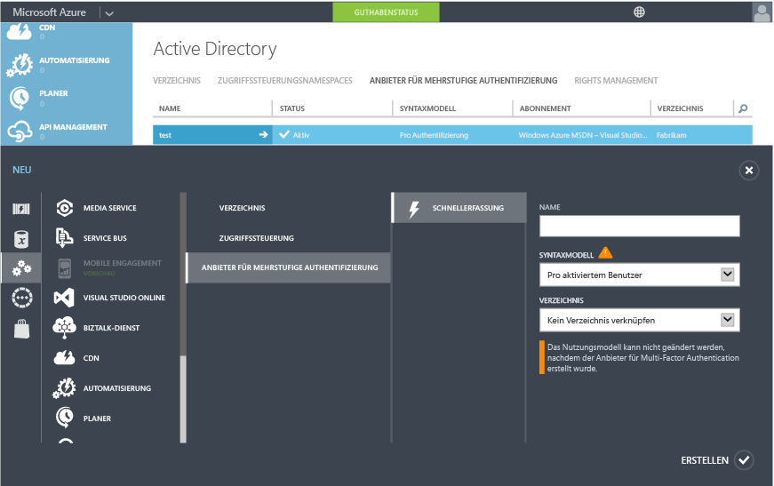
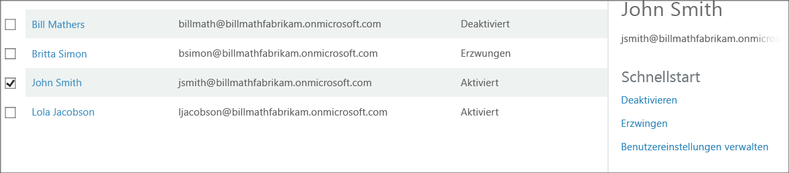

<properties 
	pageTitle="Erste Schritte mit Azure Multi-Factor Authentication in der Cloud" 
	description="Auf dieser Seite zur Azure Multi-Factor Authentication werden die ersten Schritte mit Azure MFA in der Cloud beschrieben." 
	services="multi-factor-authentication" 
	documentationCenter="" 
	authors="billmath" 
	manager="swadhwa" 
	editor="curtand"/>

<tags 
	ms.service="multi-factor-authentication" 
	ms.workload="identity" 
	ms.tgt_pltfrm="na" 
	ms.devlang="na" 
	ms.topic="article" 
	ms.date="07/02/2015" 
	ms.author="billmath"/>

# Erste Schritte mit Azure Multi-Factor Authentication in der Cloud

Nachdem Sie sich nun für die Multi-Factor Authentication in der Cloud entschieden haben, können Sie mit der Einrichtung fortfahren. Wenn Sie Multi-Factor Authentication für Office 365 oder Multi-Factor Authentication für Azure-Administratoren verwenden, können Sie mit Schritt 3 fortfahren. Außerdem wird in diesem Dokument Folgendes behandelt:

1. **Anmelden für ein Azure-Abonnement**
	- Falls Sie noch nicht über ein Azure-Abonnement verfügen, müssen Sie sich für ein Abonnement registrieren. Wenn Sie sich in der Anlaufphase befinden und die Verwendung von Azure MFA erkunden, können Sie ein Testabonnement verwenden.
2. **Erstellen eines Anbieters für mehrstufige Authentifizierung oder Zuweisen einer Azure AD Premium- oder Enterprise Mobility Suite-Lizenz zu Benutzern **
	- Sie müssen einen Anbieter für die mehrstufige Authentifizierung in Azure erstellen und diesen Ihrem Verzeichnis zuweisen oder den Azure AD Premium- oder EMS-Benutzern Lizenzen zuweisen. Azure Multi-Factor Authentication ist in Azure Active Directory Premium inbegriffen und somit auch in der Enterprise Mobility Suite enthalten. Wenn Sie über Azure AD Premium oder EMS verfügen, müssen Sie keinen Anbieter für mehrstufige Authentifizierung erstellen. Statt MFA für einen Azure AD Premium- oder EMS-Benutzer zu aktivieren, muss diesem Benutzer eine Azure AD Premium- oder EMS-Lizenz zugewiesen werden. Anschließend kann ein Administrator dem Benutzer über das Verwaltungsportal MFA zuweisen. Informationen zum Zuweisen von Lizenzen zu Benutzern finden Sie im folgenden Abschnitt.
3. **Aktivieren von Multi-Factor Authentication für die Benutzer** 
	- Aktivieren Sie MFA für die Benutzer über das Office 365- oder das Azure-Portal. Informationen zur Vorgehensweise finden Sie im folgenden Abschnitt.
4. **Senden einer E-Mail an Endbenutzer mit einer Benachrichtigung über MFA**
	- Sobald Multi-Factor Authentication für das Konto eines Benutzers aktiviert wurde, sollte diesem eine E-Mail mit einer entsprechenden Benachrichtigung gesendet werden. Der Benutzer wird beim nächsten Anmelden aufgefordert, den Vorgang abzuschließen, und durch die Benachrichtigung wird er hierüber informiert. Im folgenden Abschnitt finden Sie eine Beispielvorlage für eine solche E-Mail.

## Erstellen eines Anbieters für die mehrstufige Authentifizierung in Azure
Multi-Factor Authentication ist standardmäßig für globale Administratoren verfügbar, die über einen Azure Active Directory-Mandanten verfügen. Wenn Sie jedoch Multi-Factor Authentication für alle Benutzer verfügbar machen möchten und/oder wenn Sie möchten, dass die globalen Administratoren Features wie das Verwaltungsportal, benutzerdefinierte Grußformeln und Berichte nutzen können, müssen Sie einen Anbieter für mehrstufige Authentifizierung erwerben und konfigurieren.

### So erstellen Sie einen Anbieter für mehrstufige Authentifizierung
--------------------------------------------------------------------------------

1. Melden Sie sich beim Azure-Portal als Administrator an.
2. Wählen Sie im linken Bereich "Active Directory" aus.
3. Wählen Sie auf der Seite "Active Directory" oben "Anbieter für mehrstufige Authentifizierung" aus. Klicken Sie dann unten auf **Neu**.
4. Wählen Sie unter "App Services" den Eintrag "Aktive Authentifizierungsanbieter" aus, und wählen Sie dann "Schnellerfassung".
5. Füllen Sie die folgenden Felder aus, und wählen Sie "Erstellen" aus.
	1. Name: Der Name des aktiven Authentifizierungsanbieters.
	2. Nutzungsmodell: Das Nutzungsmodell des Anbieters für mehrstufige Authentifizierung.
		- Pro Authentifizierung: Ein Kaufmodell, bei dem die Kosten pro Authentifizierung berechnet werden. Wird in der Regel für Szenarien verwendet, in denen Azure Multi-Factor Authentication in einer Anwendung verwendet wird.
		- Pro aktiviertem Benutzer: Ein Kaufmodell, bei dem die Kosten pro aktiviertem Benutzer berechnet werden. Wird in der Regel für Szenarien wie Office 365 verwendet.
	2. Verzeichnis: Der Azure Active Directory-Mandant, dem der Anbieter für mehrstufige Authentifizierung zugeordnet ist. Bedenken Sie dabei Folgendes:
		- Zum Erstellen eines Anbieters für mehrstufige Authentifizierung benötigen Sie kein Azure AD-Verzeichnis. Dieses kann leer gelassen werden, wenn Sie nur den Azure Multi-Factor Authentication-Server oder das Azure Multi-Factor Authentication-SDK verwenden möchten.
		- Wenn Sie jedoch Multi-Factor Authentication für alle Benutzer verfügbar machen möchten und/oder wenn Sie möchten, dass die globalen Administratoren Features wie das Verwaltungsportal, benutzerdefinierte Grußformeln und Berichte nutzen können, müssen Sie den Anbieter für mehrstufige Authentifizierung einem Azure AD-Verzeichnis zuordnen.
		- DirSync oder AAD ist nur erforderlich, wenn Sie Ihre lokale Active Directory-Umgebung mit einem Azure AD-Verzeichnis synchronisieren. Wenn Sie nur ein Azure AD-Verzeichnis verwenden, das nicht mit einer lokalen Instanz von Active Directory synchronisiert ist, benötigen Sie weder DirSync noch AAD Sync.
		

5. Nach dem Klicken auf "Erstellen" wird der Anbieter für mehrstufige Synchronisierung erstellt, und es wird die folgende Meldung angezeigt: "Der Anbieter für die mehrstufige Authentifizierung wurde erfolgreich erstellt." Klicken Sie auf "OK".

## Zuweisen einer Azure AD Premium- oder Enterprise Mobility Suite-Lizenz zu Benutzern

Wenn Sie über Azure AD Premium oder die Enterprise Mobility Suite verfügen, müssen Sie keinen Anbieter für mehrstufige Authentifizierung erstellen. Sie müssen lediglich einem Benutzer eine Lizenz zuweisen, und anschließend können Sie MFA für Benutzer aktivieren.

### So weisen Sie eine Azure AD Premium- oder Enterprise Mobility Suite-Lizenz zu
--------------------------------------------------------------------------------
<ol>

<li>Melden Sie sich beim Azure-Portal als Administrator an.</li>
<li>Wählen Sie im linken Bereich **Active Directory** aus.</li>
<li>Doppelklicken Sie auf der Seite "Active Directory" auf das Verzeichnis mit den Benutzern, die Sie aktivieren möchten.</li>
<li>Wählen Sie oben auf der Seite des Verzeichnisses die Option **Lizenzen** aus.</li>
<li>Wählen Sie auf der Seite "Lizenzen" die Option "Active Directory Premium" oder "Enterprise Mobility Suite" aus, und klicken Sie dann auf **Zuweisen**.</li>

<li>Wählen Sie im Dialogfeld die Benutzer aus, denen Sie Lizenzen zuweisen möchten, und klicken Sie dann auf das Häkchen, um die Änderungen zu speichern.</li>

## Aktivieren von Multi-Factor Authentication für Benutzer

Benutzerkonten in Azure Multi-Factor Authentication können die folgenden drei Zustände aufweisen:

Zustand | Beschreibung |Nicht-Browser-Apps betroffen| Hinweise 
:-------------: | :-------------: |:-------------: |:-------------: |
Deaktiviert | Der Standardzustand für einen neuen Benutzer, der nicht für Multi-Factor Authentication registriert ist.|Nein|Der Benutzer verwendet derzeit keine Multi-Factor Authentication.
Aktiviert |Der Benutzer wurde für Multi-Factor Authentication registriert.|Nein. Sie werden weiterhin ausgeführt, bis die Registrierung abgeschlossen ist.|Der Benutzer ist aktiviert, seine Registrierung ist jedoch nicht abgeschlossen. Er wird beim nächsten Anmelden aufgefordert, den Vorgang abzuschließen.
Erzwungen|Der Benutzer wurde registriert und hat die Registrierung für die Verwendung von Multi-Factor Authentication abgeschlossen.|Ja. Sie funktionieren erst, wenn App-Kennwörter erstellt und verwendet werden. | Der Benutzer hat die Registrierung abgeschlossen oder nicht abgeschlossen. Wenn er die Registrierung abgeschlossen hat, verwendet er anschließend Multi-Factor Authentication. Andernfalls wird der Benutzer beim nächsten Anmelden aufgefordert, den Vorgang abzuschließen.
Da wir jetzt über einen Authentifizierungsanbieter verfügen oder den Benutzern Lizenzen zugewiesen haben, ist der nächste Schritt das Aktivieren von MFA für die Benutzer im Verzeichnis. Gehen Sie wie folgt vor, um MFA für die Benutzer zu aktivieren.

### So aktivieren Sie Multi-Factor Authentication
--------------------------------------------------------------------------------
1.  Melden Sie sich beim Azure-Verwaltungsportal als Administrator an.
2.  Klicken Sie im linken Bereich auf "Active Directory".
3.  Klicken Sie unter "Verzeichnis" auf das Verzeichnis für den Benutzer, dem Sie die Erlaubnis erteilen möchten.
4.  Klicken Sie oben auf "Benutzer".
5.  Klicken Sie unten auf der Seite auf "Verwalten der Multi-Factor Authentication".
6.  Suchen Sie den Benutzer, für den Sie Multi-Factor Authentication aktivieren möchten. Sie müssen möglicherweise oben die Ansicht ändern. Stellen Sie sicher, dass der Status des Benutzers "Deaktiviert" lautet, und aktivieren Sie das Kontrollkästchen neben seinem Namen.
7.  Hierdurch werden rechts zwei Optionen angezeigt: "Aktivieren" und "Benutzereinstellungen verwalten". Klicken Sie auf "Aktivieren". Hierdurch wird ein Popupfenster angezeigt, in dem die nächsten Schritte angegeben werden, die Sie für die Benutzer ausführen müssen. Klicken Sie auf "Multi-Factor Authentication aktivieren".
8.  Nachdem Sie die Benutzer aktiviert haben, sollten Sie ihnen eine E-Mail senden, um sie zu informieren, wie sie ihre Nicht-Browser-Apps verwenden können und verhindern, dass sie gesperrt werden.

Um den Status des Benutzers mithilfe von Windows PowerShell zu ändern, können Sie wie folgt vorgehen. Sie können `$st.State` in einen der oben genannten Status ändern.

		$st = New-Object -TypeName Microsoft.Online.Administration.StrongAuthenticationRequirement
		$st.RelyingParty = "*"
		$st.State = “Enabled”
		$sta = @($st)
		Set-MsolUser -UserPrincipalName bsimon@contoso.com -StrongAuthenticationRequirements $sta

## Senden einer E-Mail an Endbenutzer

Nachdem Sie die Benutzer aktiviert haben, sollten Sie ihnen eine E-Mail senden, um sie zu informieren, dass sie ihre Kontaktinformationen angeben müssen. Nachfolgend wird eine E-Mail-Vorlage gezeigt, die verwendet werden kann und die einen Link zu einem Video enthält, das von den Benutzern betrachtet werden kann.

		Subject: ACTION REQUIRED: Your password for Outlook and other apps needs updated

		Body:

		For added security, we have enabled multi-factor authentication for your account. 

		Action Required: You will need to complete the enrollment steps below to make your account secure with multi-factor authentication.  

		What to expect once MFA is enabled:

		Multi-factor authentication requires a password that you know and a phone that you have in order to sign into browser applications and to access Office 365, Azure portals.

		For Office 365 non-browser applications such as outlook, lync, a mail client on your mobile device etc, a special password called an app password is required instead of your account password to sign in. App passwords are different than your account password, and are generated during the multi-factor authentication set up process. 

		Please follow these enrollment steps to avoid interruption of your Office 365 service:

			1.  Sign in to the Office 365 Portal at http://portal.microsoftonline.com.
			2.  Follow the instructions to set up your preferred multi-factor authentication method when signing into Office 365 using a web browser. 
			3.  Create one app password for each device.
			4.  Enter the same app password in all applicable apps on that device e.g. Outlook, Mail client, Lync, Word, Powerpoint, Excel, CRM etc. 
			5.  Update your Office client applications or other mobile applications to use an app password.

		You can visit http://aka.ms/mfasetup to create app passwords or change your MFA Setting.  Please bookmark this.

		NOTE: Before entering an app password, you will need to clear the sign-in information (delete sign-in info), restart the application,   and sign-in with the username and app password. Follow the steps documented : http://technet.microsoft.com/library/dn270518.aspx#apppassword.

		Watch a video showing these steps at http://g.microsoftonline.com/1AX00en/175.

		Best Regards,
		Your Administrator

## Nächste Schritte
Nachdem Sie jetzt Multi-Factor Authentication in der Cloud eingerichtet haben, können Sie mit [Konfigurieren von Azure Multi-Factor Authentication](multi-factor-authentication-whats-next.md) fortfahren. In diesem Thema erhalten Sie Informationen über Berichterstellung, Betrugswarnungen, das Anpassen von Sprachnachrichten und alle Features von Azure Multi-Factor Authentication.

<!---HONumber=July15_HO4-->